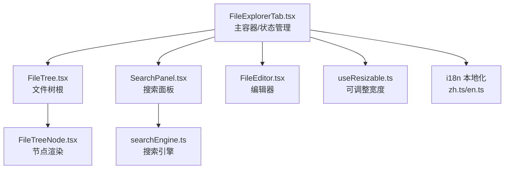
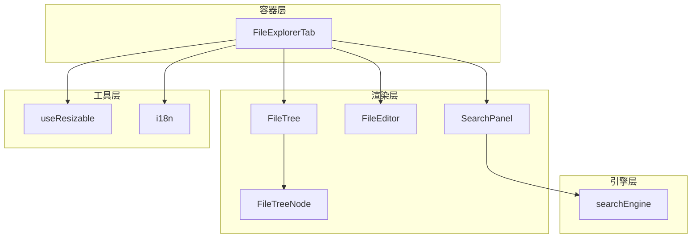
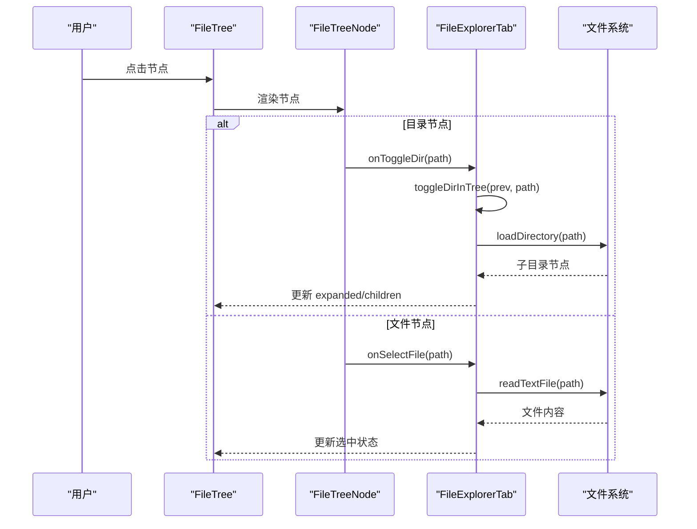
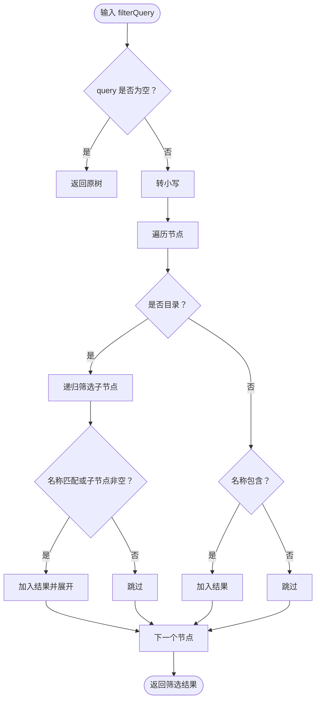
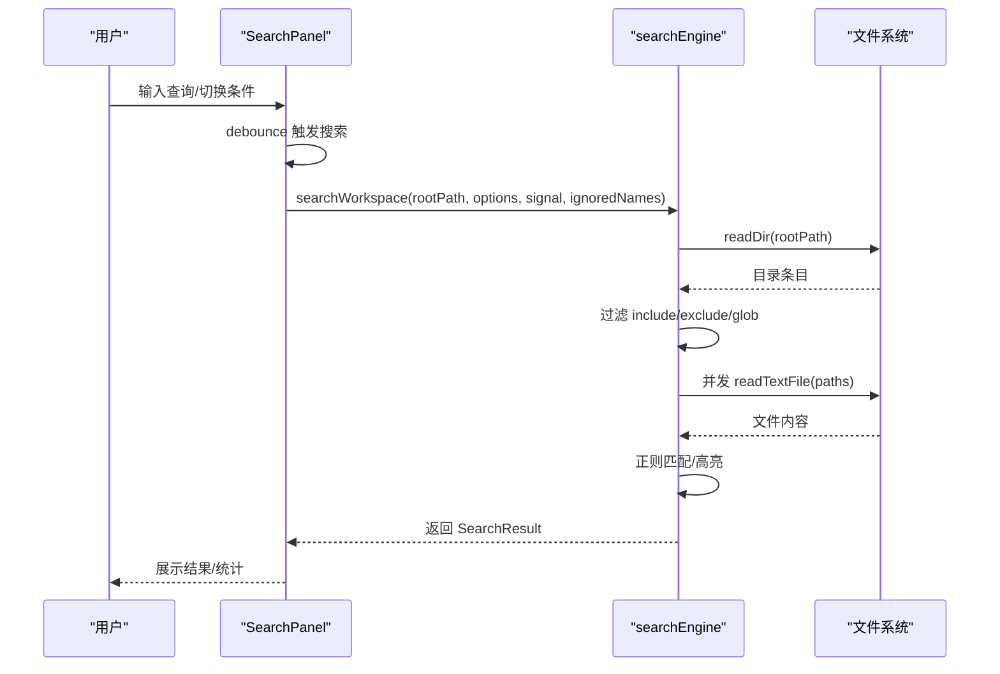
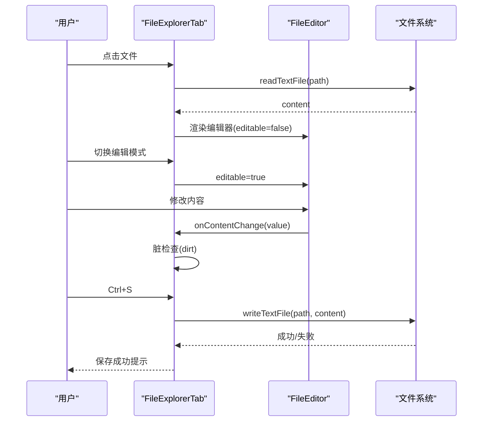
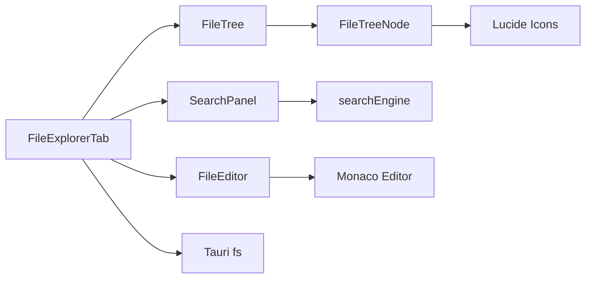

# 文件浏览器

<cite>
**本文引用的文件**
- [FileTree.tsx](file://src/components/files/FileTree.tsx)
- [FileTreeNode.tsx](file://src/components/files/FileTreeNode.tsx)
- [types.ts](file://src/components/files/types.ts)
- [searchEngine.ts](file://src/components/files/searchEngine.ts)
- [SearchPanel.tsx](file://src/components/files/SearchPanel.tsx)
- [FileExplorerTab.tsx](file://src/components/files/FileExplorerTab.tsx)
- [FileEditor.tsx](file://src/components/files/FileEditor.tsx)
- [useResizable.ts](file://src/hooks/useResizable.ts)
- [zh.ts](file://src/i18n/locales/zh.ts)
- [en.ts](file://src/i18n/locales/en.ts)
</cite>

## 目录
1. [简介](#简介)
2. [项目结构](#项目结构)
3. [核心组件](#核心组件)
4. [架构总览](#架构总览)
5. [详细组件分析](#详细组件分析)
6. [依赖关系分析](#依赖关系分析)
7. [性能考量](#性能考量)
8. [故障排查指南](#故障排查指南)
9. [结论](#结论)
10. [附录](#附录)

## 简介
本文件浏览器组件是 RabbitCoding 的核心文件管理与编辑模块，提供：
- 文件树渲染与懒加载
- 目录展开/折叠与路径显示
- 文件筛选与搜索（全文检索、正则/全字匹配、大小写敏感）
- 文件编辑（基于 Monaco Editor，支持多语言）
- 状态管理、事件处理与性能优化
- 国际化与样式定制

## 项目结构
文件浏览器位于 src/components/files 下，主要由以下文件组成：
- FileExplorerTab.tsx：主容器，负责状态管理、事件处理、面板切换与懒加载
- FileTree.tsx：文件树根组件，渲染节点列表
- FileTreeNode.tsx：单个节点渲染，含图标映射、相对路径显示、展开/折叠
- types.ts：文件树节点类型定义
- SearchPanel.tsx：搜索面板，提供搜索条件、结果展示与高亮
- searchEngine.ts：搜索引擎，包含文件收集、并发读取、匹配算法与限制
- FileEditor.tsx：文件编辑器，基于 Monaco Editor，支持语言识别与主题
- useResizable.ts：可调整宽度 Hook，用于左右分栏布局
- i18n 本地化：中文/英文文案

图表来源
- [FileExplorerTab.tsx:111-490](file://src/components/files/FileExplorerTab.tsx#L111-L490)
- [FileTree.tsx:13-39](file://src/components/files/FileTree.tsx#L13-L39)
- [FileTreeNode.tsx:72-165](file://src/components/files/FileTreeNode.tsx#L72-L165)
- [SearchPanel.tsx:129-410](file://src/components/files/SearchPanel.tsx#L129-L410)
- [searchEngine.ts:261-330](file://src/components/files/searchEngine.ts#L261-L330)
- [FileEditor.tsx:121-182](file://src/components/files/FileEditor.tsx#L121-L182)
- [useResizable.ts:17-95](file://src/hooks/useResizable.ts#L17-L95)
- [zh.ts:114-148](file://src/i18n/locales/zh.ts#L114-L148)
- [en.ts:114-148](file://src/i18n/locales/en.ts#L114-L148)

章节来源
- [FileExplorerTab.tsx:111-490](file://src/components/files/FileExplorerTab.tsx#L111-L490)
- [FileTree.tsx:13-39](file://src/components/files/FileTree.tsx#L13-L39)
- [FileTreeNode.tsx:72-165](file://src/components/files/FileTreeNode.tsx#L72-L165)
- [SearchPanel.tsx:129-410](file://src/components/files/SearchPanel.tsx#L129-L410)
- [searchEngine.ts:261-330](file://src/components/files/searchEngine.ts#L261-L330)
- [FileEditor.tsx:121-182](file://src/components/files/FileEditor.tsx#L121-L182)
- [useResizable.ts:17-95](file://src/hooks/useResizable.ts#L17-L95)
- [zh.ts:114-148](file://src/i18n/locales/zh.ts#L114-L148)
- [en.ts:114-148](file://src/i18n/locales/en.ts#L114-L148)

## 核心组件
- FileExplorerTab：主容器，维护文件树、选中文件、编辑状态、面板状态、筛选与刷新等状态；负责懒加载、事件回调与面板切换。
- FileTree：接收节点数组，渲染根级节点列表。
- FileTreeNode：单节点渲染，含图标映射、相对路径显示、展开/折叠动画、点击事件。
- SearchPanel：搜索条件输入、结果展示、高亮渲染、展开/收起替换与搜索详情。
- searchEngine：搜索引擎，包含文件收集、并发读取、匹配算法、阈值控制与错误处理。
- FileEditor：基于 Monaco Editor 的编辑器，语言识别、主题适配、只读/可编辑切换。
- useResizable：可调整宽度 Hook，支持最小/最大宽度、比例上限、本地存储与拖拽。

章节来源
- [FileExplorerTab.tsx:111-490](file://src/components/files/FileExplorerTab.tsx#L111-L490)
- [FileTree.tsx:13-39](file://src/components/files/FileTree.tsx#L13-L39)
- [FileTreeNode.tsx:72-165](file://src/components/files/FileTreeNode.tsx#L72-L165)
- [SearchPanel.tsx:129-410](file://src/components/files/SearchPanel.tsx#L129-L410)
- [searchEngine.ts:261-330](file://src/components/files/searchEngine.ts#L261-L330)
- [FileEditor.tsx:121-182](file://src/components/files/FileEditor.tsx#L121-L182)
- [useResizable.ts:17-95](file://src/hooks/useResizable.ts#L17-L95)

## 架构总览
文件浏览器采用“容器组件 + 渲染组件 + 引擎组件”的分层架构：
- 容器层：FileExplorerTab 统一管理状态与事件，协调文件树、搜索面板与编辑器。
- 渲染层：FileTree/ FileTreeNode 负责 UI 渲染与用户交互；FileEditor 提供编辑体验。
- 引擎层：searchEngine 提供搜索能力，包含文件收集、并发读取与匹配算法。
- 工具层：useResizable 提供可调整宽度能力；i18n 提供多语言支持。

图表来源
- [FileExplorerTab.tsx:111-490](file://src/components/files/FileExplorerTab.tsx#L111-L490)
- [FileTree.tsx:13-39](file://src/components/files/FileTree.tsx#L13-L39)
- [FileTreeNode.tsx:72-165](file://src/components/files/FileTreeNode.tsx#L72-L165)
- [SearchPanel.tsx:129-410](file://src/components/files/SearchPanel.tsx#L129-L410)
- [searchEngine.ts:261-330](file://src/components/files/searchEngine.ts#L261-L330)
- [FileEditor.tsx:121-182](file://src/components/files/FileEditor.tsx#L121-L182)
- [useResizable.ts:17-95](file://src/hooks/useResizable.ts#L17-L95)
- [zh.ts:114-148](file://src/i18n/locales/zh.ts#L114-L148)
- [en.ts:114-148](file://src/i18n/locales/en.ts#L114-L148)

## 详细组件分析

### 文件树渲染与懒加载
- FileTree：接收节点数组与回调，渲染根级节点列表；当 nodes 为空时显示“空目录”提示。
- FileTreeNode：负责单节点渲染，包含：
  - 图标映射：根据文件名/扩展名映射到不同图标与颜色。
  - 相对路径显示：在筛选模式下显示相对目录路径。
  - 展开/折叠：目录节点点击触发 onToggleDir；文件节点点击触发 onSelectFile。
  - 子节点渲染：展开状态下递归渲染子节点，深度通过 depth 控制缩进。
- 懒加载：FileExplorerTab 中 toggleDirInTree 递归查找目标节点，若未展开且子节点为空，则异步加载子目录并更新 expanded/children。

图表来源
- [FileTree.tsx:13-39](file://src/components/files/FileTree.tsx#L13-L39)
- [FileTreeNode.tsx:72-165](file://src/components/files/FileTreeNode.tsx#L72-L165)
- [FileExplorerTab.tsx:80-109](file://src/components/files/FileExplorerTab.tsx#L80-L109)
- [FileExplorerTab.tsx:32-50](file://src/components/files/FileExplorerTab.tsx#L32-L50)

章节来源
- [FileTree.tsx:13-39](file://src/components/files/FileTree.tsx#L13-L39)
- [FileTreeNode.tsx:72-165](file://src/components/files/FileTreeNode.tsx#L72-L165)
- [FileExplorerTab.tsx:80-109](file://src/components/files/FileExplorerTab.tsx#L80-L109)
- [FileExplorerTab.tsx:32-50](file://src/components/files/FileExplorerTab.tsx#L32-L50)

### 文件筛选与路径显示
- 筛选：FileExplorerTab 维护 filterQuery，通过 filterTree 递归筛选节点，命中文件或子树时强制展开。
- 路径显示：FileTreeNode 在 showPath 为真且节点为目录时计算相对路径（基于 workspacePath），并在节点右侧显示相对目录部分。

图表来源
- [FileExplorerTab.tsx:52-69](file://src/components/files/FileExplorerTab.tsx#L52-L69)
- [FileTreeNode.tsx:84-92](file://src/components/files/FileTreeNode.tsx#L84-L92)

章节来源
- [FileExplorerTab.tsx:52-69](file://src/components/files/FileExplorerTab.tsx#L52-L69)
- [FileTreeNode.tsx:84-92](file://src/components/files/FileTreeNode.tsx#L84-L92)

### 搜索功能与全文检索
- 搜索面板：SearchPanel 提供查询输入、大小写敏感、全词匹配、正则开关、包含/排除模式、展开/收起替换与搜索详情。
- 搜索引擎：searchEngine
  - 文件收集：递归遍历工作区，跳过忽略项与二进制文件，限制最大文件数。
  - 过滤：支持 include/exclude glob 模式，exclude 优先。
  - 并发读取：使用并发池限制同时读取数量，避免阻塞。
  - 匹配：构建正则（支持转义、全字匹配、大小写敏感），逐行扫描，限制每文件最大匹配数。
  - 结果：返回每个文件的匹配行及预览，汇总总数与截断标记。

图表来源
- [SearchPanel.tsx:152-206](file://src/components/files/SearchPanel.tsx#L152-L206)
- [searchEngine.ts:261-330](file://src/components/files/searchEngine.ts#L261-L330)
- [searchEngine.ts:202-237](file://src/components/files/searchEngine.ts#L202-L237)
- [searchEngine.ts:294-320](file://src/components/files/searchEngine.ts#L294-L320)
- [searchEngine.ts:158-191](file://src/components/files/searchEngine.ts#L158-L191)

章节来源
- [SearchPanel.tsx:152-206](file://src/components/files/SearchPanel.tsx#L152-L206)
- [searchEngine.ts:261-330](file://src/components/files/searchEngine.ts#L261-L330)
- [searchEngine.ts:202-237](file://src/components/files/searchEngine.ts#L202-L237)
- [searchEngine.ts:294-320](file://src/components/files/searchEngine.ts#L294-L320)
- [searchEngine.ts:158-191](file://src/components/files/searchEngine.ts#L158-L191)

### 文件编辑器与交互
- FileEditor：基于 Monaco Editor，本地 Worker 部署，支持多语言识别与主题切换；可配置只读/可编辑、行号、自动布局等。
- FileExplorerTab：维护编辑状态（预览/编辑）、脏检查、保存流程；支持快捷键保存与“已保存”提示。

图表来源
- [FileExplorerTab.tsx:220-245](file://src/components/files/FileExplorerTab.tsx#L220-L245)
- [FileExplorerTab.tsx:247-266](file://src/components/files/FileExplorerTab.tsx#L247-L266)
- [FileEditor.tsx:121-182](file://src/components/files/FileEditor.tsx#L121-L182)

章节来源
- [FileExplorerTab.tsx:220-245](file://src/components/files/FileExplorerTab.tsx#L220-L245)
- [FileExplorerTab.tsx:247-266](file://src/components/files/FileExplorerTab.tsx#L247-L266)
- [FileEditor.tsx:121-182](file://src/components/files/FileEditor.tsx#L121-L182)

### 状态管理与事件处理
- 状态：FileExplorerTab 维护 treeData、selectedFilePath、fileContent、panelState、filterQuery、编辑状态等。
- 事件：handleToggleDir、handleSelectFile、handleCollapseAll、handleRefresh、handleSave 等；键盘事件监听保存。
- 面板切换：tree/search/hidden 三态切换；左侧面板可隐藏；右侧编辑器懒加载。

章节来源
- [FileExplorerTab.tsx:111-490](file://src/components/files/FileExplorerTab.tsx#L111-L490)

### 性能优化策略
- 懒加载：目录展开时才加载子节点，避免一次性渲染大量节点。
- 并发读取：searchEngine 使用并发池限制同时读取数量，降低 IO 压力。
- 限制与截断：限制最大文件数、单文件最大匹配数、大文件阈值，防止内存与 CPU 泄漏。
- UI 优化：FileTreeNode 使用 memo 包装减少重渲染；FileTree/ FileTreeNode 通过深度控制缩进，避免深层递归导致的渲染成本过高。
- 可调整宽度：useResizable 支持最小/最大宽度与比例上限，结合本地存储持久化宽度。

章节来源
- [FileTreeNode.tsx:72-165](file://src/components/files/FileTreeNode.tsx#L72-L165)
- [searchEngine.ts:294-320](file://src/components/files/searchEngine.ts#L294-L320)
- [useResizable.ts:17-95](file://src/hooks/useResizable.ts#L17-L95)

## 依赖关系分析
- 组件依赖：FileExplorerTab 依赖 FileTree、SearchPanel、FileEditor；FileTree 依赖 FileTreeNode；SearchPanel 依赖 searchEngine。
- 外部依赖：Monaco Editor（本地 Worker）、Tauri fs 插件（读取目录/文件）、Lucide 图标库。
- 数据结构：FileNode 定义了节点的基本属性（名称、路径、是否目录、子节点、展开/加载状态）。

图表来源
- [FileExplorerTab.tsx:111-490](file://src/components/files/FileExplorerTab.tsx#L111-L490)
- [FileTree.tsx:13-39](file://src/components/files/FileTree.tsx#L13-L39)
- [FileTreeNode.tsx:72-165](file://src/components/files/FileTreeNode.tsx#L72-L165)
- [SearchPanel.tsx:129-410](file://src/components/files/SearchPanel.tsx#L129-L410)
- [searchEngine.ts:261-330](file://src/components/files/searchEngine.ts#L261-L330)
- [FileEditor.tsx:121-182](file://src/components/files/FileEditor.tsx#L121-L182)

章节来源
- [FileExplorerTab.tsx:111-490](file://src/components/files/FileExplorerTab.tsx#L111-L490)
- [FileTree.tsx:13-39](file://src/components/files/FileTree.tsx#L13-L39)
- [FileTreeNode.tsx:72-165](file://src/components/files/FileTreeNode.tsx#L72-L165)
- [SearchPanel.tsx:129-410](file://src/components/files/SearchPanel.tsx#L129-L410)
- [searchEngine.ts:261-330](file://src/components/files/searchEngine.ts#L261-L330)
- [FileEditor.tsx:121-182](file://src/components/files/FileEditor.tsx#L121-L182)

## 性能考量
- 目录懒加载：仅在展开时加载子节点，避免初始渲染压力。
- 搜索并发：限制并发读取数量，避免大量文件同时读取造成卡顿。
- 匹配限制：单文件最大匹配数与全局文件数上限，防止超大工程搜索耗尽资源。
- UI 渲染：memo 包装与深度缩进控制，减少不必要的重渲染。
- 布局：可调整宽度与最小/最大宽度限制，提升用户体验与性能稳定性。

章节来源
- [FileTreeNode.tsx:72-165](file://src/components/files/FileTreeNode.tsx#L72-L165)
- [searchEngine.ts:294-320](file://src/components/files/searchEngine.ts#L294-L320)
- [useResizable.ts:17-95](file://src/hooks/useResizable.ts#L17-L95)

## 故障排查指南
- 无法加载文件树：检查工作区路径是否存在；确认权限；查看控制台错误日志。
- 搜索无结果：确认查询是否为空；检查 include/exclude 模式是否正确；查看是否被截断。
- 文件过大无法预览：超过 1MB 的文件会被拒绝读取；建议使用外部工具或在编辑器中打开。
- 二进制文件无法读取：读取失败时会提示“无法读取此文件（可能为二进制文件）”。
- 保存失败：检查文件权限与磁盘空间；查看控制台错误日志。
- 搜索中断：支持 AbortController 中断上一次搜索；确保组件卸载时清理定时器与控制器。

章节来源
- [FileExplorerTab.tsx:154-188](file://src/components/files/FileExplorerTab.tsx#L154-L188)
- [FileExplorerTab.tsx:220-245](file://src/components/files/FileExplorerTab.tsx#L220-L245)
- [SearchPanel.tsx:152-206](file://src/components/files/SearchPanel.tsx#L152-L206)
- [searchEngine.ts:261-330](file://src/components/files/searchEngine.ts#L261-L330)

## 结论
文件浏览器组件通过清晰的分层架构与完善的性能策略，提供了稳定高效的文件浏览、筛选、搜索与编辑体验。其懒加载、并发读取与匹配限制等机制有效应对大型工程场景；国际化与可调整宽度等交互细节提升了可用性与可定制性。

## 附录

### 配置选项与交互行为
- FileExplorerTab
  - editable：是否允许编辑
  - autoOpenFileName：启动时自动打开的文件名
  - 面板状态：tree/search/hidden
  - 筛选：filterQuery
  - 刷新：handleRefresh
  - 全部折叠：handleCollapseAll
- FileTree
  - nodes：节点数组
  - selectedPath：当前选中路径
  - onSelectFile/onToggleDir：回调
  - showPath/workspacePath：路径显示相关
- SearchPanel
  - 查询条件：query/isCaseSensitive/isWholeWord/isRegex/includePattern/excludePattern
  - 替换：replaceValue
  - 搜索详情：include/exclude 模式
- FileEditor
  - filePath/content/loading/error/editable
  - 语言识别与主题

章节来源
- [FileExplorerTab.tsx:25-29](file://src/components/files/FileExplorerTab.tsx#L25-L29)
- [FileTree.tsx:4-11](file://src/components/files/FileTree.tsx#L4-L11)
- [SearchPanel.tsx:24-27](file://src/components/files/SearchPanel.tsx#L24-L27)
- [FileEditor.tsx:37-44](file://src/components/files/FileEditor.tsx#L37-L44)

### 样式定制与国际化
- 样式：组件内部使用 Tailwind 类名，可通过覆盖类名或主题变量进行定制。
- 国际化：通过 useI18n 获取文案，支持中文/英文；文案位于 i18n/locales 下。

章节来源
- [zh.ts:114-148](file://src/i18n/locales/zh.ts#L114-L148)
- [en.ts:114-148](file://src/i18n/locales/en.ts#L114-L148)

### 最佳实践
- 大型工程：开启筛选与搜索，避免一次性展开所有目录；合理设置 include/exclude 模式。
- 编辑：使用快捷键保存；注意大文件与二进制文件的读取限制。
- 布局：利用可调整宽度提升阅读体验；必要时隐藏左侧面板以获得更大编辑区域。
- 性能：避免同时进行多个重型操作（如频繁刷新与搜索），等待前一次操作完成。