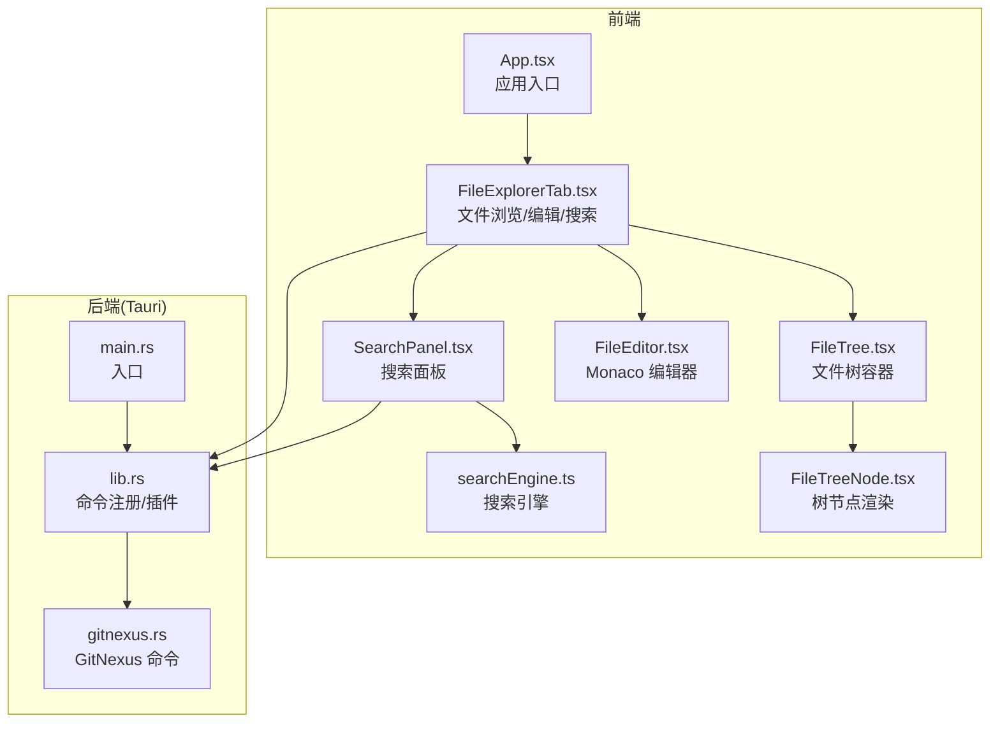
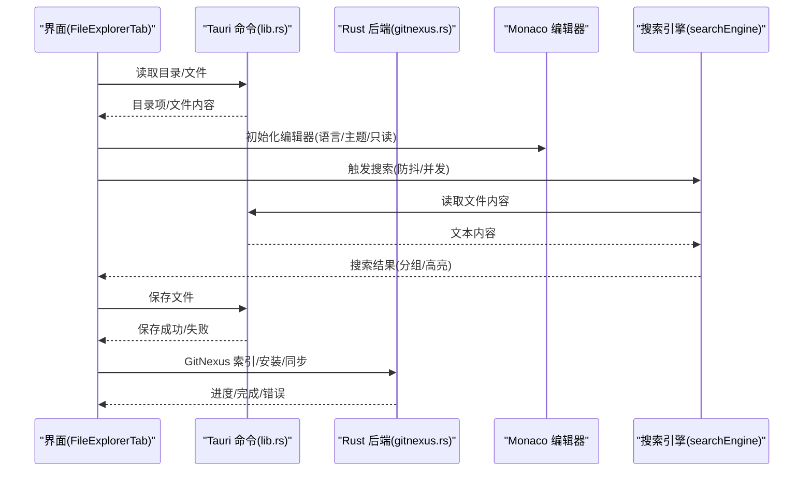
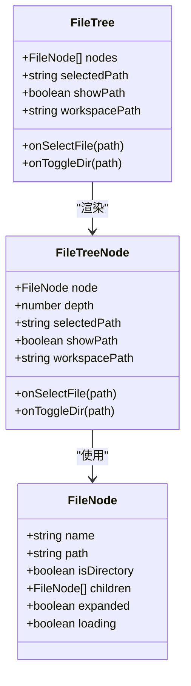
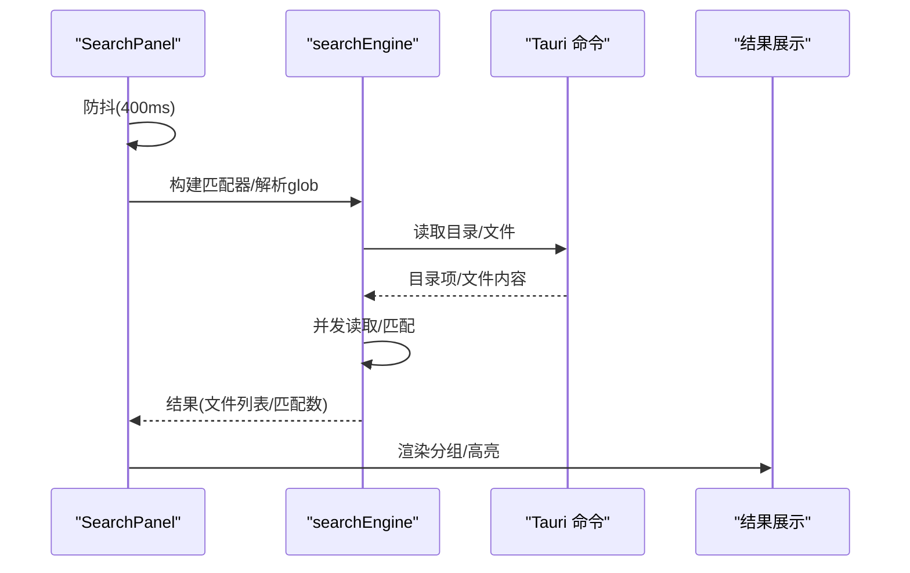
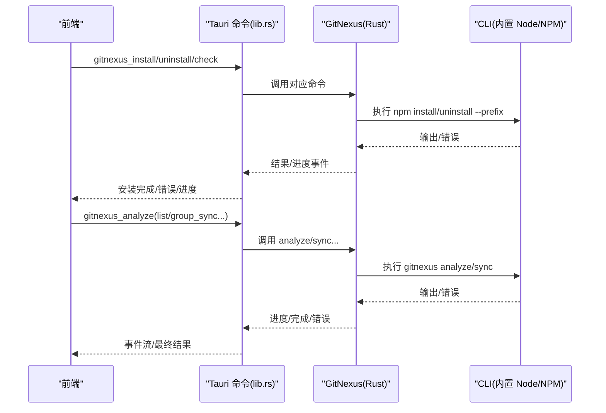
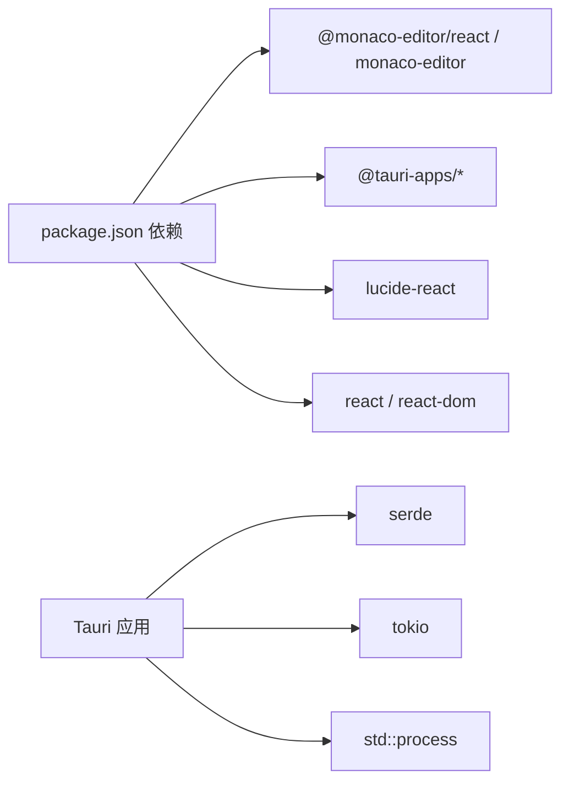

# 文件管理系统

<cite>
**本文引用的文件**
- [README.md](file://README.md)
- [package.json](file://package.json)
- [src/App.tsx](file://src/App.tsx)
- [src/components/files/FileExplorerTab.tsx](file://src/components/files/FileExplorerTab.tsx)
- [src/components/files/FileTree.tsx](file://src/components/files/FileTree.tsx)
- [src/components/files/FileTreeNode.tsx](file://src/components/files/FileTreeNode.tsx)
- [src/components/files/FileEditor.tsx](file://src/components/files/FileEditor.tsx)
- [src/components/files/SearchPanel.tsx](file://src/components/files/SearchPanel.tsx)
- [src/components/files/searchEngine.ts](file://src/components/files/searchEngine.ts)
- [src/components/files/types.ts](file://src/components/files/types.ts)
- [src-tauri/src/lib.rs](file://src-tauri/src/lib.rs)
- [src-tauri/src/gitnexus.rs](file://src-tauri/src/gitnexus.rs)
- [src-tauri/src/main.rs](file://src-tauri/src/main.rs)
</cite>

## 目录
1. [简介](#简介)
2. [项目结构](#项目结构)
3. [核心组件](#核心组件)
4. [架构总览](#架构总览)
5. [详细组件分析](#详细组件分析)
6. [依赖关系分析](#依赖关系分析)
7. [性能考量](#性能考量)
8. [故障排查指南](#故障排查指南)
9. [结论](#结论)
10. [附录](#附录)

## 简介
本文件管理系统基于 Tauri + React + TypeScript 构建，提供文件浏览、编辑、搜索与 Git 版本控制集成能力。系统采用 Monaco Editor 作为代码编辑器，支持多语言语法高亮与基础编辑功能；文件树采用懒加载与过滤机制；搜索模块支持正则、整词匹配、包含/排除模式与并发读取，兼顾性能与体验；后端通过 Tauri 命令桥接 Rust，提供文件系统访问、通知、GitNexus 索引等能力。

## 项目结构
- 前端
  - React + Vite + TailwindCSS + Monaco Editor
  - 文件相关组件位于 src/components/files，包含文件浏览器、编辑器、搜索面板与类型定义
- 后端
  - Tauri 应用，Rust 实现命令与插件，负责文件系统、通知、GitNexus 索引等
- 资源与打包
  - package.json 管理依赖与脚本
  - README.md 提供 IDE 建议

图表来源
- [src/App.tsx:1-102](file://src/App.tsx#L1-L102)
- [src/components/files/FileExplorerTab.tsx:1-490](file://src/components/files/FileExplorerTab.tsx#L1-L490)
- [src/components/files/FileTree.tsx:1-39](file://src/components/files/FileTree.tsx#L1-L39)
- [src/components/files/FileTreeNode.tsx:1-165](file://src/components/files/FileTreeNode.tsx#L1-L165)
- [src/components/files/FileEditor.tsx:1-182](file://src/components/files/FileEditor.tsx#L1-L182)
- [src/components/files/SearchPanel.tsx:1-410](file://src/components/files/SearchPanel.tsx#L1-L410)
- [src/components/files/searchEngine.ts:1-330](file://src/components/files/searchEngine.ts#L1-L330)
- [src-tauri/src/main.rs:1-7](file://src-tauri/src/main.rs#L1-L7)
- [src-tauri/src/lib.rs:1-317](file://src-tauri/src/lib.rs#L1-L317)
- [src-tauri/src/gitnexus.rs:1-761](file://src-tauri/src/gitnexus.rs#L1-L761)

章节来源
- [README.md:1-8](file://README.md#L1-L8)
- [package.json:1-46](file://package.json#L1-L46)
- [src/App.tsx:1-102](file://src/App.tsx#L1-L102)

## 核心组件
- 文件浏览器标签页：负责工作区根目录加载、文件树渲染、文件选择、内容加载与保存、搜索面板切换、编辑/预览模式切换、自动打开指定文件等
- 文件树：递归渲染树节点，支持展开/折叠、懒加载子目录、路径显示与筛选
- 文件节点：根据文件名/扩展名选择图标与颜色，区分目录与文件
- 文件编辑器：基于 Monaco Editor，支持语言识别、主题适配、只读/可编辑切换、最小化布局与滚动优化
- 搜索面板：支持正则/整词/大小写、包含/排除模式、替换、结果分组与高亮、防抖与取消
- 搜索引擎：递归收集文件、glob 过滤、并发读取、正则构建与匹配、结果聚合与截断

章节来源
- [src/components/files/FileExplorerTab.tsx:1-490](file://src/components/files/FileExplorerTab.tsx#L1-L490)
- [src/components/files/FileTree.tsx:1-39](file://src/components/files/FileTree.tsx#L1-L39)
- [src/components/files/FileTreeNode.tsx:1-165](file://src/components/files/FileTreeNode.tsx#L1-L165)
- [src/components/files/FileEditor.tsx:1-182](file://src/components/files/FileEditor.tsx#L1-L182)
- [src/components/files/SearchPanel.tsx:1-410](file://src/components/files/SearchPanel.tsx#L1-L410)
- [src/components/files/searchEngine.ts:1-330](file://src/components/files/searchEngine.ts#L1-L330)

## 架构总览
前端通过 Tauri 命令与 Rust 后端交互，实现文件系统读写、通知、GitNexus 索引等功能。Monaco Editor 本地 Worker 配置确保离线可用与全语言支持。搜索模块在前端进行防抖与并发控制，后端提供文件系统访问与索引工具。

图表来源
- [src/components/files/FileExplorerTab.tsx:1-490](file://src/components/files/FileExplorerTab.tsx#L1-L490)
- [src/components/files/searchEngine.ts:1-330](file://src/components/files/searchEngine.ts#L1-L330)
- [src-tauri/src/lib.rs:272-313](file://src-tauri/src/lib.rs#L272-L313)
- [src-tauri/src/gitnexus.rs:147-174](file://src-tauri/src/gitnexus.rs#L147-L174)

## 详细组件分析

### 文件浏览器标签页（FileExplorerTab）
- 功能要点
  - 工作区根目录加载与懒加载子目录
  - 文件树筛选（大小写不敏感、名称包含）
  - 文件内容加载与大文件保护（默认 1MB）
  - 编辑/预览模式切换、保存、快捷键 Cmd/Ctrl+S
  - 搜索面板切换与搜索结果导航
  - 自动打开指定文件（如 SKILL.md）
  - 左侧面板宽度可拖拽调整
- 关键流程
  - 目录加载：loadDirectory → 过滤与排序 → 映射为 FileNode
  - 树节点切换：toggleDirInTree → 懒加载子目录 → 更新 expanded/children
  - 文件选择：handleSelectFile → 读取文本 → 大小检查 → 设置原始/当前内容
  - 保存：handleSave → writeTextFile → 成功提示
  - 搜索：toggleSearch → 切换面板 → 懒加载 SearchPanel
- 错误处理
  - 目录读取失败：捕获异常并清空树
  - 文件读取失败：提示二进制文件
  - 保存失败：控制台记录错误
- 性能优化
  - 懒加载子目录，减少初始渲染压力
  - 大文件保护，避免内存占用过高
  - 面板懒加载，减少不必要的渲染

图表来源
- [src/components/files/FileExplorerTab.tsx:111-295](file://src/components/files/FileExplorerTab.tsx#L111-L295)

章节来源
- [src/components/files/FileExplorerTab.tsx:1-490](file://src/components/files/FileExplorerTab.tsx#L1-L490)

### 文件树与节点（FileTree / FileTreeNode）
- 文件树
  - 接收 FileNode 列表，空目录提示
  - 支持显示相对路径（筛选时）
- 文件节点
  - 根据文件名/扩展名选择图标与颜色
  - 目录展开/折叠动画与加载指示
  - 选中态样式与悬停效果
  - 递归渲染子节点

图表来源
- [src/components/files/FileTree.tsx:1-39](file://src/components/files/FileTree.tsx#L1-L39)
- [src/components/files/FileTreeNode.tsx:1-165](file://src/components/files/FileTreeNode.tsx#L1-L165)
- [src/components/files/types.ts:1-10](file://src/components/files/types.ts#L1-L10)

章节来源
- [src/components/files/FileTree.tsx:1-39](file://src/components/files/FileTree.tsx#L1-L39)
- [src/components/files/FileTreeNode.tsx:1-165](file://src/components/files/FileTreeNode.tsx#L1-L165)
- [src/components/files/types.ts:1-10](file://src/components/files/types.ts#L1-L10)

### 文件编辑器（FileEditor）
- 配置
  - 本地 Monaco 包，禁用 CDN，确保离线可用与全语言支持
  - Worker 按语言动态加载（json/css/html/ts 等）
  - 主题随系统/应用主题切换（vs vs-dark）
  - 只读/可编辑切换、最小化布局、行号、自动换行、上下文菜单
- 语言识别
  - 基于扩展名映射（含 dockerfile/makefile/ini 等）
  - 特殊文件名（如 Dockerfile、Makefile）单独处理
- 用户交互
  - 未选择文件：提示选择
  - 加载中：旋转指示器
  - 错误：显示错误信息
  - 内容变更回调（编辑模式）

章节来源
- [src/components/files/FileEditor.tsx:1-182](file://src/components/files/FileEditor.tsx#L1-L182)

### 搜索面板与引擎（SearchPanel / searchEngine）
- 搜索面板
  - 输入框 + 条件按钮（大小写/整词/正则）
  - 替换框（可折叠）
  - 包含/排除模式（glob）
  - 防抖触发（400ms），支持取消
  - 结果分组（文件名 + 行高亮）
- 引擎
  - glob 解析与转换正则
  - 文件收集：递归遍历，忽略隐藏/特定目录，二进制黑名单
  - 并发读取（最大并发 12），单文件匹配上限 1000
  - 正则构建：支持大小写、整词、非法正则处理
  - 结果聚合：文件级匹配列表，统计总数与截断标记

图表来源
- [src/components/files/SearchPanel.tsx:129-214](file://src/components/files/SearchPanel.tsx#L129-L214)
- [src/components/files/searchEngine.ts:260-330](file://src/components/files/searchEngine.ts#L260-L330)

章节来源
- [src/components/files/SearchPanel.tsx:1-410](file://src/components/files/SearchPanel.tsx#L1-L410)
- [src/components/files/searchEngine.ts:1-330](file://src/components/files/searchEngine.ts#L1-L330)

### Git 版本控制集成（GitNexus）
- 后端命令
  - 安装/卸载/检测 GitNexus CLI（应用私有 prefix，不依赖系统 PATH）
  - 索引工作区/文档（analyze），支持强制与跳过 Git 根
  - 列出已索引仓库、创建/添加组、同步组、查询组状态
  - 实时进度事件（stdout/stderr 线程）
- 前端交互
  - 通过 Tauri 命令调用，监听进度事件，展示安装/索引状态
  - 与设置面板/侧边栏集成，提供一键安装与索引入口

图表来源
- [src-tauri/src/lib.rs:291-299](file://src-tauri/src/lib.rs#L291-L299)
- [src-tauri/src/gitnexus.rs:180-311](file://src-tauri/src/gitnexus.rs#L180-L311)
- [src-tauri/src/gitnexus.rs:381-561](file://src-tauri/src/gitnexus.rs#L381-L561)

章节来源
- [src-tauri/src/gitnexus.rs:1-761](file://src-tauri/src/gitnexus.rs#L1-L761)
- [src-tauri/src/lib.rs:272-313](file://src-tauri/src/lib.rs#L272-L313)

## 依赖关系分析
- 前端依赖
  - @monaco-editor/react 与 monaco-editor：编辑器与本地 Worker
  - @tauri-apps/*：文件系统、对话框、通知、Shell、PTY 等插件
  - react / react-dom：框架
  - lucide-react：图标
- 后端依赖
  - tauri：应用框架与命令系统
  - serde / tokio：序列化与并发
  - std::process：子进程调用（Node/NPM/GitNexus）

图表来源
- [package.json:14-36](file://package.json#L14-L36)
- [src-tauri/src/lib.rs:124-316](file://src-tauri/src/lib.rs#L124-L316)

章节来源
- [package.json:1-46](file://package.json#L1-L46)
- [src-tauri/src/lib.rs:1-317](file://src-tauri/src/lib.rs#L1-L317)

## 性能考量
- 文件树
  - 懒加载子目录，仅在展开时读取
  - 过滤在内存中进行，避免频繁 IO
- 搜索
  - 防抖 400ms，降低频繁请求
  - 并发读取上限 12，避免过多文件同时读取
  - 单文件匹配上限 1000，防止超大文件拖慢
  - 全局文件数上限 5000，必要时截断
  - 二进制文件黑名单，避免读取二进制内容
- 编辑器
  - 本地 Worker，避免网络依赖
  - 最小化布局与自动布局，提升渲染效率
- 后端
  - 子进程分离，stdout/stderr 线程实时进度，避免阻塞主线程
  - 安装/卸载/索引过程 emit 事件，前端可及时反馈

## 故障排查指南
- 文件过大无法打开
  - 现象：提示文件过大
  - 原因：超过 1MB 保护阈值
  - 处理：使用外部编辑器或拆分文件
- 二进制文件无法读取
  - 现象：提示二进制文件
  - 原因：二进制扩展名黑名单命中
  - 处理：使用十六进制查看器或外部工具
- 搜索无结果
  - 现象：空结果或“开始搜索”
  - 原因：查询为空、glob 过滤严格、文件过大被跳过
  - 处理：检查查询与包含/排除模式，确认文件大小
- 保存失败
  - 现象：保存按钮禁用或无提示
  - 原因：权限不足、路径不存在
  - 处理：检查工作区权限与路径有效性
- GitNexus 安装/索引失败
  - 现象：安装进度卡住或报错
  - 原因：网络受限、权限不足、Node/NPM 不可用
  - 处理：检查资源目录与 PATH 注入，确保 NPM_CONFIG_PREFIX 可写

章节来源
- [src/components/files/FileExplorerTab.tsx:229-244](file://src/components/files/FileExplorerTab.tsx#L229-L244)
- [src/components/files/searchEngine.ts:41-62](file://src/components/files/searchEngine.ts#L41-L62)
- [src-tauri/src/gitnexus.rs:180-311](file://src-tauri/src/gitnexus.rs#L180-L311)

## 结论
本文件管理系统在前端实现了直观的文件浏览与编辑体验，在后端通过 Tauri 提供了稳定的文件系统与 GitNexus 集成能力。Monaco Editor 的本地化部署确保了离线可用性与多语言支持；搜索模块在性能与功能之间取得平衡；GitNexus 的私有安装与进度事件提升了用户体验。建议在大型项目中合理使用包含/排除模式与并发参数，以获得更佳性能。

## 附录
- 使用示例
  - 打开工作区：选择工作区根目录，文件树自动加载
  - 编辑文件：点击文件进入编辑模式，支持 Ctrl/Cmd+S 保存
  - 搜索：在搜索面板输入关键词，支持正则与整词匹配
  - GitNexus：在设置中安装 CLI，选择目录进行索引
- 配置建议
  - 编辑器：根据项目语言选择合适主题与字体大小
  - 搜索：使用包含/排除模式缩小搜索范围，提高效率
  - GitNexus：首次安装后进行索引，定期同步组内仓库
- 最佳实践
  - 避免在工作区中放置超大文件
  - 使用 .gitignore/.qoderignore 控制搜索范围
  - 定期清理二进制缓存与临时文件