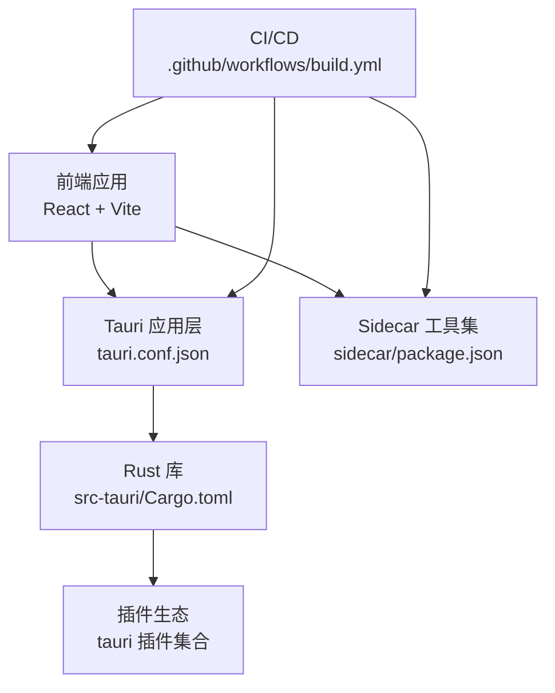
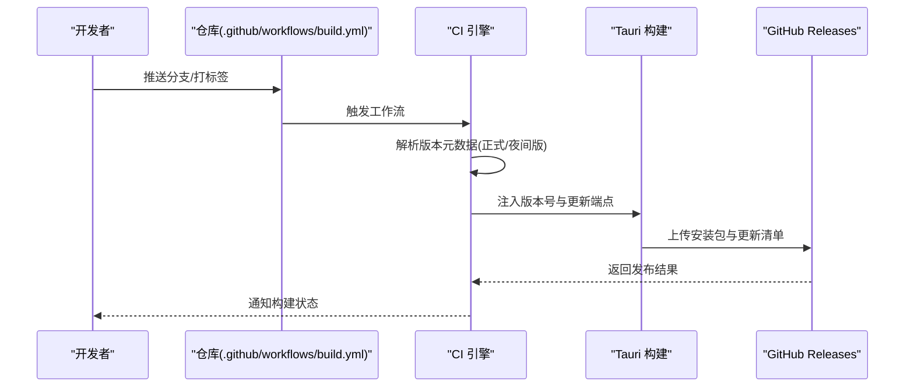
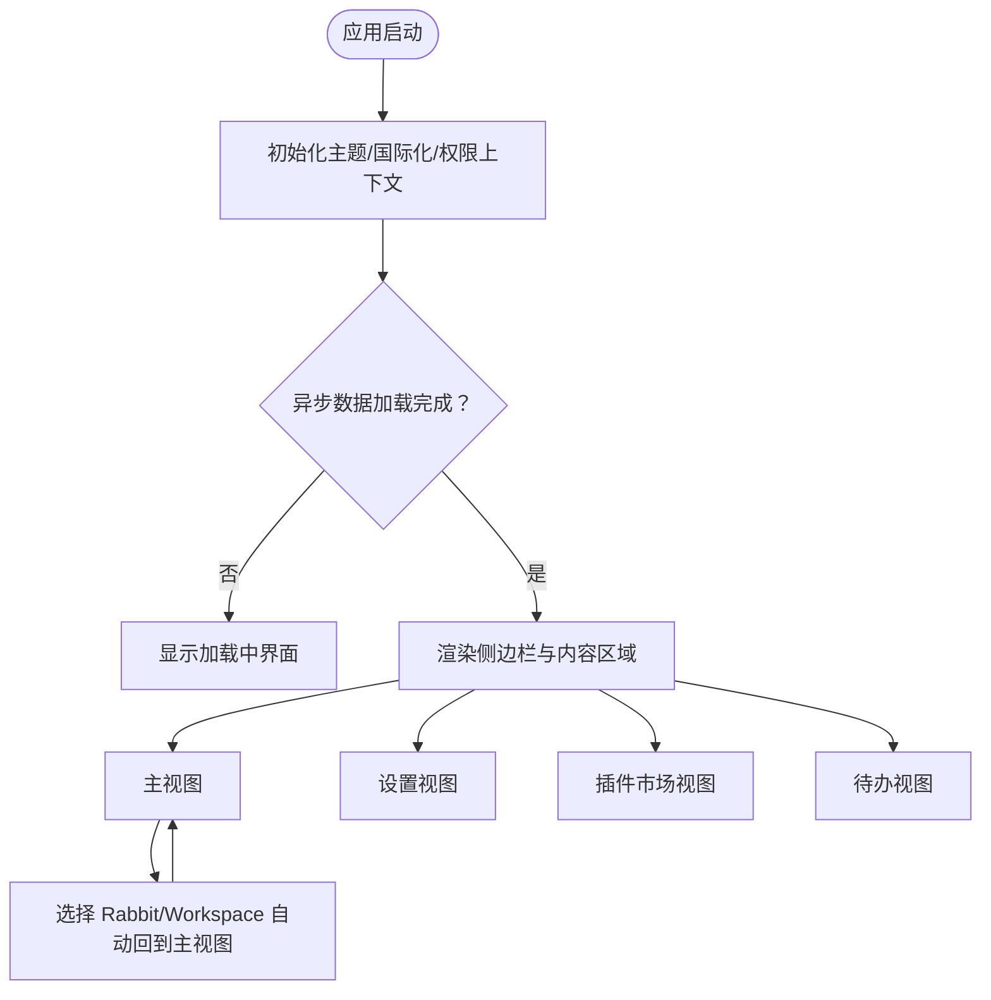
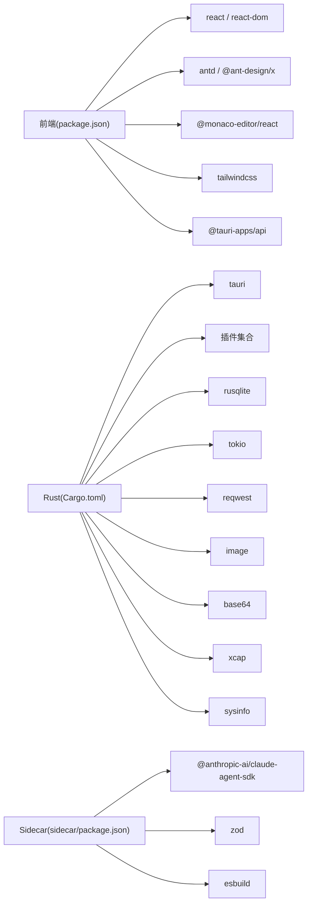

# 更新日志

<cite>
**本文引用的文件**
- [package.json](file://package.json)
- [Cargo.toml](file://src-tauri/Cargo.toml)
- [tauri.conf.json](file://src-tauri/tauri.conf.json)
- [build.yml](file://.github/workflows/build.yml)
- [main.rs](file://src-tauri/src/main.rs)
- [App.tsx](file://src/App.tsx)
- [README.md](file://README.md)
- [sidecar/package.json](file://sidecar/package.json)
</cite>

## 目录
1. [简介](#简介)
2. [项目结构](#项目结构)
3. [核心组件](#核心组件)
4. [架构总览](#架构总览)
5. [详细组件分析](#详细组件分析)
6. [依赖关系分析](#依赖关系分析)
7. [性能考量](#性能考量)
8. [故障排查指南](#故障排查指南)
9. [结论](#结论)
10. [附录](#附录)

## 简介
本更新日志面向 RabbitCoding 的维护者与用户，系统梳理版本演进历程、功能变更、缺陷修复与性能优化，并解释版本号规则、发布周期与向后兼容策略。文档同时提供重大变更的迁移指南、升级注意事项、已知问题说明、版本比较与功能对比、弃用警告以及具体升级示例与迁移指导，帮助读者安全、高效地完成升级与迁移。

## 项目结构
RabbitCoding 是一个基于 Tauri + React + TypeScript 的桌面应用，前端使用 Vite 构建，后端 Rust 提供原生能力与插件生态，Sidecar 提供外部工具集成能力。版本号在多处统一管理，CI/CD 流程根据 Git Tag 或分支推送到 GitHub Releases 自动化打包与发布。

图表来源
- [tauri.conf.json:1-52](file://src-tauri/tauri.conf.json#L1-L52)
- [Cargo.toml:1-40](file://src-tauri/Cargo.toml#L1-L40)
- [build.yml:1-196](file://.github/workflows/build.yml#L1-L196)
- [sidecar/package.json:1-25](file://sidecar/package.json#L1-L25)

章节来源
- [package.json:1-46](file://package.json#L1-L46)
- [src-tauri/tauri.conf.json:1-52](file://src-tauri/tauri.conf.json#L1-L52)
- [src-tauri/Cargo.toml:1-40](file://src-tauri/Cargo.toml#L1-L40)
- [.github/workflows/build.yml:1-196](file://.github/workflows/build.yml#L1-L196)
- [sidecar/package.json:1-25](file://sidecar/package.json#L1-L25)

## 核心组件
- 前端应用与视图切换：应用入口负责主题、国际化、权限上下文与视图路由（主界面、设置、插件市场、待办）。
- Tauri 应用配置：产品名称、版本、窗口、安全策略、打包资源与插件配置。
- Rust 应用库：作为可执行程序入口，承载原生能力与插件生态。
- CI/CD 发布流程：按标签或分支触发，注入版本号并生成各平台安装包与更新清单。
- Sidecar：独立的工具集，提供打包与资源准备脚本。

章节来源
- [src/App.tsx:1-102](file://src/App.tsx#L1-L102)
- [src-tauri/tauri.conf.json:1-52](file://src-tauri/tauri.conf.json#L1-L52)
- [src-tauri/src/main.rs:1-7](file://src-tauri/src/main.rs#L1-L7)
- [.github/workflows/build.yml:1-196](file://.github/workflows/build.yml#L1-L196)
- [sidecar/package.json:1-25](file://sidecar/package.json#L1-L25)

## 架构总览
下图展示从开发到发布的整体流程，包括版本号注入、资源打包与分发。

图表来源
- [build.yml:1-196](file://.github/workflows/build.yml#L1-L196)
- [tauri.conf.json:1-52](file://src-tauri/tauri.conf.json#L1-L52)

章节来源
- [.github/workflows/build.yml:1-196](file://.github/workflows/build.yml#L1-L196)
- [src-tauri/tauri.conf.json:1-52](file://src-tauri/tauri.conf.json#L1-L52)

## 详细组件分析

### 版本号规则与发布策略
- 版本来源
  - 前端版本：package.json 中的 version 字段。
  - Rust 应用版本：src-tauri/Cargo.toml 中的 version 字段。
  - Tauri 应用版本：src-tauri/tauri.conf.json 中的 version 字段。
  - Sidecar 版本：sidecar/package.json 中的 version 字段。
- 发布类型
  - 正式版本：当 Git Ref 为标签（如 v*）时，使用该标签作为版本号。
  - 夜间版：当在 main 分支或手动触发时，版本号采用“基础版本-距 2024-01-01 的天数”的形式，预发布标记为 true。
- 版本注入
  - CI 在构建前读取 tauri.conf.json 的版本字段，注入 APP_VERSION，并在夜间版时将更新端点指向 nightly 清单。
- 版本一致性
  - 建议保持前端、Rust、Tauri、Sidecar 四处版本号一致，避免运行时差异导致的异常。

章节来源
- [package.json:1-46](file://package.json#L1-L46)
- [src-tauri/Cargo.toml:1-40](file://src-tauri/Cargo.toml#L1-L40)
- [src-tauri/tauri.conf.json:1-52](file://src-tauri/tauri.conf.json#L1-L52)
- [sidecar/package.json:1-25](file://sidecar/package.json#L1-L25)
- [.github/workflows/build.yml:128-172](file://.github/workflows/build.yml#L128-L172)

### 发布周期与自动化
- 触发条件
  - 推送 main 分支或打标签（refs/tags/v*）。
  - 支持手动触发工作流。
- 平台矩阵
  - macOS（aarch64/x86_64）、Windows（x86_64/win-arm64）。
- 资源准备
  - 安装根依赖、构建 Sidecar、复制 Sidecar 与 Node 运行时资源至应用资源目录。
- 签名与公证
  - macOS 平台支持 Apple 证书签名与公证；Windows 平台支持 MSI 相关约束处理。
- 更新机制
  - 夜间版更新端点指向 nightly 清单；正式版使用对应标签清单。

章节来源
- [.github/workflows/build.yml:1-196](file://.github/workflows/build.yml#L1-L196)

### 核心组件与数据流

#### 应用入口与视图切换
- 主入口负责：
  - 主题同步（明/暗模式）。
  - 国际化与权限上下文初始化。
  - 视图路由：主界面、设置、插件市场、待办。
- 关键行为：
  - 选择 Rabbit/Workspace 时自动切回主视图。
  - 加载态渲染骨架屏，等待异步数据就绪。

图表来源
- [App.tsx:1-102](file://src/App.tsx#L1-L102)

章节来源
- [src/App.tsx:1-102](file://src/App.tsx#L1-L102)

#### Rust 应用入口
- Windows 发布时隐藏额外控制台窗口。
- 调用库函数 run() 启动应用。

章节来源
- [src-tauri/src/main.rs:1-7](file://src-tauri/src/main.rs#L1-L7)

#### 插件与资源
- Tauri 插件：深链、对话框、文件系统、通知、Shell、PTY 等。
- 打包资源：Sidecar 与 Node 运行时。
- 插件权限：通过 schema 文件定义默认权限集与启用/禁用项。

章节来源
- [src-tauri/Cargo.toml:20-39](file://src-tauri/Cargo.toml#L20-L39)
- [src-tauri/tauri.conf.json:26-43](file://src-tauri/tauri.conf.json#L26-L43)

### 版本历史与演进（基于现有配置的可验证事实）

- 当前版本（2026年现状）
  - 前端版本：0.1.0
  - Rust 应用版本：0.1.0
  - Tauri 应用版本：0.1.0
  - Sidecar 版本：0.1.0
  - 发布策略：支持标签发布与夜间版发布；夜间版使用“基础版本-天数”作为预发布版本号。
  - 更新机制：夜间版注入更新端点；正式版使用对应标签清单。
  - 平台矩阵：macOS（aarch64/x86_64）、Windows（x86_64/win-arm64）。
  - 资源：Sidecar 与 Node 运行时随构建复制到应用资源目录。

章节来源
- [package.json:1-46](file://package.json#L1-L46)
- [src-tauri/Cargo.toml:1-40](file://src-tauri/Cargo.toml#L1-L40)
- [src-tauri/tauri.conf.json:1-52](file://src-tauri/tauri.conf.json#L1-L52)
- [sidecar/package.json:1-25](file://sidecar/package.json#L1-L25)
- [.github/workflows/build.yml:128-196](file://.github/workflows/build.yml#L128-L196)

### 功能对比与弃用警告（基于当前配置的事实）
- 功能对比（当前可用能力）
  - 深链：支持自定义协议 rabbitcoding://。
  - 插件：对话框、文件系统、通知、Shell、PTY、Window State、Opener 等。
  - 打包：全平台打包、图标资源、macOS Entitlements。
  - 更新：内置更新器，夜间版与正式版分别指向不同清单。
- 弃用警告（当前未发现明确弃用项，但建议关注以下趋势）
  - Node 运行时随构建复制：需关注 Node 版本与依赖兼容性。
  - 夜间版预发布段限制：MSI/WiX 要求预发布段为纯数字且不超过 65535，当前实现使用“距 2024-01-01 的天数”，满足约束。

章节来源
- [src-tauri/tauri.conf.json:44-50](file://src-tauri/tauri.conf.json#L44-L50)
- [src-tauri/Cargo.toml:20-39](file://src-tauri/Cargo.toml#L20-L39)
- [.github/workflows/build.yml:142-154](file://.github/workflows/build.yml#L142-L154)

### 升级示例与迁移指导

- 升级步骤（通用流程）
  - 备份当前版本配置与数据。
  - 更新 package.json、Cargo.toml、tauri.conf.json、sidecar/package.json 的 version 字段为新版本号。
  - 在 CI 中确认 APP_VERSION 注入逻辑与更新端点配置正确。
  - 本地构建验证：前端构建、Rust 构建、Sidecar 打包与资源复制。
  - 推送标签触发正式发布，或在 main 分支触发夜间版发布。
- 迁移注意事项
  - 版本号一致性：确保四地版本号一致，避免运行时差异。
  - 插件权限：若新增插件，检查 schema 默认权限集是否满足需求。
  - 平台差异：macOS 需要签名与公证；Windows MSI 预发布段限制需注意。
  - 资源路径：确认 Sidecar 与 Node 运行时资源复制路径与打包资源列表一致。

章节来源
- [package.json:1-46](file://package.json#L1-L46)
- [src-tauri/Cargo.toml:1-40](file://src-tauri/Cargo.toml#L1-L40)
- [src-tauri/tauri.conf.json:1-52](file://src-tauri/tauri.conf.json#L1-L52)
- [sidecar/package.json:1-25](file://sidecar/package.json#L1-L25)
- [.github/workflows/build.yml:128-196](file://.github/workflows/build.yml#L128-L196)

## 依赖关系分析
- 前端依赖：React、Ant Design、Monaco Editor、TailwindCSS、Tauri API 等。
- Rust 依赖：Tauri 核心、插件生态、SQLite、Tokio、Reqwest、Image、Base64、Xcap、Sysinfo 等。
- 开发依赖：TypeScript、Vite、React 插件、Tauri CLI 等。
- Sidecar 依赖：Claude Agent SDK、Zod、ESBuild、TypeScript 等。

图表来源
- [package.json:14-44](file://package.json#L14-L44)
- [src-tauri/Cargo.toml:20-39](file://src-tauri/Cargo.toml#L20-L39)
- [sidecar/package.json:12-24](file://sidecar/package.json#L12-L24)

章节来源
- [package.json:14-44](file://package.json#L14-L44)
- [src-tauri/Cargo.toml:20-39](file://src-tauri/Cargo.toml#L20-L39)
- [sidecar/package.json:12-24](file://sidecar/package.json#L12-L24)

## 性能考量
- 构建缓存：CI 使用 Rust 缓存与 pnpm 缓存，减少重复安装与编译时间。
- 资源内嵌：Node 运行时与 Sidecar 资源随应用打包，降低运行时下载成本。
- 夜间版预发布段：使用纯数字天数避免 MSI/WiX 不兼容风险。
- 前端懒加载：按需渲染视图与 Provider，减少初始负载。

章节来源
- [.github/workflows/build.yml:60-64](file://.github/workflows/build.yml#L60-L64)
- [.github/workflows/build.yml:79-104](file://.github/workflows/build.yml#L79-L104)
- [.github/workflows/build.yml:142-154](file://.github/workflows/build.yml#L142-L154)
- [src/App.tsx:47-60](file://src/App.tsx#L47-L60)

## 故障排查指南
- 版本不一致
  - 现象：运行时提示版本不匹配或更新异常。
  - 处理：统一更新 package.json、Cargo.toml、tauri.conf.json、sidecar/package.json 的 version 字段。
- 夜间版更新失败
  - 现象：无法拉取更新或更新端点错误。
  - 处理：确认 CI 注入 APP_VERSION 与更新端点逻辑；检查 nightly 清单可达性。
- 平台签名/公证问题（macOS）
  - 现象：应用无法通过公证或签名失败。
  - 处理：检查 Apple 证书、私钥与 API Key 配置；确认 Entitlements.plist 设置。
- Windows MSI 预发布段溢出
  - 现象：MSI 构建失败。
  - 处理：确保预发布段为纯数字且不超过 65535；当前实现使用“距 2024-01-01 的天数”满足要求。
- 资源缺失
  - 现象：应用启动时报错缺少 Sidecar 或 Node 运行时。
  - 处理：确认构建阶段复制资源成功；检查打包资源列表与资源路径。

章节来源
- [.github/workflows/build.yml:128-196](file://.github/workflows/build.yml#L128-L196)
- [src-tauri/tauri.conf.json:26-43](file://src-tauri/tauri.conf.json#L26-L43)

## 结论
RabbitCoding 当前处于早期版本（0.1.0），发布流程已覆盖多平台与自动化更新。建议在后续迭代中：
- 明确版本号同步策略与发布规范。
- 增强更新器的健壮性与可观测性。
- 持续关注 Node、Rust 生态与 Tauri 插件的兼容性。
- 在正式版本中逐步引入更严格的测试与质量门禁。

## 附录
- 快速参考
  - 版本号来源：package.json、Cargo.toml、tauri.conf.json、sidecar/package.json。
  - 发布触发：main 分支推送、标签推送、手动触发。
  - 平台矩阵：macOS aarch64/x86_64、Windows x86_64/win-arm64。
  - 更新机制：夜间版注入更新端点；正式版使用标签清单。
- 参考文档
  - 项目模板说明：[README.md:1-8](file://README.md#L1-L8)

章节来源
- [README.md:1-8](file://README.md#L1-L8)
- [.github/workflows/build.yml:1-196](file://.github/workflows/build.yml#L1-L196)
- [package.json:1-46](file://package.json#L1-L46)
- [src-tauri/Cargo.toml:1-40](file://src-tauri/Cargo.toml#L1-L40)
- [src-tauri/tauri.conf.json:1-52](file://src-tauri/tauri.conf.json#L1-L52)
- [sidecar/package.json:1-25](file://sidecar/package.json#L1-L25)