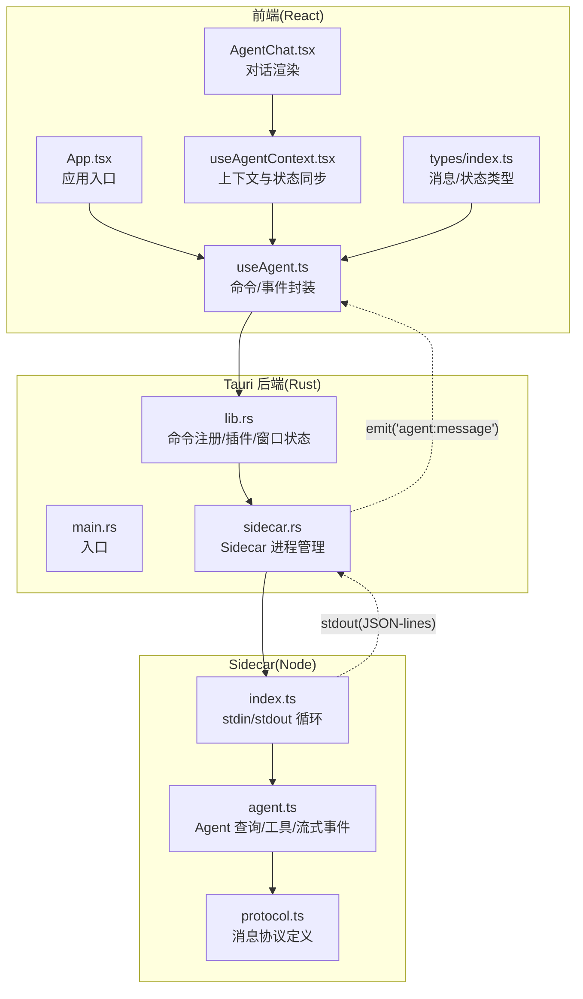
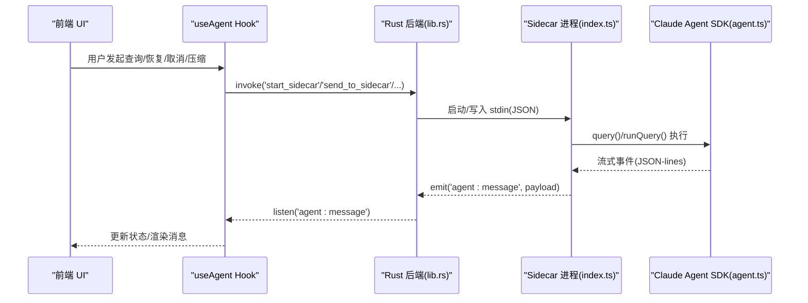
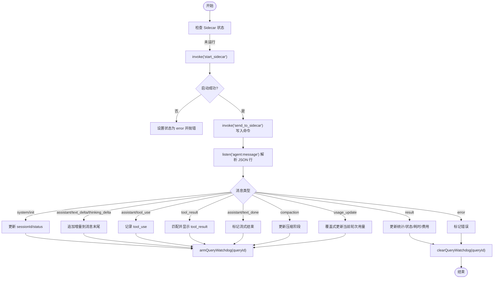
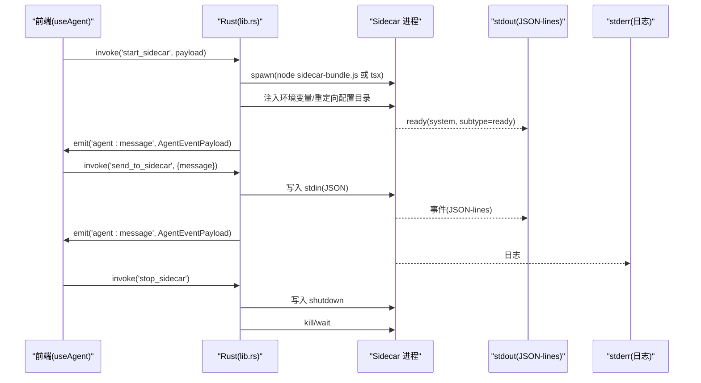
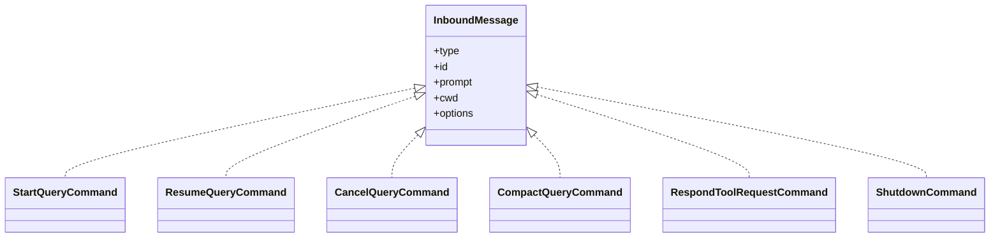
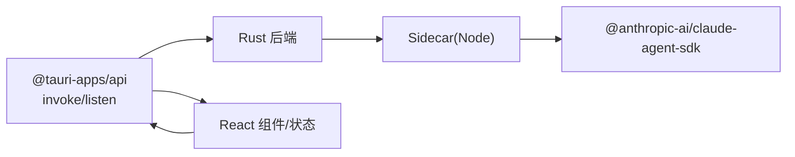

# 前后端分离架构

<cite>
**本文引用的文件**
- [src-tauri/src/main.rs](file://src-tauri/src/main.rs)
- [src-tauri/src/lib.rs](file://src-tauri/src/lib.rs)
- [src-tauri/src/sidecar.rs](file://src-tauri/src/sidecar.rs)
- [sidecar/src/index.ts](file://sidecar/src/index.ts)
- [sidecar/src/agent.ts](file://sidecar/src/agent.ts)
- [sidecar/src/protocol.ts](file://sidecar/src/protocol.ts)
- [src/hooks/useAgent.ts](file://src/hooks/useAgent.ts)
- [src/hooks/useAgentContext.tsx](file://src/hooks/useAgentContext.tsx)
- [src/components/agent/AgentChat.tsx](file://src/components/agent/AgentChat.tsx)
- [src/types/index.ts](file://src/types/index.ts)
- [src/App.tsx](file://src/App.tsx)
- [src/main.tsx](file://src/main.tsx)
- [package.json](file://package.json)
- [src-tauri/Cargo.toml](file://src-tauri/Cargo.toml)
- [src-tauri/tauri.conf.json](file://src-tauri/tauri.conf.json)
</cite>

## 目录
1. [简介](#简介)
2. [项目结构](#项目结构)
3. [核心组件](#核心组件)
4. [架构总览](#架构总览)
5. [详细组件分析](#详细组件分析)
6. [依赖关系分析](#依赖关系分析)
7. [性能考量](#性能考量)
8. [故障排查指南](#故障排查指南)
9. [结论](#结论)
10. [附录](#附录)

## 简介
本文件面向 RabbitCoding 的前后端分离架构，系统性阐述 React 前端如何通过 Tauri API 与 Rust 后端通信，重点覆盖以下主题：
- IPC 通信机制与命令调用模式
- 数据传递格式与 JSON-lines 协议
- 前端状态管理与后端数据同步机制
- Sidecar 进程的角色、生命周期与通信协议
- 分离架构带来的性能、安全与开发效率优势

## 项目结构
RabbitCoding 采用典型的 Tauri 桌面应用结构：前端为 React/Vite，后端为 Rust，二者通过 Tauri 的命令与事件系统进行 IPC 通信；同时引入 Sidecar 子进程承载 Claude Agent SDK 的运行与流式消息处理。

图表来源
- [src-tauri/src/main.rs:1-7](file://src-tauri/src/main.rs#L1-L7)
- [src-tauri/src/lib.rs:196-390](file://src-tauri/src/lib.rs#L196-L390)
- [src-tauri/src/sidecar.rs:59-214](file://src-tauri/src/sidecar.rs#L59-L214)
- [sidecar/src/index.ts:96-128](file://sidecar/src/index.ts#L96-L128)
- [sidecar/src/agent.ts:470-497](file://sidecar/src/agent.ts#L470-L497)
- [sidecar/src/protocol.ts:13-78](file://sidecar/src/protocol.ts#L13-L78)
- [src/hooks/useAgent.ts:106-126](file://src/hooks/useAgent.ts#L106-L126)
- [src/hooks/useAgentContext.tsx:88-193](file://src/hooks/useAgentContext.tsx#L88-L193)
- [src/components/agent/AgentChat.tsx:87-214](file://src/components/agent/AgentChat.tsx#L87-L214)
- [src/types/index.ts:82-102](file://src/types/index.ts#L82-L102)

章节来源
- [src-tauri/src/main.rs:1-7](file://src-tauri/src/main.rs#L1-L7)
- [src-tauri/src/lib.rs:196-390](file://src-tauri/src/lib.rs#L196-L390)
- [src-tauri/src/sidecar.rs:59-214](file://src-tauri/src/sidecar.rs#L59-L214)
- [sidecar/src/index.ts:96-128](file://sidecar/src/index.ts#L96-L128)
- [sidecar/src/agent.ts:470-497](file://sidecar/src/agent.ts#L470-L497)
- [sidecar/src/protocol.ts:13-78](file://sidecar/src/protocol.ts#L13-L78)
- [src/hooks/useAgent.ts:106-126](file://src/hooks/useAgent.ts#L106-L126)
- [src/hooks/useAgentContext.tsx:88-193](file://src/hooks/useAgentContext.tsx#L88-L193)
- [src/components/agent/AgentChat.tsx:87-214](file://src/components/agent/AgentChat.tsx#L87-L214)
- [src/types/index.ts:82-102](file://src/types/index.ts#L82-L102)

## 核心组件
- 前端 useAgent Hook：封装 Tauri 命令调用与事件监听，负责启动/停止 Sidecar、发送查询命令、接收流式消息、看门狗超时控制与 AskUserQuestion 回复。
- 前端 AgentProvider：将 useAgent 的事件监听提升至应用层级，确保页面切换时不丢失流式消息，驱动工作区/兔子的状态更新。
- Rust 后端命令：提供 start_sidecar、send_to_sidecar、stop_sidecar、get_sidecar_status 等命令，以及数据库、网络诊断、GitNexus、认证等命令。
- Sidecar 子进程：基于 Node.js 的 Claude Agent SDK 封装，通过 stdin 接收命令，stdout 以 JSON-lines 输出事件，stderr 输出日志。
- 协议层：定义前端↔Sidecar 的消息类型与字段，确保双方一致的数据契约。

章节来源
- [src/hooks/useAgent.ts:53-333](file://src/hooks/useAgent.ts#L53-L333)
- [src/hooks/useAgentContext.tsx:88-284](file://src/hooks/useAgentContext.tsx#L88-L284)
- [src-tauri/src/lib.rs:344-387](file://src-tauri/src/lib.rs#L344-L387)
- [src-tauri/src/sidecar.rs:59-214](file://src-tauri/src/sidecar.rs#L59-L214)
- [sidecar/src/protocol.ts:13-78](file://sidecar/src/protocol.ts#L13-L78)

## 架构总览
RabbitCoding 的前后端分离架构以 Tauri 为核心桥梁，前端负责 UI 与状态管理，后端负责系统能力与 Sidecar 进程管理，Sidecar 负责与 Claude Agent SDK 的交互与流式输出。

图表来源
- [src/hooks/useAgent.ts:106-126](file://src/hooks/useAgent.ts#L106-L126)
- [src-tauri/src/lib.rs:344-387](file://src-tauri/src/lib.rs#L344-L387)
- [src-tauri/src/sidecar.rs:175-214](file://src-tauri/src/sidecar.rs#L175-L214)
- [sidecar/src/index.ts:96-128](file://sidecar/src/index.ts#L96-L128)
- [sidecar/src/agent.ts:320-438](file://sidecar/src/agent.ts#L320-L438)

## 详细组件分析

### 前端命令与事件封装(useAgent)
- 启动 Sidecar：调用 start_sidecar 命令，传入 API Key、Base URL、自定义环境变量；成功后进入 running 状态。
- 发送命令：将 JSON-lines 命令序列化后通过 send_to_sidecar 写入 Sidecar stdin。
- 监听事件：订阅 agent:message 事件，解析 JSON 行为 AgentEvent，按消息类型更新前端状态。
- 看门狗：针对每条 queryId 设置独立计时器，区分“思考态”与普通态，避免长思考被误判超时。
- AskUserQuestion：向前端推送提问消息，前端收集答案后通过 respond_tool_request 命令回传。

图表来源
- [src/hooks/useAgent.ts:106-126](file://src/hooks/useAgent.ts#L106-L126)
- [src/hooks/useAgent.ts:156-243](file://src/hooks/useAgent.ts#L156-L243)
- [src/hooks/useAgent.ts:262-320](file://src/hooks/useAgent.ts#L262-L320)
- [src/hooks/useAgent.ts:248-256](file://src/hooks/useAgent.ts#L248-L256)

章节来源
- [src/hooks/useAgent.ts:53-333](file://src/hooks/useAgent.ts#L53-L333)

### 上下文与状态同步(AgentProvider)
- 将 useAgent 的事件监听提升到应用层级，避免页面切换导致监听丢失。
- 根据消息类型更新工作区/兔子的状态、消息列表、Token 使用、压缩阶段等。
- 统一处理 Sidecar 异常退出与查询超时，收敛为 error 状态，避免 UI 永远 loading。

章节来源
- [src/hooks/useAgentContext.tsx:88-284](file://src/hooks/useAgentContext.tsx#L88-L284)

### Rust 后端命令与 Sidecar 管理
- 命令注册：在 lib.rs 中集中注册所有 Tauri 命令，包括 Sidecar 管理、数据库、网络诊断、GitNexus、认证等。
- Sidecar 启动：根据开发/发布模式选择 Node 运行方式，注入环境变量（API Key/Base URL/自定义），重定向 Claude 配置目录，清理遗留环境变量。
- 事件转发：从 Sidecar stdout 读取 JSON 行，通过 emit("agent:message", ...) 转发给前端。
- 进程管理：提供 start/stop/status/send 命令，优雅关闭时先发送 shutdown 命令，再强制 kill。

图表来源
- [src-tauri/src/lib.rs:344-387](file://src-tauri/src/lib.rs#L344-L387)
- [src-tauri/src/sidecar.rs:59-214](file://src-tauri/src/sidecar.rs#L59-L214)
- [sidecar/src/index.ts:96-128](file://sidecar/src/index.ts#L96-L128)

章节来源
- [src-tauri/src/lib.rs:196-390](file://src-tauri/src/lib.rs#L196-L390)
- [src-tauri/src/sidecar.rs:59-214](file://src-tauri/src/sidecar.rs#L59-L214)

### Sidecar 协议与消息流
- 前端→Sidecar：通过 stdin 发送 JSON-lines 命令（start_query/resume_query/cancel_query/compact_query/respond_tool_request/shutdown）。
- Sidecar→前端：通过 stdout 以 JSON-lines 输出 AgentEvent，包含 queryId 与 payload；stderr 输出日志。
- 协议类型：系统初始化、流式文本/思考增量、工具调用、工具结果、最终结果、错误、压缩状态/结果、Token 用量、AskUserQuestion、Spec 写入等。

图表来源
- [sidecar/src/protocol.ts:13-78](file://sidecar/src/protocol.ts#L13-L78)

章节来源
- [sidecar/src/protocol.ts:13-78](file://sidecar/src/protocol.ts#L13-L78)
- [sidecar/src/index.ts:37-91](file://sidecar/src/index.ts#L37-L91)
- [sidecar/src/agent.ts:320-438](file://sidecar/src/agent.ts#L320-L438)

### 前端状态管理与渲染
- AgentChat 组件：将消息按用户消息分组，处理 tool_use 与 tool_result 的配对，过滤冗余消息，支持流式增量渲染与自动滚动。
- 类型系统：src/types/index.ts 定义了完整的消息类型与状态字段，确保前端与协议层一致。

章节来源
- [src/components/agent/AgentChat.tsx:38-85](file://src/components/agent/AgentChat.tsx#L38-L85)
- [src/types/index.ts:82-102](file://src/types/index.ts#L82-L102)

## 依赖关系分析
- 前端依赖：@tauri-apps/api 提供 invoke/listen；React/antd/lucide 等 UI 与组件生态。
- 后端依赖：tauri、serde、tokio、rusqlite、reqwest 等，提供命令、事件、文件系统、通知、PTY、网络等能力。
- Sidecar 依赖：@anthropic-ai/claude-agent-sdk、zod、node:fs/promises 等，负责 Agent 查询与工具集成。

图表来源
- [package.json:14-36](file://package.json#L14-L36)
- [src-tauri/Cargo.toml:20-39](file://src-tauri/Cargo.toml#L20-L39)
- [sidecar/src/agent.ts:12-17](file://sidecar/src/agent.ts#L12-L17)

章节来源
- [package.json:14-36](file://package.json#L14-L36)
- [src-tauri/Cargo.toml:20-39](file://src-tauri/Cargo.toml#L20-L39)

## 性能考量
- 低延迟流式渲染：前端按增量消息追加，减少重排；自动滚动仅在用户位于底部时生效，降低不必要的 DOM 操作。
- 看门狗与思考态：区分“思考态”与普通态的超时阈值，避免长思考被误判，提升用户体验。
- Sidecar 隔离：通过 CLAUDE_CONFIG_DIR 与环境变量注入，避免全局配置污染，减少不必要的 IO 与初始化成本。
- 事件聚合：AgentProvider 将事件监听提升至应用层，避免组件卸载导致的重复注册与内存泄漏。

## 故障排查指南
- Sidecar 未启动或频繁退出
  - 检查 start_sidecar 返回值与 stderr 日志；确认 API Key/Base URL/自定义环境变量正确。
  - 查看 agent:sidecar-exit 事件原因。
- 无消息或长时间无响应
  - 检查前端 query 看门狗是否触发；确认消息类型为 result/error 时看门狗被清除。
  - 确认 JSON-lines 命令格式与协议字段一致。
- AskUserQuestion 无响应
  - 确认前端已推送 ask_user_question 消息；检查 requestId 是否正确；注意 5 分钟超时。
- 会话压缩失败
  - 查看 compaction 阶段与错误信息；必要时手动触发 compact_query。

章节来源
- [src-tauri/src/sidecar.rs:175-214](file://src-tauri/src/sidecar.rs#L175-L214)
- [src/hooks/useAgent.ts:262-320](file://src/hooks/useAgent.ts#L262-L320)
- [sidecar/src/agent.ts:502-573](file://sidecar/src/agent.ts#L502-L573)

## 结论
RabbitCoding 的前后端分离架构通过 Tauri 实现了高性能、高安全性的桌面应用体验：
- 性能：前端流式增量渲染与看门狗机制显著改善响应体验；Sidecar 与 Rust 的职责分离降低主线程压力。
- 安全：通过 CLAUDE_CONFIG_DIR 与环境变量注入，严格隔离全局配置；ACL 与插件系统进一步强化安全边界。
- 开发效率：清晰的命令/事件契约与协议类型定义，便于扩展与维护；Sidecar 的 JSON-lines 协议简化了跨语言通信。

## 附录
- 应用入口与构建配置
  - 前端入口：src/main.tsx 与 src/App.tsx
  - 构建脚本：package.json 中 dev/build/preview/tauri/scripts
  - Tauri 配置：src-tauri/tauri.conf.json 指定 devUrl、frontendDist、资源打包与插件

章节来源
- [src/main.tsx:1-11](file://src/main.tsx#L1-L11)
- [src/App.tsx:30-104](file://src/App.tsx#L30-L104)
- [package.json:7-13](file://package.json#L7-L13)
- [src-tauri/tauri.conf.json:6-11](file://src-tauri/tauri.conf.json#L6-L11)