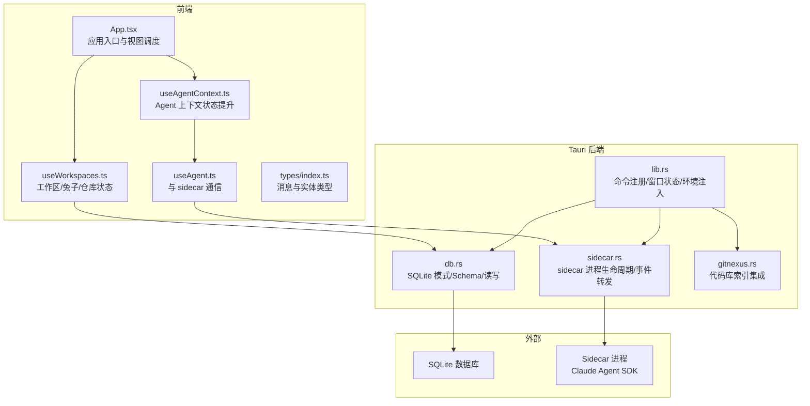
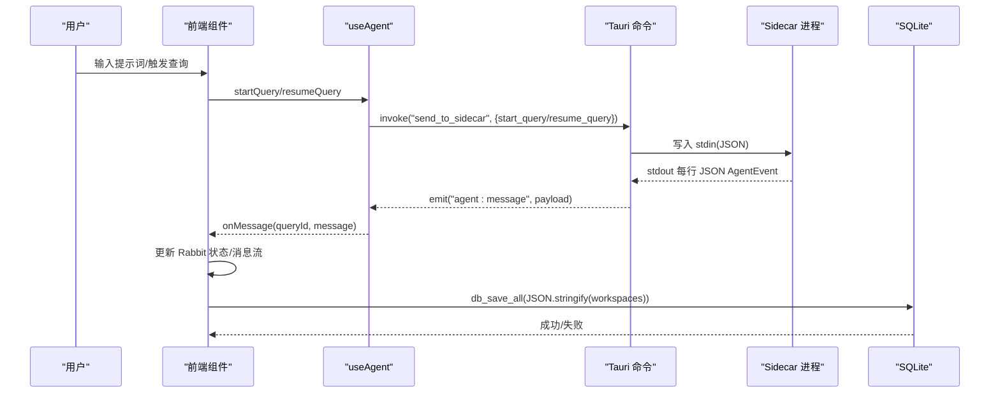
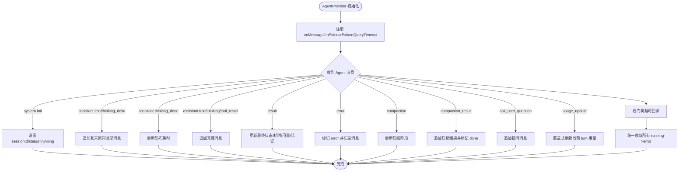
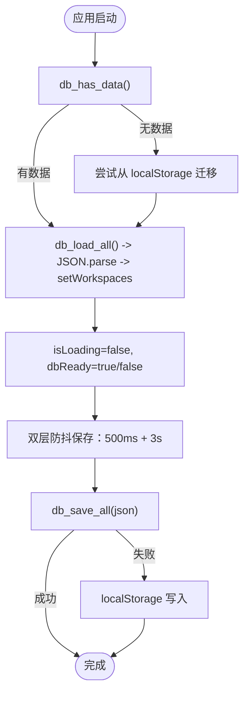
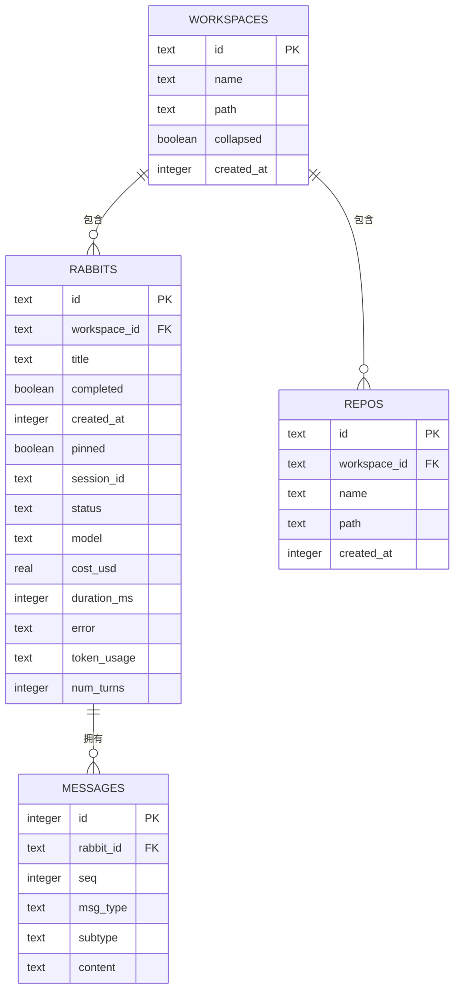
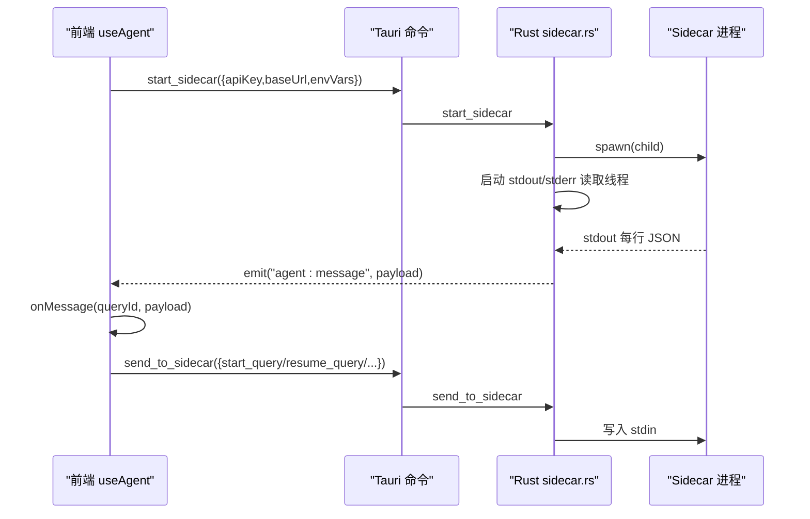
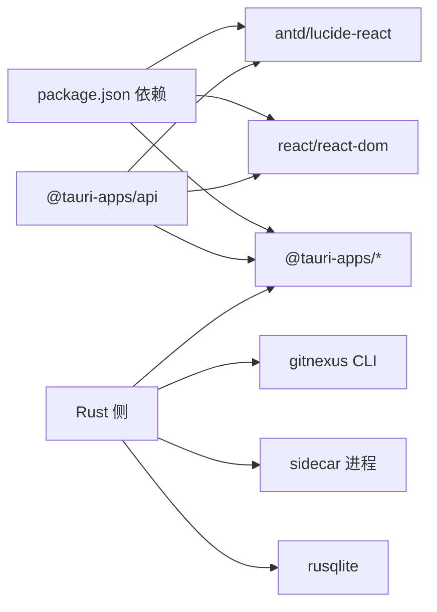

# 数据流设计

<cite>
**本文引用的文件**
- [src/main.tsx](file://src/main.tsx)
- [src/App.tsx](file://src/App.tsx)
- [src/hooks/useWorkspaces.ts](file://src/hooks/useWorkspaces.ts)
- [src/hooks/useAgentContext.tsx](file://src/hooks/useAgentContext.tsx)
- [src/hooks/useAgent.ts](file://src/hooks/useAgent.ts)
- [src/types/index.ts](file://src/types/index.ts)
- [src-tauri/src/lib.rs](file://src-tauri/src/lib.rs)
- [src-tauri/src/db.rs](file://src-tauri/src/db.rs)
- [src-tauri/src/sidecar.rs](file://src-tauri/src/sidecar.rs)
- [src-tauri/src/gitnexus.rs](file://src-tauri/src/gitnexus.rs)
- [package.json](file://package.json)
</cite>

## 目录
1. [简介](#简介)
2. [项目结构](#项目结构)
3. [核心组件](#核心组件)
4. [架构总览](#架构总览)
5. [详细组件分析](#详细组件分析)
6. [依赖关系分析](#依赖关系分析)
7. [性能考量](#性能考量)
8. [故障排查指南](#故障排查指南)
9. [结论](#结论)
10. [附录](#附录)

## 简介
本文件面向 RabbitCoding 的数据流设计，系统性阐述从用户输入到 AI 响应的完整数据链路，包括状态提升模式、数据持久化策略、缓存与事件驱动机制、前后端协作方式（前端 Zustand/Pinia 风格的状态管理、后端 SQLite 存储），并提供数据流向图、状态转换图与性能优化建议。读者可据此理解数据如何在前端 React 组件、Tauri 命令通道、Rust 后端与 SQLite 之间流转。

## 项目结构
- 前端采用 React + TypeScript，通过 @tauri-apps/api 与后端交互。
- 后端基于 Tauri，Rust 实现命令与事件处理，SQLite 作为主存储。
- 侧车（sidecar）进程负责与 Claude Agent SDK 通信，通过标准输入输出与 Rust 进程交互，Rust 通过 Tauri 事件向前端推送消息。

图表来源
- [src/App.tsx:30-104](file://src/App.tsx#L30-L104)
- [src/hooks/useWorkspaces.ts:28-541](file://src/hooks/useWorkspaces.ts#L28-L541)
- [src/hooks/useAgentContext.tsx:88-285](file://src/hooks/useAgentContext.tsx#L88-L285)
- [src/hooks/useAgent.ts:53-334](file://src/hooks/useAgent.ts#L53-L334)
- [src-tauri/src/lib.rs:197-390](file://src-tauri/src/lib.rs#L197-L390)
- [src-tauri/src/db.rs:140-417](file://src-tauri/src/db.rs#L140-L417)
- [src-tauri/src/sidecar.rs:60-214](file://src-tauri/src/sidecar.rs#L60-L214)
- [src-tauri/src/gitnexus.rs:180-379](file://src-tauri/src/gitnexus.rs#L180-L379)

章节来源
- [src/main.tsx:1-11](file://src/main.tsx#L1-L11)
- [src/App.tsx:30-104](file://src/App.tsx#L30-L104)
- [src-tauri/src/lib.rs:197-390](file://src-tauri/src/lib.rs#L197-L390)

## 核心组件
- 前端状态与持久化
  - useWorkspaces：集中管理 Workspace/Rabbit/Repo 等数据，支持从 SQLite 加载、双层防抖保存、localStorage 降级。
  - useAgentContext：将 Agent 的监听与 onMessage 回调提升至 App 层，确保页面切换不丢失流式消息。
  - useAgent：封装 sidecar 启停、查询发起/恢复/取消/压缩、事件监听与看门狗超时。
- 后端命令与存储
  - lib.rs：注册命令、初始化数据库、启动 sidecar、窗口状态持久化。
  - db.rs：定义数据模型、SQLite Schema、全量读写与事务。
  - sidecar.rs：sidecar 进程生命周期、stdin/stdout/stderr 线程、事件转发。
  - gitnexus.rs：代码库索引集成（安装、分析、组同步等）。

章节来源
- [src/hooks/useWorkspaces.ts:28-541](file://src/hooks/useWorkspaces.ts#L28-L541)
- [src/hooks/useAgentContext.tsx:88-285](file://src/hooks/useAgentContext.tsx#L88-L285)
- [src/hooks/useAgent.ts:53-334](file://src/hooks/useAgent.ts#L53-L334)
- [src-tauri/src/db.rs:140-417](file://src-tauri/src/db.rs#L140-L417)
- [src-tauri/src/sidecar.rs:60-214](file://src-tauri/src/sidecar.rs#L60-L214)
- [src-tauri/src/gitnexus.rs:180-379](file://src-tauri/src/gitnexus.rs#L180-L379)

## 架构总览
数据流从用户输入开始，经前端 UI 与 useAgent 发起查询，通过 Tauri 命令发送到 sidecar，sidecar 与 Claude Agent SDK 交互产生流式消息，Rust 通过事件将消息推送到前端，前端更新 useWorkspaces 中的 Rabbit.messages 与状态，同时双层防抖写回 SQLite。若数据库不可用，则回退到 localStorage。

图表来源
- [src/hooks/useAgent.ts:156-205](file://src/hooks/useAgent.ts#L156-L205)
- [src-tauri/src/sidecar.rs:175-214](file://src-tauri/src/sidecar.rs#L175-L214)
- [src-tauri/src/db.rs:392-406](file://src-tauri/src/db.rs#L392-L406)

## 详细组件分析

### 状态提升与消息流（AgentProvider）
- 将 onMessage 与 sidecar 退出回调提升到 App 层，避免页面切换导致监听丢失。
- 根据消息类型更新 Rabbit 的状态、消息流、压缩阶段、用量统计等。
- 统一收敛“运行中”状态，防止 sidecar 退出或超时导致 UI 永远 loading。

图表来源
- [src/hooks/useAgentContext.tsx:92-193](file://src/hooks/useAgentContext.tsx#L92-L193)
- [src/hooks/useAgent.ts:262-320](file://src/hooks/useAgent.ts#L262-L320)

章节来源
- [src/hooks/useAgentContext.tsx:88-285](file://src/hooks/useAgentContext.tsx#L88-L285)
- [src/hooks/useAgent.ts:53-334](file://src/hooks/useAgent.ts#L53-L334)

### 前端状态管理与持久化（useWorkspaces）
- 首次启动检测 SQLite 是否有数据，无则尝试从 localStorage 迁移。
- 异步加载后，使用 useMemo 包装 store，确保视图切换时选中状态正确。
- 双层防抖保存：500ms 防抖 + 3s 周期强制保存，覆盖流式输出场景。
- DB 不可用时回退到 localStorage 写入。
- 对旧数据做兼容处理（补全字段、规范化结构）。

图表来源
- [src/hooks/useWorkspaces.ts:48-129](file://src/hooks/useWorkspaces.ts#L48-L129)
- [src-tauri/src/db.rs:392-416](file://src-tauri/src/db.rs#L392-L416)

章节来源
- [src/hooks/useWorkspaces.ts:28-541](file://src/hooks/useWorkspaces.ts#L28-L541)

### 后端命令与数据库（lib.rs + db.rs）
- lib.rs 注册大量命令（db_*、sidecar_*、gitnexus_* 等），并在 setup 中初始化数据库与 sidecar。
- db.rs 定义 Workspace/Rabbit/Repo/Messages 的序列化结构与 SQLite Schema，提供全量读取与事务性全量写入。
- 事务内删除四表再重建，保证一致性；消息按 seq 有序存储。

图表来源
- [src-tauri/src/db.rs:80-138](file://src-tauri/src/db.rs#L80-L138)

章节来源
- [src-tauri/src/lib.rs:197-390](file://src-tauri/src/lib.rs#L197-L390)
- [src-tauri/src/db.rs:140-417](file://src-tauri/src/db.rs#L140-L417)

### Sidecar 生命周期与事件转发（sidecar.rs）
- 启动 sidecar：清理残留进程、注入环境变量（隔离用户全局配置）、启动 stdout/stderr 读取线程。
- 通过 Tauri 事件 emit("agent:message", AgentEventPayload) 将 sidecar 输出转发给前端。
- 提供 start_sidecar/send_to_sidecar/stop_sidecar/get_sidecar_status 命令。

图表来源
- [src-tauri/src/sidecar.rs:60-214](file://src-tauri/src/sidecar.rs#L60-L214)
- [src/hooks/useAgent.ts:106-177](file://src/hooks/useAgent.ts#L106-L177)

章节来源
- [src-tauri/src/sidecar.rs:60-214](file://src-tauri/src/sidecar.rs#L60-L214)

### 数据模型与消息类型（types/index.ts）
- Workspace/Rabbit/Repo/AgentMessage 等核心类型定义，涵盖消息流、工具调用、压缩状态、用量统计、AskUserQuestion 等。
- AgentMessage 联合类型覆盖 text/text_delta/thinking/thinking_delta/tool_use/result/error 等。

章节来源
- [src/types/index.ts:8-42](file://src/types/index.ts#L8-L42)
- [src/types/index.ts:82-283](file://src/types/index.ts#L82-L283)

## 依赖关系分析
- 前端依赖
  - @tauri-apps/api：invoke 与 listen 事件。
  - 业务逻辑集中在 hooks（useWorkspaces/useAgent/useAgentContext）。
- 后端依赖
  - rusqlite：SQLite 访问。
  - tauri：命令注册、事件发射、窗口状态插件、通知插件等。
  - sidecar：Node 进程管理与事件转发。
  - gitnexus：代码库索引集成。

图表来源
- [package.json:14-44](file://package.json#L14-L44)
- [src-tauri/src/lib.rs:197-390](file://src-tauri/src/lib.rs#L197-L390)

章节来源
- [package.json:14-44](file://package.json#L14-L44)
- [src-tauri/src/lib.rs:197-390](file://src-tauri/src/lib.rs#L197-L390)

## 性能考量
- 数据持久化
  - 双层防抖：500ms 防抖 + 3s 周期保存，降低写放大；流式输出场景仍能及时落盘。
  - 事务写入：db_save_all 使用事务，保证一致性与原子性。
- 事件与线程
  - sidecar stdout/stderr 读取使用独立线程，避免阻塞主线程。
  - Tauri 事件 emit 与前端 listen 解耦，减少耦合。
- 超时与兜底
  - 查询看门狗：普通态 10 分钟、思考态 30 分钟，避免静默卡死。
  - sidecar 退出统一收敛所有 running->error，避免 UI 卡死。
- 存储降级
  - DB 不可用时回退 localStorage，保障可用性。

章节来源
- [src/hooks/useWorkspaces.ts:100-129](file://src/hooks/useWorkspaces.ts#L100-L129)
- [src-tauri/src/db.rs:290-305](file://src-tauri/src/db.rs#L290-L305)
- [src/hooks/useAgent.ts:66-101](file://src/hooks/useAgent.ts#L66-L101)
- [src/hooks/useAgentContext.tsx:180-193](file://src/hooks/useAgentContext.tsx#L180-L193)

## 故障排查指南
- 数据库相关
  - 现象：db_load_all/db_save_all 失败。
  - 排查：查看 lib.rs setup 中的错误日志；确认 app_data_dir/rabbit.db 是否可写。
  - 降级：前端捕获异常后回退 localStorage。
- Sidecar 相关
  - 现象：start_sidecar 失败或 sidecar 退出。
  - 排查：检查环境变量注入（API Key/Base URL/CLAUDE_CONFIG_DIR）；查看 stderr 日志；确认 sidecar 脚本路径。
  - 事件：agent:sidecar-exit 事件会触发统一收敛。
- 事件监听泄漏
  - 现象：StrictMode 下 listener 泄漏或重复注册。
  - 处理：useAgent 使用 ref 存储回调，effect 内部清理 unlisten；组件卸载时清除看门狗。

章节来源
- [src-tauri/src/lib.rs:206-224](file://src-tauri/src/lib.rs#L206-L224)
- [src-tauri/src/db.rs:392-416](file://src-tauri/src/db.rs#L392-L416)
- [src-tauri/src/sidecar.rs:175-214](file://src-tauri/src/sidecar.rs#L175-L214)
- [src/hooks/useAgent.ts:262-320](file://src/hooks/useAgent.ts#L262-L320)

## 结论
RabbitCoding 的数据流设计以“状态提升 + 事件驱动 + 双层防抖 + 事务持久化”为核心，从前端 UI 到 sidecar，再到 SQLite，形成清晰、可控、可降级的数据链路。通过看门狗与统一收敛机制，有效避免了 UI 卡死与状态不一致问题；通过事务与双层防抖，兼顾了性能与可靠性。

## 附录
- API 调用示例（路径参考）
  - 启动 sidecar：[src/hooks/useAgent.ts:106-126](file://src/hooks/useAgent.ts#L106-L126)
  - 发送查询命令：[src/hooks/useAgent.ts:156-205](file://src/hooks/useAgent.ts#L156-L205)
  - 读取数据库：[src-tauri/src/db.rs:392-397](file://src-tauri/src/db.rs#L392-L397)
  - 写入数据库：[src-tauri/src/db.rs:399-406](file://src-tauri/src/db.rs#L399-L406)
  - 事件监听：[src/hooks/useAgent.ts:262-320](file://src/hooks/useAgent.ts#L262-L320)
- 数据模型参考
  - 消息类型：[src/types/index.ts:82-283](file://src/types/index.ts#L82-L283)
  - 实体结构：[src/types/index.ts:8-42](file://src/types/index.ts#L8-L42)