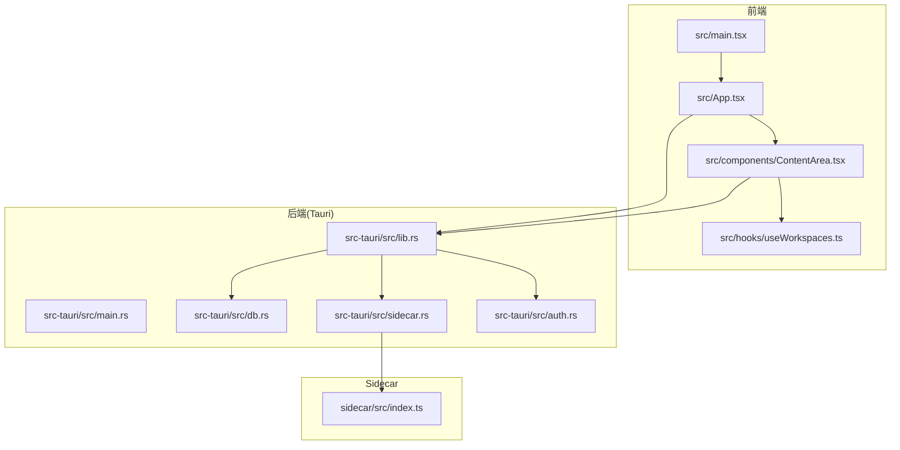
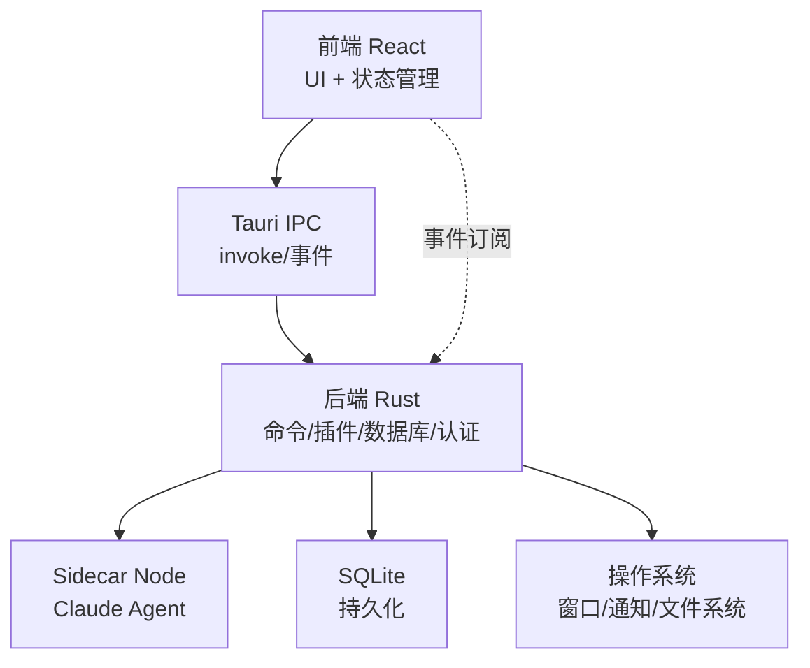
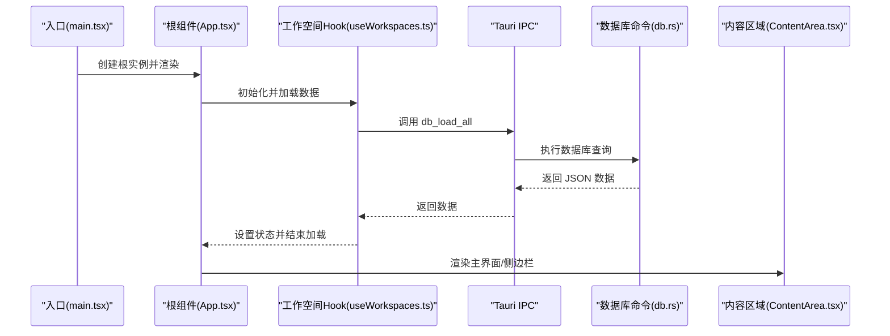
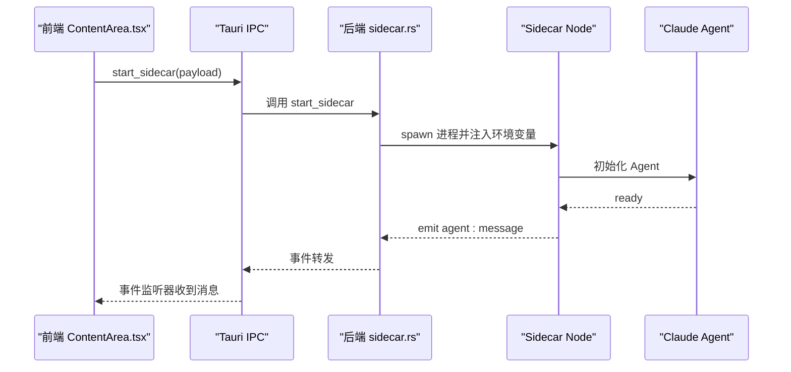
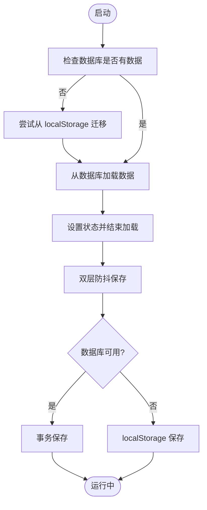
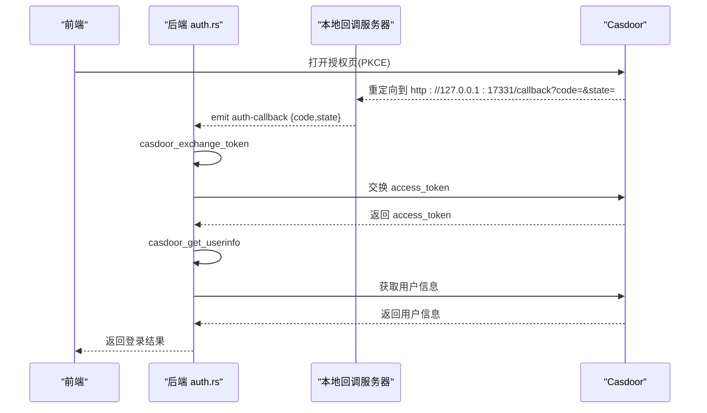
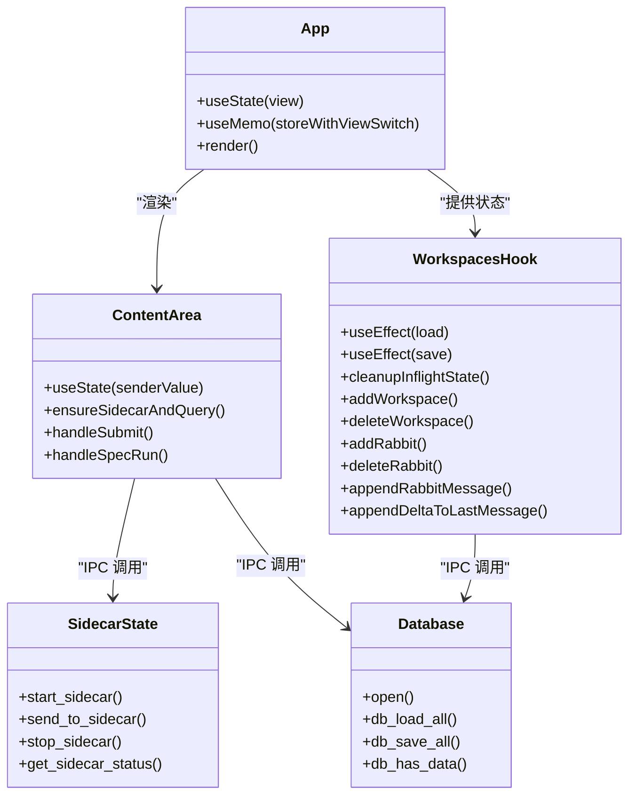
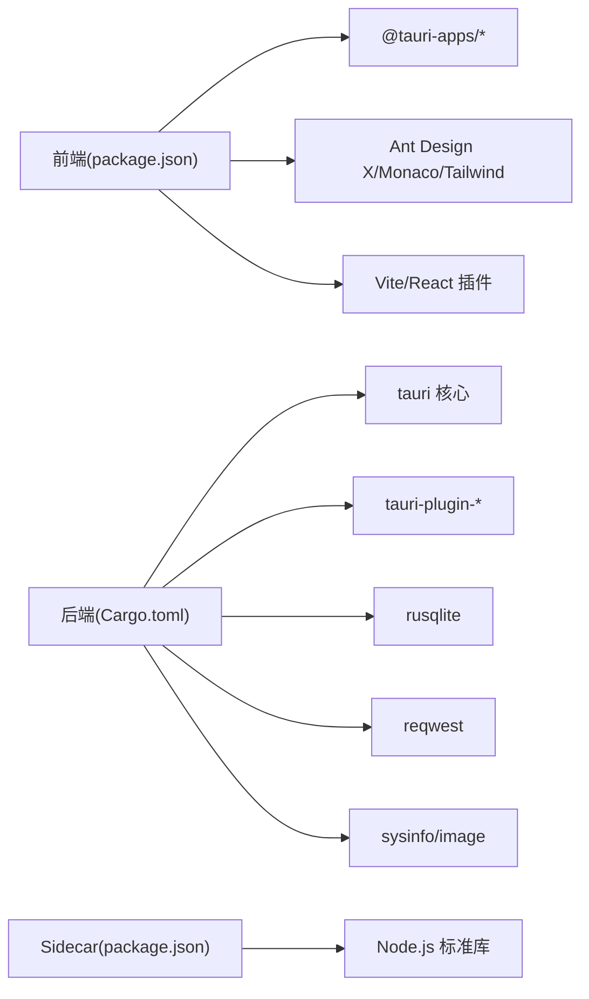

# 整体架构设计

<cite>
**本文档引用的文件**
- [README.md](file://README.md)
- [package.json](file://package.json)
- [vite.config.ts](file://vite.config.ts)
- [src-tauri/Cargo.toml](file://src-tauri/Cargo.toml)
- [src-tauri/tauri.conf.json](file://src-tauri/tauri.conf.json)
- [src/main.tsx](file://src/main.tsx)
- [src/App.tsx](file://src/App.tsx)
- [src-tauri/src/main.rs](file://src-tauri/src/main.rs)
- [src-tauri/src/lib.rs](file://src-tauri/src/lib.rs)
- [src-tauri/src/sidecar.rs](file://src-tauri/src/sidecar.rs)
- [src-tauri/src/db.rs](file://src-tauri/src/db.rs)
- [src-tauri/src/auth.rs](file://src-tauri/src/auth.rs)
- [src/components/ContentArea.tsx](file://src/components/ContentArea.tsx)
- [src/hooks/useWorkspaces.ts](file://src/hooks/useWorkspaces.ts)
- [sidecar/src/index.ts](file://sidecar/src/index.ts)
</cite>

## 目录
1. [简介](#简介)
2. [项目结构](#项目结构)
3. [核心组件](#核心组件)
4. [架构总览](#架构总览)
5. [详细组件分析](#详细组件分析)
6. [依赖关系分析](#依赖关系分析)
7. [性能考虑](#性能考虑)
8. [故障排除指南](#故障排除指南)
9. [结论](#结论)

## 简介
本项目采用 Tauri + React + TypeScript 技术栈，构建跨平台桌面应用。系统采用前后端分离架构：前端使用 React + Vite 提供用户界面与交互逻辑，后端使用 Rust + Tauri 提供系统能力与原生集成，中间通过 IPC 通信。应用的核心能力包括工作空间管理、多 Rabbit 会话、Claude Code Sidecar 协作、SQLite 数据持久化、OAuth 登录与通知等。

## 项目结构
项目采用典型的 Tauri 项目布局，分为前端源码、Rust 后端与 sidecar 子工程三大部分：

- 前端（src/）：React + TypeScript + Vite，负责 UI、状态管理、视图切换与与后端的 IPC 通信。
- 后端（src-tauri/）：Rust + Tauri，负责系统窗口、插件、命令注册、数据库、认证与 sidecar 进程管理。
- Sidecar（sidecar/）：Node.js 子工程，作为 Claude Code Agent 的运行载体，通过标准输入输出与后端通信。

**图表来源**
- [src/main.tsx:1-11](file://src/main.tsx#L1-L11)
- [src/App.tsx:1-102](file://src/App.tsx#L1-L102)
- [src/components/ContentArea.tsx:1-668](file://src/components/ContentArea.tsx#L1-L668)
- [src/hooks/useWorkspaces.ts:1-541](file://src/hooks/useWorkspaces.ts#L1-L541)
- [src-tauri/src/main.rs:1-7](file://src-tauri/src/main.rs#L1-L7)
- [src-tauri/src/lib.rs:124-317](file://src-tauri/src/lib.rs#L124-L317)
- [src-tauri/src/db.rs:140-417](file://src-tauri/src/db.rs#L140-L417)
- [src-tauri/src/sidecar.rs:1-359](file://src-tauri/src/sidecar.rs#L1-L359)
- [src-tauri/src/auth.rs:1-376](file://src-tauri/src/auth.rs#L1-L376)
- [sidecar/src/index.ts:1-145](file://sidecar/src/index.ts#L1-L145)

**章节来源**
- [README.md:1-8](file://README.md#L1-L8)
- [package.json:1-46](file://package.json#L1-L46)
- [vite.config.ts:1-37](file://vite.config.ts#L1-L37)
- [src-tauri/Cargo.toml:1-40](file://src-tauri/Cargo.toml#L1-L40)
- [src-tauri/tauri.conf.json:1-52](file://src-tauri/tauri.conf.json#L1-L52)

## 核心组件
- 前端应用入口与根组件
  - 应用入口：创建 React 根实例并挂载根组件。
  - 根组件：集中管理主题、国际化、工作空间、代理与视图切换，渲染侧边栏与内容区域。
- 工作空间与状态管理
  - 工作空间 Hook：统一加载、迁移、持久化与批量更新，支持 SQLite 与 localStorage 双存储降级。
- 内容区域与会话交互
  - 内容区域：负责消息输入、模型选择、代理配置、Spec 流程与右侧面板联动。
- 后端命令与插件
  - 命令注册：提供文件系统、通知、数据库、网络诊断、GitNexus、ECC、反馈、认证等命令。
  - 插件：对话框、文件系统、Shell、PTY、通知、深链等。
- Sidecar 进程管理
  - 启动/停止/发送消息/状态查询，隔离 Claude Code 配置根目录，注入环境变量。
- 认证与 OAuth
  - 本地 loopback 回调服务器，完成 Casdoor OAuth 令牌交换与用户信息获取。
- 数据库
  - SQLite 表结构：工作空间、Rabbit、仓库、消息，支持事务性全量导入导出与列迁移。

**章节来源**
- [src/main.tsx:1-11](file://src/main.tsx#L1-L11)
- [src/App.tsx:1-102](file://src/App.tsx#L1-L102)
- [src/hooks/useWorkspaces.ts:1-541](file://src/hooks/useWorkspaces.ts#L1-L541)
- [src/components/ContentArea.tsx:1-668](file://src/components/ContentArea.tsx#L1-L668)
- [src-tauri/src/lib.rs:124-317](file://src-tauri/src/lib.rs#L124-L317)
- [src-tauri/src/sidecar.rs:1-359](file://src-tauri/src/sidecar.rs#L1-L359)
- [src-tauri/src/auth.rs:1-376](file://src-tauri/src/auth.rs#L1-L376)
- [src-tauri/src/db.rs:140-417](file://src-tauri/src/db.rs#L140-L417)

## 架构总览
系统采用“前端 React + 后端 Tauri + Sidecar Node”三层架构，IPC 通过 Tauri 的 invoke 与事件通道实现。前端负责 UI 与业务逻辑，后端负责系统能力与安全边界，Sidecar 负责与 Claude Code 的交互。

**图表来源**
- [src-tauri/src/lib.rs:272-314](file://src-tauri/src/lib.rs#L272-L314)
- [src-tauri/src/sidecar.rs:60-214](file://src-tauri/src/sidecar.rs#L60-L214)
- [src-tauri/src/db.rs:392-417](file://src-tauri/src/db.rs#L392-L417)
- [src-tauri/src/auth.rs:258-350](file://src-tauri/src/auth.rs#L258-L350)
- [sidecar/src/index.ts:37-91](file://sidecar/src/index.ts#L37-L91)

## 详细组件分析

### 前端应用启动与视图切换
- 启动流程
  - 入口创建 React 根实例并渲染根组件。
  - 根组件初始化主题、国际化、认证与工作空间 Provider，并根据加载状态渲染加载界面或主界面。
  - 主界面根据视图状态渲染侧边栏与内容区域，支持设置页、插件市场页与待办页切换。
- 视图切换机制
  - 通过状态机控制视图：主视图、设置页、插件市场、待办页。
  - 侧边栏与内容区域根据选中的工作空间与 Rabbit 切换显示。
- 关键交互
  - 通过 Tauri invoke 调用后端命令，如数据库读写、文件系统操作、通知等。
  - 通过事件通道接收 Sidecar 输出，驱动 UI 流式渲染。

**图表来源**
- [src/main.tsx:1-11](file://src/main.tsx#L1-L11)
- [src/App.tsx:29-99](file://src/App.tsx#L29-L99)
- [src/hooks/useWorkspaces.ts:48-95](file://src/hooks/useWorkspaces.ts#L48-L95)
- [src-tauri/src/db.rs:392-417](file://src-tauri/src/db.rs#L392-L417)

**章节来源**
- [src/main.tsx:1-11](file://src/main.tsx#L1-L11)
- [src/App.tsx:1-102](file://src/App.tsx#L1-L102)
- [src/hooks/useWorkspaces.ts:1-541](file://src/hooks/useWorkspaces.ts#L1-L541)

### 后端命令与 Sidecar 管理
- 命令注册
  - 后端在启动时注册大量命令，涵盖文件系统、通知、数据库、网络诊断、GitNexus、ECC、反馈、认证等。
  - 通过 generate_handler 宏统一注册，便于前端调用。
- Sidecar 生命周期
  - 启动：根据 payload 注入 API Key、Base URL 与自定义环境变量，隔离 Claude 配置根目录。
  - 发送消息：通过 stdin 写入 JSON-line 命令。
  - 停止：先发送 shutdown 命令，再强制杀死进程。
  - 状态查询：返回是否正在运行。
- 事件通道
  - Sidecar stdout 逐行输出 JSON-line 消息，后端通过事件通道转发给前端。

**图表来源**
- [src-tauri/src/sidecar.rs:60-214](file://src-tauri/src/sidecar.rs#L60-L214)
- [sidecar/src/index.ts:37-91](file://sidecar/src/index.ts#L37-L91)
- [src-tauri/src/lib.rs:279-282](file://src-tauri/src/lib.rs#L279-L282)

**章节来源**
- [src-tauri/src/lib.rs:272-314](file://src-tauri/src/lib.rs#L272-L314)
- [src-tauri/src/sidecar.rs:1-359](file://src-tauri/src/sidecar.rs#L1-L359)
- [sidecar/src/index.ts:1-145](file://sidecar/src/index.ts#L1-L145)

### 数据持久化与迁移
- 存储策略
  - 首次启动：检查数据库是否有数据，若无则尝试从 localStorage 迁移。
  - 正常运行：SQLite 作为主存储，定期与双层防抖保存策略配合，保证一致性。
  - 降级策略：数据库不可用时回退到 localStorage。
- 数据结构
  - 工作空间、Rabbit、仓库、消息四表，消息以 JSON-line 形式存储，支持序列化与反序列化。
- 事务与迁移
  - 全量导入导出使用事务，保证原子性。
  - 列迁移幂等，兼容历史版本。

**图表来源**
- [src/hooks/useWorkspaces.ts:48-129](file://src/hooks/useWorkspaces.ts#L48-L129)
- [src-tauri/src/db.rs:140-161](file://src-tauri/src/db.rs#L140-L161)
- [src-tauri/src/db.rs:290-386](file://src-tauri/src/db.rs#L290-L386)

**章节来源**
- [src/hooks/useWorkspaces.ts:1-541](file://src/hooks/useWorkspaces.ts#L1-L541)
- [src-tauri/src/db.rs:140-417](file://src-tauri/src/db.rs#L140-L417)

### 认证与 OAuth 流程
- 本地回调服务器
  - 启动 loopback HTTP 服务监听 127.0.0.1:17331，接收浏览器重定向的 code/state。
  - 通过 Tauri 事件通知前端，避免注册自定义 scheme。
- 令牌交换与用户信息
  - 前端完成 PKCE 流程后，后端调用 Casdoor 接口换取访问令牌与用户信息。
  - 组合命令一次性完成令牌交换与用户信息获取，减少往返。

**图表来源**
- [src-tauri/src/auth.rs:258-350](file://src-tauri/src/auth.rs#L258-L350)
- [src-tauri/src/auth.rs:118-245](file://src-tauri/src/auth.rs#L118-L245)

**章节来源**
- [src-tauri/src/auth.rs:1-376](file://src-tauri/src/auth.rs#L1-L376)

### 组件类图（代码级）

**图表来源**
- [src/App.tsx:29-99](file://src/App.tsx#L29-L99)
- [src/components/ContentArea.tsx:97-169](file://src/components/ContentArea.tsx#L97-L169)
- [src/hooks/useWorkspaces.ts:28-541](file://src/hooks/useWorkspaces.ts#L28-L541)
- [src-tauri/src/sidecar.rs:60-279](file://src-tauri/src/sidecar.rs#L60-L279)
- [src-tauri/src/db.rs:392-417](file://src-tauri/src/db.rs#L392-L417)

## 依赖关系分析
- 前端依赖
  - React、Ant Design X、Monaco Editor、TailwindCSS、@tauri-apps/* 插件生态。
  - Vite 作为开发服务器与打包工具，固定端口 1420，支持热重载与 HMR。
- 后端依赖
  - Tauri 核心、插件（对话框、文件系统、Shell、PTY、通知、深链）、SQLite、reqwest、图像处理、系统信息采集等。
  - 通过 Cargo.toml 管理依赖与特性开关。
- Sidecar 依赖
  - Node.js readline 与标准库，遵循 JSON-lines 协议与 Claude Agent 协议。

**图表来源**
- [package.json:14-44](file://package.json#L14-L44)
- [src-tauri/Cargo.toml:20-39](file://src-tauri/Cargo.toml#L20-L39)
- [vite.config.ts:9-37](file://vite.config.ts#L9-L37)

**章节来源**
- [package.json:1-46](file://package.json#L1-L46)
- [src-tauri/Cargo.toml:1-40](file://src-tauri/Cargo.toml#L1-L40)
- [vite.config.ts:1-37](file://vite.config.ts#L1-L37)

## 性能考虑
- 前端
  - 双层防抖保存：500ms 防抖 + 3s 周期保存，平衡实时性与性能。
  - 本地状态与持久化分离：UI 优先，持久化异步落盘。
- 后端
  - SQLite WAL 模式、外键约束与索引优化查询性能。
  - 事务批量导入导出，减少磁盘 IO。
- Sidecar
  - 进程生命周期管理：优雅关闭与强制终止结合，避免僵尸进程。
  - 环境变量隔离：避免全局配置污染，提升稳定性。
- 网络
  - OAuth 本地回调避免跨平台自定义 scheme 注册复杂度，简化集成。

## 故障排除指南
- 数据库不可用
  - 现象：应用降级到 localStorage。
  - 处理：检查数据库文件权限与磁盘空间，必要时迁移数据。
- Sidecar 启动失败
  - 现象：无法发送消息或状态异常。
  - 处理：检查 API Key、Base URL 与代理环境变量，查看 stderr 日志。
- OAuth 登录失败
  - 现象：回调服务器无法接收 code。
  - 处理：确认 127.0.0.1:17331 未被占用，检查防火墙与杀毒软件。
- 通知无法显示
  - 现象：调用通知接口无效。
  - 处理：使用绕过 ACL 的命令打开系统通知设置页面，检查系统权限。

**章节来源**
- [src/hooks/useWorkspaces.ts:74-92](file://src/hooks/useWorkspaces.ts#L74-L92)
- [src-tauri/src/sidecar.rs:151-164](file://src-tauri/src/sidecar.rs#L151-L164)
- [src-tauri/src/auth.rs:258-350](file://src-tauri/src/auth.rs#L258-L350)
- [src-tauri/src/lib.rs:62-114](file://src-tauri/src/lib.rs#L62-L114)

## 结论
本项目通过 Tauri 将 React 前端与 Rust 后端有机结合，借助 Sidecar 实现与 Claude Code 的深度协作，同时以 SQLite 与 localStorage 双轨持久化保障数据可靠性。整体架构清晰、职责分明，具备良好的扩展性与跨平台能力。建议持续关注 IPC 性能与 Sidecar 稳定性，进一步完善错误监控与日志体系。