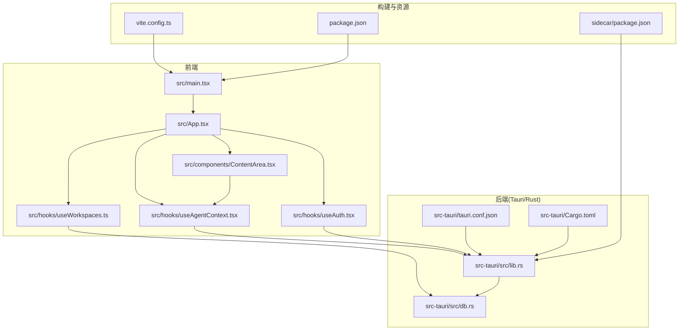
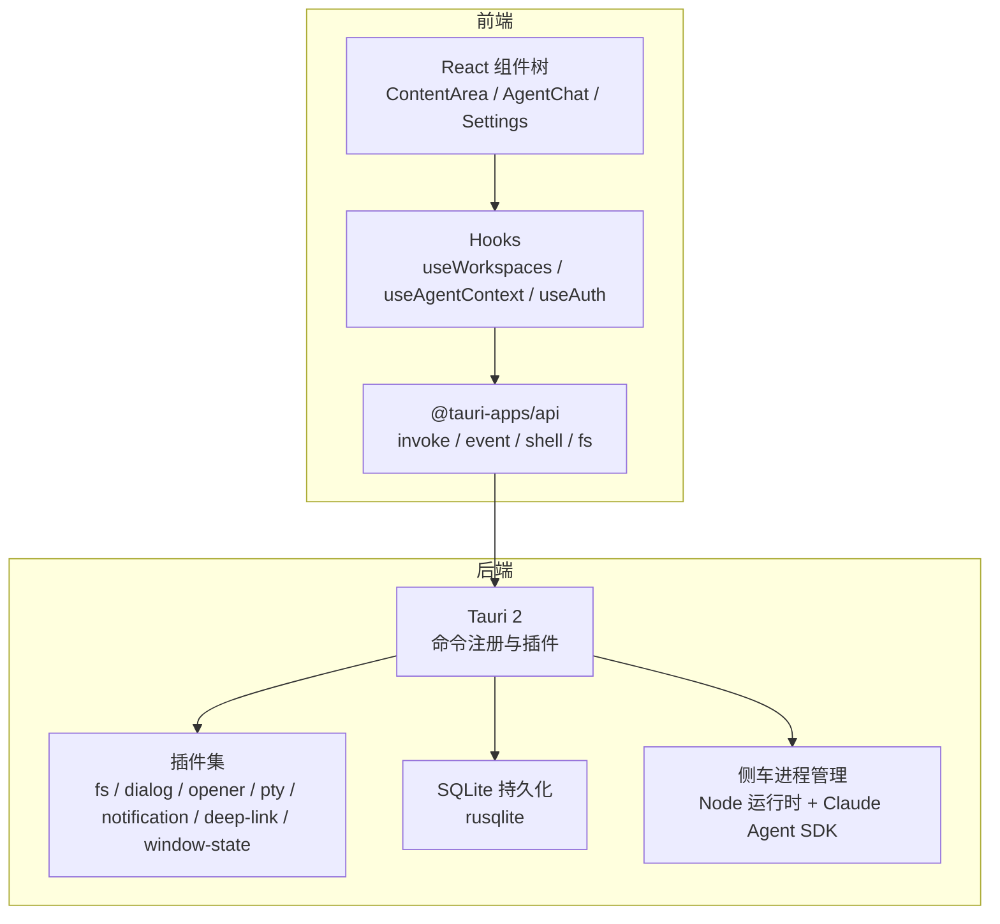
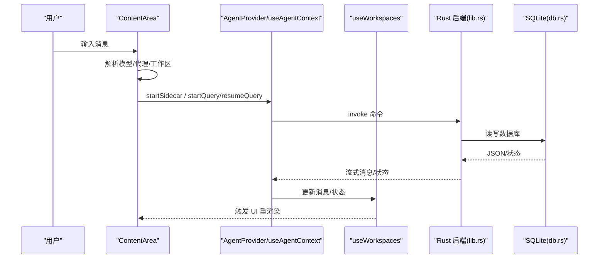
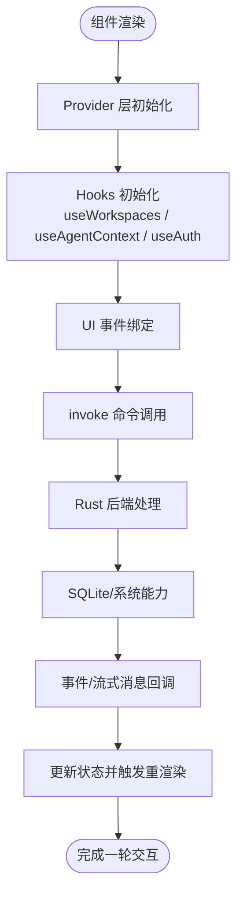
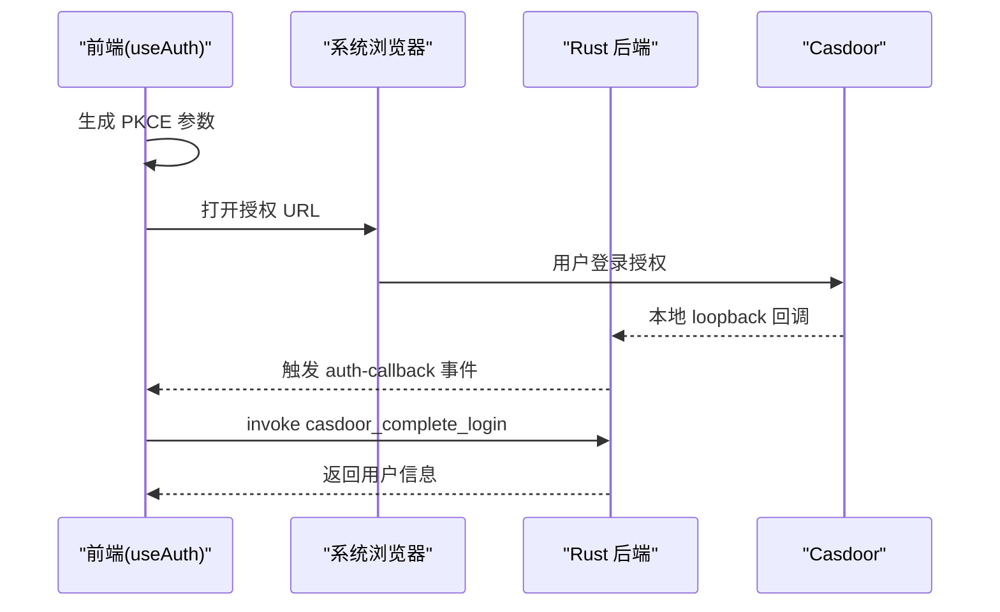
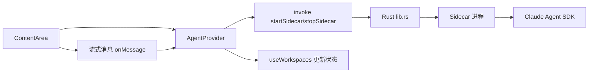
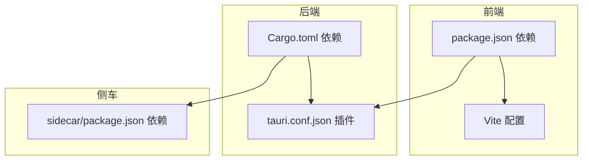
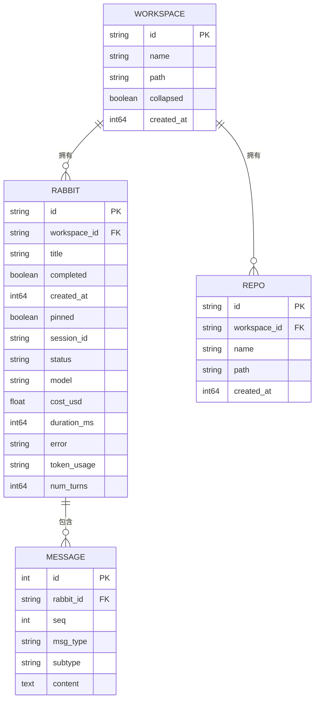

# 核心架构

<cite>
**本文引用的文件**
- [README.md](file://README.md)
- [package.json](file://package.json)
- [vite.config.ts](file://vite.config.ts)
- [src-tauri/Cargo.toml](file://src-tauri/Cargo.toml)
- [src-tauri/tauri.conf.json](file://src-tauri/tauri.conf.json)
- [src/main.tsx](file://src/main.tsx)
- [src/App.tsx](file://src/App.tsx)
- [src-tauri/src/main.rs](file://src-tauri/src/main.rs)
- [src-tauri/src/lib.rs](file://src-tauri/src/lib.rs)
- [src-tauri/src/db.rs](file://src-tauri/src/db.rs)
- [src/hooks/useWorkspaces.ts](file://src/hooks/useWorkspaces.ts)
- [src/hooks/useAgentContext.tsx](file://src/hooks/useAgentContext.tsx)
- [src/hooks/useAuth.tsx](file://src/hooks/useAuth.tsx)
- [src/components/ContentArea.tsx](file://src/components/ContentArea.tsx)
- [sidecar/package.json](file://sidecar/package.json)
</cite>

## 目录
1. [简介](#简介)
2. [项目结构](#项目结构)
3. [核心组件](#核心组件)
4. [架构总览](#架构总览)
5. [详细组件分析](#详细组件分析)
6. [依赖关系分析](#依赖关系分析)
7. [性能考量](#性能考量)
8. [故障排查指南](#故障排查指南)
9. [结论](#结论)
10. [附录](#附录)

## 简介
本文件面向 RabbitCoding 的核心架构，系统性阐述前后端分离架构、Tauri 框架集成、Rust 后端与 React 前端的交互模式。重点覆盖数据流设计、状态管理模式、组件间通信机制、架构决策的技术考量与权衡、基础设施与部署拓扑、安全与可观测性等横切关注点，并给出技术栈、第三方依赖与版本兼容性说明。

## 项目结构
RabbitCoding 采用“前端 React/Vite + 后端 Tauri/Rust”的混合桌面应用架构。前端负责 UI 与交互，后端负责系统能力（文件系统、通知、子进程、数据库、网络诊断、OAuth 回调等）。Vite 作为开发服务器，Tauri 负责打包与原生能力桥接。

**图表来源**
- [src/main.tsx:1-11](file://src/main.tsx#L1-L11)
- [src/App.tsx:1-102](file://src/App.tsx#L1-L102)
- [src-tauri/src/lib.rs:124-317](file://src-tauri/src/lib.rs#L124-L317)
- [src-tauri/src/db.rs:140-417](file://src-tauri/src/db.rs#L140-L417)
- [vite.config.ts:1-37](file://vite.config.ts#L1-L37)
- [package.json:1-46](file://package.json#L1-L46)
- [sidecar/package.json:1-25](file://sidecar/package.json#L1-L25)

**章节来源**
- [README.md:1-8](file://README.md#L1-L8)
- [package.json:1-46](file://package.json#L1-L46)
- [vite.config.ts:1-37](file://vite.config.ts#L1-L37)
- [src-tauri/tauri.conf.json:1-52](file://src-tauri/tauri.conf.json#L1-L52)

## 核心组件
- 前端入口与应用根
  - React 入口与严格模式挂载：[src/main.tsx:1-11](file://src/main.tsx#L1-L11)
  - 应用根组件：主题、国际化、工作空间与视图管理、Provider 层组合：[src/App.tsx:1-102](file://src/App.tsx#L1-L102)
- 状态与数据流
  - 工作空间与 Rabbit 生命周期管理：[src/hooks/useWorkspaces.ts:1-541](file://src/hooks/useWorkspaces.ts#L1-L541)
  - Agent 上下文与流式消息分发：[src/hooks/useAgentContext.tsx:1-298](file://src/hooks/useAgentContext.tsx#L1-L298)
  - OAuth 2.0/PKCE 登录与回调：[src/hooks/useAuth.tsx:1-252](file://src/hooks/useAuth.tsx#L1-L252)
- 交互与视图
  - 主内容区与输入、右侧面板、模型选择、仓库管理：[src/components/ContentArea.tsx:1-668](file://src/components/ContentArea.tsx#L1-L668)
- 后端能力与桥接
  - Tauri 应用入口与插件初始化：[src-tauri/src/main.rs:1-7](file://src-tauri/src/main.rs#L1-L7)
  - Rust 应用主流程与命令导出：[src-tauri/src/lib.rs:124-317](file://src-tauri/src/lib.rs#L124-L317)
  - SQLite 数据持久化与迁移：[src-tauri/src/db.rs:140-417](file://src-tauri/src/db.rs#L140-L417)
- 构建与配置
  - Vite 开发服务器与 HMR：[vite.config.ts:1-37](file://vite.config.ts#L1-L37)
  - Tauri 配置与资源打包：[src-tauri/tauri.conf.json:1-52](file://src-tauri/tauri.conf.json#L1-L52)
  - 依赖与脚本：[package.json:1-46](file://package.json#L1-L46)，[sidecar/package.json:1-25](file://sidecar/package.json#L1-L25)

**章节来源**
- [src/main.tsx:1-11](file://src/main.tsx#L1-L11)
- [src/App.tsx:1-102](file://src/App.tsx#L1-L102)
- [src/hooks/useWorkspaces.ts:1-541](file://src/hooks/useWorkspaces.ts#L1-L541)
- [src/hooks/useAgentContext.tsx:1-298](file://src/hooks/useAgentContext.tsx#L1-L298)
- [src/hooks/useAuth.tsx:1-252](file://src/hooks/useAuth.tsx#L1-L252)
- [src/components/ContentArea.tsx:1-668](file://src/components/ContentArea.tsx#L1-L668)
- [src-tauri/src/main.rs:1-7](file://src-tauri/src/main.rs#L1-L7)
- [src-tauri/src/lib.rs:124-317](file://src-tauri/src/lib.rs#L124-L317)
- [src-tauri/src/db.rs:140-417](file://src-tauri/src/db.rs#L140-L417)
- [vite.config.ts:1-37](file://vite.config.ts#L1-L37)
- [src-tauri/tauri.conf.json:1-52](file://src-tauri/tauri.conf.json#L1-L52)
- [package.json:1-46](file://package.json#L1-L46)
- [sidecar/package.json:1-25](file://sidecar/package.json#L1-L25)

## 架构总览
RabbitCoding 采用“前端 React/Vite + 后端 Tauri/Rust”的混合架构。前端通过 Tauri 的 invoke 通道调用后端命令，后端通过插件访问系统能力（文件系统、通知、终端、深链等），并通过 SQLite 持久化数据。侧车（sidecar）作为外部 Agent 协作组件，通过 Rust 进程管理与 IPC 与前端交互。

**图表来源**
- [src-tauri/src/lib.rs:124-317](file://src-tauri/src/lib.rs#L124-L317)
- [src-tauri/src/db.rs:140-417](file://src-tauri/src/db.rs#L140-L417)
- [src-tauri/tauri.conf.json:1-52](file://src-tauri/tauri.conf.json#L1-52)
- [package.json:14-36](file://package.json#L14-L36)

## 详细组件分析

### 数据流与状态管理
- 数据源与持久化
  - 前端工作空间与 Rabbit 状态通过 SQLite 持久化，首次启动支持从 localStorage 迁移，不可用时回退到 localStorage。
  - 双层防抖保存策略：500ms 防抖 + 3s 强制保存，保证流式输出场景的数据一致性。
- 状态分发
  - Agent 流式消息在 App 层聚合，通过 useAgentContext 将消息映射到具体 Rabbit 的消息列表与统计字段。
  - 侧车退出或超时兜底：统一收敛为 error，避免 UI 永远 loading。
- 交互流程
  - 用户输入 → ContentArea 解析模型与代理配置 → 确保 sidecar 就绪 → 发起查询或恢复会话 → 流式增量合并到 UI。

**图表来源**
- [src/components/ContentArea.tsx:97-169](file://src/components/ContentArea.tsx#L97-L169)
- [src/hooks/useAgentContext.tsx:88-193](file://src/hooks/useAgentContext.tsx#L88-L193)
- [src/hooks/useWorkspaces.ts:100-129](file://src/hooks/useWorkspaces.ts#L100-L129)
- [src-tauri/src/lib.rs:272-313](file://src-tauri/src/lib.rs#L272-L313)
- [src-tauri/src/db.rs:392-416](file://src-tauri/src/db.rs#L392-L416)

**章节来源**
- [src/hooks/useWorkspaces.ts:1-541](file://src/hooks/useWorkspaces.ts#L1-L541)
- [src/hooks/useAgentContext.tsx:1-298](file://src/hooks/useAgentContext.tsx#L1-L298)
- [src/components/ContentArea.tsx:1-668](file://src/components/ContentArea.tsx#L1-L668)
- [src-tauri/src/db.rs:140-417](file://src-tauri/src/db.rs#L140-L417)

### 组件间通信机制
- 前端内部通信
  - Provider 层组合：ThemeProvider → AntdThemeSync → I18nProvider → AuthProvider → CodebaseIndexProvider → AgentProvider → 内容区。
  - ContentArea 通过 useAgentContext 获取 Agent API，避免页面切换导致监听丢失。
- 前后端通信
  - Tauri invoke 通道承载命令调用（数据库、文件系统、通知、网络诊断、GitNexus、ECC、反馈、认证等）。
  - 事件通道：auth-callback 事件用于 OAuth 回调。
- 侧车协作
  - Rust 管理 sidecar 进程生命周期，前端通过 startSidecar/stopSidecar 控制，消息通过 onMessage 回调汇聚。

**图表来源**
- [src/App.tsx:29-98](file://src/App.tsx#L29-L98)
- [src/hooks/useAgentContext.tsx:88-193](file://src/hooks/useAgentContext.tsx#L88-L193)
- [src-tauri/src/lib.rs:272-313](file://src-tauri/src/lib.rs#L272-L313)

**章节来源**
- [src/App.tsx:1-102](file://src/App.tsx#L1-L102)
- [src/hooks/useAgentContext.tsx:1-298](file://src/hooks/useAgentContext.tsx#L1-L298)
- [src-tauri/src/lib.rs:124-317](file://src-tauri/src/lib.rs#L124-L317)

### 安全性与认证
- OAuth 2.0 Authorization Code + PKCE
  - 前端生成 code_verifier/code_challenge/state，打开浏览器访问 Casdoor 授权。
  - Rust 启动本地 loopback 回调服务，接收回调后通过 invoke 完成 token 交换与用户信息获取。
  - 事件通道 auth-callback 用于跨进程传递回调参数。
- 本地资源与权限
  - 生产构建注入内置 Node 运行时到 PATH，避免全局安装权限问题。
  - 通过 read_text_file_unrestricted 绕过 fs 作用域限制读取隐藏目录文件。
  - 桌面通知通过 osascript/PowerShell 方案绕过签名限制。

**图表来源**
- [src/hooks/useAuth.tsx:190-224](file://src/hooks/useAuth.tsx#L190-L224)
- [src-tauri/src/lib.rs:151-152](file://src-tauri/src/lib.rs#L151-L152)
- [src-tauri/src/lib.rs:310-312](file://src-tauri/src/lib.rs#L310-L312)

**章节来源**
- [src/hooks/useAuth.tsx:1-252](file://src/hooks/useAuth.tsx#L1-L252)
- [src-tauri/src/lib.rs:151-152](file://src-tauri/src/lib.rs#L151-L152)
- [src-tauri/src/lib.rs:310-312](file://src-tauri/src/lib.rs#L310-L312)

### 侧车与外部协作
- 侧车职责
  - 管理 Claude Agent SDK 会话，处理工具调用、流式输出、压缩与用户提问。
  - 通过 Rust 进程管理，支持启动、停止、状态查询与消息转发。
- 代理与环境变量
  - ContentArea 合并代理环境变量与模型配置，sidecar 就绪后执行查询。
  - 代理指纹变更触发 sidecar 重启，确保网络策略生效。
- 资源与运行时
  - sidecar 项目包含 Claude Agent SDK 与 TypeScript 构建脚本，Rust 在生产构建时注入内置 Node 运行时。

**图表来源**
- [src/components/ContentArea.tsx:97-169](file://src/components/ContentArea.tsx#L97-L169)
- [src/hooks/useAgentContext.tsx:88-193](file://src/hooks/useAgentContext.tsx#L88-L193)
- [src-tauri/src/lib.rs:279-282](file://src-tauri/src/lib.rs#L279-L282)
- [sidecar/package.json:12-14](file://sidecar/package.json#L12-L14)

**章节来源**
- [src/components/ContentArea.tsx:1-668](file://src/components/ContentArea.tsx#L1-L668)
- [src/hooks/useAgentContext.tsx:1-298](file://src/hooks/useAgentContext.tsx#L1-L298)
- [src-tauri/src/lib.rs:279-282](file://src-tauri/src/lib.rs#L279-L282)
- [sidecar/package.json:1-25](file://sidecar/package.json#L1-L25)

## 依赖关系分析
- 前端依赖
  - React 19、Ant Design、Monaco Editor、TailwindCSS、@tauri-apps/* 插件生态。
  - Vite 作为开发服务器与构建工具，固定端口 1420 以适配 Tauri。
- 后端依赖
  - Tauri 2、rusqlite、reqwest、tauri-plugin-*、tokio、image、base64、xcap、sysinfo 等。
  - 插件覆盖文件系统、对话框、通知、深链、PTY、窗口状态等。
- 侧车依赖
  - @anthropic-ai/claude-agent-sdk、zod、esbuild/typescript。

**图表来源**
- [package.json:14-36](file://package.json#L14-L36)
- [vite.config.ts:1-37](file://vite.config.ts#L1-L37)
- [src-tauri/Cargo.toml:20-39](file://src-tauri/Cargo.toml#L20-L39)
- [src-tauri/tauri.conf.json:44-50](file://src-tauri/tauri.conf.json#L44-L50)
- [sidecar/package.json:12-20](file://sidecar/package.json#L12-L20)

**章节来源**
- [package.json:1-46](file://package.json#L1-L46)
- [src-tauri/Cargo.toml:1-40](file://src-tauri/Cargo.toml#L1-L40)
- [src-tauri/tauri.conf.json:1-52](file://src-tauri/tauri.conf.json#L1-L52)
- [sidecar/package.json:1-25](file://sidecar/package.json#L1-L25)

## 性能考量
- 数据持久化
  - SQLite WAL 模式、外键约束、索引优化，事务批量写入减少 IO 抖动。
  - 双层防抖保存策略平衡实时性与性能。
- 窗口状态与资源
  - 窗口尺寸/位置变更时保存状态，减少重复 IO。
  - 注入内置 Node 运行时避免频繁安装 CLI 导致的性能损耗。
- 网络与代理
  - 代理指纹检测触发 sidecar 重启，确保网络策略即时生效。
- UI 渲染
  - 通过最小化状态更新与消息增量合并，降低重渲染成本。

[本节为通用性能讨论，不直接分析具体文件]

## 故障排查指南
- 数据库不可用
  - 现象：DB 命令失败，回退到 localStorage。
  - 处理：检查 app_data_dir 权限与磁盘空间；查看初始化日志。
- 侧车异常退出
  - 现象：所有 running 的查询收敛为 error。
  - 处理：检查 sidecar 日志与环境变量；确认代理指纹是否变更导致重启。
- OAuth 回调失败
  - 现象：auth-callback 事件未触发或 state 不匹配。
  - 处理：确认本地回调服务已启动；检查 PKCE 临时数据与 state 校验。
- 通知无法弹出
  - 现象：通知设置页面无法打开或通知未显示。
  - 处理：macOS 使用 osascript，Windows 使用 PowerShell；检查权限与签名。

**章节来源**
- [src-tauri/src/lib.rs:141-149](file://src-tauri/src/lib.rs#L141-L149)
- [src-tauri/src/lib.rs:181-211](file://src-tauri/src/lib.rs#L181-L211)
- [src/hooks/useAuth.tsx:100-187](file://src/hooks/useAuth.tsx#L100-L187)
- [src-tauri/src/lib.rs:65-114](file://src-tauri/src/lib.rs#L65-L114)

## 结论
RabbitCoding 通过 Tauri 将 Rust 的系统能力与 React 的前端体验无缝结合，形成稳定、可扩展且具备良好用户体验的桌面应用架构。其核心优势在于：
- 明确的前后端边界与命令/事件通道，便于演进与测试。
- 以 SQLite 为核心的持久化与迁移策略，兼顾可靠性与易用性。
- 侧车进程化协作与代理环境变量解耦，满足复杂网络与工具链需求。
- Provider 层的状态聚合与兜底策略，保障 UI 一致性与健壮性。

[本节为总结性内容，不直接分析具体文件]

## 附录

### 技术栈与版本兼容性
- 前端
  - React 19、TypeScript ~5.8、Vite 7、Ant Design 6、TailwindCSS 4、Monaco Editor 0.55、@tauri-apps/* 生态。
- 后端
  - Tauri 2、Rust 2021、rusqlite 0.32、reqwest 0.12、tauri-plugin-*、tokio 1、image 0.25、base64 0.22、xcap 0.9、sysinfo 0.32。
- 侧车
  - @anthropic-ai/claude-agent-sdk ^0.3.177、zod ^4.4.3、esbuild ^0.25.12、typescript ~5.8。

**章节来源**
- [package.json:14-44](file://package.json#L14-L44)
- [src-tauri/Cargo.toml:20-39](file://src-tauri/Cargo.toml#L20-L39)
- [sidecar/package.json:12-20](file://sidecar/package.json#L12-L20)

### 基础设施与部署拓扑
- 开发环境
  - Vite 固定端口 1420，HMR 通过 WebSocket 与主机绑定；忽略 src-tauri 目录。
  - Tauri 前端构建产物输出至 dist，开发前/构建前命令分别调用 pnpm dev/build。
- 生产环境
  - 打包 targets 为 all，包含图标资源与 sidecar/node-runtime 资源。
  - macOS 使用 Entitlements.plist，深链 scheme 为 rabbitcoding。
  - 注入内置 Node 运行时与 npm 全局前缀到 PATH/NPM_CONFIG_PREFIX，避免权限问题。

**章节来源**
- [vite.config.ts:15-37](file://vite.config.ts#L15-L37)
- [src-tauri/tauri.conf.json:6-11](file://src-tauri/tauri.conf.json#L6-L11)
- [src-tauri/tauri.conf.json:26-43](file://src-tauri/tauri.conf.json#L26-L43)
- [src-tauri/src/lib.rs:154-211](file://src-tauri/src/lib.rs#L154-L211)

### 数据模型与持久化

**图表来源**
- [src-tauri/src/db.rs:85-138](file://src-tauri/src/db.rs#L85-L138)
- [src-tauri/src/db.rs:167-288](file://src-tauri/src/db.rs#L167-L288)