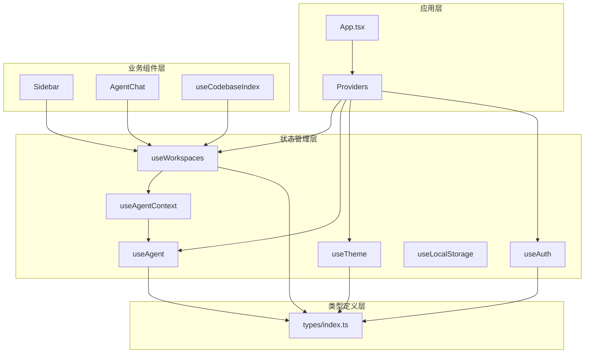
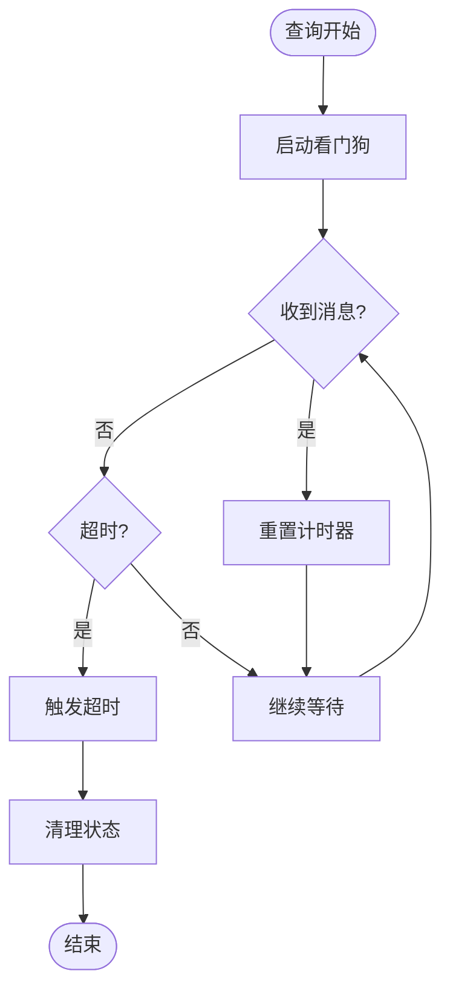
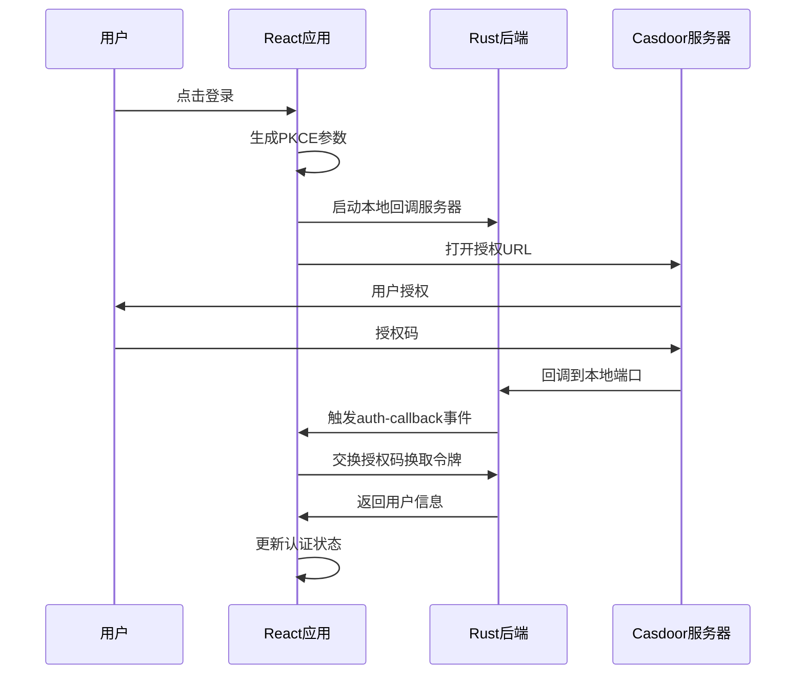
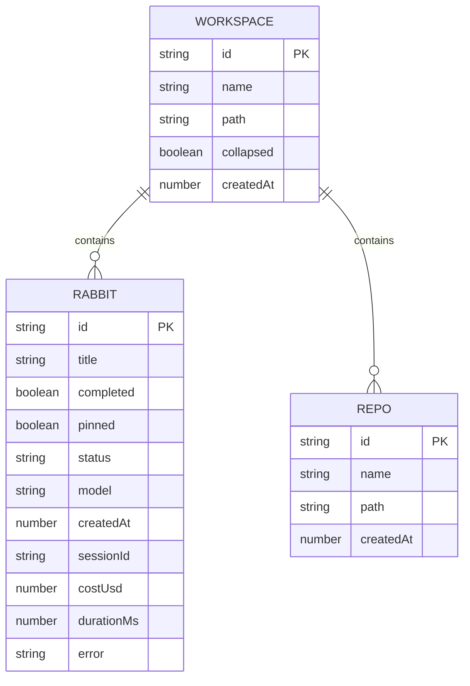
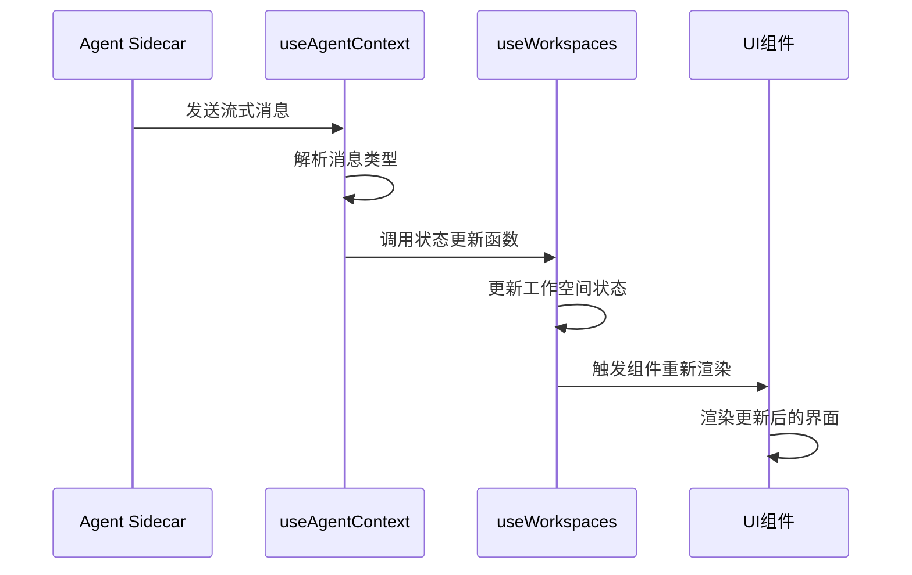
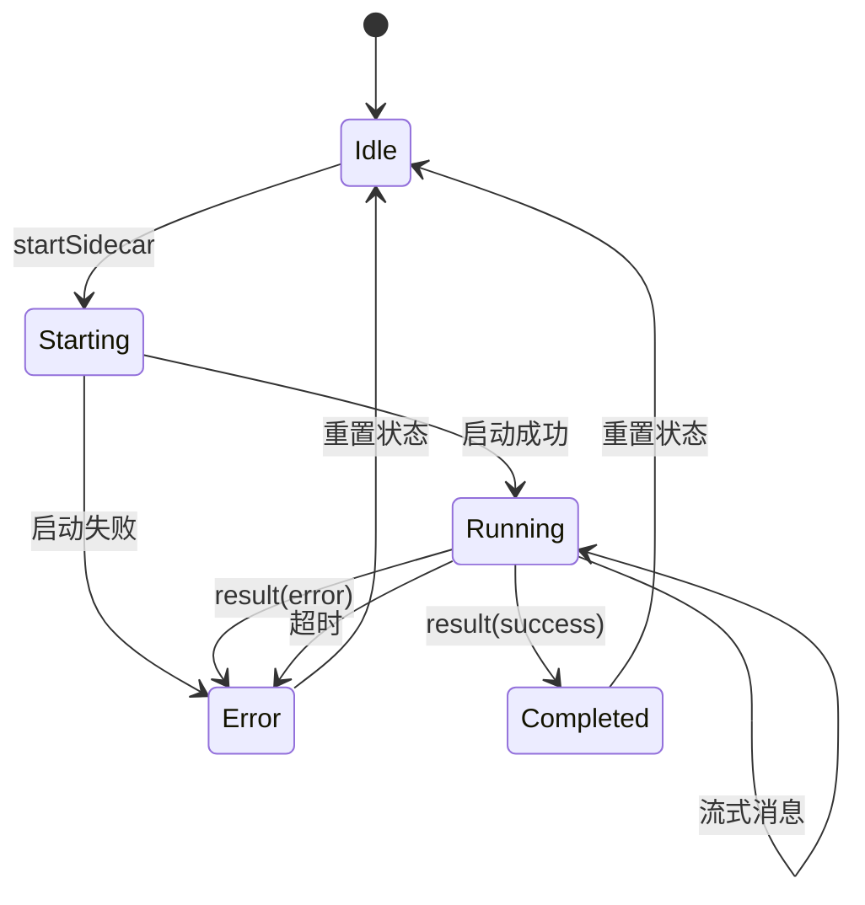
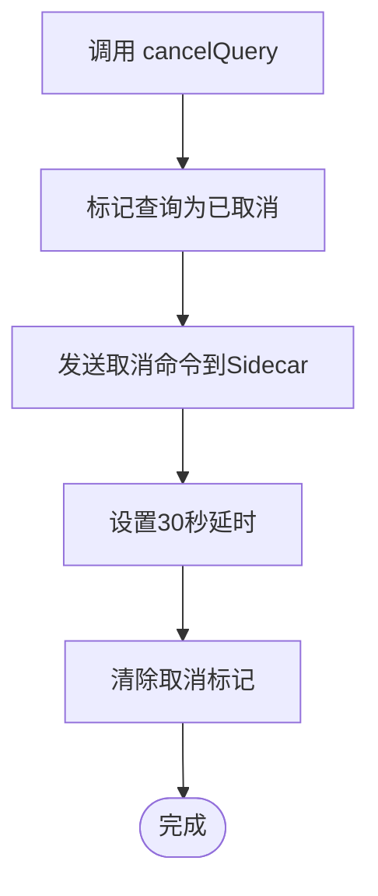
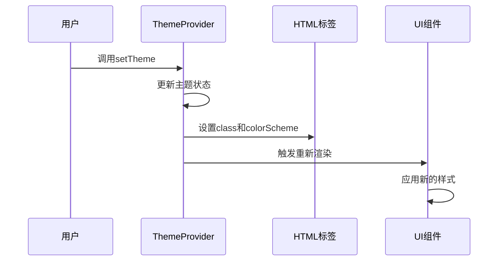
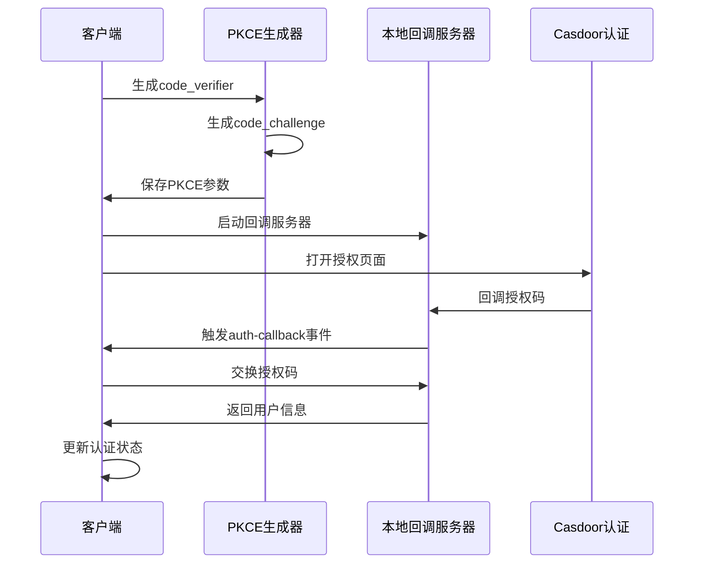
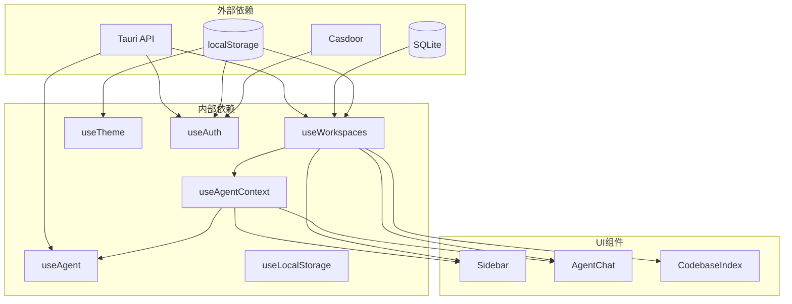

# 状态管理

<cite>
**本文档引用的文件**
- [useWorkspaces.ts](file://src/hooks/useWorkspaces.ts)
- [useAgent.ts](file://src/hooks/useAgent.ts)
- [useAgentContext.tsx](file://src/hooks/useAgentContext.tsx)
- [useTheme.tsx](file://src/hooks/useTheme.tsx)
- [useAuth.tsx](file://src/hooks/useAuth.tsx)
- [useLocalStorage.ts](file://src/hooks/useLocalStorage.ts)
- [App.tsx](file://src/App.tsx)
- [AgentChat.tsx](file://src/components/agent/AgentChat.tsx)
- [Sidebar.tsx](file://src/components/sidebar/Sidebar.tsx)
- [useCodebaseIndex.tsx](file://src/hooks/useCodebaseIndex.tsx)
- [types/index.ts](file://src/types/index.ts)
- [package.json](file://package.json)
</cite>

## 目录
1. [简介](#简介)
2. [项目结构](#项目结构)
3. [核心组件](#核心组件)
4. [架构总览](#架构总览)
5. [详细组件分析](#详细组件分析)
6. [依赖关系分析](#依赖关系分析)
7. [性能考虑](#性能考虑)
8. [故障排除指南](#故障排除指南)
9. [结论](#结论)

## 简介

RabbitCoding 是一个基于 React 19 开发的 AI 协作开发平台，采用自定义 Hooks 的状态管理模式。本文档深入解析其状态架构，包括工作空间状态、AI 代理状态、主题状态、认证状态等，详细说明状态提升策略、状态同步机制、副作用处理，以及 React 19 新特性的应用。

## 项目结构

项目采用模块化的状态管理架构，主要分为以下层次：



**图表来源**
- [App.tsx:30-104](file://src/App.tsx#L30-L104)
- [useWorkspaces.ts:28-541](file://src/hooks/useWorkspaces.ts#L28-L541)
- [useAgent.ts:53-334](file://src/hooks/useAgent.ts#L53-L334)
- [useAgentContext.tsx:88-285](file://src/hooks/useAgentContext.tsx#L88-L285)

**章节来源**
- [App.tsx:1-107](file://src/App.tsx#L1-L107)
- [package.json:32-35](file://package.json#L32-L35)

## 核心组件

### 工作空间状态管理 (useWorkspaces)

工作空间状态管理是整个应用的核心，负责管理用户的工作空间、兔子任务、仓库等数据。

#### 状态结构
- **工作空间数据**: 包含工作空间基本信息、兔子任务列表、仓库列表
- **选中状态**: 当前选中的工作空间和兔子
- **编辑状态**: 当前编辑的实体
- **加载状态**: 数据加载和数据库就绪状态

#### 关键特性
- **双层防抖保存**: 500ms 延迟保存 + 3s 强制保存
- **数据迁移**: 从 localStorage 迁移到 SQLite
- **兼容性处理**: 旧数据格式兼容
- **流式消息处理**: 支持 AI 代理的流式消息增量更新

**章节来源**
- [useWorkspaces.ts:28-541](file://src/hooks/useWorkspaces.ts#L28-L541)

### AI 代理状态管理 (useAgent)

AI 代理状态管理负责与 Claude Agent SDK 的通信，处理流式消息和查询生命周期。

#### 核心功能
- **Sidecar 进程管理**: 启动、停止、状态检查
- **查询生命周期**: 启动查询、恢复查询、取消查询、压缩查询
- **看门狗机制**: 查询超时监控
- **流式消息处理**: 支持文本和思考过程的增量更新

#### 看门狗机制


**图表来源**
- [useAgent.ts:66-101](file://src/hooks/useAgent.ts#L66-L101)
- [useAgent.ts:262-320](file://src/hooks/useAgent.ts#L262-L320)

**章节来源**
- [useAgent.ts:53-334](file://src/hooks/useAgent.ts#L53-L334)

### 代理上下文提升 (useAgentContext)

代理上下文提升将 useAgent 的监听器和回调提升到应用层级，确保页面切换时不会丢失流式消息。

#### 提升策略
- **全局监听**: 在应用根部设置事件监听器
- **状态同步**: 将流式消息转换为工作空间状态更新
- **查询隔离**: 每个查询独立的状态管理
- **错误兜底**: 进程退出和超时的统一处理

**章节来源**
- [useAgentContext.tsx:88-285](file://src/hooks/useAgentContext.tsx#L88-L285)

### 主题状态管理 (useTheme)

主题状态管理提供系统、浅色、深色三种主题模式，支持系统主题跟随。

#### 特性
- **系统主题跟随**: 监听系统颜色方案变化
- **持久化存储**: 主题偏好存储在 localStorage
- **HTML 标签同步**: 将主题同步到 html 根元素
- **CSS 变量支持**: 支持 colorScheme CSS 变量

**章节来源**
- [useTheme.tsx:25-63](file://src/hooks/useTheme.tsx#L25-L63)

### 认证状态管理 (useAuth)

认证状态管理实现 Casdoor OAuth 2.0 Authorization Code + PKCE 登录流程。

#### OAuth 流程


**图表来源**
- [useAuth.tsx:100-187](file://src/hooks/useAuth.tsx#L100-L187)
- [useAuth.tsx:190-224](file://src/hooks/useAuth.tsx#L190-L224)

**章节来源**
- [useAuth.tsx:94-241](file://src/hooks/useAuth.tsx#L94-L241)

## 架构总览

### 状态流架构

```mermaid
graph TB
subgraph "外部系统"
Sidecar[Agent Sidecar]
DB[(SQLite数据库)]
LocalStorage[(localStorage)]
Casdoor[Casdoor服务器]
end
subgraph "React应用层"
App[App.tsx]
subgraph "状态管理Hooks"
WS[useWorkspaces]
UA[useAgent]
AC[useAgentContext]
TH[useTheme]
AU[useAuth]
LST[useLocalStorage]
end
subgraph "UI组件"
SB[Sidebar]
AC[AgentChat]
CI[CodebaseIndex]
end
end
Sidecar <- --> UA
UA <- --> AC
AC <- --> WS
DB <- --> WS
LocalStorage <- --> WS
LocalStorage <- --> TH
LocalStorage <- --> AU
Casdoor <- --> AU
App --> WS
App --> UA
App --> TH
App --> AU
SB --> WS
AC --> WS
CI --> WS
```

**图表来源**
- [App.tsx:68-102](file://src/App.tsx#L68-L102)
- [useWorkspaces.ts:48-95](file://src/hooks/useWorkspaces.ts#L48-L95)
- [useAgent.ts:106-151](file://src/hooks/useAgent.ts#L106-L151)

### 状态提升策略

应用采用了多层次的状态提升策略：

1. **应用级提升**: 将工作空间状态提升到 App 组件
2. **代理级提升**: 将 Agent 事件监听器提升到 AgentProvider
3. **主题级提升**: 将主题状态提升到 ThemeProvider
4. **认证级提升**: 将认证状态提升到 AuthProvider

这种设计确保了：
- 状态在组件树中的一致性
- 避免重复渲染
- 统一的错误处理
- 跨组件的状态共享

**章节来源**
- [App.tsx:30-47](file://src/App.tsx#L30-L47)
- [useAgentContext.tsx:88-193](file://src/hooks/useAgentContext.tsx#L88-L193)

## 详细组件分析

### 工作空间状态管理详解

#### 数据结构设计



**图表来源**
- [types/index.ts:34-42](file://src/types/index.ts#L34-L42)
- [types/index.ts:8-32](file://src/types/index.ts#L8-L32)
- [types/index.ts:1-6](file://src/types/index.ts#L1-L6)

#### 状态更新策略

工作空间状态管理实现了多种状态更新策略：

1. **函数式更新**: 使用回调函数确保状态更新的正确性
2. **不可变更新**: 通过对象展开操作符创建新状态
3. **批量更新**: 将多个状态更新合并为单次渲染
4. **条件更新**: 根据条件判断是否需要更新状态

#### 流式消息处理



**图表来源**
- [useAgentContext.tsx:93-178](file://src/hooks/useAgentContext.tsx#L93-L178)
- [useWorkspaces.ts:404-449](file://src/hooks/useWorkspaces.ts#L404-L449)

**章节来源**
- [useWorkspaces.ts:149-323](file://src/hooks/useWorkspaces.ts#L149-L323)
- [useWorkspaces.ts:324-541](file://src/hooks/useWorkspaces.ts#L324-L541)

### AI 代理状态管理详解

#### 查询生命周期管理



**图表来源**
- [useAgent.ts:54-56](file://src/hooks/useAgent.ts#L54-L56)
- [useAgent.ts:156-177](file://src/hooks/useAgent.ts#L156-L177)
- [useAgent.ts:182-205](file://src/hooks/useAgent.ts#L182-L205)

#### 看门狗机制实现

看门狗机制通过以下方式实现：

1. **查询独立计时**: 每个查询维护独立的计时器
2. **思考态特殊处理**: 思考过程使用更宽松的超时阈值
3. **消息重置机制**: 收到任何消息都重置计时器
4. **统一清理**: 组件卸载时清理所有计时器

**章节来源**
- [useAgent.ts:66-101](file://src/hooks/useAgent.ts#L66-L101)
- [useAgent.ts:262-320](file://src/hooks/useAgent.ts#L262-L320)

### 代理上下文提升详解

#### 状态同步机制

代理上下文提升实现了以下状态同步机制：

1. **消息路由**: 将 Agent 消息路由到对应的工作空间
2. **状态转换**: 将原始消息转换为工作空间状态更新
3. **查询隔离**: 每个查询的状态独立管理
4. **错误传播**: 错误状态在整个应用中传播

#### 取消查询处理



**图表来源**
- [useAgentContext.tsx:195-201](file://src/hooks/useAgentContext.tsx#L195-L201)

**章节来源**
- [useAgentContext.tsx:195-285](file://src/hooks/useAgentContext.tsx#L195-L285)

### 主题状态管理详解

#### 主题切换流程



**图表来源**
- [useTheme.tsx:25-56](file://src/hooks/useTheme.tsx#L25-L56)
- [useTheme.tsx:44-49](file://src/hooks/useTheme.tsx#L44-L49)

**章节来源**
- [useTheme.tsx:25-63](file://src/hooks/useTheme.tsx#L25-L63)

### 认证状态管理详解

#### PKCE 认证流程



**图表来源**
- [useAuth.tsx:190-224](file://src/hooks/useAuth.tsx#L190-L224)
- [useAuth.tsx:100-187](file://src/hooks/useAuth.tsx#L100-L187)

**章节来源**
- [useAuth.tsx:94-241](file://src/hooks/useAuth.tsx#L94-L241)

## 依赖关系分析

### 状态管理依赖图



**图表来源**
- [useWorkspaces.ts:1-6](file://src/hooks/useWorkspaces.ts#L1-L6)
- [useAgent.ts:8-11](file://src/hooks/useAgent.ts#L8-L11)
- [useAuth.tsx:21-24](file://src/hooks/useAuth.tsx#L21-L24)

### 状态一致性保证

应用通过以下机制保证状态一致性：

1. **单向数据流**: 状态只能通过预定义的函数更新
2. **不可变更新**: 所有状态更新都是不可变的
3. **副作用隔离**: 副作用通过 useEffect 管理
4. **错误边界**: 全局错误处理机制

**章节来源**
- [useWorkspaces.ts:324-340](file://src/hooks/useWorkspaces.ts#L324-L340)
- [useAgent.ts:262-320](file://src/hooks/useAgent.ts#L262-L320)

## 性能考虑

### React 19 新特性应用

虽然项目使用 React 19，但在当前版本中主要应用了以下特性：

1. **并发更新**: 通过合理的状态拆分和更新策略
2. **状态优化**: 使用 useMemo 和 useCallback 优化渲染
3. **Suspense**: 通过 loading 状态管理组件渲染

### 性能优化策略

#### 渲染优化
- **组件记忆化**: 使用 useMemo 优化复杂计算
- **函数稳定化**: 使用 useCallback 稳定函数引用
- **条件渲染**: 仅在必要时渲染组件

#### 状态优化
- **状态拆分**: 将大对象拆分为多个小状态
- **批量更新**: 合并多个状态更新
- **防抖处理**: 使用防抖减少不必要的更新

#### 内存优化
- **清理机制**: 及时清理事件监听器和定时器
- **引用优化**: 使用 useRef 避免不必要的重渲染
- **资源释放**: 组件卸载时释放所有资源

## 故障排除指南

### 常见问题及解决方案

#### 数据库连接问题
**症状**: 应用启动缓慢或数据加载失败
**解决方案**: 
1. 检查 SQLite 数据库文件权限
2. 验证数据库完整性
3. 清理损坏的数据文件

#### 代理连接问题
**症状**: AI 功能不可用或响应超时
**解决方案**:
1. 检查网络连接
2. 验证 API 密钥有效性
3. 查看代理日志

#### 认证问题
**症状**: 登录失败或会话过期
**解决方案**:
1. 检查 PKCE 参数是否正确
2. 验证回调 URL 配置
3. 清理浏览器缓存

#### 主题切换问题
**症状**: 主题切换不生效
**解决方案**:
1. 检查 HTML 根元素类名
2. 验证 CSS 变量支持
3. 刷新页面重新应用

**章节来源**
- [useWorkspaces.ts:74-92](file://src/hooks/useWorkspaces.ts#L74-L92)
- [useAgent.ts:142-151](file://src/hooks/useAgent.ts#L142-L151)
- [useAuth.tsx:161-167](file://src/hooks/useAuth.tsx#L161-L167)

## 结论

RabbitCoding 的状态管理架构展现了现代 React 应用的最佳实践：

1. **模块化设计**: 每个 Hook 负责特定领域的状态管理
2. **状态提升**: 通过 Provider 模式实现跨组件状态共享
3. **副作用管理**: 通过 useEffect 和清理函数管理副作用
4. **错误处理**: 全面的错误处理和降级机制
5. **性能优化**: 合理的状态拆分和渲染优化

该架构为大型应用提供了可扩展的状态管理基础，支持复杂的业务逻辑和良好的用户体验。通过深入理解这些状态管理模式，开发者可以更好地维护和扩展应用功能。