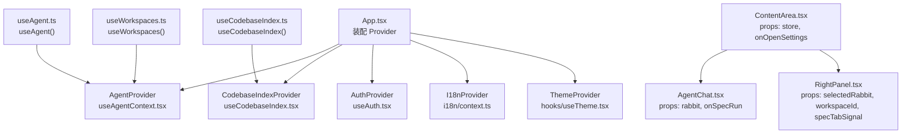
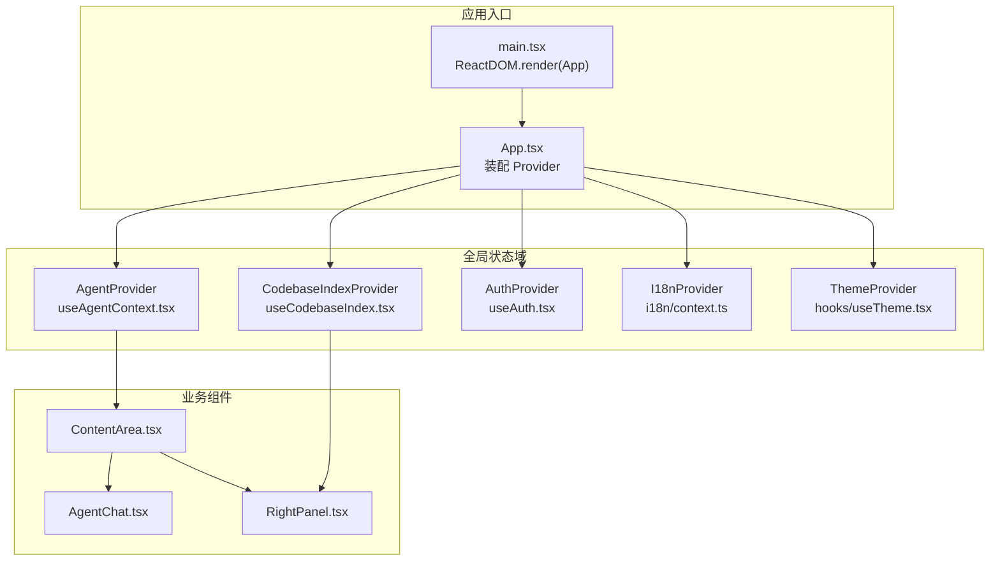
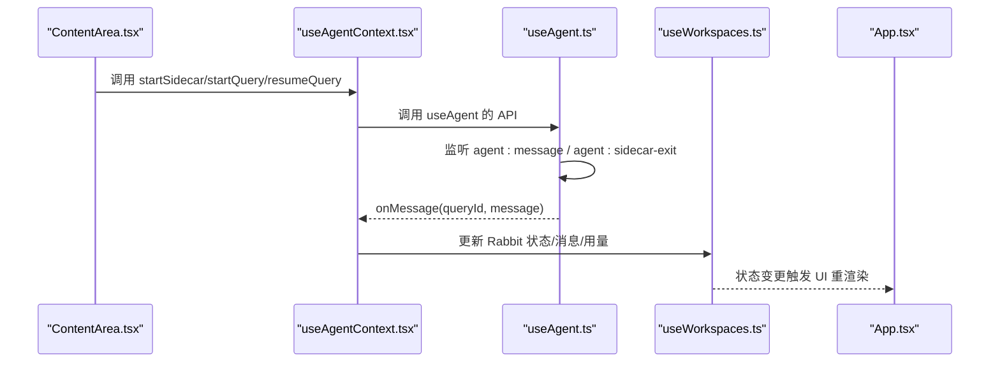
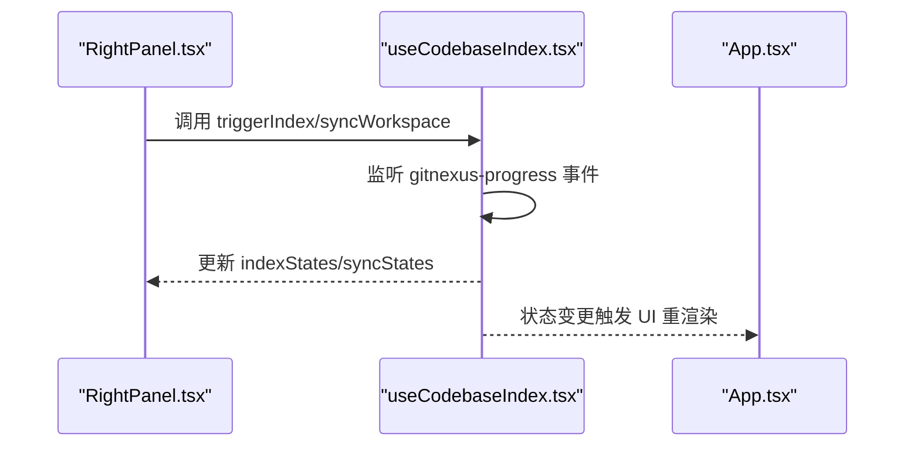
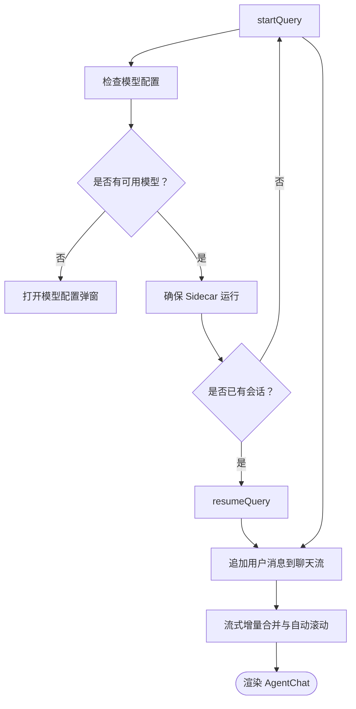
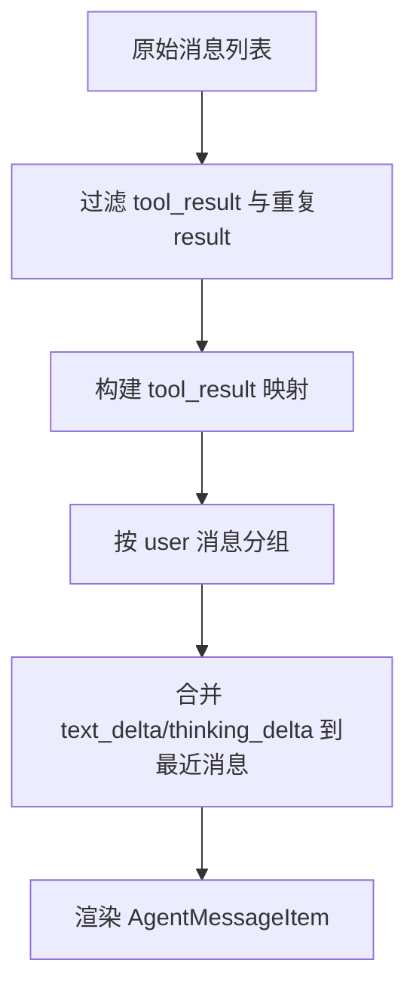
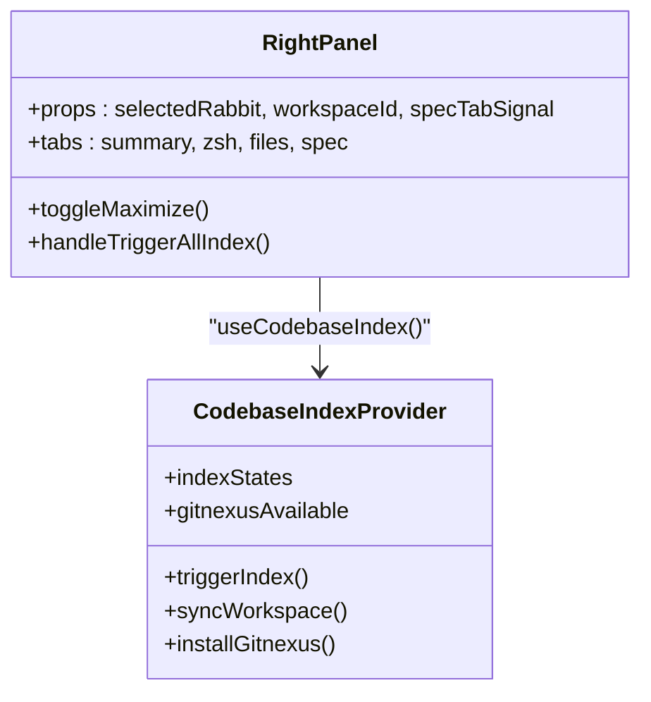
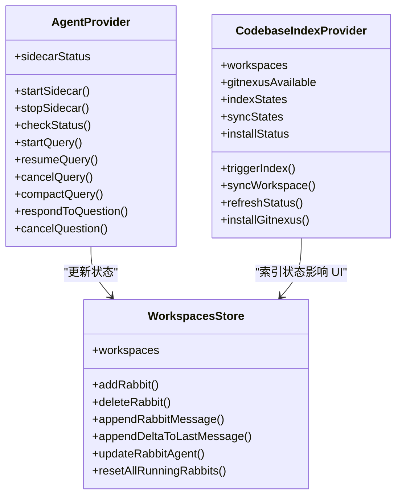
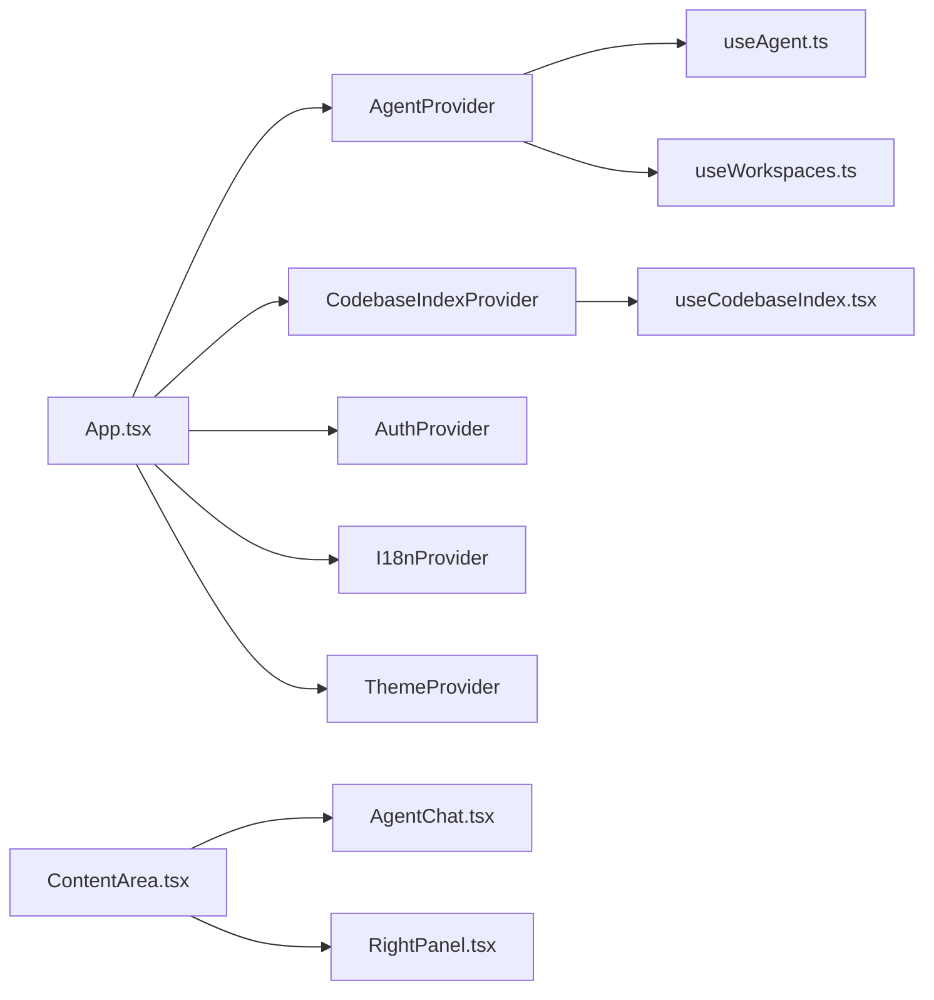

# 组件通信机制

<cite>
**本文档引用的文件**
- [src/App.tsx](file://src/App.tsx)
- [src/main.tsx](file://src/main.tsx)
- [src/hooks/useAgent.ts](file://src/hooks/useAgent.ts)
- [src/hooks/useAgentContext.tsx](file://src/hooks/useAgentContext.tsx)
- [src/hooks/useCodebaseIndex.tsx](file://src/hooks/useCodebaseIndex.tsx)
- [src/hooks/useWorkspaces.ts](file://src/hooks/useWorkspaces.ts)
- [src/components/ContentArea.tsx](file://src/components/ContentArea.tsx)
- [src/components/agent/AgentChat.tsx](file://src/components/agent/AgentChat.tsx)
- [src/components/RightPanel.tsx](file://src/components/RightPanel.tsx)
- [src/types/index.ts](file://src/types/index.ts)
- [src/constants/providers.ts](file://src/constants/providers.ts)
</cite>

## 目录
1. [简介](#简介)
2. [项目结构](#项目结构)
3. [核心组件](#核心组件)
4. [架构总览](#架构总览)
5. [详细组件分析](#详细组件分析)
6. [依赖关系分析](#依赖关系分析)
7. [性能考量](#性能考量)
8. [故障排查指南](#故障排查指南)
9. [结论](#结论)
10. [附录](#附录)

## 简介
本文件系统性梳理 RabbitCoding 的组件通信机制，重点覆盖以下方面：
- 父子组件通信：通过 props 逐层传递数据与回调，典型如 ContentArea 向 AgentChat 传递 Rabbit 数据。
- 兄弟组件通信：通过共享 Context（AgentProvider、CodebaseIndexProvider）实现跨层级共享状态。
- 跨层级通信：通过顶层 Provider（App）聚合多个 Context，确保页面切换时不丢失流式消息与索引状态。
- Props 传递、事件回调、Context API 的使用模式：明确数据流向与控制流。
- Provider 模式：AgentProvider、CodebaseIndexProvider 等如何封装底层能力并暴露统一接口。
- 组件树结构图、通信流程图与具体代码实现示例路径。

## 项目结构
应用采用“Provider 聚合 + Hooks 封装 + 组件消费”的分层架构：
- 顶层 App 负责装配多个 Provider，形成全局状态域。
- useAgent/useCodebaseIndex/useWorkspaces 等 Hooks 封装底层能力（事件监听、命令调用、状态管理）。
- 组件通过 props 与 Context API 进行通信，实现父子、兄弟与跨层级协作。

图表来源
- [src/App.tsx:30-103](file://src/App.tsx#L30-L103)
- [src/hooks/useAgentContext.tsx:88-285](file://src/hooks/useAgentContext.tsx#L88-L285)
- [src/hooks/useCodebaseIndex.tsx:79-500](file://src/hooks/useCodebaseIndex.tsx#L79-L500)
- [src/hooks/useAgent.ts:53-333](file://src/hooks/useAgent.ts#L53-L333)
- [src/hooks/useWorkspaces.ts:28-540](file://src/hooks/useWorkspaces.ts#L28-L540)
- [src/hooks/useCodebaseIndex.tsx:48-512](file://src/hooks/useCodebaseIndex.tsx#L48-L512)
- [src/components/ContentArea.tsx:31-690](file://src/components/ContentArea.tsx#L31-L690)
- [src/components/agent/AgentChat.tsx:87-215](file://src/components/agent/AgentChat.tsx#L87-L215)
- [src/components/RightPanel.tsx:220-740](file://src/components/RightPanel.tsx#L220-L740)

章节来源
- [src/App.tsx:30-103](file://src/App.tsx#L30-L103)
- [src/main.tsx:1-11](file://src/main.tsx#L1-L11)

## 核心组件
- App：装配多个 Provider，形成全局状态域，负责视图切换与数据加载。
- AgentProvider：将 useAgent 的事件监听与消息处理提升至 App 层，确保页面切换不丢失流式消息。
- CodebaseIndexProvider：封装 GitNexus 索引状态、安装状态与进度事件，提供统一的索引操作接口。
- useWorkspaces：集中管理 Workspace/Rabbit/Repo 等数据，提供增删改查与持久化策略。
- ContentArea：主内容区，负责触发 Agent 查询、处理 API Key、代理配置与侧边栏联动。
- AgentChat：渲染对话流，处理 tool_use 与 tool_result 的关联、流式增量合并与自动滚动。
- RightPanel：右侧面板，汇总进展、产物、引用、仓库与索引状态，支持多标签页与懒加载。

章节来源
- [src/App.tsx:30-103](file://src/App.tsx#L30-L103)
- [src/hooks/useAgentContext.tsx:88-285](file://src/hooks/useAgentContext.tsx#L88-L285)
- [src/hooks/useCodebaseIndex.tsx:79-500](file://src/hooks/useCodebaseIndex.tsx#L79-L500)
- [src/hooks/useWorkspaces.ts:28-540](file://src/hooks/useWorkspaces.ts#L28-L540)
- [src/components/ContentArea.tsx:31-690](file://src/components/ContentArea.tsx#L31-L690)
- [src/components/agent/AgentChat.tsx:87-215](file://src/components/agent/AgentChat.tsx#L87-L215)
- [src/components/RightPanel.tsx:220-740](file://src/components/RightPanel.tsx#L220-L740)

## 架构总览
应用采用“Provider 聚合 + Hooks 封装 + 组件消费”的分层架构，结合 Context API 实现跨层级状态共享与事件驱动的数据流。

图表来源
- [src/main.tsx:6-10](file://src/main.tsx#L6-L10)
- [src/App.tsx:68-99](file://src/App.tsx#L68-L99)
- [src/hooks/useAgentContext.tsx:88-285](file://src/hooks/useAgentContext.tsx#L88-L285)
- [src/hooks/useCodebaseIndex.tsx:79-500](file://src/hooks/useCodebaseIndex.tsx#L79-L500)
- [src/components/ContentArea.tsx:104-105](file://src/components/ContentArea.tsx#L104-L105)
- [src/components/agent/AgentChat.tsx:87-215](file://src/components/agent/AgentChat.tsx#L87-L215)
- [src/components/RightPanel.tsx:220-740](file://src/components/RightPanel.tsx#L220-L740)

## 详细组件分析

### AgentProvider 与 useAgent：父子/跨层级通信
- 父子通信：App 将 useWorkspaces 的 store 作为 props 传入 AgentProvider，ContentArea 通过 useAgentContext 获取统一的 Agent API。
- 跨层级通信：AgentProvider 将 useAgent 的事件监听与消息处理提升至 App 层，避免页面切换导致监听丢失。
- 事件回调：useAgent 通过 Tauri 事件通道接收 agent:message 与 agent:sidecar-exit，AgentProvider 负责将消息映射到 store 中的 Rabbit 状态与消息列表。
- 取消与兜底：提供 cancelQuery、rollbackQueryToError 等包装方法，确保 UI 状态与后端一致性。

图表来源
- [src/components/ContentArea.tsx:104-105](file://src/components/ContentArea.tsx#L104-L105)
- [src/hooks/useAgentContext.tsx:88-285](file://src/hooks/useAgentContext.tsx#L88-L285)
- [src/hooks/useAgent.ts:262-320](file://src/hooks/useAgent.ts#L262-L320)
- [src/hooks/useWorkspaces.ts:324-402](file://src/hooks/useWorkspaces.ts#L324-L402)
- [src/App.tsx:68-99](file://src/App.tsx#L68-L99)

章节来源
- [src/hooks/useAgentContext.tsx:88-285](file://src/hooks/useAgentContext.tsx#L88-L285)
- [src/hooks/useAgent.ts:53-333](file://src/hooks/useAgent.ts#L53-L333)
- [src/hooks/useWorkspaces.ts:324-402](file://src/hooks/useWorkspaces.ts#L324-L402)
- [src/components/ContentArea.tsx:104-105](file://src/components/ContentArea.tsx#L104-L105)

### CodebaseIndexProvider：兄弟组件共享与跨层级通信
- 兄弟组件通信：RightPanel 通过 useCodebaseIndex 获取索引状态与操作接口，与 ContentArea 无直接 props 依赖，但共享同一 Provider。
- 跨层级通信：Provider 在 App 层装配，确保不同路由下的组件都能访问一致的索引状态。
- 事件驱动：监听 gitnexus-progress/gitnexus-install-progress 事件，实时更新索引状态与进度。
- 操作封装：triggerIndex/syncWorkspace/installGitnexus 等方法统一封装命令调用与状态更新。

图表来源
- [src/components/RightPanel.tsx:220-740](file://src/components/RightPanel.tsx#L220-L740)
- [src/hooks/useCodebaseIndex.tsx:79-500](file://src/hooks/useCodebaseIndex.tsx#L79-L500)
- [src/App.tsx:68-99](file://src/App.tsx#L68-L99)

章节来源
- [src/hooks/useCodebaseIndex.tsx:79-500](file://src/hooks/useCodebaseIndex.tsx#L79-L500)
- [src/components/RightPanel.tsx:220-740](file://src/components/RightPanel.tsx#L220-L740)

### ContentArea：Props 传递与事件回调
- Props 传递：ContentArea 接收 store 与 onOpenSettings，向下传递给 AgentChat/RightPanel。
- 事件回调：handleSubmit/onSubmit 等回调负责触发 Agent 查询、处理 API Key 与代理配置变更。
- 与 AgentProvider 的协作：通过 useAgentContext 获取统一的 Agent API，确保跨页面切换消息不丢失。

图表来源
- [src/components/ContentArea.tsx:269-400](file://src/components/ContentArea.tsx#L269-L400)
- [src/components/agent/AgentChat.tsx:87-130](file://src/components/agent/AgentChat.tsx#L87-L130)

章节来源
- [src/components/ContentArea.tsx:269-400](file://src/components/ContentArea.tsx#L269-L400)
- [src/components/agent/AgentChat.tsx:87-130](file://src/components/agent/AgentChat.tsx#L87-L130)

### AgentChat：消息分组与流式增量
- 消息分组：根据 user 消息进行分组，确保“下一条推上一条”的视觉效果。
- 流式增量：将 text_delta/thinking_delta 合并到最近一条同类型消息，避免重复渲染。
- 工具调用关联：将 assistant:tool_use 与 tool_result 进行配对，提升可读性。

图表来源
- [src/components/agent/AgentChat.tsx:38-85](file://src/components/agent/AgentChat.tsx#L38-L85)

章节来源
- [src/components/agent/AgentChat.tsx:38-85](file://src/components/agent/AgentChat.tsx#L38-L85)

### RightPanel：索引状态与多标签页
- 索引状态：通过 useCodebaseIndex 获取 docs/repo 的索引状态，支持一键触发与错误展示。
- 多标签页：summary/zsh/files/spec 等标签页懒加载，减少首屏压力。
- 产物与引用：从 Agent 消息中提取工具调用与文件变更，直观展示。

图表来源
- [src/components/RightPanel.tsx:220-740](file://src/components/RightPanel.tsx#L220-L740)
- [src/hooks/useCodebaseIndex.tsx:48-512](file://src/hooks/useCodebaseIndex.tsx#L48-L512)

章节来源
- [src/components/RightPanel.tsx:220-740](file://src/components/RightPanel.tsx#L220-L740)
- [src/hooks/useCodebaseIndex.tsx:48-512](file://src/hooks/useCodebaseIndex.tsx#L48-L512)

### Provider 模式与 Context API
- AgentProvider：封装 useAgent 的事件监听与消息处理，向上提供统一的 Agent API。
- CodebaseIndexProvider：封装 GitNexus 的安装检测、进度事件与索引操作。
- useWorkspaces：集中管理 Workspace/Rabbit/Repo 数据，提供持久化与状态更新。
- Context 设计：每个 Provider 暴露对应的 ContextValue，组件通过 useXXXContext 获取所需能力。

图表来源
- [src/hooks/useAgentContext.tsx:32-71](file://src/hooks/useAgentContext.tsx#L32-L71)
- [src/hooks/useCodebaseIndex.tsx:29-48](file://src/hooks/useCodebaseIndex.tsx#L29-L48)
- [src/hooks/useWorkspaces.ts:505-540](file://src/hooks/useWorkspaces.ts#L505-L540)

章节来源
- [src/hooks/useAgentContext.tsx:32-71](file://src/hooks/useAgentContext.tsx#L32-L71)
- [src/hooks/useCodebaseIndex.tsx:29-48](file://src/hooks/useCodebaseIndex.tsx#L29-L48)
- [src/hooks/useWorkspaces.ts:505-540](file://src/hooks/useWorkspaces.ts#L505-L540)

## 依赖关系分析
- 组件耦合：ContentArea 与 AgentChat/RightPanel 通过 props 与 Context 解耦；AgentProvider/CodebaseIndexProvider 作为共享状态中心降低组件间耦合。
- 外部依赖：Tauri 事件与命令用于与 Rust 侧通信；localStorage 用于持久化配置；i18n/Theme 等 Provider 提供国际化与主题支持。
- 循环依赖：未发现直接循环依赖；Provider 装配顺序确保依赖链路清晰。

图表来源
- [src/App.tsx:68-99](file://src/App.tsx#L68-L99)
- [src/components/ContentArea.tsx:104-105](file://src/components/ContentArea.tsx#L104-L105)
- [src/hooks/useAgent.ts:53-333](file://src/hooks/useAgent.ts#L53-L333)
- [src/hooks/useWorkspaces.ts:28-540](file://src/hooks/useWorkspaces.ts#L28-L540)
- [src/hooks/useCodebaseIndex.tsx:79-500](file://src/hooks/useCodebaseIndex.tsx#L79-L500)

章节来源
- [src/App.tsx:68-99](file://src/App.tsx#L68-L99)
- [src/components/ContentArea.tsx:104-105](file://src/components/ContentArea.tsx#L104-L105)

## 性能考量
- 事件监听与清理：useAgent 在 useEffect 中注册事件监听并在清理函数中解绑，避免内存泄漏与竞态。
- 状态更新优化：useWorkspaces 使用不可变更新与 useMemo，减少不必要的重渲染。
- 懒加载与可见性：RightPanel 的 zsh/files 标签页采用 Suspense 懒加载，隐藏时通过 visibility 控制保持 xterm canvas 存活。
- 防抖与周期保存：useWorkspaces 对数据库写入采用双层防抖与周期保存，平衡实时性与性能。

## 故障排查指南
- 侧车进程异常退出：AgentProvider 在 onSidecarExit 中统一收敛所有 running 状态为 error，避免 UI 永久 loading。
- 查询超时：useAgent 的看门狗在 10 分钟（思考态 30 分钟）内无消息判定超时，触发 onQueryTimeout。
- 取消查询：cancelQuery 通过标记与命令双重机制，确保后续消息被过滤且 UI 状态及时更新。
- 索引状态异常：CodebaseIndexProvider 监听 gitnexus-progress 事件，错误状态保留 lastMessage 便于定位。

章节来源
- [src/hooks/useAgentContext.tsx:180-192](file://src/hooks/useAgentContext.tsx#L180-L192)
- [src/hooks/useAgent.ts:66-101](file://src/hooks/useAgent.ts#L66-L101)
- [src/hooks/useAgent.ts:210-216](file://src/hooks/useAgent.ts#L210-L216)
- [src/hooks/useCodebaseIndex.tsx:197-249](file://src/hooks/useCodebaseIndex.tsx#L197-L249)

## 结论
RabbitCoding 的组件通信机制以 Provider 聚合为核心，结合 Context API 与 Hooks 封装，实现了父子、兄弟与跨层级的高效协作。通过事件驱动与状态集中管理，系统在复杂交互场景下仍保持良好的可维护性与扩展性。建议在新增功能时遵循现有模式：将底层能力封装为 Hooks，通过 Context 暴露统一接口，组件间通过 props 与 Context 进行通信，避免直接耦合。

## 附录
- 模型厂商预设：constants/providers.ts 定义了多家厂商的预设，便于快速配置。
- 类型定义：types/index.ts 提供完整的消息类型、状态与配置接口，确保类型安全。

章节来源
- [src/constants/providers.ts:14-62](file://src/constants/providers.ts#L14-L62)
- [src/types/index.ts:82-295](file://src/types/index.ts#L82-L295)