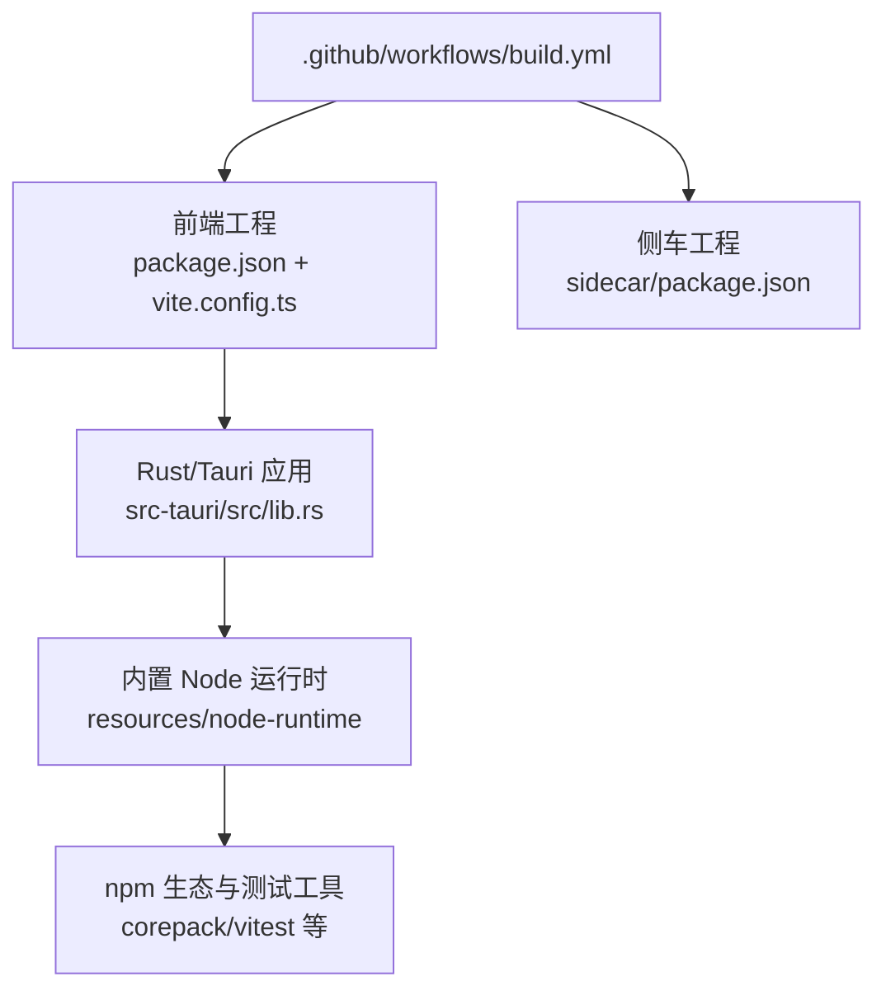
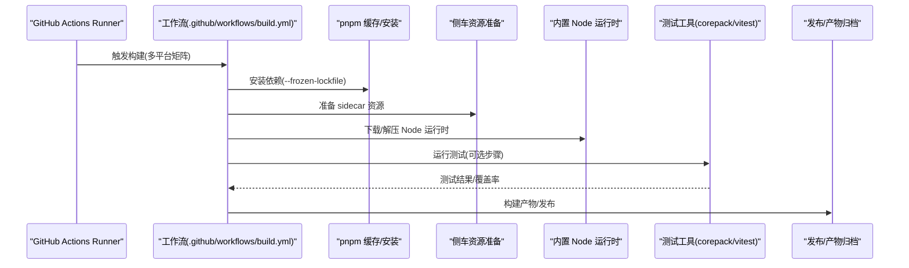
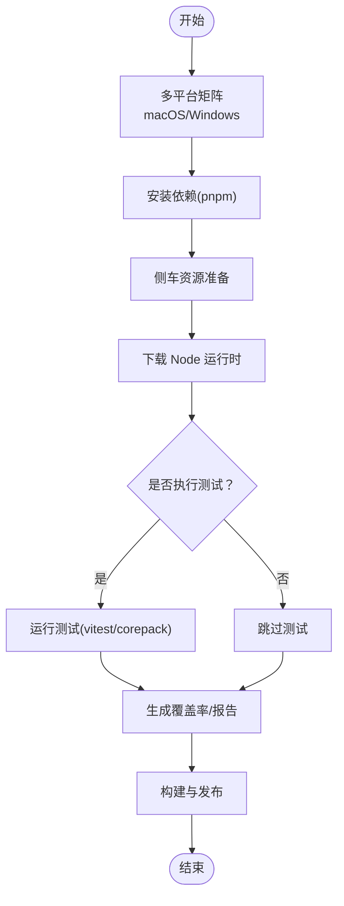
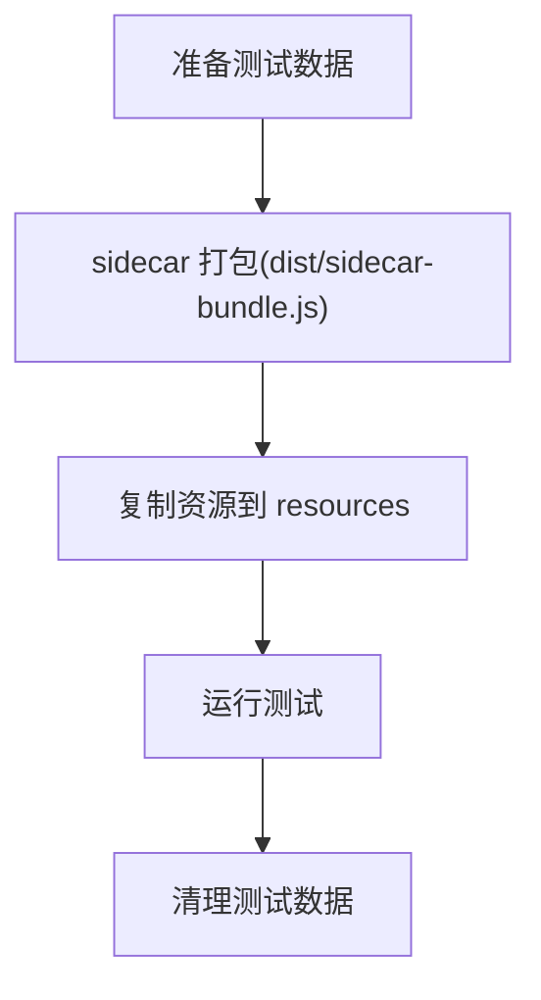
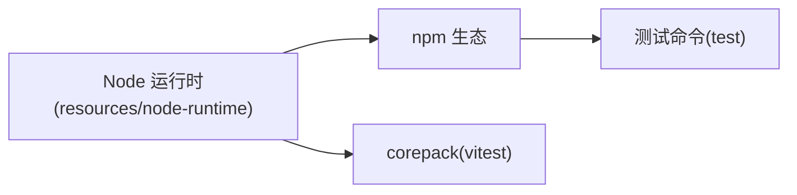
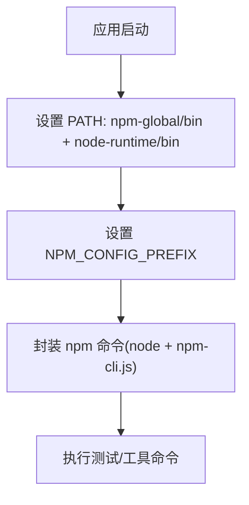
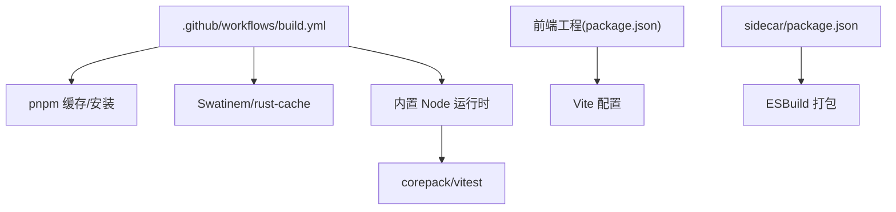

# CI/CD 测试

<cite>
**本文引用的文件**
- [.github/workflows/build.yml](file://.github/workflows/build.yml)
- [package.json](file://package.json)
- [sidecar/package.json](file://sidecar/package.json)
- [vite.config.ts](file://vite.config.ts)
- [tsconfig.node.json](file://tsconfig.node.json)
- [src-tauri/src/lib.rs](file://src-tauri/src/lib.rs)
- [src-tauri/src/gitnexus.rs](file://src-tauri/src/gitnexus.rs)
- [src-tauri/resources/node-runtime/lib/node_modules/corepack/package.json](file://src-tauri/resources/node-runtime/lib/node_modules/corepack/package.json)
- [src-tauri/resources/node-runtime/lib/node_modules/npm/node_modules/@sigstore/bundle/package.json](file://src-tauri/resources/node-runtime/lib/node_modules/npm/node_modules/%40sigstore/bundle/package.json)
</cite>

## 目录
1. [简介](#简介)
2. [项目结构](#项目结构)
3. [核心组件](#核心组件)
4. [架构总览](#架构总览)
5. [详细组件分析](#详细组件分析)
6. [依赖关系分析](#依赖关系分析)
7. [性能考量](#性能考量)
8. [故障排查指南](#故障排查指南)
9. [结论](#结论)
10. [附录](#附录)

## 简介
本文件面向 RabbitCoding 的 CI/CD 测试流程，系统性阐述 GitHub Actions 工作流中的测试执行策略与实践，包括：
- 多平台测试矩阵与并行执行
- 测试结果收集与归档
- 构建过程中的测试集成点
- 测试覆盖率报告生成与可视化
- 失败重试机制与质量门禁建议
- 测试环境配置、依赖缓存策略、测试数据准备与清理
- 测试报告可视化与通知机制

当前仓库未包含独立的测试工作流文件，但通过构建工作流与侧车资源、Node 运行时嵌入等能力，具备在 CI 中扩展测试任务的基础条件。本文将基于现有文件与能力，给出可落地的测试集成方案。

## 项目结构
RabbitCoding 采用前端（React/Vite）、桌面端（Tauri）与侧车（Node/ESBuild）的分层组织方式。测试相关的关键位置如下：
- 前端工程：根目录 package.json 定义脚本与依赖，Vite 配置用于开发与构建
- 侧车工程：sidecar/package.json 定义打包与资源准备脚本
- Rust/Tauri 层：src-tauri 内置 Node 运行时与 npm 生态，便于在应用内运行测试或工具链
- CI 工作流：.github/workflows/build.yml 定义跨平台构建与发布流程

图表来源
- [.github/workflows/build.yml:1-196](file://.github/workflows/build.yml#L1-L196)
- [package.json:1-46](file://package.json#L1-L46)
- [sidecar/package.json:1-25](file://sidecar/package.json#L1-L25)
- [vite.config.ts:1-37](file://vite.config.ts#L1-L37)
- [src-tauri/src/lib.rs:246-269](file://src-tauri/src/lib.rs#L246-L269)

章节来源
- [.github/workflows/build.yml:1-196](file://.github/workflows/build.yml#L1-L196)
- [package.json:1-46](file://package.json#L1-L46)
- [sidecar/package.json:1-25](file://sidecar/package.json#L1-L25)
- [vite.config.ts:1-37](file://vite.config.ts#L1-L37)
- [tsconfig.node.json:1-10](file://tsconfig.node.json#L1-L10)

## 核心组件
- GitHub Actions 工作流：定义多平台矩阵、缓存策略、测试集成点与发布流程
- 前端构建与测试：Vite 配置、React 组件与工具函数
- 侧车资源与打包：sidecar 资源准备与 ESBuild 打包
- Rust/Tauri 内置 Node 运行时：提供 npm 与测试工具可用性
- 依赖与缓存：pnpm 缓存、Rust 工作区缓存

章节来源
- [.github/workflows/build.yml:1-196](file://.github/workflows/build.yml#L1-L196)
- [package.json:1-46](file://package.json#L1-L46)
- [sidecar/package.json:1-25](file://sidecar/package.json#L1-L25)
- [vite.config.ts:1-37](file://vite.config.ts#L1-L37)
- [src-tauri/src/lib.rs:246-269](file://src-tauri/src/lib.rs#L246-L269)

## 架构总览
下图展示了 CI 中测试与构建的整体交互：工作流在多平台上并行执行，下载 Node 运行时，准备侧车资源，随后在 Rust/Tauri 环境中运行测试或工具链。

图表来源
- [.github/workflows/build.yml:46-105](file://.github/workflows/build.yml#L46-L105)
- [src-tauri/resources/node-runtime/lib/node_modules/corepack/package.json:42-58](file://src-tauri/resources/node-runtime/lib/node_modules/corepack/package.json#L42-L58)

## 详细组件分析

### GitHub Actions 工作流与测试矩阵
- 多平台矩阵：macOS（Intel/ARM）、Windows（x64/ARM64）四组目标，分别注入 target 与 node_asset，确保跨平台一致性
- 并行执行：strategy.fail-fast 关闭，提升稳定性；concurrency.group 控制同分支/标签的并发构建
- 权限：显式授予 contents: write，满足发布需求
- 测试集成点：可在“安装依赖”之后、“复制侧车资源”之后插入测试步骤；覆盖率与报告可在此阶段输出

图表来源
- [.github/workflows/build.yml:18-67](file://.github/workflows/build.yml#L18-L67)
- [src-tauri/resources/node-runtime/lib/node_modules/corepack/package.json:42-58](file://src-tauri/resources/node-runtime/lib/node_modules/corepack/package.json#L42-L58)

章节来源
- [.github/workflows/build.yml:1-196](file://.github/workflows/build.yml#L1-L196)

### 侧车资源与测试数据准备
- 侧车打包：sidecar 使用 ESBuild 打包入口，生成 sidecar-bundle.js
- 资源准备：通过脚本将侧车二进制与 bundle 复制到 src-tauri/resources，便于应用内使用
- 测试数据：可在测试前准备临时目录，测试后清理；结合 Rust 层的 app_data_dir，确保可写权限

图表来源
- [sidecar/package.json:6-11](file://sidecar/package.json#L6-L11)
- [.github/workflows/build.yml:69-78](file://.github/workflows/build.yml#L69-L78)

章节来源
- [sidecar/package.json:1-25](file://sidecar/package.json#L1-L25)
- [.github/workflows/build.yml:69-78](file://.github/workflows/build.yml#L69-L78)

### 内置 Node 运行时与测试工具链
- Node 运行时：按平台下载对应版本并解压至 src-tauri/resources/node-runtime
- npm 生态：内置 npm 与核心包，支持在应用内执行测试或工具链命令
- 测试工具：corepack 提供 vitest，可用于前端单元/集成测试

图表来源
- [.github/workflows/build.yml:79-104](file://.github/workflows/build.yml#L79-L104)
- [src-tauri/resources/node-runtime/lib/node_modules/corepack/package.json:42-58](file://src-tauri/resources/node-runtime/lib/node_modules/corepack/package.json#L42-L58)

章节来源
- [.github/workflows/build.yml:79-104](file://.github/workflows/build.yml#L79-L104)
- [src-tauri/resources/node-runtime/lib/node_modules/corepack/package.json:1-102](file://src-tauri/resources/node-runtime/lib/node_modules/corepack/package.json#L1-L102)

### Rust/Tauri 层的测试环境与 PATH/NPM 配置
- PATH 注入：将 npm-global/bin 与 node-runtime/bin 置于 PATH 前，保证全局 CLI 可用
- NPM_CONFIG_PREFIX：指向用户可写目录，避免只读资源导致的安装失败
- npm 命令封装：通过内置 node 与 npm-cli.js 组合，提供稳定的 npm 执行环境

图表来源
- [src-tauri/src/lib.rs:246-269](file://src-tauri/src/lib.rs#L246-L269)
- [src-tauri/src/gitnexus.rs:135-144](file://src-tauri/src/gitnexus.rs#L135-L144)

章节来源
- [src-tauri/src/lib.rs:246-269](file://src-tauri/src/lib.rs#L246-L269)
- [src-tauri/src/gitnexus.rs:88-174](file://src-tauri/src/gitnexus.rs#L88-L174)

### 测试结果收集与覆盖率生成
- 建议在测试步骤中启用覆盖率输出（如 vitest 的覆盖率选项），并将报告上传为工作流工件
- 对于多平台并行，可将各平台的报告合并或分别归档，便于对比与可视化
- 结合工作流的 artifacts 功能，保留 HTML 报告以便在线浏览

章节来源
- [src-tauri/resources/node-runtime/lib/node_modules/corepack/package.json:42-58](file://src-tauri/resources/node-runtime/lib/node_modules/corepack/package.json#L42-L58)

### 失败重试机制与质量门禁
- 失败重试：可在关键步骤（如依赖安装、Node 运行时下载）添加重试逻辑，降低网络波动影响
- 质量门禁：建议在 PR 或发布前增加最小通过率阈值（如覆盖率、测试通过率），未达标则阻断合并或发布

章节来源
- [.github/workflows/build.yml:14-16](file://.github/workflows/build.yml#L14-L16)

### 测试环境配置与依赖缓存
- pnpm 缓存：在 setup-node 中启用 cache: pnpm，加速依赖安装
- Rust 工作区缓存：针对 src-tauri 使用 Swatinem/rust-cache，按 target 键缓存
- Node 运行时缓存：通过下载对应平台压缩包并在后续步骤复用，减少重复下载时间

章节来源
- [.github/workflows/build.yml:46-64](file://.github/workflows/build.yml#L46-L64)

### 测试数据准备与清理
- 准备：在测试前创建临时目录，注入测试数据或模拟文件
- 清理：测试结束后删除临时目录，避免污染后续任务或构建产物

章节来源
- [src-tauri/src/lib.rs:246-269](file://src-tauri/src/lib.rs#L246-L269)

### 测试报告可视化与通知
- 可视化：将覆盖率报告与测试日志作为工件保存，便于在 GitHub 页面查看
- 通知：可通过 GitHub Actions 的通知机制（如 Slack/GitHub Issue）发送测试结果摘要

章节来源
- [.github/workflows/build.yml:1-196](file://.github/workflows/build.yml#L1-L196)

## 依赖关系分析
- 工作流对 pnpm 与 Rust 缓存的依赖，确保安装与编译效率
- 前端工程对 Vite 的依赖，支撑开发与构建
- 侧车工程对 ESBuild 的依赖，支撑打包与资源准备
- Rust/Tauri 对内置 Node 运行时的依赖，提供稳定测试与工具链环境

图表来源
- [.github/workflows/build.yml:46-64](file://.github/workflows/build.yml#L46-L64)
- [package.json:1-46](file://package.json#L1-L46)
- [sidecar/package.json:6-11](file://sidecar/package.json#L6-L11)
- [vite.config.ts:1-37](file://vite.config.ts#L1-L37)
- [src-tauri/resources/node-runtime/lib/node_modules/corepack/package.json:42-58](file://src-tauri/resources/node-runtime/lib/node_modules/corepack/package.json#L42-L58)

章节来源
- [.github/workflows/build.yml:1-196](file://.github/workflows/build.yml#L1-L196)
- [package.json:1-46](file://package.json#L1-L46)
- [sidecar/package.json:1-25](file://sidecar/package.json#L1-L25)
- [vite.config.ts:1-37](file://vite.config.ts#L1-L37)
- [tsconfig.node.json:1-10](file://tsconfig.node.json#L1-L10)

## 性能考量
- 并行度：多平台矩阵并行执行，缩短整体耗时
- 缓存命中：pnpm 与 Rust 工作区缓存显著降低重复安装与编译时间
- 资源复用：内置 Node 运行时与 npm 生态减少外部依赖下载
- I/O 优化：侧车资源一次性准备，避免重复拷贝

## 故障排查指南
- 依赖安装失败：检查 frozen-lockfile 与 pnpm 缓存键；确认网络可达性
- Node 运行时缺失：核对平台匹配与下载步骤；验证解压后的目录结构
- 测试无法执行：确认 corepack/vitest 是否正确安装；检查 PATH 与 NPM_CONFIG_PREFIX 设置
- 发布权限不足：确认工作流权限配置为 contents: write

章节来源
- [.github/workflows/build.yml:46-105](file://.github/workflows/build.yml#L46-L105)
- [src-tauri/src/lib.rs:246-269](file://src-tauri/src/lib.rs#L246-L269)
- [src-tauri/src/gitnexus.rs:135-144](file://src-tauri/src/gitnexus.rs#L135-L144)

## 结论
RabbitCoding 的 CI/CD 已具备跨平台并行构建与资源缓存的良好基础。通过在工作流中引入测试步骤、覆盖率生成与报告归档，可进一步完善质量保障体系。建议结合失败重试与质量门禁，持续提升发布可靠性与可追溯性。

## 附录
- 测试脚本与工具参考：corepack 提供 vitest；npm 生态中包含多种测试工具
- 资源路径参考：内置 Node 运行时位于 src-tauri/resources/node-runtime；侧车资源位于 sidecar

章节来源
- [src-tauri/resources/node-runtime/lib/node_modules/corepack/package.json:42-58](file://src-tauri/resources/node-runtime/lib/node_modules/corepack/package.json#L42-L58)
- [src-tauri/resources/node-runtime/lib/node_modules/npm/node_modules/@sigstore/bundle/package.json:7-11](file://src-tauri/resources/node-runtime/lib/node_modules/npm/node_modules/%40sigstore/bundle/package.json#L7-L11)