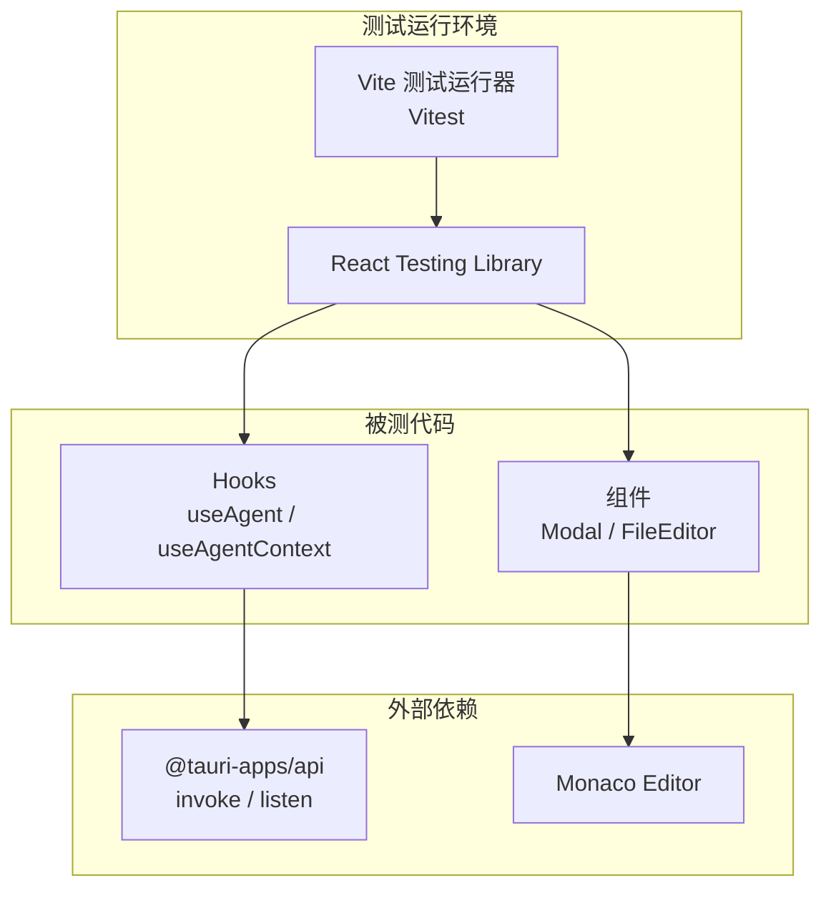
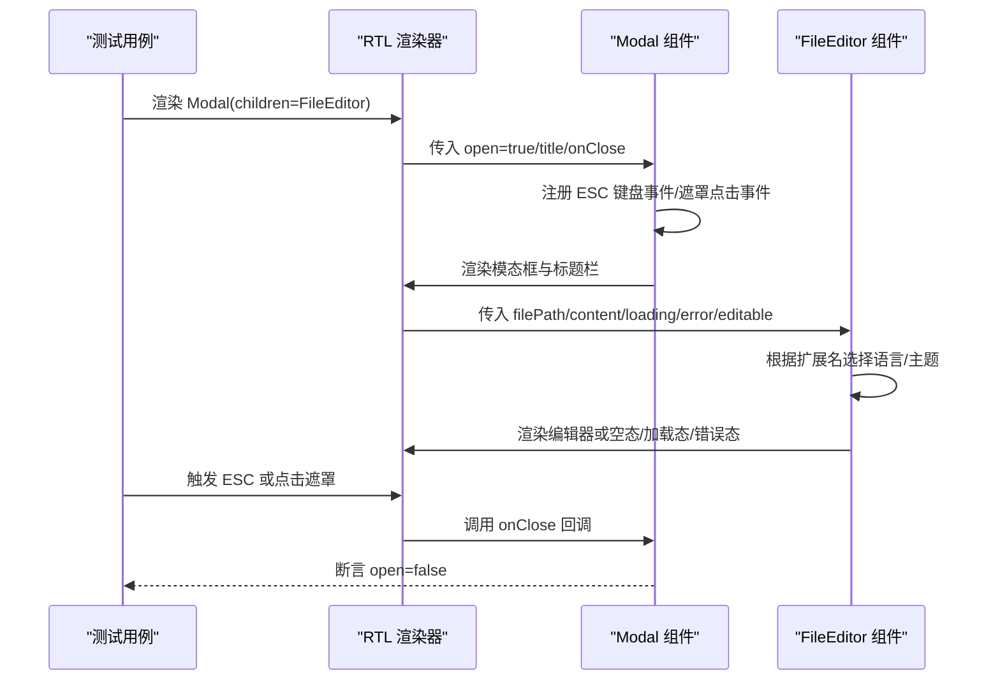
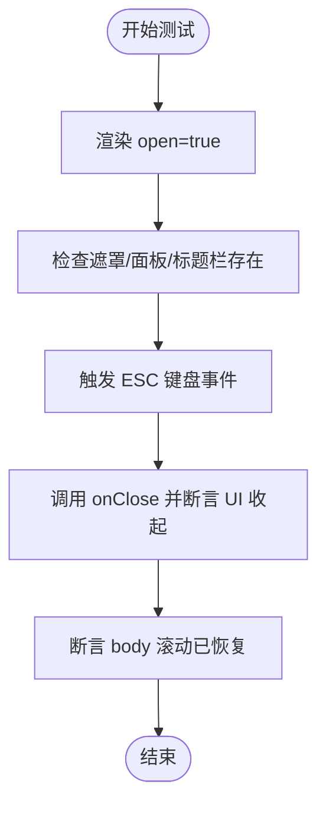
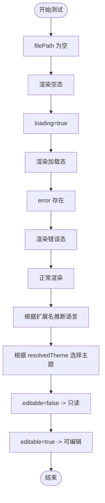
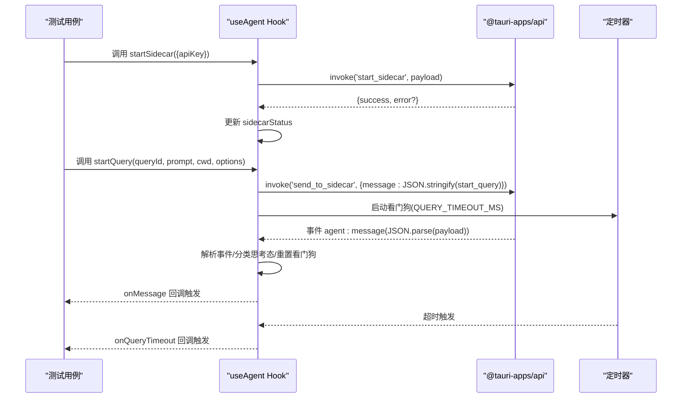
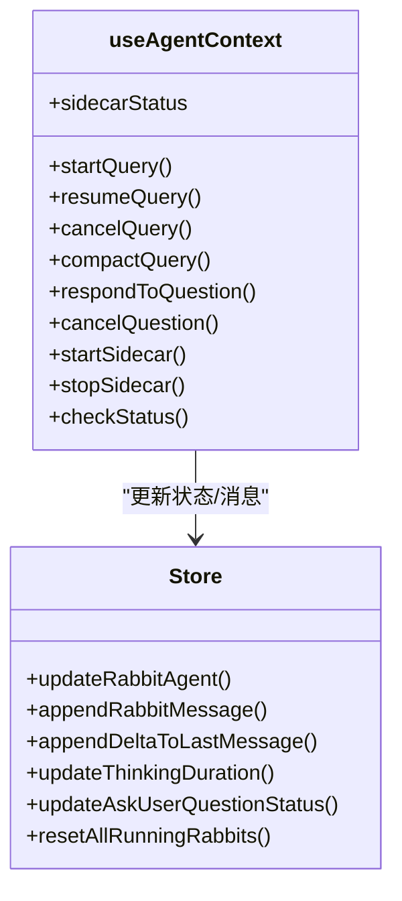
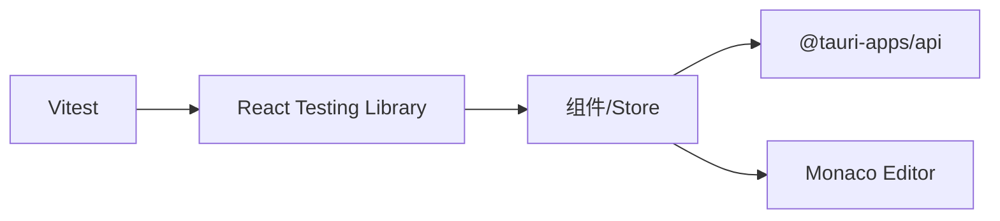

# 单元测试

<cite>
**本文引用的文件**
- [package.json](file://package.json)
- [vite.config.ts](file://vite.config.ts)
- [src/hooks/useAgent.ts](file://src/hooks/useAgent.ts)
- [src/hooks/useAgentContext.tsx](file://src/hooks/useAgentContext.tsx)
- [src/components/common/Modal.tsx](file://src/components/common/Modal.tsx)
- [src/components/files/FileEditor.tsx](file://src/components/files/FileEditor.tsx)
</cite>

## 目录
1. [引言](#引言)
2. [项目结构](#项目结构)
3. [核心组件](#核心组件)
4. [架构总览](#架构总览)
5. [详细组件分析](#详细组件分析)
6. [依赖分析](#依赖分析)
7. [性能考虑](#性能考虑)
8. [故障排查指南](#故障排查指南)
9. [结论](#结论)
10. [附录](#附录)

## 引言
本测试文档面向 RabbitCoding 前端 React 组件与 Hooks，系统化阐述单元测试策略与最佳实践，涵盖：
- 组件渲染测试：验证不同状态下的 UI 渲染正确性（空态、加载态、错误态、正常内容态）
- 交互测试：键盘事件、点击事件、焦点管理等用户交互行为
- Hook 测试：useAgent 与 useAgentContext 的业务逻辑、副作用、状态流转与超时/思考态处理
- 测试框架与工具：Vitest 与 React Testing Library 的选型与配置要点
- 异步测试：基于 Tauri invoke 与事件监听的异步流程测试
- Mock 对象与测试数据：如何构造稳定可重复的测试环境

## 项目结构
- 测试框架：采用 Vitest（Vite 内置测试运行器），无需额外安装
- 测试工具：React Testing Library（RTL）用于以用户视角验证组件行为
- 项目技术栈：Tauri + React + TypeScript + Vite，测试需模拟浏览器 DOM 与 Web APIs
- 关键依赖：@tauri-apps/api（invoke、listen）、Monaco Editor（编辑器）、Ant Design/自绘组件

图表来源
- [vite.config.ts](file://vite.config.ts)
- [src/hooks/useAgent.ts](file://src/hooks/useAgent.ts)
- [src/hooks/useAgentContext.tsx](file://src/hooks/useAgentContext.tsx)
- [src/components/files/FileEditor.tsx](file://src/components/files/FileEditor.tsx)

章节来源
- [package.json](file://package.json)
- [vite.config.ts](file://vite.config.ts)

## 核心组件
- useAgent：封装与 Sidecar 的通信，负责启动/停止/恢复查询、取消查询、压缩会话、响应用户提问、监听事件与看门狗超时控制
- useAgentContext：将 useAgent 的监听与回调提升至 Provider 层，确保跨页面切换时消息不丢失，并对 Store 进行状态更新
- Modal：通用模态框组件，包含 ESC 关闭、点击遮罩关闭、容器内滚动区域等交互
- FileEditor：基于 Monaco Editor 的文件编辑器，根据文件扩展名选择语言，支持只读/可编辑、主题切换、空态/加载态/错误态

章节来源
- [src/hooks/useAgent.ts](file://src/hooks/useAgent.ts)
- [src/hooks/useAgentContext.tsx](file://src/hooks/useAgentContext.tsx)
- [src/components/common/Modal.tsx](file://src/components/common/Modal.tsx)
- [src/components/files/FileEditor.tsx](file://src/components/files/FileEditor.tsx)

## 架构总览
以下序列图展示 Modal 与 FileEditor 的典型交互与渲染路径，以及与 RTL 的测试关系。

图表来源
- [src/components/common/Modal.tsx](file://src/components/common/Modal.tsx)
- [src/components/files/FileEditor.tsx](file://src/components/files/FileEditor.tsx)

## 详细组件分析

### Modal 组件测试策略
- 渲染测试
  - open=false：返回 null
  - open=true：渲染遮罩层、面板、标题栏与关闭按钮
- 交互测试
  - ESC 键盘事件：触发 onClose
  - 点击遮罩：若点击目标不在面板内，触发 onClose
  - 点击关闭按钮：触发 onClose
- 行为测试
  - 打开时阻止 body 滚动，关闭时恢复
  - 宽度类名可定制
- Mock 对象
  - 使用 jest.spyOn(document, 'addEventListener') 与 jest.spyOn(document, 'removeEventListener')
  - 使用 jest.spyOn(document.body, 'style') 检查 overflow 设置

图表来源
- [src/components/common/Modal.tsx](file://src/components/common/Modal.tsx)

章节来源
- [src/components/common/Modal.tsx](file://src/components/common/Modal.tsx)

### FileEditor 组件测试策略
- 渲染测试
  - filePath 为空：显示“请选择文件”空态
  - loading=true：显示加载动画与文案
  - error 存在：显示错误文案
  - 正常内容：渲染 Monaco 编辑器，语言根据扩展名推断，主题随 resolvedTheme 切换
- 交互测试
  - editable=false：编辑器只读
  - editable=true：onChange 触发 onContentChange
- Mock 对象
  - 使用 vitest.spyOn 替换 Monaco Worker 工厂函数，避免真实 Web Worker 初始化
  - 使用 loader.config 与 self.MonacoEnvironment 配置本地 Monaco 实例
- 边界测试
  - 未知扩展名：回落到 plaintext
  - 特殊扩展名映射：如 .gradle.kts -> kotlin

图表来源
- [src/components/files/FileEditor.tsx](file://src/components/files/FileEditor.tsx)

章节来源
- [src/components/files/FileEditor.tsx](file://src/components/files/FileEditor.tsx)

### useAgent Hook 测试策略
- 状态与生命周期
  - sidecarStatus 初始值、启动/停止/检查状态的 invoke 调用
  - useEffect 中注册 agent:message 与 agent:sidecar-exit 事件监听，清理逻辑正确
- 查询生命周期
  - startQuery/resumeQuery/cancelQuery/compactQuery 的命令构造与 send_to_sidecar 调用
  - respondToolRequest 的请求响应命令发送
- 超时与思考态
  - 看门狗：每条 query 独立计时，收到消息重置；思考态使用更长阈值
  - 思考态进入/退出：根据 payload.subtype 判断，影响下次超时阈值
- 错误处理
  - start_sidecar/get_sidecar_status invoke 失败时设置 error 状态
  - 侧车退出：清空所有看门狗并回退所有运行中查询为 error
- Mock 对象
  - 使用 vitest.spyOn 与 vi.mock 模拟 @tauri-apps/api 的 invoke 与 listen
  - 使用 vitest.useFakeTimers 与 vitest.advanceTimersByTime 控制定时器
  - 使用 vitest.fn 伪造回调函数

图表来源
- [src/hooks/useAgent.ts](file://src/hooks/useAgent.ts)

章节来源
- [src/hooks/useAgent.ts](file://src/hooks/useAgent.ts)

### useAgentContext Provider 测试策略
- 上下文提升
  - 将 onMessage/onSidecarExit/onQueryTimeout 提升至 Provider 层，避免页面切换导致监听丢失
- Store 更新
  - 根据消息类型更新工作区/兔子的状态（运行中、完成、错误、压缩阶段、用量更新等）
  - 过滤 __spec__ 前缀的查询消息
  - 取消查询：先标记再发送命令，延迟清理标记
- 用户提问响应
  - respondToQuestion：先更新前端状态，再发送 respond_tool_request
  - cancelQuestion：标记为已取消并发送取消命令
- 错误兜底
  - startQuery/resumeQuery 失败时回滚状态为 error
  - 侧车退出时回退所有运行中兔子为 error

图表来源
- [src/hooks/useAgentContext.tsx](file://src/hooks/useAgentContext.tsx)

章节来源
- [src/hooks/useAgentContext.tsx](file://src/hooks/useAgentContext.tsx)

## 依赖分析
- 测试框架与工具
  - Vitest：内置 Vite 测试运行器，无需额外安装
  - React Testing Library：以用户视角测试组件行为
- 外部依赖
  - @tauri-apps/api：invoke 与 listen，需在测试中进行 Mock
  - Monaco Editor：本地 worker 配置，避免真实网络请求
- 项目配置
  - Vite 仅在开发/构建时启用，测试使用 Vitest 默认配置即可

图表来源
- [vite.config.ts](file://vite.config.ts)
- [src/hooks/useAgent.ts](file://src/hooks/useAgent.ts)
- [src/components/files/FileEditor.tsx](file://src/components/files/FileEditor.tsx)

章节来源
- [package.json](file://package.json)
- [vite.config.ts](file://vite.config.ts)

## 性能考虑
- 测试隔离：每个测试用例独立渲染与销毁，避免全局状态污染
- 定时器控制：使用 fake timers 精准控制超时与思考态阈值，避免真实等待
- Worker 模拟：禁用真实 Monaco Web Worker，减少网络与资源消耗
- 事件监听：确保每次测试后清理监听器，避免内存泄漏

## 故障排查指南
- 事件监听未触发
  - 检查 useEffect 是否正确注册与清理
  - 确认事件名称与 payload 结构一致
- 定时器未生效
  - 使用 vitest.useFakeTimers 并在测试末尾 vitest.runOnlyPendingTimers
- Tauri invoke 失败
  - 通过 vi.mock/@tauri-apps/api 返回错误结果，验证错误分支
- Monaco 初始化失败
  - 确保 loader.config 与 self.MonacoEnvironment 已在测试前配置

章节来源
- [src/hooks/useAgent.ts](file://src/hooks/useAgent.ts)
- [src/components/files/FileEditor.tsx](file://src/components/files/FileEditor.tsx)

## 结论
通过 Vitest + React Testing Library 的组合，结合对 Tauri 与 Monaco 的 Mock，可以高效地覆盖 RabbitCoding 前端组件与 Hooks 的渲染、交互与异步流程。建议优先测试关键路径（渲染空态/加载态/错误态、键盘与点击交互、事件监听与清理、定时器与超时、Mock invoke/事件），并在 CI 中保持稳定的测试覆盖率与执行时间。

## 附录
- 测试文件命名规范：组件名.test.tsx 或 组件名.spec.tsx
- 测试数据准备：使用工厂函数或固定 fixture，确保可重复性
- 异步测试最佳实践：使用 waitFor、fireEvent 与 fake timers，避免真实等待
- Mock 建议：优先使用 vi.mock 与 spy，避免引入真实网络或文件系统依赖