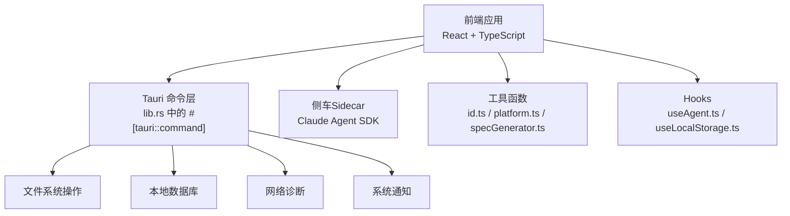
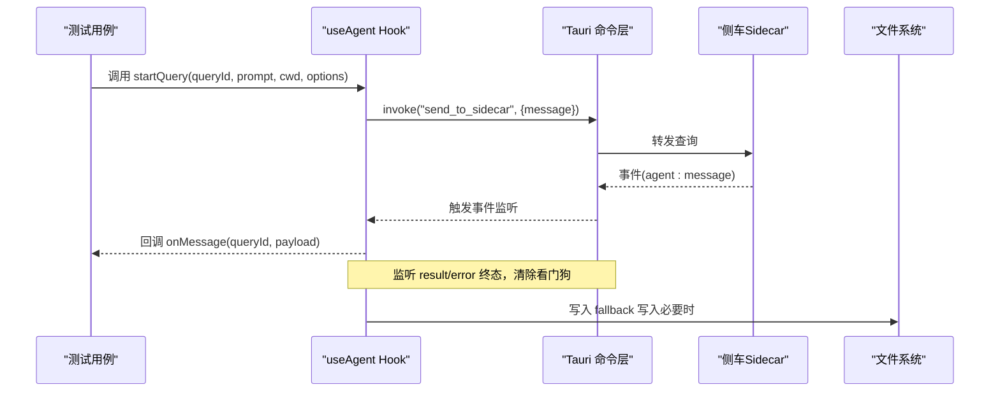
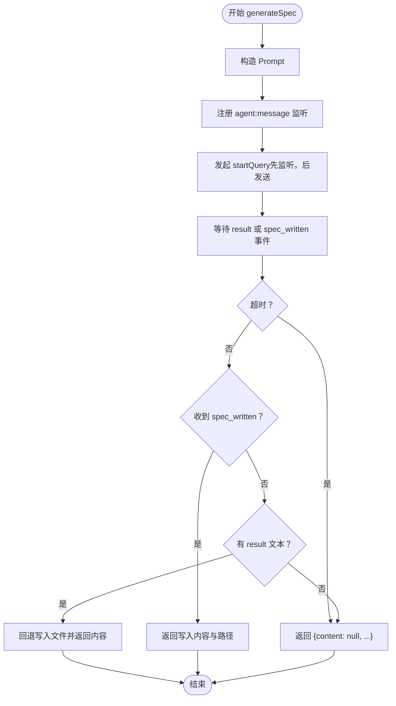
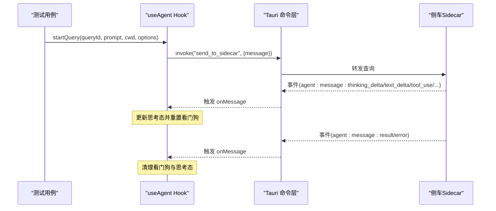
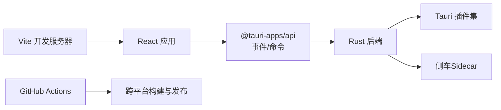

# 测试策略

<cite>
**本文引用的文件**
- [package.json](file://package.json)
- [README.md](file://README.md)
- [.github/workflows/build.yml](file://.github/workflows/build.yml)
- [vite.config.ts](file://vite.config.ts)
- [tsconfig.json](file://tsconfig.json)
- [src-tauri/Cargo.toml](file://src-tauri/Cargo.toml)
- [src/utils/id.ts](file://src/utils/id.ts)
- [src/utils/specGenerator.ts](file://src/utils/specGenerator.ts)
- [src/utils/platform.ts](file://src/utils/platform.ts)
- [src/hooks/useAgent.ts](file://src/hooks/useAgent.ts)
- [src/hooks/useLocalStorage.ts](file://src/hooks/useLocalStorage.ts)
- [src-tauri/src/lib.rs](file://src-tauri/src/lib.rs)
</cite>

## 目录
1. [简介](#简介)
2. [项目结构](#项目结构)
3. [核心组件](#核心组件)
4. [架构总览](#架构总览)
5. [详细组件分析](#详细组件分析)
6. [依赖分析](#依赖分析)
7. [性能考虑](#性能考虑)
8. [故障排查指南](#故障排查指南)
9. [结论](#结论)
10. [附录](#附录)

## 简介
本文件为 RabbitCoding 的质量保证与测试策略文档，覆盖单元测试、集成测试与端到端测试的实施策略，解释测试框架选择、测试用例设计、测试数据准备、自动化测试流程与 CI/CD 集成、测试报告生成、最佳实践、覆盖率要求、性能测试与测试环境搭建与维护。文档基于仓库现有代码与配置进行分析，旨在帮助团队建立稳定可靠的测试体系。

## 项目结构
RabbitCoding 是一个基于 Tauri + React + TypeScript 的桌面应用，前端使用 Vite 构建，后端 Rust 提供系统能力与命令接口，侧车（sidecar）负责与外部模型/工具交互。测试策略需覆盖以下层次：
- 前端逻辑与 UI 组件（React Hooks、工具函数）
- 与 Rust 后端的命令交互（Tauri Commands）
- 与侧车（Sidecar）的事件与消息流
- 系统级功能（文件系统、通知、网络诊断、数据库）

图表来源
- [src-tauri/src/lib.rs:124-316](file://src-tauri/src/lib.rs#L124-L316)
- [src/utils/id.ts:1-4](file://src/utils/id.ts#L1-L4)
- [src/utils/platform.ts:1-19](file://src/utils/platform.ts#L1-L19)
- [src/utils/specGenerator.ts:1-300](file://src/utils/specGenerator.ts#L1-L300)
- [src/hooks/useAgent.ts:1-334](file://src/hooks/useAgent.ts#L1-L334)
- [src/hooks/useLocalStorage.ts:1-27](file://src/hooks/useLocalStorage.ts#L1-L27)

章节来源
- [README.md:1-8](file://README.md#L1-L8)
- [vite.config.ts:1-37](file://vite.config.ts#L1-L37)
- [tsconfig.json:1-26](file://tsconfig.json#L1-L26)
- [src-tauri/Cargo.toml:1-40](file://src-tauri/Cargo.toml#L1-L40)

## 核心组件
- 工具函数
  - id.ts：生成唯一标识符，适合用于测试用例的稳定输入/断言。
  - platform.ts：平台检测与 UI 适配，适合参数化测试不同平台。
  - specGenerator.ts：规范生成器，包含复杂异步事件监听、竞态修复、超时保护与回退写入逻辑，是测试重点。
- Hooks
  - useAgent.ts：管理与侧车的通信、事件监听、看门狗超时、查询生命周期管理，是集成测试与 E2E 测试的关键对象。
  - useLocalStorage.ts：封装本地存储，便于模拟与断言。
- Tauri 命令
  - lib.rs：暴露多个命令（如 ensure_workspace_docs_dir、ensure_rabbit_specs_dir、read_text_file_unrestricted、send_desktop_notification 等），用于测试后端能力与边界条件。

章节来源
- [src/utils/id.ts:1-4](file://src/utils/id.ts#L1-L4)
- [src/utils/platform.ts:1-19](file://src/utils/platform.ts#L1-L19)
- [src/utils/specGenerator.ts:1-300](file://src/utils/specGenerator.ts#L1-L300)
- [src/hooks/useAgent.ts:1-334](file://src/hooks/useAgent.ts#L1-L334)
- [src/hooks/useLocalStorage.ts:1-27](file://src/hooks/useLocalStorage.ts#L1-L27)
- [src-tauri/src/lib.rs:14-60](file://src-tauri/src/lib.rs#L14-L60)

## 架构总览
测试策略围绕“分层测试”展开：
- 单元测试：针对工具函数与 Hooks 的纯函数行为与状态机。
- 集成测试：验证 Tauri 命令与侧车事件流的交互，覆盖 spec 生成主路径与回退路径。
- 端到端测试：在真实窗口上下文中运行，验证 UI 与后端命令链路。

图表来源
- [src/hooks/useAgent.ts:156-177](file://src/hooks/useAgent.ts#L156-L177)
- [src/utils/specGenerator.ts:142-171](file://src/utils/specGenerator.ts#L142-L171)
- [src-tauri/src/lib.rs:272-313](file://src-tauri/src/lib.rs#L272-L313)

## 详细组件分析

### 组件一：规范生成器（specGenerator.ts）
该模块是测试重点，涉及：
- 事件监听与竞态修复（先注册监听再发起查询）
- 超时保护（SPEC_TIMEOUT_MS）
- 主路径（WriteSpec 工具写入）与回退路径（从 result 文本写入）
- 会话 ID 捕获与 resume 支持

建议测试策略
- 单元测试
  - 输入规范化与文件名生成：验证 generateSpecFileName 的 slug 化、截断与时间戳拼接。
  - 摘要提取：验证 extractSpecSummary 的标题识别、长度限制与省略号处理。
  - Prompt 构造：验证 buildSpecPrompt 的模板完整性与占位符替换。
- 集成测试
  - 事件监听与竞态修复：模拟监听注册与查询发起的时序，确保 Promise 正常 resolve。
  - 超时保护：模拟 sidecar 无响应，验证超时后的返回值。
  - 主路径 vs 回退路径：分别构造 WriteSpec 成功与失败场景，验证返回值与文件写入。
  - 会话 ID：验证 system(init) 消息解析与 sessionId 传递。

图表来源
- [src/utils/specGenerator.ts:142-171](file://src/utils/specGenerator.ts#L142-L171)
- [src/utils/specGenerator.ts:195-299](file://src/utils/specGenerator.ts#L195-L299)

章节来源
- [src/utils/specGenerator.ts:1-300](file://src/utils/specGenerator.ts#L1-L300)

### 组件二：Agent 通信 Hook（useAgent.ts）
该 Hook 管理侧车生命周期、事件监听与看门狗超时，是集成测试与 E2E 测试的核心。
- 查询生命周期：startQuery/resumeQuery/compactQuery/cancelQuery/respondToolRequest
- 事件分类：区分思考态 enter/exit，动态调整超时阈值
- 看门狗：每条 query 独立计时，终态清除，避免误判

建议测试策略
- 单元测试
  - 思考态判断：验证 classifyThinkingState 对不同 subtype 的分类结果。
  - 看门狗：验证 armQueryWatchdog/clearQueryWatchdog 的计时与清理。
  - 状态机：验证 sidecarStatus 在 startSidecar/stopSidecar/checkStatus 中的状态流转。
- 集成测试
  - 事件监听：模拟 agent:message 事件，验证 onMessage 回调与思考态切换。
  - 超时场景：模拟长时间无消息，验证 onQueryTimeout 回调触发。
  - 终态清理：验证 result/error 事件后看门狗与思考态集合的清理。

图表来源
- [src/hooks/useAgent.ts:262-320](file://src/hooks/useAgent.ts#L262-L320)
- [src/hooks/useAgent.ts:156-177](file://src/hooks/useAgent.ts#L156-L177)

章节来源
- [src/hooks/useAgent.ts:1-334](file://src/hooks/useAgent.ts#L1-L334)

### 组件三：工具函数与本地存储（id.ts / platform.ts / useLocalStorage.ts）
- id.ts：生成随机 ID，适合用于测试用例的稳定输入/断言。
- platform.ts：平台检测与 UI 适配，适合参数化测试不同平台。
- useLocalStorage.ts：封装本地存储，便于模拟与断言。

建议测试策略
- 单元测试
  - id.ts：验证生成 ID 的格式与唯一性（多轮生成对比）。
  - platform.ts：参数化测试不同 navigator.platform 场景，验证 isMac/isWindows 与 titleBarPadding。
  - useLocalStorage.ts：验证读取/写入异常（localStorage 不可用/满）的兜底行为。

章节来源
- [src/utils/id.ts:1-4](file://src/utils/id.ts#L1-L4)
- [src/utils/platform.ts:1-19](file://src/utils/platform.ts#L1-L19)
- [src/hooks/useLocalStorage.ts:1-27](file://src/hooks/useLocalStorage.ts#L1-L27)

### 组件四：Tauri 命令（lib.rs）
- 文件系统：ensure_workspace_docs_dir、ensure_rabbit_specs_dir、read_text_file_unrestricted
- 通知：open_notification_settings、send_desktop_notification
- 数据库：db_load_all/db_save_all/db_has_data
- 网络诊断：diag_dns/diag_http/diag_ping/diag_marketplace
- 其他：model_test、gitnexus、integration、feedback、auth 等

建议测试策略
- 单元测试：对命令的错误路径（文件不存在、权限不足、路径非法）进行断言。
- 集成测试：在真实窗口上下文中调用命令，验证副作用（目录创建、文件读写、通知显示）。

章节来源
- [src-tauri/src/lib.rs:14-60](file://src-tauri/src/lib.rs#L14-L60)
- [src-tauri/src/lib.rs:272-313](file://src-tauri/src/lib.rs#L272-L313)

## 依赖分析
- 前端依赖
  - React + TypeScript + Vite：构建与开发体验
  - Tauri 插件：dialog、fs、notification、opener、shell、pty 等
- 后端依赖
  - Tauri 2 + tokio + rusqlite + reqwest + image + xcap + sysinfo 等
- CI/CD
  - GitHub Actions：跨平台构建、打包、签名与发布

图表来源
- [package.json:14-44](file://package.json#L14-L44)
- [src-tauri/Cargo.toml:20-39](file://src-tauri/Cargo.toml#L20-L39)
- [.github/workflows/build.yml:1-196](file://.github/workflows/build.yml#L1-L196)

章节来源
- [package.json:1-46](file://package.json#L1-L46)
- [src-tauri/Cargo.toml:1-40](file://src-tauri/Cargo.toml#L1-L40)
- [.github/workflows/build.yml:1-196](file://.github/workflows/build.yml#L1-L196)

## 性能考虑
- 事件监听与竞态修复：确保监听先于查询发起，避免因极快响应导致的 Promise 永不 resolve。
- 超时保护：SPEC_TIMEOUT_MS 防止阻塞，保障 UI 与测试稳定性。
- 看门狗超时：普通态 10 分钟，思考态放宽至 30 分钟，避免误判。
- 文件写入回退：当 WriteSpec 工具未调用时，从 result 文本回退写入，提升健壮性。

章节来源
- [src/utils/specGenerator.ts:195-299](file://src/utils/specGenerator.ts#L195-L299)
- [src/hooks/useAgent.ts:66-95](file://src/hooks/useAgent.ts#L66-L95)

## 故障排查指南
- 侧车无响应
  - 现象：generateSpec 返回 {content: null, ...} 或超时
  - 排查：检查 sidecar 是否启动、网络连通性、工具权限与最大轮次限制
- 事件丢失
  - 现象：Promise 永不 resolve
  - 排查：确认监听注册完成后再发起查询；检查事件 payload 解析异常
- 本地存储异常
  - 现象：localStorage 抛错或空间不足
  - 排查：useLocalStorage 的 try/catch 兜底，检查容量与权限
- 通知无法显示
  - 现象：send_desktop_notification 返回 false
  - 排查：平台差异（macOS/Windows）、权限与系统设置

章节来源
- [src/utils/specGenerator.ts:234-299](file://src/utils/specGenerator.ts#L234-L299)
- [src/hooks/useLocalStorage.ts:13-23](file://src/hooks/useLocalStorage.ts#L13-L23)
- [src-tauri/src/lib.rs:65-114](file://src-tauri/src/lib.rs#L65-L114)

## 结论
通过分层测试策略（单元/集成/E2E）与针对性的测试用例设计，结合 CI/CD 的自动化流水线，可以有效保障 RabbitCoding 的功能正确性、鲁棒性与可维护性。建议优先完善单元测试与集成测试，逐步扩展端到端测试覆盖面，并持续优化测试数据与环境配置。

## 附录

### 测试框架与工具选择
- 单元测试：推荐使用 Vitest（与 Vite 配置一致）
- 集成测试：使用 Playwright 或 Cypress（基于浏览器/窗口上下文）
- E2E 测试：Playwright（支持多平台窗口与系统交互）
- 覆盖率：建议使用 c8（Vitest 内置）或 lcov 生成报告
- CI/CD：基于现有 GitHub Actions，新增测试与覆盖率步骤

章节来源
- [vite.config.ts:1-37](file://vite.config.ts#L1-L37)
- [tsconfig.json:1-26](file://tsconfig.json#L1-L26)

### 测试用例设计要点
- 输入驱动：使用 id.ts 生成稳定 ID，platform.ts 参数化平台场景
- 行为驱动：针对 specGenerator 的主/回退路径与超时保护编写场景
- 状态驱动：useAgent 的思考态切换与看门狗计时
- 命令驱动：lib.rs 命令的正反向用例与错误路径

章节来源
- [src/utils/id.ts:1-4](file://src/utils/id.ts#L1-L4)
- [src/utils/platform.ts:1-19](file://src/utils/platform.ts#L1-L19)
- [src/utils/specGenerator.ts:142-171](file://src/utils/specGenerator.ts#L142-L171)
- [src/hooks/useAgent.ts:262-320](file://src/hooks/useAgent.ts#L262-L320)
- [src-tauri/src/lib.rs:14-60](file://src-tauri/src/lib.rs#L14-L60)

### 测试数据准备
- Mock 侧车事件：构造 agent:message 事件 payload，覆盖 result/error 与 spec_written
- 本地文件：准备 .rabbit/specs 与 docs 目录，验证 ensure_*_dir 命令
- 平台差异：准备不同 navigator.platform 场景，验证 titleBarPadding

章节来源
- [src/utils/specGenerator.ts:234-299](file://src/utils/specGenerator.ts#L234-L299)
- [src-tauri/src/lib.rs:19-33](file://src-tauri/src/lib.rs#L19-L33)

### 自动化测试流程与 CI/CD 集成
- 在 GitHub Actions 中新增 job：安装依赖、运行测试、生成覆盖率、上传报告
- 将覆盖率阈值纳入 PR 审查（建议语句/分支/函数/行 ≥ 80%）
- 与现有构建流程并行，确保测试失败不影响发布但阻塞 PR 合并

章节来源
- [.github/workflows/build.yml:1-196](file://.github/workflows/build.yml#L1-L196)

### 测试报告生成
- 使用 Vitest 的 JSON/LCOV 输出，结合 codecov 或 coveralls
- 在 PR 中展示覆盖率变化，辅助质量门禁

章节来源
- [.github/workflows/build.yml:1-196](file://.github/workflows/build.yml#L1-L196)

### 性能测试
- 使用 Playwright/Benchmark.js 对关键路径（spec 生成、事件监听、命令调用）进行基准测试
- 关注内存占用与事件处理延迟，结合日志定位瓶颈

章节来源
- [src/utils/specGenerator.ts:118-119](file://src/utils/specGenerator.ts#L118-L119)
- [src/hooks/useAgent.ts:66-73](file://src/hooks/useAgent.ts#L66-L73)

### 测试环境搭建与维护
- 前端：Vite + React + TypeScript（已配置）
- 后端：Rust + Tauri（已配置）
- 侧车：通过 Tauri 命令启动/停止（start_sidecar/stop_sidecar）
- 数据：本地数据库与文件系统（rusqlite + fs 插件）
- 维护：定期更新依赖、补充缺失平台的 UI 适配与通知逻辑

章节来源
- [vite.config.ts:1-37](file://vite.config.ts#L1-L37)
- [src-tauri/Cargo.toml:1-40](file://src-tauri/Cargo.toml#L1-L40)
- [src-tauri/src/lib.rs:124-316](file://src-tauri/src/lib.rs#L124-L316)