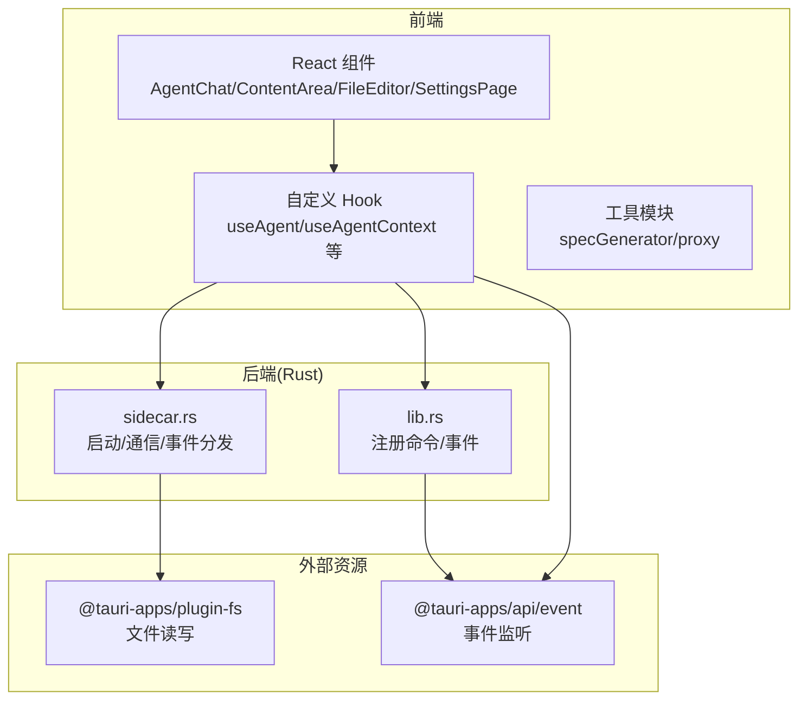
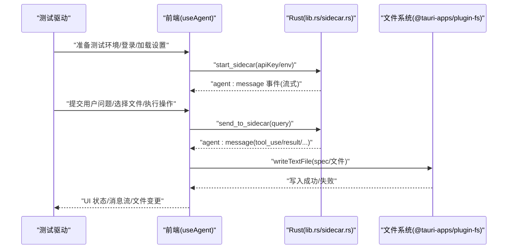
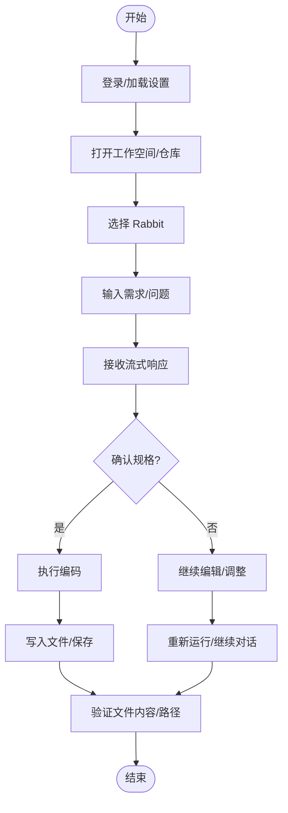
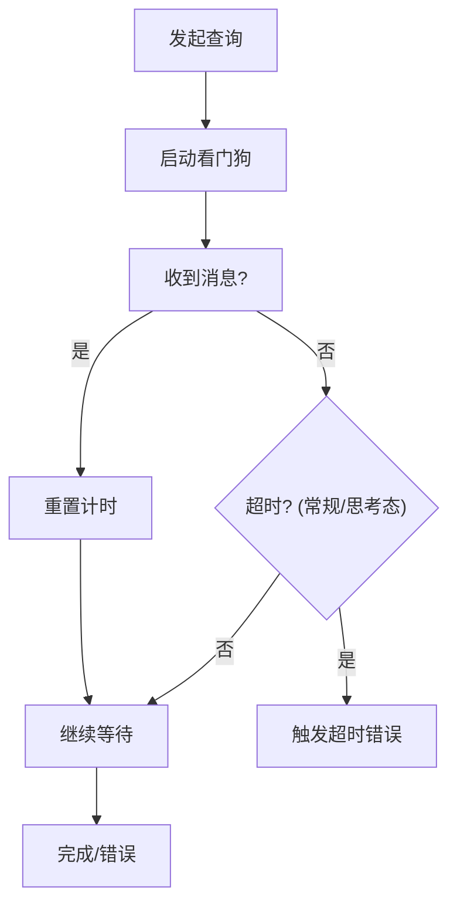
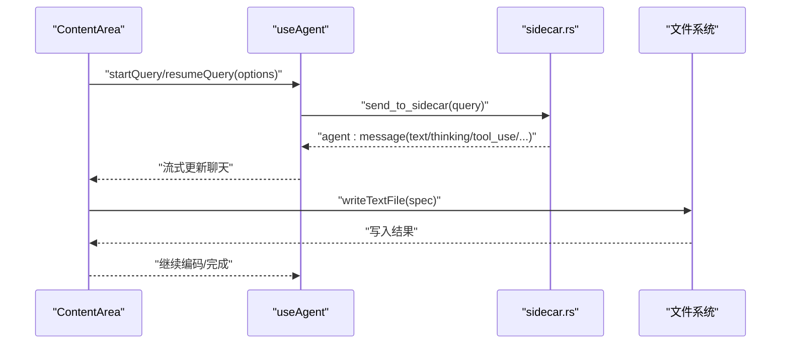
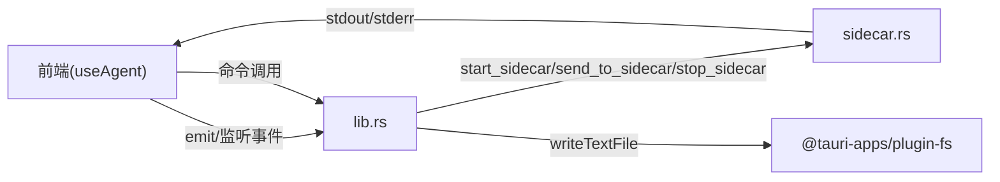

# 端到端测试

<cite>
**本文引用的文件**
- [package.json](file://package.json)
- [README.md](file://README.md)
- [.github/workflows/build.yml](file://.github/workflows/build.yml)
- [src-tauri/src/lib.rs](file://src-tauri/src/lib.rs)
- [src-tauri/src/sidecar.rs](file://src-tauri/src/sidecar.rs)
- [src/hooks/useAgent.ts](file://src/hooks/useAgent.ts)
- [src/utils/specGenerator.ts](file://src/utils/specGenerator.ts)
- [src/utils/proxy.ts](file://src/utils/proxy.ts)
- [src/components/ContentArea.tsx](file://src/components/ContentArea.tsx)
- [src/components/agent/AgentChat.tsx](file://src/components/agent/AgentChat.tsx)
- [src/components/files/FileEditor.tsx](file://src/components/files/FileEditor.tsx)
- [src/components/settings/SettingsPage.tsx](file://src/components/settings/SettingsPage.tsx)
</cite>

## 目录
1. [简介](#简介)
2. [项目结构](#项目结构)
3. [核心组件](#核心组件)
4. [架构总览](#架构总览)
5. [详细组件分析](#详细组件分析)
6. [依赖分析](#依赖分析)
7. [性能考虑](#性能考虑)
8. [故障排查指南](#故障排查指南)
9. [结论](#结论)
10. [附录](#附录)

## 简介
本文件面向 RabbitCoding 桌面应用的端到端测试，目标是建立一套覆盖用户工作流、界面交互与功能完整性的自动化测试方案。文档涵盖测试策略、测试场景设计、测试框架选型建议（Cypress/Playwright）、AI 代理完整工作流测试、文件操作端到端验证、设置配置端到端测试，以及测试环境配置、截图对比与视频录制等高级能力的使用指导。

## 项目结构
RabbitCoding 是基于 Tauri + React + TypeScript 的桌面应用，前端采用 Vite 构建，后端 Rust 负责系统集成与侧车进程管理。测试应围绕以下关键路径展开：
- 应用启动与主窗口加载
- 设置页面与配置项的读写一致性
- 文件树与编辑器的交互与持久化
- AI 代理对话与工具链（含 WriteSpec）的端到端验证
- 代理查询超时与错误兜底
- 代理侧车进程生命周期与事件分发

图表来源
- [src-tauri/src/lib.rs:298-310](file://src-tauri/src/lib.rs#L298-L310)
- [src-tauri/src/sidecar.rs:1-270](file://src-tauri/src/sidecar.rs#L1-L270)
- [src/hooks/useAgent.ts:46-73](file://src/hooks/useAgent.ts#L46-L73)
- [src/utils/specGenerator.ts:1-42](file://src/utils/specGenerator.ts#L1-L42)

章节来源
- [package.json:1-46](file://package.json#L1-L46)
- [README.md:1-8](file://README.md#L1-L8)

## 核心组件
- 代理与侧车
  - useAgent：负责代理查询生命周期、超时看门狗、事件回调与 sidecar 通信。
  - sidecar.rs：启动/停止 sidecar 进程，转发 stdout 事件，处理 stdin 写入。
  - lib.rs：注册后端命令，暴露给前端调用。
- 规格生成与文件写入
  - specGenerator：规范生成流程、文件名生成、摘要提取、写入文件。
- 设置与网络
  - SettingsPage：设置页导航与面板渲染。
  - proxy：代理配置转环境变量、指纹计算。
- 文件编辑器
  - FileEditor：本地 Monaco 编辑器、语言识别、只读/可编辑切换。
- 内容区与聊天
  - ContentArea：发起查询、恢复 spec 会话、流式消息处理。
  - AgentChat：消息分组、流式显示、压缩阶段状态。

章节来源
- [src/hooks/useAgent.ts:46-73](file://src/hooks/useAgent.ts#L46-L73)
- [src-tauri/src/sidecar.rs:1-270](file://src-tauri/src/sidecar.rs#L1-L270)
- [src-tauri/src/lib.rs:298-310](file://src-tauri/src/lib.rs#L298-L310)
- [src/utils/specGenerator.ts:1-42](file://src/utils/specGenerator.ts#L1-L42)
- [src/components/settings/SettingsPage.tsx:1-228](file://src/components/settings/SettingsPage.tsx#L1-L228)
- [src/utils/proxy.ts:1-61](file://src/utils/proxy.ts#L1-L61)
- [src/components/files/FileEditor.tsx:1-182](file://src/components/files/FileEditor.tsx#L1-L182)
- [src/components/ContentArea.tsx:220-279](file://src/components/ContentArea.tsx#L220-L279)
- [src/components/agent/AgentChat.tsx:1-215](file://src/components/agent/AgentChat.tsx#L1-L215)

## 架构总览
端到端测试应覆盖如下关键流程：
- 启动与初始化：应用启动、侧车进程拉起、事件通道建立。
- 设置配置：代理/网络/模型等配置项的读取与写入一致性。
- 文件操作：文件树浏览、打开/编辑、保存/写入、关闭。
- AI 代理：发起查询、流式响应、工具调用（含 WriteSpec）、结果呈现。
- 错误与超时：无响应超时、错误事件、侧车异常退出。

图表来源
- [src-tauri/src/lib.rs:298-310](file://src-tauri/src/lib.rs#L298-L310)
- [src-tauri/src/sidecar.rs:60-214](file://src-tauri/src/sidecar.rs#L60-L214)
- [src/hooks/useAgent.ts:46-73](file://src/hooks/useAgent.ts#L46-L73)
- [src/utils/specGenerator.ts:158-183](file://src/utils/specGenerator.ts#L158-L183)

## 详细组件分析

### 测试框架选型与环境配置
- 推荐框架
  - Playwright：原生支持多浏览器与桌面应用，具备强大的截图/视频录制与网络拦截能力，适合跨平台端到端测试。
  - Cypress：更适合 Web 场景，但也可通过 tauri 辅助工具或自定义启动方式适配桌面应用。
- 环境要求
  - Node.js 与 pnpm：参考根目录脚本与工作流配置。
  - Rust 工具链：构建与运行 sidecar。
  - Tauri CLI：打包与调试。
- 关键配置
  - 代理配置：通过 proxy 工具将配置转换为环境变量，确保测试网络行为一致。
  - 资源与侧车：构建 sidecar 并复制到资源目录，确保测试时侧车可用。

章节来源
- [package.json:1-46](file://package.json#L1-L46)
- [.github/workflows/build.yml:66-78](file://.github/workflows/build.yml#L66-L78)
- [src/utils/proxy.ts:1-61](file://src/utils/proxy.ts#L1-L61)

### 用户工作流测试
- 场景设计
  - 新建工作空间并添加仓库 → 选择 Rabbit → 输入需求 → 查看流式响应 → 确认规格 → 执行编码 → 验证文件写入。
  - 在设置页修改代理/网络/模型 → 重启侧车 → 验证配置生效。
- 关键断言
  - 事件流：agent:message 是否包含 text/thinking/tool_use/result。
  - 文件变更：目标路径存在且内容符合预期。
  - UI 状态：运行中指示器、压缩阶段状态、错误提示。

图表来源
- [src/components/ContentArea.tsx:220-279](file://src/components/ContentArea.tsx#L220-L279)
- [src/components/agent/AgentChat.tsx:1-215](file://src/components/agent/AgentChat.tsx#L1-L215)
- [src/utils/specGenerator.ts:158-183](file://src/utils/specGenerator.ts#L158-L183)

章节来源
- [src/components/ContentArea.tsx:220-279](file://src/components/ContentArea.tsx#L220-L279)
- [src/components/agent/AgentChat.tsx:1-215](file://src/components/agent/AgentChat.tsx#L1-L215)

### 界面交互测试
- 设置页面
  - 导航切换：检查各面板是否正确渲染。
  - 面板交互：输入框/开关/按钮点击后的状态变化。
- 文件编辑器
  - 语言识别：根据扩展名正确设置语言。
  - 只读/可编辑切换：编辑器选项与权限联动。
- 聊天界面
  - 消息分组与粘性布局：用户消息与助手消息的分组显示。
  - 流式状态：最后一条消息的流式指示与自动滚动。

章节来源
- [src/components/settings/SettingsPage.tsx:1-228](file://src/components/settings/SettingsPage.tsx#L1-L228)
- [src/components/files/FileEditor.tsx:1-182](file://src/components/files/FileEditor.tsx#L1-L182)
- [src/components/agent/AgentChat.tsx:1-215](file://src/components/agent/AgentChat.tsx#L1-L215)

### 功能完整性测试
- 代理查询超时与错误兜底
  - useAgent 中的查询看门狗：正常输出重置计时，静默卡死按阈值判定超时。
  - 思考态放宽：纯思考状态下延长超时阈值，避免误判。
- 侧车生命周期
  - 启动/停止：优雅关闭与强制终止。
  - 事件分发：stdout 行事件转发，stderr 日志输出。
- 文件写入
  - 规范生成：优先使用 WriteSpec 工具写入，否则回退到从结果文本提取写入。
  - 文件名生成：基于用户输入与时间戳生成唯一文件名。

图表来源
- [src/hooks/useAgent.ts:46-73](file://src/hooks/useAgent.ts#L46-L73)

章节来源
- [src/hooks/useAgent.ts:46-73](file://src/hooks/useAgent.ts#L46-L73)
- [src-tauri/src/sidecar.rs:60-214](file://src-tauri/src/sidecar.rs#L60-L214)
- [src/utils/specGenerator.ts:158-183](file://src/utils/specGenerator.ts#L158-L183)

### AI 代理完整工作流测试
- 流程要点
  - 发起查询：设置模型、允许工具、权限模式、最大轮次。
  - 流式消息：文本增量、思考阶段、工具调用与结果。
  - 规格确认：WriteSpec 工具写入后，禁止 ExitPlanMode 主动退出。
  - 编码执行：恢复会话，按计划实现并生成文件。
- 断言建议
  - 事件序列：assistant/text/thinking/tool_use/tool_result/result。
  - 工具权限：WriteSpec 允许，ExitPlanMode 拒绝（在 spec 查询中）。
  - 结果一致性：spec 内容与写入路径一致。

图表来源
- [src/components/ContentArea.tsx:220-279](file://src/components/ContentArea.tsx#L220-L279)
- [src-tauri/src/sidecar.rs:216-243](file://src-tauri/src/sidecar.rs#L216-L243)
- [src/utils/specGenerator.ts:158-183](file://src/utils/specGenerator.ts#L158-L183)

章节来源
- [src/components/ContentArea.tsx:220-279](file://src/components/ContentArea.tsx#L220-L279)
- [src/utils/specGenerator.ts:1-42](file://src/utils/specGenerator.ts#L1-L42)

### 文件操作端到端验证
- 覆盖场景
  - 文件树浏览与搜索：定位目标文件。
  - 打开/编辑：选择文件，编辑器加载内容与语言识别。
  - 保存/写入：触发写入，验证文件存在与内容。
  - 关闭/刷新：关闭标签后重新打开，内容保持。
- 断言点
  - 编辑器语言与主题：根据扩展名与主题设置。
  - 只读状态：受权限与工具链限制。
  - 文件内容：与期望内容一致。

章节来源
- [src/components/files/FileEditor.tsx:1-182](file://src/components/files/FileEditor.tsx#L1-L182)

### 设置配置端到端测试
- 配置项
  - 代理：HTTP/HTTPS/SOCKS、NO_PROXY。
  - 网络诊断：代理指纹、环境变量注入。
  - 模型/技能/MCP：设置页面板渲染与交互。
- 断言
  - 设置页导航与面板渲染。
  - 代理配置转换为环境变量并在侧车启动时生效。
  - 重启侧车后配置仍然生效。

章节来源
- [src/components/settings/SettingsPage.tsx:1-228](file://src/components/settings/SettingsPage.tsx#L1-L228)
- [src/utils/proxy.ts:1-61](file://src/utils/proxy.ts#L1-L61)

## 依赖分析
- 前后端耦合
  - useAgent 通过 @tauri-apps/api 事件与 Rust 命令交互。
  - sidecar.rs 通过命令暴露启动/停止/发送消息接口。
- 外部依赖
  - @tauri-apps/plugin-fs：文件读写。
  - @tauri-apps/plugin-shell/opener/dialog：系统交互。
- 潜在风险
  - 侧车进程异常退出：需监控 agent:sidecar-exit 事件。
  - 事件丢失：确保事件监听在应用启动后及时注册。

图表来源
- [src-tauri/src/lib.rs:298-310](file://src-tauri/src/lib.rs#L298-L310)
- [src-tauri/src/sidecar.rs:60-214](file://src-tauri/src/sidecar.rs#L60-L214)
- [src/hooks/useAgent.ts:46-73](file://src/hooks/useAgent.ts#L46-L73)

章节来源
- [src-tauri/src/lib.rs:298-310](file://src-tauri/src/lib.rs#L298-L310)
- [src-tauri/src/sidecar.rs:1-270](file://src-tauri/src/sidecar.rs#L1-L270)

## 性能考虑
- 流式渲染优化：聊天界面自动滚动与消息分组，避免大量 DOM 重排。
- 事件节流：在高频事件流中合理合并与渲染，减少主线程压力。
- 侧车进程复用：避免频繁重启，降低冷启动开销。
- 文件写入批量化：批量写入与去抖，减少磁盘 IO。

## 故障排查指南
- 侧车未启动
  - 检查 sidecar 启动命令与环境变量注入。
  - 监控 agent:sidecar-exit 事件原因。
- 无响应超时
  - 检查查询看门狗阈值与思考态放宽逻辑。
  - 确认事件流是否持续产生。
- 文件写入失败
  - 校验 spec 写入路径与权限。
  - 回退到从结果文本提取写入的逻辑。
- 设置不生效
  - 校验代理配置到环境变量的转换。
  - 重启侧车后再次验证。

章节来源
- [src-tauri/src/sidecar.rs:60-214](file://src-tauri/src/sidecar.rs#L60-L214)
- [src/hooks/useAgent.ts:46-73](file://src/hooks/useAgent.ts#L46-L73)
- [src/utils/specGenerator.ts:158-183](file://src/utils/specGenerator.ts#L158-L183)
- [src/utils/proxy.ts:1-61](file://src/utils/proxy.ts#L1-L61)

## 结论
通过围绕代理侧车、设置配置、文件操作与聊天界面的关键路径设计端到端测试，可以有效保障 RabbitCoding 的核心功能稳定性与用户体验。结合 Playwright/Cypress 的截图/视频录制能力，能够进一步提升回归测试效率与问题定位能力。

## 附录
- 测试环境准备
  - 安装 Node.js/pnpm/Rust/Tauri CLI。
  - 构建 sidecar 并复制到资源目录。
  - 配置代理与网络参数，确保测试一致性。
- 截图与视频
  - 使用 Playwright 的截图/视频录制能力记录关键步骤与 UI 状态。
  - 对比不同配置下的 UI 行为差异。
- 回归清单
  - 启动与初始化、设置页、文件编辑、代理对话、错误与超时、侧车生命周期。