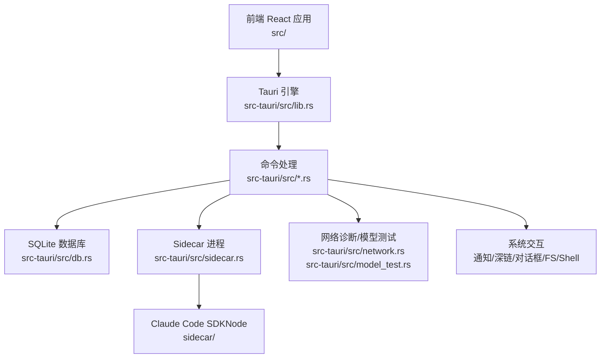
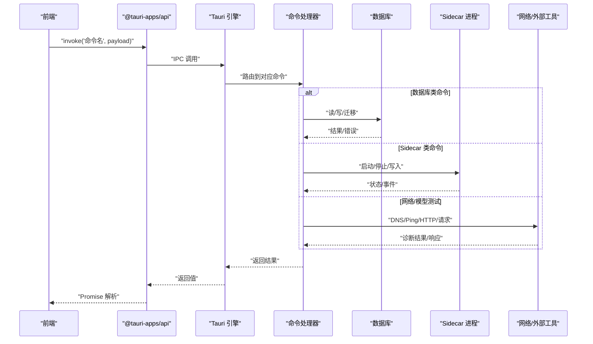
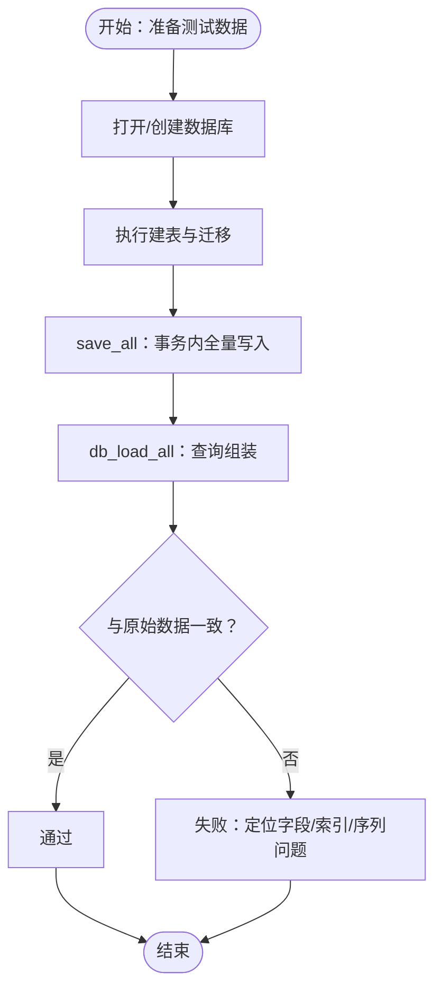
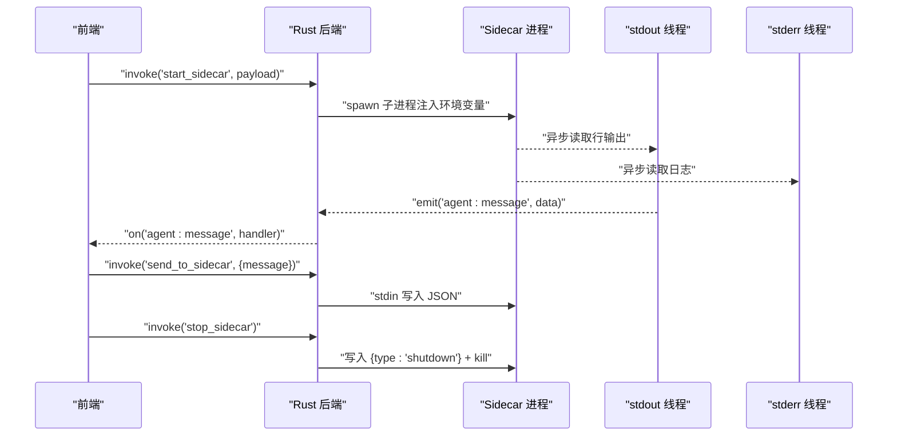
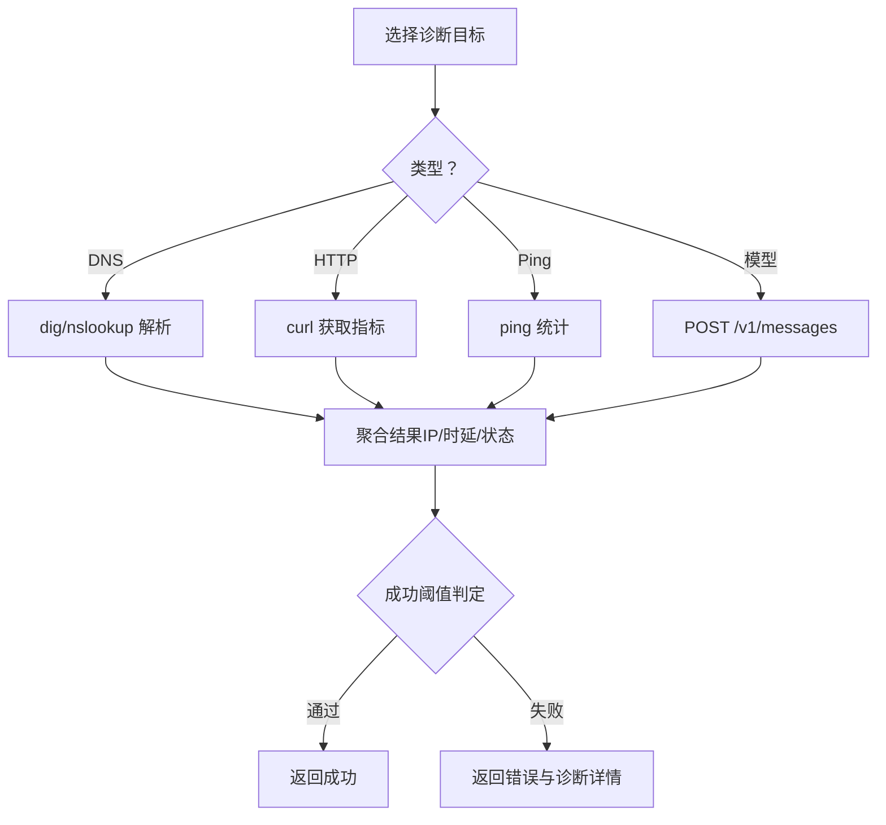
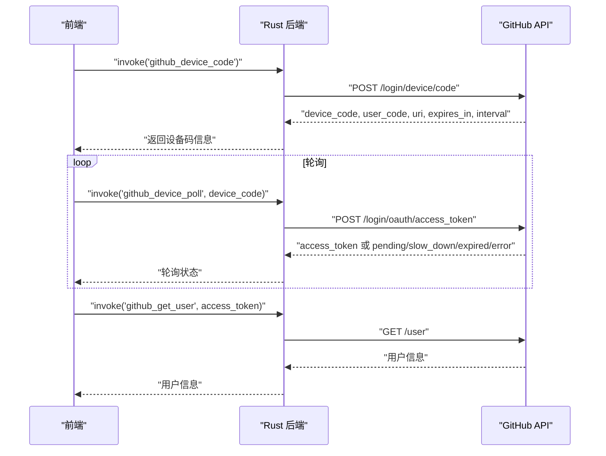
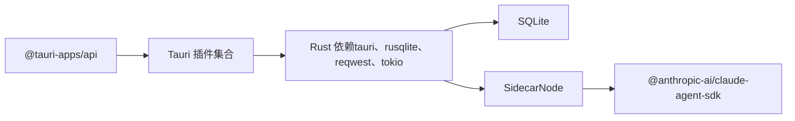

# 集成测试

<cite>
**本文引用的文件**
- [Cargo.toml](file://src-tauri/Cargo.toml)
- [package.json](file://package.json)
- [tauri.conf.json](file://src-tauri/tauri.conf.json)
- [main.rs](file://src-tauri/src/main.rs)
- [lib.rs](file://src-tauri/src/lib.rs)
- [sidecar.rs](file://src-tauri/src/sidecar.rs)
- [db.rs](file://src-tauri/src/db.rs)
- [network.rs](file://src-tauri/src/network.rs)
- [model_test.rs](file://src-tauri/src/model_test.rs)
- [integration.rs](file://src-tauri/src/integration.rs)
- [package.json（sidecar）](file://sidecar/package.json)
</cite>

## 目录
1. [简介](#简介)
2. [项目结构](#项目结构)
3. [核心组件](#核心组件)
4. [架构总览](#架构总览)
5. [详细组件分析](#详细组件分析)
6. [依赖关系分析](#依赖关系分析)
7. [性能考量](#性能考量)
8. [故障排查指南](#故障排查指南)
9. [结论](#结论)
10. [附录](#附录)

## 简介
本文件面向 RabbitCoding 的集成测试，覆盖 Rust 后端与前端的端到端集成测试策略，重点包括：
- Tauri 命令的集成测试（命令注册、参数传递、返回值校验）
- 数据库集成测试（SQLite 初始化、Schema 迁移、读写一致性）
- Sidecar 进程通信测试（启动、消息收发、状态查询、优雅关闭）
- 网络诊断与模型连通性测试（DNS/Ping/HTTP 诊断、Anthropic 兼容端点连通性）
- 文件系统与外部工具交互（通知、系统设置、终端PTY、Shell/FS 插件）
- 前后端数据流与 API 接口集成验证
- 测试环境搭建、Mock 服务使用与常见测试场景

## 项目结构
RabbitCoding 采用 Tauri 2 + React/Vite 前后端一体化架构。Rust 后端位于 src-tauri，负责：
- Tauri 命令注册与业务逻辑
- SQLite 数据持久化
- Sidecar 进程管理与事件分发
- 网络诊断与模型连通性测试
- 外部系统交互（通知、深链、对话框、文件系统、Shell）

前端位于 src，通过 @tauri-apps/api 与后端命令交互。

图表来源
- [lib.rs:196-390](file://src-tauri/src/lib.rs#L196-L390)
- [db.rs:80-161](file://src-tauri/src/db.rs#L80-L161)
- [sidecar.rs:59-214](file://src-tauri/src/sidecar.rs#L59-L214)
- [network.rs:366-375](file://src-tauri/src/network.rs#L366-L375)
- [model_test.rs:73-207](file://src-tauri/src/model_test.rs#L73-L207)

章节来源
- [tauri.conf.json:6-11](file://src-tauri/tauri.conf.json#L6-L11)
- [package.json:7-13](file://package.json#L7-L13)
- [Cargo.toml:20-39](file://src-tauri/Cargo.toml#L20-L39)

## 核心组件
- 命令注册与生命周期：在 lib.rs 中集中注册所有命令，并在 setup 阶段初始化数据库、启动 OAuth 回调服务、注入 Node.js 运行时、注册深链等。
- 数据库模块：封装 SQLite Schema、建表与迁移、全量读写、索引优化。
- Sidecar 模块：管理 sidecar 进程生命周期、标准输入输出线程、事件广播、状态查询与优雅关闭。
- 网络与模型测试：跨平台 DNS/Ping/HTTP 诊断；Anthropic 兼容端点最小请求连通性测试。
- 集成模块：GitHub 设备码 OAuth 流程（设备码、轮询、获取用户信息）。
- 前端集成：通过 @tauri-apps/api 的 invoke/onWindowEvent 等与后端命令交互。

章节来源
- [lib.rs:196-390](file://src-tauri/src/lib.rs#L196-L390)
- [db.rs:80-161](file://src-tauri/src/db.rs#L80-L161)
- [sidecar.rs:59-214](file://src-tauri/src/sidecar.rs#L59-L214)
- [network.rs:366-375](file://src-tauri/src/network.rs#L366-L375)
- [model_test.rs:73-207](file://src-tauri/src/model_test.rs#L73-L207)
- [integration.rs:140-230](file://src-tauri/src/integration.rs#L140-L230)

## 架构总览
下图展示从前端发起命令到后端处理与外部系统交互的整体流程。

图表来源
- [lib.rs:344-387](file://src-tauri/src/lib.rs#L344-L387)
- [db.rs:392-416](file://src-tauri/src/db.rs#L392-L416)
- [sidecar.rs:60-214](file://src-tauri/src/sidecar.rs#L60-L214)
- [network.rs:366-375](file://src-tauri/src/network.rs#L366-L375)
- [model_test.rs:79-207](file://src-tauri/src/model_test.rs#L79-L207)

## 详细组件分析

### Tauri 命令与集成测试要点
- 命令注册：集中于 lib.rs 的 invoke_handler，包含文件系统、通知、窗口状态、数据库、网络诊断、模型测试、Sidecar、GitNexus、ECC、反馈、认证等命令。
- 生命周期：setup 阶段初始化数据库、注入 Node.js PATH、注册深链、监听窗口事件并保存状态。
- 前端调用：通过 @tauri-apps/api 的 invoke 调用命令，onWindowEvent 订阅 sidecar 事件。

建议的集成测试场景
- 命令可达性：对每个命令进行最小调用，验证返回结构与错误分支。
- 参数边界：空值、特殊字符、超长字符串、非法路径等。
- 幂等性：ensure_* 系列命令多次调用不产生副作用。
- 事件订阅：订阅 agent:message 事件，验证 Sidecar 输出转发。

章节来源
- [lib.rs:196-390](file://src-tauri/src/lib.rs#L196-L390)
- [tauri.conf.json:6-11](file://src-tauri/tauri.conf.json#L6-L11)

### 数据库集成测试
- 初始化与迁移：打开数据库时执行建表与列迁移，确保 schema 与索引存在。
- 读写一致性：load_all/save_all 事务性全量替换，验证消息序列、token 使用、回合数等字段。
- 索引与查询：基于索引的查询路径（workspace/rabbit/repo/message）需覆盖。
- 并发安全：rusqlite + WAL 模式下的并发读写行为。

图表来源
- [db.rs:140-161](file://src-tauri/src/db.rs#L140-L161)
- [db.rs:290-386](file://src-tauri/src/db.rs#L290-L386)
- [db.rs:392-416](file://src-tauri/src/db.rs#L392-L416)

章节来源
- [db.rs:80-161](file://src-tauri/src/db.rs#L80-L161)
- [db.rs:167-288](file://src-tauri/src/db.rs#L167-L288)
- [db.rs:290-386](file://src-tauri/src/db.rs#L290-L386)
- [db.rs:392-416](file://src-tauri/src/db.rs#L392-L416)

### Sidecar 进程通信测试
- 启动流程：根据开发/生产模式选择 Node 可执行与 sidecar-bundle.js；清理 Anthropic 环境变量；隔离 Claude 配置根目录；注入 API Key/Base URL/自定义环境变量。
- 事件分发：stdout 行事件 emit 到前端 agent:message；stderr 日志打印；进程退出事件。
- 通信协议：stdin 写入 JSON 文本；支持 shutdown 命令。
- 状态与关闭：查询运行状态；优雅关闭（先写 shutdown，等待片刻再 kill）。

图表来源
- [sidecar.rs:60-214](file://src-tauri/src/sidecar.rs#L60-L214)
- [sidecar.rs:216-270](file://src-tauri/src/sidecar.rs#L216-L270)
- [sidecar.rs:272-279](file://src-tauri/src/sidecar.rs#L272-L279)

章节来源
- [sidecar.rs:59-214](file://src-tauri/src/sidecar.rs#L59-L214)
- [sidecar.rs:216-270](file://src-tauri/src/sidecar.rs#L216-L270)
- [sidecar.rs:272-279](file://src-tauri/src/sidecar.rs#L272-L279)
- [package.json（sidecar）:6-11](file://sidecar/package.json#L6-L11)

### 网络诊断与模型连通性测试
- DNS 诊断：跨平台 dig/nslookup，提取 A 记录与 DNS 服务器，记录解析时延与错误。
- HTTP 诊断：curl 获取状态码、HTTP 版本、TLS 版本、响应时间、内容类型、远端 IP。
- Ping 诊断：跨平台 ping，统计包数、丢包率与 RTT。
- 模型连通性：向 {base_url}/v1/messages 发送最小 Messages 请求，校验鉴权、模型可用性与延迟。

图表来源
- [network.rs:366-375](file://src-tauri/src/network.rs#L366-L375)
- [network.rs:538-550](file://src-tauri/src/network.rs#L538-L550)
- [network.rs:556-800](file://src-tauri/src/network.rs#L556-L800)
- [model_test.rs:79-207](file://src-tauri/src/model_test.rs#L79-L207)

章节来源
- [network.rs:10-94](file://src-tauri/src/network.rs#L10-L94)
- [network.rs:366-375](file://src-tauri/src/network.rs#L366-L375)
- [network.rs:538-550](file://src-tauri/src/network.rs#L538-L550)
- [network.rs:556-800](file://src-tauri/src/network.rs#L556-L800)
- [model_test.rs:73-207](file://src-tauri/src/model_test.rs#L73-L207)

### 文件系统与外部工具集成测试
- 文件系统：通过 tauri-plugin-fs 与 read_text_file_unrestricted 读取受限目录（如 .rabbit）。
- 通知：跨平台桌面通知（macOS/Windows），绕过插件签名限制。
- 深度链接：注册自定义 schemes，开发期自动注册。
- 终端与 Shell：pty 与 shell 插件用于终端能力与命令执行。
- 系统设置：打开通知设置页。

章节来源
- [lib.rs:107-132](file://src-tauri/src/lib.rs#L107-L132)
- [lib.rs:134-186](file://src-tauri/src/lib.rs#L134-L186)
- [lib.rs:196-390](file://src-tauri/src/lib.rs#L196-L390)
- [tauri.conf.json:44-50](file://src-tauri/tauri.conf.json#L44-L50)

### GitHub 集成测试（设备码 OAuth）
- 设备码申请：POST /login/device/code，返回 device_code、user_code、verification_uri、expires_in、interval。
- 轮询令牌：POST /login/oauth/access_token，轮询状态 pending/slow_down/expired/error。
- 获取用户：GET /user，返回登录名、头像、姓名。

图表来源
- [integration.rs:140-230](file://src-tauri/src/integration.rs#L140-L230)

章节来源
- [integration.rs:140-230](file://src-tauri/src/integration.rs#L140-L230)

## 依赖关系分析
- Rust 依赖：tauri、rusqlite、reqwest、serde、tokio、tauri 插件集合。
- 前端依赖：@tauri-apps/api 与各插件（dialog、fs、notification、opener、shell 等）。
- Sidecar 依赖：@anthropic-ai/claude-agent-sdk、zod。

图表来源
- [Cargo.toml:20-39](file://src-tauri/Cargo.toml#L20-L39)
- [package.json:14-36](file://package.json#L14-L36)
- [package.json（sidecar）:12-15](file://sidecar/package.json#L12-L15)

章节来源
- [Cargo.toml:20-39](file://src-tauri/Cargo.toml#L20-L39)
- [package.json:14-36](file://package.json#L14-L36)
- [package.json（sidecar）:12-15](file://sidecar/package.json#L12-L15)

## 性能考量
- 数据库：WAL 模式、外键约束、索引（workspace/rabbit/repo/message）提升查询效率；批量写入使用事务。
- 网络诊断：异步任务（tokio::task::spawn_blocking）避免阻塞主线程；curl 超时控制。
- Sidecar：stdout/stderr 分离线程，避免阻塞 stdin；优雅关闭减少僵尸进程。
- 前端：命令调用尽量批量化，避免频繁 IPC。

## 故障排查指南
- 命令返回错误：检查 payload 参数合法性与必填项；查看命令内部错误映射（如模型测试的 HTTP 状态分类）。
- 数据库异常：确认 schema 迁移是否成功；检查事务提交/回滚路径；验证索引是否存在。
- Sidecar 启动失败：确认 Node 可执行路径与 sidecar-bundle.js 存在；检查环境变量注入与 CLAUDE_CONFIG_DIR 隔离。
- 网络诊断失败：检查系统工具（dig/nslookup/curl/ping）可用性；代理检测与系统代理配置。
- 通知/深链：确认平台特定命令可用与注册；macOS/Windows 权限与签名影响。

章节来源
- [model_test.rs:171-207](file://src-tauri/src/model_test.rs#L171-L207)
- [db.rs:290-305](file://src-tauri/src/db.rs#L290-L305)
- [sidecar.rs:96-150](file://src-tauri/src/sidecar.rs#L96-L150)
- [network.rs:100-201](file://src-tauri/src/network.rs#L100-L201)

## 结论
通过以上测试策略与组件分析，可以系统性地验证 RabbitCoding 的前后端集成质量。建议在 CI 中覆盖命令可达性、数据库读写、Sidecar 生命周期、网络诊断与模型连通性等关键路径，并结合 Mock 服务与外部工具的可用性进行稳健测试。

## 附录
- 测试环境搭建
  - 开发：前端 dev 与后端 devUrl 对接；生产：打包后资源注入与 Node.js PATH 设置。
  - Sidecar：开发模式使用 npx tsx 或编译后的 dist；生产模式使用内置 node-runtime 与 sidecar-bundle.js。
- Mock 服务
  - 网络诊断：可使用本地 echo 服务模拟 DNS/Ping/HTTP 响应；模型测试可使用反向代理或本地服务镜像 Anthropic 兼容端点。
  - GitHub：设备码轮询可使用本地脚本模拟不同轮询阶段（pending/slow_down/expired）。
- 常见测试场景
  - 命令参数边界与错误提示
  - 数据库迁移与事务一致性
  - Sidecar 启停与事件转发
  - 网络诊断在不同代理与防火墙下的表现
  - 模型连通性在不同超时与限流条件下的行为