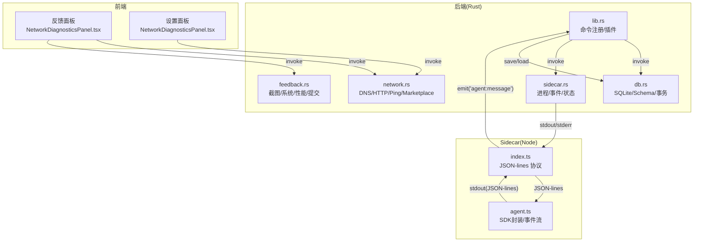
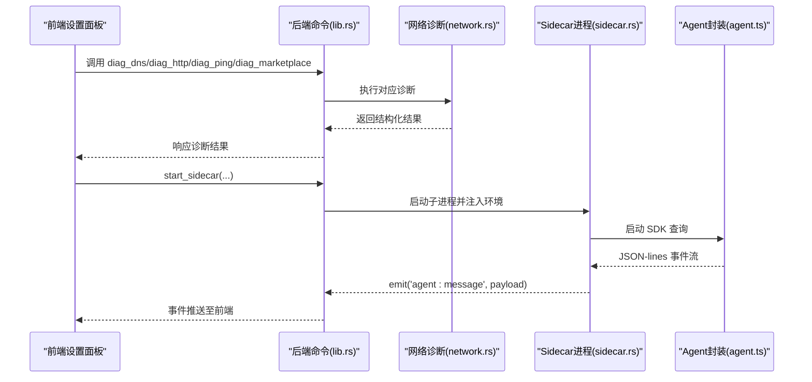
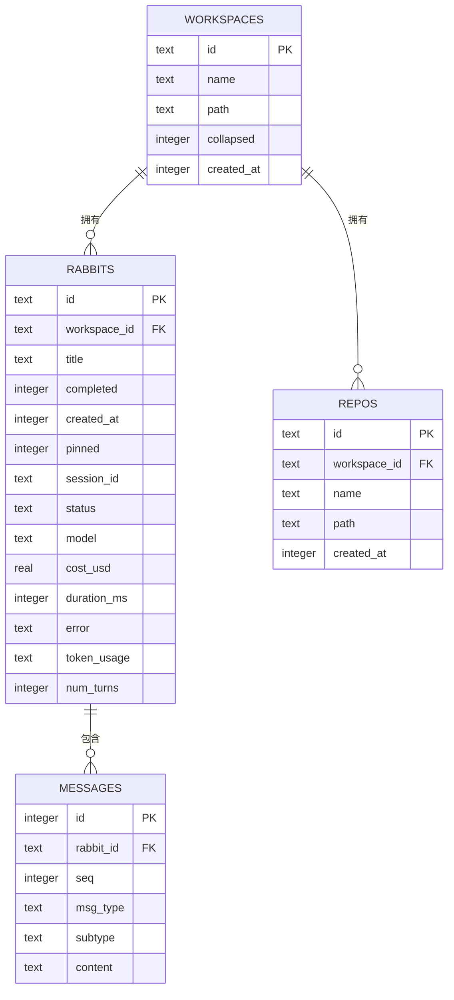
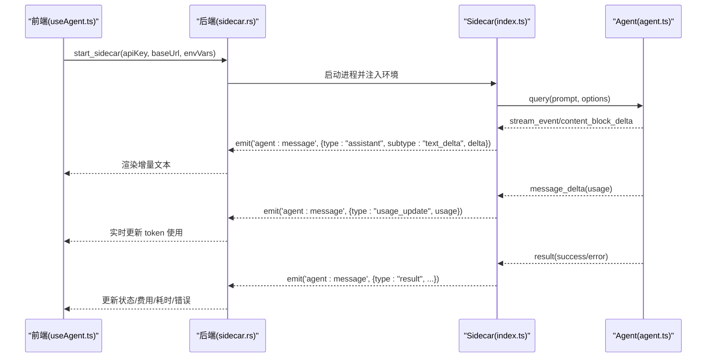
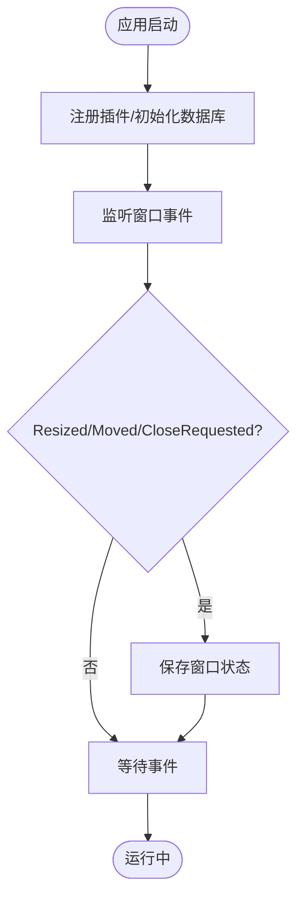
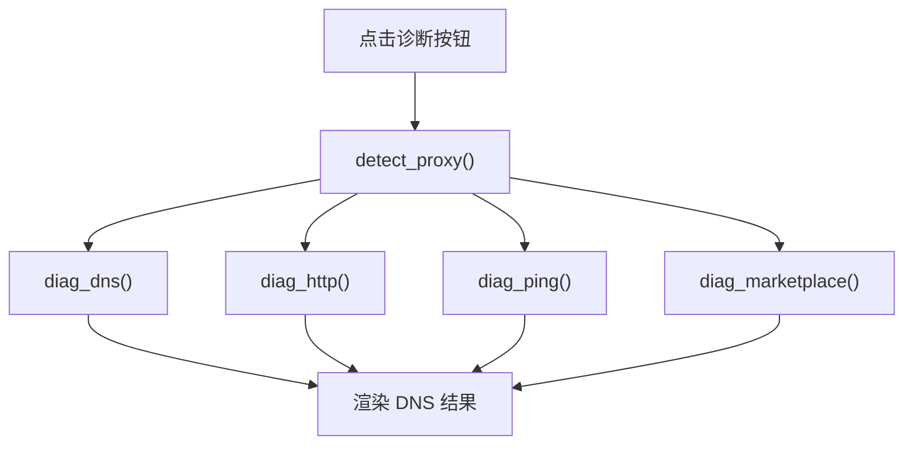
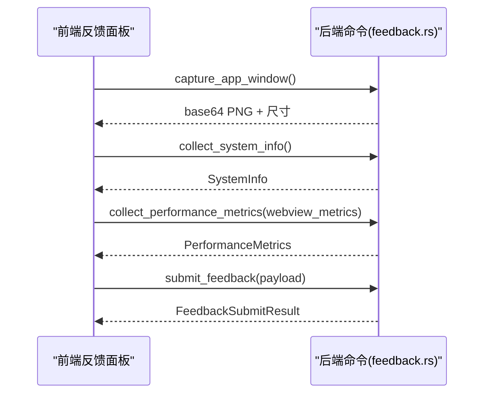
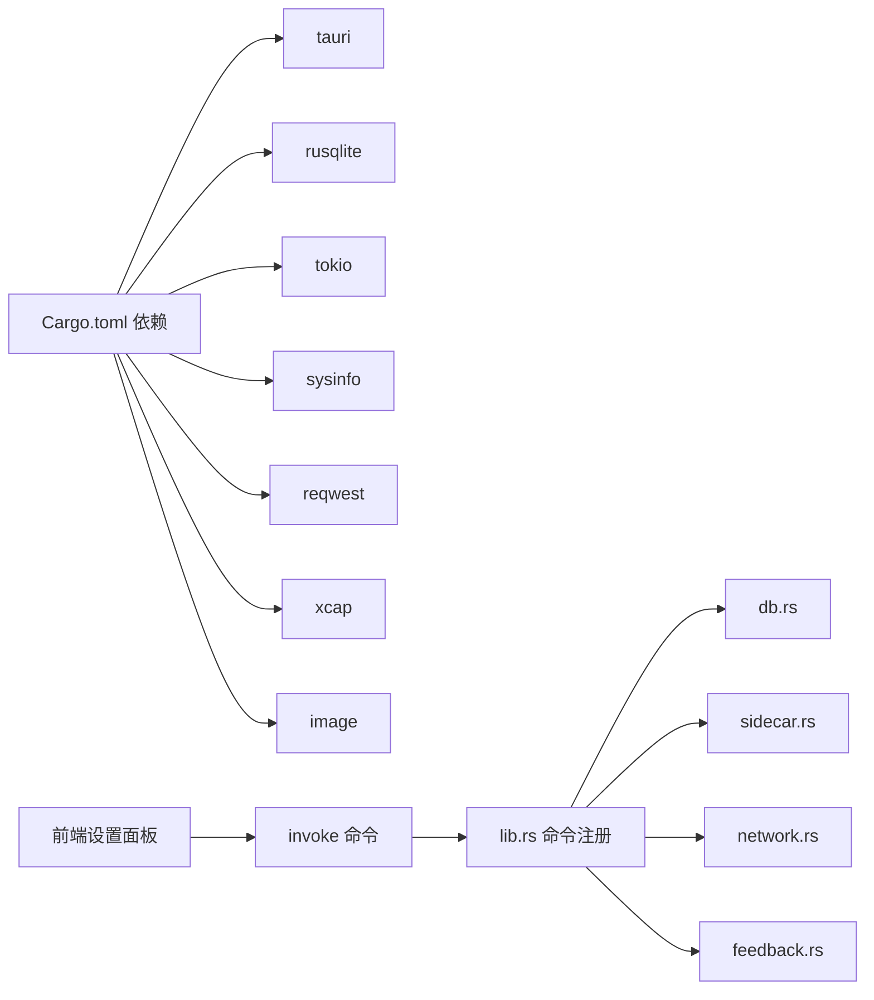

# 应用监控

<cite>
**本文引用的文件**
- [src-tauri/src/lib.rs](file://src-tauri/src/lib.rs)
- [src-tauri/src/main.rs](file://src-tauri/src/main.rs)
- [src-tauri/src/db.rs](file://src-tauri/src/db.rs)
- [src-tauri/src/sidecar.rs](file://src-tauri/src/sidecar.rs)
- [src-tauri/src/network.rs](file://src-tauri/src/network.rs)
- [src-tauri/src/feedback.rs](file://src-tauri/src/feedback.rs)
- [sidecar/src/index.ts](file://sidecar/src/index.ts)
- [sidecar/src/agent.ts](file://sidecar/src/agent.ts)
- [src/hooks/useAgent.ts](file://src/hooks/useAgent.ts)
- [src/hooks/useAgentContext.tsx](file://src/hooks/useAgentContext.tsx)
- [src/components/settings/NetworkDiagnosticsPanel.tsx](file://src/components/settings/NetworkDiagnosticsPanel.tsx)
- [src/components/settings/FeedbackPanel.tsx](file://src/components/settings/FeedbackPanel.tsx)
- [src-tauri/Cargo.toml](file://src-tauri/Cargo.toml)
</cite>

## 目录
1. [简介](#简介)
2. [项目结构](#项目结构)
3. [核心组件](#核心组件)
4. [架构总览](#架构总览)
5. [详细组件分析](#详细组件分析)
6. [依赖关系分析](#依赖关系分析)
7. [性能考量](#性能考量)
8. [故障排查指南](#故障排查指南)
9. [结论](#结论)
10. [附录](#附录)

## 简介
本文件面向 RabbitCoding 应用监控系统，围绕“运行时监控”展开，重点覆盖以下方面：
- 数据库连接监控：SQLite 数据库存储结构、事务一致性、迁移与索引策略
- AI 代理状态监控：侧车进程生命周期、消息流事件、看门狗与异常检测
- 工作空间活动监控：窗口状态持久化、本地数据快照与恢复
- 监控指标采集：网络连通性诊断、性能指标采集、反馈上报
- 数据存储与查询：表结构、序列化/反序列化、查询接口
- 可视化与告警：前端展示、超时与异常收敛、阈值建议
- 实时性与历史策略：事件流与持久化权衡、历史数据保留建议
- 可扩展性设计：模块化命令注册、跨平台适配、Sidecar 扩展点

## 项目结构
RabbitCoding 采用 Tauri + React 前后端分离架构，监控能力主要分布在后端 Rust 模块与前端设置面板之间：
- 后端（Rust）：数据库、网络诊断、反馈采集、Sidecar 进程管理
- 前端（React）：设置面板、监控可视化、命令调用
- Sidecar（Node）：Claude Agent SDK 封装、事件流、工具调用、会话压缩

图示来源
- [src-tauri/src/lib.rs:196-390](file://src-tauri/src/lib.rs#L196-L390)
- [src-tauri/src/db.rs:140-161](file://src-tauri/src/db.rs#L140-L161)
- [src-tauri/src/sidecar.rs:60-214](file://src-tauri/src/sidecar.rs#L60-L214)
- [src-tauri/src/network.rs:366-375](file://src-tauri/src/network.rs#L366-L375)
- [src-tauri/src/feedback.rs:119-158](file://src-tauri/src/feedback.rs#L119-L158)
- [sidecar/src/index.ts:96-128](file://sidecar/src/index.ts#L96-L128)
- [sidecar/src/agent.ts:241-465](file://sidecar/src/agent.ts#L241-L465)

章节来源
- [src-tauri/src/lib.rs:196-390](file://src-tauri/src/lib.rs#L196-L390)
- [src-tauri/src/main.rs:1-7](file://src-tauri/src/main.rs#L1-L7)

## 核心组件
- 数据库层（db.rs）
  - Schema：workspaces、rabbits、repos、messages 四表，外键约束与索引
  - 命令：db_load_all、db_save_all、db_has_data
  - 事务：全量替换采用 BEGIN/COMMIT/ROLLBACK
- Sidecar 进程（sidecar.rs）
  - 启动/停止/状态查询
  - stdout/stderr 线程转发为前端事件
  - 环境隔离：清空 Anthropic 环境变量、重定向 CLAUDE_CONFIG_DIR
- 网络诊断（network.rs）
  - DNS/HTTP/Ping/Marketplace 四类诊断，返回结构化结果
  - 代理检测：环境变量与系统代理识别
- 反馈与性能（feedback.rs）
  - 截图、系统信息、WebView 指标、系统进程指标聚合
  - 性能指标：应用内存/CPU、系统内存/CPU、WebView DOM/JS Heap/Timing
- 前端监控集成
  - 设置面板触发诊断命令，渲染结果
  - 侧车事件监听与看门狗超时控制

章节来源
- [src-tauri/src/db.rs:80-161](file://src-tauri/src/db.rs#L80-L161)
- [src-tauri/src/sidecar.rs:60-279](file://src-tauri/src/sidecar.rs#L60-L279)
- [src-tauri/src/network.rs:366-863](file://src-tauri/src/network.rs#L366-L863)
- [src-tauri/src/feedback.rs:119-281](file://src-tauri/src/feedback.rs#L119-L281)
- [src/components/settings/NetworkDiagnosticsPanel.tsx:357-376](file://src/components/settings/NetworkDiagnosticsPanel.tsx#L357-L376)
- [src/components/settings/FeedbackPanel.tsx:392-422](file://src/components/settings/FeedbackPanel.tsx#L392-L422)

## 架构总览
RabbitCoding 的监控体系以“命令桥接 + 事件流 + 本地持久化”为核心：
- 前端通过 invoke 调用后端命令，后端执行 I/O 或子进程操作
- Sidecar 通过 JSON-lines 协议向后端 stdout 输出事件，后端转发为前端事件
- SQLite 作为轻量级本地存储，承载工作空间、会话、消息与仓库元数据
- 网络诊断与性能采集作为独立命令，便于按需触发与可视化

图示来源
- [src-tauri/src/lib.rs:344-387](file://src-tauri/src/lib.rs#L344-L387)
- [src-tauri/src/network.rs:366-863](file://src-tauri/src/network.rs#L366-L863)
- [src-tauri/src/sidecar.rs:60-214](file://src-tauri/src/sidecar.rs#L60-L214)
- [sidecar/src/index.ts:96-128](file://sidecar/src/index.ts#L96-L128)
- [sidecar/src/agent.ts:241-465](file://sidecar/src/agent.ts#L241-L465)

## 详细组件分析

### 数据库连接监控（db.rs）
- 存储结构
  - workspaces：工作空间元数据（名称、路径、折叠状态、创建时间）
  - rabbits：会话记录（标题、完成状态、会话ID、状态、模型、费用、耗时、错误、token使用、轮次、消息）
  - repos：仓库记录（名称、路径、创建时间）
  - messages：会话消息（按 seq 排序）
- 索引与迁移
  - 为 rabbits/workspace_id、repos/workspace_id、messages(rabbit_id, seq) 建立索引
  - 迁移：新增列 token_usage、num_turns（幂等）
- 事务与一致性
  - 全量保存采用事务：DELETE + INSERT，失败自动 ROLLBACK
  - 加载时一次性 JOIN 查询，序列化为前端所需结构
- 实时性与历史
  - 本地持久化，适合历史会话检索与恢复
  - 通过消息表按序存储，支持增量展示与回放

图示来源
- [src-tauri/src/db.rs:85-138](file://src-tauri/src/db.rs#L85-L138)

章节来源
- [src-tauri/src/db.rs:140-416](file://src-tauri/src/db.rs#L140-L416)

### AI 代理状态监控（sidecar.rs + agent.ts + useAgent.ts）
- 进程生命周期
  - 启动：注入 API Key/Base URL/自定义环境变量，隔离 CLAUDE_CONFIG_DIR
  - 停止：先优雅 shutdown，再强制 kill
  - 状态：running 字段
- 事件流
  - stdout：JSON-lines 事件（system/init、assistant/text_delta/thinking_delta/tool_use/tool_result/usage_update/result/error/compaction/compaction_result/ask_user_question）
  - stderr：日志
  - 前端：emit('agent:message') 转发到 UI
- 会话与工具
  - 会话恢复/压缩：/compact 触发压缩
  - AskUserQuestion：前端等待用户回答，超时 5 分钟
  - WriteSpec：写入 .rabbit/specs/ 目录，触发查询中止
- 看门狗与异常检测
  - 前端对每条 query 维护 watchdog：收到任意消息重置
  - 正常态 10 分钟无响应判定超时；思考态放宽到 30 分钟
  - 侧车退出：统一收敛为 error，避免 UI 永远 loading
- 实时性
  - JSON-lines 流式输出，前端即时渲染
  - 令牌用量 usage_update 按 turn 推送，覆盖式更新

图示来源
- [src-tauri/src/sidecar.rs:60-214](file://src-tauri/src/sidecar.rs#L60-L214)
- [sidecar/src/index.ts:37-91](file://sidecar/src/index.ts#L37-L91)
- [sidecar/src/agent.ts:146-199](file://sidecar/src/agent.ts#L146-L199)
- [src/hooks/useAgent.ts:66-95](file://src/hooks/useAgent.ts#L66-L95)
- [src/hooks/useAgentContext.tsx:131-193](file://src/hooks/useAgentContext.tsx#L131-L193)

章节来源
- [src-tauri/src/sidecar.rs:60-279](file://src-tauri/src/sidecar.rs#L60-L279)
- [sidecar/src/index.ts:96-144](file://sidecar/src/index.ts#L96-L144)
- [sidecar/src/agent.ts:241-465](file://sidecar/src/agent.ts#L241-L465)
- [src/hooks/useAgent.ts:46-101](file://src/hooks/useAgent.ts#L46-L101)
- [src/hooks/useAgentContext.tsx:131-193](file://src/hooks/useAgentContext.tsx#L131-L193)

### 工作空间活动监控（窗口状态与本地数据）
- 窗口状态持久化
  - 监听窗口 Resized/Moved/CloseRequested 事件，实时保存窗口状态
  - 恢复时打印当前尺寸与显示器信息，便于诊断
- 本地数据快照
  - 通过 db_load_all/db_save_all 实现工作空间数据的全量导入导出
  - db_has_data 用于判断是否需要迁移

图示来源
- [src-tauri/src/lib.rs:285-329](file://src-tauri/src/lib.rs#L285-L329)
- [src-tauri/src/db.rs:392-416](file://src-tauri/src/db.rs#L392-L416)

章节来源
- [src-tauri/src/lib.rs:285-329](file://src-tauri/src/lib.rs#L285-L329)
- [src-tauri/src/db.rs:392-416](file://src-tauri/src/db.rs#L392-L416)

### 网络诊断与可视化（network.rs + NetworkDiagnosticsPanel.tsx）
- 诊断范围
  - DNS：解析时间、服务器、IP 列表
  - HTTP：状态码、版本、TLS、响应时间、内容类型、远端 IP
  - Ping：丢包率、RTT min/avg/max
  - Marketplace：连通性与可用性
- 代理检测
  - 环境变量优先，其次系统代理（Windows netsh、macOS scutil）
- 前端可视化
  - 设置面板触发诊断命令，汇总结果并展示

图示来源
- [src-tauri/src/network.rs:100-201](file://src-tauri/src/network.rs#L100-L201)
- [src-tauri/src/network.rs:366-863](file://src-tauri/src/network.rs#L366-L863)
- [src/components/settings/NetworkDiagnosticsPanel.tsx:357-376](file://src/components/settings/NetworkDiagnosticsPanel.tsx#L357-L376)

章节来源
- [src-tauri/src/network.rs:100-201](file://src-tauri/src/network.rs#L100-L201)
- [src-tauri/src/network.rs:366-863](file://src-tauri/src/network.rs#L366-L863)
- [src/components/settings/NetworkDiagnosticsPanel.tsx:357-376](file://src/components/settings/NetworkDiagnosticsPanel.tsx#L357-L376)

### 性能指标采集与反馈（feedback.rs + FeedbackPanel.tsx）
- 指标采集
  - 系统信息：OS/版本/架构/应用版本/标识/CPU/内存
  - 应用指标：进程内存/CPU、系统整体内存/CPU 使用率
  - WebView 指标：DOM 元素数、JS Heap 使用/总量、DOM Complete 时间
- 反馈提交
  - 截图（窗口捕获）、描述、配置摘要、性能指标
  - 服务端返回 ticket_id（可选）

图示来源
- [src-tauri/src/feedback.rs:119-281](file://src-tauri/src/feedback.rs#L119-L281)
- [src/components/settings/FeedbackPanel.tsx:392-422](file://src/components/settings/FeedbackPanel.tsx#L392-L422)

章节来源
- [src-tauri/src/feedback.rs:119-281](file://src-tauri/src/feedback.rs#L119-L281)
- [src/components/settings/FeedbackPanel.tsx:392-422](file://src/components/settings/FeedbackPanel.tsx#L392-L422)

## 依赖关系分析
- Rust 依赖
  - tauri、rusqlite、tokio、sysinfo、reqwest、xcap、image、serde 等
- 前端交互
  - 通过 invoke 调用后端命令，事件通过 emit('agent:message') 推送
- Sidecar 依赖
  - @anthropic-ai/claude-agent-sdk、zod、fs/promises、path/url

图示来源
- [src-tauri/Cargo.toml:20-39](file://src-tauri/Cargo.toml#L20-L39)
- [src-tauri/src/lib.rs:344-387](file://src-tauri/src/lib.rs#L344-L387)

章节来源
- [src-tauri/Cargo.toml:20-39](file://src-tauri/Cargo.toml#L20-L39)
- [src-tauri/src/lib.rs:344-387](file://src-tauri/src/lib.rs#L344-L387)

## 性能考量
- 数据库
  - WAL 模式、外键开启、同步级别 NORMAL，兼顾可靠性与性能
  - 事务批量写入，减少 fsync 次数
  - 索引覆盖高频查询（按 workspace_id、按 rabbit_id+seq）
- 网络诊断
  - 使用 tokio::task::spawn_blocking，避免阻塞主线程
  - curl 多次调用获取指标，注意超时与错误处理
- Sidecar
  - JSON-lines 流式输出，低延迟事件推送
  - stdout/stderr 分离，不影响协议消息
- 前端
  - 看门狗按状态调整超时阈值，避免误判
  - 事件驱动更新，避免轮询

## 故障排查指南
- Sidecar 无响应
  - 检查进程是否存活、stdout 是否关闭、stderr 日志
  - 触发 get_sidecar_status 确认 running 状态
  - 若 sidecar 退出，前端统一收敛为 error，查看退出原因
- 会话卡死
  - 看门狗超时：正常态 10 分钟、思考态 30 分钟
  - 检查前端 onQueryTimeout 回调是否触发
- 网络诊断失败
  - 检查代理检测结果与系统代理配置
  - DNS/HTTP/Ping/Marketplace 分别排查
- 性能指标缺失
  - 确认 includePerformance 选项开启
  - 检查 WebView 指标是否传入 collect_performance_metrics

章节来源
- [src-tauri/src/sidecar.rs:272-279](file://src-tauri/src/sidecar.rs#L272-L279)
- [src/hooks/useAgent.ts:66-95](file://src/hooks/useAgent.ts#L66-L95)
- [src/hooks/useAgentContext.tsx:180-193](file://src/hooks/useAgentContext.tsx#L180-L193)
- [src-tauri/src/network.rs:100-201](file://src-tauri/src/network.rs#L100-L201)
- [src-tauri/src/feedback.rs:195-235](file://src-tauri/src/feedback.rs#L195-L235)

## 结论
RabbitCoding 的监控体系以“命令 + 事件 + 本地存储”为核心，实现了：
- 可观测的工作空间与会话数据
- 实时的 AI 代理状态与工具调用链路
- 可视化的网络连通性与性能指标
- 健壮的异常检测与超时收敛
建议在生产环境中结合业务需求设定告警阈值与历史保留策略，并持续优化 Sidecar 与前端事件处理的吞吐。

## 附录
- 监控配置示例
  - 网络诊断：在设置面板点击“运行诊断”，查看 DNS/HTTP/Ping/Marketplace 结果
  - 性能反馈：勾选“包含性能分析”，提交反馈时附带系统与 WebView 指标
- 告警阈值建议（基于实现行为）
  - Sidecar 会话：正常态 10 分钟、思考态 30 分钟无消息视为超时
  - 网络诊断：HTTP 状态码非 200 或超时标记为异常；Ping 丢包率过高视为异常
- 实时性与历史策略
  - 事件流：JSON-lines 实时推送，前端即时渲染
  - 历史：SQLite 存储会话与消息，支持历史检索与恢复
- 可扩展性
  - 新增命令：在 lib.rs 中注册，Rust 实现对应 command
  - Sidecar 扩展：通过 MCP 工具与 SDK 事件扩展 Agent 能力