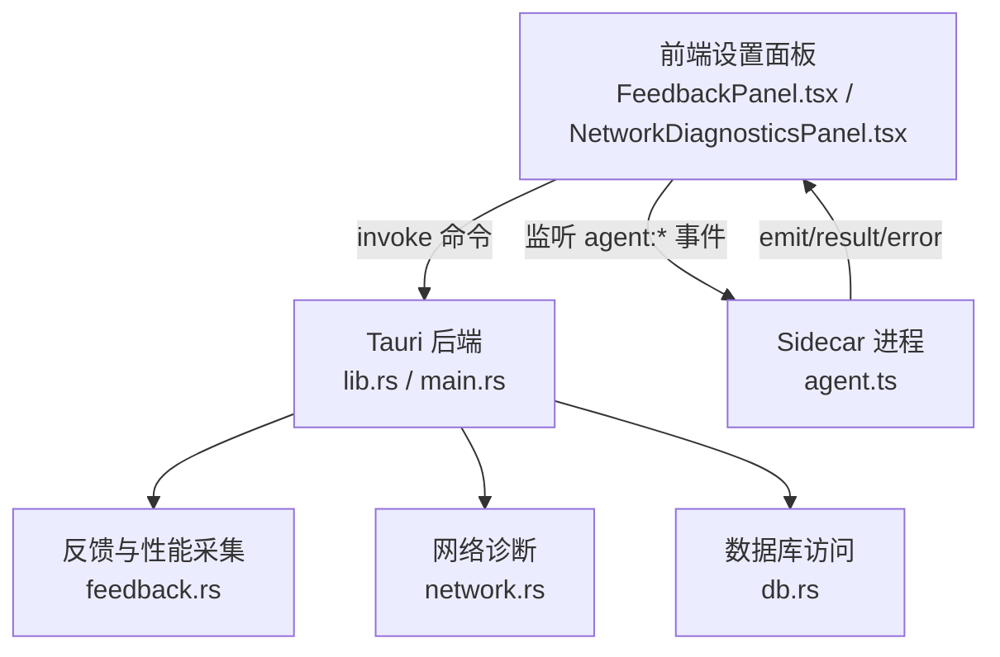
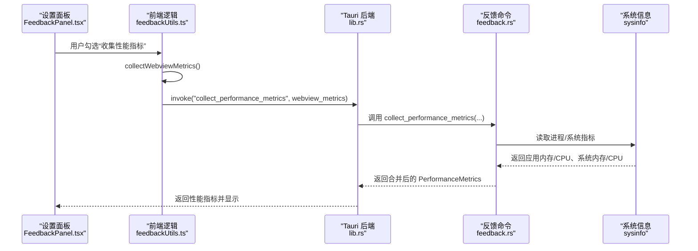
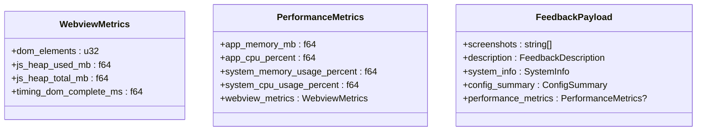
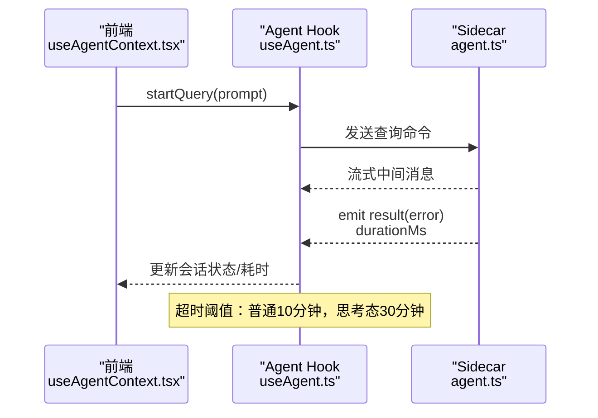
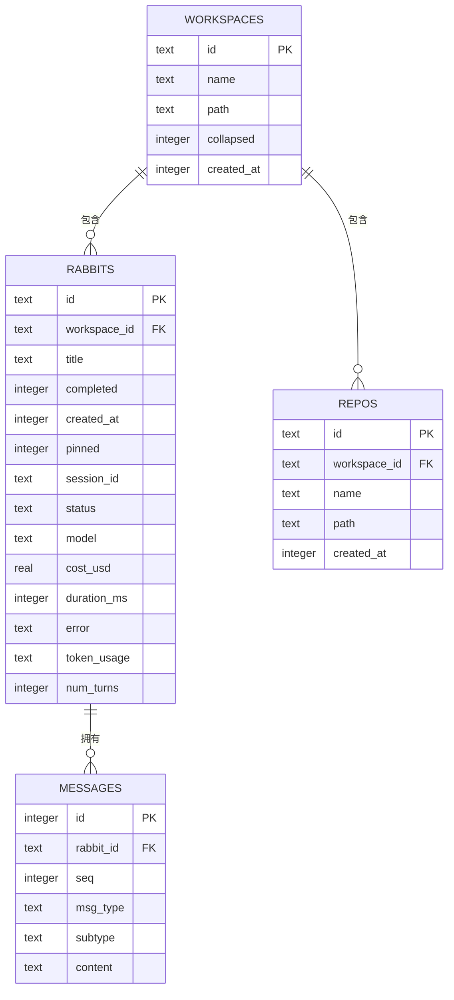
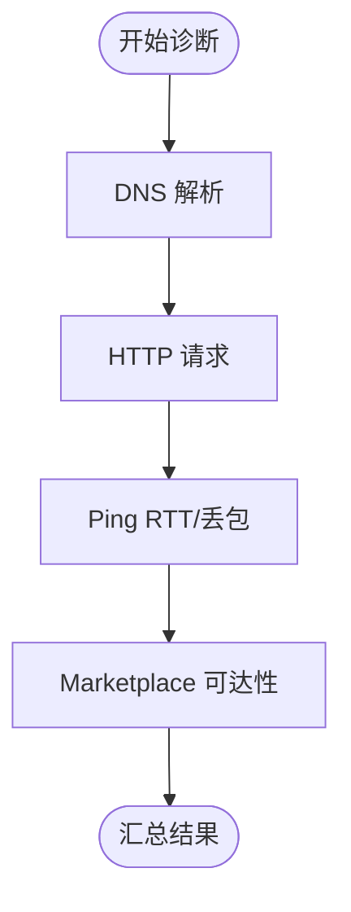
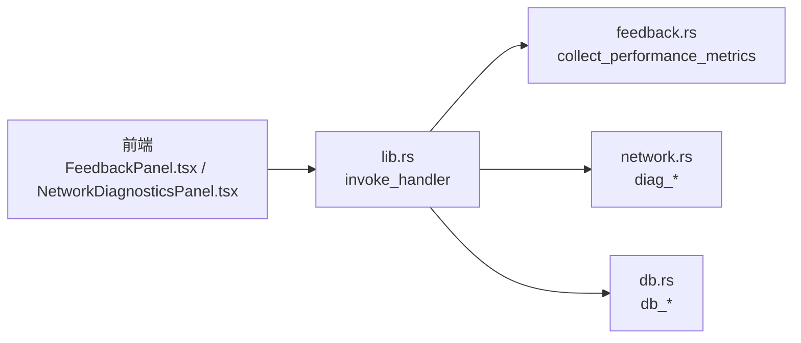

# 性能分析

<cite>
**本文引用的文件**
- [src-tauri/src/lib.rs](file://src-tauri/src/lib.rs)
- [src-tauri/src/feedback.rs](file://src-tauri/src/feedback.rs)
- [src-tauri/src/db.rs](file://src-tauri/src/db.rs)
- [src-tauri/src/network.rs](file://src-tauri/src/network.rs)
- [src-tauri/src/main.rs](file://src-tauri/src/main.rs)
- [src/components/settings/FeedbackPanel.tsx](file://src/components/settings/FeedbackPanel.tsx)
- [src/components/settings/NetworkDiagnosticsPanel.tsx](file://src/components/settings/NetworkDiagnosticsPanel.tsx)
- [src/hooks/useAgent.ts](file://src/hooks/useAgent.ts)
- [src/hooks/useAgentContext.tsx](file://src/hooks/useAgentContext.tsx)
- [src/components/settings/feedback/feedbackUtils.ts](file://src/components/settings/feedback/feedbackUtils.ts)
- [sidecar/src/agent.ts](file://sidecar/src/agent.ts)
- [src/i18n/locales/en.ts](file://src/i18n/locales/en.ts)
</cite>

## 目录
1. [简介](#简介)
2. [项目结构](#项目结构)
3. [核心组件](#核心组件)
4. [架构总览](#架构总览)
5. [详细组件分析](#详细组件分析)
6. [依赖关系分析](#依赖关系分析)
7. [性能考量](#性能考量)
8. [故障排查指南](#故障排查指南)
9. [结论](#结论)
10. [附录](#附录)

## 简介
本文件面向 RabbitCoding 的性能分析系统，提供从指标定义、数据采集、基准建立到 AI 代理响应时间分析、数据库查询性能监控、内存使用跟踪的全流程说明。同时涵盖性能瓶颈识别方法、优化建议、性能回归检测策略，以及性能测试工具使用、数据可视化与报告生成、自动化监控与告警、趋势分析等实践方案。

## 项目结构
RabbitCoding 采用 Tauri + React + TypeScript 技术栈，前端负责交互与可视化，Rust 后端负责系统信息采集、网络诊断、反馈提交与数据库持久化，Sidecar 进程承载 AI 代理会话与工具调用。性能相关能力主要分布在以下模块：
- 前端设置面板：性能指标收集开关、网络诊断界面
- Rust 后端命令：系统信息与性能指标采集、网络诊断、数据库访问
- Sidecar 进程：AI 代理生命周期与响应时间统计

图示来源
- [src-tauri/src/lib.rs:344-387](file://src-tauri/src/lib.rs#L344-L387)
- [src-tauri/src/main.rs:4-6](file://src-tauri/src/main.rs#L4-L6)
- [src-tauri/src/feedback.rs:195-235](file://src-tauri/src/feedback.rs#L195-L235)
- [src-tauri/src/network.rs:1-200](file://src-tauri/src/network.rs#L1-L200)
- [src-tauri/src/db.rs:1-417](file://src-tauri/src/db.rs#L1-L417)
- [sidecar/src/agent.ts:424-475](file://sidecar/src/agent.ts#L424-L475)

章节来源
- [src-tauri/src/lib.rs:197-391](file://src-tauri/src/lib.rs#L197-L391)
- [src-tauri/src/main.rs:4-6](file://src-tauri/src/main.rs#L4-L6)

## 核心组件
- 性能指标模型
  - 应用进程指标：应用内存（MB）、应用 CPU（%）、系统内存使用率（%）、系统 CPU 使用率（%）
  - WebView 指标：DOM 元素数量、JS Heap 使用/总量（MB）、导航完成时间（ms）
- 反馈与性能采集
  - 前端采集 WebView 指标并合并系统指标，提交至后端生成反馈载荷
- 网络诊断
  - DNS 解析、HTTP 请求、Ping、Marketplace 可达性与 RTT/丢包统计
- 数据库性能
  - SQLite 表结构、索引与事务批量写入，支撑会话与消息持久化
- AI 代理响应时间
  - Sidecar 侧记录查询开始时间与结束时间，计算单次查询耗时

章节来源
- [src-tauri/src/feedback.rs:58-110](file://src-tauri/src/feedback.rs#L58-L110)
- [src-tauri/src/feedback.rs:195-235](file://src-tauri/src/feedback.rs#L195-L235)
- [src/components/settings/feedback/feedbackUtils.ts:66-84](file://src/components/settings/feedback/feedbackUtils.ts#L66-L84)
- [src-tauri/src/network.rs:1-200](file://src-tauri/src/network.rs#L1-L200)
- [src-tauri/src/db.rs:85-138](file://src-tauri/src/db.rs#L85-L138)
- [sidecar/src/agent.ts:424-475](file://sidecar/src/agent.ts#L424-L475)

## 架构总览
RabbitCoding 的性能分析体系由“前端采集 + 后端聚合 + 进程间通信 + 数据存储”构成闭环。前端在反馈提交前自动采集 WebView 指标，后端补充系统指标并打包提交；网络诊断通过后端命令异步执行系统命令获取结果；数据库层提供会话与消息的持久化与查询能力；Sidecar 负责 AI 代理生命周期与响应时间统计。

图示来源
- [src/components/settings/FeedbackPanel.tsx:392-422](file://src/components/settings/FeedbackPanel.tsx#L392-L422)
- [src/components/settings/feedback/feedbackUtils.ts:66-84](file://src/components/settings/feedback/feedbackUtils.ts#L66-L84)
- [src-tauri/src/lib.rs:344-387](file://src-tauri/src/lib.rs#L344-L387)
- [src-tauri/src/feedback.rs:195-235](file://src-tauri/src/feedback.rs#L195-L235)

## 详细组件分析

### 性能指标定义与采集
- 指标定义
  - 应用进程：应用内存（MB）、应用 CPU（%）、系统内存使用率（%）、系统 CPU 使用率（%）
  - WebView：DOM 元素数量、JS Heap 使用（MB）、JS Heap 总量（MB）、导航完成时间（ms）
- 采集流程
  - 前端通过浏览器性能 API 采集 WebView 指标
  - 后端通过系统库采集应用与系统指标，合并为统一结构
- 数据结构
  - WebviewMetrics、PerformanceMetrics、FeedbackPayload

图示来源
- [src-tauri/src/feedback.rs:58-110](file://src-tauri/src/feedback.rs#L58-L110)

章节来源
- [src-tauri/src/feedback.rs:58-110](file://src-tauri/src/feedback.rs#L58-L110)
- [src-tauri/src/feedback.rs:195-235](file://src-tauri/src/feedback.rs#L195-L235)
- [src/components/settings/feedback/feedbackUtils.ts:66-84](file://src/components/settings/feedback/feedbackUtils.ts#L66-L84)
- [src/components/settings/FeedbackPanel.tsx:392-422](file://src/components/settings/FeedbackPanel.tsx#L392-L422)

### AI 代理响应时间分析
- 关键点
  - Sidecar 侧记录查询开始时间，最终 emit result/error 时附带 durationMs
  - 前端在收到 result 时更新会话状态，记录耗时与 token 使用
  - 若超过阈值无消息，触发看门狗超时，避免 UI 长时间挂起
- 时间线
  - 查询开始 → Sidecar 执行 → 流式消息 → result/error（含 durationMs）→ 前端更新 UI

图示来源
- [sidecar/src/agent.ts:424-475](file://sidecar/src/agent.ts#L424-L475)
- [src/hooks/useAgent.ts:66-101](file://src/hooks/useAgent.ts#L66-L101)
- [src/hooks/useAgentContext.tsx:131-192](file://src/hooks/useAgentContext.tsx#L131-L192)

章节来源
- [sidecar/src/agent.ts:424-475](file://sidecar/src/agent.ts#L424-L475)
- [src/hooks/useAgent.ts:66-101](file://src/hooks/useAgent.ts#L66-L101)
- [src/hooks/useAgentContext.tsx:131-192](file://src/hooks/useAgentContext.tsx#L131-L192)

### 数据库查询性能监控
- 表结构与索引
  - workspaces、rabbits、repos、messages 表，关键索引：rabbits.workspace_id、repos.workspace_id、messages.rabbit_id+seq
- 事务批量写入
  - save_all_inner 使用 BEGIN/COMMIT/ROLLBACK 包裹，减少 IO 开销
- 查询路径
  - 加载：按创建时间倒序查询工作区、会话、消息
  - 保存：清空四表后批量插入，保证一致性

图示来源
- [src-tauri/src/db.rs:85-138](file://src-tauri/src/db.rs#L85-L138)

章节来源
- [src-tauri/src/db.rs:140-161](file://src-tauri/src/db.rs#L140-L161)
- [src-tauri/src/db.rs:290-305](file://src-tauri/src/db.rs#L290-L305)
- [src-tauri/src/db.rs:392-416](file://src-tauri/src/db.rs#L392-L416)

### 内存使用情况跟踪
- WebView 内存
  - DOM 元素数量、JS Heap 使用/总量（MB）
- 应用与系统内存
  - 应用进程内存（MB）、系统内存使用率（%）
- 前端展示
  - 设置面板提供性能指标开关，勾选后自动采集并在提交反馈时附带

章节来源
- [src-tauri/src/feedback.rs:68-73](file://src-tauri/src/feedback.rs#L68-L73)
- [src-tauri/src/feedback.rs:77-83](file://src-tauri/src/feedback.rs#L77-L83)
- [src/components/settings/feedback/feedbackUtils.ts:66-84](file://src/components/settings/feedback/feedbackUtils.ts#L66-L84)
- [src/components/settings/FeedbackPanel.tsx:392-422](file://src/components/settings/FeedbackPanel.tsx#L392-L422)

### 网络诊断与 RTT 分析
- 诊断项
  - DNS 解析、HTTP 请求、Ping（丢包率、RTT）、Marketplace 可达性
- RTT 解析
  - Windows：最小/最大/平均 RTT
  - macOS/Linux：解析 round-trip 或 rtt 行
- 前端展示
  - 按目标分组显示 IP、丢包率、RTT 统计与状态

图示来源
- [src-tauri/src/network.rs:10-26](file://src-tauri/src/network.rs#L10-L26)
- [src-tauri/src/network.rs:704-774](file://src-tauri/src/network.rs#L704-L774)
- [src/components/settings/NetworkDiagnosticsPanel.tsx:218-252](file://src/components/settings/NetworkDiagnosticsPanel.tsx#L218-L252)

章节来源
- [src-tauri/src/network.rs:1-200](file://src-tauri/src/network.rs#L1-L200)
- [src-tauri/src/network.rs:704-774](file://src-tauri/src/network.rs#L704-L774)
- [src/components/settings/NetworkDiagnosticsPanel.tsx:218-252](file://src/components/settings/NetworkDiagnosticsPanel.tsx#L218-L252)

### 性能基准建立与回归检测
- 基准建立
  - 在稳定版本上采集“正常”性能基线：WebView 指标、应用/系统资源、网络 RTT、AI 代理耗时分布
- 回归检测
  - 对比新版本与基线的差异，关注：
    - WebView DOM 元素数异常增长
    - 应用/系统内存使用率上升
    - 网络 RTT 显著增加或丢包率升高
    - AI 代理平均耗时与 P95/P99 上升
- 建议流程
  - 定期采样（如每日构建后）对比基线
  - 对异常波动进行分层定位（前端/后端/网络/外部服务）

[本节为通用指导，无需列出章节来源]

## 依赖关系分析
- 前端对后端的命令依赖
  - 反馈与性能：collect_performance_metrics、submit_feedback
  - 网络诊断：diag_dns、diag_http、diag_ping、diag_marketplace
  - 数据库：db_load_all、db_save_all、db_has_data
- 进程间通信
  - 前端通过 Tauri invoke 调用后端命令
  - Sidecar 通过事件通道向前端推送消息与结果

图示来源
- [src-tauri/src/lib.rs:344-387](file://src-tauri/src/lib.rs#L344-L387)
- [src-tauri/src/feedback.rs:195-235](file://src-tauri/src/feedback.rs#L195-L235)
- [src-tauri/src/network.rs:1-200](file://src-tauri/src/network.rs#L1-L200)
- [src-tauri/src/db.rs:392-416](file://src-tauri/src/db.rs#L392-L416)

章节来源
- [src-tauri/src/lib.rs:344-387](file://src-tauri/src/lib.rs#L344-L387)

## 性能考量
- 采集频率与成本
  - WebView 指标采集轻量，可在提交反馈前一次性采集
  - 系统指标采集需避免过于频繁，建议按需触发或定时采样
- 数据传输与存储
  - 性能指标与截图上传需控制大小，必要时压缩
  - 数据库存储采用事务批量写入，降低锁竞争
- 前端渲染与内存
  - 控制消息列表长度，及时清理历史消息
  - 合理使用虚拟滚动与懒加载

[本节为通用指导，无需列出章节来源]

## 故障排查指南
- 性能指标为空
  - 检查前端是否成功采集 WebView 指标
  - 检查后端命令是否返回系统指标
- 网络诊断失败
  - 检查系统代理配置与网络连通性
  - 核对预设目标可达性
- AI 代理无响应
  - 观察 Sidecar 是否退出
  - 检查看门狗超时阈值与消息流是否中断
- 数据库异常
  - 检查事务是否回滚
  - 核对索引是否存在，查询是否命中索引

章节来源
- [src-tauri/src/feedback.rs:195-235](file://src-tauri/src/feedback.rs#L195-L235)
- [src-tauri/src/network.rs:100-200](file://src-tauri/src/network.rs#L100-L200)
- [src/hooks/useAgent.ts:265-296](file://src/hooks/useAgent.ts#L265-L296)
- [src-tauri/src/db.rs:290-305](file://src-tauri/src/db.rs#L290-L305)

## 结论
RabbitCoding 的性能分析体系通过前端采集、后端聚合与进程间通信，实现了对 WebView、应用/系统资源、网络与 AI 代理的多维观测。结合数据库的高效存储与事务写入，能够支撑性能基线建立、回归检测与趋势分析。建议在持续集成中引入自动化采样与告警，以保障产品性能的稳定性与可追踪性。

[本节为总结性内容，无需列出章节来源]

## 附录
- 性能测试工具
  - 网络诊断：内置 diag_dns/diag_http/diag_ping/diag_marketplace
  - 性能指标：前端采集 WebView 指标 + 后端采集系统指标
- 数据可视化与报告
  - 建议基于 d3 等图表库对指标进行折线图/柱状图展示
  - 报告模板包含：基线对比、异常告警、趋势分析、根因定位
- 自动化流程与告警
  - CI 中定期采样，阈值告警（内存、CPU、RTT、耗时）
  - 回归检测：对比基线分布（均值、方差、分位数）

[本节为通用指导，无需列出章节来源]