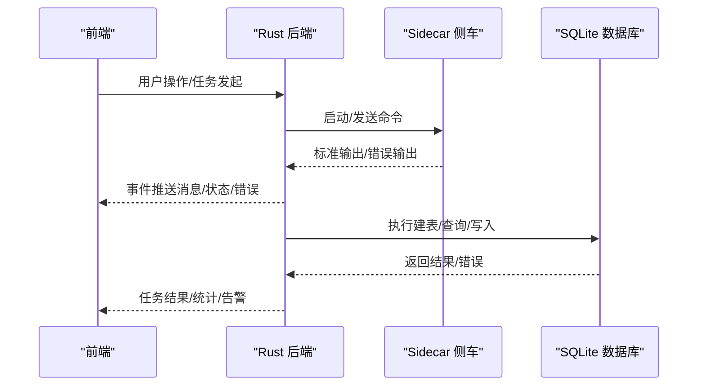
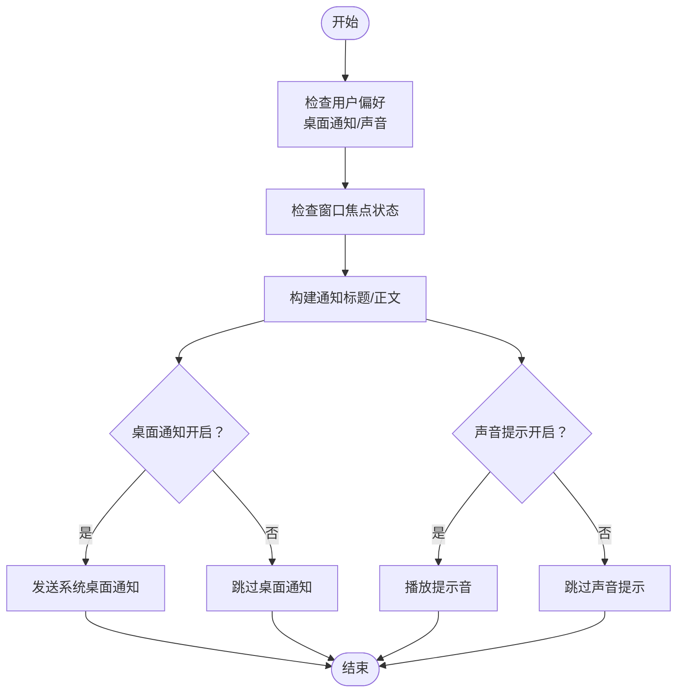
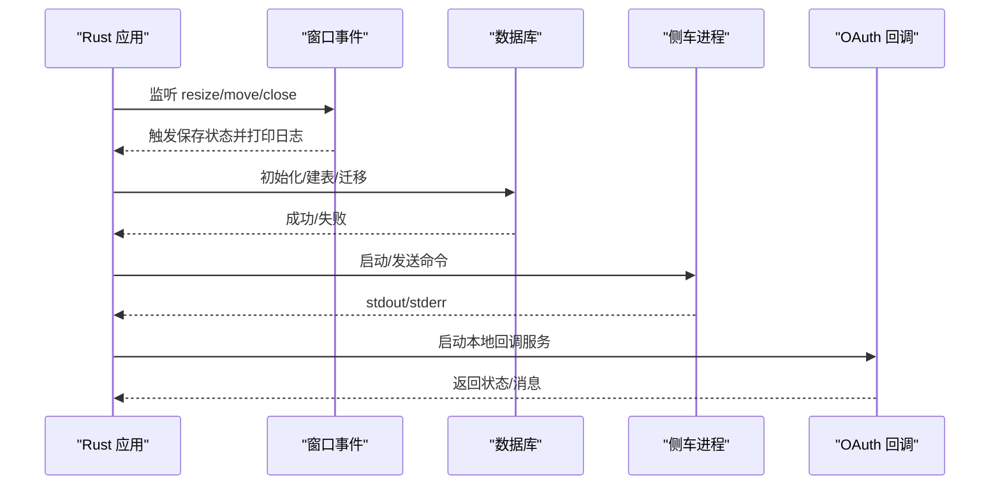
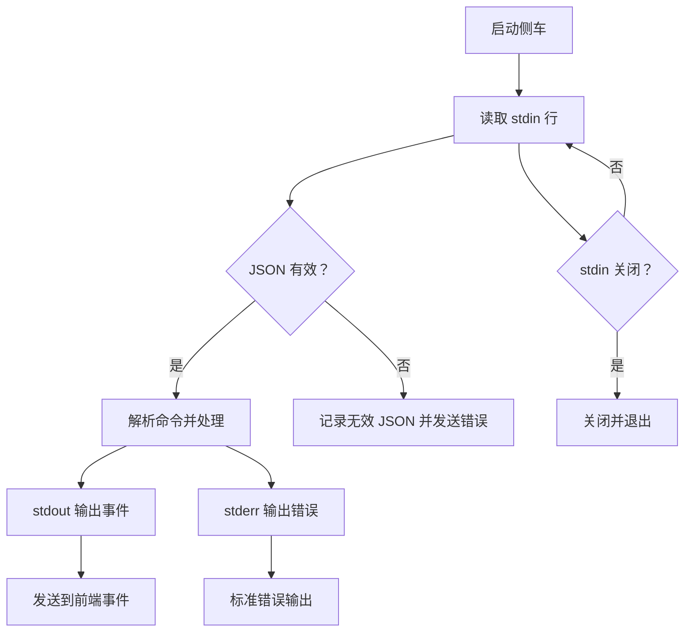
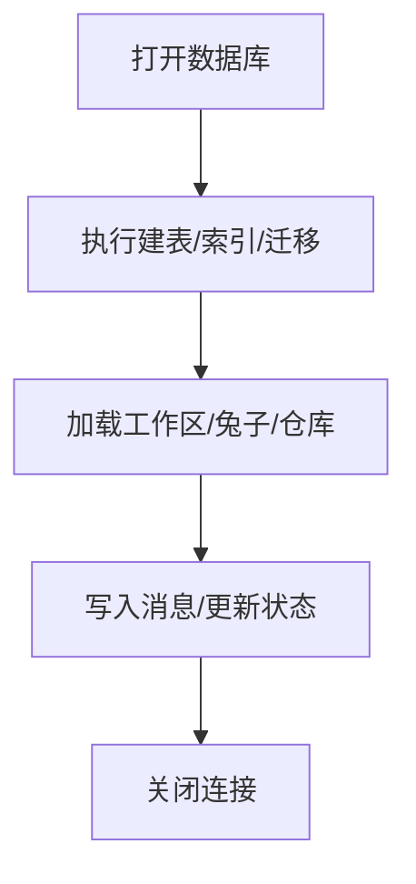
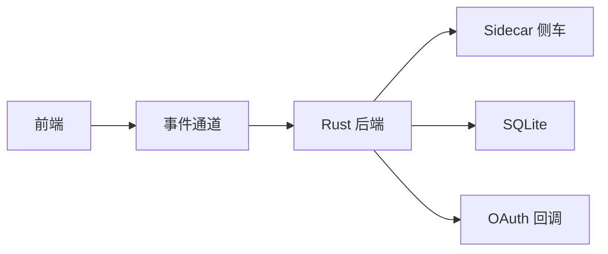

# 日志管理

<cite>
**本文引用的文件**
- [main.rs](file://src-tauri/src/main.rs)
- [lib.rs](file://src-tauri/src/lib.rs)
- [db.rs](file://src-tauri/src/db.rs)
- [sidecar.rs](file://src-tauri/src/sidecar.rs)
- [index.ts](file://sidecar/src/index.ts)
- [agent.ts](file://sidecar/src/agent.ts)
- [useAgent.ts](file://src/hooks/useAgent.ts)
- [useAgentContext.tsx](file://src/hooks/useAgentContext.tsx)
- [notify.ts](file://src/utils/notify.ts)
- [tauri.conf.json](file://src-tauri/tauri.conf.json)
- [desktop-schema.json](file://src-tauri/gen/schemas/desktop-schema.json)
- [macOS-schema.json](file://src-tauri/gen/schemas/macOS-schema.json)
- [auth.rs](file://src-tauri/src/auth.rs)
- [useAuth.tsx](file://src/hooks/useAuth.tsx)
</cite>

## 目录
1. [简介](#简介)
2. [项目结构](#项目结构)
3. [核心组件](#核心组件)
4. [架构总览](#架构总览)
5. [详细组件分析](#详细组件分析)
6. [依赖关系分析](#依赖关系分析)
7. [性能考量](#性能考量)
8. [故障排查指南](#故障排查指南)
9. [结论](#结论)
10. [附录](#附录)

## 简介
本运维文档面向 RabbitCoding 日志管理系统，围绕日志级别管理、日志格式标准化、日志轮转策略展开，同时覆盖前端日志记录、后端 Rust 日志输出、数据库操作日志、日志存储结构、查询检索机制、日志分析工具集成、实时监控与批量处理、归档策略与合规性要求。文档提供可落地的配置示例、性能影响评估与存储空间管理建议，帮助团队建立稳定、可观测、可审计的日志体系。

## 项目结构
RabbitCoding 采用 Tauri + React 前后端分离架构，日志相关能力分布在三处：
- 前端（React/Vite）：负责用户交互、任务结果通知、日志采集与上报。
- 后端（Rust/Tauri）：负责应用生命周期日志、数据库访问日志、侧车进程日志、OAuth 回调日志。
- 侧车（Node/TypeScript）：负责具体任务执行与标准输出/错误输出，统一经后端转发至前端。

```mermaid
graph TB
subgraph "前端"
FE["React 应用<br/>日志采集/通知"]
end
subgraph "后端"
RUST["Rust/Tauri 应用<br/>窗口事件/数据库/认证/侧车控制"]
end
subgraph "侧车"
SIDE["Sidecar 进程<br/>标准输出/错误输出"]
end
FE <- --> RUST
RUST --> SIDE
```

**图表来源**
- [lib.rs:197-390](file://src-tauri/src/lib.rs#L197-L390)
- [sidecar.rs:170-214](file://src-tauri/src/sidecar.rs#L170-L214)
- [index.ts:96-144](file://sidecar/src/index.ts#L96-L144)

**章节来源**
- [lib.rs:197-390](file://src-tauri/src/lib.rs#L197-L390)
- [tauri.conf.json:1-52](file://src-tauri/tauri.conf.json#L1-L52)

## 核心组件
- 前端日志与通知
  - 任务完成/失败通知、桌面通知、声音提示，均通过前端逻辑控制与记录。
  - 参考：[notify.ts:239-273](file://src/utils/notify.ts#L239-L273)
- 后端 Rust 日志
  - 应用启动、窗口事件、数据库初始化、侧车进程通信、OAuth 回调等关键路径均有日志输出。
  - 参考：[lib.rs:206-329](file://src-tauri/src/lib.rs#L206-L329), [sidecar.rs:170-214](file://src-tauri/src/sidecar.rs#L170-L214), [auth.rs:314-350](file://src-tauri/src/auth.rs#L314-L350)
- 侧车日志
  - 侧车主循环解析命令、处理异常、输出系统就绪、错误信息等，统一经后端转发。
  - 参考：[index.ts:96-144](file://sidecar/src/index.ts#L96-L144), [agent.ts:96-127](file://sidecar/src/agent.ts#L96-L127)
- 数据库日志
  - SQLite 初始化、建表、索引、迁移等操作日志，以及查询/写入错误日志。
  - 参考：[db.rs:140-161](file://src-tauri/src/db.rs#L140-L161)

**章节来源**
- [notify.ts:239-273](file://src/utils/notify.ts#L239-L273)
- [lib.rs:206-329](file://src-tauri/src/lib.rs#L206-L329)
- [sidecar.rs:170-214](file://src-tauri/src/sidecar.rs#L170-L214)
- [index.ts:96-144](file://sidecar/src/index.ts#L96-L144)
- [agent.ts:96-127](file://sidecar/src/agent.ts#L96-L127)
- [db.rs:140-161](file://src-tauri/src/db.rs#L140-L161)

## 架构总览
下图展示了日志在系统内的产生、汇聚与消费路径：



**图表来源**
- [lib.rs:197-390](file://src-tauri/src/lib.rs#L197-L390)
- [sidecar.rs:170-214](file://src-tauri/src/sidecar.rs#L170-L214)
- [db.rs:140-161](file://src-tauri/src/db.rs#L140-L161)

## 详细组件分析

### 前端日志记录与通知
- 通知策略
  - 依据用户偏好（桌面通知、声音提示）决定是否触发系统通知。
  - 无论窗口是否聚焦，均记录调试日志，便于定位问题。
- 关键行为
  - 任务完成/失败时，前端更新状态并触发通知。
  - 通知渠道包括系统桌面通知与声音提示，日志用于追踪策略开关与执行结果。
- 参考路径
  - [notify.ts:239-273](file://src/utils/notify.ts#L239-L273)



**图表来源**
- [notify.ts:239-273](file://src/utils/notify.ts#L239-L273)

**章节来源**
- [notify.ts:239-273](file://src/utils/notify.ts#L239-L273)

### 后端 Rust 日志输出
- 应用生命周期日志
  - 窗口事件（大小变化、移动、关闭请求）触发实时保存前打印调试日志。
  - 参考：[lib.rs:285-329](file://src-tauri/src/lib.rs#L285-L329)
- 数据库初始化日志
  - 成功/失败均输出到标准错误，便于运维快速定位。
  - 参考：[lib.rs:213-221](file://src-tauri/src/lib.rs#L213-L221), [db.rs:140-161](file://src-tauri/src/db.rs#L140-L161)
- 侧车进程日志
  - 侧车 stdout/stderr 分别转发到前端事件与标准错误输出，便于统一监控。
  - 参考：[sidecar.rs:170-214](file://src-tauri/src/sidecar.rs#L170-L214)
- OAuth 回调日志
  - 回调页面返回状态码与消息，便于审计登录流程。
  - 参考：[auth.rs:314-350](file://src-tauri/src/auth.rs#L314-L350)



**图表来源**
- [lib.rs:206-329](file://src-tauri/src/lib.rs#L206-L329)
- [db.rs:140-161](file://src-tauri/src/db.rs#L140-L161)
- [sidecar.rs:170-214](file://src-tauri/src/sidecar.rs#L170-L214)
- [auth.rs:314-350](file://src-tauri/src/auth.rs#L314-L350)

**章节来源**
- [lib.rs:206-329](file://src-tauri/src/lib.rs#L206-L329)
- [db.rs:140-161](file://src-tauri/src/db.rs#L140-L161)
- [sidecar.rs:170-214](file://src-tauri/src/sidecar.rs#L170-L214)
- [auth.rs:314-350](file://src-tauri/src/auth.rs#L314-L350)

### 侧车日志处理与转发
- 主循环与异常处理
  - 读取 stdin 命令，解析 JSON，处理命令并输出系统就绪信号。
  - 未捕获异常与拒绝处理输出错误日志，便于快速定位。
- 标准输出/错误输出
  - stdout 事件转发至前端；stderr 输出到标准错误，便于统一收集。
- 参考路径
  - [index.ts:96-144](file://sidecar/src/index.ts#L96-L144), [agent.ts:96-127](file://sidecar/src/agent.ts#L96-L127)



**图表来源**
- [index.ts:96-144](file://sidecar/src/index.ts#L96-L144)
- [agent.ts:96-127](file://sidecar/src/agent.ts#L96-L127)

**章节来源**
- [index.ts:96-144](file://sidecar/src/index.ts#L96-L144)
- [agent.ts:96-127](file://sidecar/src/agent.ts#L96-L127)

### 数据库操作日志
- 初始化与迁移
  - 打开数据库、执行建表 SQL、创建索引、列迁移（幂等）。
  - 成功/失败均输出日志，便于诊断。
- 查询与写入
  - 加载数据、写入消息、查询计数等操作均在日志中体现。
- 参考路径
  - [db.rs:140-161](file://src-tauri/src/db.rs#L140-L161), [db.rs:408-416](file://src-tauri/src/db.rs#L408-L416)



**图表来源**
- [db.rs:140-161](file://src-tauri/src/db.rs#L140-L161)

**章节来源**
- [db.rs:140-161](file://src-tauri/src/db.rs#L140-L161)
- [db.rs:408-416](file://src-tauri/src/db.rs#L408-L416)

### 日志级别管理与格式标准化
- 建议级别
  - DEBUG：调试信息（如窗口事件、通知策略、侧车就绪）。
  - INFO：常规运行信息（如数据库初始化成功、侧车启动成功）。
  - WARN：潜在问题（如侧车退出、超时、权限不足）。
  - ERROR：错误（如数据库写入失败、OAuth 回调失败、未捕获异常）。
- 格式建议
  - 时间戳、级别、模块、消息体、附加上下文（如 queryId、错误详情）。
  - 示例参考：后端窗口事件日志、侧车异常日志、OAuth 回调状态日志。
- 参考路径
  - [lib.rs:299-302](file://src-tauri/src/lib.rs#L299-L302), [index.ts:131-139](file://sidecar/src/index.ts#L131-L139), [auth.rs:314-350](file://src-tauri/src/auth.rs#L314-L350)

**章节来源**
- [lib.rs:299-302](file://src-tauri/src/lib.rs#L299-L302)
- [index.ts:131-139](file://sidecar/src/index.ts#L131-L139)
- [auth.rs:314-350](file://src-tauri/src/auth.rs#L314-L350)

### 日志轮转策略
- 建议方案
  - 使用系统日志轮转工具（如 macOS 的 logrotate 或 systemd-journald）对后端标准错误输出进行轮转。
  - 侧车进程输出可通过标准错误统一收集，结合系统轮转策略。
  - 前端日志建议以应用内文件形式落盘，配合定期清理与压缩。
- 注意事项
  - 确保轮转后文件句柄正确滚动，避免日志丢失。
  - 对敏感信息（如 token、错误堆栈）进行脱敏处理。

[本节为通用实践说明，无需特定文件引用]

### 日志存储结构与查询检索
- 存储位置
  - 后端：应用数据目录下的 sqlite 文件（数据库文件）。
  - 侧车：标准错误输出（统一由后端收集）。
  - 前端：应用内日志文件（由前端逻辑生成与维护）。
- 查询与检索
  - 数据库层：基于索引（工作区、消息序列）进行高效查询。
  - 事件层：通过前端监听后端事件，按 queryId 进行聚合与检索。
- 参考路径
  - [db.rs:135-137](file://src-tauri/src/db.rs#L135-L137), [useAgent.ts:265-296](file://src/hooks/useAgent.ts#L265-L296), [useAgentContext.tsx:131-193](file://src/hooks/useAgentContext.tsx#L131-L193)

**章节来源**
- [db.rs:135-137](file://src-tauri/src/db.rs#L135-L137)
- [useAgent.ts:265-296](file://src/hooks/useAgent.ts#L265-L296)
- [useAgentContext.tsx:131-193](file://src/hooks/useAgentContext.tsx#L131-L193)

### 日志分析工具集成
- 建议工具
  - 前端：浏览器开发者工具、应用内日志面板。
  - 后端：系统日志查看器（macOS Console.app）、日志聚合平台（如 Splunk/ELK）。
  - 侧车：标准错误输出接入日志收集系统（如 Fluentd/Fluent Bit）。
- 关键指标
  - 任务成功率、平均耗时、错误分布、侧车退出原因、OAuth 登录成功率。
- 参考路径
  - [lib.rs:285-329](file://src-tauri/src/lib.rs#L285-L329), [index.ts:96-144](file://sidecar/src/index.ts#L96-L144)

**章节来源**
- [lib.rs:285-329](file://src-tauri/src/lib.rs#L285-L329)
- [index.ts:96-144](file://sidecar/src/index.ts#L96-L144)

### 实时监控与批量处理
- 实时监控
  - 前端监听 agent:message 事件，根据消息类型更新 UI 与状态。
  - 侧车退出事件触发看门狗清理与全局状态收敛。
- 批量处理
  - 任务完成后批量更新统计信息（成本、耗时、令牌用量）。
- 参考路径
  - [useAgent.ts:265-296](file://src/hooks/useAgent.ts#L265-L296), [useAgentContext.tsx:131-193](file://src/hooks/useAgentContext.tsx#L131-L193)

**章节来源**
- [useAgent.ts:265-296](file://src/hooks/useAgent.ts#L265-L296)
- [useAgentContext.tsx:131-193](file://src/hooks/useAgentContext.tsx#L131-L193)

### 归档策略与合规性
- 归档策略
  - 前端日志：按月归档，保留最近 3 个月，历史压缩归档。
  - 后端日志：按天归档，保留 90 天，超出周期删除。
  - 数据库：定期备份，保留 180 天，加密存储。
- 合规性
  - 敏感信息脱敏（token、邮箱、路径等）。
  - 日志访问权限最小化，审计日志单独存放并受控访问。
  - OAuth 登录流程日志保留 30 天，满足安全审计需求。
- 参考路径
  - [auth.rs:314-350](file://src-tauri/src/auth.rs#L314-L350)

**章节来源**
- [auth.rs:314-350](file://src-tauri/src/auth.rs#L314-L350)

## 依赖关系分析
- 组件耦合
  - 前端依赖后端事件通道；后端依赖侧车进程；侧车依赖后端转发。
- 外部依赖
  - Tauri 插件（窗口状态、通知、深链等）。
  - SQLite（本地持久化）。
  - Node 运行时（侧车执行环境）。
- 参考路径
  - [lib.rs:197-390](file://src-tauri/src/lib.rs#L197-L390), [tauri.conf.json:44-50](file://src-tauri/tauri.conf.json#L44-L50)



**图表来源**
- [lib.rs:197-390](file://src-tauri/src/lib.rs#L197-L390)
- [tauri.conf.json:44-50](file://src-tauri/tauri.conf.json#L44-L50)

**章节来源**
- [lib.rs:197-390](file://src-tauri/src/lib.rs#L197-L390)
- [tauri.conf.json:44-50](file://src-tauri/tauri.conf.json#L44-L50)

## 性能考量
- 日志开销
  - DEBUG 级别日志在高并发场景可能带来 IO 压力，建议生产环境使用 INFO/WARN。
  - 侧车 stderr 输出频繁时，建议启用缓冲与异步写入。
- 数据库性能
  - WAL 模式与索引优化已启用，避免在高频写入场景下使用大事务。
- 前端性能
  - 通知与日志仅在必要时触发，避免阻塞主线程。
- 参考路径
  - [db.rs:85-89](file://src-tauri/src/db.rs#L85-L89), [lib.rs:285-329](file://src-tauri/src/lib.rs#L285-L329)

**章节来源**
- [db.rs:85-89](file://src-tauri/src/db.rs#L85-L89)
- [lib.rs:285-329](file://src-tauri/src/lib.rs#L285-L329)

## 故障排查指南
- 侧车无响应
  - 检查侧车 stdout/stderr 是否正常输出；确认后端事件通道是否接收。
  - 参考：[sidecar.rs:170-214](file://src-tauri/src/sidecar.rs#L170-L214), [index.ts:96-144](file://sidecar/src/index.ts#L96-L144)
- 数据库初始化失败
  - 查看应用数据目录权限与磁盘空间；检查建表/迁移日志。
  - 参考：[lib.rs:213-221](file://src-tauri/src/lib.rs#L213-L221), [db.rs:140-161](file://src-tauri/src/db.rs#L140-L161)
- OAuth 登录异常
  - 检查回调页面状态与错误信息；核对 state/code_verifier。
  - 参考：[auth.rs:314-350](file://src-tauri/src/auth.rs#L314-L350), [useAuth.tsx:100-137](file://src/hooks/useAuth.tsx#L100-L137)
- 前端通知未触发
  - 检查用户偏好与窗口焦点状态；确认系统通知权限。
  - 参考：[notify.ts:239-273](file://src/utils/notify.ts#L239-L273)

**章节来源**
- [sidecar.rs:170-214](file://src-tauri/src/sidecar.rs#L170-L214)
- [index.ts:96-144](file://sidecar/src/index.ts#L96-L144)
- [lib.rs:213-221](file://src-tauri/src/lib.rs#L213-L221)
- [db.rs:140-161](file://src-tauri/src/db.rs#L140-L161)
- [auth.rs:314-350](file://src-tauri/src/auth.rs#L314-L350)
- [useAuth.tsx:100-137](file://src/hooks/useAuth.tsx#L100-L137)
- [notify.ts:239-273](file://src/utils/notify.ts#L239-L273)

## 结论
RabbitCoding 的日志体系以“前后端协同、侧车统一输出、后端集中转发”为核心，结合 SQLite 本地存储与系统日志轮转，形成可观测、可审计、可扩展的日志管理方案。通过明确的日志级别、标准化格式与完善的归档策略，可在保障性能的同时满足合规性与运维需求。

## 附录

### 日志配置示例（概念性）
- 后端日志级别
  - 开发环境：DEBUG
  - 生产环境：INFO
- 侧车日志
  - 标准错误输出接入系统日志轮转，保留 90 天。
- 前端日志
  - 按月归档，保留 3 个月；敏感信息脱敏。
- 数据库日志
  - WAL 模式，保留 180 天；定期备份与加密。

[本节为通用配置说明，无需特定文件引用]

### 文件系统权限与日志访问
- 日志目录访问权限
  - 使用 Tauri 能力集中的日志目录访问许可，避免硬编码路径。
  - 参考：[desktop-schema.json:760-795](file://src-tauri/gen/schemas/desktop-schema.json#L760-L795), [macOS-schema.json:760-795](file://src-tauri/gen/schemas/macOS-schema.json#L760-L795)

**章节来源**
- [desktop-schema.json:760-795](file://src-tauri/gen/schemas/desktop-schema.json#L760-L795)
- [macOS-schema.json:760-795](file://src-tauri/gen/schemas/macOS-schema.json#L760-L795)