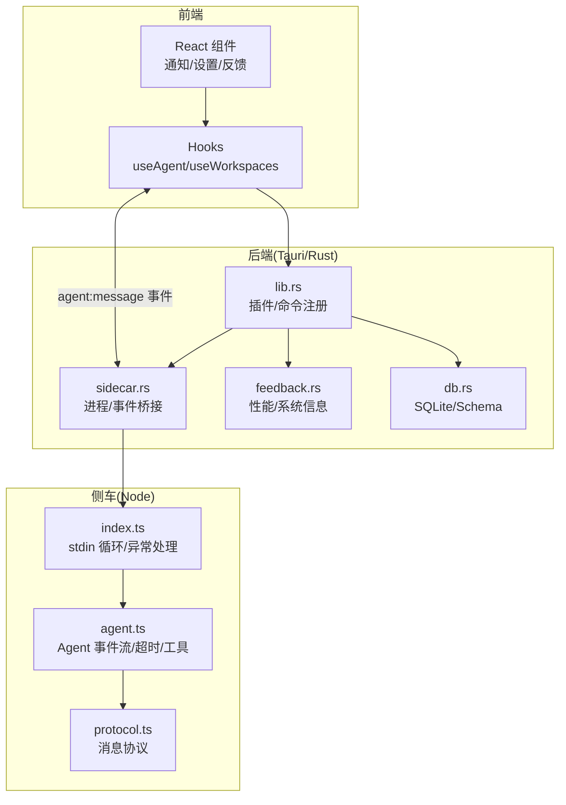
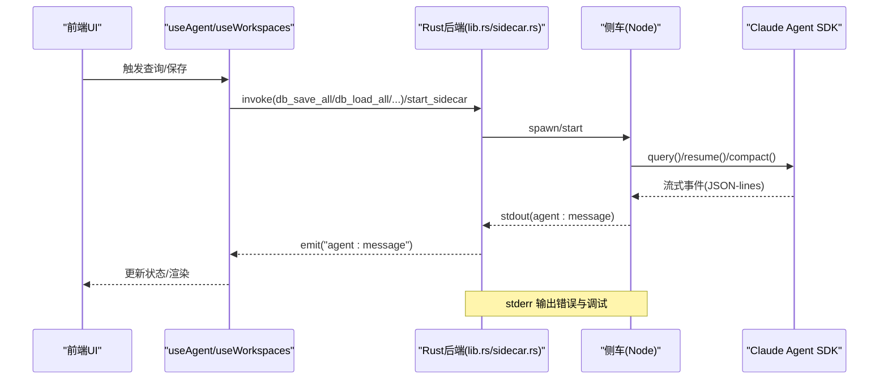
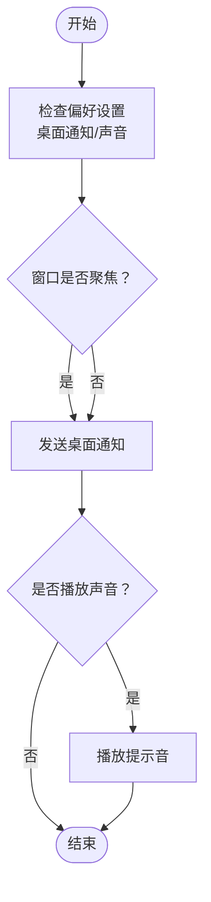
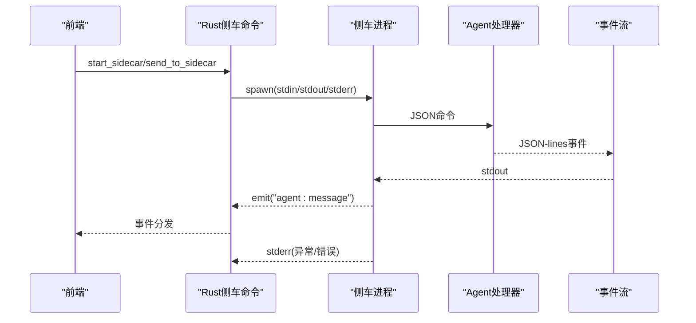
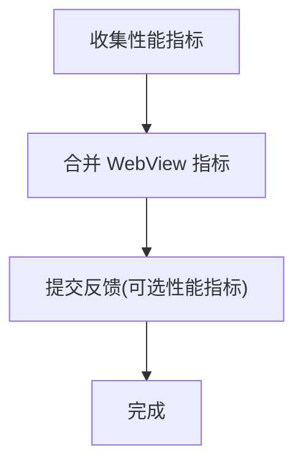
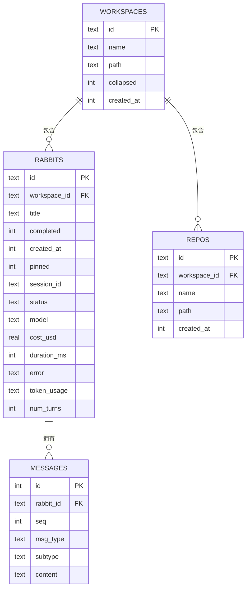
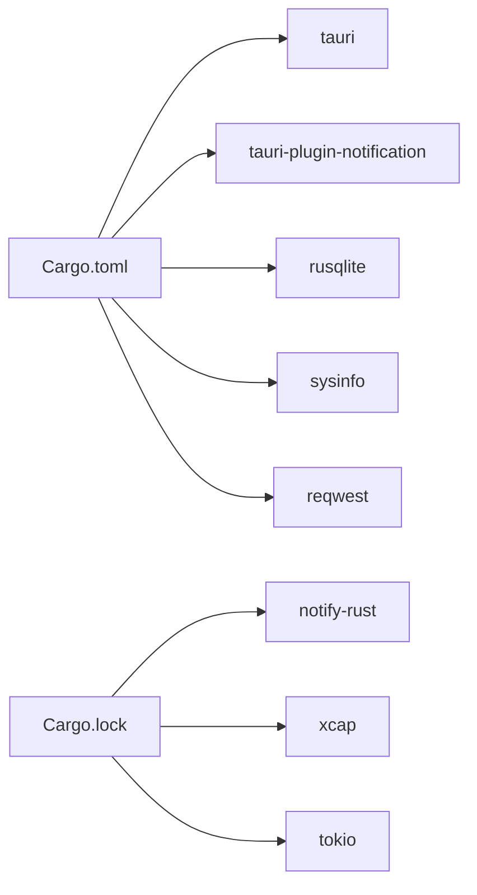

# 监控和日志

<cite>
**本文引用的文件**
- [src-tauri/src/lib.rs](file://src-tauri/src/lib.rs)
- [src-tauri/src/sidecar.rs](file://src-tauri/src/sidecar.rs)
- [src-tauri/src/feedback.rs](file://src-tauri/src/feedback.rs)
- [src-tauri/src/db.rs](file://src-tauri/src/db.rs)
- [src-tauri/src/main.rs](file://src-tauri/src/main.rs)
- [src-tauri/Cargo.toml](file://src-tauri/Cargo.toml)
- [src-tauri/Cargo.lock](file://src-tauri/Cargo.lock)
- [src-tauri/gen/schemas/desktop-schema.json](file://src-tauri/gen/schemas/desktop-schema.json)
- [src-tauri/gen/schemas/macOS-schema.json](file://src-tauri/gen/schemas/macOS-schema.json)
- [sidecar/src/index.ts](file://sidecar/src/index.ts)
- [sidecar/src/agent.ts](file://sidecar/src/agent.ts)
- [sidecar/src/protocol.ts](file://sidecar/src/protocol.ts)
- [src/hooks/useAgent.ts](file://src/hooks/useAgent.ts)
- [src/hooks/useAgentContext.tsx](file://src/hooks/useAgentContext.tsx)
- [src/utils/notify.ts](file://src/utils/notify.ts)
- [src/components/settings/FeedbackPanel.tsx](file://src/components/settings/FeedbackPanel.tsx)
- [src/hooks/useWorkspaces.ts](file://src/hooks/useWorkspaces.ts)
</cite>

## 目录
1. [简介](#简介)
2. [项目结构](#项目结构)
3. [核心组件](#核心组件)
4. [架构总览](#架构总览)
5. [详细组件分析](#详细组件分析)
6. [依赖关系分析](#依赖关系分析)
7. [性能考量](#性能考量)
8. [故障排查指南](#故障排查指南)
9. [结论](#结论)
10. [附录](#附录)

## 简介
本文件面向 RabbitCoding 的运维与开发团队，系统化梳理应用的监控与日志体系，涵盖以下方面：
- 应用监控：进程状态、侧车（sidecar）生命周期、Agent 查询状态与耗时、内存与 CPU 指标采集
- 错误追踪：前端与后端异常捕获、未处理异常与拒绝、Agent 查询超时看门狗、错误消息透传
- 日志管理：日志目录权限与访问控制、stderr 输出、通知通道与降级策略
- 性能指标：应用与系统资源、WebView 指标、Token 使用统计、查询耗时与回合数
- 用户行为追踪：工作区与会话持久化、消息序列化、任务完成/失败通知
- 告警与诊断：通知设置入口、网络诊断命令、反馈面板与性能指标采集
- 存储与查询：SQLite 数据库 Schema、事务性保存、索引与迁移策略

## 项目结构
RabbitCoding 的监控与日志涉及三层：
- 前端（React + Tauri）：负责 UI、通知、用户交互、调用后端命令与监听事件
- 后端（Rust + Tauri）：提供命令接口、进程管理、日志输出、通知桥接、数据库持久化
- 侧车（Node.js）：与 Claude Agent SDK 交互，流式事件转发，错误与超时处理

图示来源
- [src-tauri/src/lib.rs:124-316](file://src-tauri/src/lib.rs#L124-L316)
- [src-tauri/src/sidecar.rs:59-214](file://src-tauri/src/sidecar.rs#L59-L214)
- [sidecar/src/index.ts:96-144](file://sidecar/src/index.ts#L96-L144)
- [sidecar/src/agent.ts:241-465](file://sidecar/src/agent.ts#L241-L465)
- [sidecar/src/protocol.ts:13-78](file://sidecar/src/protocol.ts#L13-L78)

章节来源
- [src-tauri/src/lib.rs:124-316](file://src-tauri/src/lib.rs#L124-L316)
- [src-tauri/src/sidecar.rs:59-214](file://src-tauri/src/sidecar.rs#L59-L214)
- [sidecar/src/index.ts:96-144](file://sidecar/src/index.ts#L96-L144)
- [sidecar/src/agent.ts:241-465](file://sidecar/src/agent.ts#L241-L465)
- [sidecar/src/protocol.ts:13-78](file://sidecar/src/protocol.ts#L13-L78)

## 核心组件
- 通知与日志
  - 前端通知：支持桌面通知与声音提示，具备偏好开关与窗口聚焦检测
  - 后端通知：跨平台发送桌面通知，绕过 Tauri 插件签名限制
  - 日志：stderr 输出侧车错误与异常，Rust 侧窗口事件调试日志
- 侧车与 Agent
  - 侧车进程管理：启动/停止/状态查询，标准流读取与事件转发
  - Agent 事件流：system/init、assistant/text/thinking、tool_use/tool_result、result/error、compaction/status
  - 超时看门狗：单次查询超时与“思考态”放宽阈值，防止静默卡死
- 性能与反馈
  - 性能指标：应用内存/CPU、系统内存/CPU、WebView 指标
  - 反馈提交：截图、系统信息、配置快照、可选性能指标
- 数据持久化
  - SQLite Schema：workspaces/rabbits/repos/messages，事务性保存与索引
  - 自动迁移：首次启动从 localStorage 迁移到 SQLite

章节来源
- [src/utils/notify.ts:80-273](file://src/utils/notify.ts#L80-L273)
- [src-tauri/src/lib.rs:43-114](file://src-tauri/src/lib.rs#L43-L114)
- [src-tauri/src/sidecar.rs:59-214](file://src-tauri/src/sidecar.rs#L59-L214)
- [sidecar/src/index.ts:96-144](file://sidecar/src/index.ts#L96-L144)
- [sidecar/src/agent.ts:241-465](file://sidecar/src/agent.ts#L241-L465)
- [src-tauri/src/feedback.rs:58-235](file://src-tauri/src/feedback.rs#L58-L235)
- [src-tauri/src/db.rs:85-138](file://src-tauri/src/db.rs#L85-L138)
- [src/hooks/useWorkspaces.ts:45-129](file://src/hooks/useWorkspaces.ts#L45-L129)

## 架构总览
RabbitCoding 的监控与日志围绕“命令-事件-流”的闭环设计：
- 前端通过 Tauri 命令调用后端能力（启动侧车、读取系统信息、发送通知、数据库操作）
- 后端启动/管理侧车进程，将侧车 stdout 的 JSON-lines 事件转换为 Tauri 事件，推送至前端
- 侧车内部与 Claude Agent SDK 交互，产生丰富的流式事件，统一通过 stdout 输出
- 错误与异常在多层被捕获：前端 console、后端 stderr、侧车异常处理器
- 性能指标与反馈通过命令采集并上传，日志与通知作为可观测性的基础支撑

图示来源
- [src-tauri/src/lib.rs:124-316](file://src-tauri/src/lib.rs#L124-L316)
- [src-tauri/src/sidecar.rs:59-214](file://src-tauri/src/sidecar.rs#L59-L214)
- [sidecar/src/index.ts:96-144](file://sidecar/src/index.ts#L96-L144)
- [sidecar/src/agent.ts:241-465](file://sidecar/src/agent.ts#L241-L465)

## 详细组件分析

### 通知与日志
- 前端通知
  - 支持测试通知、任务完成/失败通知，受偏好设置控制（桌面通知/声音）
  - 窗口聚焦不影响通知发送，便于用户及时感知
- 后端通知
  - macOS 使用 osascript，Windows 使用 PowerShell 或系统通知
  - 可打开系统通知设置页面，绕过 Tauri ACL 限制
- 日志
  - 侧车 stderr 输出错误、未捕获异常、未处理拒绝、无效 JSON 等
  - Rust 侧窗口事件调试日志（尺寸/位置/关闭请求）

图示来源
- [src/utils/notify.ts:227-273](file://src/utils/notify.ts#L227-L273)

章节来源
- [src/utils/notify.ts:80-273](file://src/utils/notify.ts#L80-L273)
- [src-tauri/src/lib.rs:43-114](file://src-tauri/src/lib.rs#L43-L114)
- [sidecar/src/index.ts:130-144](file://sidecar/src/index.ts#L130-L144)
- [src-tauri/src/lib.rs:213-257](file://src-tauri/src/lib.rs#L213-L257)

### 侧车与 Agent 事件流
- 侧车进程管理
  - 启动时清理关键环境变量，重定向 Claude 配置根目录，注入 API Key/Base URL/自定义环境变量
  - stdout 事件转发为 Tauri 事件，stderr 输出日志
- Agent 事件流
  - system/init、assistant/text/thinking、tool_use/tool_result、result/error、compaction/status/result、usage_update、ask_user_question、spec_written
  - 超时看门狗：普通查询 10 分钟，思考态 30 分钟，避免静默卡死
- 错误处理
  - 未捕获异常与未处理拒绝统一上报为 error 消息
  - 无效 JSON 会被记录并发送错误

图示来源
- [src-tauri/src/sidecar.rs:59-214](file://src-tauri/src/sidecar.rs#L59-L214)
- [sidecar/src/index.ts:96-144](file://sidecar/src/index.ts#L96-L144)
- [sidecar/src/agent.ts:241-465](file://sidecar/src/agent.ts#L241-L465)
- [sidecar/src/protocol.ts:90-107](file://sidecar/src/protocol.ts#L90-L107)

章节来源
- [src-tauri/src/sidecar.rs:59-214](file://src-tauri/src/sidecar.rs#L59-L214)
- [sidecar/src/index.ts:96-144](file://sidecar/src/index.ts#L96-L144)
- [sidecar/src/agent.ts:241-465](file://sidecar/src/agent.ts#L241-L465)
- [sidecar/src/protocol.ts:90-107](file://sidecar/src/protocol.ts#L90-L107)
- [src/hooks/useAgent.ts:46-73](file://src/hooks/useAgent.ts#L46-L73)

### 性能指标与反馈
- 性能指标采集
  - 应用进程：内存 MB、CPU 百分比
  - 系统进程：总内存/使用内存占比、CPU 百分比
  - WebView 指标：DOM 元素数量、JS Heap 使用/总量、DOM 完成时间
- 反馈提交
  - 截图、步骤说明、期望结果、发生时间、邮箱
  - 系统信息（OS/版本/架构/应用版本/标识/CPU/核心数/总内存）
  - 配置快照（模型列表/MCP 服务器/代理状态）
  - 可选性能指标（开启后在设置面板展示）

图示来源
- [src-tauri/src/feedback.rs:196-235](file://src-tauri/src/feedback.rs#L196-L235)
- [src/components/settings/FeedbackPanel.tsx:392-422](file://src/components/settings/FeedbackPanel.tsx#L392-L422)

章节来源
- [src-tauri/src/feedback.rs:58-235](file://src-tauri/src/feedback.rs#L58-L235)
- [src/components/settings/FeedbackPanel.tsx:392-422](file://src/components/settings/FeedbackPanel.tsx#L392-L422)

### 数据持久化与迁移
- Schema 设计
  - workspaces、rabbits、repos、messages 四表，rabbits/repos 外键关联 workspaces，messages 外键关联 rabbits
  - 索引：rabbits/workspace、repos/workspace、messages/rabbit+seq
- 事务性保存
  - 全量替换前开启事务，失败回滚，提升一致性
- 自动迁移
  - 首次启动检测数据库是否有数据，无数据则尝试从 localStorage 迁移
  - 双层防抖保存：500ms 防抖 + 3s 周期强制保存，DB 不可用时回退 localStorage

图示来源
- [src-tauri/src/db.rs:85-138](file://src-tauri/src/db.rs#L85-L138)

章节来源
- [src-tauri/src/db.rs:85-138](file://src-tauri/src/db.rs#L85-L138)
- [src-tauri/src/db.rs:290-386](file://src-tauri/src/db.rs#L290-L386)
- [src/hooks/useWorkspaces.ts:45-129](file://src/hooks/useWorkspaces.ts#L45-L129)

## 依赖关系分析
- Rust 依赖
  - tauri、tauri-plugin-notification、rusqlite、sysinfo、reqwest、tauri-plugin-fs 等
- 侧车依赖
  - @anthropic-ai/claude-agent-sdk、zod、node:fs/promises、path/url 等
- 权限与沙箱
  - 桌面端 schema 定义了对 $LOG 文件夹的读写/元数据访问权限，便于日志读取与分析

图示来源
- [src-tauri/Cargo.toml:20-39](file://src-tauri/Cargo.toml#L20-L39)
- [src-tauri/Cargo.lock:2698-2710](file://src-tauri/Cargo.lock#L2698-L2710)

章节来源
- [src-tauri/Cargo.toml:20-39](file://src-tauri/Cargo.toml#L20-L39)
- [src-tauri/Cargo.lock:2698-2710](file://src-tauri/Cargo.lock#L2698-L2710)
- [src-tauri/gen/schemas/desktop-schema.json:780-5154](file://src-tauri/gen/schemas/desktop-schema.json#L780-L5154)
- [src-tauri/gen/schemas/macOS-schema.json:780-5154](file://src-tauri/gen/schemas/macOS-schema.json#L780-L5154)

## 性能考量
- 侧车超时策略
  - 普通查询 10 分钟，思考态 30 分钟，避免长时间静默导致资源占用
- 性能指标采集
  - 应用与系统指标通过 sysinfo 获取，WebView 指标由前端传入，合并后上报
- 数据库写入
  - 事务性批量写入，减少磁盘碎片与锁竞争；索引加速查询
- 通知与日志
  - 通知仅做轻量 I/O，日志通过 stderr 输出，避免阻塞主线程

章节来源
- [src/hooks/useAgent.ts:66-73](file://src/hooks/useAgent.ts#L66-L73)
- [src-tauri/src/feedback.rs:196-235](file://src-tauri/src/feedback.rs#L196-L235)
- [src-tauri/src/db.rs:290-386](file://src-tauri/src/db.rs#L290-L386)

## 故障排查指南
- 通知无法显示
  - 检查系统通知设置，可通过命令打开系统设置页面
  - 前端测试通知：验证桌面通知与声音是否生效
- 侧车异常/崩溃
  - 查看 stderr 输出（Rust 侧会打印 sidecar 日志）
  - 未捕获异常/未处理拒绝会转化为 error 消息
  - 无效 JSON 会被记录并上报
- Agent 查询卡住
  - 观察看门狗超时：普通 10 分钟，思考态 30 分钟
  - 检查 AskUserQuestion 请求是否超时（5 分钟）
- 数据库不可用
  - 自动降级到 localStorage，检查存储空间与权限
  - 首次启动尝试从 localStorage 迁移

章节来源
- [src-tauri/src/lib.rs:43-114](file://src-tauri/src/lib.rs#L43-L114)
- [src/utils/notify.ts:203-219](file://src/utils/notify.ts#L203-L219)
- [sidecar/src/index.ts:130-144](file://sidecar/src/index.ts#L130-L144)
- [src/hooks/useAgent.ts:66-73](file://src/hooks/useAgent.ts#L66-L73)
- [src/hooks/useWorkspaces.ts:76-92](file://src/hooks/useWorkspaces.ts#L76-L92)

## 结论
RabbitCoding 的监控与日志体系以“命令-事件-流”为核心，结合 Rust 后端的进程管理、侧车的事件桥接、前端的通知与反馈，形成了可观测、可诊断、可恢复的闭环。通过性能指标采集、错误消息透传、日志与通知的协同，能够有效支撑日常运维与问题定位。

## 附录

### 监控与日志配置要点
- 日志目录权限
  - 桌面端 schema 提供对 $LOG 的读写/元数据访问权限，便于日志读取与分析
- 通知设置
  - 通过命令打开系统通知设置页面，绕过 Tauri ACL 限制
- 性能指标采集
  - 前端收集 WebView 指标，后端采集应用与系统指标，合并后上报
- 数据持久化
  - 事务性保存，索引优化，首次启动自动迁移

章节来源
- [src-tauri/gen/schemas/desktop-schema.json:780-5154](file://src-tauri/gen/schemas/desktop-schema.json#L780-L5154)
- [src-tauri/gen/schemas/macOS-schema.json:780-5154](file://src-tauri/gen/schemas/macOS-schema.json#L780-L5154)
- [src-tauri/src/lib.rs:43-114](file://src-tauri/src/lib.rs#L43-L114)
- [src-tauri/src/feedback.rs:196-235](file://src-tauri/src/feedback.rs#L196-L235)
- [src-tauri/src/db.rs:85-138](file://src-tauri/src/db.rs#L85-L138)