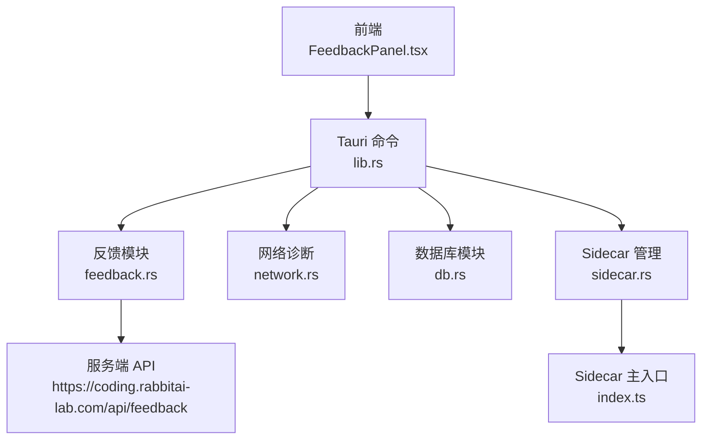
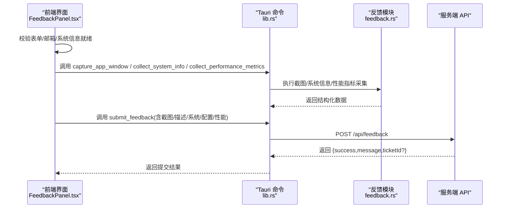
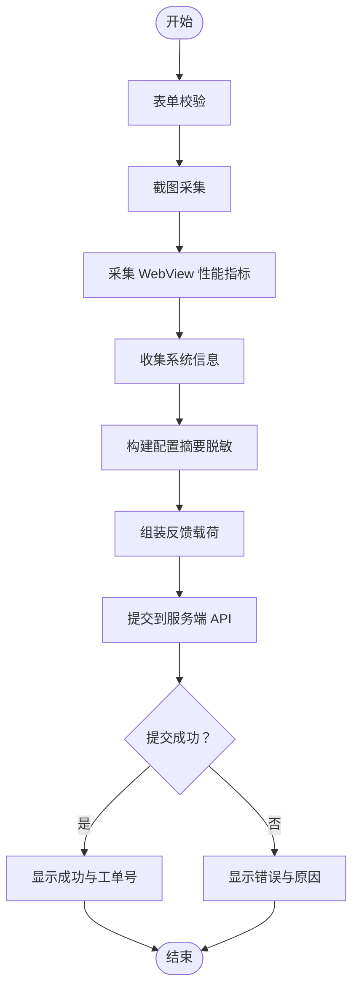
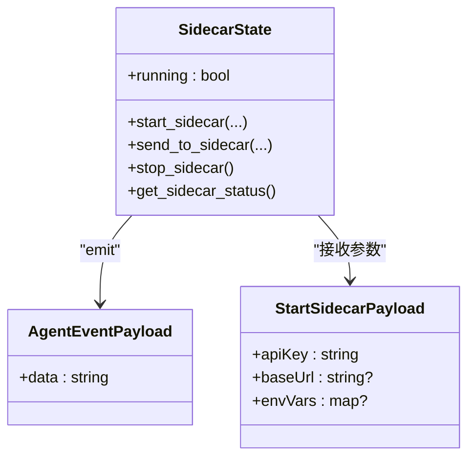
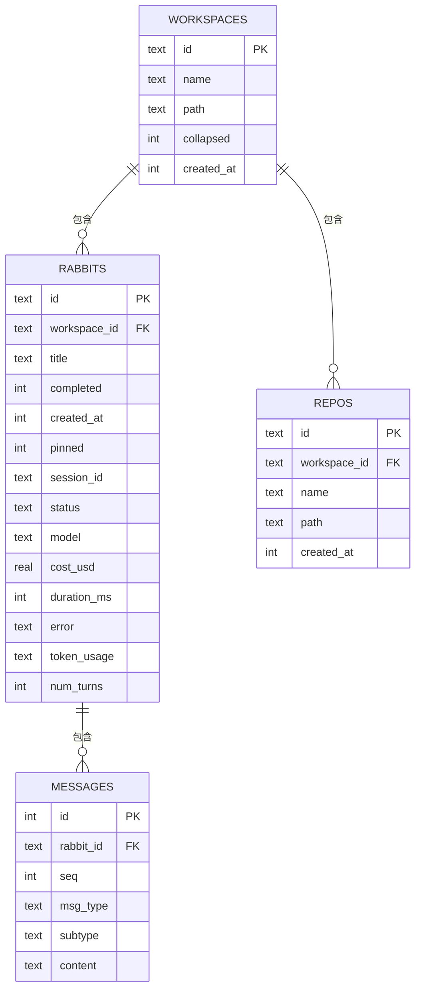
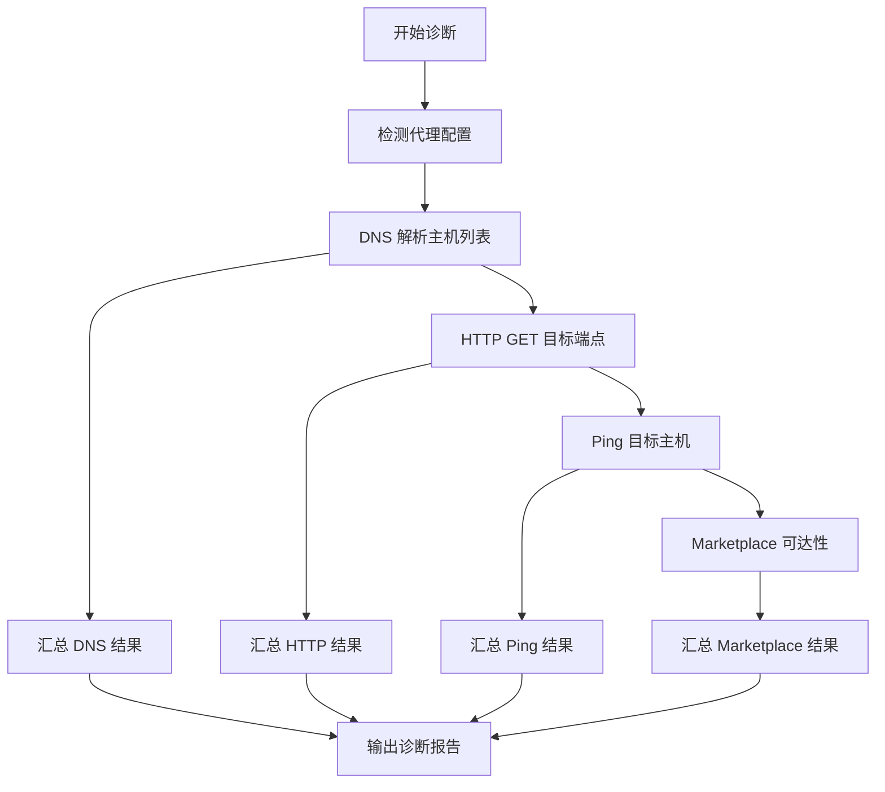
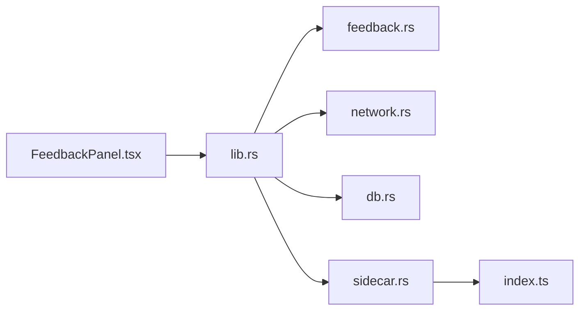

# 错误追踪

<cite>
**本文引用的文件**
- [lib.rs](file://src-tauri/src/lib.rs)
- [feedback.rs](file://src-tauri/src/feedback.rs)
- [db.rs](file://src-tauri/src/db.rs)
- [network.rs](file://src-tauri/src/network.rs)
- [sidecar.rs](file://src-tauri/src/sidecar.rs)
- [main.rs](file://src-tauri/src/main.rs)
- [FeedbackPanel.tsx](file://src/components/settings/FeedbackPanel.tsx)
- [feedbackUtils.ts](file://src/components/settings/feedback/feedbackUtils.ts)
- [index.ts](file://sidecar/src/index.ts)
- [model_test.rs](file://src-tauri/src/model_test.rs)
</cite>

## 目录
1. [简介](#简介)
2. [项目结构](#项目结构)
3. [核心组件](#核心组件)
4. [架构总览](#架构总览)
5. [详细组件分析](#详细组件分析)
6. [依赖关系分析](#依赖关系分析)
7. [性能考量](#性能考量)
8. [故障排查指南](#故障排查指南)
9. [结论](#结论)
10. [附录](#附录)

## 简介
本文件面向 RabbitCoding 的错误追踪系统，系统性梳理前端错误反馈、后端 Rust 错误处理、数据库操作监控与网络诊断能力。重点覆盖以下方面：
- 错误捕获机制：前端反馈面板、后端命令与子进程异常捕获、网络诊断与模型连通性测试。
- 异常分类体系：按来源（前端、后端、网络、数据库、子进程）与严重程度（信息/警告/错误）进行分层。
- 错误上报流程：前端采集、Rust 后端封装、服务端提交与回执。
- 结构化存储：Rust 数据库模型与序列化结构，确保错误与会话数据一致持久。
- 统计与分析：基于结构化数据进行趋势与分布统计（概念性说明）。
- 根因分析：结合系统信息、配置摘要、性能指标与网络诊断结果定位问题。
- 配置示例、调试工具、恢复策略、日志格式与敏感信息脱敏。

## 项目结构
RabbitCoding 的错误追踪涉及三层：
- 前端（React + Tauri 前端）：反馈面板负责采集用户输入、系统信息、截图与性能指标，并通过 Tauri 命令调用后端。
- 后端（Rust + Tauri）：提供命令接口，封装系统信息采集、性能指标聚合、错误上报、数据库存取与网络诊断。
- 子进程（sidecar）：作为外部 Agent 交互通道，负责消息转发与错误事件上报。

图表来源
- [lib.rs:344-387](file://src-tauri/src/lib.rs#L344-L387)
- [feedback.rs:116-282](file://src-tauri/src/feedback.rs#L116-L282)
- [network.rs:1-800](file://src-tauri/src/network.rs#L1-L800)
- [db.rs:1-417](file://src-tauri/src/db.rs#L1-L417)
- [sidecar.rs:1-359](file://src-tauri/src/sidecar.rs#L1-L359)
- [index.ts:93-144](file://sidecar/src/index.ts#L93-L144)

章节来源
- [lib.rs:196-390](file://src-tauri/src/lib.rs#L196-L390)
- [FeedbackPanel.tsx:44-131](file://src/components/settings/FeedbackPanel.tsx#L44-L131)

## 核心组件
- 反馈与上报（Rust）：窗口截图、系统信息、性能指标、反馈提交。
- 网络诊断（Rust）：DNS、HTTP、Ping、Marketplace 可达性与代理检测。
- 数据库存储（Rust）：工作区、兔子会话、仓库与消息的结构化持久化。
- Sidecar 管理（Rust）：进程生命周期管理、标准流事件转发、异常捕获。
- 前端反馈面板（React）：表单校验、截图采集、性能指标收集、提交流程。

章节来源
- [feedback.rs:10-110](file://src-tauri/src/feedback.rs#L10-L110)
- [network.rs:10-94](file://src-tauri/src/network.rs#L10-L94)
- [db.rs:10-74](file://src-tauri/src/db.rs#L10-L74)
- [sidecar.rs:6-43](file://src-tauri/src/sidecar.rs#L6-L43)
- [FeedbackPanel.tsx:44-82](file://src/components/settings/FeedbackPanel.tsx#L44-L82)

## 架构总览
RabbitCoding 的错误追踪采用“前端采集 + Rust 后端封装 + 服务端上报”的分层设计。前端通过 Tauri 命令调用后端模块，后端模块负责：
- 采集系统与性能指标
- 聚合配置摘要（脱敏）
- 调用服务端 API 提交反馈
- 记录数据库状态（工作区、会话、消息）
- 管理 sidecar 子进程并转发其事件

图表来源
- [FeedbackPanel.tsx:135-172](file://src/components/settings/FeedbackPanel.tsx#L135-L172)
- [lib.rs:344-387](file://src-tauri/src/lib.rs#L344-L387)
- [feedback.rs:116-282](file://src-tauri/src/feedback.rs#L116-L282)

## 详细组件分析

### 前端错误反馈与上报流程
- 表单校验：步骤、邮箱必填与格式校验，系统信息与配置摘要就绪检查。
- 截图采集：调用 Rust 命令 capture_app_window，返回 base64 JPEG。
- 性能指标：前端通过 Webview Metrics API 采集 DOM 元素数、JS Heap、DOM 完成时间；Rust 合并进程内存/CPU 与系统整体使用率。
- 配置摘要：从 localStorage 读取模型、MCP 与代理配置，仅暴露必要字段（脱敏）。
- 提交流程：构造 FeedbackPayload，调用 submit_feedback，解析服务端返回的 ticketId。

图表来源
- [FeedbackPanel.tsx:135-172](file://src/components/settings/FeedbackPanel.tsx#L135-L172)
- [feedbackUtils.ts:7-61](file://src/components/settings/feedback/feedbackUtils.ts#L7-L61)
- [feedback.rs:116-235](file://src-tauri/src/feedback.rs#L116-L235)

章节来源
- [FeedbackPanel.tsx:44-82](file://src/components/settings/FeedbackPanel.tsx#L44-L82)
- [FeedbackPanel.tsx:129-172](file://src/components/settings/FeedbackPanel.tsx#L129-L172)
- [feedbackUtils.ts:66-84](file://src/components/settings/feedback/feedbackUtils.ts#L66-L84)

### 后端 Rust 错误处理与异常捕获
- 命令层统一返回 Result：失败时返回错误字符串，前端据此展示友好提示。
- 子进程异常捕获：sidecar 主入口对未捕获异常与未处理 Promise 拒绝进行日志与错误事件上报。
- 网络诊断：跨平台执行系统命令（nslookup/dig/curl/ping），解析输出并构造结构化结果。
- 数据库操作：事务封装、索引与外键约束、列迁移兼容。

图表来源
- [sidecar.rs:6-43](file://src-tauri/src/sidecar.rs#L6-L43)
- [sidecar.rs:61-214](file://src-tauri/src/sidecar.rs#L61-L214)

章节来源
- [sidecar.rs:170-214](file://src-tauri/src/sidecar.rs#L170-L214)
- [index.ts:130-144](file://sidecar/src/index.ts#L130-L144)
- [network.rs:207-375](file://src-tauri/src/network.rs#L207-L375)
- [db.rs:290-386](file://src-tauri/src/db.rs#L290-L386)

### 数据库操作错误监控
- 数据模型：工作区、兔子会话、仓库、消息表，含外键与索引。
- 加载/保存：全量加载与事务批量保存，失败回滚。
- 迁移：新增列时幂等处理，兼容历史版本。

图表来源
- [db.rs:10-138](file://src-tauri/src/db.rs#L10-L138)

章节来源
- [db.rs:140-161](file://src-tauri/src/db.rs#L140-L161)
- [db.rs:392-417](file://src-tauri/src/db.rs#L392-L417)

### 网络诊断与模型连通性测试
- DNS：跨平台解析 A 记录，提取服务器与耗时。
- HTTP：curl 获取状态码、协议、TLS、响应时间与内容类型，解析远端 IP。
- Ping：跨平台统计丢包率与 RTT。
- Marketplace：连通性与可用性检测。
- 模型测试：根据 HTTP 状态码映射为用户可读提示，附带截断的原始响应体。

图表来源
- [network.rs:10-26](file://src-tauri/src/network.rs#L10-L26)
- [network.rs:367-375](file://src-tauri/src/network.rs#L367-L375)
- [network.rs:539-550](file://src-tauri/src/network.rs#L539-L550)
- [network.rs:800-800](file://src-tauri/src/network.rs#L800-L800)

章节来源
- [network.rs:100-201](file://src-tauri/src/network.rs#L100-L201)
- [network.rs:207-375](file://src-tauri/src/network.rs#L207-L375)
- [network.rs:391-550](file://src-tauri/src/network.rs#L391-L550)
- [network.rs:556-800](file://src-tauri/src/network.rs#L556-L800)
- [model_test.rs:171-216](file://src-tauri/src/model_test.rs#L171-L216)

## 依赖关系分析
- 前端与后端通过 Tauri 命令桥接，命令注册集中于 lib.rs。
- feedback.rs 依赖系统信息库与图像编码库，网络诊断依赖系统命令，数据库模块依赖 SQLite。
- sidecar.rs 管理外部进程，index.ts 负责消息循环与异常捕获。

图表来源
- [lib.rs:344-387](file://src-tauri/src/lib.rs#L344-L387)
- [sidecar.rs:287-359](file://src-tauri/src/sidecar.rs#L287-L359)

章节来源
- [lib.rs:196-390](file://src-tauri/src/lib.rs#L196-L390)
- [main.rs:1-7](file://src-tauri/src/main.rs#L1-L7)

## 性能考量
- I/O 密集：截图与性能指标采集建议异步执行，避免阻塞主线程。
- 网络诊断：curl 与系统命令调用应设置合理超时，避免长时间等待。
- 数据库：批量保存使用事务，减少磁盘写入次数。
- 子进程：stdout/stderr 读取使用缓冲流，避免阻塞与内存占用过高。

## 故障排查指南
- 前端提交失败：检查邮箱格式、系统信息与配置摘要是否就绪；查看服务端返回状态与消息。
- 截图失败：确认窗口标题匹配与权限；查看 Rust 截图任务错误。
- 性能指标缺失：前端 Webview 指标不可用时，Rust 仍可返回系统指标；若两者都缺，需检查前端采集逻辑。
- 网络诊断异常：检查代理配置、系统命令可用性（nslookup/dig/curl/ping）。
- 数据库异常：查看事务回滚日志与迁移兼容性；确认索引与外键约束。
- Sidecar 异常：关注未捕获异常与未处理 Promise 拒绝；检查进程状态与事件转发。

章节来源
- [FeedbackPanel.tsx:135-172](file://src/components/settings/FeedbackPanel.tsx#L135-L172)
- [feedback.rs:116-158](file://src-tauri/src/feedback.rs#L116-L158)
- [feedback.rs:196-235](file://src-tauri/src/feedback.rs#L196-L235)
- [network.rs:100-201](file://src-tauri/src/network.rs#L100-L201)
- [db.rs:290-305](file://src-tauri/src/db.rs#L290-L305)
- [index.ts:130-144](file://sidecar/src/index.ts#L130-L144)

## 结论
RabbitCoding 的错误追踪系统通过“前端采集 + Rust 后端封装 + 服务端上报”的架构，实现了从用户反馈到结构化存储与诊断的闭环。系统在异常捕获、配置脱敏、性能指标聚合与网络诊断方面具备较强能力，配合数据库持久化与 sidecar 事件转发，能够支撑较为完整的根因分析与恢复策略。

## 附录

### 错误信息结构化存储
- 反馈载荷：包含截图、描述、系统信息、配置摘要与性能指标。
- 数据库模型：工作区、兔子会话、仓库与消息，支持 token_usage 与 num_turns 扩展字段。

章节来源
- [feedback.rs:104-110](file://src-tauri/src/feedback.rs#L104-L110)
- [db.rs:10-74](file://src-tauri/src/db.rs#L10-L74)

### 错误统计与根因分析（概念性）
- 统计维度：按来源（前端/后端/网络/数据库/子进程）、按严重程度、按时间窗口。
- 根因分析：结合系统信息、配置摘要、性能指标与网络诊断结果，定位问题根因。

### 错误配置示例（路径与要点）
- 前端配置摘要脱敏：仅暴露模型名称、提供商、模型 ID、基础 URL、启用状态与代理启用状态。
- 网络诊断目标：预设 DNS 主机、HTTP 端点、Ping 目标与 Marketplace 地址。
- Sidecar 环境变量：API Key、Base URL、自定义环境变量，以及 CLAUDE_CONFIG_DIR 隔离。

章节来源
- [feedbackUtils.ts:7-61](file://src/components/settings/feedback/feedbackUtils.ts#L7-L61)
- [network.rs:10-26](file://src-tauri/src/network.rs#L10-L26)
- [sidecar.rs:96-149](file://src-tauri/src/sidecar.rs#L96-L149)

### 调试工具使用
- DevTools：开发模式下可按 F12 打开调试工具。
- 日志输出：Rust 侧 eprintln 与 sidecar 未捕获异常日志。
- 网络诊断：依赖系统命令（nslookup/dig/curl/ping），需确保系统已安装。

章节来源
- [lib.rs:331-333](file://src-tauri/src/lib.rs#L331-L333)
- [index.ts:130-144](file://sidecar/src/index.ts#L130-L144)
- [network.rs:207-375](file://src-tauri/src/network.rs#L207-L375)

### 错误恢复策略
- 降级存储：数据库初始化失败时，前端可降级至本地存储。
- 重试与超时：网络请求与子进程通信设置超时与重试。
- 事件清理：Sidecar 退出事件清理监听器，避免内存泄漏。

章节来源
- [lib.rs:213-221](file://src-tauri/src/lib.rs#L213-L221)
- [sidecar.rs:245-270](file://src-tauri/src/sidecar.rs#L245-L270)

### 错误日志格式标准与敏感信息脱敏
- 日志格式：Rust 侧统一使用 eprintln 输出；前端与 sidecar 使用结构化事件。
- 脱敏策略：配置摘要不包含 API Key 与代理地址；服务端提交前由前端完成脱敏。

章节来源
- [feedback.rs:237-282](file://src-tauri/src/feedback.rs#L237-L282)
- [feedbackUtils.ts:7-61](file://src/components/settings/feedback/feedbackUtils.ts#L7-L61)