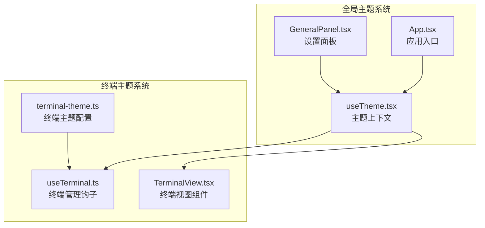
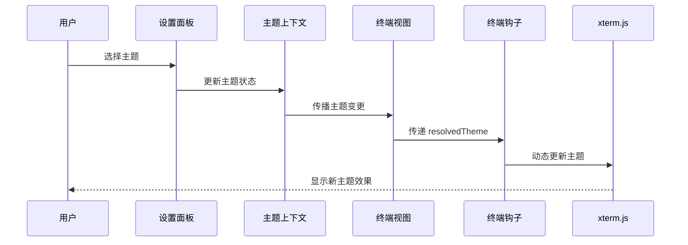
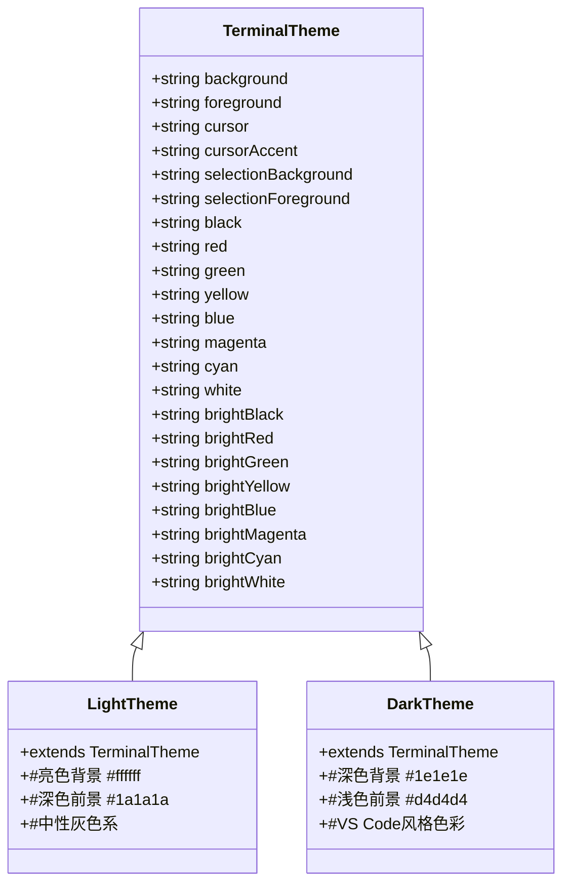
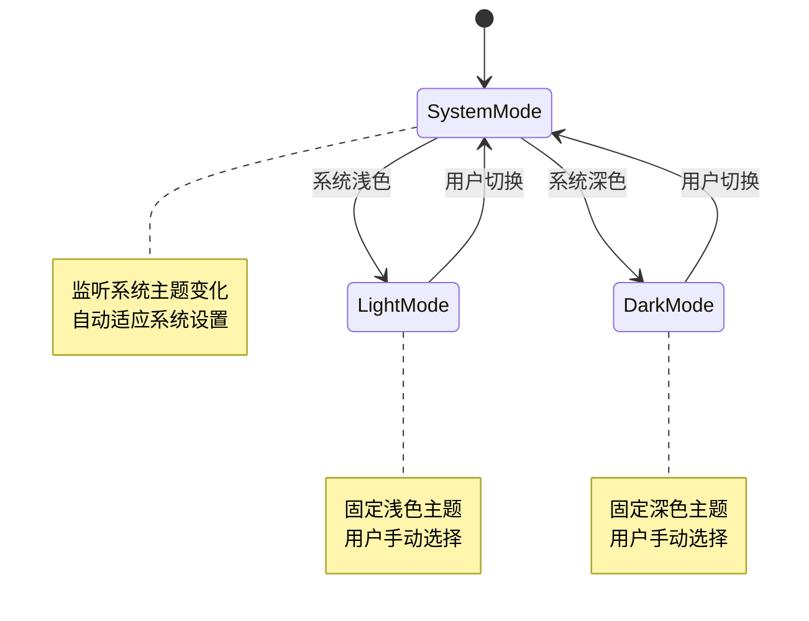
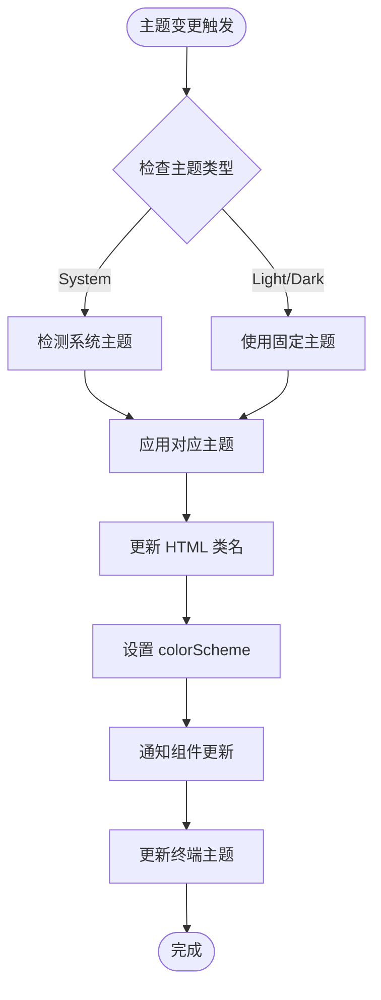
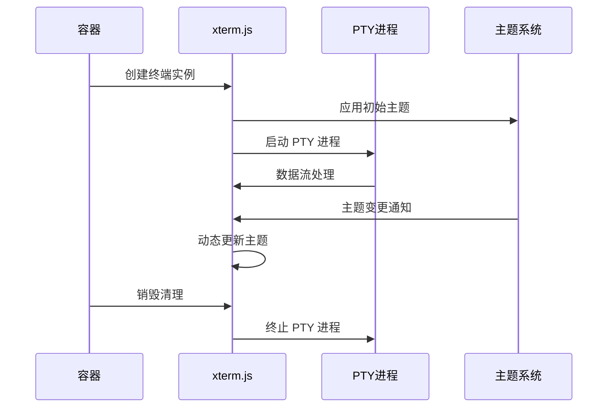
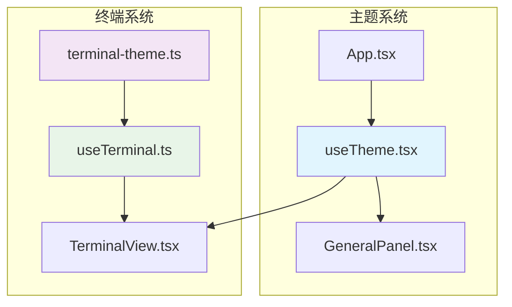

# 终端主题系统

<cite>
**本文档引用的文件**
- [terminal-theme.ts](file://src/components/terminal/terminal-theme.ts)
- [useTerminal.ts](file://src/components/terminal/useTerminal.ts)
- [TerminalView.tsx](file://src/components/terminal/TerminalView.tsx)
- [useTheme.tsx](file://src/hooks/useTheme.tsx)
- [GeneralPanel.tsx](file://src/components/settings/GeneralPanel.tsx)
- [App.tsx](file://src/App.tsx)
</cite>

## 目录
1. [简介](#简介)
2. [项目结构](#项目结构)
3. [核心组件](#核心组件)
4. [架构概览](#架构概览)
5. [详细组件分析](#详细组件分析)
6. [依赖关系分析](#依赖关系分析)
7. [性能考虑](#性能考虑)
8. [故障排除指南](#故障排除指南)
9. [结论](#结论)
10. [附录](#附录)

## 简介

终端主题系统是 RabbitCoding 应用中的一个关键组件，负责为内置终端提供完整的主题支持。该系统实现了 ANSI 颜色映射、深色/浅色主题适配，并与全局主题系统无缝集成。系统基于 xterm.js 构建，提供了丰富的颜色配置选项和动态主题切换机制。

## 项目结构

终端主题系统主要分布在以下文件中：

**图表来源**
- [terminal-theme.ts:1-58](file://src/components/terminal/terminal-theme.ts#L1-L58)
- [useTerminal.ts:1-202](file://src/components/terminal/useTerminal.ts#L1-L202)
- [useTheme.tsx:1-63](file://src/hooks/useTheme.tsx#L1-L63)

**章节来源**
- [terminal-theme.ts:1-58](file://src/components/terminal/terminal-theme.ts#L1-L58)
- [useTerminal.ts:1-202](file://src/components/terminal/useTerminal.ts#L1-L202)
- [useTheme.tsx:1-63](file://src/hooks/useTheme.tsx#L1-L63)

## 核心组件

### 终端主题配置

系统提供了两套完整的终端主题配置：

1. **亮色主题 (`terminalTheme`)**：与应用整体亮色风格保持一致
2. **暗色主题 (`terminalThemeDark`)**：VS Code Dark+ 风格

每套主题都包含完整的 ANSI 颜色映射，覆盖标准色和高亮色。

**章节来源**
- [terminal-theme.ts:6-29](file://src/components/terminal/terminal-theme.ts#L6-L29)
- [terminal-theme.ts:34-57](file://src/components/terminal/terminal-theme.ts#L34-L57)

### 主题变量定义

终端主题系统采用 xterm.js 的 ITheme 接口规范，包含以下关键属性：

- **基础颜色**：background、foreground、cursor、cursorAccent
- **选择颜色**：selectionBackground、selectionForeground  
- **ANSI 颜色**：black、red、green、yellow、blue、magenta、cyan、white
- **高亮 ANSI 颜色**：brightBlack 到 brightWhite

**章节来源**
- [terminal-theme.ts:1-58](file://src/components/terminal/terminal-theme.ts#L1-L58)

## 架构概览

终端主题系统采用分层架构设计，实现了主题配置、主题管理、主题应用的清晰分离：

**图表来源**
- [useTheme.tsx:25-56](file://src/hooks/useTheme.tsx#L25-L56)
- [TerminalView.tsx:15-17](file://src/components/terminal/TerminalView.tsx#L15-L17)
- [useTerminal.ts:153-158](file://src/components/terminal/useTerminal.ts#L153-L158)

## 详细组件分析

### 终端主题配置组件

#### ANSI 颜色映射实现

系统实现了完整的 ANSI 颜色到十六进制颜色的映射：

**图表来源**
- [terminal-theme.ts:6-29](file://src/components/terminal/terminal-theme.ts#L6-L29)
- [terminal-theme.ts:34-57](file://src/components/terminal/terminal-theme.ts#L34-L57)

#### 颜色配置策略

系统采用了精心设计的颜色配置策略：

1. **对比度优化**：确保前景色与背景色有足够的对比度
2. **可读性优先**：选择适合长时间阅读的颜色组合
3. **一致性原则**：与应用整体设计语言保持一致
4. **无障碍设计**：考虑色盲用户的可识别性需求

**章节来源**
- [terminal-theme.ts:3-29](file://src/components/terminal/terminal-theme.ts#L3-L29)
- [terminal-theme.ts:32-57](file://src/components/terminal/terminal-theme.ts#L32-L57)

### 动态主题切换机制

#### 主题状态管理

**图表来源**
- [useTheme.tsx:25-49](file://src/hooks/useTheme.tsx#L25-L49)

#### 实时主题更新流程

**图表来源**
- [useTheme.tsx:41-49](file://src/hooks/useTheme.tsx#L41-L49)
- [useTerminal.ts:153-158](file://src/components/terminal/useTerminal.ts#L153-L158)

**章节来源**
- [useTheme.tsx:10-63](file://src/hooks/useTheme.tsx#L10-L63)
- [useTerminal.ts:153-158](file://src/components/terminal/useTerminal.ts#L153-L158)

### 终端集成组件

#### 终端生命周期管理

终端组件实现了完整的生命周期管理：

**图表来源**
- [useTerminal.ts:60-151](file://src/components/terminal/useTerminal.ts#L60-L151)
- [useTerminal.ts:153-158](file://src/components/terminal/useTerminal.ts#L153-L158)

#### 终端渲染优化

系统实现了多种渲染优化策略：

1. **Canvas 渲染优先**：优先使用 Canvas 渲染器提升性能
2. **DOM 渲染回退**：Canvas 渲染失败时自动回退到 DOM 渲染
3. **尺寸适配**：智能的终端尺寸适配和响应式布局
4. **资源管理**：完善的内存管理和资源清理机制

**章节来源**
- [useTerminal.ts:85-90](file://src/components/terminal/useTerminal.ts#L85-L90)
- [useTerminal.ts:160-183](file://src/components/terminal/useTerminal.ts#L160-L183)

## 依赖关系分析

### 组件耦合关系

**图表来源**
- [useTheme.tsx:13-21](file://src/hooks/useTheme.tsx#L13-L21)
- [terminal-theme.ts:1](file://src/components/terminal/terminal-theme.ts#L1)

### 外部依赖

系统依赖的关键外部库：

- **@xterm/xterm**: 终端渲染引擎
- **@xterm/addon-fit**: 终端尺寸适配插件
- **@xterm/addon-canvas**: Canvas 渲染插件
- **tauri-pty**: PTY 进程管理

**章节来源**
- [useTerminal.ts:2-8](file://src/components/terminal/useTerminal.ts#L2-L8)

## 性能考虑

### 渲染性能优化

1. **Canvas 渲染优先级**：Canvas 渲染器提供更好的性能表现
2. **渲染器降级机制**：自动回退到 DOM 渲染确保兼容性
3. **尺寸适配优化**：使用防抖机制避免频繁的尺寸计算
4. **内存管理**：及时清理事件监听器和定时器

### 主题切换性能

1. **增量更新**：只更新发生变化的主题属性
2. **批量操作**：避免重复的 DOM 操作
3. **缓存机制**：缓存主题配置减少重复计算

## 故障排除指南

### 常见问题及解决方案

#### 终端无法启动

**症状**：终端显示启动失败错误

**可能原因**：
1. PTY 进程启动失败
2. Shell 路径配置错误
3. 权限不足

**解决步骤**：
1. 检查默认 Shell 配置
2. 验证 Shell 可执行权限
3. 查看浏览器控制台错误日志

#### 主题切换无效

**症状**：切换主题后终端颜色未更新

**可能原因**：
1. 主题状态未正确传播
2. xterm 实例未正确更新
3. 缓存问题

**解决步骤**：
1. 确认 resolvedTheme 状态正确
2. 检查 useTerminal 主题更新逻辑
3. 强制刷新终端实例

#### 颜色显示异常

**症状**：某些颜色显示不符合预期

**可能原因**：
1. 颜色对比度不足
2. 颜色值配置错误
3. 浏览器兼容性问题

**解决步骤**：
1. 调整颜色对比度
2. 验证颜色值格式
3. 测试不同浏览器兼容性

**章节来源**
- [useTerminal.ts:105-109](file://src/components/terminal/useTerminal.ts#L105-L109)
- [useTerminal.ts:153-158](file://src/components/terminal/useTerminal.ts#L153-L158)

## 结论

终端主题系统通过精心设计的架构和实现，成功地为用户提供了完整的终端主题体验。系统不仅实现了基本的 ANSI 颜色映射和深色/浅色主题适配，更重要的是与全局主题系统实现了深度集成，提供了流畅的用户体验。

系统的亮点包括：
- 完整的 ANSI 颜色支持
- 智能的主题切换机制  
- 优秀的性能优化
- 良好的可扩展性

## 附录

### 主题定制指南

#### 自定义主题创建步骤

1. **复制现有主题**：基于现有的亮色或暗色主题开始
2. **调整基础颜色**：修改 background 和 foreground
3. **配置 ANSI 颜色**：为每个 ANSI 颜色指定合适的十六进制值
4. **测试对比度**：确保足够的颜色对比度
5. **验证可读性**：在不同环境下测试主题效果

#### 主题变量参考表

| 变量名称 | 描述 | 默认值 |
|---------|------|--------|
| background | 终端背景色 | #ffffff |
| foreground | 默认文本颜色 | #1a1a1a |
| cursor | 光标颜色 | #333333 |
| selectionBackground | 选区背景色 | #add6ff80 |
| black/red/green/yellow/blue/magenta/cyan/white | 标准 ANSI 颜色 | 预设颜色值 |
| brightBlack/brightRed/.../brightWhite | 高亮 ANSI 颜色 | 预设颜色值 |

### 最佳实践建议

1. **保持一致性**：确保终端主题与应用整体设计风格一致
2. **注重可访问性**：优先考虑色盲用户和视觉障碍用户的可识别性
3. **测试多环境**：在不同操作系统和浏览器上测试主题效果
4. **性能优先**：选择合适的渲染器并优化渲染性能
5. **渐进增强**：提供基础功能的同时支持高级特性

### 调试技巧

1. **开发者工具**：使用浏览器开发者工具检查元素样式
2. **日志记录**：添加必要的日志输出便于调试
3. **单元测试**：为主题配置编写单元测试确保正确性
4. **性能监控**：监控渲染性能和内存使用情况