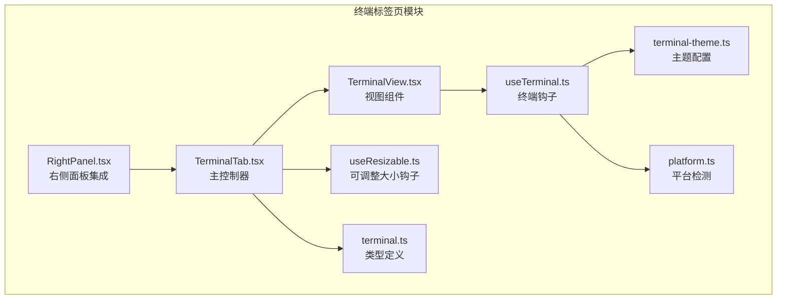
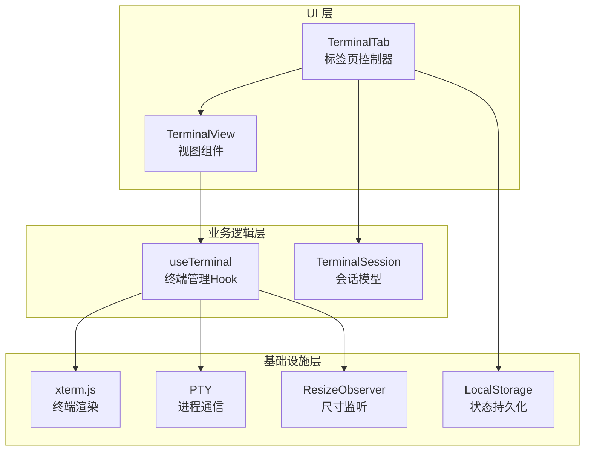
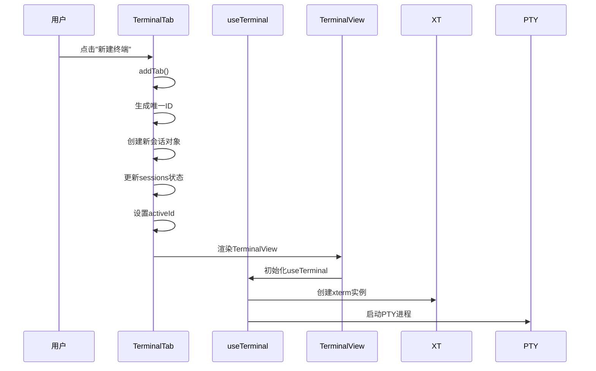
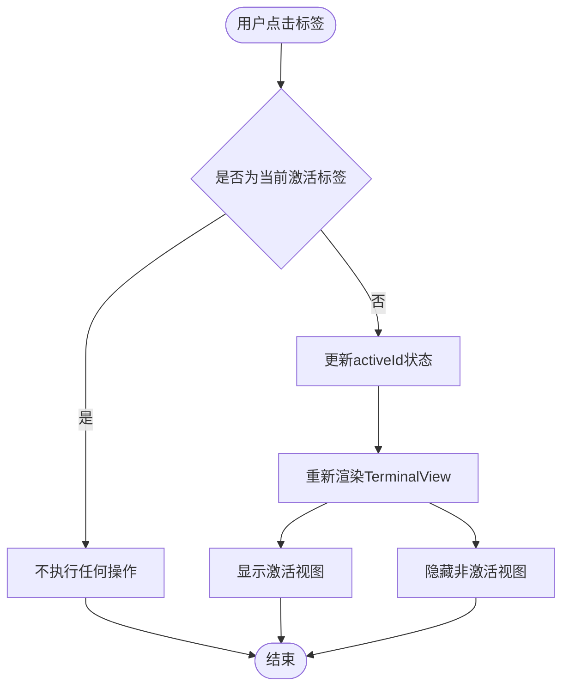
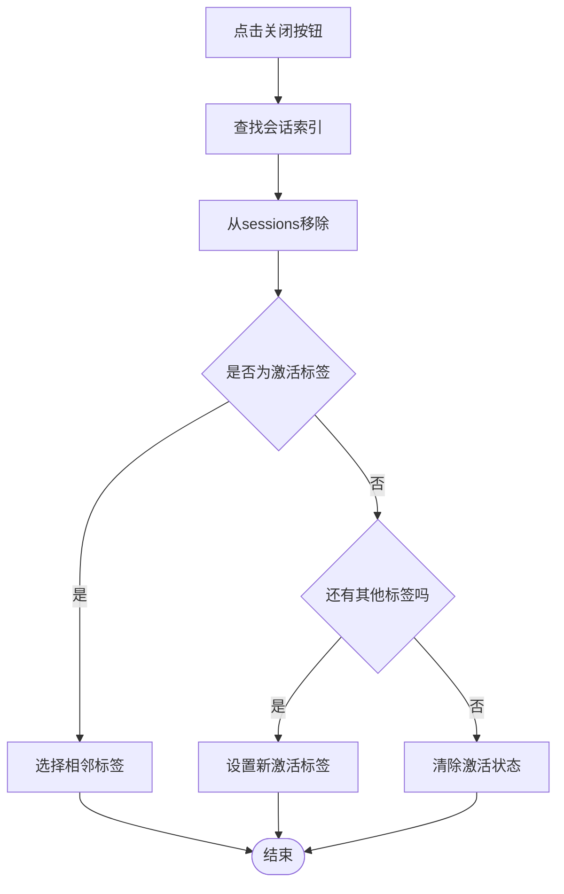
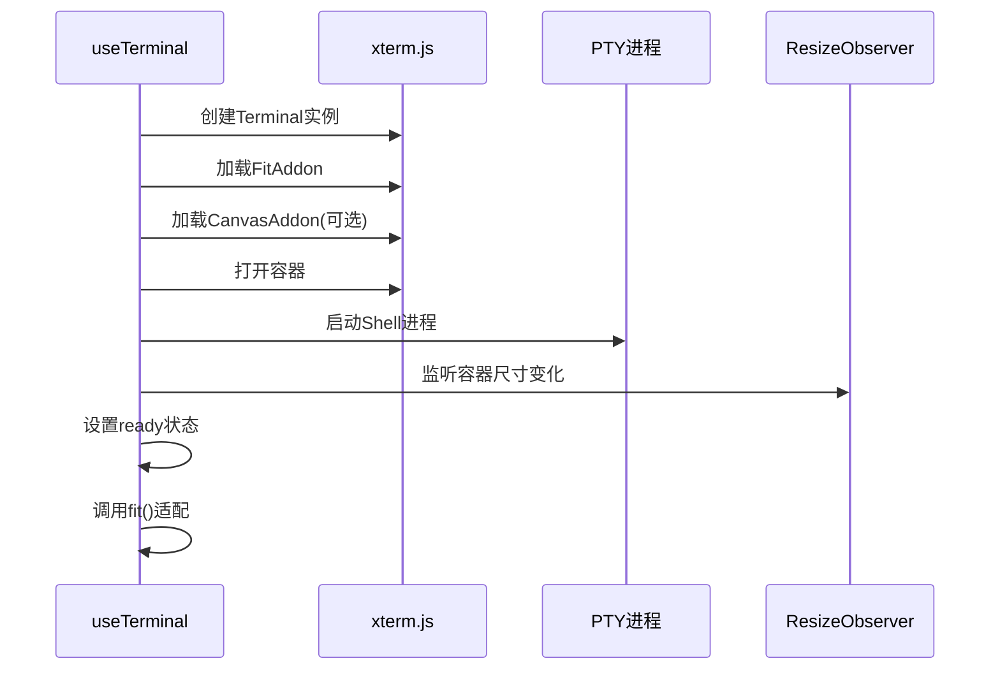
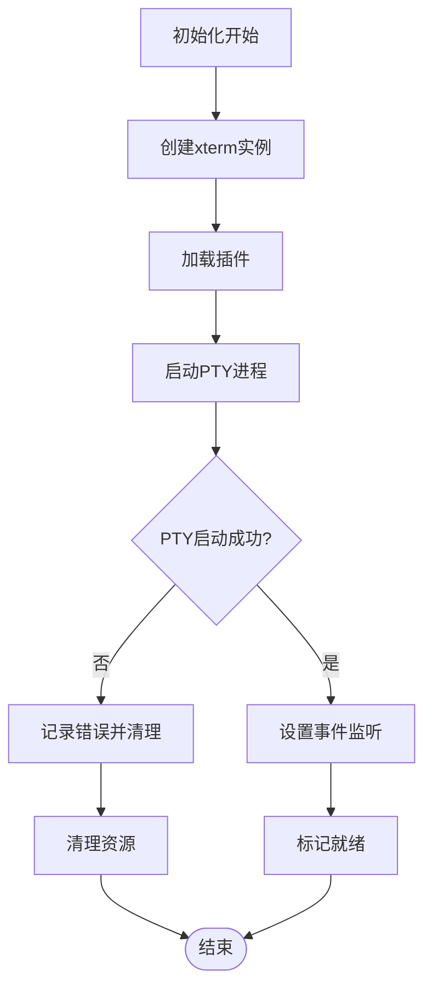

# 终端标签页

<cite>
**本文档引用的文件**
- [TerminalTab.tsx](file://src/components/terminal/TerminalTab.tsx)
- [TerminalView.tsx](file://src/components/terminal/TerminalView.tsx)
- [useTerminal.ts](file://src/components/terminal/useTerminal.ts)
- [terminal-theme.ts](file://src/components/terminal/terminal-theme.ts)
- [terminal.ts](file://src/types/terminal.ts)
- [useResizable.ts](file://src/hooks/useResizable.ts)
- [platform.ts](file://src/utils/platform.ts)
- [RightPanel.tsx](file://src/components/RightPanel.tsx)
</cite>

## 目录
1. [简介](#简介)
2. [项目结构](#项目结构)
3. [核心组件](#核心组件)
4. [架构概览](#架构概览)
5. [详细组件分析](#详细组件分析)
6. [依赖关系分析](#依赖关系分析)
7. [性能考虑](#性能考虑)
8. [故障排除指南](#故障排除指南)
9. [结论](#结论)

## 简介

终端标签页功能是 RabbitCoding 应用中的一个重要组成部分，它提供了多标签页的终端管理能力。该功能允许用户同时管理多个终端会话，每个会话都有独立的标签页，支持标签页的创建、切换、关闭等操作。系统集成了 xterm.js 作为终端渲染引擎，并通过 Tauri 的 PTY 功能实现与系统 Shell 的通信。

## 项目结构

终端标签页功能主要由以下文件组成：



**图表来源**
- [TerminalTab.tsx:1-156](file://src/components/terminal/TerminalTab.tsx#L1-L156)
- [TerminalView.tsx:1-48](file://src/components/terminal/TerminalView.tsx#L1-L48)
- [useTerminal.ts:1-202](file://src/components/terminal/useTerminal.ts#L1-L202)

**章节来源**
- [TerminalTab.tsx:1-156](file://src/components/terminal/TerminalTab.tsx#L1-L156)
- [TerminalView.tsx:1-48](file://src/components/terminal/TerminalView.tsx#L1-L48)
- [useTerminal.ts:1-202](file://src/components/terminal/useTerminal.ts#L1-L202)

## 核心组件

### TerminalTab 组件

TerminalTab 是整个终端标签页功能的主控制器，负责管理所有终端会话的状态和交互逻辑。

**主要功能特性：**
- 多标签页管理（最多10个标签）
- 标签页创建、切换、关闭
- 标题自动生成和显示
- 活动状态指示
- 可调整大小的侧边栏
- 空状态处理

**状态管理：**
- `sessions`: 存储所有终端会话的数组
- `activeId`: 当前激活的标签页 ID
- `fitFn`: 终端适配函数的回调

**章节来源**
- [TerminalTab.tsx:19-62](file://src/components/terminal/TerminalTab.tsx#L19-L62)
- [terminal.ts:1-6](file://src/types/terminal.ts#L1-L6)

### TerminalView 组件

TerminalView 是单个终端视图的展示组件，负责渲染具体的终端实例。

**核心职责：**
- 接收并传递终端状态给父组件
- 显示加载状态和错误信息
- 管理终端容器的可见性

**章节来源**
- [TerminalView.tsx:15-47](file://src/components/terminal/TerminalView.tsx#L15-L47)

### useTerminal Hook

useTerminal 是核心的自定义 Hook，管理单个终端实例的完整生命周期。

**关键功能：**
- xterm.js 实例的创建和销毁
- PTY 进程的启动和通信
- 终端适配和尺寸调整
- 主题动态切换
- 错误处理和清理

**章节来源**
- [useTerminal.ts:33-201](file://src/components/terminal/useTerminal.ts#L33-L201)

## 架构概览

终端标签页采用分层架构设计，实现了清晰的关注点分离：



**图表来源**
- [TerminalTab.tsx:19-155](file://src/components/terminal/TerminalTab.tsx#L19-L155)
- [useTerminal.ts:33-201](file://src/components/terminal/useTerminal.ts#L33-L201)

## 详细组件分析

### TerminalTab 组件深度分析

TerminalTab 实现了完整的标签页管理功能，包括状态管理和用户交互。

#### 标签页创建机制



**图表来源**
- [TerminalTab.tsx:35-45](file://src/components/terminal/TerminalTab.tsx#L35-L45)
- [useTerminal.ts:60-130](file://src/components/terminal/useTerminal.ts#L60-L130)

#### 标签页切换机制

标签页切换通过简单的状态更新实现，支持键盘导航：



**图表来源**
- [TerminalTab.tsx:113](file://src/components/terminal/TerminalTab.tsx#L113)
- [TerminalTab.tsx:144](file://src/components/terminal/TerminalTab.tsx#L144)

#### 标签页关闭机制

关闭标签页时，系统会自动处理激活状态的转移：



**图表来源**
- [TerminalTab.tsx:47-62](file://src/components/terminal/TerminalTab.tsx#L47-L62)

#### 标题管理系统

标题生成遵循以下规则：
- 第一个标签：使用默认 Shell 名称（如 "zsh" 或 "PowerShell"）
- 后续标签：在默认名称后添加序号（如 "zsh-2", "PowerShell-3"）

**章节来源**
- [TerminalTab.tsx:30-33](file://src/components/terminal/TerminalTab.tsx#L30-L33)
- [useTerminal.ts:13-14](file://src/components/terminal/useTerminal.ts#L13-L14)

### TerminalView 组件分析

TerminalView 作为视图层组件，主要负责：

- **容器管理**：接收并存储 xterm.js 容器的引用
- **状态展示**：根据终端就绪状态显示不同的 UI 元素
- **事件传递**：将终端适配函数传递给父组件

**章节来源**
- [TerminalView.tsx:15-47](file://src/components/terminal/TerminalView.tsx#L15-L47)

### useTerminal Hook 深度解析

useTerminal Hook 是整个终端功能的核心，实现了复杂的生命周期管理：

#### 终端初始化流程



**图表来源**
- [useTerminal.ts:60-130](file://src/components/terminal/useTerminal.ts#L60-L130)

#### 终端适配机制

终端适配通过 FitAddon 和 ResizeObserver 实现：

```mermaid
flowchart TD
ContainerResize[容器尺寸变化] --> Debounce[防抖200ms]
Debounce --> CalculateSize[计算终端行列数]
CalculateSize --> FitAddon[调用fitAddon.fit()]
FitAddon --> ResizePTY[调整PTY尺寸]
ResizePTY --> UpdateDisplay[更新显示]
```

**图表来源**
- [useTerminal.ts:160-183](file://src/components/terminal/useTerminal.ts#L160-L183)

#### 错误处理策略

系统实现了多层次的错误处理：



**图表来源**
- [useTerminal.ts:92-124](file://src/components/terminal/useTerminal.ts#L92-L124)

**章节来源**
- [useTerminal.ts:33-201](file://src/components/terminal/useTerminal.ts#L33-L201)

### 主题系统集成

终端支持亮色和暗色两种主题模式，与应用的整体主题保持同步：

**主题配置特点：**
- 亮色主题：与应用整体亮色风格保持一致
- 暗色主题：VS Code Dark+ 风格
- 动态切换：主题变化时自动更新终端外观

**章节来源**
- [terminal-theme.ts:1-58](file://src/components/terminal/terminal-theme.ts#L1-L58)
- [useTerminal.ts:153-158](file://src/components/terminal/useTerminal.ts#L153-L158)

## 依赖关系分析

终端标签页功能的依赖关系如下：

```mermaid
graph LR
subgraph "外部依赖"
XTERM[@xterm/xterm<br/>终端渲染]
FIT[@xterm/addon-fit<br/>适配插件]
CANVAS[@xterm/addon-canvas<br/>Canvas渲染]
TAURI[tauri-pty<br/>进程通信]
end
subgraph "内部模块"
TT[TerminalTab]
TV[TerminalView]
UT[useTerminal]
UR[useResizable]
TS[terminal-types]
end
subgraph "工具函数"
PF[platform-utils<br/>平台检测]
ID[id-utils<br/>ID生成]
end
TT --> TV
TV --> UT
UT --> XTERM
UT --> FIT
UT --> CANVAS
UT --> TAURI
TT --> UR
TT --> TS
TT --> ID
UT --> PF
```

**图表来源**
- [TerminalTab.tsx:1-7](file://src/components/terminal/TerminalTab.tsx#L1-L7)
- [useTerminal.ts:1-8](file://src/components/terminal/useTerminal.ts#L1-L8)

**章节来源**
- [TerminalTab.tsx:1-7](file://src/components/terminal/TerminalTab.tsx#L1-L7)
- [useTerminal.ts:1-8](file://src/components/terminal/useTerminal.ts#L1-L8)

## 性能考虑

### 内存管理优化

1. **组件卸载清理**：TerminalView 组件在卸载时会自动清理 PTY 进程和 xterm 实例
2. **Canvas 渲染回退**：当 Canvas 插件加载失败时自动回退到 DOM 渲染
3. **ResizeObserver 管理**：正确清理 ResizeObserver 监听器，防止内存泄漏

### 渲染性能优化

1. **虚拟化渲染**：使用绝对定位和 visibility 控制实现标签页的快速切换
2. **防抖机制**：终端适配使用 200ms 防抖，减少频繁重绘
3. **懒加载策略**：终端容器在首次需要时才进行渲染

### 资源管理最佳实践

1. **进程生命周期**：确保 PTY 进程在组件卸载时正确终止
2. **定时器清理**：及时清理 resize 定时器，避免内存泄漏
3. **事件监听器**：组件卸载时移除所有事件监听器

## 故障排除指南

### 常见问题及解决方案

**问题1：终端无法启动**
- 检查默认 Shell 配置是否正确
- 验证系统权限设置
- 查看控制台错误日志

**问题2：标签页切换异常**
- 确认 activeId 状态更新正常
- 检查标签页数量限制（最多10个）
- 验证 DOM 结构完整性

**问题3：终端显示异常**
- 检查容器尺寸是否正确
- 验证实例适配函数是否正常工作
- 确认主题配置正确加载

**章节来源**
- [useTerminal.ts:105-108](file://src/components/terminal/useTerminal.ts#L105-L108)
- [TerminalTab.tsx:64-69](file://src/components/terminal/TerminalTab.tsx#L64-L69)

### 调试技巧

1. **启用开发模式**：查看详细的错误信息和状态日志
2. **检查网络连接**：确保 PTY 通信正常
3. **验证系统兼容性**：确认目标平台支持所需功能

## 结论

终端标签页功能通过精心设计的架构实现了高效、稳定的多标签页终端管理。其核心优势包括：

1. **模块化设计**：清晰的组件分离和职责划分
2. **性能优化**：合理的资源管理和渲染策略
3. **用户体验**：直观的交互设计和流畅的操作体验
4. **可扩展性**：良好的架构为未来功能扩展奠定基础

该功能为开发者提供了强大的命令行工具访问能力，是 RabbitCoding 应用的重要组成部分。通过持续的优化和改进，终端标签页功能将继续提升用户的开发效率和体验质量。