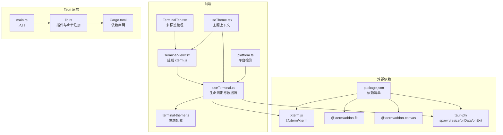
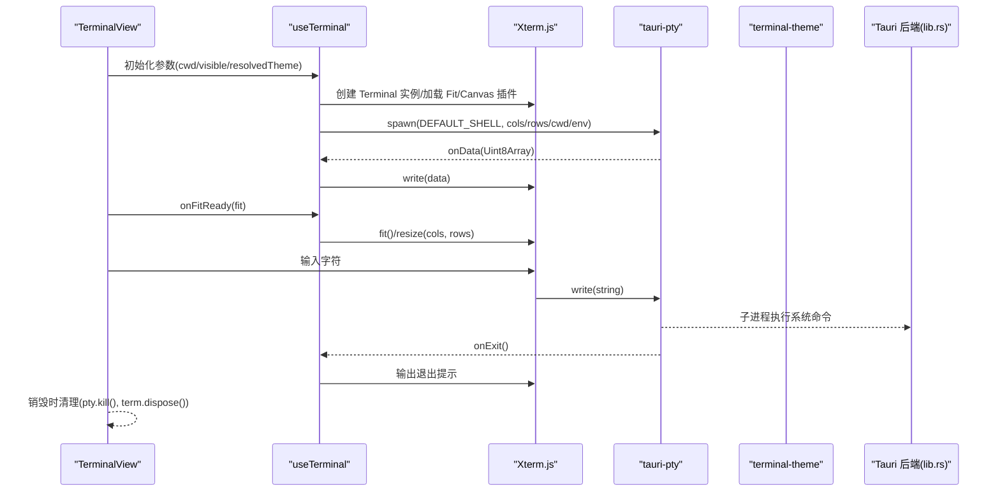
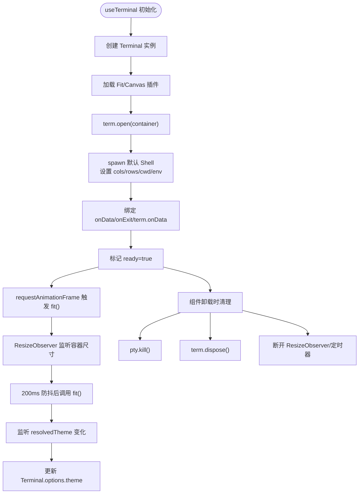
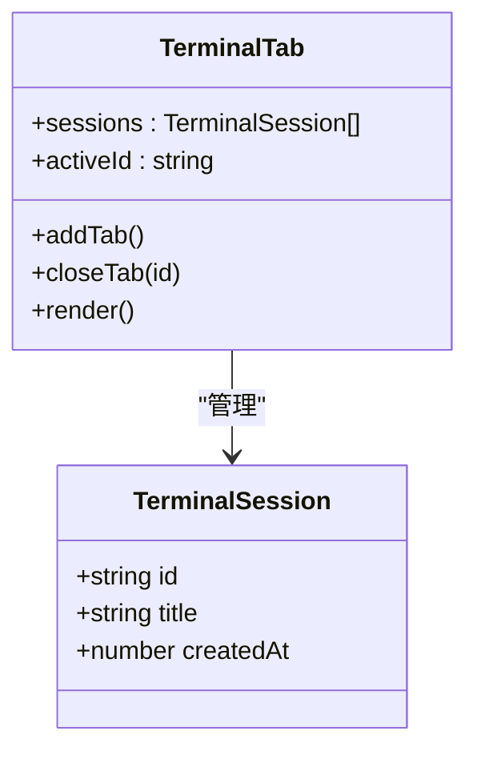
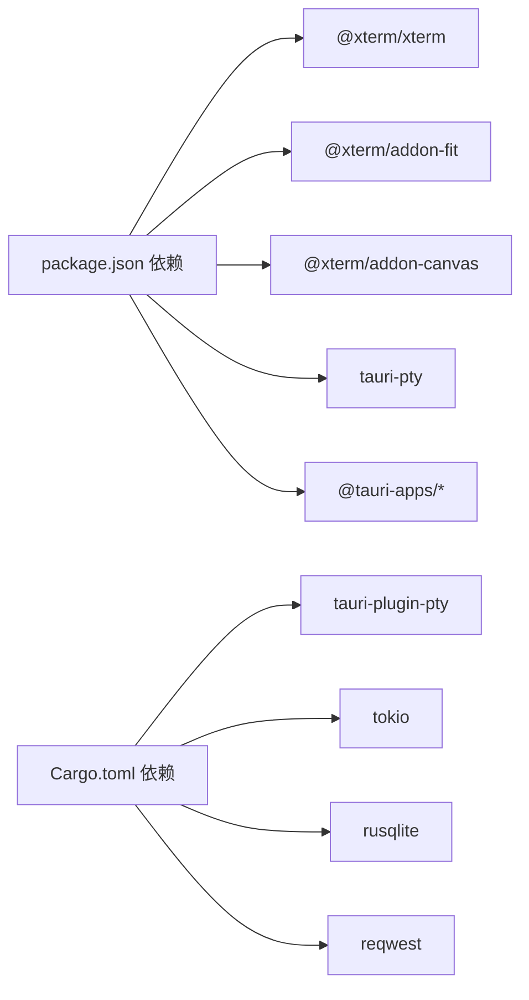

# 终端系统

<cite>
**本文引用的文件**
- [src/components/terminal/TerminalView.tsx](file://src/components/terminal/TerminalView.tsx)
- [src/components/terminal/useTerminal.ts](file://src/components/terminal/useTerminal.ts)
- [src/components/terminal/terminal-theme.ts](file://src/components/terminal/terminal-theme.ts)
- [src/components/terminal/TerminalTab.tsx](file://src/components/terminal/TerminalTab.tsx)
- [src/hooks/useTheme.tsx](file://src/hooks/useTheme.tsx)
- [src/utils/platform.ts](file://src/utils/platform.ts)
- [src/types/terminal.ts](file://src/types/terminal.ts)
- [src-tauri/src/lib.rs](file://src-tauri/src/lib.rs)
- [src-tauri/src/main.rs](file://src-tauri/src/main.rs)
- [src-tauri/Cargo.toml](file://src-tauri/Cargo.toml)
- [package.json](file://package.json)
</cite>

## 目录
1. [简介](#简介)
2. [项目结构](#项目结构)
3. [核心组件](#核心组件)
4. [架构总览](#架构总览)
5. [详细组件分析](#详细组件分析)
6. [依赖关系分析](#依赖关系分析)
7. [性能考量](#性能考量)
8. [故障排查指南](#故障排查指南)
9. [结论](#结论)
10. [附录](#附录)

## 简介
本文件为 RabbitCoding 终端系统的全面功能文档，覆盖终端模拟器实现、Xterm.js 集成、进程管理机制、命令执行流程、进程生命周期管理、输出处理机制、主题系统与颜色配置、字体设置、最佳实践、性能优化、安全注意事项、使用示例与配置指导，以及与操作系统命令行的交互方式与限制。

## 项目结构
终端系统由前端 React 组件与 Tauri 后端共同构成：
- 前端负责渲染与交互：终端视图、多标签管理、主题联动、尺寸自适应与渲染优化。
- 后端通过 Tauri 提供 PTY 子进程能力与系统级插件支持，保证跨平台命令行交互与资源访问。

**图表来源**
- [src/components/terminal/TerminalView.tsx:1-48](file://src/components/terminal/TerminalView.tsx#L1-L48)
- [src/components/terminal/useTerminal.ts:1-202](file://src/components/terminal/useTerminal.ts#L1-L202)
- [src/components/terminal/terminal-theme.ts:1-58](file://src/components/terminal/terminal-theme.ts#L1-L58)
- [src/components/terminal/TerminalTab.tsx:1-155](file://src/components/terminal/TerminalTab.tsx#L1-L155)
- [src/hooks/useTheme.tsx:1-63](file://src/hooks/useTheme.tsx#L1-L63)
- [src/utils/platform.ts:1-19](file://src/utils/platform.ts#L1-L19)
- [src-tauri/src/main.rs:1-7](file://src-tauri/src/main.rs#L1-L7)
- [src-tauri/src/lib.rs:124-316](file://src-tauri/src/lib.rs#L124-L316)
- [src-tauri/Cargo.toml:1-40](file://src-tauri/Cargo.toml#L1-L40)
- [package.json:14-36](file://package.json#L14-L36)

**章节来源**
- [src/components/terminal/TerminalView.tsx:1-48](file://src/components/terminal/TerminalView.tsx#L1-L48)
- [src/components/terminal/useTerminal.ts:1-202](file://src/components/terminal/useTerminal.ts#L1-L202)
- [src/components/terminal/TerminalTab.tsx:1-155](file://src/components/terminal/TerminalTab.tsx#L1-L155)
- [src/hooks/useTheme.tsx:1-63](file://src/hooks/useTheme.tsx#L1-L63)
- [src/utils/platform.ts:1-19](file://src/utils/platform.ts#L1-L19)
- [src-tauri/src/main.rs:1-7](file://src-tauri/src/main.rs#L1-L7)
- [src-tauri/src/lib.rs:124-316](file://src-tauri/src/lib.rs#L124-L316)
- [src-tauri/Cargo.toml:1-40](file://src-tauri/Cargo.toml#L1-L40)
- [package.json:14-36](file://package.json#L14-L36)

## 核心组件
- 终端视图组件：负责将 xterm.js 容器挂载到 DOM，展示加载状态与错误信息，并在就绪后回调 fit 函数。
- 终端 Hook：封装 xterm.js 实例、Fit 插件、Canvas 渲染器、PTY 子进程的创建、双向数据流、尺寸适配、主题切换与清理逻辑。
- 主题系统：提供亮/暗两套主题，随应用主题上下文动态切换。
- 多标签管理：支持新建、切换、关闭多个独立终端会话，维护会话元数据。
- 平台适配：根据平台选择默认 Shell 与标题栏留白策略。
- Tauri 集成：通过后端插件启用 PTY 能力，提供命令与窗口状态管理。

**章节来源**
- [src/components/terminal/TerminalView.tsx:15-47](file://src/components/terminal/TerminalView.tsx#L15-L47)
- [src/components/terminal/useTerminal.ts:33-201](file://src/components/terminal/useTerminal.ts#L33-L201)
- [src/components/terminal/terminal-theme.ts:6-57](file://src/components/terminal/terminal-theme.ts#L6-L57)
- [src/components/terminal/TerminalTab.tsx:19-155](file://src/components/terminal/TerminalTab.tsx#L19-L155)
- [src/hooks/useTheme.tsx:25-56](file://src/hooks/useTheme.tsx#L25-L56)
- [src/utils/platform.ts:6-18](file://src/utils/platform.ts#L6-L18)
- [src-tauri/src/lib.rs:124-133](file://src-tauri/src/lib.rs#L124-L133)

## 架构总览
终端系统采用“前端 xterm.js + 后端 PTY”的架构，前端负责渲染与交互，后端负责子进程生命周期与系统能力扩展。

**图表来源**
- [src/components/terminal/TerminalView.tsx:15-24](file://src/components/terminal/TerminalView.tsx#L15-L24)
- [src/components/terminal/useTerminal.ts:64-122](file://src/components/terminal/useTerminal.ts#L64-L122)
- [src-tauri/src/lib.rs:130](file://src-tauri/src/lib.rs#L130)

## 详细组件分析

### 组件：TerminalView（终端视图）
- 功能职责
  - 将 xterm.js 容器挂载到 DOM。
  - 展示加载动画与错误提示。
  - 在就绪后将 fit 函数回调给父组件，用于尺寸适配。
- 关键行为
  - 读取 resolvedTheme 并传入 useTerminal。
  - 通过 onFitReady 将 fit 传递给 TerminalTab，以便在面板可见时触发重算。
- 错误处理
  - 当 useTerminal 报错时，显示错误文案。

**章节来源**
- [src/components/terminal/TerminalView.tsx:15-47](file://src/components/terminal/TerminalView.tsx#L15-L47)

### 组件：useTerminal（终端 Hook）
- 生命周期管理
  - 初始化：创建 Terminal、加载 Fit 与 Canvas 插件，打开容器。
  - 启动 PTY：spawn 默认 Shell（Windows 使用 PowerShell，其他使用 zsh），设置 cols/rows/cwd/env。
  - 数据流：PTY 的 onData 写入 Terminal，Terminal 的 onData 写入 PTY。
  - 退出处理：PTY onExit 输出提示。
  - 清理：销毁时 kill PTY、dispose Terminal、断开 ResizeObserver、清理定时器。
- 尺寸适配
  - fit：调用 FitAddon.fit 并同步 pty.resize(cols, rows)。
  - ResizeObserver + 防抖：200ms 防抖，确保稳定计算。
  - 可见性：当 visible 为 true 且 ready 为真时，延迟一帧触发 fit。
- 主题联动
  - 监听 resolvedTheme 变化，动态更新 Terminal.options.theme。
- 平台适配
  - DEFAULT_SHELL 与 DEFAULT_SHELL_LABEL 根据平台选择。
  - 字体族、字号、行高等基础样式固定，便于跨平台一致性。

**图表来源**
- [src/components/terminal/useTerminal.ts:60-151](file://src/components/terminal/useTerminal.ts#L60-L151)
- [src/components/terminal/useTerminal.ts:160-192](file://src/components/terminal/useTerminal.ts#L160-L192)
- [src/components/terminal/useTerminal.ts:153-158](file://src/components/terminal/useTerminal.ts#L153-L158)

**章节来源**
- [src/components/terminal/useTerminal.ts:33-201](file://src/components/terminal/useTerminal.ts#L33-L201)

### 组件：TerminalTab（多标签终端）
- 功能职责
  - 维护多个 TerminalSession，支持新建、切换、关闭。
  - 限制最大标签数，提供空态提示与新建入口。
  - 通过 onFitReady 接收 fit 函数，在面板可见时触发 fit。
  - 左侧标签栏支持拖拽调整宽度。
- 会话模型
  - TerminalSession 包含 id、title、createdAt。

**图表来源**
- [src/types/terminal.ts:1-6](file://src/types/terminal.ts#L1-L6)
- [src/components/terminal/TerminalTab.tsx:19-155](file://src/components/terminal/TerminalTab.tsx#L19-L155)

**章节来源**
- [src/components/terminal/TerminalTab.tsx:19-155](file://src/components/terminal/TerminalTab.tsx#L19-L155)
- [src/types/terminal.ts:1-6](file://src/types/terminal.ts#L1-L6)

### 组件：主题系统与字体配置
- 主题定义
  - terminalTheme：亮色主题，与应用亮色风格一致。
  - terminalThemeDark：暗色主题，VS Code Dark+ 风格。
- 主题联动
  - useTheme 提供 theme 与 resolvedTheme，并同步到 <html>，驱动 dark: 变体。
  - useTerminal 监听 resolvedTheme，动态更新 Terminal.options.theme。
- 字体与排版
  - fontFamily、fontSize、lineHeight 在 Terminal 初始化时设置。
  - 平台检测影响默认 Shell 与标题栏留白。

**章节来源**
- [src/components/terminal/terminal-theme.ts:6-57](file://src/components/terminal/terminal-theme.ts#L6-L57)
- [src/hooks/useTheme.tsx:25-56](file://src/hooks/useTheme.tsx#L25-L56)
- [src/components/terminal/useTerminal.ts:64-75](file://src/components/terminal/useTerminal.ts#L64-L75)
- [src/utils/platform.ts:6-18](file://src/utils/platform.ts#L6-L18)

### 组件：Tauri 后端与 PTY 集成
- 插件与命令
  - 启用 tauri-plugin-pty，提供 PTY 子进程能力。
  - 后端注册多种命令（如数据库、网络诊断、反馈采集等），终端相关命令由前端通过 tauri-pty 使用。
- 运行入口
  - main.rs 调用 rabbit_coding_lib::run，完成插件初始化与窗口状态管理。

**章节来源**
- [src-tauri/src/lib.rs:124-133](file://src-tauri/src/lib.rs#L124-L133)
- [src-tauri/src/lib.rs:272-313](file://src-tauri/src/lib.rs#L272-L313)
- [src-tauri/src/main.rs:4-6](file://src-tauri/src/main.rs#L4-L6)

## 依赖关系分析
- 前端依赖
  - @xterm/xterm、@xterm/addon-fit、@xterm/addon-canvas：终端渲染与适配。
  - tauri-pty：PTY 子进程通信。
  - @tauri-apps/*：Tauri 插件生态。
- 后端依赖
  - tauri-plugin-pty：提供 PTY 能力。
  - tokio、rusqlite、reqwest 等：运行时与功能扩展。

**图表来源**
- [package.json:14-36](file://package.json#L14-L36)
- [src-tauri/Cargo.toml:20-39](file://src-tauri/Cargo.toml#L20-L39)

**章节来源**
- [package.json:14-36](file://package.json#L14-L36)
- [src-tauri/Cargo.toml:20-39](file://src-tauri/Cargo.toml#L20-L39)

## 性能考量
- 渲染优化
  - 优先加载 Canvas 插件，失败则回退 DOM 渲染，兼顾性能与兼容性。
  - 仅在容器可见时进行 fit，避免 display:none 时的异常与无效计算。
- 尺寸适配
  - ResizeObserver + 200ms 防抖，降低频繁重绘与布局抖动。
- 数据流
  - 使用 Uint8Array 从 PTY 读取，减少编码转换成本。
- 资源回收
  - 组件卸载时 kill PTY、dispose Terminal、断开观察者与定时器，防止内存泄漏。

**章节来源**
- [src/components/terminal/useTerminal.ts:85-90](file://src/components/terminal/useTerminal.ts#L85-L90)
- [src/components/terminal/useTerminal.ts:165-172](file://src/components/terminal/useTerminal.ts#L165-L172)
- [src/components/terminal/useTerminal.ts:131-150](file://src/components/terminal/useTerminal.ts#L131-L150)

## 故障排查指南
- 终端启动失败
  - 现象：显示错误文案。
  - 可能原因：spawn 默认 Shell 失败、环境变量不正确或权限不足。
  - 处理建议：检查默认 Shell 路径与可用性，确认 cwd 存在且可访问。
- 无输出或黑屏
  - 现象：终端空白。
  - 可能原因：容器未就绪、fit 未执行、display:none。
  - 处理建议：等待 ready 后再触发 fit；确保 visible 为 true；检查容器尺寸。
- 字体或渲染异常
  - 现象：文字模糊、渲染卡顿。
  - 可能原因：Canvas 插件加载失败、字体不可用。
  - 处理建议：确认字体可用；若 Canvas 失败，系统会回退 DOM 渲染。
- 主题不生效
  - 现象：主题未随应用切换。
  - 可能原因：resolvedTheme 未更新或 Terminal.options.theme 未刷新。
  - 处理建议：确认 useTheme 提供 resolvedTheme；检查 useTerminal 的主题监听是否生效。

**章节来源**
- [src/components/terminal/TerminalView.tsx:32-44](file://src/components/terminal/TerminalView.tsx#L32-L44)
- [src/components/terminal/useTerminal.ts:94-109](file://src/components/terminal/useTerminal.ts#L94-L109)
- [src/components/terminal/useTerminal.ts:153-158](file://src/components/terminal/useTerminal.ts#L153-L158)

## 结论
RabbitCoding 终端系统通过前端 xterm.js 与后端 PTY 的协同，实现了跨平台命令行交互体验。系统具备完善的生命周期管理、主题联动、尺寸适配与渲染优化机制，能够满足日常开发与运维场景的需求。建议在生产环境中结合平台特性进行进一步的字体与渲染策略优化，并持续关注 PTY 与系统命令的兼容性。

## 附录

### 使用示例与配置指导
- 新建终端
  - 在 TerminalTab 中点击“新建终端”，系统生成带序号的标题（如 zsh-2）。
- 切换与关闭标签
  - 点击左侧标签切换；悬浮于标签项可关闭该会话。
- 设置工作目录
  - TerminalView 接受 cwd 参数，可在创建时指定初始工作目录。
- 主题切换
  - 通过 useTheme 上下文设置 theme，resolvedTheme 将驱动终端主题更新。
- 字体与排版
  - 字体族、字号、行高在 useTerminal 初始化时设定，建议保持默认以获得最佳跨平台一致性。

**章节来源**
- [src/components/terminal/TerminalTab.tsx:35-62](file://src/components/terminal/TerminalTab.tsx#L35-L62)
- [src/components/terminal/TerminalView.tsx:5-9](file://src/components/terminal/TerminalView.tsx#L5-L9)
- [src/hooks/useTheme.tsx:25-56](file://src/hooks/useTheme.tsx#L25-L56)
- [src/components/terminal/useTerminal.ts:64-75](file://src/components/terminal/useTerminal.ts#L64-L75)

### 与操作系统命令行的交互方式与限制
- 交互方式
  - 前端通过 tauri-pty 与后端 PTY 插件通信，实现命令输入与输出回显。
  - 默认 Shell 根据平台选择（Windows 使用 PowerShell，其他使用 zsh）。
- 限制
  - 跨平台命令差异：不同 Shell 的内置命令与语法可能不同。
  - 环境变量：TERM 与 COLORTERM 已预设，部分程序可能依赖特定环境。
  - 渲染与性能：Canvas 插件优先，失败回退 DOM 渲染，极端情况下可能影响性能。
  - 资源访问：受限于 Tauri 插件与权限模型，需遵循 ACL 与沙箱规则。

**章节来源**
- [src/components/terminal/useTerminal.ts:94-103](file://src/components/terminal/useTerminal.ts#L94-L103)
- [src/utils/platform.ts:6-12](file://src/utils/platform.ts#L6-L12)
- [src-tauri/src/lib.rs:124-133](file://src-tauri/src/lib.rs#L124-L133)