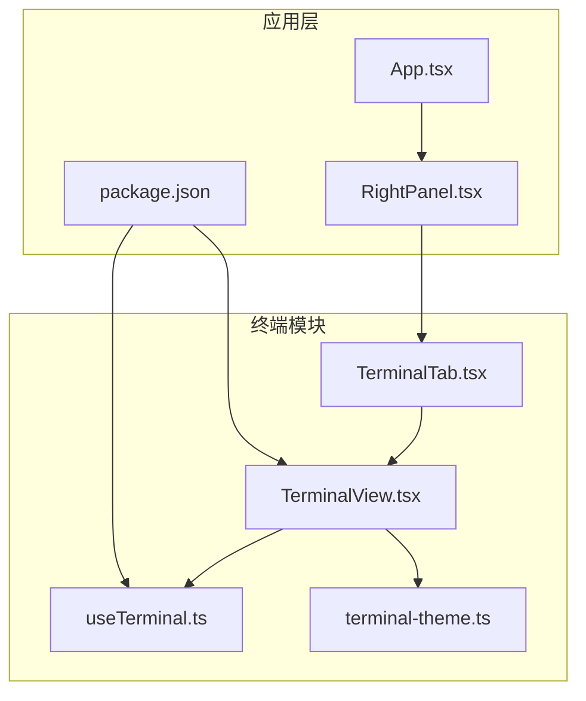
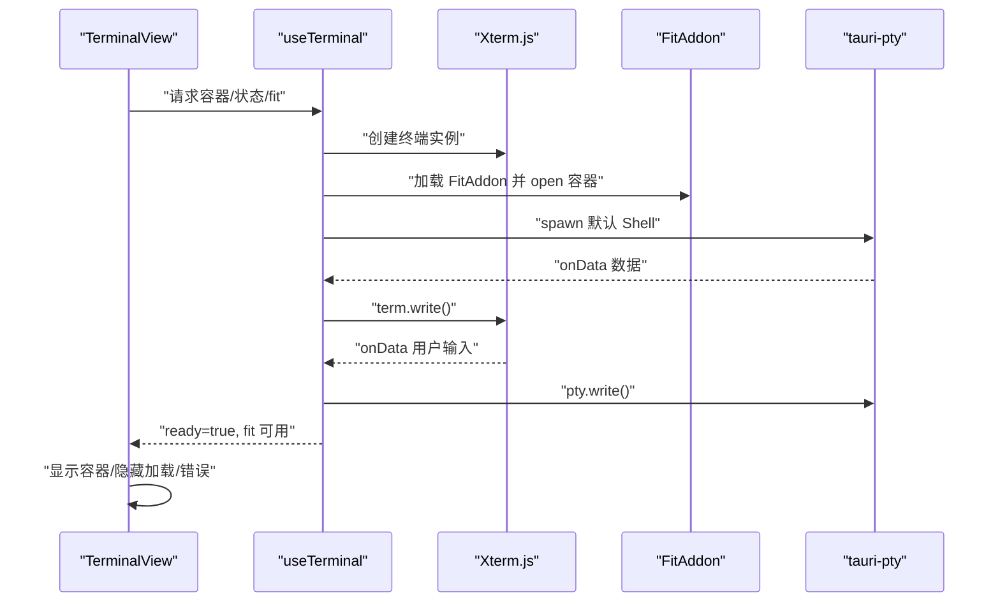
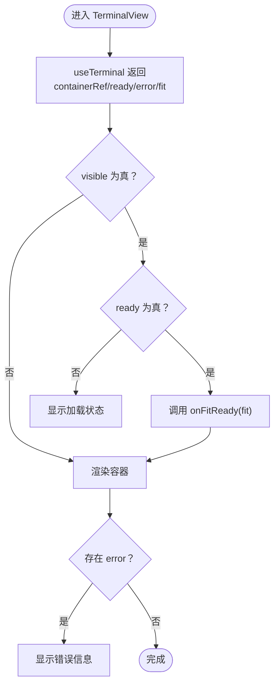
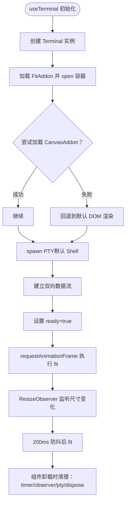
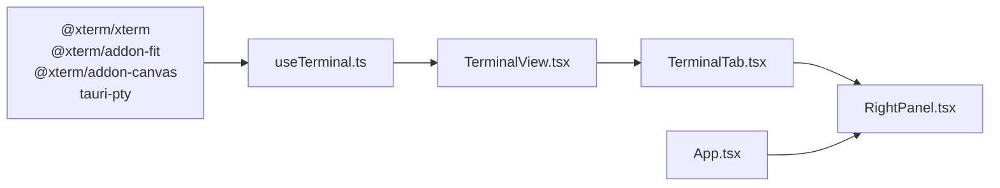

# 终端视图组件

<cite>
**本文引用的文件**
- [TerminalView.tsx](file://src/components/terminal/TerminalView.tsx)
- [useTerminal.ts](file://src/components/terminal/useTerminal.ts)
- [terminal-theme.ts](file://src/components/terminal/terminal-theme.ts)
- [TerminalTab.tsx](file://src/components/terminal/TerminalTab.tsx)
- [RightPanel.tsx](file://src/components/RightPanel.tsx)
- [App.tsx](file://src/App.tsx)
- [package.json](file://package.json)
</cite>

## 目录
1. [简介](#简介)
2. [项目结构](#项目结构)
3. [核心组件](#核心组件)
4. [架构总览](#架构总览)
5. [详细组件分析](#详细组件分析)
6. [依赖分析](#依赖分析)
7. [性能考虑](#性能考虑)
8. [故障排除指南](#故障排除指南)
9. [结论](#结论)
10. [附录](#附录)

## 简介
本文件面向“终端视图组件”的技术文档，系统性解析 TerminalView 组件的实现原理与使用方法，重点涵盖以下方面：
- Xterm.js 与 PTY 的集成方式
- DOM 容器管理与生命周期控制
- 属性配置（cwd、visible、onFitReady）
- 状态管理（ready、error）
- 与 useTerminal Hook 的协作机制
- 错误处理与加载状态显示
- 使用示例、最佳实践与常见问题解决方案

## 项目结构
终端相关模块位于 src/components/terminal 目录，主要文件如下：
- TerminalView.tsx：终端视图组件，负责渲染容器与展示加载/错误状态
- useTerminal.ts：自定义 Hook，封装 Xterm.js 与 PTY 的完整生命周期
- terminal-theme.ts：终端主题配置（亮色/暗色）
- TerminalTab.tsx：多标签终端管理器，协调多个 TerminalView 实例
- RightPanel.tsx：右侧面板集成点，按需懒加载 TerminalTab
- App.tsx：全局主题提供者，确保终端主题随应用主题切换
- package.json：声明 Xterm.js、FitAddon、CanvasAddon、tauri-pty 等依赖

图表来源
- [TerminalView.tsx:1-48](file://src/components/terminal/TerminalView.tsx#L1-L48)
- [useTerminal.ts:1-202](file://src/components/terminal/useTerminal.ts#L1-L202)
- [terminal-theme.ts:1-58](file://src/components/terminal/terminal-theme.ts#L1-L58)
- [TerminalTab.tsx:1-156](file://src/components/terminal/TerminalTab.tsx#L1-L156)
- [RightPanel.tsx:30-229](file://src/components/RightPanel.tsx#L30-L229)
- [App.tsx:15-27](file://src/App.tsx#L15-L27)
- [package.json:14-36](file://package.json#L14-L36)

章节来源
- [TerminalView.tsx:1-48](file://src/components/terminal/TerminalView.tsx#L1-L48)
- [useTerminal.ts:1-202](file://src/components/terminal/useTerminal.ts#L1-L202)
- [terminal-theme.ts:1-58](file://src/components/terminal/terminal-theme.ts#L1-L58)
- [TerminalTab.tsx:1-156](file://src/components/terminal/TerminalTab.tsx#L1-L156)
- [RightPanel.tsx:30-229](file://src/components/RightPanel.tsx#L30-L229)
- [App.tsx:15-27](file://src/App.tsx#L15-L27)
- [package.json:14-36](file://package.json#L14-L36)

## 核心组件
- TerminalView：单个终端视图容器，负责挂载 Xterm.js、显示加载/错误状态，并通过 onFitReady 将 fit 能力暴露给父组件
- useTerminal：Hook，负责：
  - 初始化 Xterm.js 终端与 FitAddon
  - 尝试加载 Canvas 渲染器（失败则回退）
  - 启动 PTY 进程（根据平台选择默认 Shell）
  - 建立双向数据通道（PTY↔Xterm）
  - 管理容器尺寸变化监听与防抖重算
  - 管理主题切换与容器可见性变化
  - 提供 ready/error 状态与 fit 能力
- TerminalTab：多标签管理器，维护多个会话并在激活态时触发 fit
- terminal-theme：提供亮色/暗色主题映射，随应用主题动态切换

章节来源
- [TerminalView.tsx:15-47](file://src/components/terminal/TerminalView.tsx#L15-L47)
- [useTerminal.ts:33-201](file://src/components/terminal/useTerminal.ts#L33-L201)
- [terminal-theme.ts:6-57](file://src/components/terminal/terminal-theme.ts#L6-L57)
- [TerminalTab.tsx:19-155](file://src/components/terminal/TerminalTab.tsx#L19-L155)

## 架构总览
TerminalView 通过 useTerminal 获取容器引用、ready/error 状态与 fit 能力；useTerminal 内部创建 Xterm.js 实例与 FitAddon，并通过 tauri-pty 启动 PTY，建立双向数据流。TerminalTab 负责多标签管理与可见性控制，RightPanel 作为集成入口按需加载 TerminalTab。

图表来源
- [TerminalView.tsx:15-47](file://src/components/terminal/TerminalView.tsx#L15-L47)
- [useTerminal.ts:64-124](file://src/components/terminal/useTerminal.ts#L64-L124)

章节来源
- [TerminalView.tsx:15-47](file://src/components/terminal/TerminalView.tsx#L15-L47)
- [useTerminal.ts:64-124](file://src/components/terminal/useTerminal.ts#L64-L124)

## 详细组件分析

### TerminalView 组件
- 职责
  - 接收 cwd、visible、onFitReady 三个属性
  - 通过 useTerminal 获取 containerRef、ready、error、fit
  - 在 ready 时将 fit 传给父组件；渲染容器；在未就绪或出错时显示对应状态
- 关键行为
  - 依赖 useTheme 获取 resolvedTheme，用于主题透传
  - visible 为 true 且 ready 时，延迟一帧触发 fit，避免容器尺寸未就绪导致的计算异常
  - 加载状态：未 ready 且无 error 时显示旋转指示器与提示文本
  - 错误状态：error 存在时居中显示错误信息

图表来源
- [TerminalView.tsx:15-47](file://src/components/terminal/TerminalView.tsx#L15-L47)

章节来源
- [TerminalView.tsx:15-47](file://src/components/terminal/TerminalView.tsx#L15-L47)

### useTerminal Hook
- 参数与返回
  - 输入：cwd、visible、resolvedTheme
  - 输出：containerRef、ready、error、terminal、fit
- 初始化流程
  - 创建 Terminal 实例，设置字体、光标、滚动、主题等选项
  - 加载 FitAddon 并 open 容器
  - 尝试加载 CanvasAddon（失败则回退）
  - 通过 tauri-pty spawn 默认 Shell（Windows 使用 PowerShell，类 Unix 使用 zsh），设置初始 cols/rows 与环境变量
  - 建立双向数据通道：PTY→term.write 与 term.onData→pty.write
  - 注册 PTY onExit 事件，输出“进程已退出”提示
  - 设置 ready=true，并在下一帧执行 fit
- 生命周期清理
  - 清理防抖定时器与 ResizeObserver
  - kill PTY 进程
  - dispose Xterm 实例
- 主题与可见性
  - 监听 resolvedTheme 变化，动态更新终端主题
  - 监听 visible 为真且 ready 时，触发 fit
- 尺寸适配
  - 使用 ResizeObserver 监听容器尺寸变化，200ms 防抖后调用 fit
  - fit 内部先 fitAddon.fit()，再同步 PTY 尺寸

图表来源
- [useTerminal.ts:64-151](file://src/components/terminal/useTerminal.ts#L64-L151)
- [useTerminal.ts:160-192](file://src/components/terminal/useTerminal.ts#L160-L192)

章节来源
- [useTerminal.ts:33-201](file://src/components/terminal/useTerminal.ts#L33-L201)

### TerminalTab 多标签管理器
- 功能
  - 维护会话列表与激活 ID
  - 新建/关闭标签，自动切换到相邻标签或置空
  - 拖拽调整左侧标签栏宽度
  - 当面板重新可见时，触发当前激活终端的 fit
- 与 TerminalView 的协作
  - 通过 onFitReady 接收 fit 函数，保存到状态以便在可见性变化时调用
  - 激活态容器可见，非激活态容器隐藏，避免不必要的渲染与计算

章节来源
- [TerminalTab.tsx:19-155](file://src/components/terminal/TerminalTab.tsx#L19-L155)

### 主题与集成
- 主题来源
  - terminal-theme.ts 提供亮色/暗色主题映射
  - useTerminal 根据 resolvedTheme 动态更新终端主题
  - App.tsx 将 resolvedTheme 同步至 antd ConfigProvider，保证 UI 一致性
- 集成入口
  - RightPanel.tsx 懒加载 TerminalTab，并在 zsh 标签激活时显示

章节来源
- [terminal-theme.ts:6-57](file://src/components/terminal/terminal-theme.ts#L6-L57)
- [useTerminal.ts:154-158](file://src/components/terminal/useTerminal.ts#L154-L158)
- [App.tsx:15-27](file://src/App.tsx#L15-L27)
- [RightPanel.tsx:34-713](file://src/components/RightPanel.tsx#L34-L713)

## 依赖分析
- 外部依赖
  - @xterm/xterm：终端内核
  - @xterm/addon-fit：终端尺寸适配
  - @xterm/addon-canvas：Canvas 渲染器（可选）
  - tauri-pty：跨平台伪终端（PTY）
- 内部依赖
  - TerminalView 依赖 useTerminal
  - TerminalTab 依赖 TerminalView
  - App.tsx 与 RightPanel.tsx 作为集成层

图表来源
- [package.json:26-35](file://package.json#L26-L35)
- [useTerminal.ts:2-6](file://src/components/terminal/useTerminal.ts#L2-L6)
- [TerminalView.tsx:1-3](file://src/components/terminal/TerminalView.tsx#L1-L3)
- [TerminalTab.tsx:4-6](file://src/components/terminal/TerminalTab.tsx#L4-L6)
- [RightPanel.tsx:34](file://src/components/RightPanel.tsx#L34)
- [App.tsx:13](file://src/App.tsx#L13)

章节来源
- [package.json:14-36](file://package.json#L14-L36)
- [useTerminal.ts:1-8](file://src/components/terminal/useTerminal.ts#L1-L8)
- [TerminalView.tsx:1-3](file://src/components/terminal/TerminalView.tsx#L1-L3)
- [TerminalTab.tsx:4-6](file://src/components/terminal/TerminalTab.tsx#L4-L6)
- [RightPanel.tsx:34](file://src/components/RightPanel.tsx#L34)
- [App.tsx:13](file://src/App.tsx#L13)

## 性能考虑
- 渲染器选择
  - 优先加载 CanvasAddon，提升渲染性能；失败则回退 DOM 渲染，保证可用性
- 尺寸适配
  - ResizeObserver + 200ms 防抖，降低频繁重排带来的开销
  - fitAddon.fit() 与 pty.resize 同步进行，避免闪烁与布局抖动
- 生命周期
  - 卸载时及时清理定时器与观察器，避免内存泄漏
  - 仅在 cwd 变化时重建终端，减少不必要的初始化成本
- 可见性优化
  - TerminalView 在非激活态不渲染容器，TerminalTab 仅在激活态触发 fit

章节来源
- [useTerminal.ts:85-90](file://src/components/terminal/useTerminal.ts#L85-L90)
- [useTerminal.ts:160-192](file://src/components/terminal/useTerminal.ts#L160-L192)
- [useTerminal.ts:131-150](file://src/components/terminal/useTerminal.ts#L131-L150)
- [TerminalView.tsx:15-24](file://src/components/terminal/TerminalView.tsx#L15-L24)
- [TerminalTab.tsx:140-151](file://src/components/terminal/TerminalTab.tsx#L140-L151)

## 故障排除指南
- 终端启动失败
  - 现象：显示错误信息
  - 原因：spawn PTY 时异常
  - 处理：检查默认 Shell 是否可用、工作目录权限、环境变量（TERM/COLORTERM）
- fit 异常
  - 现象：fitAddon.fit() 抛异常
  - 原因：容器 display:none 或尺寸尚未确定
  - 处理：确保容器可见且有尺寸后再调用 fit；组件内部已捕获该异常
- 渲染卡顿
  - 现象：窗口缩放时卡顿
  - 原因：未启用 CanvasAddon 或 ResizeObserver 频繁触发
  - 处理：确认 CanvasAddon 可用；检查是否正确使用防抖策略
- 主题不生效
  - 现象：终端颜色与应用主题不一致
  - 原因：resolvedTheme 未正确传递或未触发主题更新
  - 处理：确保 App.tsx 中 ThemeProvider 正常工作，useTerminal 监听 resolvedTheme 并更新主题

章节来源
- [useTerminal.ts:105-109](file://src/components/terminal/useTerminal.ts#L105-L109)
- [useTerminal.ts:51-56](file://src/components/terminal/useTerminal.ts#L51-L56)
- [useTerminal.ts:85-90](file://src/components/terminal/useTerminal.ts#L85-L90)
- [useTerminal.ts:154-158](file://src/components/terminal/useTerminal.ts#L154-L158)

## 结论
TerminalView 与 useTerminal 的组合提供了稳定、高性能的终端体验：Xterm.js 与 PTY 的无缝集成、完善的生命周期管理、灵活的主题与可见性控制，以及对错误与加载状态的清晰反馈。通过 TerminalTab 的多标签管理与 RightPanel 的集成，用户可在应用界面中高效地打开、切换与管理多个终端会话。

## 附录

### 组件属性与状态说明
- TerminalView
  - cwd?: 字符串，工作目录（影响 PTY 启动时的 CWD）
  - visible?: 布尔，是否可见（影响 fit 调用时机）
  - onFitReady?: 回调，接收 fit 函数以供父组件使用
  - ready: 布尔，终端是否已就绪
  - error: 字符串|null，错误信息
- useTerminal
  - 返回 containerRef、ready、error、terminal、fit
  - 内部管理 PTY 生命周期与容器尺寸监听

章节来源
- [TerminalView.tsx:5-9](file://src/components/terminal/TerminalView.tsx#L5-L9)
- [useTerminal.ts:22-28](file://src/components/terminal/useTerminal.ts#L22-L28)

### 使用示例与最佳实践
- 基本用法
  - 在需要的地方引入 TerminalView，并传入 visible 控制可见性
  - 通过 onFitReady 获取 fit 函数，在外部容器显示/隐藏时调用以刷新布局
- 最佳实践
  - 仅在必要时将 TerminalView 挂载到 DOM，避免无意义的渲染
  - 使用 TerminalTab 管理多标签，利用其内置的 fit 回调与可见性控制
  - 确保 resolvedTheme 正确传递，以获得一致的主题体验
  - 如需自定义工作目录，传入 cwd；注意权限与路径有效性
- 常见问题
  - 若出现“终端启动失败”，优先检查默认 Shell 与环境变量
  - 若出现“进程已退出”提示，确认 PTY 进程是否正常运行
  - 若终端显示异常或卡顿，确认 CanvasAddon 可用并启用防抖策略

章节来源
- [TerminalView.tsx:15-24](file://src/components/terminal/TerminalView.tsx#L15-L24)
- [TerminalTab.tsx:19-155](file://src/components/terminal/TerminalTab.tsx#L19-L155)
- [useTerminal.ts:95-109](file://src/components/terminal/useTerminal.ts#L95-L109)