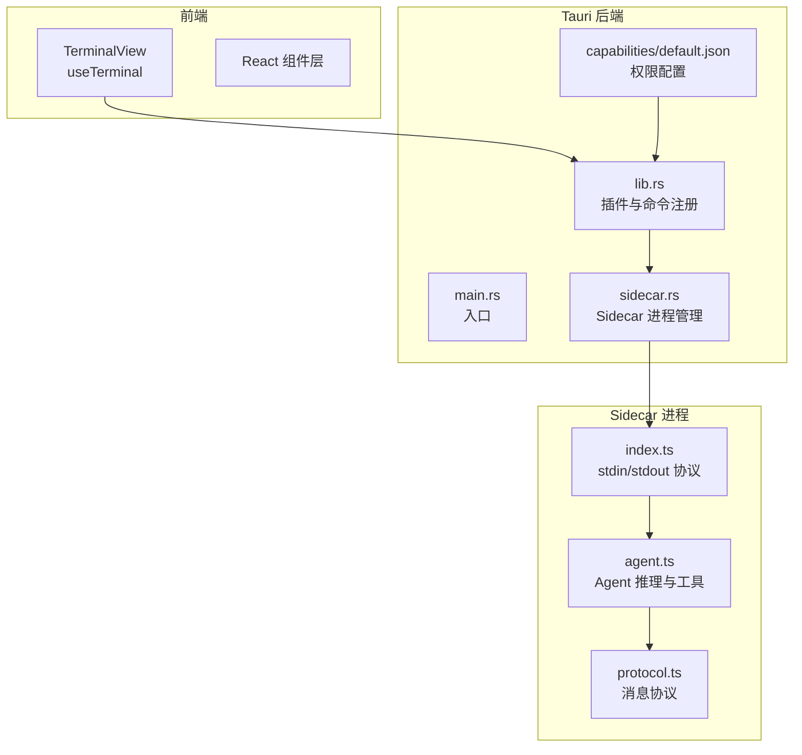
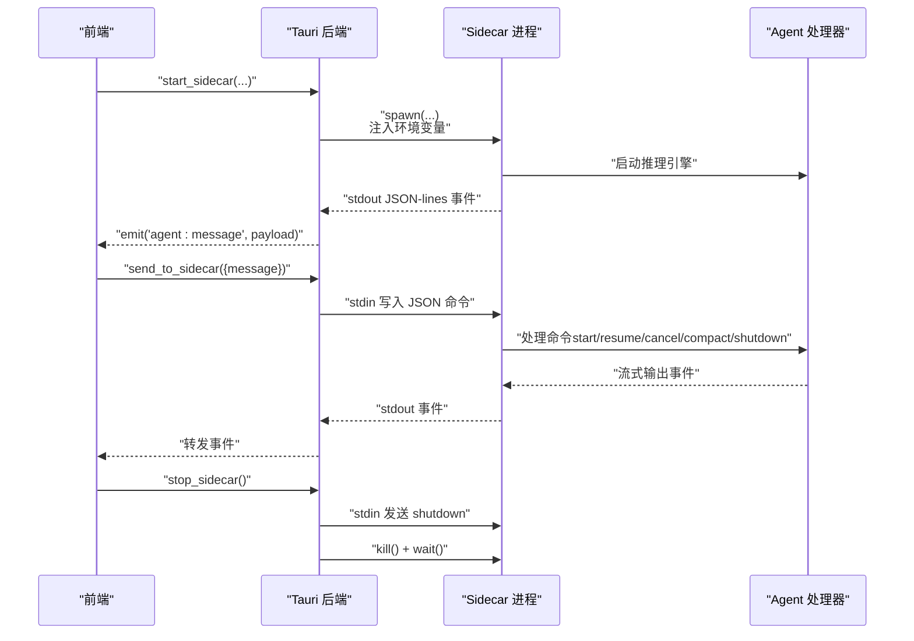
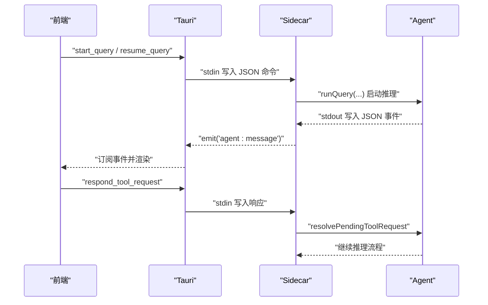
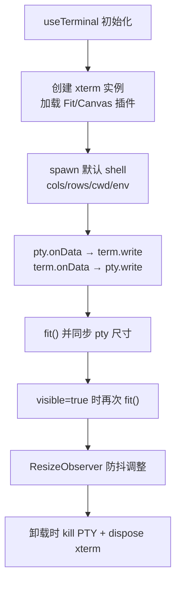
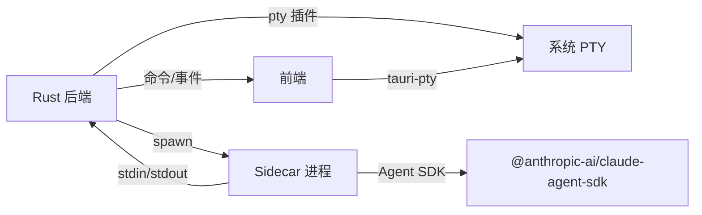

# 进程管理

<cite>
**本文引用的文件**
- [src-tauri/src/main.rs](file://src-tauri/src/main.rs)
- [src-tauri/src/lib.rs](file://src-tauri/src/lib.rs)
- [src-tauri/src/sidecar.rs](file://src-tauri/src/sidecar.rs)
- [src-tauri/capabilities/default.json](file://src-tauri/capabilities/default.json)
- [src-tauri/tauri.conf.json](file://src-tauri/tauri.conf.json)
- [Cargo.toml](file://src-tauri/Cargo.toml)
- [sidecar/src/index.ts](file://sidecar/src/index.ts)
- [sidecar/src/agent.ts](file://sidecar/src/agent.ts)
- [sidecar/src/protocol.ts](file://sidecar/src/protocol.ts)
- [src/components/terminal/TerminalView.tsx](file://src/components/terminal/TerminalView.tsx)
- [src/components/terminal/useTerminal.ts](file://src/components/terminal/useTerminal.ts)
- [src/types/terminal.ts](file://src/types/terminal.ts)
</cite>

## 目录
1. [简介](#简介)
2. [项目结构](#项目结构)
3. [核心组件](#核心组件)
4. [架构总览](#架构总览)
5. [详细组件分析](#详细组件分析)
6. [依赖关系分析](#依赖关系分析)
7. [性能考量](#性能考量)
8. [故障排除指南](#故障排除指南)
9. [结论](#结论)
10. [附录](#附录)

## 简介
本文件围绕终端进程管理功能进行深入技术文档编写，涵盖以下方面：
- 进程生命周期管理：创建、启动、监控、终止
- PTY（伪终端设备）工作原理与实现细节
- 进程间通信（IPC）方式、标准输入输出处理、信号处理机制
- 进程状态跟踪、错误处理、资源清理策略
- 安全考虑、性能优化建议、故障排除指南
- 与 Tauri 后端的交互方式与权限控制

## 项目结构
该项目采用前后端分离架构：
- 前端基于 React + TypeScript，负责用户界面与交互
- 后端基于 Tauri（Rust），负责系统级进程管理与安全控制
- Sidecar 是一个独立的 Node.js 进程，承载 Claude Agent 的推理与工具调用能力
- 终端模块通过 tauri-pty 与系统 PTY 交互，实现伪终端驱动

图表来源
- [src-tauri/src/main.rs:1-7](file://src-tauri/src/main.rs#L1-L7)
- [src-tauri/src/lib.rs:197-390](file://src-tauri/src/lib.rs#L197-L390)
- [src-tauri/src/sidecar.rs:1-359](file://src-tauri/src/sidecar.rs#L1-L359)
- [src-tauri/capabilities/default.json:1-41](file://src-tauri/capabilities/default.json#L1-L41)
- [sidecar/src/index.ts:1-145](file://sidecar/src/index.ts#L1-L145)
- [sidecar/src/agent.ts:1-606](file://sidecar/src/agent.ts#L1-L606)
- [sidecar/src/protocol.ts:1-252](file://sidecar/src/protocol.ts#L1-L252)

章节来源
- [src-tauri/src/main.rs:1-7](file://src-tauri/src/main.rs#L1-L7)
- [src-tauri/src/lib.rs:197-390](file://src-tauri/src/lib.rs#L197-L390)
- [src-tauri/src/sidecar.rs:1-359](file://src-tauri/src/sidecar.rs#L1-L359)
- [src-tauri/capabilities/default.json:1-41](file://src-tauri/capabilities/default.json#L1-L41)
- [sidecar/src/index.ts:1-145](file://sidecar/src/index.ts#L1-L145)
- [sidecar/src/agent.ts:1-606](file://sidecar/src/agent.ts#L1-L606)
- [sidecar/src/protocol.ts:1-252](file://sidecar/src/protocol.ts#L1-L252)

## 核心组件
- Tauri 后端入口与插件注册：负责初始化窗口状态、注入 Node.js 运行时、注册命令与插件
- Sidecar 进程管理：负责启动/停止/监控 Sidecar，转发 stdout 事件，处理 stdin 输入
- 终端模块：封装 xterm.js 与 tauri-pty，实现 PTY 生命周期管理与双向数据流
- Sidecar 协议与 Agent：定义 JSON-lines 协议，处理查询、工具调用、会话压缩、错误与进度事件

章节来源
- [src-tauri/src/lib.rs:197-390](file://src-tauri/src/lib.rs#L197-L390)
- [src-tauri/src/sidecar.rs:1-359](file://src-tauri/src/sidecar.rs#L1-L359)
- [src/components/terminal/useTerminal.ts:1-202](file://src/components/terminal/useTerminal.ts#L1-L202)
- [sidecar/src/index.ts:1-145](file://sidecar/src/index.ts#L1-L145)
- [sidecar/src/agent.ts:1-606](file://sidecar/src/agent.ts#L1-L606)
- [sidecar/src/protocol.ts:1-252](file://sidecar/src/protocol.ts#L1-L252)

## 架构总览
整体架构分为三层：
- 前端层：渲染终端 UI，接收用户输入并通过 Tauri 命令与后端交互
- 后端层（Tauri）：管理 Sidecar 进程，注入环境变量，转发事件，暴露系统能力
- Sidecar 层：执行 Claude Agent 推理，通过 JSON-lines 与后端通信

图表来源
- [src-tauri/src/sidecar.rs:60-214](file://src-tauri/src/sidecar.rs#L60-L214)
- [sidecar/src/index.ts:96-128](file://sidecar/src/index.ts#L96-L128)
- [sidecar/src/agent.ts:470-497](file://sidecar/src/agent.ts#L470-L497)

## 详细组件分析

### Sidecar 进程管理（Rust）
- 进程创建与环境注入：根据开发/生产模式选择 Node 可执行路径，注入 API Key、Base URL、自定义环境变量，清理可能污染的 Anthropic 环境变量，隔离 Claude 配置根目录
- 进程监控：启动 stdout/stderr 读取线程，将 JSON-lines 事件通过 Tauri 事件转发至前端；监听 stdout 关闭事件，触发 sidecar-exit
- 进程终止：先尝试优雅关闭（发送 shutdown 命令），等待短暂时间后强制 kill 并 wait
- 状态查询：通过共享状态判断 Sidecar 是否运行

```mermaid
flowchart TD
Start(["start_sidecar"]) --> CheckRunning["检查是否已有运行中的 Sidecar"]
CheckRunning --> Spawn["spawn 子进程<br/>Stdin/Stdout/Stderr 管道"]
Spawn --> InjectEnv["注入环境变量<br/>清理 Anthropic 变量<br/>隔离 CLAUDE_CONFIG_DIR"]
InjectEnv --> Threads["启动 stdout/stderr 读取线程"]
Threads --> Ready["返回成功"]
SendMsg["send_to_sidecar"] --> HasHandle{"是否有有效句柄？"}
HasHandle --> |是| WriteStdin["写入 JSON 命令到 stdin"]
HasHandle --> |否| NotRunning["返回未运行错误"]
Stop["stop_sidecar"] --> Graceful["写入 shutdown 命令"]
Graceful --> Sleep["等待 500ms"]
Sleep --> Kill["kill() + wait()"]
Kill --> Clear["清空状态"]
```

图表来源
- [src-tauri/src/sidecar.rs:60-270](file://src-tauri/src/sidecar.rs#L60-L270)

章节来源
- [src-tauri/src/sidecar.rs:1-359](file://src-tauri/src/sidecar.rs#L1-L359)

### Sidecar 协议与 Agent（Node.js）
- 协议定义：前端通过 Tauri 命令写入 stdin，Sidecar 逐行读取 JSON 命令；Agent 将推理事件以 JSON-lines 输出到 stdout
- 命令类型：start_query、resume_query、cancel_query、compact_query、respond_tool_request、shutdown
- 事件类型：system/init、assistant（text/thinking/delta）、tool_use、tool_result、result、error、compaction、usage_update、ask_user_question、spec_written
- Agent 处理：将 SDK 的异步生成器转换为流式事件；处理 AskUserQuestion 的用户回复；支持会话压缩与 token 统计

图表来源
- [sidecar/src/index.ts:96-128](file://sidecar/src/index.ts#L96-L128)
- [sidecar/src/agent.ts:470-497](file://sidecar/src/agent.ts#L470-L497)
- [sidecar/src/protocol.ts:13-78](file://sidecar/src/protocol.ts#L13-L78)

章节来源
- [sidecar/src/index.ts:1-145](file://sidecar/src/index.ts#L1-L145)
- [sidecar/src/agent.ts:1-606](file://sidecar/src/agent.ts#L1-L606)
- [sidecar/src/protocol.ts:1-252](file://sidecar/src/protocol.ts#L1-L252)

### 终端进程与 PTY（前端）
- 终端初始化：创建 xterm 实例，加载 FitAddon 与 CanvasAddon，绑定容器
- PTY 启动：通过 tauri-pty spawn，默认 shell 依据平台选择；设置 TERM/COLORTERM 环境变量
- 双向数据流：pty.onData → term.write；term.onData → pty.write
- 生命周期：容器可见性变化、尺寸变化（ResizeObserver + 防抖）、卸载时 kill PTY 并 dispose xterm
- 退出提示：PTY onExit 时在终端写入“进程已退出”提示

图表来源
- [src/components/terminal/useTerminal.ts:60-151](file://src/components/terminal/useTerminal.ts#L60-L151)

章节来源
- [src/components/terminal/useTerminal.ts:1-202](file://src/components/terminal/useTerminal.ts#L1-L202)
- [src/components/terminal/TerminalView.tsx:1-48](file://src/components/terminal/TerminalView.tsx#L1-L48)
- [src/types/terminal.ts:1-6](file://src/types/terminal.ts#L1-L6)

### 与 Tauri 后端的交互与权限控制
- 命令注册：后端在 setup 阶段注册 sidecar 相关命令与数据库、网络、反馈等命令
- 插件：启用 tauri-plugin-pty、window-state、notification、deep-link 等
- 权限：default.json 中声明 pty:default、fs 读写范围、窗口状态、通知、深链等权限
- 资源打包：tauri.conf.json 中声明 resources/sidecar 与 resources/node-runtime，生产模式下内置 Node.js 运行时

章节来源
- [src-tauri/src/lib.rs:344-387](file://src-tauri/src/lib.rs#L344-L387)
- [src-tauri/capabilities/default.json:1-41](file://src-tauri/capabilities/default.json#L1-L41)
- [src-tauri/tauri.conf.json:26-32](file://src-tauri/tauri.conf.json#L26-L32)
- [src-tauri/Cargo.toml:20-39](file://src-tauri/Cargo.toml#L20-L39)

## 依赖关系分析
- Rust 侧依赖 tauri-plugin-pty 提供 PTY 能力；通过 tauri::Emitter 将事件转发至前端
- Sidecar 依赖 @anthropic-ai/claude-agent-sdk 与 zod；通过 readline 逐行解析 stdin 命令
- 前端依赖 @xterm/xterm、@xterm/addon-fit、@xterm/addon-canvas 与 tauri-pty
- 权限与资源：capabilities/default.json 与 tauri.conf.json 控制访问范围与打包资源

图表来源
- [src-tauri/src/lib.rs:202-202](file://src-tauri/src/lib.rs#L202-L202)
- [src-tauri/src/sidecar.rs:151-164](file://src-tauri/src/sidecar.rs#L151-L164)
- [sidecar/src/index.ts:9-18](file://sidecar/src/index.ts#L9-L18)

章节来源
- [src-tauri/src/lib.rs:197-390](file://src-tauri/src/lib.rs#L197-L390)
- [src-tauri/src/sidecar.rs:1-359](file://src-tauri/src/sidecar.rs#L1-L359)
- [sidecar/src/index.ts:1-145](file://sidecar/src/index.ts#L1-L145)

## 性能考量
- 终端渲染：优先加载 CanvasAddon，失败则回退 DOM；合理设置 scrollback 与字体大小，避免过度重绘
- 尺寸调整：使用 ResizeObserver + 防抖（200ms）减少频繁 resize 导致的 PTY 重配
- Sidecar IO：stdout/stderr 读取使用缓冲 Reader，避免阻塞主线程；事件转发采用异步线程
- 进程管理：优雅关闭先写入 shutdown，再强制 kill，兼顾稳定性与及时回收
- 环境隔离：生产模式注入内置 Node.js 与 npm 全局目录，避免权限问题导致的额外开销

## 故障排除指南
- 终端无法启动
  - 检查默认 shell 是否可用（Windows: PowerShell；Unix: zsh）
  - 查看 useTerminal 初始化错误回调，确认 spawn 返回的错误信息
  - 确认容器可见性与尺寸，fit() 在 display:none 时可能抛异常
- Sidecar 无响应或退出
  - 检查 stdout 事件是否被正确转发；关注 agent:sidecar-exit 事件
  - 确认 stdin 写入的 JSON 命令格式正确，避免无效 JSON 导致的错误事件
  - 若 Sidecar 未运行，send_to_sidecar 会返回“未运行”的错误
- 权限不足
  - 检查 capabilities/default.json 中 fs 作用域与 pty 权限是否满足需求
  - 确认 tauri.conf.json 中 resources/sidecar 与 node-runtime 资源已正确打包
- 性能问题
  - 调整终端字体大小与行高，减少渲染压力
  - 避免频繁触发 resize；必要时合并多次尺寸变更
  - 降低 scrollback 或在长时间会话后清理历史

章节来源
- [src/components/terminal/useTerminal.ts:105-109](file://src/components/terminal/useTerminal.ts#L105-L109)
- [src-tauri/src/sidecar.rs:238-242](file://src-tauri/src/sidecar.rs#L238-L242)
- [src-tauri/capabilities/default.json:22-33](file://src-tauri/capabilities/default.json#L22-L33)
- [src-tauri/tauri.conf.json:29-32](file://src-tauri/tauri.conf.json#L29-L32)

## 结论
本项目通过 Tauri 后端与 Sidecar 的协同，实现了安全可控的进程生命周期管理与终端驱动。前端通过 tauri-pty 与系统 PTY 交互，后端负责 Sidecar 的启动、监控与事件转发，Sidecar 则专注于 Claude Agent 的推理与工具调用。配合完善的权限控制与资源打包策略，系统在安全性、稳定性与性能之间取得平衡。

## 附录
- 终端会话类型定义：用于标识会话元信息（id、标题、创建时间）

章节来源
- [src/types/terminal.ts:1-6](file://src/types/terminal.ts#L1-L6)