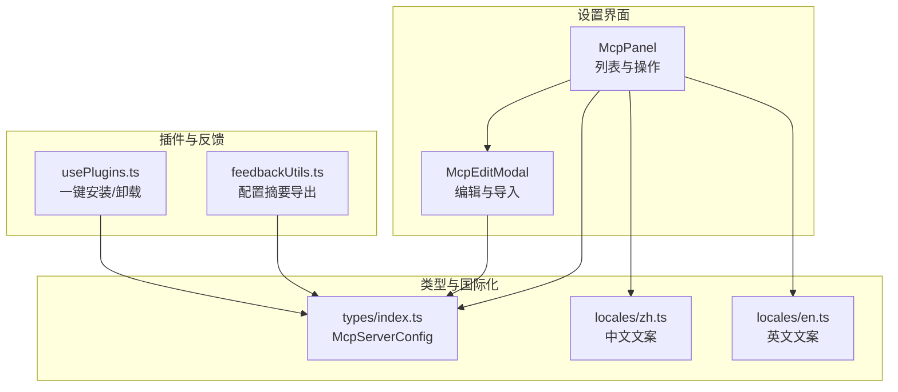
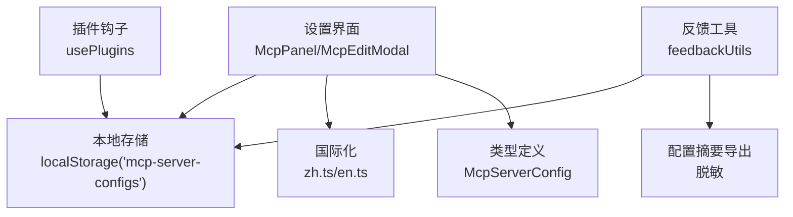
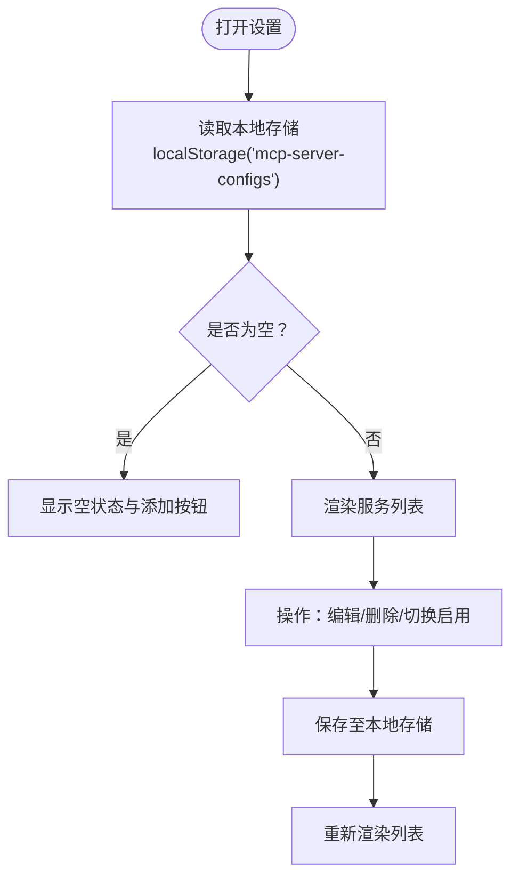
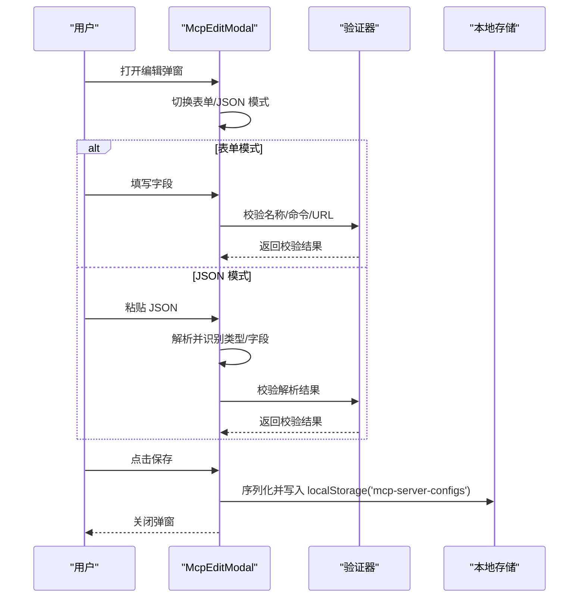
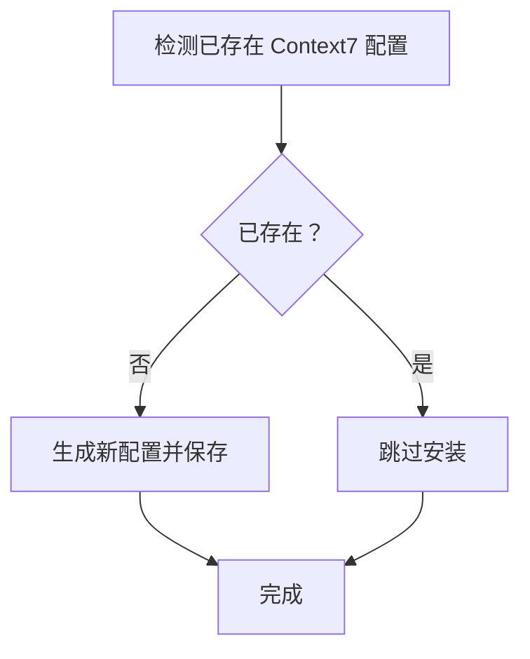
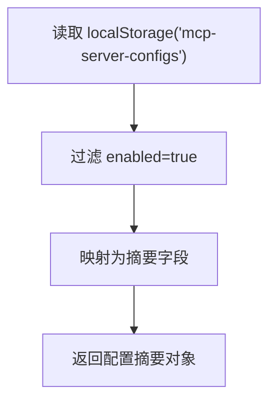
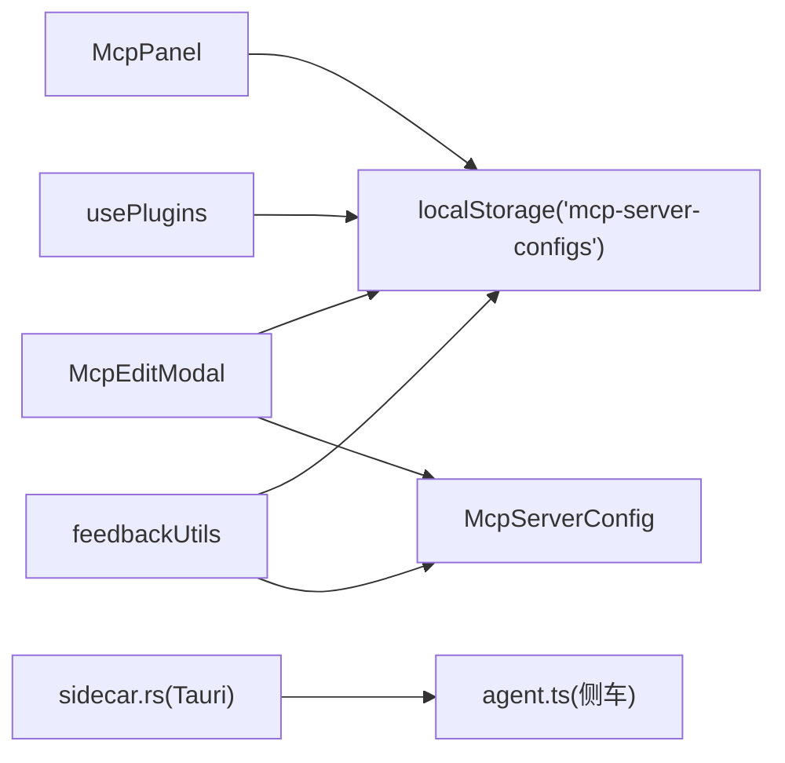

# MCP 服务配置

<cite>
**本文档引用的文件**
- [McpPanel.tsx](file://src/components/settings/McpPanel.tsx)
- [McpEditModal.tsx](file://src/components/settings/McpEditModal.tsx)
- [usePlugins.ts](file://src/hooks/usePlugins.ts)
- [feedbackUtils.ts](file://src/components/settings/feedback/feedbackUtils.ts)
- [index.ts](file://src/types/index.ts)
- [zh.ts](file://src/i18n/locales/zh.ts)
- [en.ts](file://src/i18n/locales/en.ts)
- [useAgent.ts](file://src/hooks/useAgent.ts)
- [sidecar.rs](file://src-tauri/src/sidecar.rs)
- [agent.ts](file://sidecar/src/agent.ts)
</cite>

## 目录
1. [简介](#简介)
2. [项目结构](#项目结构)
3. [核心组件](#核心组件)
4. [架构概览](#架构概览)
5. [详细组件分析](#详细组件分析)
6. [依赖关系分析](#依赖关系分析)
7. [性能考量](#性能考量)
8. [故障排除指南](#故障排除指南)
9. [结论](#结论)

## 简介
本文件面向 RabbitCoding 的 MCP（Model Context Protocol）服务配置，提供从添加、编辑、删除到测试的完整功能说明，涵盖 MCP 服务器的连接配置、认证方式、协议版本支持、服务发现与动态加载、健康检查、性能监控、错误处理与重连策略，并给出最佳实践、安全考虑与故障排除指导。

## 项目结构
围绕 MCP 服务配置的核心前端模块包括：
- 设置面板：MCP 服务列表展示与操作
- 编辑弹窗：支持三种传输类型（stdio/http/sse）与表单/JSON 导入
- 类型定义：MCP 服务配置的数据结构
- 国际化：中英文文案与占位符
- 插件集成：一键安装 Context7 等 MCP 服务
- 反馈工具：导出启用的 MCP 服务摘要（脱敏）



**图表来源**
- [McpPanel.tsx:15-155](file://src/components/settings/McpPanel.tsx#L15-L155)
- [McpEditModal.tsx:75-555](file://src/components/settings/McpEditModal.tsx#L75-L555)
- [index.ts:410-462](file://src/types/index.ts#L410-L462)
- [zh.ts:507-556](file://src/i18n/locales/zh.ts#L507-L556)
- [en.ts:507-556](file://src/i18n/locales/en.ts#L507-L556)
- [usePlugins.ts:53-195](file://src/hooks/usePlugins.ts#L53-L195)
- [feedbackUtils.ts:7-61](file://src/components/settings/feedback/feedbackUtils.ts#L7-L61)

**章节来源**
- [McpPanel.tsx:15-155](file://src/components/settings/McpPanel.tsx#L15-L155)
- [McpEditModal.tsx:75-555](file://src/components/settings/McpEditModal.tsx#L75-L555)
- [index.ts:410-462](file://src/types/index.ts#L410-L462)
- [zh.ts:507-556](file://src/i18n/locales/zh.ts#L507-L556)
- [en.ts:507-556](file://src/i18n/locales/en.ts#L507-L556)
- [usePlugins.ts:53-195](file://src/hooks/usePlugins.ts#L53-L195)
- [feedbackUtils.ts:7-61](file://src/components/settings/feedback/feedbackUtils.ts#L7-L61)

## 核心组件
- MCP 服务配置数据结构：包含唯一标识、名称、传输类型、命令/参数/环境变量（stdio）、URL/请求头（http/sse）、启用状态与创建时间戳。
- 设置面板：展示已配置的 MCP 服务列表，支持新增、编辑、删除、启用/禁用切换。
- 编辑弹窗：支持三种传输类型动态表单、环境变量与请求头的增删改、JSON 导入解析与校验。
- 插件集成：一键安装 Context7 MCP 服务，或卸载相关配置。
- 反馈工具：导出启用的 MCP 服务摘要（不含敏感信息）。

**章节来源**
- [index.ts:410-462](file://src/types/index.ts#L410-L462)
- [McpPanel.tsx:15-155](file://src/components/settings/McpPanel.tsx#L15-L155)
- [McpEditModal.tsx:75-555](file://src/components/settings/McpEditModal.tsx#L75-L555)
- [usePlugins.ts:43-47](file://src/hooks/usePlugins.ts#L43-L47)
- [feedbackUtils.ts:24-38](file://src/components/settings/feedback/feedbackUtils.ts#L24-L38)

## 架构概览
MCP 服务配置采用“本地持久化 + 前端编辑 + 插件集成”的架构。配置存储在浏览器本地存储中，编辑器负责校验与序列化，插件钩子负责一键安装/卸载，反馈工具负责导出脱敏配置摘要。



**图表来源**
- [McpPanel.tsx:17-18](file://src/components/settings/McpPanel.tsx#L17-L18)
- [McpEditModal.tsx:77-78](file://src/components/settings/McpEditModal.tsx#L77-L78)
- [usePlugins.ts:55-55](file://src/hooks/usePlugins.ts#L55-L55)
- [feedbackUtils.ts:27-38](file://src/components/settings/feedback/feedbackUtils.ts#L27-L38)
- [zh.ts:507-556](file://src/i18n/locales/zh.ts#L507-L556)
- [en.ts:507-556](file://src/i18n/locales/en.ts#L507-L556)
- [index.ts:410-462](file://src/types/index.ts#L410-L462)

## 详细组件分析

### MCP 服务配置数据模型
- 传输类型：stdio/http/sse
- stdio：command、args（数组）、env（键值对）
- http/sse：url、headers（键值对）
- 通用：id、name、enabled、createdAt

```mermaid
classDiagram
class McpServerConfig {
+string id
+string name
+McpServerType type
+string command
+string[] args
+Record~string,string~ env
+string url
+Record~string,string~ headers
+boolean enabled
+number createdAt
}
class McpServerType {
<<enumeration>>
"stdio"
"http"
"sse"
}
McpServerConfig --> McpServerType : "使用"
```

**图表来源**
- [index.ts:414-451](file://src/types/index.ts#L414-L451)

**章节来源**
- [index.ts:410-462](file://src/types/index.ts#L410-L462)

### 设置面板（McpPanel）
- 功能：展示 MCP 服务列表、新增、编辑、删除、启用/禁用切换
- 数据来源：本地存储键 'mcp-server-configs'
- 交互：空状态提示、类型标签、命令/URL 摘要显示



**图表来源**
- [McpPanel.tsx:17-52](file://src/components/settings/McpPanel.tsx#L17-L52)

**章节来源**
- [McpPanel.tsx:15-155](file://src/components/settings/McpPanel.tsx#L15-L155)

### 编辑弹窗（McpEditModal）
- 功能：表单填写与 JSON 导入两种模式
- 表单模式：动态显示 stdio/http/sse 字段，支持环境变量与请求头增删
- JSON 模式：解析多种格式（mcpServers 包裹、服务名映射、直接配置），自动填充表单
- 校验：名称必填；stdio 需命令；http/sse 需 URL；JSON 格式与内容有效性



**图表来源**
- [McpEditModal.tsx:210-267](file://src/components/settings/McpEditModal.tsx#L210-L267)
- [McpEditModal.tsx:133-208](file://src/components/settings/McpEditModal.tsx#L133-L208)
- [McpPanel.tsx:34-40](file://src/components/settings/McpPanel.tsx#L34-L40)

**章节来源**
- [McpEditModal.tsx:75-555](file://src/components/settings/McpEditModal.tsx#L75-L555)
- [zh.ts:541-556](file://src/i18n/locales/zh.ts#L541-L556)
- [en.ts:541-556](file://src/i18n/locales/en.ts#L541-L556)

### 插件集成（一键安装/卸载）
- 检测：扫描已存在的 Context7 配置
- 安装：生成新配置并追加到本地存储
- 卸载：移除相关配置项



**图表来源**
- [usePlugins.ts:43-47](file://src/hooks/usePlugins.ts#L43-L47)
- [usePlugins.ts:130-144](file://src/hooks/usePlugins.ts#L130-L144)
- [usePlugins.ts:172-176](file://src/hooks/usePlugins.ts#L172-L176)

**章节来源**
- [usePlugins.ts:43-47](file://src/hooks/usePlugins.ts#L43-L47)
- [usePlugins.ts:130-144](file://src/hooks/usePlugins.ts#L130-L144)
- [usePlugins.ts:172-176](file://src/hooks/usePlugins.ts#L172-L176)

### 反馈工具（配置摘要导出）
- 读取本地存储中的 MCP 服务配置
- 过滤启用项，导出名称、类型、启用状态
- 不包含敏感信息（如 API Key、代理地址）



**图表来源**
- [feedbackUtils.ts:24-38](file://src/components/settings/feedback/feedbackUtils.ts#L24-L38)

**章节来源**
- [feedbackUtils.ts:7-61](file://src/components/settings/feedback/feedbackUtils.ts#L7-L61)

## 依赖关系分析
- 组件耦合
  - McpPanel 依赖本地存储与国际化
  - McpEditModal 依赖类型定义、国际化与本地存储
  - usePlugins 依赖本地存储与类型定义
  - feedbackUtils 依赖类型定义与本地存储
- 外部依赖
  - Tauri 命令与事件（用于与原生侧通信，如 Sidecar 管理）
  - 侧车进程（sidecar.rs 与 agent.ts）负责 MCP 服务的生命周期与消息处理



**图表来源**
- [McpPanel.tsx:17-18](file://src/components/settings/McpPanel.tsx#L17-L18)
- [McpEditModal.tsx:77-78](file://src/components/settings/McpEditModal.tsx#L77-L78)
- [usePlugins.ts:55-55](file://src/hooks/usePlugins.ts#L55-L55)
- [feedbackUtils.ts:27-38](file://src/components/settings/feedback/feedbackUtils.ts#L27-L38)
- [sidecar.rs:60-214](file://src-tauri/src/sidecar.rs#L60-L214)
- [agent.ts:260-459](file://sidecar/src/agent.ts#L260-L459)

**章节来源**
- [McpPanel.tsx:15-155](file://src/components/settings/McpPanel.tsx#L15-L155)
- [McpEditModal.tsx:75-555](file://src/components/settings/McpEditModal.tsx#L75-L555)
- [usePlugins.ts:53-195](file://src/hooks/usePlugins.ts#L53-L195)
- [feedbackUtils.ts:7-61](file://src/components/settings/feedback/feedbackUtils.ts#L7-L61)
- [sidecar.rs:60-214](file://src-tauri/src/sidecar.rs#L60-L214)
- [agent.ts:260-459](file://sidecar/src/agent.ts#L260-L459)

## 性能考量
- 配置读写
  - 使用本地存储进行配置持久化，避免频繁网络请求
  - 列表渲染采用轻量级 DOM 结构，减少重排重绘
- 编辑体验
  - JSON 导入支持多格式解析，提升批量配置效率
  - 表单字段按类型动态显示，降低无效输入
- 侧车通信
  - 通过 Tauri 命令与事件进行消息传递，避免阻塞主线程
  - 提供看门狗机制（query watchdog）防止长时间无响应导致的假死

**章节来源**
- [McpPanel.tsx:84-142](file://src/components/settings/McpPanel.tsx#L84-L142)
- [McpEditModal.tsx:133-208](file://src/components/settings/McpEditModal.tsx#L133-L208)
- [useAgent.ts:66-95](file://src/hooks/useAgent.ts#L66-L95)

## 故障排除指南
- 常见问题
  - 无法保存配置：检查必填字段（名称、命令/URL），确认 JSON 格式正确
  - MCP 服务不可用：确认服务类型与对应字段（stdio 命令/参数，http/sse URL/Headers）
  - 插件安装失败：检查网络与包管理器权限，确保可访问公共包源
- 错误处理
  - 编辑弹窗对无效 JSON 与缺失字段进行明确提示
  - 侧车通信错误通过事件上报，便于前端统一处理
- 重连策略
  - 当前实现未内置自动重连逻辑，建议在业务层监听侧车退出事件后进行手动重启
- 安全建议
  - 不要在配置中存放敏感信息（如 API Key），使用反馈工具导出时已做脱敏
  - 仅在可信网络环境下启用 http/sse 类型的 MCP 服务

**章节来源**
- [McpEditModal.tsx:210-219](file://src/components/settings/McpEditModal.tsx#L210-L219)
- [zh.ts:541-547](file://src/i18n/locales/zh.ts#L541-L547)
- [en.ts:541-547](file://src/i18n/locales/en.ts#L541-L547)
- [feedbackUtils.ts:24-38](file://src/components/settings/feedback/feedbackUtils.ts#L24-L38)
- [useAgent.ts:106-126](file://src/hooks/useAgent.ts#L106-L126)

## 结论
RabbitCoding 的 MCP 服务配置以简洁直观的 UI 与灵活的配置模型为核心，结合本地存储与插件集成，实现了 MCP 服务的便捷管理与扩展。通过完善的校验、国际化与脱敏导出能力，提升了用户体验与安全性。建议在生产环境中配合网络诊断与侧车监控，持续优化连接稳定性与性能表现。