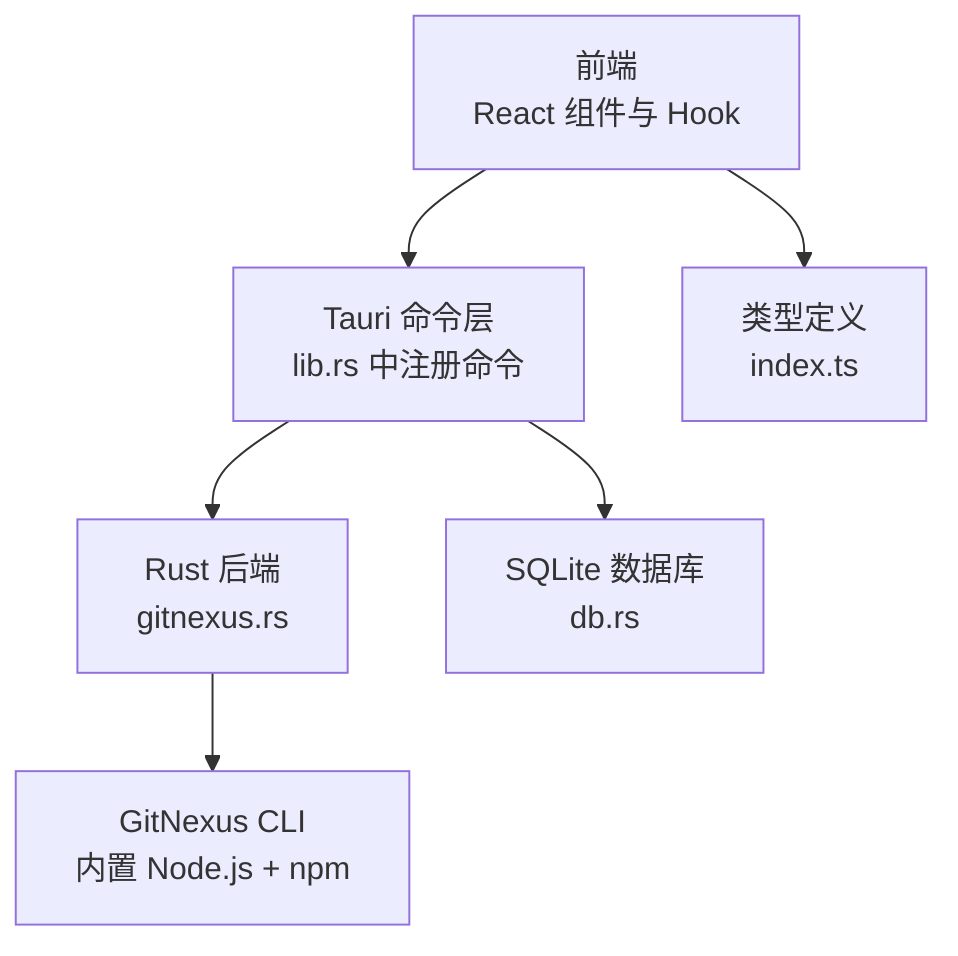
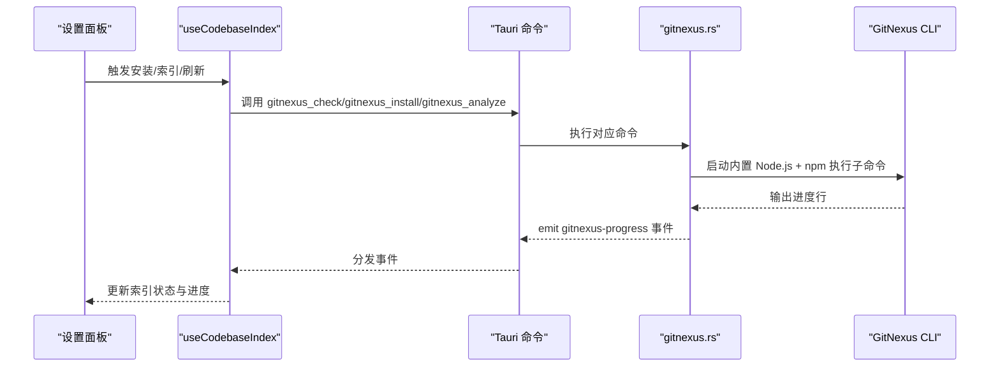
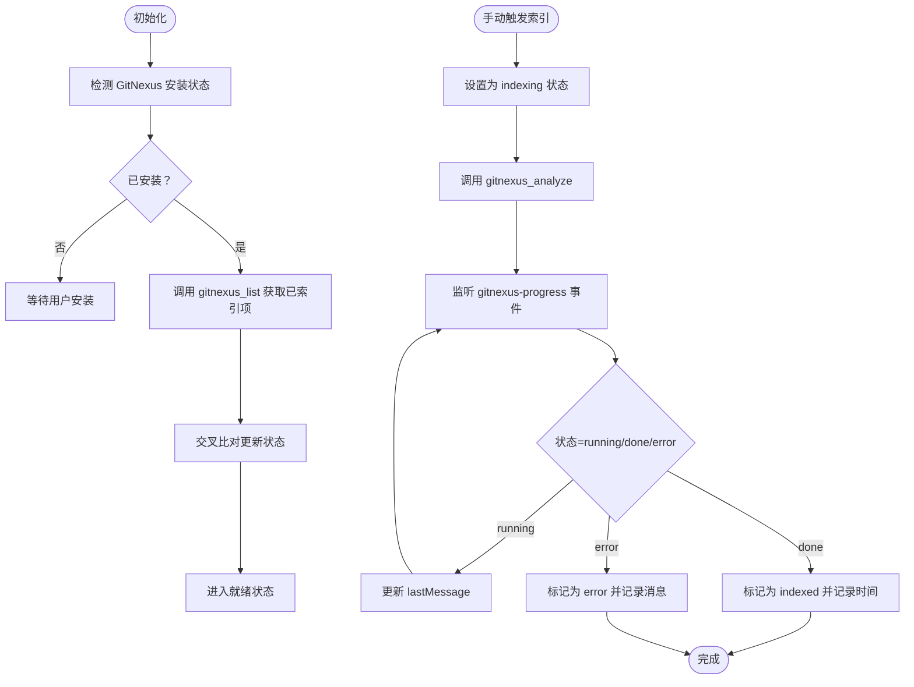
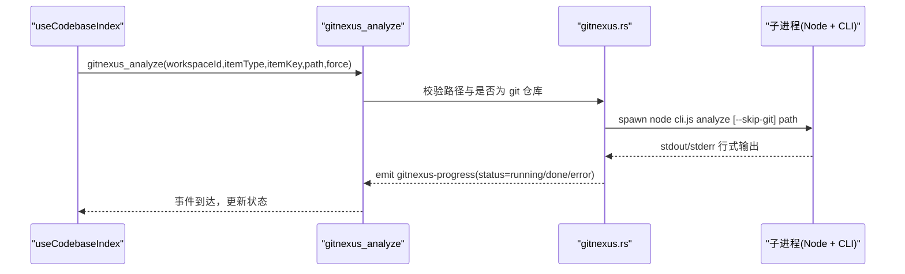
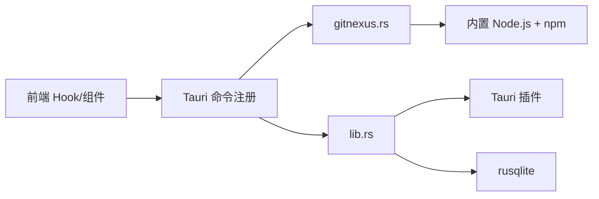

# 代码库索引配置

<cite>
**本文档引用的文件**
- [useCodebaseIndex.tsx](file://src/hooks/useCodebaseIndex.tsx)
- [CodebaseIndexPanel.tsx](file://src/components/settings/CodebaseIndexPanel.tsx)
- [gitnexus.rs](file://src-tauri/src/gitnexus.rs)
- [lib.rs](file://src-tauri/src/lib.rs)
- [index.ts](file://src/types/index.ts)
- [Cargo.toml](file://src-tauri/Cargo.toml)
- [.gitignore](file://.gitignore)
</cite>

## 目录
1. [简介](#简介)
2. [项目结构](#项目结构)
3. [核心组件](#核心组件)
4. [架构总览](#架构总览)
5. [详细组件分析](#详细组件分析)
6. [依赖关系分析](#依赖关系分析)
7. [性能考虑](#性能考虑)
8. [故障排除指南](#故障排除指南)
9. [结论](#结论)

## 简介
本文件面向 RabbitCoding 代码库的“代码库索引配置”功能，系统性阐述索引的建立、维护与优化流程，涵盖索引算法、索引范围、更新策略、存储位置、大小限制与清理机制，以及增量更新、并行处理与内存管理策略。同时提供最佳实践、性能调优建议与故障排除指导，帮助开发者高效、稳定地管理多工作区的文档与仓库索引。

## 项目结构
RabbitCoding 的索引体系由前端 React Hook、Tauri 命令与 Rust 后端三部分协同实现：
- 前端负责索引状态展示、交互控制与事件监听
- Tauri 命令桥接前端与后端，封装 GitNexus CLI 的安装、分析、列表与组同步
- Rust 后端通过内置 Node.js 运行时与 npm，确保安装与执行的隔离与一致性

图表来源
- [lib.rs:344-387](file://src-tauri/src/lib.rs#L344-L387)
- [gitnexus.rs:1-761](file://src-tauri/src/gitnexus.rs#L1-L761)
- [index.ts:563-605](file://src/types/index.ts#L563-L605)

章节来源
- [lib.rs:344-387](file://src-tauri/src/lib.rs#L344-L387)
- [gitnexus.rs:1-761](file://src-tauri/src/gitnexus.rs#L1-L761)
- [index.ts:563-605](file://src/types/index.ts#L563-L605)

## 核心组件
- 前端索引上下文与状态管理：通过 `useCodebaseIndex` Hook 维护索引项状态、安装状态与同步状态，监听进度事件并驱动 UI 更新。
- GitNexus 命令集：提供安装、检查、分析、列出、组创建、添加与同步等命令，配合事件驱动的状态更新。
- 类型系统：统一定义索引项类型、状态、进度事件与返回结构，保证前后端契约一致。

章节来源
- [useCodebaseIndex.tsx:29-46](file://src/hooks/useCodebaseIndex.tsx#L29-L46)
- [gitnexus.rs:350-761](file://src-tauri/src/gitnexus.rs#L350-L761)
- [index.ts:563-605](file://src/types/index.ts#L563-L605)

## 架构总览
索引生命周期的关键流程包括：安装检测、索引分析、进度事件、状态刷新与组同步。整体采用事件驱动与命令调用相结合的方式，确保前端与后端解耦、可扩展。

图表来源
- [useCodebaseIndex.tsx:197-249](file://src/hooks/useCodebaseIndex.tsx#L197-L249)
- [gitnexus.rs:180-561](file://src-tauri/src/gitnexus.rs#L180-L561)
- [lib.rs:365-373](file://src-tauri/src/lib.rs#L365-L373)

## 详细组件分析

### 前端索引上下文与状态管理
- 索引项初始化：根据工作区与仓库信息生成 docs/repo 索引项，初始状态为 idle。
- 安装检测与列表加载：首次初始化时检测 GitNexus 安装状态并加载已索引列表，交叉比对更新状态。
- 事件监听：订阅 gitnexus-progress 与 gitnexus-install-progress 事件，动态更新索引项状态与同步状态。
- 手动触发索引：防重复提交，设置为 indexing 状态，调用 gitnexus_analyze，等待事件完成或错误。
- 组同步：创建组、批量添加已索引项、执行 group sync，完成后更新同步状态。

图表来源
- [useCodebaseIndex.tsx:102-192](file://src/hooks/useCodebaseIndex.tsx#L102-L192)
- [useCodebaseIndex.tsx:200-249](file://src/hooks/useCodebaseIndex.tsx#L200-L249)
- [useCodebaseIndex.tsx:321-380](file://src/hooks/useCodebaseIndex.tsx#L321-L380)

章节来源
- [useCodebaseIndex.tsx:102-192](file://src/hooks/useCodebaseIndex.tsx#L102-L192)
- [useCodebaseIndex.tsx:197-249](file://src/hooks/useCodebaseIndex.tsx#L197-L249)
- [useCodebaseIndex.tsx:321-380](file://src/hooks/useCodebaseIndex.tsx#L321-L380)

### GitNexus 命令与索引算法
- 安装策略：内置 Node.js 与 npm-cli.js，安装到应用私有目录（app_data/npm-global），避免系统 PATH 依赖，确保开发与生产一致性。
- 索引范围判定：针对 docs 与 repo 两类路径，自动识别是否为 git 仓库，非 git 目录使用 --skip-git 参数，防止向上查找导致范围扩大。
- 进度事件：子进程 stdout/stderr 行式输出，实时 emit gitnexus-progress，前端据此更新 UI。
- 列表解析：兼容 JSON 与文本两种输出格式，统一映射为索引项集合。
- 组同步：创建组、批量添加 registry、执行 group sync，支持进度事件与错误处理。

图表来源
- [gitnexus.rs:384-561](file://src-tauri/src/gitnexus.rs#L384-L561)
- [useCodebaseIndex.tsx:321-380](file://src/hooks/useCodebaseIndex.tsx#L321-L380)

章节来源
- [gitnexus.rs:180-311](file://src-tauri/src/gitnexus.rs#L180-L311)
- [gitnexus.rs:384-561](file://src-tauri/src/gitnexus.rs#L384-L561)
- [gitnexus.rs:564-761](file://src-tauri/src/gitnexus.rs#L564-L761)

### 索引范围与更新策略
- 索引范围：docs 位于工作区路径下的 docs 子目录；repo 为工作区内的仓库路径。对于 docs，由于通常不包含 .git，系统自动添加 --skip-git 以限定索引范围。
- 更新策略：支持手动触发与批量刷新。手动触发时设置去重标志，避免并发重复；刷新时对比已索引列表，仅更新非进行中项的状态。
- 组同步：将多个已索引的 docs/repo 组合为一个逻辑组，执行跨仓库的契约提取与同步，提升检索与推理效率。

章节来源
- [useCodebaseIndex.tsx:105-141](file://src/hooks/useCodebaseIndex.tsx#L105-L141)
- [useCodebaseIndex.tsx:449-477](file://src/hooks/useCodebaseIndex.tsx#L449-L477)
- [gitnexus.rs:604-761](file://src-tauri/src/gitnexus.rs#L604-L761)

### 存储位置、大小限制与清理机制
- 存储位置：GitNexus CLI 安装于应用私有目录（app_data/npm-global），避免系统权限与 PATH 依赖，确保一致性。
- 大小限制：代码库未定义明确的索引大小上限；实际受磁盘空间与系统资源约束。
- 清理机制：提供卸载命令移除 CLI；组同步失败时可通过重新触发或删除组后重建的方式清理异常状态。

章节来源
- [gitnexus.rs:314-348](file://src-tauri/src/gitnexus.rs#L314-L348)
- [gitnexus.rs:604-618](file://src-tauri/src/gitnexus.rs#L604-L618)

### 增量更新、并行处理与内存管理
- 增量更新：通过事件驱动的进度更新，结合已索引列表的交叉比对，仅更新状态变化项，减少 UI 重绘与计算。
- 并行处理：Rust 层使用 tokio::task::spawn_blocking 执行外部子进程，避免阻塞主线程；前端通过 Set 控制同一项的重复触发。
- 内存管理：事件监听在组件卸载时解除绑定；索引状态对象按需更新，避免持有过期引用。

章节来源
- [useCodebaseIndex.tsx:97-98](file://src/hooks/useCodebaseIndex.tsx#L97-L98)
- [useCodebaseIndex.tsx:197-249](file://src/hooks/useCodebaseIndex.tsx#L197-L249)
- [gitnexus.rs:187-311](file://src-tauri/src/gitnexus.rs#L187-L311)

### 配置界面与最佳实践
- 配置界面：设置面板提供一键安装、刷新状态、触发索引与组同步操作入口，状态徽章直观展示索引与同步状态。
- 最佳实践：
  - 优先使用内置 Node.js 与 npm，避免系统差异导致的安装失败。
  - 对于 docs 目录，确保其为独立子目录且不包含 .git，以避免范围扩大。
  - 批量索引时注意避免同时触发过多项，利用前端去重与事件驱动更新。
  - 定期刷新状态，确保 UI 与实际索引状态一致。

章节来源
- [CodebaseIndexPanel.tsx:338-466](file://src/components/settings/CodebaseIndexPanel.tsx#L338-L466)
- [useCodebaseIndex.tsx:280-316](file://src/hooks/useCodebaseIndex.tsx#L280-L316)

## 依赖关系分析
- 前端依赖：React Hooks、@tauri-apps API（invoke、listen）、类型定义。
- Tauri 依赖：命令注册、事件发射、插件（窗口状态、通知、对话框、FS 等）。
- Rust 依赖：tokio（异步）、serde（序列化）、reqwest（网络）、rusqlite（数据库）等。

图表来源
- [lib.rs:344-387](file://src-tauri/src/lib.rs#L344-L387)
- [Cargo.toml:20-39](file://src-tauri/Cargo.toml#L20-L39)

章节来源
- [lib.rs:344-387](file://src-tauri/src/lib.rs#L344-L387)
- [Cargo.toml:20-39](file://src-tauri/Cargo.toml#L20-L39)

## 性能考虑
- I/O 与并发：子进程 I/O 通过线程读取 stdout/stderr，避免阻塞；Tokio 线程池处理外部命令，降低主线程压力。
- UI 更新：事件驱动的细粒度状态更新，避免全量重渲染；交叉比对仅更新变化项。
- 资源隔离：内置 Node.js 与 npm，避免系统环境差异带来的性能波动与失败。
- 磁盘与内存：索引数据由 GitNexus CLI 管理，前端仅维护状态与进度；合理设置索引范围可减少 I/O 压力。

## 故障排除指南
- 安装失败：检查内置 Node.js 与 npm 是否存在，查看安装进度事件中的错误累积；必要时清理 npm 缓存或更换网络环境。
- 索引失败：查看 gitnexus-progress 事件中的最后输出行，定位具体错误；确认路径存在且为有效目录。
- 状态不同步：使用“刷新状态”功能重新加载已索引列表，确保 UI 与实际状态一致。
- 组同步失败：检查组是否存在、仓库是否已添加；必要时删除组后重建并重新添加。

章节来源
- [gitnexus.rs:208-311](file://src-tauri/src/gitnexus.rs#L208-L311)
- [gitnexus.rs:436-561](file://src-tauri/src/gitnexus.rs#L436-L561)
- [useCodebaseIndex.tsx:449-477](file://src/hooks/useCodebaseIndex.tsx#L449-L477)

## 结论
RabbitCoding 的代码库索引配置通过“前端状态管理 + Tauri 命令 + Rust 后端”的分层设计，实现了安装、索引、进度与同步的完整闭环。内置 Node.js 与 npm 确保了安装的一致性与可移植性；事件驱动与交叉比对提升了状态更新的准确性与性能。遵循本文的最佳实践与故障排除建议，可在复杂多工作区场景下稳定、高效地维护代码库索引。