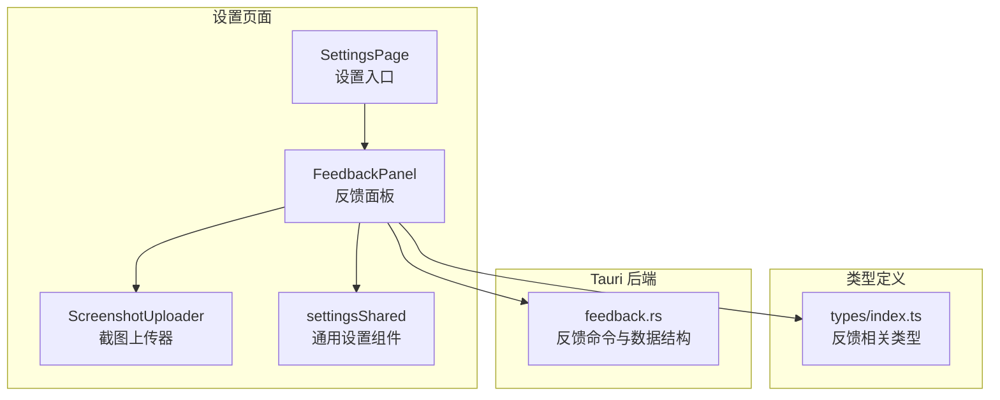
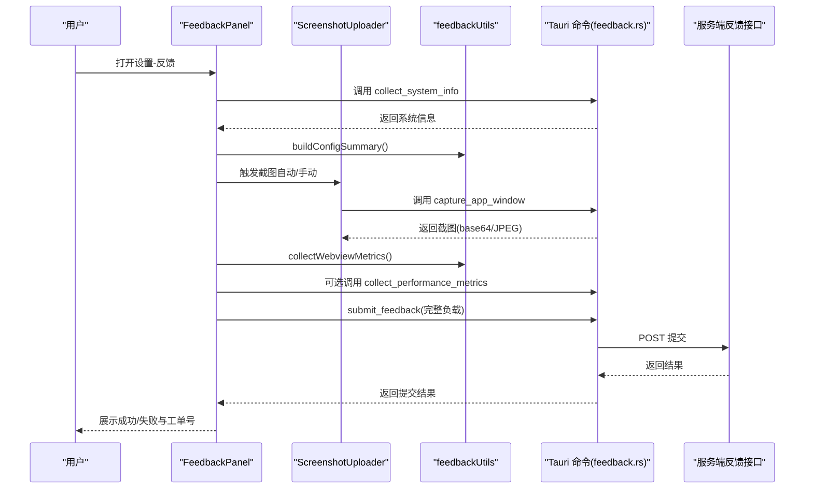
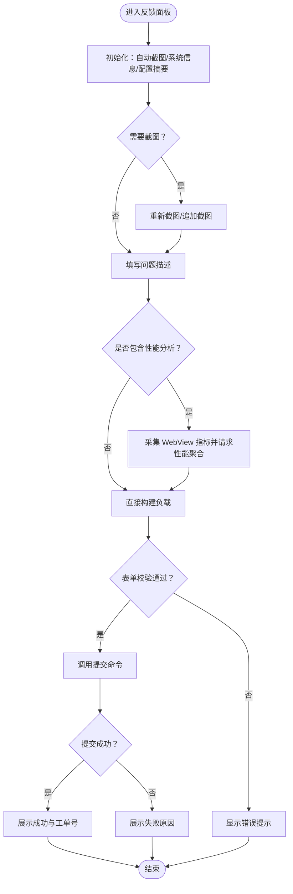
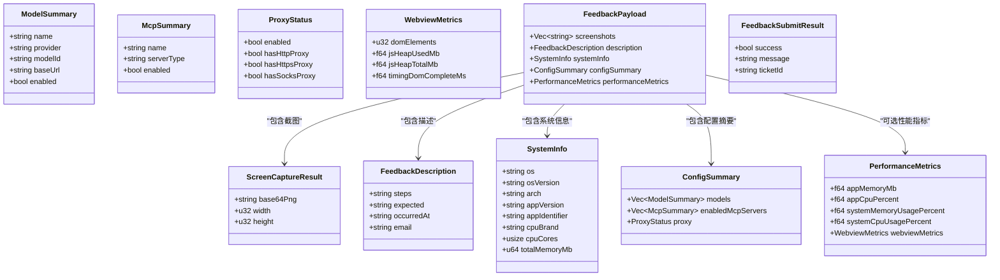
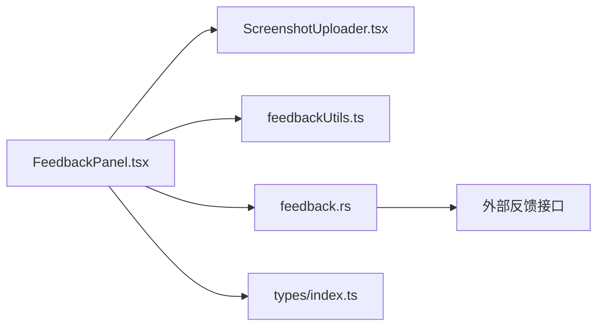

# 反馈设置

<cite>
**本文引用的文件**
- [FeedbackPanel.tsx](file://src/components/settings/FeedbackPanel.tsx)
- [ScreenshotUploader.tsx](file://src/components/settings/feedback/ScreenshotUploader.tsx)
- [feedbackUtils.ts](file://src/components/settings/feedback/feedbackUtils.ts)
- [feedback.rs](file://src-tauri/src/feedback.rs)
- [types/index.ts](file://src/types/index.ts)
- [SettingsPage.tsx](file://src/components/settings/SettingsPage.tsx)
- [settingsShared.tsx](file://src/components/settings/settingsShared.tsx)
- [tauri.conf.json](file://src-tauri/tauri.conf.json)
</cite>

## 目录
1. [简介](#简介)
2. [项目结构](#项目结构)
3. [核心组件](#核心组件)
4. [架构总览](#架构总览)
5. [详细组件分析](#详细组件分析)
6. [依赖关系分析](#依赖关系分析)
7. [性能考量](#性能考量)
8. [故障排查指南](#故障排查指南)
9. [结论](#结论)
10. [附录](#附录)

## 简介
本文件面向 RabbitCoding 的“反馈设置”模块，系统性说明用户反馈收集、截图上传、问题报告的全流程设计与实现。重点涵盖：
- 反馈数据的采集机制与隐私保护策略
- 数据脱敏与匿名化处理
- 反馈的分类管理、优先级设置、处理状态跟踪
- 自动提交与手动上报流程
- 附件上传能力（截图）
- 最佳实践、用户体验优化与社区互动建议

## 项目结构
反馈设置位于设置页面的“反馈”分组，采用前端 React 组件 + Tauri 命令的双层架构：
- 前端负责 UI、表单校验、截图采集与性能指标采集
- Tauri 负责系统信息采集、窗口截图、性能聚合与服务端提交

图表来源
- [SettingsPage.tsx:134-136](file://src/components/settings/SettingsPage.tsx#L134-L136)
- [FeedbackPanel.tsx:1-469](file://src/components/settings/FeedbackPanel.tsx#L1-L469)
- [ScreenshotUploader.tsx:1-94](file://src/components/settings/feedback/ScreenshotUploader.tsx#L1-94)
- [settingsShared.tsx:1-67](file://src/components/settings/settingsShared.tsx#L1-67)
- [types/index.ts:608-701](file://src/types/index.ts#L608-L701)
- [feedback.rs:116-118](file://src-tauri/src/feedback.rs#L116-L118)

章节来源
- [SettingsPage.tsx:134-136](file://src/components/settings/SettingsPage.tsx#L134-L136)
- [FeedbackPanel.tsx:1-469](file://src/components/settings/FeedbackPanel.tsx#L1-L469)
- [ScreenshotUploader.tsx:1-94](file://src/components/settings/feedback/ScreenshotUploader.tsx#L1-94)
- [settingsShared.tsx:1-67](file://src/components/settings/settingsShared.tsx#L1-67)
- [types/index.ts:608-701](file://src/types/index.ts#L608-L701)
- [feedback.rs:116-118](file://src-tauri/src/feedback.rs#L116-L118)

## 核心组件
- 反馈面板（FeedbackPanel）
  - 负责截图区、问题描述表单、系统信息展示、性能分析开关与提交按钮
  - 自动/手动截图控制、表单校验、提交状态管理
- 截图上传器（ScreenshotUploader）
  - 展示缩略图网格、自动截图标记、添加/删除/重新截图操作
- 反馈工具函数（feedbackUtils）
  - 配置摘要脱敏组装、WebView 性能指标采集、邮箱校验、Data URL 基础处理
- Tauri 反馈命令（feedback.rs）
  - 应用窗口截图、系统信息采集、性能指标聚合、反馈提交 API 调用
- 类型定义（types/index.ts）
  - 定义截图结果、系统信息、配置摘要、性能指标、提交结果与完整负载等接口

章节来源
- [FeedbackPanel.tsx:44-469](file://src/components/settings/FeedbackPanel.tsx#L44-L469)
- [ScreenshotUploader.tsx:21-94](file://src/components/settings/feedback/ScreenshotUploader.tsx#L21-L94)
- [feedbackUtils.ts:1-121](file://src/components/settings/feedback/feedbackUtils.ts#L1-L121)
- [feedback.rs:10-110](file://src-tauri/src/feedback.rs#L10-L110)
- [types/index.ts:608-701](file://src/types/index.ts#L608-L701)

## 架构总览
反馈流程分为“采集-脱敏-提交”三层，前后端协同完成。

图表来源
- [FeedbackPanel.tsx:113-131](file://src/components/settings/FeedbackPanel.tsx#L113-L131)
- [FeedbackPanel.tsx:135-204](file://src/components/settings/FeedbackPanel.tsx#L135-L204)
- [ScreenshotUploader.tsx:70-102](file://src/components/settings/feedback/ScreenshotUploader.tsx#L70-L102)
- [feedbackUtils.ts:7-61](file://src/components/settings/feedback/feedbackUtils.ts#L7-L61)
- [feedbackUtils.ts:66-84](file://src/components/settings/feedback/feedbackUtils.ts#L66-L84)
- [feedback.rs:119-158](file://src-tauri/src/feedback.rs#L119-L158)
- [feedback.rs:160-193](file://src-tauri/src/feedback.rs#L160-L193)
- [feedback.rs:195-235](file://src-tauri/src/feedback.rs#L195-L235)
- [feedback.rs:237-281](file://src-tauri/src/feedback.rs#L237-L281)

## 详细组件分析

### 反馈面板（FeedbackPanel）
- 截图管理
  - 自动截图：根据 autoCapture 参数决定是否在初始化时自动截取首张
  - 手动截图：支持重新截图替换首张、追加截图至末尾、删除指定截图
  - 截图上限：最多 5 张，超出时隐藏“添加”按钮
- 表单与校验
  - 必填项：操作步骤、联系邮箱（格式校验）
  - 时间与邮箱：datetime-local 输入与邮箱格式校验
  - 系统信息与配置摘要：初始化时拉取并展示
- 性能分析
  - 可选开关：勾选后采集 WebView 指标并通过 Tauri 聚合应用与系统指标
- 提交流程
  - 组装负载：截图剥离 Data URL 前缀、描述信息标准化、系统信息与配置摘要、可选性能指标
  - 调用 Tauri 提交命令，展示成功/失败与工单号

图表来源
- [FeedbackPanel.tsx:113-131](file://src/components/settings/FeedbackPanel.tsx#L113-L131)
- [FeedbackPanel.tsx:135-204](file://src/components/settings/FeedbackPanel.tsx#L135-L204)
- [FeedbackPanel.tsx:241-250](file://src/components/settings/FeedbackPanel.tsx#L241-L250)

章节来源
- [FeedbackPanel.tsx:44-469](file://src/components/settings/FeedbackPanel.tsx#L44-L469)

### 截图上传器（ScreenshotUploader）
- 功能点
  - 缩略图网格展示，首张自动截图标记
  - 悬停显示删除按钮，支持逐张移除
  - “添加”按钮在未达上限时显示；“重新截图”按钮支持替换首张
  - 截图中禁用按钮，避免并发操作
- 交互细节
  - 自动截图标记仅对首张生效
  - 达到最大数量后隐藏“添加”入口，防止越界

章节来源
- [ScreenshotUploader.tsx:21-94](file://src/components/settings/feedback/ScreenshotUploader.tsx#L21-L94)

### 反馈工具函数（feedbackUtils）
- 配置摘要脱敏
  - 从 localStorage 读取模型、MCP 服务与代理配置，仅保留必要字段，过滤敏感信息（如 API Key、代理地址）
- WebView 性能指标
  - DOM 元素数、JS Heap 使用量、总内存、DOM 完成时间等
- 数据处理
  - 邮箱格式校验
  - Data URL 去前缀（剥离协议与元信息）

章节来源
- [feedbackUtils.ts:1-121](file://src/components/settings/feedback/feedbackUtils.ts#L1-L121)

### Tauri 反馈命令（feedback.rs）
- 数据结构
  - 屏幕截图结果、系统信息、配置摘要、WebView 指标、性能聚合、反馈描述与提交结果
- 命令实现
  - capture_app_window：枚举窗口、按标题匹配、截图转 JPEG 并 base64 编码
  - collect_system_info：获取 OS、版本、CPU、内存、应用版本与标识
  - collect_performance_metrics：聚合应用与系统内存/CPU 使用率，并合并 WebView 指标
  - submit_feedback：POST 提交到固定 API，解析响应并返回成功/失败与可选工单号

图表来源
- [feedback.rs:10-110](file://src-tauri/src/feedback.rs#L10-L110)

章节来源
- [feedback.rs:116-118](file://src-tauri/src/feedback.rs#L116-L118)
- [feedback.rs:119-158](file://src-tauri/src/feedback.rs#L119-L158)
- [feedback.rs:160-193](file://src-tauri/src/feedback.rs#L160-L193)
- [feedback.rs:195-235](file://src-tauri/src/feedback.rs#L195-L235)
- [feedback.rs:237-281](file://src-tauri/src/feedback.rs#L237-L281)

### 类型定义（types/index.ts）
- 前端与后端字段对齐，确保序列化/反序列化一致性
- 反馈相关类型包括：截图结果、系统信息、配置摘要、性能指标、提交结果与完整负载

章节来源
- [types/index.ts:608-701](file://src/types/index.ts#L608-L701)

## 依赖关系分析
- 前端依赖
  - @tauri-apps/api：调用 Tauri 命令
  - 国际化：useI18n 提供多语言文案
  - UI 组件：settingsShared 提供统一的设置区块与开关
- 后端依赖
  - xcap：窗口截图
  - image：图像编码（JPEG）
  - reqwest：HTTP 客户端
  - serde/sysinfo：结构序列化与系统信息采集

图表来源
- [FeedbackPanel.tsx:1-469](file://src/components/settings/FeedbackPanel.tsx#L1-L469)
- [ScreenshotUploader.tsx:1-94](file://src/components/settings/feedback/ScreenshotUploader.tsx#L1-94)
- [feedbackUtils.ts:1-121](file://src/components/settings/feedback/feedbackUtils.ts#L1-L121)
- [feedback.rs:1-282](file://src-tauri/src/feedback.rs#L1-L282)
- [types/index.ts:608-701](file://src/types/index.ts#L608-L701)

章节来源
- [FeedbackPanel.tsx:1-469](file://src/components/settings/FeedbackPanel.tsx#L1-L469)
- [feedback.rs:1-282](file://src-tauri/src/feedback.rs#L1-L282)

## 性能考量
- 截图体积控制
  - 截图转 JPEG 并设置质量，减少体积与传输成本
- 指标采集粒度
  - WebView 指标仅在用户勾选性能分析时采集，避免不必要的开销
- 并发与节流
  - 截图过程中禁用按钮，防止重复触发
- 网络超时
  - HTTP 客户端设置超时，提升稳定性

章节来源
- [feedback.rs:140-148](file://src-tauri/src/feedback.rs#L140-L148)
- [FeedbackPanel.tsx:70-102](file://src/components/settings/FeedbackPanel.tsx#L70-L102)
- [feedback.rs:240-243](file://src-tauri/src/feedback.rs#L240-L243)

## 故障排查指南
- 截图失败
  - 现象：点击截图无响应或报错
  - 排查：确认窗口标题匹配、权限允许、系统窗口枚举正常
  - 参考：命令实现与错误返回
- 性能指标为空
  - 现象：性能分析区域未显示数值
  - 排查：确认 WebView 指标采集成功、Tauri 聚合命令返回正常
- 提交失败
  - 现象：提交后显示失败信息
  - 排查：检查网络、服务端返回状态与负载结构
- 表单校验失败
  - 现象：提示邮箱必填或格式错误
  - 排查：确认必填字段非空且邮箱格式正确

章节来源
- [feedback.rs:119-158](file://src-tauri/src/feedback.rs#L119-L158)
- [feedback.rs:195-235](file://src-tauri/src/feedback.rs#L195-L235)
- [feedback.rs:237-281](file://src-tauri/src/feedback.rs#L237-L281)
- [FeedbackPanel.tsx:135-204](file://src/components/settings/FeedbackPanel.tsx#L135-L204)
- [feedbackUtils.ts:89-91](file://src/components/settings/feedback/feedbackUtils.ts#L89-L91)

## 结论
反馈设置模块通过“前端采集 + 后端聚合 + 脱敏提交”的设计，在保障隐私与性能的前提下，提供了便捷的问题反馈体验。其关键优势包括：
- 截图自动化与灵活管理
- 配置与性能指标的可选采集
- 明确的表单校验与提交状态反馈
- 清晰的错误提示与日志输出

## 附录

### 隐私保护与数据脱敏
- 配置摘要脱敏
  - 仅保留模型名称、提供商、模型 ID、基础 URL、启用状态与已启用 MCP 服务清单
  - 代理状态仅保留启用与否及协议类型存在性，不包含具体地址
- 截图处理
  - 截图为 JPEG，去除 Data URL 前缀，仅传输 base64 数据
- 邮箱与时间
  - 邮箱仅用于联系，时间字段标准化为 ISO 8601

章节来源
- [feedbackUtils.ts:7-61](file://src/components/settings/feedback/feedbackUtils.ts#L7-L61)
- [feedbackUtils.ts:94-99](file://src/components/settings/feedback/feedbackUtils.ts#L94-L99)
- [FeedbackPanel.tsx:174-185](file://src/components/settings/FeedbackPanel.tsx#L174-L185)

### 分类管理、优先级与状态跟踪
- 分类管理
  - 通过“操作步骤”“期望结果”“发生时间”“联系邮箱”进行问题归类
- 优先级设置
  - 可在服务端基于工单号与描述字段进行优先级分配（前端不直接暴露）
- 处理状态跟踪
  - 提交成功后返回工单号，便于后续查询与追踪

章节来源
- [FeedbackPanel.tsx:174-185](file://src/components/settings/FeedbackPanel.tsx#L174-L185)
- [feedback.rs:269-273](file://src-tauri/src/feedback.rs#L269-L273)

### 自动提交与手动上报
- 自动提交
  - 通过设置入口调用时可关闭自动截图（autoCapture=false），完全手动上报
- 手动上报
  - 用户可随时重新截图、追加截图、删除截图，完善附件后再提交

章节来源
- [SettingsPage.tsx:134-136](file://src/components/settings/SettingsPage.tsx#L134-L136)
- [FeedbackPanel.tsx:113-131](file://src/components/settings/FeedbackPanel.tsx#L113-L131)
- [FeedbackPanel.tsx:135-204](file://src/components/settings/FeedbackPanel.tsx#L135-L204)

### 附件上传能力
- 截图上传
  - 支持最多 5 张截图，自动/手动切换，首张自动截图标记
- 其他附件
  - 当前实现聚焦截图；如需扩展其他附件类型，可在负载中增加字段并在 UI 与后端同步扩展

章节来源
- [ScreenshotUploader.tsx:36-73](file://src/components/settings/feedback/ScreenshotUploader.tsx#L36-L73)
- [FeedbackPanel.tsx:241-250](file://src/components/settings/FeedbackPanel.tsx#L241-L250)

### 最佳实践与用户体验优化
- 最佳实践
  - 在问题复现时进行自动截图，补充关键步骤与期望结果
  - 如涉及性能问题，勾选性能分析以提供更全面的诊断数据
  - 提交前检查邮箱格式与必填字段
- 用户体验优化
  - 截图中禁用按钮，避免重复提交
  - 成功/失败明确提示，失败时展示服务端返回信息
  - 首张自动截图标记，便于识别关键画面

章节来源
- [FeedbackPanel.tsx:70-102](file://src/components/settings/FeedbackPanel.tsx#L70-L102)
- [FeedbackPanel.tsx:424-444](file://src/components/settings/FeedbackPanel.tsx#L424-L444)
- [ScreenshotUploader.tsx:60-72](file://src/components/settings/feedback/ScreenshotUploader.tsx#L60-L72)

### 社区互动指导
- 提交后可依据工单号进行后续沟通
- 建议在社区平台同步贴出工单号以便跨渠道追踪

章节来源
- [feedback.rs:269-273](file://src-tauri/src/feedback.rs#L269-L273)