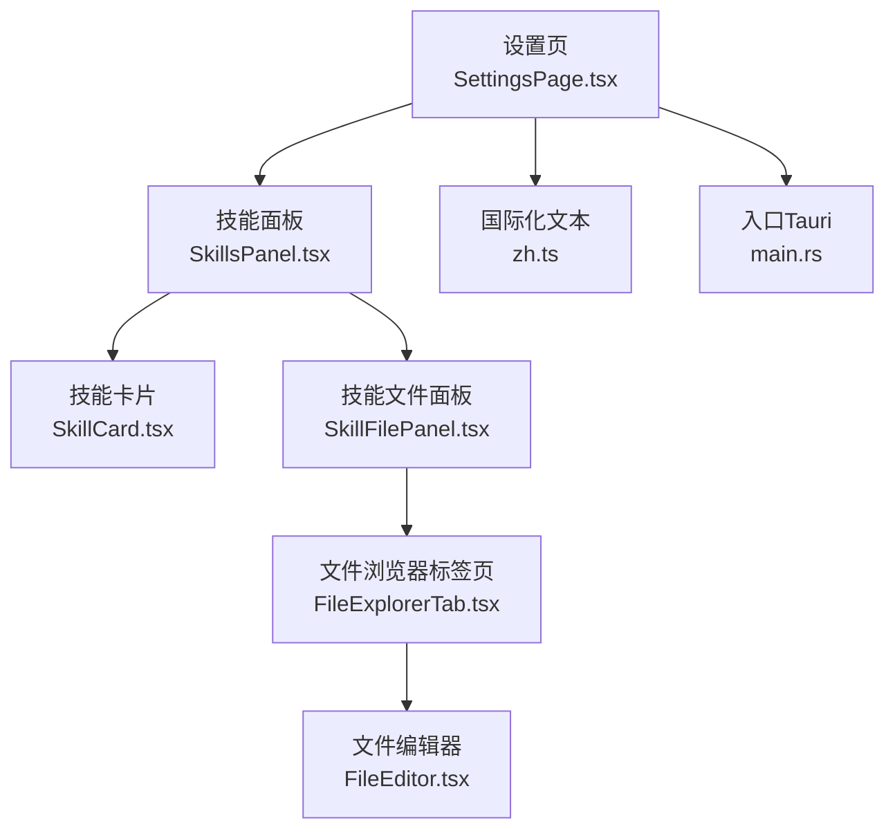
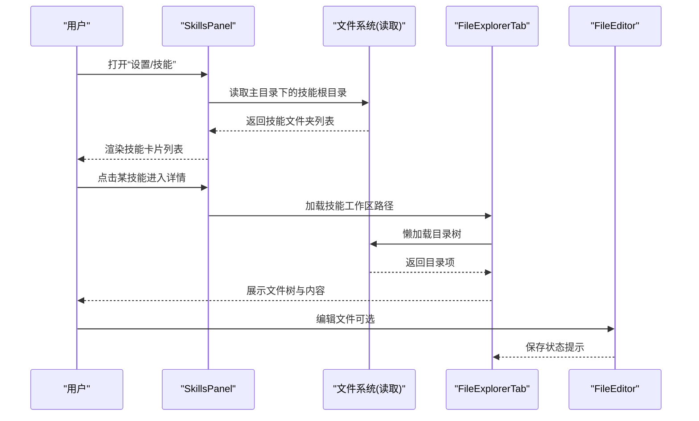
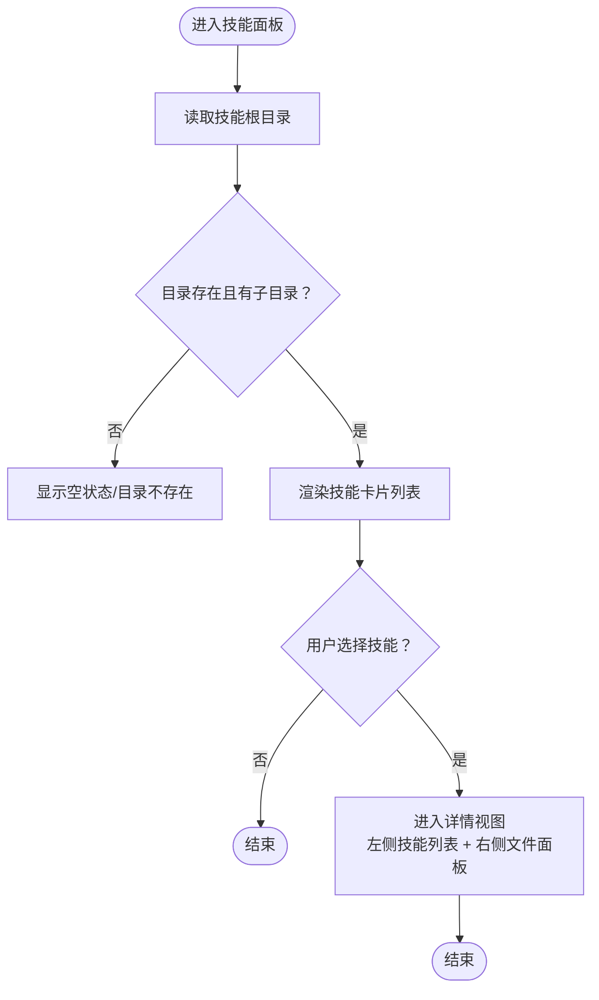
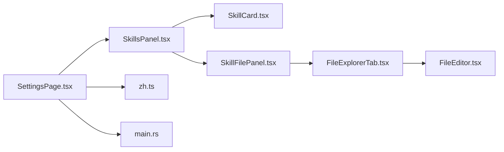
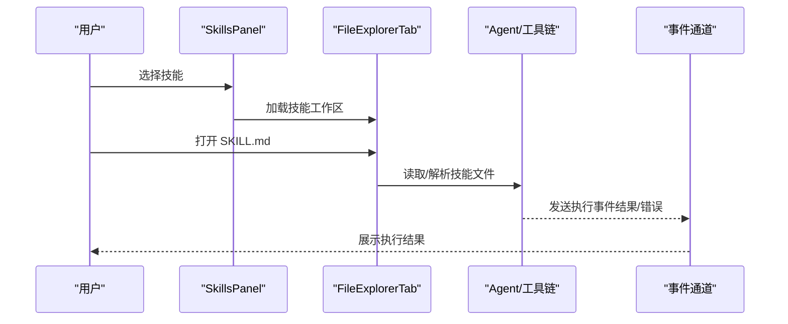

# 技能配置

<cite>
**本文引用的文件**
- [src/components/settings/skills/SkillsPanel.tsx](file://src/components/settings/skills/SkillsPanel.tsx)
- [src/components/settings/skills/SkillCard.tsx](file://src/components/settings/skills/SkillCard.tsx)
- [src/components/settings/skills/SkillFilePanel.tsx](file://src/components/settings/skills/SkillFilePanel.tsx)
- [src/components/files/FileExplorerTab.tsx](file://src/components/files/FileExplorerTab.tsx)
- [src/components/files/FileEditor.tsx](file://src/components/files/FileEditor.tsx)
- [src/components/settings/SettingsPage.tsx](file://src/components/settings/SettingsPage.tsx)
- [src/i18n/locales/zh.ts](file://src/i18n/locales/zh.ts)
- [src-tauri/src/main.rs](file://src-tauri/src/main.rs)
</cite>

## 目录
1. [简介](#简介)
2. [项目结构](#项目结构)
3. [核心组件](#核心组件)
4. [架构总览](#架构总览)
5. [详细组件分析](#详细组件分析)
6. [依赖关系分析](#依赖关系分析)
7. [性能考虑](#性能考虑)
8. [故障排查指南](#故障排查指南)
9. [结论](#结论)
10. [附录](#附录)

## 简介
本文件面向 RabbitCoding 的“技能配置”能力，系统性说明以下方面：
- 技能的发现、浏览与选择
- 技能文件的浏览、编辑与保存
- 技能目录结构与文件组织约定
- 技能执行流程与参数传递（结合 Agent/工具链）
- 依赖关系管理、冲突与版本控制策略
- 最佳实践、性能优化与调试方法

注意：当前仓库中“技能”的具体执行由 Agent/工具链驱动，技能配置界面负责“文件级管理”，执行细节需结合 Agent 事件流与工具调用。

## 项目结构
技能配置位于设置页的“技能”分区内，采用“列表视图 → 详情视图（双栏）”的交互模式：
- 列表视图：扫描用户主目录下的技能根目录，列出技能文件夹
- 详情视图：左侧技能列表 + 右侧文件浏览器，支持编辑 SKILL.md 等文件

图表来源
- [src/components/settings/SettingsPage.tsx:106-118](file://src/components/settings/SettingsPage.tsx#L106-L118)
- [src/components/settings/skills/SkillsPanel.tsx:28-76](file://src/components/settings/skills/SkillsPanel.tsx#L28-L76)
- [src/components/settings/skills/SkillCard.tsx:16-49](file://src/components/settings/skills/SkillCard.tsx#L16-L49)
- [src/components/settings/skills/SkillFilePanel.tsx:19-55](file://src/components/settings/skills/SkillFilePanel.tsx#L19-L55)
- [src/components/files/FileExplorerTab.tsx:111-188](file://src/components/files/FileExplorerTab.tsx#L111-L188)
- [src/components/files/FileEditor.tsx:121-182](file://src/components/files/FileEditor.tsx#L121-L182)
- [src/i18n/locales/zh.ts:330-343](file://src/i18n/locales/zh.ts#L330-L343)
- [src-tauri/src/main.rs:4-6](file://src-tauri/src/main.rs#L4-L6)

章节来源
- [src/components/settings/SettingsPage.tsx:106-118](file://src/components/settings/SettingsPage.tsx#L106-L118)
- [src/components/settings/skills/SkillsPanel.tsx:28-76](file://src/components/settings/skills/SkillsPanel.tsx#L28-L76)

## 核心组件
- 技能面板（SkillsPanel）
  - 负责扫描技能根目录、渲染技能卡片、切换详情视图
  - 支持侧边栏宽度记忆与拖拽调整
- 技能卡片（SkillCard）
  - 展示技能名称与描述，支持高亮态
- 技能文件面板（SkillFilePanel）
  - 在详情视图中展示文件浏览器，限定自动打开 SKILL.md
- 文件浏览器标签页（FileExplorerTab）
  - 提供树形目录、搜索、折叠/展开、懒加载子目录
  - 支持编辑模式与保存状态提示
- 文件编辑器（FileEditor）
  - 基于 Monaco，按文件扩展名自动识别语言
  - 支持只读/可编辑切换

章节来源
- [src/components/settings/skills/SkillsPanel.tsx:28-169](file://src/components/settings/skills/SkillsPanel.tsx#L28-L169)
- [src/components/settings/skills/SkillCard.tsx:16-49](file://src/components/settings/skills/SkillCard.tsx#L16-L49)
- [src/components/settings/skills/SkillFilePanel.tsx:19-55](file://src/components/settings/skills/SkillFilePanel.tsx#L19-L55)
- [src/components/files/FileExplorerTab.tsx:111-188](file://src/components/files/FileExplorerTab.tsx#L111-L188)
- [src/components/files/FileEditor.tsx:121-182](file://src/components/files/FileEditor.tsx#L121-L182)

## 架构总览
技能配置的前端架构围绕“设置页 → 技能面板 → 文件浏览器/编辑器”展开；后端通过 Tauri 插件访问文件系统，实现跨平台文件操作。

图表来源
- [src/components/settings/skills/SkillsPanel.tsx:42-71](file://src/components/settings/skills/SkillsPanel.tsx#L42-L71)
- [src/components/files/FileExplorerTab.tsx:154-188](file://src/components/files/FileExplorerTab.tsx#L154-L188)
- [src/components/files/FileEditor.tsx:121-182](file://src/components/files/FileEditor.tsx#L121-L182)

## 详细组件分析

### 技能面板（SkillsPanel）
- 目录扫描
  - 通过平台 API 获取用户主目录，拼接技能根目录路径
  - 读取目录条目，过滤非目录项，按名称排序
- 视图切换
  - 未选中技能：列表视图，支持加载中/目录不存在/空状态
  - 选中技能：详情视图，左侧技能列表 + 右侧文件面板
- 布局联动
  - 通过回调通知父组件切换全宽模式，便于右侧面板获得更大空间

图表来源
- [src/components/settings/skills/SkillsPanel.tsx:42-71](file://src/components/settings/skills/SkillsPanel.tsx#L42-L71)
- [src/components/settings/skills/SkillsPanel.tsx:127-169](file://src/components/settings/skills/SkillsPanel.tsx#L127-L169)

章节来源
- [src/components/settings/skills/SkillsPanel.tsx:28-169](file://src/components/settings/skills/SkillsPanel.tsx#L28-L169)

### 技能卡片（SkillCard）
- 展示技能名称与可选描述
- 支持 active 高亮态，增强当前选中反馈
- 点击触发父组件的选中逻辑

章节来源
- [src/components/settings/skills/SkillCard.tsx:16-49](file://src/components/settings/skills/SkillCard.tsx#L16-L49)

### 技能文件面板（SkillFilePanel）
- 仅包含“文件”标签页
- 懒加载文件浏览器，限定工作区路径为所选技能目录
- 默认尝试打开 SKILL.md（若存在）

章节来源
- [src/components/settings/skills/SkillFilePanel.tsx:19-55](file://src/components/settings/skills/SkillFilePanel.tsx#L19-L55)

### 文件浏览器标签页（FileExplorerTab）
- 目录树
  - 忽略常见隐藏/构建目录，按“目录优先、名称排序”规则组织
  - 支持懒加载子目录，异步读取并更新节点
- 搜索与过滤
  - 支持大小写不敏感的名称过滤，命中节点自动展开
- 编辑与保存
  - 可切换编辑模式，脏状态检测，保存按钮与“已保存/保存中”提示
  - 支持刷新、折叠全部等辅助操作

图表来源
- [src/components/files/FileExplorerTab.tsx:31-50](file://src/components/files/FileExplorerTab.tsx#L31-L50)
- [src/components/files/FileExplorerTab.tsx:80-109](file://src/components/files/FileExplorerTab.tsx#L80-L109)
- [src/components/files/FileExplorerTab.tsx:111-188](file://src/components/files/FileExplorerTab.tsx#L111-L188)
- [src/components/files/FileExplorerTab.tsx:363-378](file://src/components/files/FileExplorerTab.tsx#L363-L378)

章节来源
- [src/components/files/FileExplorerTab.tsx:111-188](file://src/components/files/FileExplorerTab.tsx#L111-L188)
- [src/components/files/FileExplorerTab.tsx:363-378](file://src/components/files/FileExplorerTab.tsx#L363-L378)

### 文件编辑器（FileEditor）
- 语言识别
  - 基于文件扩展名映射到 Monaco 语言类型，覆盖主流文本/脚本/标记语言
- 主题与交互
  - 根据当前主题选择编辑器主题
  - 支持只读/可编辑切换、上下文菜单、行号高亮等

章节来源
- [src/components/files/FileEditor.tsx:121-182](file://src/components/files/FileEditor.tsx#L121-L182)

### 设置页集成（SettingsPage）
- “技能”分组出现在设置导航中
- 当切换到“技能”时，渲染 SkillsPanel 并接收布局变化回调

章节来源
- [src/components/settings/SettingsPage.tsx:56-80](file://src/components/settings/SettingsPage.tsx#L56-L80)
- [src/components/settings/SettingsPage.tsx:106-118](file://src/components/settings/SettingsPage.tsx#L106-L118)

## 依赖关系分析
- 组件耦合
  - SettingsPage 作为容器，依赖 SkillsPanel
  - SkillsPanel 依赖 SkillCard 与 SkillFilePanel
  - SkillFilePanel 依赖 FileExplorerTab
  - FileExplorerTab 依赖 FileEditor
- 外部依赖
  - 文件系统访问：Tauri 插件（读取目录、读写文件）
  - 国际化：i18n 词条集中于 zh.ts
  - 运行时入口：Tauri main.rs

图表来源
- [src/components/settings/SettingsPage.tsx:106-118](file://src/components/settings/SettingsPage.tsx#L106-L118)
- [src/components/settings/skills/SkillsPanel.tsx:16-17](file://src/components/settings/skills/SkillsPanel.tsx#L16-L17)
- [src/components/settings/skills/SkillFilePanel.tsx:12](file://src/components/settings/skills/SkillFilePanel.tsx#L12)
- [src/components/files/FileExplorerTab.tsx:9](file://src/components/files/FileExplorerTab.tsx#L9)
- [src/components/files/FileEditor.tsx:1](file://src/components/files/FileEditor.tsx#L1)
- [src/i18n/locales/zh.ts:330-343](file://src/i18n/locales/zh.ts#L330-L343)
- [src-tauri/src/main.rs:4-6](file://src-tauri/src/main.rs#L4-L6)

章节来源
- [src/components/settings/SettingsPage.tsx:106-118](file://src/components/settings/SettingsPage.tsx#L106-L118)
- [src/components/settings/skills/SkillsPanel.tsx:16-17](file://src/components/settings/skills/SkillsPanel.tsx#L16-L17)
- [src/components/settings/skills/SkillFilePanel.tsx:12](file://src/components/settings/skills/SkillFilePanel.tsx#L12)
- [src/components/files/FileExplorerTab.tsx:9](file://src/components/files/FileExplorerTab.tsx#L9)
- [src/components/files/FileEditor.tsx:1](file://src/components/files/FileEditor.tsx#L1)
- [src/i18n/locales/zh.ts:330-343](file://src/i18n/locales/zh.ts#L330-L343)
- [src-tauri/src/main.rs:4-6](file://src-tauri/src/main.rs#L4-L6)

## 性能考虑
- 目录懒加载
  - 目录树仅在用户展开时加载子项，避免一次性读取大量目录导致卡顿
- 大文件限制
  - 文件预览阈值为 1MB，超出则提示无法预览，减少内存占用
- 编辑器按需加载
  - Monaco Worker 按语言动态加载，减少初始资源压力
- 布局记忆与响应式
  - 侧边栏宽度与文件树宽度持久化，提升连续操作体验

章节来源
- [src/components/files/FileExplorerTab.tsx:22-23](file://src/components/files/FileExplorerTab.tsx#L22-L23)
- [src/components/files/FileExplorerTab.tsx:147-152](file://src/components/files/FileExplorerTab.tsx#L147-L152)
- [src/components/files/FileEditor.tsx:13-35](file://src/components/files/FileEditor.tsx#L13-L35)

## 故障排查指南
- 技能目录不存在或无法访问
  - 现象：显示“目录不存在/无法访问”提示
  - 排查：确认用户主目录下是否存在技能根目录；检查权限
- 技能列表为空
  - 现象：显示“暂无技能，请在技能目录下创建技能文件夹”
  - 排查：确保技能目录内存在子文件夹；确认文件夹名为有效技能名
- 文件无法加载/编辑
  - 现象：大文件无法预览；编辑器空白或报错
  - 排查：确认文件大小未超限；检查文件编码与扩展名映射
- 保存失败/未保存
  - 现象：保存按钮不可用或长时间处于“保存中”
  - 排查：检查文件系统写权限；确认编辑器内容已变更；查看后端日志

章节来源
- [src/components/settings/skills/SkillsPanel.tsx:141-156](file://src/components/settings/skills/SkillsPanel.tsx#L141-L156)
- [src/components/files/FileExplorerTab.tsx:154-188](file://src/components/files/FileExplorerTab.tsx#L154-L188)
- [src/components/files/FileExplorerTab.tsx:363-378](file://src/components/files/FileExplorerTab.tsx#L363-L378)
- [src/i18n/locales/zh.ts:330-343](file://src/i18n/locales/zh.ts#L330-L343)

## 结论
RabbitCoding 的技能配置以“文件为中心”的设计，提供了从技能发现到文件编辑的完整闭环。通过懒加载、大文件保护与编辑状态提示等机制，兼顾了易用性与性能。实际执行层面，技能的启用/禁用、排序、分类以及模板使用等能力，建议结合 Agent/工具链的事件流与配置项进一步完善。

## 附录

### 技能文件组织约定
- 目录位置
  - 用户主目录下的技能根目录（由前端拼接）
- 文件建议
  - SKILL.md：作为默认打开文件，建议用于技能说明与模板
  - 其他配置/脚本：按需放置于同一目录或子目录

章节来源
- [src/components/settings/skills/SkillsPanel.tsx:47-48](file://src/components/settings/skills/SkillsPanel.tsx#L47-L48)
- [src/components/settings/skills/SkillFilePanel.tsx:46-50](file://src/components/settings/skills/SkillFilePanel.tsx#L46-L50)

### 执行流程与参数传递（概念示意）
- 用户在设置页选择技能 → 进入详情视图
- 在文件浏览器中打开 SKILL.md 或其他配置文件
- 通过 Agent/工具链读取/解析技能文件内容，按需传递参数
- Agent 执行完成后，通过事件通道回传结果（成功/失败/中间状态）

图表来源
- [src/components/settings/skills/SkillsPanel.tsx:78-125](file://src/components/settings/skills/SkillsPanel.tsx#L78-L125)
- [src/components/files/FileExplorerTab.tsx:111-188](file://src/components/files/FileExplorerTab.tsx#L111-L188)

### 依赖关系管理、冲突与版本控制
- 依赖关系管理
  - 建议在技能目录内维护依赖清单（如 SKILL.md 中声明依赖），并在 Agent 执行前校验
- 冲突解决
  - 若多个技能共享相同文件名，建议在目录层级上隔离；或在 Agent 解析阶段增加命名空间
- 版本控制
  - 建议将技能目录纳入版本控制系统；每次重要变更提交一次快照，便于回滚与审计

[本节为通用实践建议，不直接分析具体文件]