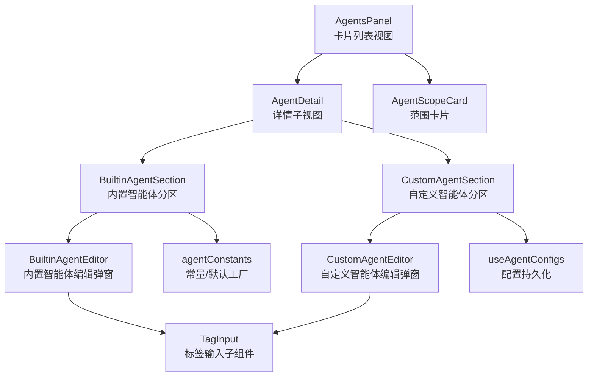
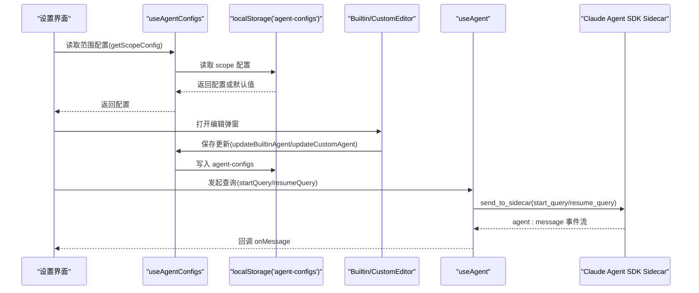
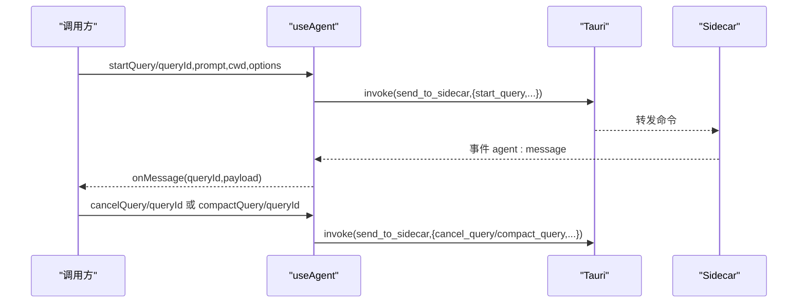
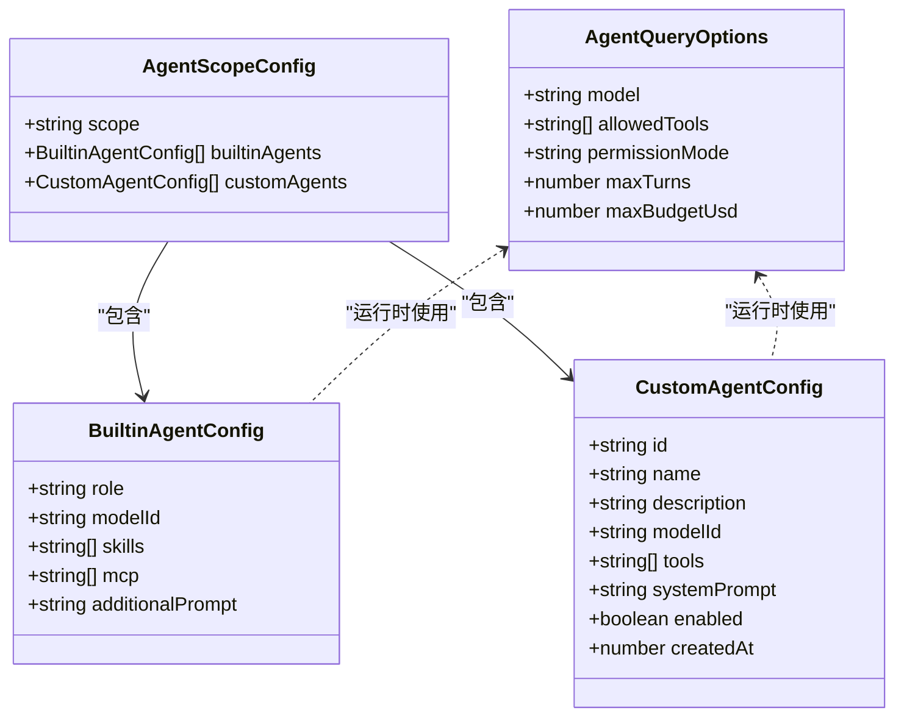

# 内置智能体

<cite>
**本文引用的文件**
- [src/components/settings/agents/agentConstants.ts](file://src/components/settings/agents/agentConstants.ts)
- [src/components/settings/agents/AgentsPanel.tsx](file://src/components/settings/agents/AgentsPanel.tsx)
- [src/components/settings/agents/AgentDetail.tsx](file://src/components/settings/agents/AgentDetail.tsx)
- [src/components/settings/agents/AgentScopeCard.tsx](file://src/components/settings/agents/AgentScopeCard.tsx)
- [src/components/settings/agents/BuiltinAgentSection.tsx](file://src/components/settings/agents/BuiltinAgentSection.tsx)
- [src/components/settings/agents/BuiltinAgentEditor.tsx](file://src/components/settings/agents/BuiltinAgentEditor.tsx)
- [src/components/settings/agents/CustomAgentSection.tsx](file://src/components/settings/agents/CustomAgentSection.tsx)
- [src/components/settings/agents/CustomAgentEditor.tsx](file://src/components/settings/agents/CustomAgentEditor.tsx)
- [src/hooks/useAgent.ts](file://src/hooks/useAgent.ts)
- [src/hooks/useAgentConfigs.ts](file://src/hooks/useAgentConfigs.ts)
- [src/types/index.ts](file://src/types/index.ts)
- [src/constants/providers.ts](file://src/constants/providers.ts)
- [src/i18n/locales/zh.ts](file://src/i18n/locales/zh.ts)
</cite>

## 目录
1. [简介](#简介)
2. [项目结构](#项目结构)
3. [核心组件](#核心组件)
4. [架构总览](#架构总览)
5. [详细组件分析](#详细组件分析)
6. [依赖关系分析](#依赖关系分析)
7. [性能考量](#性能考量)
8. [故障排查指南](#故障排查指南)
9. [结论](#结论)
10. [附录](#附录)

## 简介
本文件面向 RabbitCoding 的“内置智能体”能力，系统化梳理其定义、分类、默认配置、工作范围（用户级/工作区级）、提示词模板与工具调用限制、编辑界面与参数校验、配置持久化与版本兼容策略，并提供使用示例、最佳实践与常见问题解答。目标是帮助开发者与使用者快速理解并正确配置与扩展内置智能体。

## 项目结构
内置智能体功能主要分布在设置页的“智能体”模块，采用“范围（Scope）- 内置智能体 - 自定义智能体”的三层组织方式：
- 范围（Scope）：用户级（全局默认）与工作区级（按工作区隔离）
- 内置智能体：6 个固定角色，每个角色对应一套默认配置
- 自定义智能体：用户可增删改查，支持工具集与系统提示词

图表来源
- [src/components/settings/agents/AgentsPanel.tsx:17-79](file://src/components/settings/agents/AgentsPanel.tsx#L17-L79)
- [src/components/settings/agents/AgentDetail.tsx:18-45](file://src/components/settings/agents/AgentDetail.tsx#L18-L45)
- [src/components/settings/agents/BuiltinAgentSection.tsx:21-99](file://src/components/settings/agents/BuiltinAgentSection.tsx#L21-L99)
- [src/components/settings/agents/CustomAgentSection.tsx:18-132](file://src/components/settings/agents/CustomAgentSection.tsx#L18-L132)
- [src/components/settings/agents/BuiltinAgentEditor.tsx:82-189](file://src/components/settings/agents/BuiltinAgentEditor.tsx#L82-L189)
- [src/components/settings/agents/CustomAgentEditor.tsx:23-161](file://src/components/settings/agents/CustomAgentEditor.tsx#L23-L161)
- [src/components/settings/agents/AgentScopeCard.tsx:17-57](file://src/components/settings/agents/AgentScopeCard.tsx#L17-L57)
- [src/components/settings/agents/agentConstants.ts:24-84](file://src/components/settings/agents/agentConstants.ts#L24-L84)
- [src/hooks/useAgentConfigs.ts:17-130](file://src/hooks/useAgentConfigs.ts#L17-L130)

章节来源
- [src/components/settings/agents/AgentsPanel.tsx:17-79](file://src/components/settings/agents/AgentsPanel.tsx#L17-L79)
- [src/components/settings/agents/AgentDetail.tsx:18-45](file://src/components/settings/agents/AgentDetail.tsx#L18-L45)
- [src/components/settings/agents/AgentScopeCard.tsx:17-57](file://src/components/settings/agents/AgentScopeCard.tsx#L17-L57)

## 核心组件
- 范围与入口
  - AgentsPanel：展示用户级与各工作区级的智能体配置入口卡片
  - AgentDetail：进入所选范围的详情视图
- 内置智能体
  - BuiltinAgentSection：展示 6 个内置角色，点击弹出编辑弹窗
  - BuiltinAgentEditor：编辑模型、技能（标签）、MCP（标签）、附加提示词
- 自定义智能体
  - CustomAgentSection：增删改查自定义智能体，支持启用开关
  - CustomAgentEditor：编辑名称、描述、模型、工具集合、系统提示词
- 配置与常量
  - agentConstants：内置角色元数据、工具选项、默认配置工厂
  - useAgentConfigs：范围配置读取/写入、默认配置补全、自定义智能体 CRUD
  - useAgent：与 Claude Agent SDK Sidecar 通信（启动/停止/查询/取消/压缩/响应提问）

章节来源
- [src/components/settings/agents/BuiltinAgentSection.tsx:21-99](file://src/components/settings/agents/BuiltinAgentSection.tsx#L21-L99)
- [src/components/settings/agents/BuiltinAgentEditor.tsx:82-189](file://src/components/settings/agents/BuiltinAgentEditor.tsx#L82-L189)
- [src/components/settings/agents/CustomAgentSection.tsx:18-132](file://src/components/settings/agents/CustomAgentSection.tsx#L18-L132)
- [src/components/settings/agents/CustomAgentEditor.tsx:23-161](file://src/components/settings/agents/CustomAgentEditor.tsx#L23-L161)
- [src/components/settings/agents/agentConstants.ts:24-84](file://src/components/settings/agents/agentConstants.ts#L24-L84)
- [src/hooks/useAgentConfigs.ts:17-130](file://src/hooks/useAgentConfigs.ts#L17-L130)
- [src/hooks/useAgent.ts:53-334](file://src/hooks/useAgent.ts#L53-L334)

## 架构总览
内置智能体的配置持久化基于 localStorage，以“范围”为单位存储。运行时通过 useAgent 与 Sidecar 交互，传递模型、工具集、权限模式等查询选项。

图表来源
- [src/hooks/useAgentConfigs.ts:25-64](file://src/hooks/useAgentConfigs.ts#L25-L64)
- [src/components/settings/agents/BuiltinAgentEditor.tsx:89-189](file://src/components/settings/agents/BuiltinAgentEditor.tsx#L89-L189)
- [src/components/settings/agents/CustomAgentEditor.tsx:23-161](file://src/components/settings/agents/CustomAgentEditor.tsx#L23-L161)
- [src/hooks/useAgent.ts:156-206](file://src/hooks/useAgent.ts#L156-L206)

## 详细组件分析

### 内置智能体定义与分类
- 角色枚举与元数据
  - 角色类型：researcher、fullstack、qa、reviewer、ui_operator、debugger
  - 元数据包含：角色、名称 i18n 键、描述 i18n 键、图标
- 默认配置工厂
  - createDefaultBuiltinAgent：为单个角色生成初始配置（模型为空、技能/MCP 为空、附加提示词为空）
  - createDefaultScopeConfig：为某个 scope 生成完整配置（内置智能体 + 自定义智能体列表）
- 工具选项
  - TOOL_OPTIONS：与 Claude Agent SDK 对齐的工具清单（Read、Write、Edit、Bash、Glob、Grep、WebSearch、WebFetch、Task、TodoWrite）

章节来源
- [src/components/settings/agents/agentConstants.ts:24-84](file://src/components/settings/agents/agentConstants.ts#L24-L84)
- [src/types/index.ts:364-384](file://src/types/index.ts#L364-L384)

### 工作范围（Scope）与默认配置
- 范围标识
  - 用户级：使用特殊标识作为 scope key，表示全局默认
  - 工作区级：以工作区 id 作为 scope key
- 配置读取与补全
  - 若 scope 不存在，返回默认配置（不写入 localStorage）
  - 若内置角色不齐全，自动补全缺失角色的默认配置
- 版本兼容
  - 通过“补全缺失角色”的方式，保证新增角色不会破坏旧数据

章节来源
- [src/hooks/useAgentConfigs.ts:25-38](file://src/hooks/useAgentConfigs.ts#L25-L38)
- [src/components/settings/agents/agentConstants.ts:64-71](file://src/components/settings/agents/agentConstants.ts#L64-L71)

### 提示词模板与工具调用限制
- 内置智能体
  - 追加提示词：支持最多 10000 字符，编辑器内显示字数统计
  - 技能/MCP：以标签形式输入，便于扩展外部能力
- 自定义智能体
  - 系统提示词：支持最多 10000 字符，编辑器内显示字数统计
  - 工具集合：多选工具，受 Sidecar 权限模式控制
- 运行时参数
  - useAgent 将模型、allowedTools、permissionMode、maxTurns、maxBudgetUsd 等选项透传给 Sidecar
  - Sidecar 侧对工具使用进行拦截/放行判断（例如 Spec 查询的特殊处理）

章节来源
- [src/components/settings/agents/BuiltinAgentEditor.tsx:154-168](file://src/components/settings/agents/BuiltinAgentEditor.tsx#L154-L168)
- [src/components/settings/agents/CustomAgentEditor.tsx:126-140](file://src/components/settings/agents/CustomAgentEditor.tsx#L126-L140)
- [src/hooks/useAgent.ts:286-292](file://src/hooks/useAgent.ts#L286-L292)
- [src/types/index.ts:286-292](file://src/types/index.ts#L286-L292)

### 编辑界面与参数校验
- 内置智能体编辑器
  - 模型选择：仅展示启用的模型
  - 技能/MCP：标签输入，支持回车添加、退格删除
  - 追加提示词：带长度限制与字数统计
- 自定义智能体编辑器
  - 名称必填（表单项标注）
  - 描述、系统提示词：带长度限制与字数统计
  - 工具集合：多选芯片控件
- 通用行为
  - 所有编辑器均采用草稿状态（open 切换时同步），确认后才写回
  - 保存按钮文案与样式统一

章节来源
- [src/components/settings/agents/BuiltinAgentEditor.tsx:82-189](file://src/components/settings/agents/BuiltinAgentEditor.tsx#L82-L189)
- [src/components/settings/agents/CustomAgentEditor.tsx:23-161](file://src/components/settings/agents/CustomAgentEditor.tsx#L23-L161)

### 配置持久化与版本兼容
- 数据存储
  - 范围配置：localStorage('agent-configs')
  - 模型配置：localStorage('model-configs')
- 写入策略
  - updateBuiltinAgent/updateCustomAgent：按角色/ID 替换对应项
  - addCustomAgent：生成唯一 ID 并写入
- 兼容策略
  - 读取时若缺少内置角色，自动补全默认配置
  - 旧数据迁移：确保字段存在与类型一致

章节来源
- [src/hooks/useAgentConfigs.ts:17-130](file://src/hooks/useAgentConfigs.ts#L17-L130)
- [src/types/index.ts:402-408](file://src/types/index.ts#L402-L408)

### 与 Sidecar 的交互流程
- 启动/停止/状态检查
  - startSidecar/stopSidecar/checkStatus：通过 Tauri 命令与 Sidecar 进程交互
- 查询生命周期
  - startQuery/resumeQuery：发送 start_query/resume_query 命令
  - cancelQuery：发送 cancel_query 命令
  - compactQuery：发送 compact_query 命令（手动触发会话压缩）
- 事件监听
  - agent:message：解析消息事件流，区分思考态与实质输出，设置看门狗
  - agent:sidecar-exit：进程退出时清理计时器与状态

图表来源
- [src/hooks/useAgent.ts:156-243](file://src/hooks/useAgent.ts#L156-L243)
- [src/hooks/useAgent.ts:262-320](file://src/hooks/useAgent.ts#L262-L320)

章节来源
- [src/hooks/useAgent.ts:53-334](file://src/hooks/useAgent.ts#L53-L334)

## 依赖关系分析
- 组件耦合
  - BuiltinAgentSection 依赖 agentConstants（角色元数据）与 useAgentConfigs（读取/更新）
  - CustomAgentSection 依赖 useAgentConfigs（读取/增删改）
  - 编辑器依赖 useI18n（国际化文案）、useLocalStorage（模型列表）
- 类型契约
  - BuiltinAgentConfig/CustomAgentConfig/AgentScopeConfig 定义了配置结构
  - AgentQueryOptions 定义了运行时查询参数
- 外部集成
  - 通过 Tauri 与 Rust 侧交互，实现 Sidecar 生命周期与事件订阅

图表来源
- [src/types/index.ts:402-408](file://src/types/index.ts#L402-L408)
- [src/types/index.ts:373-400](file://src/types/index.ts#L373-L400)
- [src/types/index.ts:286-292](file://src/types/index.ts#L286-L292)

章节来源
- [src/types/index.ts:364-408](file://src/types/index.ts#L364-L408)

## 性能考量
- 查询看门狗
  - 普通态超时阈值较长，思考态超时阈值更宽松，避免纯静默长思考被误判
  - 每条 query 独立计时，收到任意消息即重置
- 会话压缩
  - 支持手动触发压缩，减少上下文占用，提升后续查询性能
- 事件处理
  - 使用 ref 存储回调，避免因引用变化导致重复注册监听
  - 组件卸载时清理监听与计时器，防止内存泄漏

章节来源
- [src/hooks/useAgent.ts:66-101](file://src/hooks/useAgent.ts#L66-L101)
- [src/hooks/useAgent.ts:262-320](file://src/hooks/useAgent.ts#L262-L320)

## 故障排查指南
- Sidecar 启动失败
  - 检查 startSidecar 返回状态，确认 API Key、Base URL、环境变量配置
  - 查看 agent:sidecar-exit 事件原因
- 查询无响应
  - 观察 agent:message 事件流，确认是否处于“思考态”
  - 超时触发 onQueryTimeout，检查网络与模型负载
- 工具调用被拦截
  - permissionMode 会影响工具使用，必要时调整为 bypassPermissions 或 plan 模式
  - 特殊查询（如 Spec）对 ExitPlanMode 有拦截策略，需先写入 Spec 再结束计划
- 配置未生效
  - 确认编辑器已保存（草稿同步逻辑）
  - 检查 scope 是否正确（用户级 vs 工作区级）

章节来源
- [src/hooks/useAgent.ts:106-151](file://src/hooks/useAgent.ts#L106-L151)
- [src/hooks/useAgent.ts:262-320](file://src/hooks/useAgent.ts#L262-L320)
- [src/hooks/useAgent.ts:258-284](file://src/hooks/useAgent.ts#L258-L284)

## 结论
内置智能体通过“范围 + 内置角色 + 自定义扩展”的设计，在保证易用性的同时提供了足够的灵活性。借助完善的默认配置、标签化技能/MCP 输入、严格的参数校验与持久化策略，以及与 Sidecar 的稳定交互，能够满足从研究、开发到调试的多种场景需求。建议在团队协作中优先使用内置智能体作为基线，再根据项目特性通过自定义智能体进行精细化定制。

## 附录

### 使用示例与最佳实践
- 快速上手
  - 在“用户级”或“工作区级”范围内，直接编辑内置智能体的模型与附加提示词
  - 使用技能/MCP 标签为特定任务引入外部能力
- 最佳实践
  - 将通用提示词沉淀为“附加提示词”，避免重复输入
  - 为不同角色设定专用模型，确保成本与效果平衡
  - 自定义智能体用于复杂任务编排，尽量保持系统提示词简洁明确
  - 合理设置 allowedTools 与 permissionMode，兼顾安全性与可用性
- 常见问题
  - 问：如何为某个工作区单独配置内置智能体？
    - 答：在工作区卡片中进入详情视图，即可针对该工作区进行独立配置
  - 问：如何限制工具使用？
    - 答：在自定义智能体中选择所需工具，或在运行时通过 permissionMode 控制
  - 问：如何迁移旧配置？
    - 答：无需手动操作，读取逻辑会自动补全缺失的角色配置

章节来源
- [src/components/settings/agents/AgentsPanel.tsx:48-78](file://src/components/settings/agents/AgentsPanel.tsx#L48-L78)
- [src/components/settings/agents/BuiltinAgentSection.tsx:21-99](file://src/components/settings/agents/BuiltinAgentSection.tsx#L21-L99)
- [src/components/settings/agents/CustomAgentSection.tsx:18-132](file://src/components/settings/agents/CustomAgentSection.tsx#L18-L132)