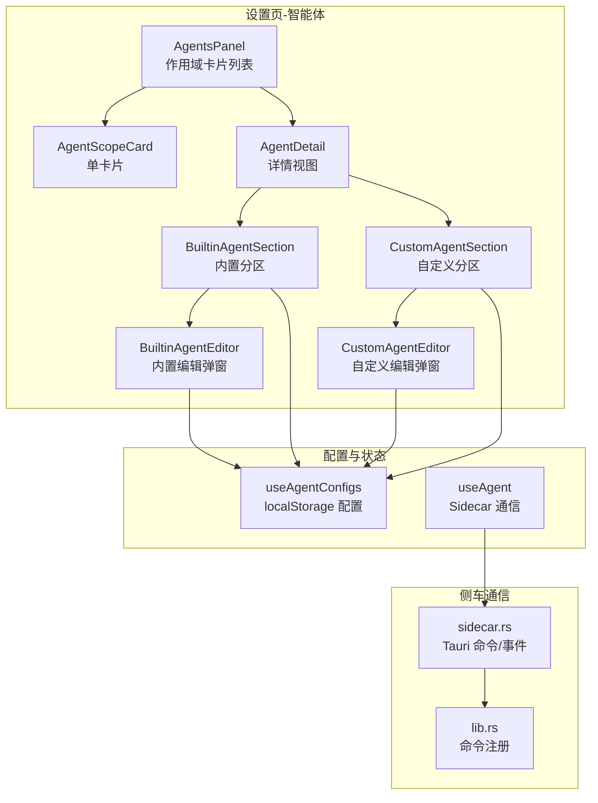
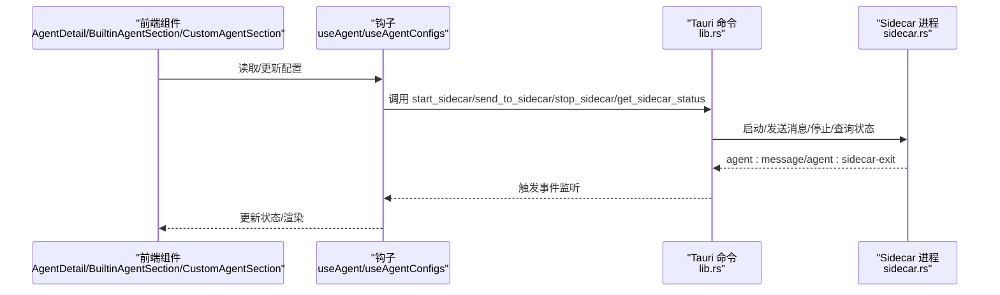
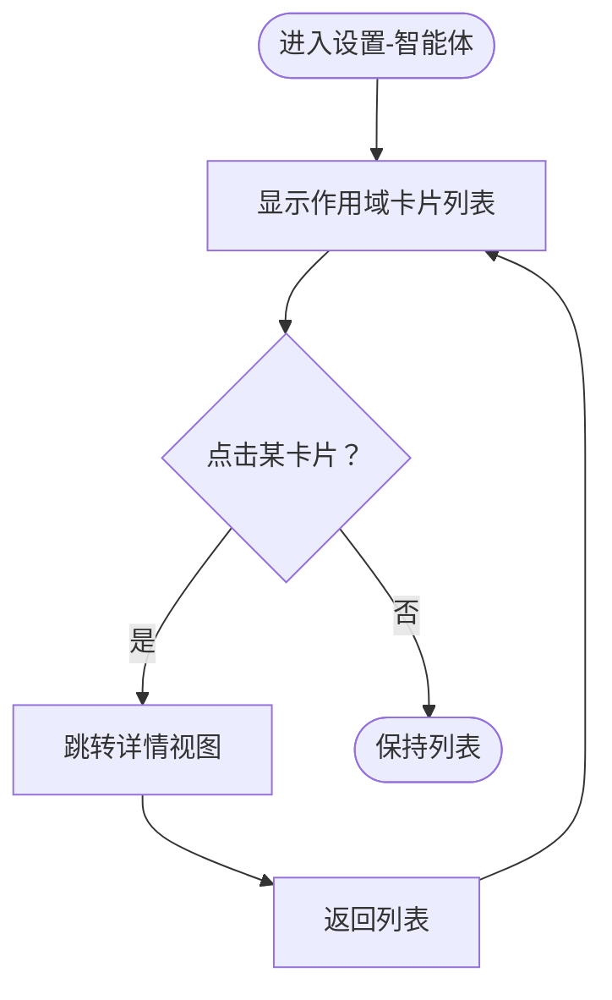
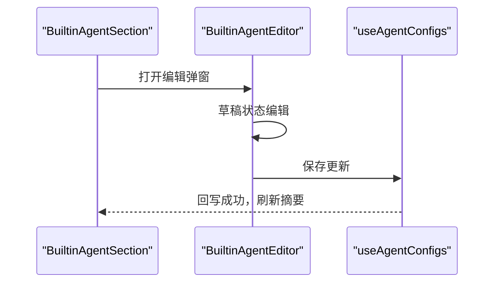
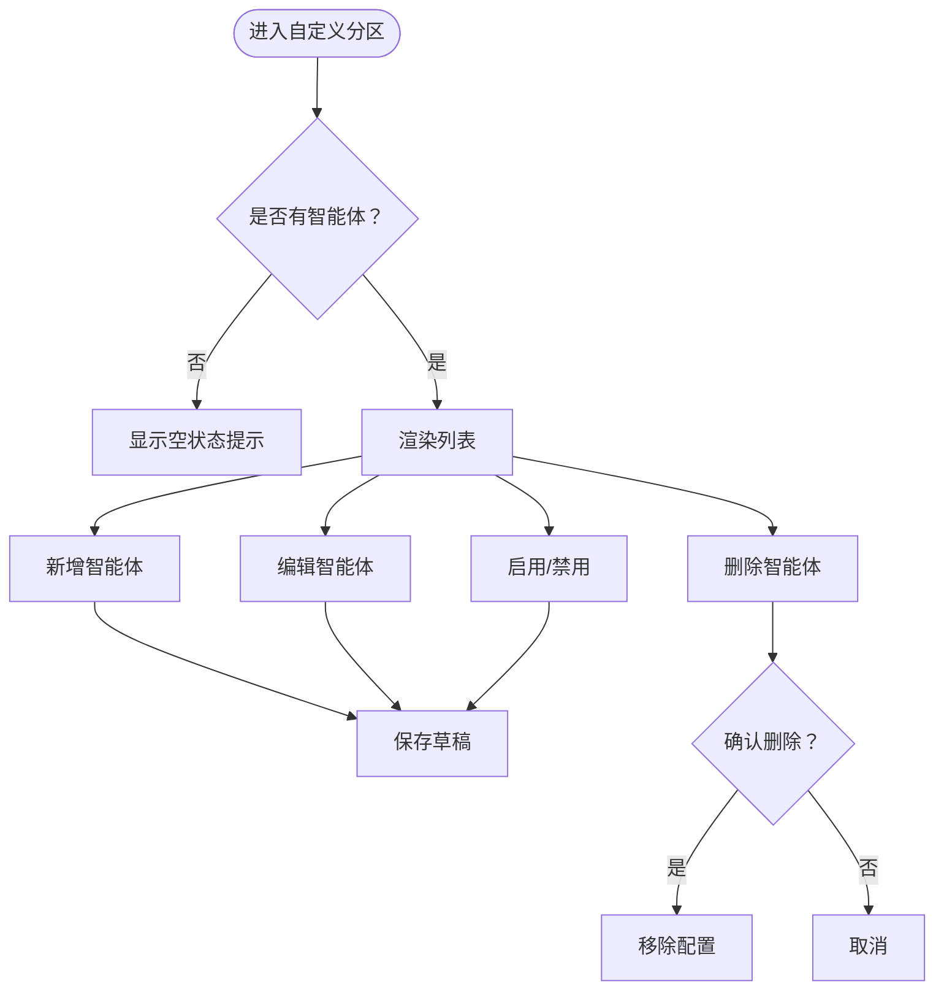
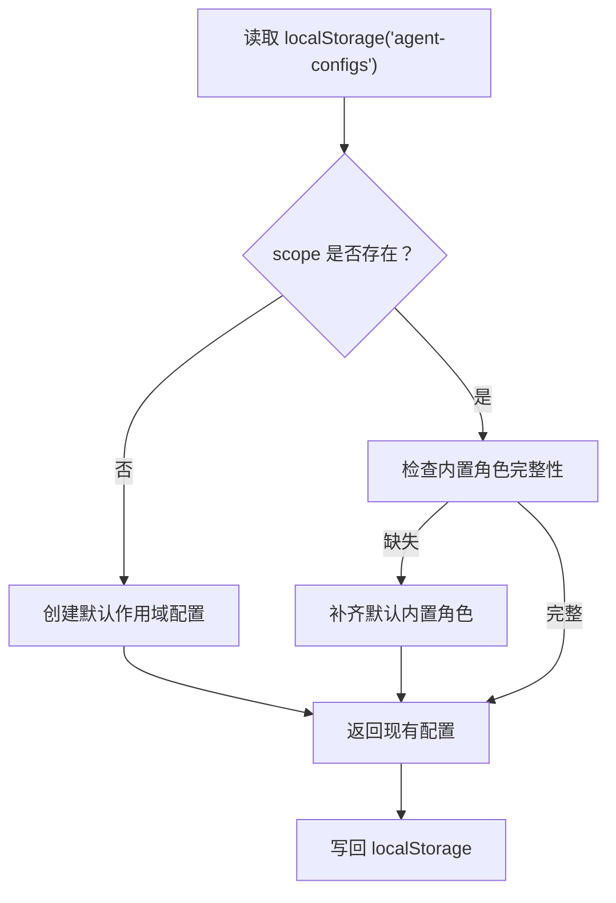
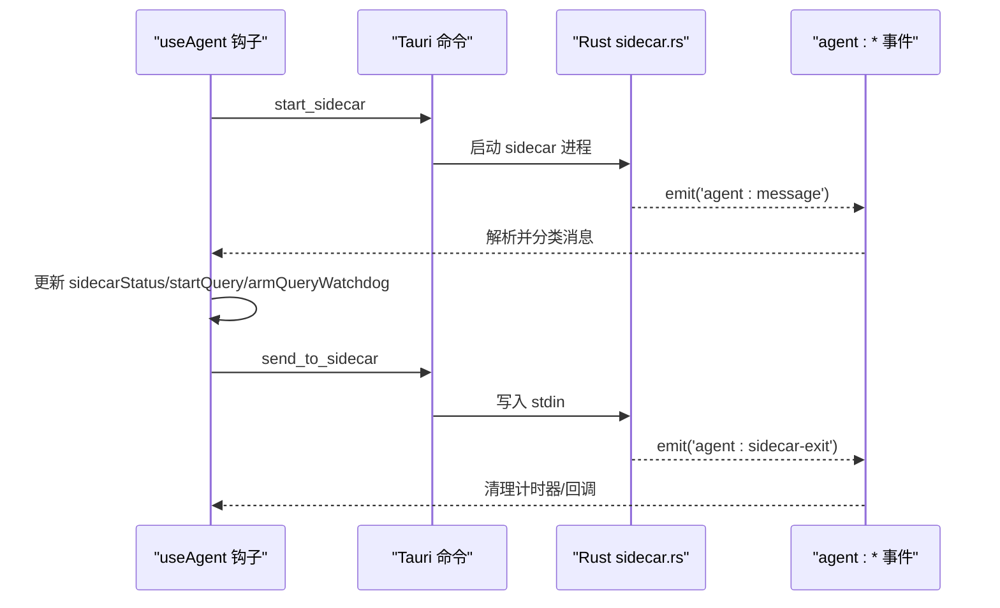
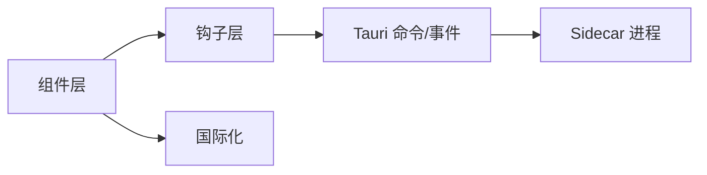

# 智能体管理

<cite>
**本文引用的文件**
- [AgentsPanel.tsx](file://src/components/settings/agents/AgentsPanel.tsx)
- [AgentDetail.tsx](file://src/components/settings/agents/AgentDetail.tsx)
- [AgentScopeCard.tsx](file://src/components/settings/agents/AgentScopeCard.tsx)
- [BuiltinAgentSection.tsx](file://src/components/settings/agents/BuiltinAgentSection.tsx)
- [CustomAgentSection.tsx](file://src/components/settings/agents/CustomAgentSection.tsx)
- [BuiltinAgentEditor.tsx](file://src/components/settings/agents/BuiltinAgentEditor.tsx)
- [CustomAgentEditor.tsx](file://src/components/settings/agents/CustomAgentEditor.tsx)
- [agentConstants.ts](file://src/components/settings/agents/agentConstants.ts)
- [useAgent.ts](file://src/hooks/useAgent.ts)
- [useAgentConfigs.ts](file://src/hooks/useAgentConfigs.ts)
- [Modal.tsx](file://src/components/common/Modal.tsx)
- [sidecar.rs](file://src-tauri/src/sidecar.rs)
- [lib.rs](file://src-tauri/src/lib.rs)
- [zh.ts](file://src/i18n/locales/zh.ts)
- [id.ts](file://src/utils/id.ts)
- [index.ts](file://src/types/index.ts)
</cite>

## 目录
1. [简介](#简介)
2. [项目结构](#项目结构)
3. [核心组件](#核心组件)
4. [架构总览](#架构总览)
5. [详细组件分析](#详细组件分析)
6. [依赖关系分析](#依赖关系分析)
7. [性能考量](#性能考量)
8. [故障排查指南](#故障排查指南)
9. [结论](#结论)
10. [附录](#附录)

## 简介
本文件面向 RabbitCoding 的“智能体管理”功能，系统性梳理并解释以下能力与实现要点：
- 智能体列表展示、搜索过滤、排序
- 智能体详情查看、批量操作、配置同步机制
- 智能体作用域卡片的设计理念、范围配置、权限控制
- 智能体状态管理、激活/停用功能、配置备份恢复
- 智能体管理界面的交互设计、用户体验优化、批量管理最佳实践

## 项目结构
智能体管理功能主要位于前端设置页的“智能体”模块，采用分层组件组织：
- 作用域卡片与详情视图：AgentsPanel、AgentDetail、AgentScopeCard
- 内置专家团分区：BuiltinAgentSection + BuiltinAgentEditor
- 自定义智能体分区：CustomAgentSection + CustomAgentEditor
- 配置与状态钩子：useAgent、useAgentConfigs
- 侧车通信桥接：Tauri 命令与事件（Rust 层 sidecar.rs）

图表来源
- [AgentsPanel.tsx:17-79](file://src/components/settings/agents/AgentsPanel.tsx#L17-L79)
- [AgentDetail.tsx:18-46](file://src/components/settings/agents/AgentDetail.tsx#L18-L46)
- [AgentScopeCard.tsx:17-57](file://src/components/settings/agents/AgentScopeCard.tsx#L17-L57)
- [BuiltinAgentSection.tsx:21-99](file://src/components/settings/agents/BuiltinAgentSection.tsx#L21-L99)
- [CustomAgentSection.tsx:18-132](file://src/components/settings/agents/CustomAgentSection.tsx#L18-L132)
- [BuiltinAgentEditor.tsx:82-189](file://src/components/settings/agents/BuiltinAgentEditor.tsx#L82-L189)
- [CustomAgentEditor.tsx:23-161](file://src/components/settings/agents/CustomAgentEditor.tsx#L23-L161)
- [useAgentConfigs.ts:17-130](file://src/hooks/useAgentConfigs.ts#L17-L130)
- [useAgent.ts:53-334](file://src/hooks/useAgent.ts#L53-L334)
- [sidecar.rs:60-359](file://src-tauri/src/sidecar.rs#L60-L359)
- [lib.rs:521-566](file://src-tauri/src/lib.rs#L521-L566)

章节来源
- [AgentsPanel.tsx:17-79](file://src/components/settings/agents/AgentsPanel.tsx#L17-L79)
- [AgentDetail.tsx:18-46](file://src/components/settings/agents/AgentDetail.tsx#L18-L46)
- [AgentScopeCard.tsx:17-57](file://src/components/settings/agents/AgentScopeCard.tsx#L17-L57)
- [BuiltinAgentSection.tsx:21-99](file://src/components/settings/agents/BuiltinAgentSection.tsx#L21-L99)
- [CustomAgentSection.tsx:18-132](file://src/components/settings/agents/CustomAgentSection.tsx#L18-L132)
- [BuiltinAgentEditor.tsx:82-189](file://src/components/settings/agents/BuiltinAgentEditor.tsx#L82-L189)
- [CustomAgentEditor.tsx:23-161](file://src/components/settings/agents/CustomAgentEditor.tsx#L23-L161)
- [useAgentConfigs.ts:17-130](file://src/hooks/useAgentConfigs.ts#L17-L130)
- [useAgent.ts:53-334](file://src/hooks/useAgent.ts#L53-L334)
- [sidecar.rs:60-359](file://src-tauri/src/sidecar.rs#L60-L359)
- [lib.rs:521-566](file://src-tauri/src/lib.rs#L521-L566)

## 核心组件
- 作用域卡片与详情视图
  - 作用域卡片列表：用户级与每个工作区级卡片，点击进入详情视图
  - 详情视图：面包屑导航 + 内置专家团分区 + 自定义智能体分区
- 内置专家团分区
  - 固定 6 个内置子智能体，点击行项弹出编辑弹窗
  - 可配置：关联模型、技能标签、MCP 标签、附加提示词
- 自定义智能体分区
  - 支持新增、启用/禁用、删除、编辑
  - 可配置：名称、描述、模型、工具集合、系统提示词
- 配置与状态钩子
  - useAgentConfigs：基于 localStorage 的智能体配置 CRUD，自动补齐默认内置角色
  - useAgent：与 Claude Agent SDK Sidecar 通信，封装启动/停止/查询/取消/压缩/响应请求等
- 侧车通信
  - Rust 层暴露 start_sidecar/send_to_sidecar/stop_sidecar/get_sidecar_status 命令
  - 通过 agent:message/agent:sidecar-exit 事件与前端交互

章节来源
- [AgentsPanel.tsx:17-79](file://src/components/settings/agents/AgentsPanel.tsx#L17-L79)
- [AgentDetail.tsx:18-46](file://src/components/settings/agents/AgentDetail.tsx#L18-L46)
- [BuiltinAgentSection.tsx:21-99](file://src/components/settings/agents/BuiltinAgentSection.tsx#L21-L99)
- [CustomAgentSection.tsx:18-132](file://src/components/settings/agents/CustomAgentSection.tsx#L18-L132)
- [BuiltinAgentEditor.tsx:82-189](file://src/components/settings/agents/BuiltinAgentEditor.tsx#L82-L189)
- [CustomAgentEditor.tsx:23-161](file://src/components/settings/agents/CustomAgentEditor.tsx#L23-L161)
- [useAgentConfigs.ts:17-130](file://src/hooks/useAgentConfigs.ts#L17-L130)
- [useAgent.ts:53-334](file://src/hooks/useAgent.ts#L53-L334)
- [sidecar.rs:60-359](file://src-tauri/src/sidecar.rs#L60-L359)
- [lib.rs:521-566](file://src-tauri/src/lib.rs#L521-L566)

## 架构总览
智能体管理的前后端交互链路如下：

图表来源
- [AgentDetail.tsx:18-46](file://src/components/settings/agents/AgentDetail.tsx#L18-L46)
- [BuiltinAgentSection.tsx:21-99](file://src/components/settings/agents/BuiltinAgentSection.tsx#L21-L99)
- [CustomAgentSection.tsx:18-132](file://src/components/settings/agents/CustomAgentSection.tsx#L18-L132)
- [useAgent.ts:106-151](file://src/hooks/useAgent.ts#L106-L151)
- [useAgentConfigs.ts:17-130](file://src/hooks/useAgentConfigs.ts#L17-L130)
- [lib.rs:521-566](file://src-tauri/src/lib.rs#L521-L566)
- [sidecar.rs:60-359](file://src-tauri/src/sidecar.rs#L60-L359)

## 详细组件分析

### 作用域卡片与详情视图
- 设计理念
  - 以“作用域”为维度组织智能体配置：用户级默认存在，每个工作区对应一张卡片
  - 列表视图提供快速入口，详情视图承载完整的内置与自定义配置管理
- 范围配置
  - 用户级标识：USER_SCOPE
  - 工作区级：根据 workspaces 列表动态生成卡片
- 权限控制
  - 通过 scope 参数隔离不同作用域的配置读写
  - 详情视图仅展示当前 scope 的配置

图表来源
- [AgentsPanel.tsx:17-79](file://src/components/settings/agents/AgentsPanel.tsx#L17-L79)
- [AgentDetail.tsx:18-46](file://src/components/settings/agents/AgentDetail.tsx#L18-L46)
- [AgentScopeCard.tsx:17-57](file://src/components/settings/agents/AgentScopeCard.tsx#L17-L57)
- [agentConstants.ts:21-22](file://src/components/settings/agents/agentConstants.ts#L21-L22)

章节来源
- [AgentsPanel.tsx:17-79](file://src/components/settings/agents/AgentsPanel.tsx#L17-L79)
- [AgentDetail.tsx:18-46](file://src/components/settings/agents/AgentDetail.tsx#L18-L46)
- [AgentScopeCard.tsx:17-57](file://src/components/settings/agents/AgentScopeCard.tsx#L17-L57)
- [agentConstants.ts:21-22](file://src/components/settings/agents/agentConstants.ts#L21-L22)

### 内置专家团分区与编辑
- 列表展示
  - 固定 6 个内置角色，按元数据顺序渲染
  - 摘要展示：模型名称（若配置）
- 编辑弹窗
  - 支持：关联模型、技能标签、MCP 标签、附加提示词
  - 草稿状态：仅在保存时写回配置
- 配置同步
  - 通过 useAgentConfigs.updateBuiltinAgent 写入 localStorage
  - 首次访问自动补齐缺失的内置角色

图表来源
- [BuiltinAgentSection.tsx:21-99](file://src/components/settings/agents/BuiltinAgentSection.tsx#L21-L99)
- [BuiltinAgentEditor.tsx:82-189](file://src/components/settings/agents/BuiltinAgentEditor.tsx#L82-L189)
- [useAgentConfigs.ts:49-64](file://src/hooks/useAgentConfigs.ts#L49-L64)

章节来源
- [BuiltinAgentSection.tsx:21-99](file://src/components/settings/agents/BuiltinAgentSection.tsx#L21-L99)
- [BuiltinAgentEditor.tsx:82-189](file://src/components/settings/agents/BuiltinAgentEditor.tsx#L82-L189)
- [useAgentConfigs.ts:25-38](file://src/hooks/useAgentConfigs.ts#L25-L38)

### 自定义智能体分区与编辑
- 列表展示
  - 支持新增、启用/禁用、删除、编辑
  - 空状态友好提示
- 编辑弹窗
  - 支持：名称、描述、模型、工具集合、系统提示词
  - 草稿状态：仅在保存时写回配置
- 批量操作
  - 启用/禁用：通过 Toggle 快速切换
  - 删除：二次确认，避免误删

图表来源
- [CustomAgentSection.tsx:18-132](file://src/components/settings/agents/CustomAgentSection.tsx#L18-L132)
- [CustomAgentEditor.tsx:23-161](file://src/components/settings/agents/CustomAgentEditor.tsx#L23-L161)
- [useAgentConfigs.ts:66-120](file://src/hooks/useAgentConfigs.ts#L66-L120)
- [id.ts:1-4](file://src/utils/id.ts#L1-L4)

章节来源
- [CustomAgentSection.tsx:18-132](file://src/components/settings/agents/CustomAgentSection.tsx#L18-L132)
- [CustomAgentEditor.tsx:23-161](file://src/components/settings/agents/CustomAgentEditor.tsx#L23-L161)
- [useAgentConfigs.ts:66-120](file://src/hooks/useAgentConfigs.ts#L66-L120)
- [id.ts:1-4](file://src/utils/id.ts#L1-L4)

### 配置存储与同步机制
- 数据持久化
  - 以 localStorage 为持久化介质，键名为 'agent-configs'
  - 每个作用域拥有独立的 AgentScopeConfig
- 默认配置与兼容
  - 首次访问自动创建默认作用域配置
  - 自动补齐缺失的内置角色，确保 UI 一致性
- 写入策略
  - 内置：按 role 匹配更新
  - 自定义：按 id 匹配更新/删除
  - 新增自定义智能体：生成唯一 id

图表来源
- [useAgentConfigs.ts:17-130](file://src/hooks/useAgentConfigs.ts#L17-L130)
- [agentConstants.ts:64-83](file://src/components/settings/agents/agentConstants.ts#L64-L83)

章节来源
- [useAgentConfigs.ts:17-130](file://src/hooks/useAgentConfigs.ts#L17-L130)
- [agentConstants.ts:64-83](file://src/components/settings/agents/agentConstants.ts#L64-L83)

### 侧车通信与状态管理
- 通信通道
  - 前端通过 Tauri 命令与 Rust 层交互：start_sidecar/send_to_sidecar/stop_sidecar/get_sidecar_status
  - Rust 层通过 agent:message/agent:sidecar-exit 事件向前端推送消息
- 状态机
  - sidecarStatus：stopped/starting/running/error
  - 查询看门狗：每条 query 独立计时，思考态放宽阈值，避免误判超时
- 会话生命周期
  - startQuery/resumeQuery/cancelQuery/compactQuery/respondToolRequest
  - 通过事件驱动消息流，支持流式文本、思考态、工具调用、最终结果与错误

图表来源
- [useAgent.ts:53-334](file://src/hooks/useAgent.ts#L53-L334)
- [sidecar.rs:60-359](file://src-tauri/src/sidecar.rs#L60-L359)
- [lib.rs:521-566](file://src-tauri/src/lib.rs#L521-L566)

章节来源
- [useAgent.ts:53-334](file://src/hooks/useAgent.ts#L53-L334)
- [sidecar.rs:60-359](file://src-tauri/src/sidecar.rs#L60-L359)
- [lib.rs:521-566](file://src-tauri/src/lib.rs#L521-L566)

### 搜索、过滤与排序
- 搜索与过滤
  - 当前实现未提供针对智能体列表的显式搜索/过滤 UI
  - 可通过“作用域卡片”进行范围定位（用户级 vs 工作区级）
- 排序
  - 内置专家团按固定元数据顺序展示
  - 自定义智能体按创建时间倒序排列（由 addCustomAgent 写入 createdAt）

章节来源
- [BuiltinAgentSection.tsx:47-79](file://src/components/settings/agents/BuiltinAgentSection.tsx#L47-L79)
- [CustomAgentSection.tsx:69-114](file://src/components/settings/agents/CustomAgentSection.tsx#L69-L114)
- [useAgentConfigs.ts:67-87](file://src/hooks/useAgentConfigs.ts#L67-L87)

### 状态管理、激活/停用与配置备份恢复
- 状态管理
  - sidecarStatus：stopped/starting/running/error
  - 查询看门狗：区分普通态与思考态阈值
- 激活/停用
  - 自定义智能体：通过 Toggle 快速启用/禁用
  - 侧车：通过 start_sidecar/stop_sidecar 控制进程生命周期
- 配置备份与恢复
  - 基于 localStorage 的配置持久化，天然具备“备份”能力
  - 可通过导入/导出机制（建议）实现跨设备迁移（当前仓库未提供具体实现）

章节来源
- [useAgent.ts:53-151](file://src/hooks/useAgent.ts#L53-L151)
- [CustomAgentSection.tsx:90-93](file://src/components/settings/agents/CustomAgentSection.tsx#L90-L93)
- [useAgentConfigs.ts:17-130](file://src/hooks/useAgentConfigs.ts#L17-L130)

### 界面交互设计与用户体验优化
- 卡片交互
  - 作用域卡片：悬停高亮、右箭头引导
  - 列表行项：点击整行进入编辑，右侧操作按钮清晰
- 编辑弹窗
  - Modal 宽度适中，支持 Esc 关闭与遮罩点击关闭
  - 草稿状态避免误写，保存后生效
- 可访问性
  - 国际化文案集中管理，便于扩展多语言
  - 按钮语义明确，状态反馈及时

章节来源
- [AgentScopeCard.tsx:17-57](file://src/components/settings/agents/AgentScopeCard.tsx#L17-L57)
- [Modal.tsx:13-68](file://src/components/common/Modal.tsx#L13-L68)
- [zh.ts:1-200](file://src/i18n/locales/zh.ts#L1-L200)

### 批量管理最佳实践
- 批量启用/禁用
  - 自定义分区 Toggle 提供逐项切换，适合小规模批量
  - 建议：在大规模场景下增加“全选/反选”与“批量切换”按钮（UI 建议）
- 批量删除
  - 删除前二次确认，避免误删
  - 建议：增加“批量删除”与“清空列表”功能（UI 建议）
- 配置迁移
  - 建议：提供导出/导入配置的快捷入口，便于跨设备同步

章节来源
- [CustomAgentSection.tsx:30-36](file://src/components/settings/agents/CustomAgentSection.tsx#L30-L36)
- [CustomAgentSection.tsx:90-100](file://src/components/settings/agents/CustomAgentSection.tsx#L90-L100)

## 依赖关系分析
- 组件耦合
  - 详情视图依赖作用域卡片选择，形成“列表↔详情”的弱耦合导航
  - 分区内组件与 useAgentConfigs 强耦合，负责配置读写
  - useAgent 与 sidecar.rs 通过 Tauri 命令/事件解耦
- 外部依赖
  - Tauri 命令：start_sidecar/send_to_sidecar/stop_sidecar/get_sidecar_status
  - 事件：agent:message/agent:sidecar-exit
  - 国际化：i18n/locales/zh.ts

图表来源
- [useAgent.ts:53-334](file://src/hooks/useAgent.ts#L53-L334)
- [useAgentConfigs.ts:17-130](file://src/hooks/useAgentConfigs.ts#L17-L130)
- [lib.rs:521-566](file://src-tauri/src/lib.rs#L521-L566)
- [sidecar.rs:60-359](file://src-tauri/src/sidecar.rs#L60-L359)
- [zh.ts:1-200](file://src/i18n/locales/zh.ts#L1-L200)

章节来源
- [useAgent.ts:53-334](file://src/hooks/useAgent.ts#L53-L334)
- [useAgentConfigs.ts:17-130](file://src/hooks/useAgentConfigs.ts#L17-L130)
- [lib.rs:521-566](file://src-tauri/src/lib.rs#L521-L566)
- [sidecar.rs:60-359](file://src-tauri/src/sidecar.rs#L60-L359)
- [zh.ts:1-200](file://src/i18n/locales/zh.ts#L1-L200)

## 性能考量
- 事件风暴与去抖
  - 通过查询看门狗与思考态标记，避免频繁重绘与误判超时
- 渲染优化
  - 列表项按需渲染，空状态与草稿状态减少无效计算
- 侧车进程
  - 复用同一 sidecar 进程，避免频繁启停带来的延迟
- 存储策略
  - localStorage 读写集中在 useAgentConfigs，避免分散 IO

## 故障排查指南
- 侧车启动失败
  - 检查 API Key、Base URL、环境变量是否正确传入
  - 查看 stderr 日志与 agent:sidecar-exit 事件原因
- 无消息响应
  - 确认 startQuery/resumeQuery 已正确发送
  - 检查查询看门狗是否触发（普通态 10 分钟，思考态 30 分钟）
- 配置未生效
  - 确认配置已写入 localStorage，且 scope 正确
  - 若内置角色缺失，等待自动补齐逻辑执行

章节来源
- [sidecar.rs:176-209](file://src-tauri/src/sidecar.rs#L176-L209)
- [useAgent.ts:66-101](file://src/hooks/useAgent.ts#L66-L101)
- [useAgentConfigs.ts:25-38](file://src/hooks/useAgentConfigs.ts#L25-L38)

## 结论
RabbitCoding 的智能体管理以“作用域”为核心，结合“内置专家团 + 自定义智能体”的双轨设计，配合基于 localStorage 的配置持久化与 Tauri 侧车通信，实现了简洁而强大的智能体配置体系。未来可在搜索/过滤、批量操作、配置迁移等方面进一步增强用户体验。

## 附录
- 类型与常量
  - 智能体消息类型、Agent SDK 消息联合类型、工具选项、默认配置工厂等
- 国际化键值
  - 设置页智能体相关文案键值集中于 zh.ts

章节来源
- [index.ts:78-200](file://src/types/index.ts#L78-L200)
- [agentConstants.ts:24-83](file://src/components/settings/agents/agentConstants.ts#L24-L83)
- [zh.ts:1-200](file://src/i18n/locales/zh.ts#L1-L200)