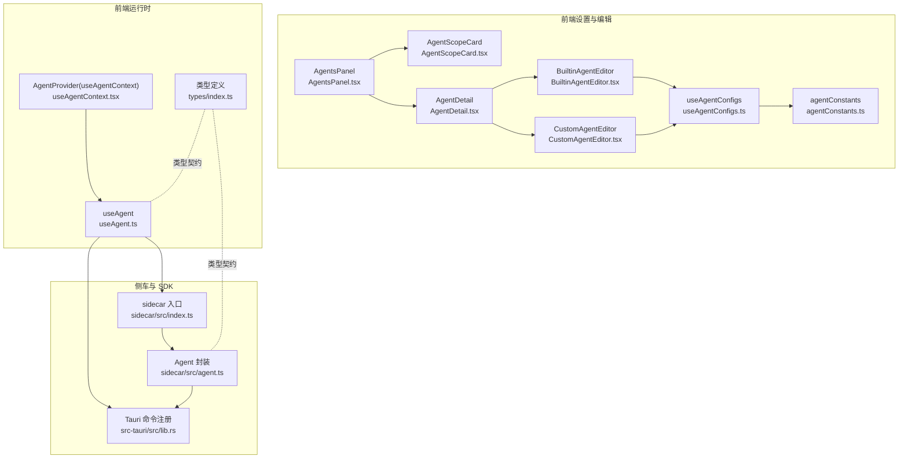
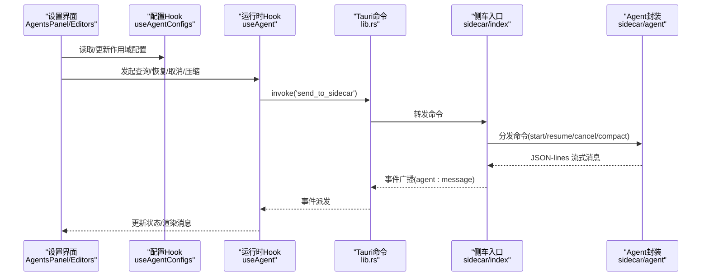
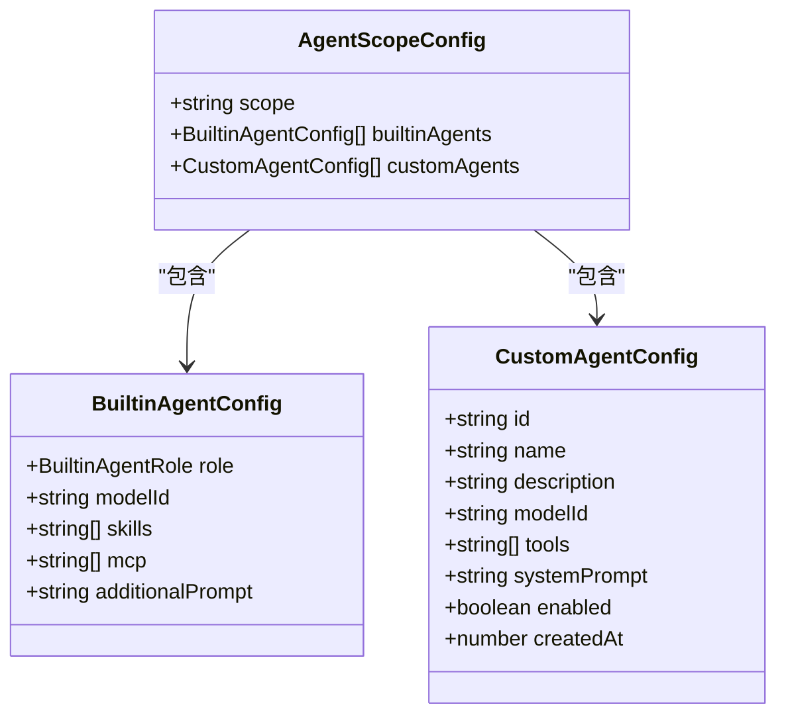
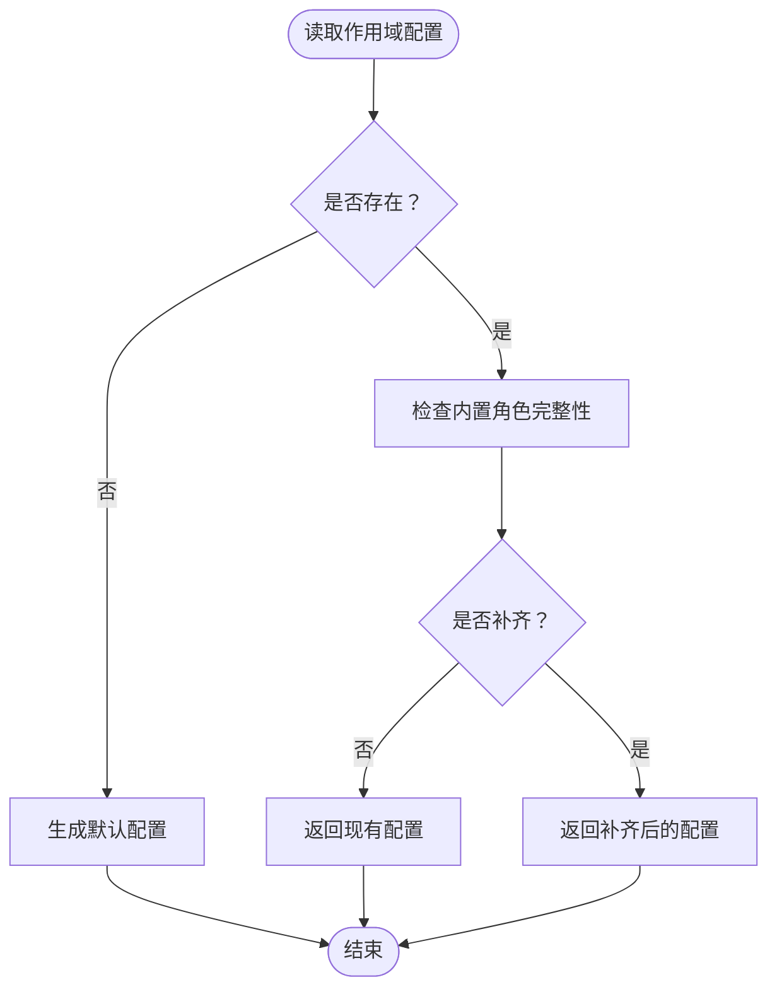
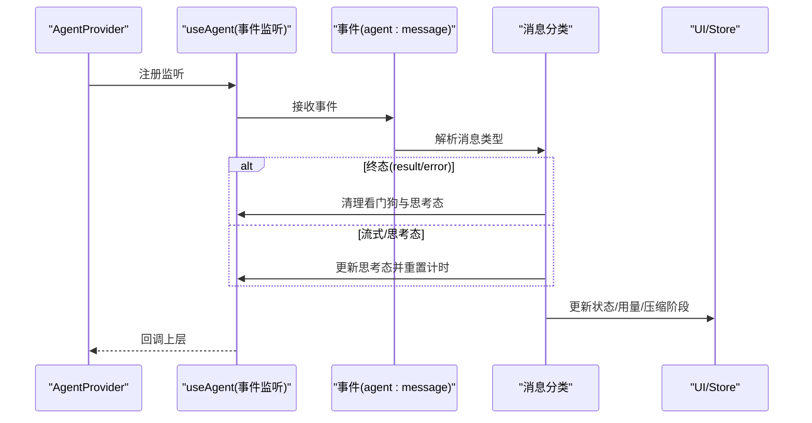
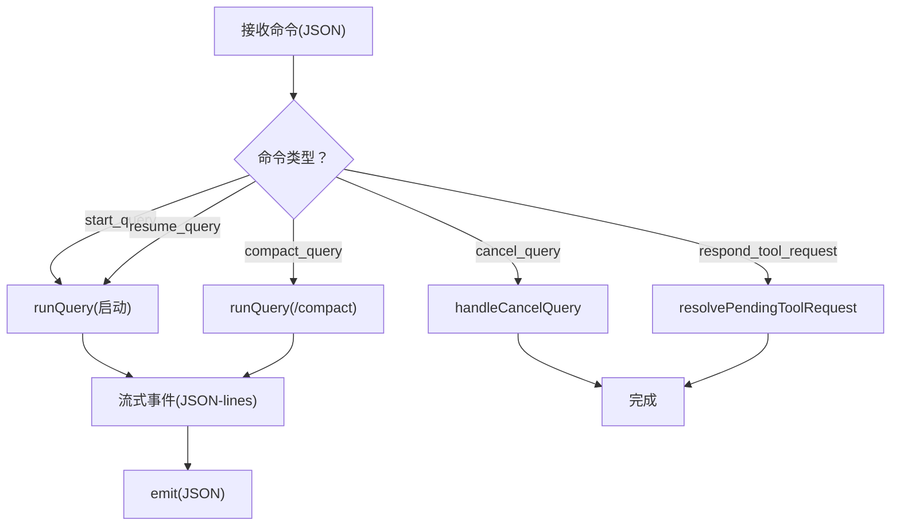
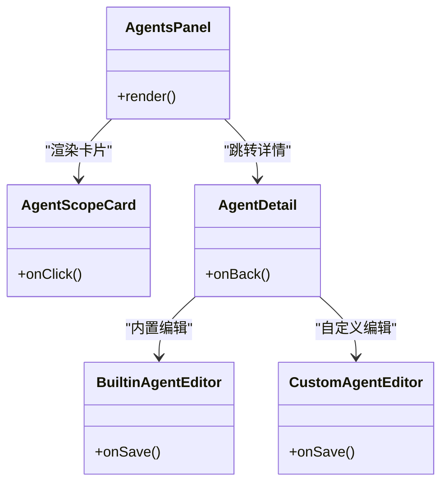
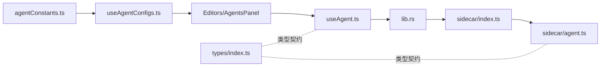

# 智能体配置

<cite>
**本文引用的文件**
- [src/components/settings/agents/agentConstants.ts](file://src/components/settings/agents/agentConstants.ts)
- [src/hooks/useAgentConfigs.ts](file://src/hooks/useAgentConfigs.ts)
- [src/hooks/useAgent.ts](file://src/hooks/useAgent.ts)
- [src/hooks/useAgentContext.tsx](file://src/hooks/useAgentContext.tsx)
- [src-tauri/src/lib.rs](file://src-tauri/src/lib.rs)
- [sidecar/src/index.ts](file://sidecar/src/index.ts)
- [sidecar/src/agent.ts](file://sidecar/src/agent.ts)
- [src/types/index.ts](file://src/types/index.ts)
- [src/components/settings/agents/AgentsPanel.tsx](file://src/components/settings/agents/AgentsPanel.tsx)
- [src/components/settings/agents/AgentScopeCard.tsx](file://src/components/settings/agents/AgentScopeCard.tsx)
- [src/components/settings/agents/AgentDetail.tsx](file://src/components/settings/agents/AgentDetail.tsx)
- [src/components/settings/agents/BuiltinAgentEditor.tsx](file://src/components/settings/agents/BuiltinAgentEditor.tsx)
- [src/components/settings/agents/CustomAgentEditor.tsx](file://src/components/settings/agents/CustomAgentEditor.tsx)
- [src/components/agent/AgentChat.tsx](file://src/components/agent/AgentChat.tsx)
</cite>

## 目录
1. [简介](#简介)
2. [项目结构](#项目结构)
3. [核心组件](#核心组件)
4. [架构总览](#架构总览)
5. [详细组件分析](#详细组件分析)
6. [依赖关系分析](#依赖关系分析)
7. [性能考量](#性能考量)
8. [故障排除指南](#故障排除指南)
9. [结论](#结论)
10. [附录](#附录)

## 简介
本文件面向 RabbitCoding 智能体配置系统，系统性阐述内置智能体与自定义智能体的创建、编辑、删除流程；解释智能体的工作范围（用户级、工作区级）、提示词模板与工具调用配置；梳理智能体生命周期管理、状态监控与性能优化策略；并给出协作机制、权限控制与版本管理建议，以及最佳实践、调试技巧与故障排除方法。

## 项目结构
智能体配置系统由三部分组成：
- 前端设置面板与编辑器：负责配置项的可视化编辑与持久化。
- 前端运行时 Hook：负责与侧车（Sidecar）通信、事件监听、查询生命周期管理。
- 侧车与 SDK：负责实际的智能体执行、工具调用、消息流式输出与会话压缩。

**图表来源**
- [src/components/settings/agents/AgentsPanel.tsx:1-79](file://src/components/settings/agents/AgentsPanel.tsx#L1-L79)
- [src/components/settings/agents/AgentScopeCard.tsx:1-57](file://src/components/settings/agents/AgentScopeCard.tsx#L1-L57)
- [src/components/settings/agents/AgentDetail.tsx:1-46](file://src/components/settings/agents/AgentDetail.tsx#L1-L46)
- [src/components/settings/agents/BuiltinAgentEditor.tsx:1-189](file://src/components/settings/agents/BuiltinAgentEditor.tsx#L1-L189)
- [src/components/settings/agents/CustomAgentEditor.tsx:1-161](file://src/components/settings/agents/CustomAgentEditor.tsx#L1-L161)
- [src/components/settings/agents/agentConstants.ts:1-84](file://src/components/settings/agents/agentConstants.ts#L1-L84)
- [src/hooks/useAgentConfigs.ts:1-130](file://src/hooks/useAgentConfigs.ts#L1-L130)
- [src/hooks/useAgent.ts:1-334](file://src/hooks/useAgent.ts#L1-L334)
- [src/hooks/useAgentContext.tsx:1-298](file://src/hooks/useAgentContext.tsx#L1-L298)
- [sidecar/src/index.ts:1-145](file://sidecar/src/index.ts#L1-L145)
- [sidecar/src/agent.ts:1-606](file://sidecar/src/agent.ts#L1-L606)
- [src-tauri/src/lib.rs:344-387](file://src-tauri/src/lib.rs#L344-L387)
- [src/types/index.ts:360-408](file://src/types/index.ts#L360-L408)

**章节来源**
- [src/components/settings/agents/AgentsPanel.tsx:1-79](file://src/components/settings/agents/AgentsPanel.tsx#L1-L79)
- [src/components/settings/agents/AgentScopeCard.tsx:1-57](file://src/components/settings/agents/AgentScopeCard.tsx#L1-L57)
- [src/components/settings/agents/AgentDetail.tsx:1-46](file://src/components/settings/agents/AgentDetail.tsx#L1-L46)
- [src/components/settings/agents/BuiltinAgentEditor.tsx:1-189](file://src/components/settings/agents/BuiltinAgentEditor.tsx#L1-L189)
- [src/components/settings/agents/CustomAgentEditor.tsx:1-161](file://src/components/settings/agents/CustomAgentEditor.tsx#L1-L161)
- [src/components/settings/agents/agentConstants.ts:1-84](file://src/components/settings/agents/agentConstants.ts#L1-L84)
- [src/hooks/useAgentConfigs.ts:1-130](file://src/hooks/useAgentConfigs.ts#L1-L130)
- [src/hooks/useAgent.ts:1-334](file://src/hooks/useAgent.ts#L1-L334)
- [src/hooks/useAgentContext.tsx:1-298](file://src/hooks/useAgentContext.tsx#L1-L298)
- [sidecar/src/index.ts:1-145](file://sidecar/src/index.ts#L1-L145)
- [sidecar/src/agent.ts:1-606](file://sidecar/src/agent.ts#L1-L606)
- [src-tauri/src/lib.rs:344-387](file://src-tauri/src/lib.rs#L344-L387)
- [src/types/index.ts:360-408](file://src/types/index.ts#L360-L408)

## 核心组件
- 智能体配置常量与工厂：定义内置专家角色、工具选项、默认配置生成器，确保新增/迁移时的向后兼容。
- 配置持久化 Hook：封装 localStorage 读写、作用域补齐、内置/自定义智能体的增删改。
- 运行时 Hook：负责 Sidecar 生命周期、查询生命周期、事件监听与看门狗超时控制。
- 侧车与 SDK：解析命令、驱动 Claude Agent SDK、流式输出消息、处理工具调用与会话压缩。
- 设置面板与编辑器：卡片式作用域导航、内置/自定义智能体的可视化编辑与保存。
- 类型契约：统一前后端消息、查询选项、状态与工具能力的类型定义。

**章节来源**
- [src/components/settings/agents/agentConstants.ts:21-84](file://src/components/settings/agents/agentConstants.ts#L21-L84)
- [src/hooks/useAgentConfigs.ts:17-129](file://src/hooks/useAgentConfigs.ts#L17-L129)
- [src/hooks/useAgent.ts:53-333](file://src/hooks/useAgent.ts#L53-L333)
- [sidecar/src/index.ts:37-91](file://sidecar/src/index.ts#L37-L91)
- [sidecar/src/agent.ts:241-465](file://sidecar/src/agent.ts#L241-L465)
- [src/components/settings/agents/AgentsPanel.tsx:17-78](file://src/components/settings/agents/AgentsPanel.tsx#L17-L78)
- [src/components/settings/agents/BuiltinAgentEditor.tsx:82-188](file://src/components/settings/agents/BuiltinAgentEditor.tsx#L82-L188)
- [src/components/settings/agents/CustomAgentEditor.tsx:23-160](file://src/components/settings/agents/CustomAgentEditor.tsx#L23-L160)
- [src/types/index.ts:360-408](file://src/types/index.ts#L360-L408)

## 架构总览
RabbitCoding 的智能体配置采用“设置面板（前端）+ 运行时 Hook（前端）+ 侧车（Node）+ SDK（Claude Agent SDK）”的分层架构。前端通过 Tauri 命令与侧车交互，侧车以 JSON-lines 协议将 SDK 的流式消息广播给前端，前端在上下文 Provider 中统一消费与落库。

**图表来源**
- [src/hooks/useAgent.ts:156-243](file://src/hooks/useAgent.ts#L156-L243)
- [src-tauri/src/lib.rs:353-356](file://src-tauri/src/lib.rs#L353-L356)
- [sidecar/src/index.ts:37-91](file://sidecar/src/index.ts#L37-L91)
- [sidecar/src/agent.ts:470-497](file://sidecar/src/agent.ts#L470-L497)

## 详细组件分析

### 智能体配置常量与工厂
- 内置专家角色：研究者、全栈、测试、评审、UI 操作员、调试器，提供默认提示词与工具集合。
- 工具选项：与 Claude Agent SDK 工具对齐，支持 Read/Write/Edit/Bash/Glob/Grep/WebSearch/WebFetch/Task/TodoWrite。
- 默认配置工厂：生成用户级/作用域级默认配置，内置智能体补齐缺失角色，自定义智能体生成默认字段。

**图表来源**
- [src/components/settings/agents/agentConstants.ts:54-83](file://src/components/settings/agents/agentConstants.ts#L54-L83)
- [src/types/index.ts:374-400](file://src/types/index.ts#L374-L400)

**章节来源**
- [src/components/settings/agents/agentConstants.ts:24-83](file://src/components/settings/agents/agentConstants.ts#L24-L83)
- [src/types/index.ts:364-408](file://src/types/index.ts#L364-L408)

### 配置持久化 Hook（useAgentConfigs）
- 作用域读取：若不存在返回默认配置（不写入 localStorage），并对内置角色进行容错补齐。
- 内置智能体更新：按 role 匹配替换。
- 自定义智能体管理：新增（生成 id 与创建时间）、更新（按 id 替换）、删除（按 id 过滤）。
- 作用域确保：若作用域不存在则写入默认配置。

**图表来源**
- [src/hooks/useAgentConfigs.ts:25-38](file://src/hooks/useAgentConfigs.ts#L25-L38)

**章节来源**
- [src/hooks/useAgentConfigs.ts:17-129](file://src/hooks/useAgentConfigs.ts#L17-L129)

### 运行时 Hook（useAgent）与上下文（AgentProvider）
- Sidecar 生命周期：启动、停止、状态检查；进程退出时统一收敛为 error。
- 查询生命周期：启动查询、恢复会话、取消查询、手动压缩；取消查询会标记并清理 pending 请求。
- 事件监听：解析 agent:message，区分系统初始化、流式增量、工具调用、最终结果、错误、压缩状态与用量更新；根据消息类型更新 UI 与统计。
- 看门狗：每条查询独立计时，思考态使用更长阈值，静默无消息时触发超时回调。
- 上下文提升：将监听与回调提升至 Provider，避免页面切换导致消息丢失。

**图表来源**
- [src/hooks/useAgent.ts:262-320](file://src/hooks/useAgent.ts#L262-L320)
- [src/hooks/useAgentContext.tsx:93-179](file://src/hooks/useAgentContext.tsx#L93-L179)

**章节来源**
- [src/hooks/useAgent.ts:53-333](file://src/hooks/useAgent.ts#L53-L333)
- [src/hooks/useAgentContext.tsx:88-297](file://src/hooks/useAgentContext.tsx#L88-L297)

### 侧车与 SDK（sidecar）
- 命令分发：start_query/resume_query/cancel_query/compact_query/respond_tool_request/shutdown。
- SDK 封装：将 query() 的增量事件转换为 JSON-lines 流，包括 thinking/text 增量、工具调用、工具结果、最终结果、压缩状态与用量更新。
- AskUserQuestion：前端提问消息，等待用户回答或超时；支持取消。
- 规范文档（WriteSpec）：在 plan 模式下写入规范文档，完成后异步中止查询。

**图表来源**
- [sidecar/src/index.ts:37-91](file://sidecar/src/index.ts#L37-L91)
- [sidecar/src/agent.ts:241-465](file://sidecar/src/agent.ts#L241-L465)

**章节来源**
- [sidecar/src/index.ts:37-144](file://sidecar/src/index.ts#L37-L144)
- [sidecar/src/agent.ts:470-595](file://sidecar/src/agent.ts#L470-L595)

### 设置面板与编辑器
- 作用域卡片：用户级（始终存在）与工作区级卡片，点击进入详情视图。
- 详情视图：面包屑 + 内置专家团分区 + 自定义分区。
- 内置智能体编辑器：模型选择、技能标签输入、MCP 标签输入、追加提示词。
- 自定义智能体编辑器：名称/描述、模型、工具芯片选择、系统提示词。

**图表来源**
- [src/components/settings/agents/AgentsPanel.tsx:17-78](file://src/components/settings/agents/AgentsPanel.tsx#L17-L78)
- [src/components/settings/agents/AgentScopeCard.tsx:17-56](file://src/components/settings/agents/AgentScopeCard.tsx#L17-L56)
- [src/components/settings/agents/AgentDetail.tsx:18-45](file://src/components/settings/agents/AgentDetail.tsx#L18-L45)
- [src/components/settings/agents/BuiltinAgentEditor.tsx:82-188](file://src/components/settings/agents/BuiltinAgentEditor.tsx#L82-L188)
- [src/components/settings/agents/CustomAgentEditor.tsx:23-160](file://src/components/settings/agents/CustomAgentEditor.tsx#L23-L160)

**章节来源**
- [src/components/settings/agents/AgentsPanel.tsx:17-78](file://src/components/settings/agents/AgentsPanel.tsx#L17-L78)
- [src/components/settings/agents/AgentScopeCard.tsx:17-56](file://src/components/settings/agents/AgentScopeCard.tsx#L17-L56)
- [src/components/settings/agents/AgentDetail.tsx:18-45](file://src/components/settings/agents/AgentDetail.tsx#L18-L45)
- [src/components/settings/agents/BuiltinAgentEditor.tsx:82-188](file://src/components/settings/agents/BuiltinAgentEditor.tsx#L82-L188)
- [src/components/settings/agents/CustomAgentEditor.tsx:23-160](file://src/components/settings/agents/CustomAgentEditor.tsx#L23-L160)

### 智能体工作范围与权限控制
- 工作范围：用户级（__user__）与工作区级（workspace.id）。用户级配置为全局默认，工作区级覆盖用户级。
- 权限模式：acceptEdits/dontAsk/bypassPermissions/plan，影响工具调用许可与编辑行为。
- 工具调用：allowedTools 控制可用工具集；AskUserQuestion 用于交互式问答；WriteSpec 用于规范文档写入。
- 文件系统隔离：通过注入 CLAUDE_CONFIG_DIR 与 SDK settingSources 空值，阻断全局 settings/plugins/skills/agents/commands/hooks，确保沙箱化。

**章节来源**
- [src/types/index.ts:285-292](file://src/types/index.ts#L285-L292)
- [sidecar/src/agent.ts:255-303](file://sidecar/src/agent.ts#L255-L303)
- [src-tauri/src/lib.rs:226-283](file://src-tauri/src/lib.rs#L226-L283)

### 智能体生命周期管理与状态监控
- 生命周期：system/init（会话初始化）→ assistant(text/thinking/tool_use) → tool_result → result/error → usage_update/compaction。
- 状态机：running/completed/error/idle；压缩阶段 compacting/done/failed。
- 监控指标：token 用量、turn 次数、耗时、费用；实时用量通过 usage_update 更新。
- UI 展示：AgentChat 将消息分组、合并连续文本、自动滚动；压缩中/失败状态提示。

**章节来源**
- [src/types/index.ts:82-283](file://src/types/index.ts#L82-L283)
- [src/hooks/useAgentContext.tsx:104-178](file://src/hooks/useAgentContext.tsx#L104-L178)
- [src/components/agent/AgentChat.tsx:38-85](file://src/components/agent/AgentChat.tsx#L38-L85)

### 智能体协作机制与版本管理
- 协作机制：通过会话 ID（sessionId）恢复对话；AskUserQuestion 支持多轮交互与超时控制。
- 版本管理：内置智能体角色与配置的默认值在 agentConstants 中集中管理；新增角色时自动补齐，保障跨版本兼容。
- 配置版本：localStorage 中的 agent-configs 以 scope 为键，支持用户级与工作区级并存。

**章节来源**
- [src/hooks/useAgent.ts:182-205](file://src/hooks/useAgent.ts#L182-L205)
- [src/components/settings/agents/agentConstants.ts:54-71](file://src/components/settings/agents/agentConstants.ts#L54-L71)

## 依赖关系分析
- 前端设置与运行时通过类型契约（types/index.ts）保持一致，避免消息结构不匹配。
- useAgentConfigs 依赖 agentConstants 生成默认配置；useAgent 依赖 Tauri 命令与 sidecar 协议；sidecar 依赖 Claude Agent SDK。
- AgentProvider 将事件监听提升至应用层级，减少组件卸载带来的消息丢失风险。

**图表来源**
- [src/components/settings/agents/agentConstants.ts:54-83](file://src/components/settings/agents/agentConstants.ts#L54-L83)
- [src/hooks/useAgentConfigs.ts:17-129](file://src/hooks/useAgentConfigs.ts#L17-L129)
- [src/hooks/useAgent.ts:106-177](file://src/hooks/useAgent.ts#L106-L177)
- [src-tauri/src/lib.rs:353-356](file://src-tauri/src/lib.rs#L353-L356)
- [sidecar/src/index.ts:37-91](file://sidecar/src/index.ts#L37-L91)
- [sidecar/src/agent.ts:470-497](file://sidecar/src/agent.ts#L470-L497)
- [src/types/index.ts:360-408](file://src/types/index.ts#L360-L408)

**章节来源**
- [src/components/settings/agents/agentConstants.ts:54-83](file://src/components/settings/agents/agentConstants.ts#L54-L83)
- [src/hooks/useAgentConfigs.ts:17-129](file://src/hooks/useAgentConfigs.ts#L17-L129)
- [src/hooks/useAgent.ts:106-177](file://src/hooks/useAgent.ts#L106-L177)
- [src-tauri/src/lib.rs:353-356](file://src-tauri/src/lib.rs#L353-L356)
- [sidecar/src/index.ts:37-91](file://sidecar/src/index.ts#L37-L91)
- [sidecar/src/agent.ts:470-497](file://sidecar/src/agent.ts#L470-L497)
- [src/types/index.ts:360-408](file://src/types/index.ts#L360-L408)

## 性能考量
- 流式增量渲染：前端按增量消息追加，避免大段文本重绘；自动滚动仅在用户靠近底部时触发。
- 用量与预算：maxBudgetUsd 限制成本；maxTurns 控制回合数；usage_update 提供实时 token 统计。
- 思考态放宽：思考态使用更长超时阈值，避免长思考被误判超时。
- 会话压缩：定期或手动触发压缩，降低 token 占用，提升后续响应速度。
- 侧车隔离：通过环境变量与 SDK settingSources 空值，避免外部配置污染，提高稳定性。

[本节为通用性能讨论，无需具体文件引用]

## 故障排除指南
- 侧车未启动/异常退出：检查 start_sidecar 返回；AgentProvider 在 sidecar-exit 时将所有 running 的任务收敛为 error。
- 查询无响应：看门狗超时触发，UI 显示“长时间无响应”并终止；检查网络与模型配置。
- 工具调用失败：查看 tool_result 的 isError 标记与输出；确认 allowedTools 与 MCP 配置。
- AskUserQuestion 未响应：前端 5 分钟超时自动拒绝；检查前端状态与请求 ID。
- 会话卡死：使用 compactQuery 手动压缩；关注 compaction 状态与失败原因。
- 权限问题：调整 permissionMode 与 allowedTools；确认 CLAUDE_CONFIG_DIR 注入生效。

**章节来源**
- [src/hooks/useAgent.ts:290-296](file://src/hooks/useAgent.ts#L290-L296)
- [src/hooks/useAgentContext.tsx:180-192](file://src/hooks/useAgentContext.tsx#L180-L192)
- [sidecar/src/agent.ts:502-543](file://sidecar/src/agent.ts#L502-L543)
- [src-tauri/src/lib.rs:226-283](file://src-tauri/src/lib.rs#L226-L283)

## 结论
RabbitCoding 的智能体配置系统通过清晰的分层设计与严格的类型契约，实现了从配置到执行的全链路可控。用户可在用户级与工作区级灵活配置内置与自定义智能体，借助侧车与 SDK 的流式能力与权限控制，获得稳定、可观测、可扩展的智能体体验。配合上下文 Provider 的事件提升与看门狗机制，系统在复杂交互与长时任务中仍能保持高可靠性。

[本节为总结性内容，无需具体文件引用]

## 附录
- 最佳实践
  - 优先使用用户级默认配置，工作区级仅覆盖必要差异。
  - 为自定义智能体设定明确的 tools 与 systemPrompt，避免过度开放。
  - 合理设置 maxTurns 与 maxBudgetUsd，平衡质量与成本。
  - 定期触发会话压缩，保持上下文精简。
- 调试技巧
  - 使用 AgentChat 查看消息分组与工具调用链路。
  - 关注 usage_update 与 compaction_result，定位性能瓶颈。
  - 在 devtools 中观察 sidecar 输出与事件队列。
- 版本管理建议
  - 新增内置智能体角色时，通过 createDefaultBuiltinAgent 与 createDefaultScopeConfig 自动生成默认配置。
  - 迁移配置时依赖 getScopeConfig 的容错补齐，避免破坏既有设置。

[本节为通用建议，无需具体文件引用]