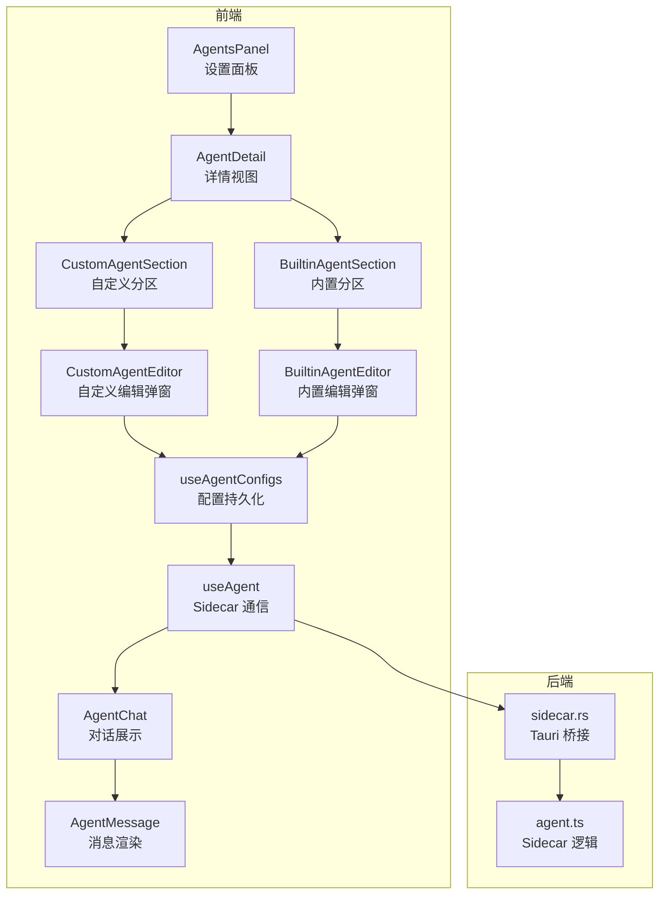
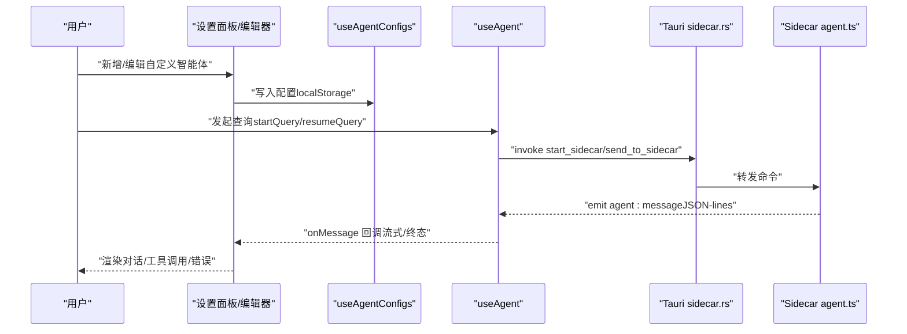
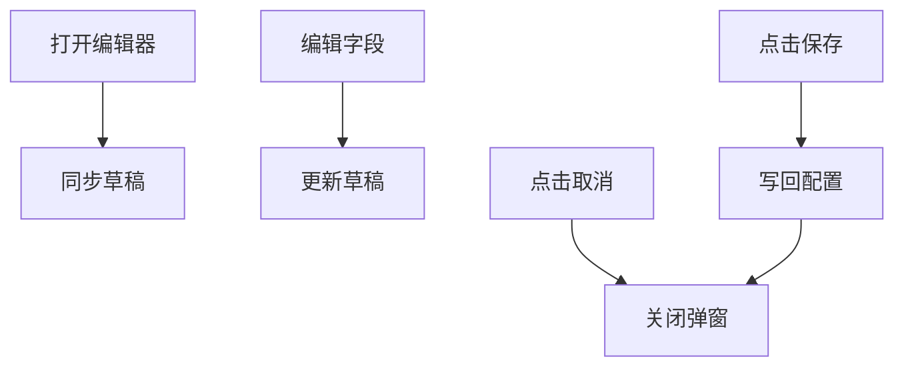
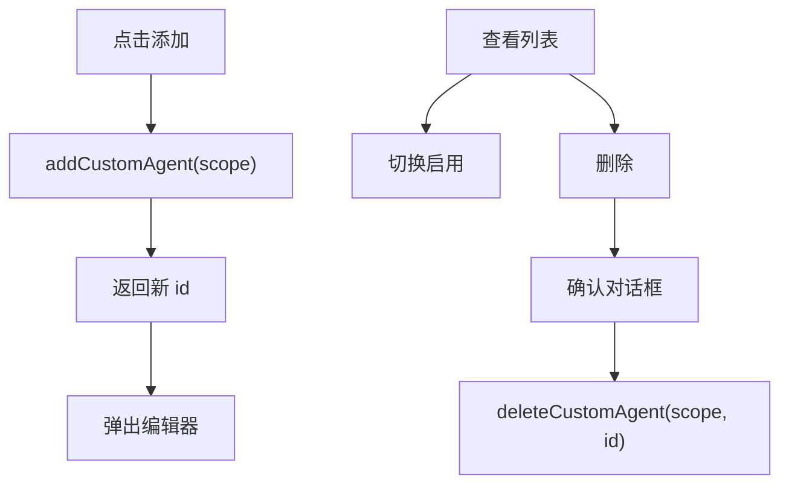
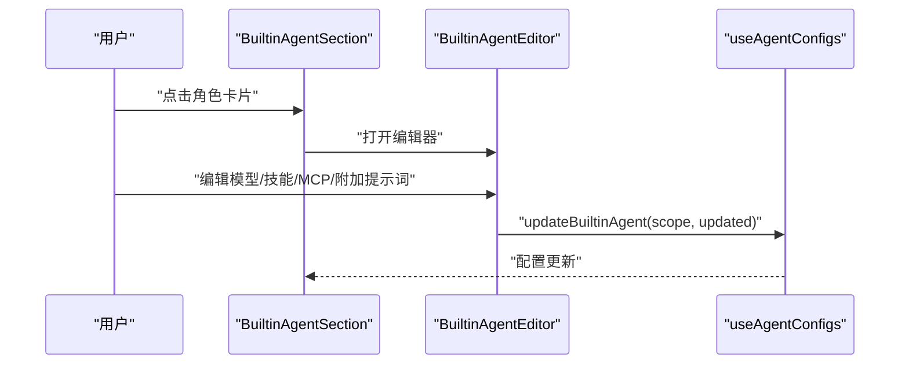
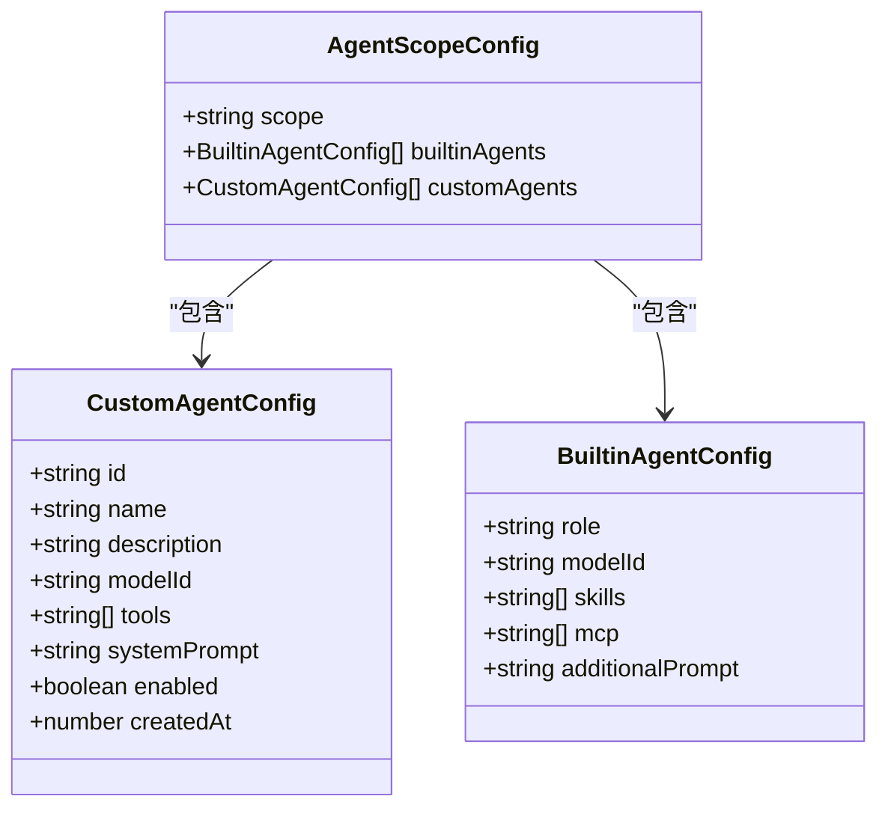
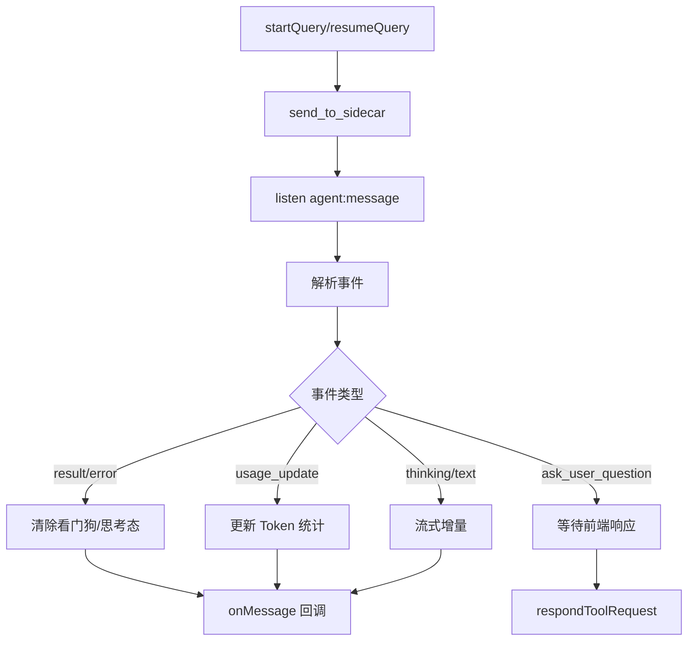
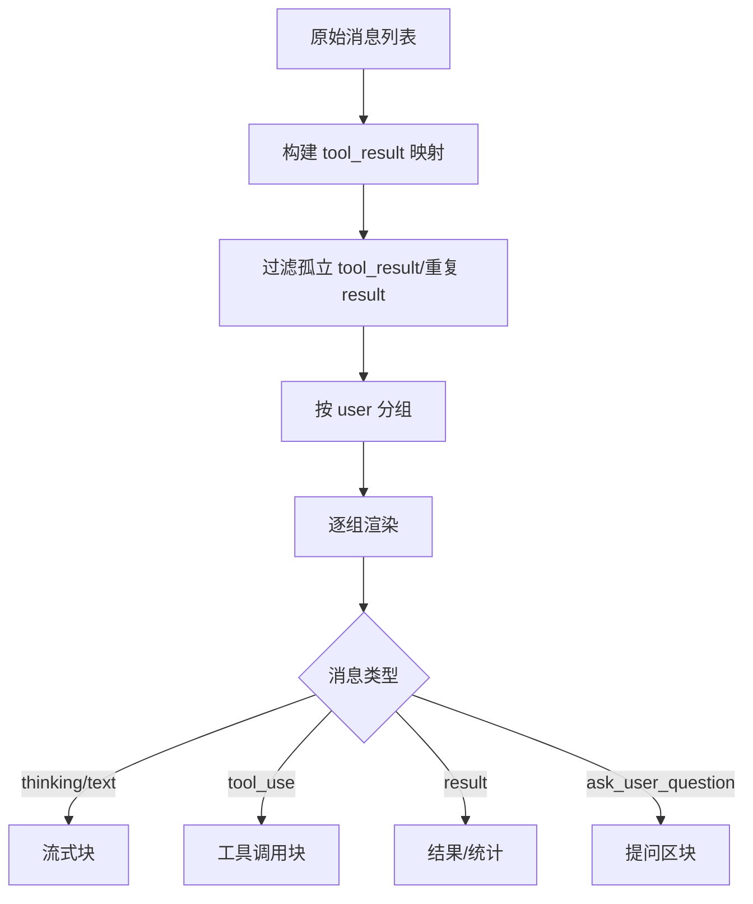
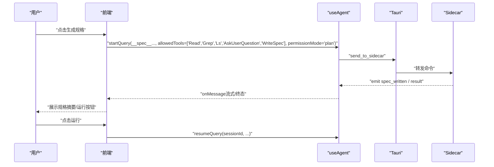
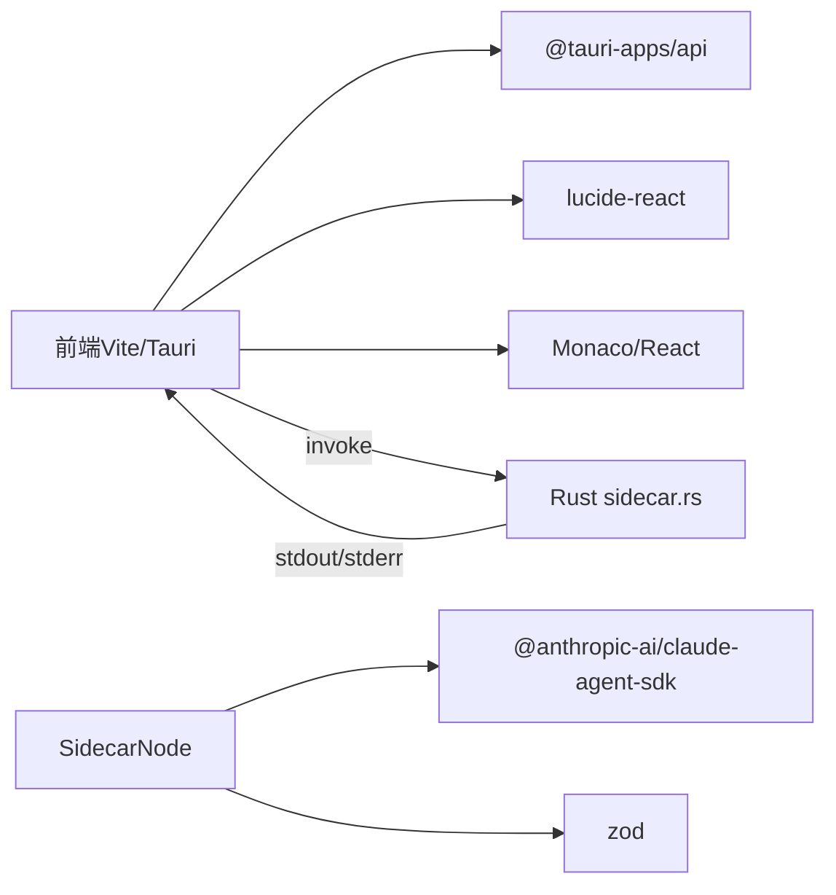

# 自定义智能体

<cite>
**本文引用的文件**
- [CustomAgentEditor.tsx](file://src/components/settings/agents/CustomAgentEditor.tsx)
- [AgentsPanel.tsx](file://src/components/settings/agents/AgentsPanel.tsx)
- [AgentDetail.tsx](file://src/components/settings/agents/AgentDetail.tsx)
- [CustomAgentSection.tsx](file://src/components/settings/agents/CustomAgentSection.tsx)
- [BuiltinAgentSection.tsx](file://src/components/settings/agents/BuiltinAgentSection.tsx)
- [BuiltinAgentEditor.tsx](file://src/components/settings/agents/BuiltinAgentEditor.tsx)
- [agentConstants.ts](file://src/components/settings/agents/agentConstants.ts)
- [useAgent.ts](file://src/hooks/useAgent.ts)
- [useAgentConfigs.ts](file://src/hooks/useAgentConfigs.ts)
- [types/index.ts](file://src/types/index.ts)
- [AgentChat.tsx](file://src/components/agent/AgentChat.tsx)
- [AgentMessage.tsx](file://src/components/agent/AgentMessage.tsx)
- [specGenerator.ts](file://src/utils/specGenerator.ts)
- [sidecar.rs](file://src-tauri/src/sidecar.rs)
- [agent.ts](file://sidecar/src/agent.ts)
- [package.json](file://package.json)
</cite>

## 目录
1. [简介](#简介)
2. [项目结构](#项目结构)
3. [核心组件](#核心组件)
4. [架构总览](#架构总览)
5. [详细组件分析](#详细组件分析)
6. [依赖关系分析](#依赖关系分析)
7. [性能考量](#性能考量)
8. [故障排查指南](#故障排查指南)
9. [结论](#结论)
10. [附录](#附录)

## 简介
本文件面向 RabbitCoding 的“自定义智能体”能力，提供从创建、编辑、到生命周期管理（新增、更新、删除、复制、导入导出）的完整技术文档。重点涵盖：
- 自定义智能体的界面与配置项：名称、描述、模型、工具集合、系统提示词
- 内置专家智能体的配置入口与高级编辑
- 智能体配置的本地持久化与作用域管理（用户级/工作区级）
- 与 Claude Agent SDK Sidecar 的通信链路、事件流、工具调用与上下文管理
- 响应格式化、错误处理、超时与看门狗机制
- 开发调试建议与部署最佳实践

## 项目结构
自定义智能体功能由前端设置面板与后端 Sidecar 两部分协作实现：
- 设置面板负责可视化配置与持久化
- Sidecar 负责与 Claude Agent SDK 交互，流式输出消息并处理工具调用
- Tauri Rust 层桥接前端与 Sidecar，负责进程生命周期与事件转发

图表来源
- [AgentsPanel.tsx:17-78](file://src/components/settings/agents/AgentsPanel.tsx#L17-L78)
- [AgentDetail.tsx:18-45](file://src/components/settings/agents/AgentDetail.tsx#L18-L45)
- [CustomAgentSection.tsx:18-131](file://src/components/settings/agents/CustomAgentSection.tsx#L18-L131)
- [BuiltinAgentSection.tsx:21-98](file://src/components/settings/agents/BuiltinAgentSection.tsx#L21-L98)
- [CustomAgentEditor.tsx:23-160](file://src/components/settings/agents/CustomAgentEditor.tsx#L23-L160)
- [BuiltinAgentEditor.tsx:82-188](file://src/components/settings/agents/BuiltinAgentEditor.tsx#L82-L188)
- [useAgentConfigs.ts:17-129](file://src/hooks/useAgentConfigs.ts#L17-L129)
- [useAgent.ts:53-333](file://src/hooks/useAgent.ts#L53-L333)
- [AgentChat.tsx:92-219](file://src/components/agent/AgentChat.tsx#L92-L219)
- [AgentMessage.tsx:43-197](file://src/components/agent/AgentMessage.tsx#L43-L197)
- [sidecar.rs:61-279](file://src-tauri/src/sidecar.rs#L61-L279)
- [agent.ts:470-497](file://sidecar/src/agent.ts#L470-L497)

章节来源
- [AgentsPanel.tsx:17-78](file://src/components/settings/agents/AgentsPanel.tsx#L17-L78)
- [AgentDetail.tsx:18-45](file://src/components/settings/agents/AgentDetail.tsx#L18-L45)
- [CustomAgentSection.tsx:18-131](file://src/components/settings/agents/CustomAgentSection.tsx#L18-L131)
- [BuiltinAgentSection.tsx:21-98](file://src/components/settings/agents/BuiltinAgentSection.tsx#L21-L98)
- [CustomAgentEditor.tsx:23-160](file://src/components/settings/agents/CustomAgentEditor.tsx#L23-L160)
- [BuiltinAgentEditor.tsx:82-188](file://src/components/settings/agents/BuiltinAgentEditor.tsx#L82-L188)
- [useAgentConfigs.ts:17-129](file://src/hooks/useAgentConfigs.ts#L17-L129)
- [useAgent.ts:53-333](file://src/hooks/useAgent.ts#L53-L333)
- [AgentChat.tsx:92-219](file://src/components/agent/AgentChat.tsx#L92-L219)
- [AgentMessage.tsx:43-197](file://src/components/agent/AgentMessage.tsx#L43-L197)
- [sidecar.rs:61-279](file://src-tauri/src/sidecar.rs#L61-L279)
- [agent.ts:470-497](file://sidecar/src/agent.ts#L470-L497)

## 核心组件
- 设置面板与详情视图：提供用户级与工作区级智能体配置入口，支持内置专家智能体与自定义智能体的分组管理。
- 自定义智能体编辑器：提供名称、描述、模型、工具集合、系统提示词的可视化编辑，采用草稿态并在保存时回写。
- 内置智能体编辑器：支持模型绑定、技能标签、MCP 服务、附加提示词等高级配置。
- 配置持久化 Hook：基于 localStorage 管理智能体配置，确保作用域隔离与默认值补齐。
- Sidecar 通信 Hook：封装启动/停止、查询启动/恢复/取消/压缩、AskUserQuestion 响应等操作，监听事件流并处理超时与思考态。
- 对话渲染：将 Agent 消息流按组合并、关联工具调用与结果、展示思考态与流式文本。

章节来源
- [AgentsPanel.tsx:17-78](file://src/components/settings/agents/AgentsPanel.tsx#L17-L78)
- [AgentDetail.tsx:18-45](file://src/components/settings/agents/AgentDetail.tsx#L18-L45)
- [CustomAgentSection.tsx:18-131](file://src/components/settings/agents/CustomAgentSection.tsx#L18-L131)
- [CustomAgentEditor.tsx:23-160](file://src/components/settings/agents/CustomAgentEditor.tsx#L23-L160)
- [BuiltinAgentSection.tsx:21-98](file://src/components/settings/agents/BuiltinAgentSection.tsx#L21-L98)
- [BuiltinAgentEditor.tsx:82-188](file://src/components/settings/agents/BuiltinAgentEditor.tsx#L82-L188)
- [useAgentConfigs.ts:17-129](file://src/hooks/useAgentConfigs.ts#L17-L129)
- [useAgent.ts:53-333](file://src/hooks/useAgent.ts#L53-L333)
- [AgentChat.tsx:92-219](file://src/components/agent/AgentChat.tsx#L92-L219)
- [AgentMessage.tsx:43-197](file://src/components/agent/AgentMessage.tsx#L43-L197)

## 架构总览
自定义智能体的端到端流程如下：
- 用户在设置面板中新增/编辑自定义智能体，配置写入 localStorage
- 前端通过 useAgent 发起查询，经 Tauri 命令发送至 Sidecar
- Sidecar 调用 Claude Agent SDK，按配置启用工具与权限模式，流式输出消息
- 前端监听 agent:message 事件，渲染对话并处理 AskUserQuestion 等特殊消息
- 支持会话压缩、取消、超时看门狗与思考态豁免

图表来源
- [useAgentConfigs.ts:67-104](file://src/hooks/useAgentConfigs.ts#L67-L104)
- [useAgent.ts:156-205](file://src/hooks/useAgent.ts#L156-L205)
- [sidecar.rs:61-243](file://src-tauri/src/sidecar.rs#L61-L243)
- [agent.ts:470-497](file://sidecar/src/agent.ts#L470-L497)

## 详细组件分析

### 自定义智能体编辑器（CustomAgentEditor）
- 功能要点
  - 草稿态编辑：内部维护 draft，确认后写回
  - 字段：名称、描述、模型（下拉）、工具集合（多选芯片）、系统提示词（文本域）
  - 工具集合与系统提示词长度限制与字数提示
- 交互流程
  - 打开时同步草稿
  - 保存时调用父组件回调，写入 useAgentConfigs
  - 关闭时关闭弹窗

图表来源
- [CustomAgentEditor.tsx:23-160](file://src/components/settings/agents/CustomAgentEditor.tsx#L23-L160)

章节来源
- [CustomAgentEditor.tsx:23-160](file://src/components/settings/agents/CustomAgentEditor.tsx#L23-L160)
- [agentConstants.ts:39-51](file://src/components/settings/agents/agentConstants.ts#L39-L51)

### 自定义智能体分区（CustomAgentSection）
- 功能要点
  - 新增：调用 useAgentConfigs.addCustomAgent，返回 id 并自动弹出编辑
  - 列表：展示名称、描述、启用开关、删除按钮、跳转编辑
  - 删除：确认后调用 useAgentConfigs.deleteCustomAgent
- 生命周期
  - 读取 scope 配置，支持空状态占位
  - 编辑弹窗与编辑器联动

图表来源
- [CustomAgentSection.tsx:24-36](file://src/components/settings/agents/CustomAgentSection.tsx#L24-L36)
- [useAgentConfigs.ts:66-87](file://src/hooks/useAgentConfigs.ts#L66-L87)

章节来源
- [CustomAgentSection.tsx:18-131](file://src/components/settings/agents/CustomAgentSection.tsx#L18-L131)
- [useAgentConfigs.ts:66-119](file://src/hooks/useAgentConfigs.ts#L66-L119)

### 内置智能体分区与编辑器（BuiltinAgentSection/BuiltinAgentEditor）
- 功能要点
  - 内置专家智能体角色固定（研究者、全栈、QA、评审、UI 操作员、调试器）
  - 编辑器支持：关联模型、技能标签、MCP 标签、附加提示词
  - 摘要展示：根据 modelId 显示模型名称
- 交互流程
  - 点击角色卡片弹出编辑器
  - 保存后调用 useAgentConfigs.updateBuiltinAgent

图表来源
- [BuiltinAgentSection.tsx:57-76](file://src/components/settings/agents/BuiltinAgentSection.tsx#L57-L76)
- [BuiltinAgentEditor.tsx:82-188](file://src/components/settings/agents/BuiltinAgentEditor.tsx#L82-L188)
- [useAgentConfigs.ts:49-64](file://src/hooks/useAgentConfigs.ts#L49-L64)

章节来源
- [BuiltinAgentSection.tsx:21-98](file://src/components/settings/agents/BuiltinAgentSection.tsx#L21-L98)
- [BuiltinAgentEditor.tsx:82-188](file://src/components/settings/agents/BuiltinAgentEditor.tsx#L82-L188)
- [agentConstants.ts:24-37](file://src/components/settings/agents/agentConstants.ts#L24-L37)

### 配置持久化与作用域（useAgentConfigs）
- 设计要点
  - 以 scope 为键管理配置（用户级 __user__ 与各工作区）
  - 默认配置补齐：首次访问自动补全内置专家智能体
  - 增删改查：新增自定义智能体、更新内置/自定义、删除自定义
- 数据结构
  - AgentScopeConfig：scope、builtinAgents、customAgents
  - CustomAgentConfig：id、name、description、modelId、tools、systemPrompt、enabled、createdAt

图表来源
- [types/index.ts:402-408](file://src/types/index.ts#L402-L408)
- [types/index.ts:386-400](file://src/types/index.ts#L386-L400)
- [types/index.ts:373-384](file://src/types/index.ts#L373-L384)

章节来源
- [useAgentConfigs.ts:17-129](file://src/hooks/useAgentConfigs.ts#L17-L129)
- [agentConstants.ts:64-83](file://src/components/settings/agents/agentConstants.ts#L64-L83)
- [types/index.ts:402-408](file://src/types/index.ts#L402-L408)

### Sidecar 通信与事件流（useAgent）
- 能力范围
  - 启动/停止/检查 Sidecar 状态
  - 发送 start_query/resume_query/cancel_query/compact_query 命令
  - 监听 agent:message 与 agent:sidecar-exit 事件
  - 超时看门狗：普通态 10 分钟，思考态 30 分钟
  - 思考态分类：enter/exit，影响看门狗阈值
- 事件处理
  - 解析 JSON-lines，区分 result/error/usage_update/ask_user_question 等
  - 清理/重置看门狗，处理取消与异常

图表来源
- [useAgent.ts:156-205](file://src/hooks/useAgent.ts#L156-L205)
- [useAgent.ts:262-320](file://src/hooks/useAgent.ts#L262-L320)
- [agent.ts:146-198](file://sidecar/src/agent.ts#L146-L198)
- [agent.ts:205-236](file://sidecar/src/agent.ts#L205-L236)

章节来源
- [useAgent.ts:53-333](file://src/hooks/useAgent.ts#L53-L333)
- [agent.ts:238-465](file://sidecar/src/agent.ts#L238-L465)

### 对话渲染与消息处理（AgentChat/AgentMessage）
- 消息预处理
  - 构建 tool_result 映射，过滤孤立 tool_result
  - 识别最后一条 result，避免重复展示
  - 过滤 ExitPlanMode 工具调用
  - 按 user 消息分组，实现“下一条推走上条”的粘性布局
- 渲染策略
  - 思考态、流式文本、工具调用与结果、压缩状态、错误与耗时/费用/Token 统计
  - AskUserQuestion 专用区块，支持前端响应

图表来源
- [AgentChat.tsx:38-90](file://src/components/agent/AgentChat.tsx#L38-L90)
- [AgentMessage.tsx:43-197](file://src/components/agent/AgentMessage.tsx#L43-L197)

章节来源
- [AgentChat.tsx:92-219](file://src/components/agent/AgentChat.tsx#L92-L219)
- [AgentMessage.tsx:43-197](file://src/components/agent/AgentMessage.tsx#L43-L197)

### 规格文档（Spec）生成与运行
- 生成流程
  - 以 __spec__ 前缀构造 queryId，构建专用 prompt
  - 允许 Read/Glob/Grep/Ls/AskUserQuestion/mcp__rabbit-spec__WriteSpec 工具
  - plan 权限模式，最多 5 轮
  - 监听 agent:message，优先处理 spec_written（WriteSpec 成功），否则 fallback 到 result.result 文本
  - 超时保护 300 秒
- 运行流程
  - 前端收到 spec_confirmation 后，用户点击“运行”，调用 resumeQuery 并传入 session_id

图表来源
- [specGenerator.ts:142-171](file://src/utils/specGenerator.ts#L142-L171)
- [specGenerator.ts:195-299](file://src/utils/specGenerator.ts#L195-L299)
- [agent.ts:263-289](file://sidecar/src/agent.ts#L263-L289)
- [agent.ts:502-543](file://sidecar/src/agent.ts#L502-L543)

章节来源
- [specGenerator.ts:19-32](file://src/utils/specGenerator.ts#L19-L32)
- [specGenerator.ts:93-116](file://src/utils/specGenerator.ts#L93-L116)
- [specGenerator.ts:142-171](file://src/utils/specGenerator.ts#L142-L171)
- [specGenerator.ts:195-299](file://src/utils/specGenerator.ts#L195-L299)
- [agent.ts:263-289](file://sidecar/src/agent.ts#L263-L289)
- [agent.ts:502-543](file://sidecar/src/agent.ts#L502-L543)

## 依赖关系分析
- 前端依赖
  - @tauri-apps/api：与 Rust 层通信（invoke/listen）
  - lucide-react：图标
  - Monaco Editor/React：编辑器与终端
- 后端依赖
  - @anthropic-ai/claude-agent-sdk：Agent SDK
  - zod：工具参数校验
- 构建与打包
  - Vite + Tauri CLI
  - sidecar 资源打包与运行

图表来源
- [package.json:14-44](file://package.json#L14-L44)
- [sidecar.rs:1-50](file://src-tauri/src/sidecar.rs#L1-L50)
- [agent.ts:12-26](file://sidecar/src/agent.ts#L12-L26)

章节来源
- [package.json:14-44](file://package.json#L14-L44)
- [sidecar.rs:1-50](file://src-tauri/src/sidecar.rs#L1-L50)
- [agent.ts:12-26](file://sidecar/src/agent.ts#L12-L26)

## 性能考量
- 流式渲染与自动滚动
  - 仅在用户位于底部或新消息到达时滚动到底部，减少不必要的 DOM 操作
- 超时与看门狗
  - 普通态 10 分钟，思考态 30 分钟，避免长思考被误判
  - 统一清理与释放，防止内存泄漏
- Token 统计与用量展示
  - 按 turn 粒度推送 usage_update，前端可选择显示总消耗与轮次
- 会话压缩
  - 压缩阶段显示“压缩中”指示，失败时提示

章节来源
- [AgentChat.tsx:114-135](file://src/components/agent/AgentChat.tsx#L114-L135)
- [useAgent.ts:66-101](file://src/hooks/useAgent.ts#L66-L101)
- [agent.ts:146-198](file://sidecar/src/agent.ts#L146-L198)
- [AgentMessage.tsx:88-113](file://src/components/agent/AgentMessage.tsx#L88-L113)

## 故障排查指南
- Sidecar 无法启动
  - 检查 start_sidecar 返回值与错误信息
  - 确认 API Key/Base URL 环境变量注入正确
  - 查看 stderr 日志（Rust 侧打印）
- 无事件/无响应
  - 确认监听已注册再发送查询（竞态修复）
  - 设置 300 秒超时，避免永久阻塞
- 工具调用被拒
  - plan 权限模式下，WriteSpec 仅在 spec 查询中允许
  - AskUserQuestion 超时（5 分钟）或被取消
- 会话压缩失败
  - 查看 compaction_failed 消息与错误原因
- 代理与网络
  - 可通过网络诊断面板检查代理与连通性

章节来源
- [sidecar.rs:61-214](file://src-tauri/src/sidecar.rs#L61-L214)
- [agent.ts:502-543](file://sidecar/src/agent.ts#L502-L543)
- [specGenerator.ts:195-299](file://src/utils/specGenerator.ts#L195-L299)
- [AgentMessage.tsx:200-206](file://src/components/agent/AgentMessage.tsx#L200-L206)

## 结论
RabbitCoding 的自定义智能体体系以“设置面板 + Sidecar + Tauri 桥接”为核心，实现了从配置到对话的完整闭环。通过草稿态编辑、作用域隔离、权限模式与工具白名单、流式事件与超时看门狗，既保证了易用性也兼顾了稳定性。配合规格文档生成与运行流程，进一步提升了工程落地效率。

## 附录
- 开发调试建议
  - 使用浏览器开发者工具观察 agent:message 事件与 Sidecar 日志
  - 在 Rust 层开启详细日志，定位 stdout/stderr 事件丢失
  - 通过 spec 生成流程验证 WriteSpec 工具与前端落盘
- 部署最佳实践
  - 生产模式下确保 sidecar 资源随包打包，Node 运行时路径正确
  - 严格隔离 CLAUDE_CONFIG_DIR，避免全局配置污染
  - 为工具调用配置最小权限集，必要时使用 plan 模式与 AskUserQuestion 明确需求