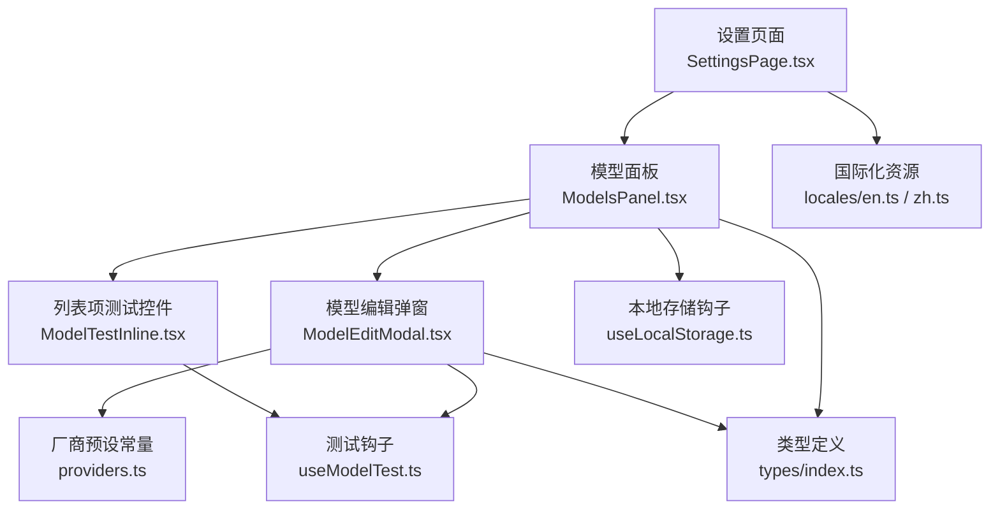
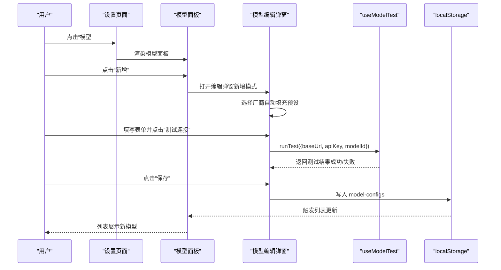
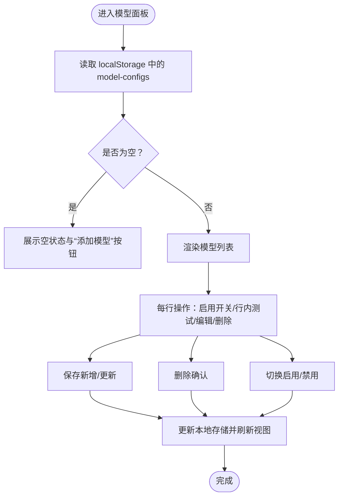
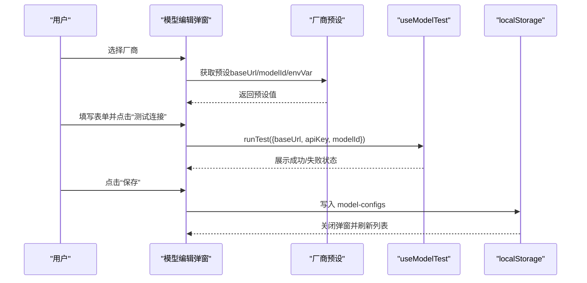
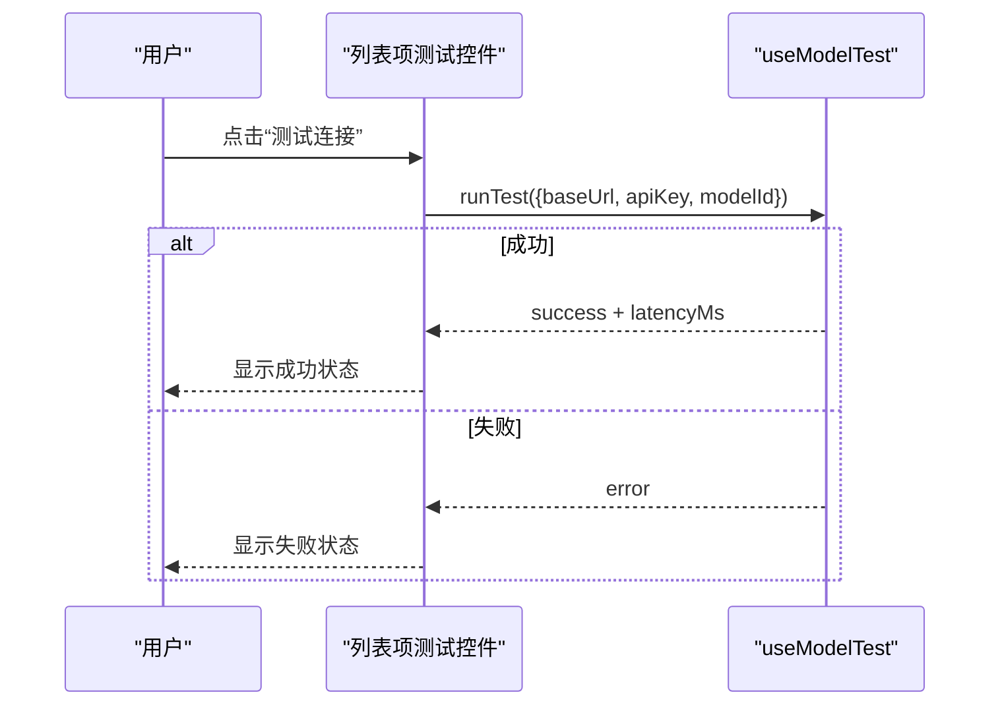
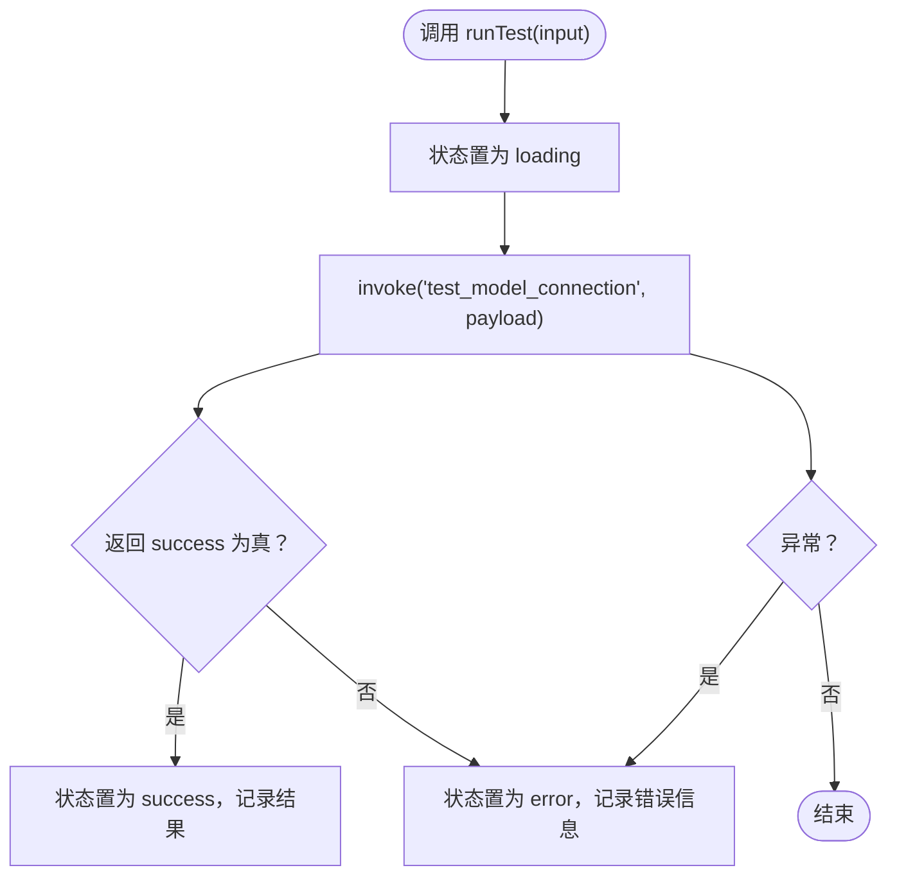
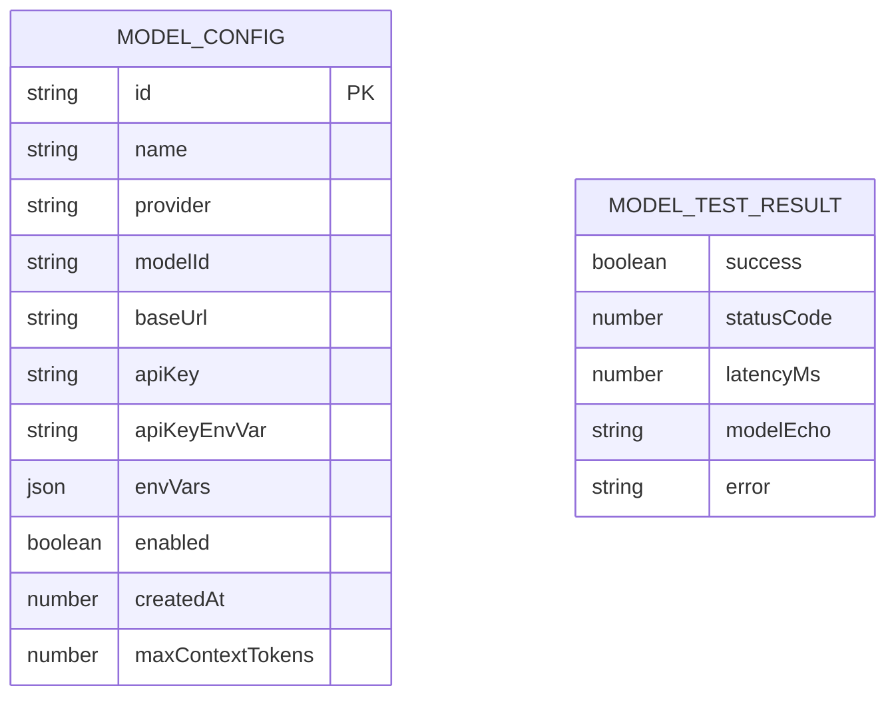
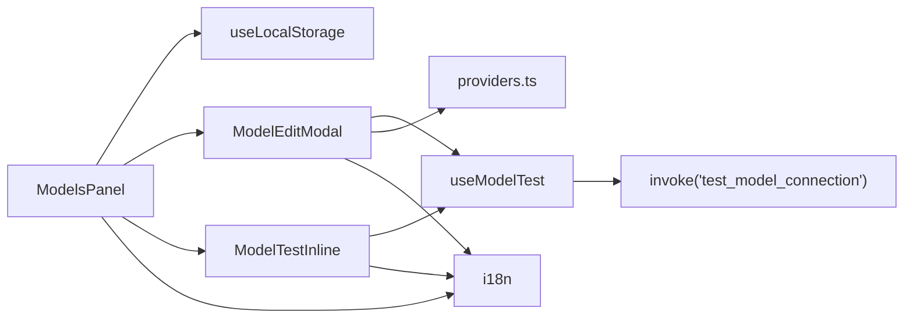

# 模型列表管理

<cite>
**本文引用的文件**   
- [src/components/settings/ModelsPanel.tsx](file://src/components/settings/ModelsPanel.tsx)
- [src/components/settings/ModelEditModal.tsx](file://src/components/settings/ModelEditModal.tsx)
- [src/components/settings/ModelTestInline.tsx](file://src/components/settings/ModelTestInline.tsx)
- [src/hooks/useModelTest.ts](file://src/hooks/useModelTest.ts)
- [src/hooks/useLocalStorage.ts](file://src/hooks/useLocalStorage.ts)
- [src/constants/providers.ts](file://src/constants/providers.ts)
- [src/types/index.ts](file://src/types/index.ts)
- [src/components/settings/SettingsPage.tsx](file://src/components/settings/SettingsPage.tsx)
- [src/i18n/locales/en.ts](file://src/i18n/locales/en.ts)
- [src/i18n/locales/zh.ts](file://src/i18n/locales/zh.ts)
</cite>

## 目录
1. [简介](#简介)
2. [项目结构](#项目结构)
3. [核心组件](#核心组件)
4. [架构总览](#架构总览)
5. [详细组件分析](#详细组件分析)
6. [依赖关系分析](#依赖关系分析)
7. [性能考量](#性能考量)
8. [故障排查指南](#故障排查指南)
9. [结论](#结论)
10. [附录](#附录)

## 简介
本文件围绕 RabbitCoding 的“模型列表管理”能力进行系统化说明，覆盖以下方面：
- 模型配置列表的显示、排序、筛选机制
- 模型状态管理（启用/禁用）
- 模型信息展示（名称、提供商、模型ID、基础URL）
- 交互操作（新增、编辑、删除、切换状态、连接测试）
- 数据结构、存储机制与本地化支持
- 最佳实践与用户体验优化建议

## 项目结构
模型列表功能位于设置页面的“模型”分区内，采用 React 组件化设计，配合本地存储与国际化模块协同工作。

图示来源
- [src/components/settings/SettingsPage.tsx:105-112](file://src/components/settings/SettingsPage.tsx#L105-L112)
- [src/components/settings/ModelsPanel.tsx:16-147](file://src/components/settings/ModelsPanel.tsx#L16-L147)
- [src/components/settings/ModelEditModal.tsx:69-383](file://src/components/settings/ModelEditModal.tsx#L69-L383)
- [src/components/settings/ModelTestInline.tsx:17-63](file://src/components/settings/ModelTestInline.tsx#L17-L63)
- [src/hooks/useModelTest.ts:35-70](file://src/hooks/useModelTest.ts#L35-L70)
- [src/hooks/useLocalStorage.ts:3-26](file://src/hooks/useLocalStorage.ts#L3-L26)
- [src/constants/providers.ts:14-62](file://src/constants/providers.ts#L14-L62)
- [src/types/index.ts:320-344](file://src/types/index.ts#L320-L344)
- [src/i18n/locales/en.ts:1-200](file://src/i18n/locales/en.ts#L1-L200)
- [src/i18n/locales/zh.ts:1-200](file://src/i18n/locales/zh.ts#L1-L200)

章节来源
- [src/components/settings/SettingsPage.tsx:105-112](file://src/components/settings/SettingsPage.tsx#L105-L112)
- [src/components/settings/ModelsPanel.tsx:16-147](file://src/components/settings/ModelsPanel.tsx#L16-L147)

## 核心组件
- 模型面板（ModelsPanel）：负责渲染模型列表、提供新增/编辑/删除/启用切换入口，并与本地存储交互。
- 模型编辑弹窗（ModelEditModal）：提供完整的模型配置编辑界面，含厂商预设、表单校验、连接测试草稿能力。
- 列表项测试控件（ModelTestInline）：每个列表项内嵌的测试按钮与状态徽标，独立维护测试状态。
- 测试钩子（useModelTest）：封装测试状态机（空闲/加载/成功/失败），统一调用后端命令。
- 本地存储钩子（useLocalStorage）：以键值形式持久化模型配置，键为 model-configs。
- 厂商预设常量（providers.ts）：提供厂商标签、默认 Base URL、默认模型ID、API Key 环境变量等。
- 类型定义（types/index.ts）：定义 ModelConfig、ModelProvider、ModelTestResult 等核心类型。
- 国际化（locales/en.ts、locales/zh.ts）：提供多语言文案支撑。

章节来源
- [src/components/settings/ModelsPanel.tsx:16-147](file://src/components/settings/ModelsPanel.tsx#L16-L147)
- [src/components/settings/ModelEditModal.tsx:69-383](file://src/components/settings/ModelEditModal.tsx#L69-L383)
- [src/components/settings/ModelTestInline.tsx:17-63](file://src/components/settings/ModelTestInline.tsx#L17-L63)
- [src/hooks/useModelTest.ts:35-70](file://src/hooks/useModelTest.ts#L35-L70)
- [src/hooks/useLocalStorage.ts:3-26](file://src/hooks/useLocalStorage.ts#L3-L26)
- [src/constants/providers.ts:14-62](file://src/constants/providers.ts#L14-L62)
- [src/types/index.ts:320-344](file://src/types/index.ts#L320-L344)
- [src/i18n/locales/en.ts:1-200](file://src/i18n/locales/en.ts#L1-L200)
- [src/i18n/locales/zh.ts:1-200](file://src/i18n/locales/zh.ts#L1-L200)

## 架构总览
模型列表管理采用“前端状态 + 本地存储 + 后端测试”的分层架构：
- 视图层：ModelsPanel 展示列表；ModelEditModal 提供编辑；ModelTestInline 提供行内测试。
- 状态层：useLocalStorage 管理 model-configs；useModelTest 管理测试状态机。
- 数据层：ModelConfig 结构体承载模型配置；ProviderPreset 承载厂商预设。
- 交互层：设置页面 SettingsPage 负责导航与面板切换。

图示来源
- [src/components/settings/SettingsPage.tsx:105-112](file://src/components/settings/SettingsPage.tsx#L105-L112)
- [src/components/settings/ModelsPanel.tsx:16-147](file://src/components/settings/ModelsPanel.tsx#L16-L147)
- [src/components/settings/ModelEditModal.tsx:69-383](file://src/components/settings/ModelEditModal.tsx#L69-L383)
- [src/hooks/useModelTest.ts:35-70](file://src/hooks/useModelTest.ts#L35-L70)
- [src/hooks/useLocalStorage.ts:3-26](file://src/hooks/useLocalStorage.ts#L3-L26)

## 详细组件分析

### 模型列表面板（ModelsPanel）
- 功能职责
  - 读取并展示本地存储中的模型配置列表
  - 支持新增、编辑、删除、启用/禁用切换
  - 提供空状态占位与“添加模型”入口
- 数据与交互
  - 使用 useLocalStorage 读写键 model-configs
  - handleAdd/handleEdit/handleSave/handleDelete/handleToggle 实现 CRUD 与启停控制
  - 列表项展示：名称、提供商标签、modelId、baseUrl
  - 每行右侧包含：启用开关、行内测试、编辑、删除
- 本地化
  - 标题、描述、空状态文案、按钮文案均来自国际化资源

图示来源
- [src/components/settings/ModelsPanel.tsx:16-147](file://src/components/settings/ModelsPanel.tsx#L16-L147)
- [src/hooks/useLocalStorage.ts:3-26](file://src/hooks/useLocalStorage.ts#L3-L26)

章节来源
- [src/components/settings/ModelsPanel.tsx:16-147](file://src/components/settings/ModelsPanel.tsx#L16-L147)
- [src/hooks/useLocalStorage.ts:3-26](file://src/hooks/useLocalStorage.ts#L3-L26)

### 模型编辑弹窗（ModelEditModal）
- 功能职责
  - 新增/编辑模型配置
  - 厂商选择器联动预设（自动填充 baseUrl、modelId、API Key 环境变量）
  - 表单校验（名称、模型ID、Base URL、API Key 必填）
  - 草稿测试：无需保存即可测试连接
- 数据与交互
  - 表单状态映射至 ModelConfig 结构
  - 保存时生成唯一 id（若为空）、清理空环境变量条目
  - 调用 useModelTest 执行测试
- 本地化
  - 字段标签、占位符、按钮文案、错误提示均来自国际化资源

图示来源
- [src/components/settings/ModelEditModal.tsx:69-383](file://src/components/settings/ModelEditModal.tsx#L69-L383)
- [src/constants/providers.ts:14-62](file://src/constants/providers.ts#L14-L62)
- [src/hooks/useModelTest.ts:35-70](file://src/hooks/useModelTest.ts#L35-L70)

章节来源
- [src/components/settings/ModelEditModal.tsx:69-383](file://src/components/settings/ModelEditModal.tsx#L69-L383)
- [src/constants/providers.ts:14-62](file://src/constants/providers.ts#L14-L62)
- [src/hooks/useModelTest.ts:35-70](file://src/hooks/useModelTest.ts#L35-L70)

### 列表项测试控件（ModelTestInline）
- 功能职责
  - 每个列表项内嵌“测试连接”按钮与状态徽标
  - 独立维护测试状态机，互不影响
- 交互流程
  - 点击触发测试，使用当前列表项配置调用后端命令
  - 成功显示绿勾并可展示延迟；失败显示红叉并提示错误

图示来源
- [src/components/settings/ModelTestInline.tsx:17-63](file://src/components/settings/ModelTestInline.tsx#L17-L63)
- [src/hooks/useModelTest.ts:35-70](file://src/hooks/useModelTest.ts#L35-L70)

章节来源
- [src/components/settings/ModelTestInline.tsx:17-63](file://src/components/settings/ModelTestInline.tsx#L17-L63)
- [src/hooks/useModelTest.ts:35-70](file://src/hooks/useModelTest.ts#L35-L70)

### 测试钩子（useModelTest）
- 状态机
  - idle → loading → success | error
- 调用方式
  - 通过 @tauri-apps/api/core.invoke 调用后端命令 test_model_connection
  - 参数键名转换为 snake_case（base_url、api_key、model_id）
- 错误处理
  - 统一捕获异常并设置 error 状态
  - 成功时根据返回字段 success、statusCode、latencyMs、modelEcho、error 更新状态

图示来源
- [src/hooks/useModelTest.ts:35-70](file://src/hooks/useModelTest.ts#L35-L70)

章节来源
- [src/hooks/useModelTest.ts:35-70](file://src/hooks/useModelTest.ts#L35-L70)

### 本地存储与数据结构
- 存储键
  - model-configs：数组，元素为 ModelConfig
- 数据结构
  - ModelConfig：id、name、provider、modelId、baseUrl、apiKey、apiKeyEnvVar、envVars、enabled、createdAt、maxContextTokens?
  - ModelTestResult：success、statusCode、latencyMs、modelEcho、error
- 本地存储钩子
  - useLocalStorage 提供读写封装，异常时降级为默认值

图示来源
- [src/types/index.ts:320-344](file://src/types/index.ts#L320-L344)

章节来源
- [src/types/index.ts:320-344](file://src/types/index.ts#L320-L344)
- [src/hooks/useLocalStorage.ts:3-26](file://src/hooks/useLocalStorage.ts#L3-L26)

### 厂商预设与本地化
- 厂商预设
  - PROVIDER_PRESETS 定义各厂商的标签键、默认 Base URL、默认模型ID、API Key 环境变量
  - getPreset 根据 provider 返回对应预设
- 本地化
  - settings.models.provider.{suffix} 用于展示厂商标签
  - settings.models.* 用于表单字段、按钮、提示文案

章节来源
- [src/constants/providers.ts:14-62](file://src/constants/providers.ts#L14-L62)
- [src/i18n/locales/en.ts:1-200](file://src/i18n/locales/en.ts#L1-L200)
- [src/i18n/locales/zh.ts:1-200](file://src/i18n/locales/zh.ts#L1-L200)

## 依赖关系分析
- 组件耦合
  - ModelsPanel 依赖 useLocalStorage、useI18n、ModelEditModal、ModelTestInline
  - ModelEditModal 依赖 useModelTest、providers.ts、useI18n、generateId
  - ModelTestInline 依赖 useModelTest、useI18n
- 外部依赖
  - @tauri-apps/api/core.invoke 用于后端命令调用
  - localStorage 用于前端持久化
- 循环依赖
  - 未发现循环依赖迹象

图示来源
- [src/components/settings/ModelsPanel.tsx:16-147](file://src/components/settings/ModelsPanel.tsx#L16-L147)
- [src/components/settings/ModelEditModal.tsx:69-383](file://src/components/settings/ModelEditModal.tsx#L69-L383)
- [src/components/settings/ModelTestInline.tsx:17-63](file://src/components/settings/ModelTestInline.tsx#L17-L63)
- [src/hooks/useModelTest.ts:35-70](file://src/hooks/useModelTest.ts#L35-L70)
- [src/constants/providers.ts:14-62](file://src/constants/providers.ts#L14-L62)

章节来源
- [src/components/settings/ModelsPanel.tsx:16-147](file://src/components/settings/ModelsPanel.tsx#L16-L147)
- [src/components/settings/ModelEditModal.tsx:69-383](file://src/components/settings/ModelEditModal.tsx#L69-L383)
- [src/components/settings/ModelTestInline.tsx:17-63](file://src/components/settings/ModelTestInline.tsx#L17-L63)
- [src/hooks/useModelTest.ts:35-70](file://src/hooks/useModelTest.ts#L35-L70)

## 性能考量
- 列表渲染
  - 当前实现按数组顺序渲染，未内置排序/筛选逻辑；若模型数量增长，建议在渲染前进行稳定排序与轻量筛选，避免不必要的重排。
- 本地存储
  - localStorage 写入为同步操作，频繁保存可能阻塞主线程；建议合并保存或节流。
- 测试调用
  - 每个列表项独立维护测试状态，避免相互影响；但大量并发测试会增加后端压力，建议限制同时测试数量或引入队列。
- 国际化
  - i18n 查询为纯函数，成本低；确保文案键完整，减少运行时拼接。

## 故障排查指南
- 无法保存模型
  - 检查必填字段：名称、模型ID、Base URL、API Key
  - 查看弹窗内错误提示与控制台日志
- 连接测试失败
  - 确认 Base URL、API Key 正确
  - 查看测试结果中的错误信息（包含后端返回的友好描述）
- 列表不更新
  - 确认 localStorage 写入成功（键为 model-configs）
  - 刷新页面或检查是否有异常拦截写入
- 厂商预设未生效
  - 检查厂商选择器是否正确映射到预设
  - 确认预设键 settings.models.provider.{suffix} 在国际化资源中存在

章节来源
- [src/components/settings/ModelEditModal.tsx:121-128](file://src/components/settings/ModelEditModal.tsx#L121-L128)
- [src/hooks/useModelTest.ts:42-64](file://src/hooks/useModelTest.ts#L42-L64)
- [src/hooks/useLocalStorage.ts:13-23](file://src/hooks/useLocalStorage.ts#L13-L23)

## 结论
模型列表管理功能以清晰的组件边界与本地存储为核心，结合厂商预设与国际化资源，提供了完整的模型配置生命周期管理。通过独立的测试钩子与行内测试控件，用户可在不保存的前提下快速验证配置有效性。后续可在排序/筛选、批量操作、并发测试限流等方面进一步优化体验。

## 附录

### 模型配置数据结构与字段说明
- id：模型唯一标识（UUID）
- name：显示名称
- provider：厂商类型（枚举）
- modelId：模型标识符（传递给 API 的 model 字段）
- baseUrl：API 基础地址
- apiKey：API 密钥
- apiKeyEnvVar：注入运行环境时的环境变量名
- envVars：额外的自定义环境变量键值对
- enabled：是否启用（禁用的模型不出现在选择器中）
- createdAt：创建时间戳
- maxContextTokens：上下文窗口大小（tokens，默认 200000）

章节来源
- [src/types/index.ts:320-344](file://src/types/index.ts#L320-L344)