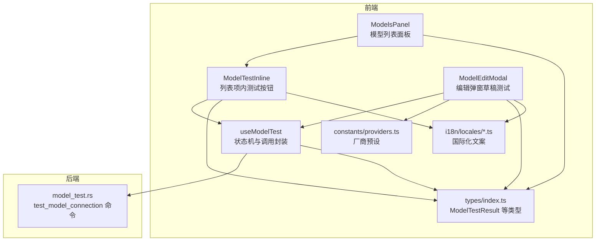
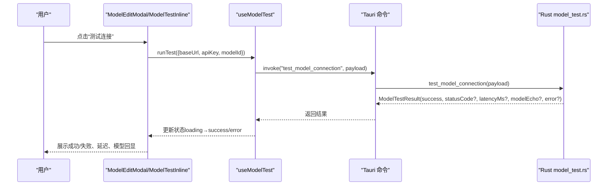
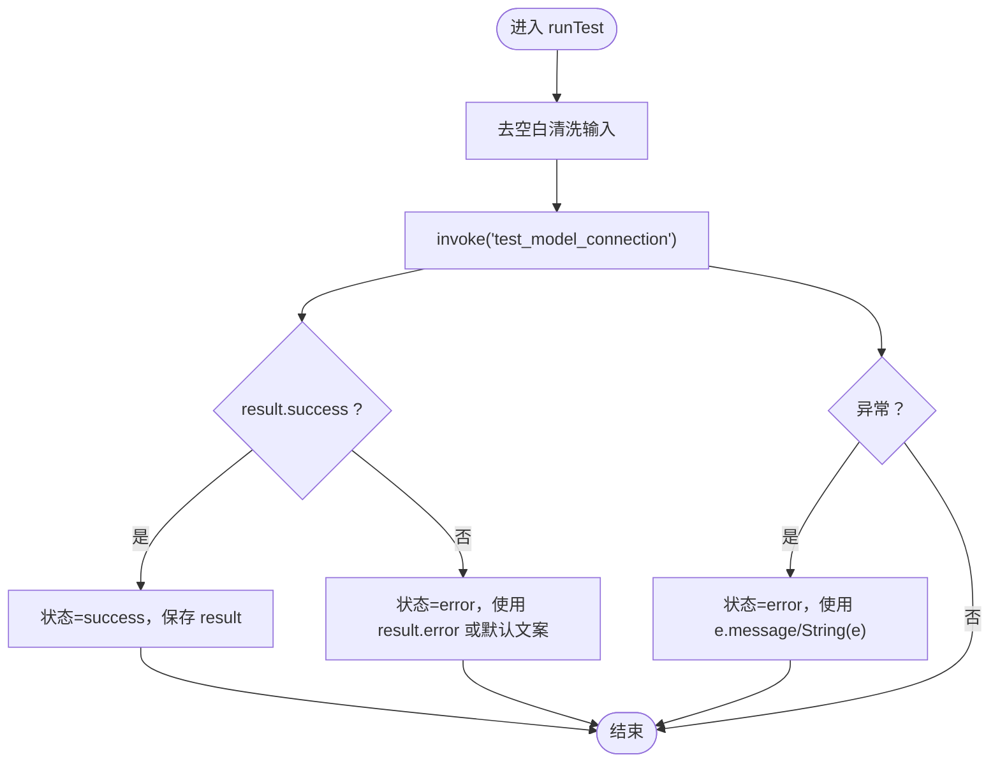
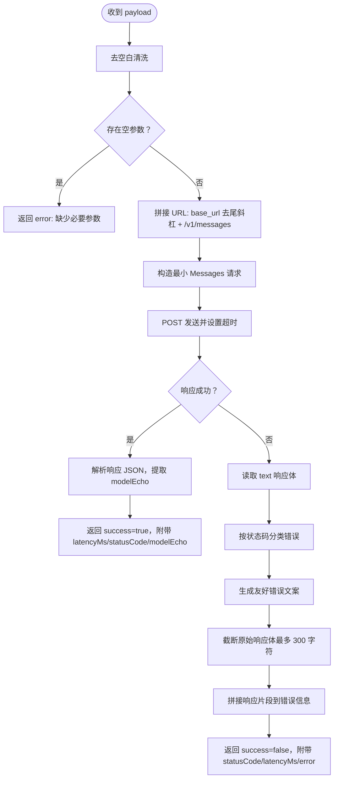
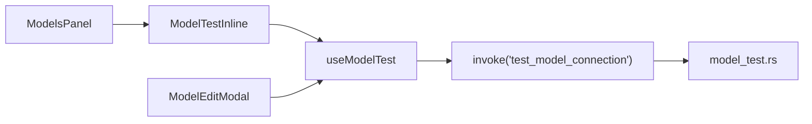

# 模型测试

<cite>
**本文引用的文件**
- [src/hooks/useModelTest.ts](file://src/hooks/useModelTest.ts)
- [src/components/settings/ModelTestInline.tsx](file://src/components/settings/ModelTestInline.tsx)
- [src/components/settings/ModelEditModal.tsx](file://src/components/settings/ModelEditModal.tsx)
- [src-tauri/src/model_test.rs](file://src-tauri/src/model_test.rs)
- [src/types/index.ts](file://src/types/index.ts)
- [src/constants/providers.ts](file://src/constants/providers.ts)
- [src/components/settings/ModelsPanel.tsx](file://src/components/settings/ModelsPanel.tsx)
- [src/i18n/locales/zh.ts](file://src/i18n/locales/zh.ts)
- [src/i18n/locales/en.ts](file://src/i18n/locales/en.ts)
</cite>

## 目录
1. [简介](#简介)
2. [项目结构](#项目结构)
3. [核心组件](#核心组件)
4. [架构总览](#架构总览)
5. [详细组件分析](#详细组件分析)
6. [依赖关系分析](#依赖关系分析)
7. [性能考量](#性能考量)
8. [故障排查指南](#故障排查指南)
9. [结论](#结论)
10. [附录](#附录)

## 简介
本文件面向 RabbitCoding 的“模型测试”功能，系统性说明模型连通性测试的实现机制与使用方法。内容涵盖：
- 测试流程：API 密钥验证、连接测试、响应时间测量、错误处理
- 结果展示：成功/失败状态、延迟与模型回显、错误信息提示
- 用户反馈：进度指示、交互状态、国际化文案
- 最佳实践：参数校验、厂商预设、重试建议
- 排查方法：常见错误分类、日志与诊断要点

## 项目结构
模型测试涉及三层协作：
- 前端 React 层：状态管理与 UI 展示（useModelTest、ModelTestInline、ModelEditModal）
- Tauri 命令层：Rust 实现的 test_model_connection 命令
- 类型与常量：统一的数据结构、厂商预设、国际化文案

图表来源
- [src/hooks/useModelTest.ts:1-71](file://src/hooks/useModelTest.ts#L1-L71)
- [src/components/settings/ModelTestInline.tsx:1-64](file://src/components/settings/ModelTestInline.tsx#L1-L64)
- [src/components/settings/ModelEditModal.tsx:1-384](file://src/components/settings/ModelEditModal.tsx#L1-L384)
- [src-tauri/src/model_test.rs:1-217](file://src-tauri/src/model_test.rs#L1-L217)
- [src/types/index.ts:346-358](file://src/types/index.ts#L346-L358)
- [src/constants/providers.ts:1-63](file://src/constants/providers.ts#L1-L63)
- [src/components/settings/ModelsPanel.tsx:1-148](file://src/components/settings/ModelsPanel.tsx#L1-L148)
- [src/i18n/locales/zh.ts:344-397](file://src/i18n/locales/zh.ts#L344-L397)
- [src/i18n/locales/en.ts:344-397](file://src/i18n/locales/en.ts#L344-L397)

章节来源
- [src/hooks/useModelTest.ts:1-71](file://src/hooks/useModelTest.ts#L1-L71)
- [src-tauri/src/model_test.rs:1-217](file://src-tauri/src/model_test.rs#L1-L217)
- [src/types/index.ts:346-358](file://src/types/index.ts#L346-L358)
- [src/constants/providers.ts:14-57](file://src/constants/providers.ts#L14-L57)
- [src/components/settings/ModelsPanel.tsx:16-148](file://src/components/settings/ModelsPanel.tsx#L16-L148)
- [src/components/settings/ModelTestInline.tsx:17-63](file://src/components/settings/ModelTestInline.tsx#L17-L63)
- [src/components/settings/ModelEditModal.tsx:69-384](file://src/components/settings/ModelEditModal.tsx#L69-L384)
- [src/i18n/locales/zh.ts:344-397](file://src/i18n/locales/zh.ts#L344-L397)
- [src/i18n/locales/en.ts:344-397](file://src/i18n/locales/en.ts#L344-L397)

## 核心组件
- useModelTest Hook：封装测试状态机（空闲/加载/成功/失败）、调用 invoke('test_model_connection')、错误归一化
- ModelTestInline：列表项内的“测试连接”按钮与状态徽标
- ModelEditModal：编辑弹窗中的“测试连接”按钮与结果展示
- model_test.rs 命令：构造 Anthropic 兼容的最小 Messages 请求，测量延迟，解析错误并返回友好提示
- 类型定义：ModelTestResult、ModelConfig、ModelProvider 等
- 厂商预设：PROVIDER_PRESETS 与 getPreset，辅助快速填充 Base URL、默认模型 ID、API Key 环境变量名

章节来源
- [src/hooks/useModelTest.ts:35-70](file://src/hooks/useModelTest.ts#L35-L70)
- [src/components/settings/ModelTestInline.tsx:17-63](file://src/components/settings/ModelTestInline.tsx#L17-L63)
- [src/components/settings/ModelEditModal.tsx:69-168](file://src/components/settings/ModelEditModal.tsx#L69-L168)
- [src-tauri/src/model_test.rs:79-207](file://src-tauri/src/model_test.rs#L79-L207)
- [src/types/index.ts:346-358](file://src/types/index.ts#L346-L358)
- [src/constants/providers.ts:14-57](file://src/constants/providers.ts#L14-L57)

## 架构总览
从前端到后端的调用链路如下：

图表来源
- [src/components/settings/ModelEditModal.tsx:161-168](file://src/components/settings/ModelEditModal.tsx#L161-L168)
- [src/components/settings/ModelTestInline.tsx:25-32](file://src/components/settings/ModelTestInline.tsx#L25-L32)
- [src/hooks/useModelTest.ts:42-64](file://src/hooks/useModelTest.ts#L42-L64)
- [src-tauri/src/model_test.rs:79-207](file://src-tauri/src/model_test.rs#L79-L207)

## 详细组件分析

### useModelTest Hook 分析
- 状态机：idle → loading → success | error
- 输入清洗：对 baseUrl/apiKey/modelId 去除空白后传递
- 错误处理：捕获 invoke 异常并统一映射为 error 状态；若后端返回 success=false，则以 result.error 作为错误文案
- 重置逻辑：reset 将状态回到 idle，便于弹窗切换或重新测试

图表来源
- [src/hooks/useModelTest.ts:42-64](file://src/hooks/useModelTest.ts#L42-L64)

章节来源
- [src/hooks/useModelTest.ts:14-70](file://src/hooks/useModelTest.ts#L14-L70)

### ModelTestInline 组件分析
- 作用：在模型列表项右侧提供“测试连接”按钮与状态徽标
- 行为：点击触发 useModelTest.runTest；根据 state.status 渲染加载动画或成功/失败图标
- 交互：测试期间禁用按钮，避免重复提交

章节来源
- [src/components/settings/ModelTestInline.tsx:17-63](file://src/components/settings/ModelTestInline.tsx#L17-L63)

### ModelEditModal 组件分析
- 草稿测试：无需保存即可测试当前表单参数，提升编辑体验
- 结果展示：成功时显示延迟与模型回显；失败时显示错误详情
- 参数校验：保存前进行必填字段校验，错误以 i18n 文案提示
- 厂商预设联动：切换厂商时自动填充 baseUrl、modelId、API Key 环境变量名

章节来源
- [src/components/settings/ModelEditModal.tsx:69-168](file://src/components/settings/ModelEditModal.tsx#L69-L168)
- [src/components/settings/ModelEditModal.tsx:322-349](file://src/components/settings/ModelEditModal.tsx#L322-L349)
- [src/constants/providers.ts:59-62](file://src/constants/providers.ts#L59-L62)

### Rust 命令 test_model_connection 分析
- 请求构造：基于 base_url 拼接 /v1/messages，使用 x-api-key、anthropic-version、content-type 与最小请求体（max_tokens=1，一条 user 消息）
- 超时控制：统一 20 秒超时，区分超时/连接错误/其他错误并给出可读提示
- 成功判定：HTTP 2xx 且响应可解析，记录延迟与 modelEcho
- 失败判定：按 HTTP 状态码分类（401/403、404、400、429、5xx 等），提取服务端 message 并拼接截断后的原始响应体，避免前端溢出
- 结果输出：ModelTestResult（success/statusCode/latencyMs/modelEcho/error）

图表来源
- [src-tauri/src/model_test.rs:79-207](file://src-tauri/src/model_test.rs#L79-L207)

章节来源
- [src-tauri/src/model_test.rs:17-22](file://src-tauri/src/model_test.rs#L17-L22)
- [src-tauri/src/model_test.rs:79-207](file://src-tauri/src/model_test.rs#L79-L207)

### 类型与厂商预设
- ModelTestResult：success、statusCode、latencyMs、modelEcho、error
- ModelConfig：模型配置实体，包含 provider、baseUrl、modelId、apiKey 等
- PROVIDER_PRESETS：厂商预设列表，包含默认 baseUrl、默认 modelId、API Key 环境变量名

章节来源
- [src/types/index.ts:346-358](file://src/types/index.ts#L346-L358)
- [src/types/index.ts:320-344](file://src/types/index.ts#L320-L344)
- [src/constants/providers.ts:14-57](file://src/constants/providers.ts#L14-L57)

## 依赖关系分析
- 组件耦合
  - ModelTestInline 与 useModelTest：一对一绑定，互不影响
  - ModelEditModal 与 useModelTest：草稿测试，独立状态
  - ModelsPanel 与 ModelTestInline：列表渲染，无直接状态共享
- 外部依赖
  - Tauri invoke：前端通过 invoke 调用后端命令
  - reqwest：Rust 网络客户端，统一超时与错误分类
  - 本地化：i18n 文案贯穿 UI 层

图表来源
- [src/components/settings/ModelTestInline.tsx:17-63](file://src/components/settings/ModelTestInline.tsx#L17-L63)
- [src/components/settings/ModelEditModal.tsx:69-168](file://src/components/settings/ModelEditModal.tsx#L69-L168)
- [src/components/settings/ModelsPanel.tsx:86-133](file://src/components/settings/ModelsPanel.tsx#L86-L133)
- [src/hooks/useModelTest.ts:42-64](file://src/hooks/useModelTest.ts#L42-L64)
- [src-tauri/src/model_test.rs:79-207](file://src-tauri/src/model_test.rs#L79-L207)

章节来源
- [src/components/settings/ModelsPanel.tsx:16-148](file://src/components/settings/ModelsPanel.tsx#L16-L148)
- [src/components/settings/ModelTestInline.tsx:17-63](file://src/components/settings/ModelTestInline.tsx#L17-L63)
- [src/components/settings/ModelEditModal.tsx:69-168](file://src/components/settings/ModelEditModal.tsx#L69-L168)
- [src/hooks/useModelTest.ts:35-70](file://src/hooks/useModelTest.ts#L35-L70)
- [src-tauri/src/model_test.rs:79-207](file://src-tauri/src/model_test.rs#L79-L207)

## 性能考量
- 超时与并发
  - 后端统一 20 秒超时，避免阻塞前端；并发测试不会叠加超时
- 延迟测量
  - 以毫秒为单位记录端到端延迟，便于对比不同厂商/网络环境
- 响应体截断
  - 错误响应体最大截断 300 字符，避免前端渲染卡顿与内存压力
- UI 交互
  - 测试期间禁用按钮，防止重复提交；加载态使用旋转图标，提升感知

章节来源
- [src-tauri/src/model_test.rs:19-22](file://src-tauri/src/model_test.rs#L19-L22)
- [src-tauri/src/model_test.rs:108-118](file://src-tauri/src/model_test.rs#L108-L118)
- [src/components/settings/ModelEditModal.tsx:354-366](file://src/components/settings/ModelEditModal.tsx#L354-L366)
- [src/components/settings/ModelTestInline.tsx:33-37](file://src/components/settings/ModelTestInline.tsx#L33-L37)

## 故障排查指南
- 常见错误分类与定位
  - 401/403：认证失败，检查 API Key 是否正确、是否有访问权限
  - 404：端点不存在，核对 Base URL 是否为厂商兼容端点（形如 {base_url}/v1/messages）
  - 400：请求被拒，检查 modelId 是否存在或参数非法
  - 429：触发限流，稍后再试
  - 5xx：服务端错误，稍后重试
  - 超时/连接错误：检查网络连通性、代理设置、DNS 解析
- 诊断要点
  - 查看“延迟”与“模型回显”，确认请求已到达服务端并被接受
  - 查看“响应”片段，结合服务端 message 快速定位问题
- 用户反馈
  - 成功：显示“连接成功”与延迟；可选显示“模型回显”
  - 失败：显示“连接失败”与详细错误文案；错误区域可展开查看原始响应片段

章节来源
- [src-tauri/src/model_test.rs:171-190](file://src-tauri/src/model_test.rs#L171-L190)
- [src-tauri/src/model_test.rs:192-206](file://src-tauri/src/model_test.rs#L192-L206)
- [src/components/settings/ModelEditModal.tsx:337-349](file://src/components/settings/ModelEditModal.tsx#L337-L349)
- [src/components/settings/ModelTestInline.tsx:40-60](file://src/components/settings/ModelTestInline.tsx#L40-L60)

## 结论
RabbitCoding 的模型测试通过“前端状态机 + Tauri 命令 + Rust 网络层”的清晰分层，实现了：
- 一致的用户体验：列表项与编辑弹窗均可测试
- 友好的错误提示：按 HTTP 状态码分类、附带服务端 message 与截断响应体
- 可观测性：延迟与模型回显直观展示
- 可靠性：超时控制、去空白清洗、状态机约束，降低误用风险

## 附录

### 使用流程与最佳实践
- 列表项测试
  - 在模型列表点击“测试连接”，观察成功/失败图标与提示
- 编辑弹窗测试
  - 在“添加/编辑模型”弹窗中填写参数，点击“测试连接”即时验证
  - 建议先选择厂商预设，再微调参数
- 参数校验
  - 名称、模型 ID、Base URL、API Key 均为必填
  - 建议使用厂商提供的兼容端点（/v1/messages）
- 重试建议
  - 429/5xx：稍后重试
  - 401/403：检查 API Key 与权限
  - 404：确认 Base URL 正确
- 国际化
  - 支持中/英，文案由 i18n 提供，确保一致性

章节来源
- [src/components/settings/ModelsPanel.tsx:86-133](file://src/components/settings/ModelsPanel.tsx#L86-L133)
- [src/components/settings/ModelEditModal.tsx:120-129](file://src/components/settings/ModelEditModal.tsx#L120-L129)
- [src/constants/providers.ts:59-62](file://src/constants/providers.ts#L59-L62)
- [src/i18n/locales/zh.ts:344-397](file://src/i18n/locales/zh.ts#L344-L397)
- [src/i18n/locales/en.ts:344-397](file://src/i18n/locales/en.ts#L344-L397)