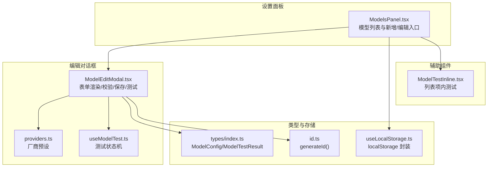
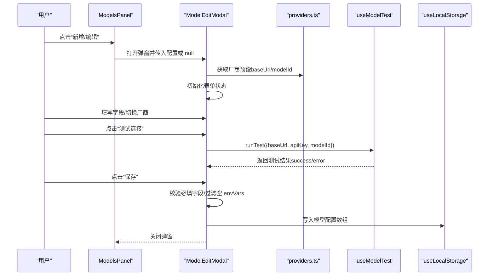
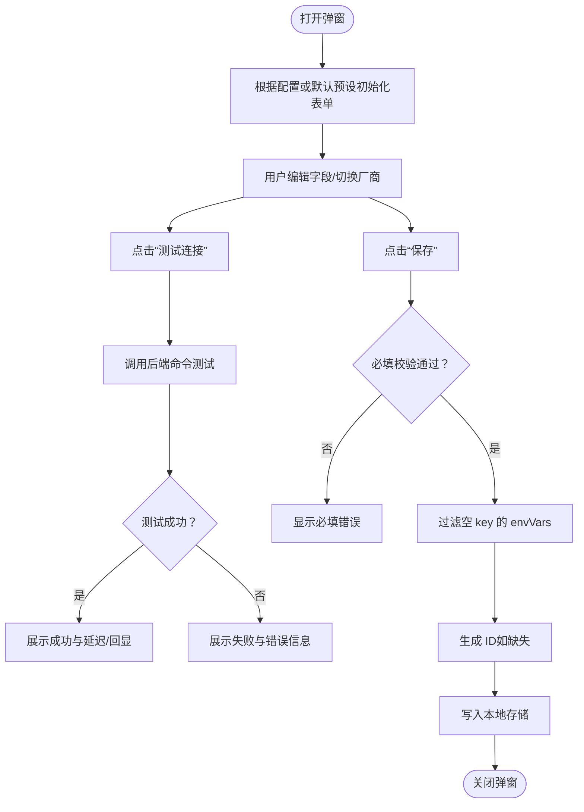
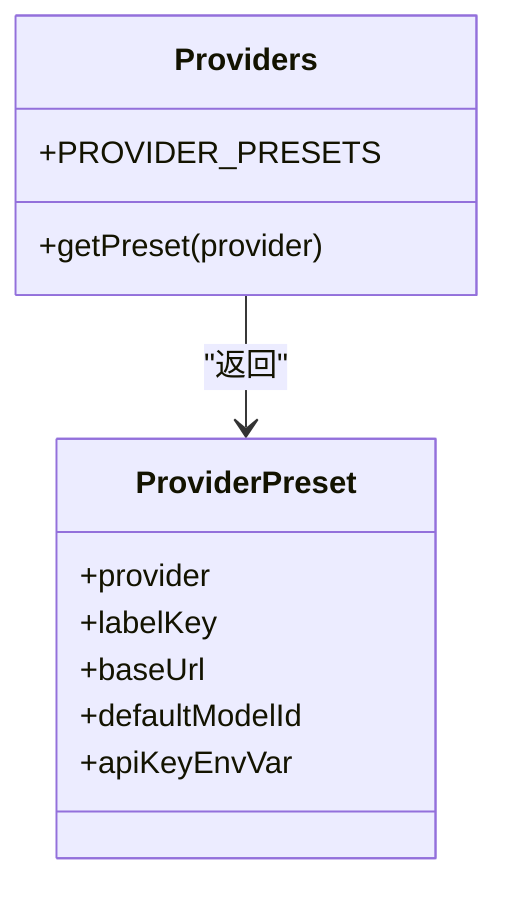
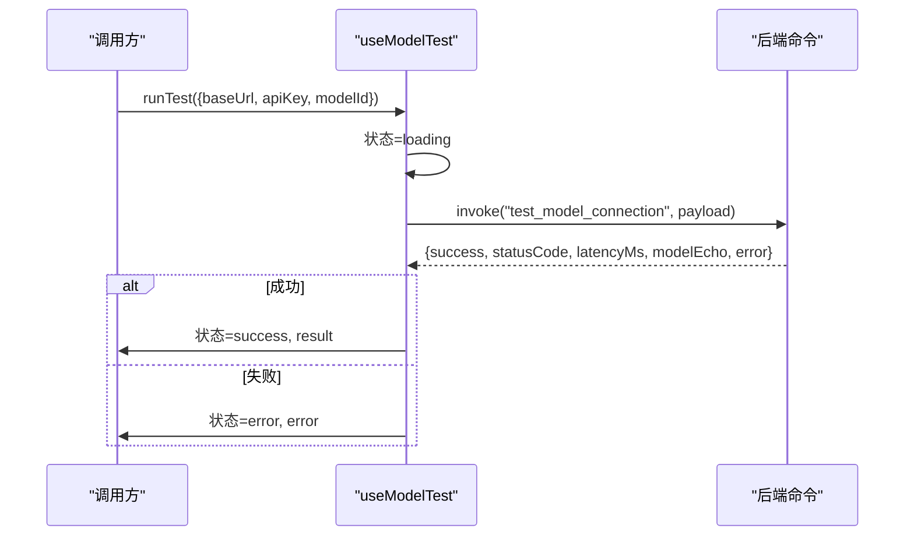
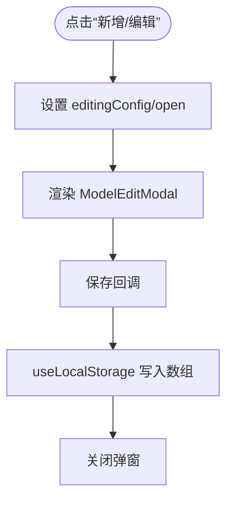
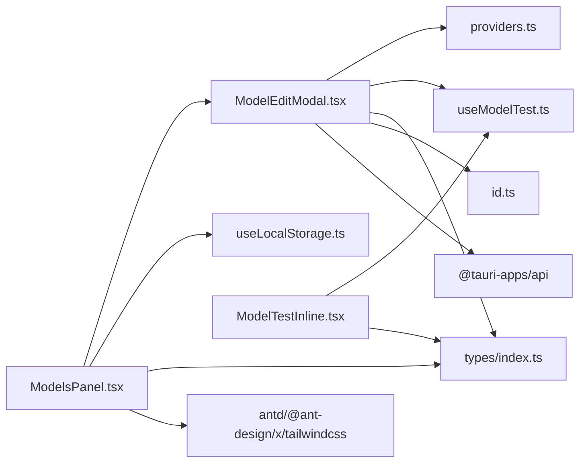

# 模型编辑

<cite>
**本文引用的文件**
- [src/components/settings/ModelEditModal.tsx](file://src/components/settings/ModelEditModal.tsx)
- [src/constants/providers.ts](file://src/constants/providers.ts)
- [src/hooks/useModelTest.ts](file://src/hooks/useModelTest.ts)
- [src/types/index.ts](file://src/types/index.ts)
- [src/components/settings/ModelsPanel.tsx](file://src/components/settings/ModelsPanel.tsx)
- [src/components/settings/ModelTestInline.tsx](file://src/components/settings/ModelTestInline.tsx)
- [src/hooks/useLocalStorage.ts](file://src/hooks/useLocalStorage.ts)
- [src/utils/id.ts](file://src/utils/id.ts)
- [src/i18n/locales/zh.ts](file://src/i18n/locales/zh.ts)
- [package.json](file://package.json)
</cite>

## 目录
1. [简介](#简介)
2. [项目结构](#项目结构)
3. [核心组件](#核心组件)
4. [架构总览](#架构总览)
5. [详细组件分析](#详细组件分析)
6. [依赖关系分析](#依赖关系分析)
7. [性能考量](#性能考量)
8. [故障排查指南](#故障排查指南)
9. [结论](#结论)
10. [附录](#附录)

## 简介
本文件面向 RabbitCoding 的“模型编辑”功能，围绕模型配置编辑对话框进行系统性说明。内容涵盖对话框设计与实现、表单字段与验证规则、数据绑定机制、保存与取消流程、不同提供商的特定配置、必填与格式校验、用户体验与错误处理策略等。读者可据此理解并维护模型编辑能力。

## 项目结构
模型编辑功能主要由以下模块协同构成：
- 模型编辑弹窗：负责表单渲染、字段绑定、校验与保存
- 厂商预设常量：提供各提供商的基础 URL、默认模型 ID、环境变量名等
- 连接测试 Hook：封装测试状态机与调用逻辑
- 类型定义：统一模型配置的数据结构与测试结果结构
- 模型列表面板：承载新增/编辑入口与持久化存储
- 本地存储 Hook：基于 localStorage 的读写封装
- 工具函数：UUID 生成
- 国际化资源：多语言文案支撑

图表来源
- [src/components/settings/ModelsPanel.tsx:1-148](file://src/components/settings/ModelsPanel.tsx#L1-L148)
- [src/components/settings/ModelEditModal.tsx:1-384](file://src/components/settings/ModelEditModal.tsx#L1-L384)
- [src/constants/providers.ts:1-63](file://src/constants/providers.ts#L1-L63)
- [src/hooks/useModelTest.ts:1-71](file://src/hooks/useModelTest.ts#L1-L71)
- [src/types/index.ts:317-358](file://src/types/index.ts#L317-L358)
- [src/hooks/useLocalStorage.ts:1-27](file://src/hooks/useLocalStorage.ts#L1-L27)
- [src/utils/id.ts:1-4](file://src/utils/id.ts#L1-L4)
- [src/components/settings/ModelTestInline.tsx:1-64](file://src/components/settings/ModelTestInline.tsx#L1-L64)

章节来源
- [src/components/settings/ModelsPanel.tsx:1-148](file://src/components/settings/ModelsPanel.tsx#L1-L148)
- [src/components/settings/ModelEditModal.tsx:1-384](file://src/components/settings/ModelEditModal.tsx#L1-L384)
- [src/constants/providers.ts:1-63](file://src/constants/providers.ts#L1-L63)
- [src/hooks/useModelTest.ts:1-71](file://src/hooks/useModelTest.ts#L1-L71)
- [src/types/index.ts:317-358](file://src/types/index.ts#L317-L358)
- [src/hooks/useLocalStorage.ts:1-27](file://src/hooks/useLocalStorage.ts#L1-L27)
- [src/utils/id.ts:1-4](file://src/utils/id.ts#L1-L4)
- [src/components/settings/ModelTestInline.tsx:1-64](file://src/components/settings/ModelTestInline.tsx#L1-L64)

## 核心组件
- 模型编辑弹窗（ModelEditModal）
  - 负责渲染表单、绑定字段、触发保存与测试、展示错误与测试结果
  - 支持厂商切换自动填充预设（baseUrl、modelId、apiKeyEnvVar）
  - 保存时进行必填校验，过滤空环境变量键值对
- 厂商预设（providers.ts）
  - 定义各提供商的标签键、基础 URL、默认模型 ID、API 密钥环境变量名
- 连接测试 Hook（useModelTest）
  - 管理测试状态机（idle/loading/success/error），调用后端命令进行连通性测试
- 模型列表面板（ModelsPanel）
  - 展示已配置模型，提供新增/编辑/删除/启用切换；与本地存储交互
- 模型测试内联（ModelTestInline）
  - 列表项内的测试按钮与状态徽标，独立持有测试状态
- 本地存储 Hook（useLocalStorage）
  - 以键值形式读写模型配置数组
- 类型定义（types/index.ts）
  - 统一模型配置与测试结果的数据结构
- 工具函数（id.ts）
  - 生成唯一 ID

章节来源
- [src/components/settings/ModelEditModal.tsx:17-67](file://src/components/settings/ModelEditModal.tsx#L17-L67)
- [src/constants/providers.ts:3-11](file://src/constants/providers.ts#L3-L11)
- [src/hooks/useModelTest.ts:14-27](file://src/hooks/useModelTest.ts#L14-L27)
- [src/components/settings/ModelsPanel.tsx:16-53](file://src/components/settings/ModelsPanel.tsx#L16-L53)
- [src/components/settings/ModelTestInline.tsx:13-15](file://src/components/settings/ModelTestInline.tsx#L13-L15)
- [src/hooks/useLocalStorage.ts:3-26](file://src/hooks/useLocalStorage.ts#L3-L26)
- [src/types/index.ts:317-358](file://src/types/index.ts#L317-L358)
- [src/utils/id.ts:1-4](file://src/utils/id.ts#L1-L4)

## 架构总览
模型编辑的控制流如下：
- 打开编辑弹窗时，根据传入配置或默认预设初始化表单
- 用户填写字段，支持厂商选择自动填充
- 点击“测试连接”使用当前草稿参数调用后端命令，展示测试结果
- 点击“保存”进行必填校验，过滤空环境变量，生成 ID（如缺失），写入本地存储

图表来源
- [src/components/settings/ModelsPanel.tsx:22-41](file://src/components/settings/ModelsPanel.tsx#L22-L41)
- [src/components/settings/ModelEditModal.tsx:69-84](file://src/components/settings/ModelEditModal.tsx#L69-L84)
- [src/constants/providers.ts:59-62](file://src/constants/providers.ts#L59-L62)
- [src/hooks/useModelTest.ts:35-69](file://src/hooks/useModelTest.ts#L35-L69)
- [src/hooks/useLocalStorage.ts:3-26](file://src/hooks/useLocalStorage.ts#L3-L26)

## 详细组件分析

### 模型编辑弹窗（ModelEditModal）
- 表单字段与行为
  - 厂商选择：点击厂商按钮触发预设填充（自动更新 baseUrl、modelId），名称在“custom”时允许自定义
  - 名称、模型 ID、基础 URL、API Key、额外环境变量（key/value 对）
  - 显示/隐藏 API Key、新增/删除环境变量行
- 数据绑定与转换
  - 从 ModelConfig 转换为 FormState（含 envVars 数组化）
  - 保存时将 envVars 过滤为空 key 的项，生成新 ID（若缺失）
- 校验规则
  - 必填：名称、模型 ID、基础 URL、API Key
  - 保存前即时校验，错误通过状态提示
- 测试流程
  - 使用当前草稿参数调用后端命令，展示成功/失败与延迟、回显模型信息
- 交互细节
  - 打开时重置测试状态与错误
  - 保存后关闭弹窗并回调父组件更新列表

图表来源
- [src/components/settings/ModelEditModal.tsx:38-67](file://src/components/settings/ModelEditModal.tsx#L38-L67)
- [src/components/settings/ModelEditModal.tsx:87-96](file://src/components/settings/ModelEditModal.tsx#L87-L96)
- [src/components/settings/ModelEditModal.tsx:121-128](file://src/components/settings/ModelEditModal.tsx#L121-L128)
- [src/components/settings/ModelEditModal.tsx:162-168](file://src/components/settings/ModelEditModal.tsx#L162-L168)
- [src/components/settings/ModelEditModal.tsx:131-159](file://src/components/settings/ModelEditModal.tsx#L131-L159)

章节来源
- [src/components/settings/ModelEditModal.tsx:17-67](file://src/components/settings/ModelEditModal.tsx#L17-L67)
- [src/components/settings/ModelEditModal.tsx:87-96](file://src/components/settings/ModelEditModal.tsx#L87-L96)
- [src/components/settings/ModelEditModal.tsx:121-128](file://src/components/settings/ModelEditModal.tsx#L121-L128)
- [src/components/settings/ModelEditModal.tsx:131-159](file://src/components/settings/ModelEditModal.tsx#L131-L159)
- [src/components/settings/ModelEditModal.tsx:162-168](file://src/components/settings/ModelEditModal.tsx#L162-L168)

### 厂商预设（providers.ts）
- 预设字段
  - 厂商标识、标签 i18n 键、基础 URL、默认模型 ID、API Key 环境变量名
- 预设获取
  - 根据厂商返回对应预设，未命中时回退至最后一个（custom）

图表来源
- [src/constants/providers.ts:4-11](file://src/constants/providers.ts#L4-L11)
- [src/constants/providers.ts:14-57](file://src/constants/providers.ts#L14-L57)
- [src/constants/providers.ts:59-62](file://src/constants/providers.ts#L59-L62)

章节来源
- [src/constants/providers.ts:4-11](file://src/constants/providers.ts#L4-L11)
- [src/constants/providers.ts:14-57](file://src/constants/providers.ts#L14-L57)
- [src/constants/providers.ts:59-62](file://src/constants/providers.ts#L59-L62)

### 连接测试 Hook（useModelTest）
- 状态机
  - idle → loading → success | error
- 调用方式
  - 前端通过 invoke 调用后端命令，传入 snake_case 键
- 结果结构
  - 成功/失败、HTTP 状态码、耗时、服务端回显 model、友好错误描述

图表来源
- [src/hooks/useModelTest.ts:35-69](file://src/hooks/useModelTest.ts#L35-L69)
- [src/types/index.ts:347-358](file://src/types/index.ts#L347-L358)

章节来源
- [src/hooks/useModelTest.ts:14-27](file://src/hooks/useModelTest.ts#L14-L27)
- [src/hooks/useModelTest.ts:35-69](file://src/hooks/useModelTest.ts#L35-L69)
- [src/types/index.ts:347-358](file://src/types/index.ts#L347-L358)

### 模型列表面板（ModelsPanel）
- 功能
  - 展示模型列表、新增/编辑/删除/启用切换
  - 与本地存储交互，持久化模型配置数组
- 与编辑弹窗协作
  - 通过 props 控制弹窗开关与传入配置
  - 保存回调更新本地存储并关闭弹窗

图表来源
- [src/components/settings/ModelsPanel.tsx:22-41](file://src/components/settings/ModelsPanel.tsx#L22-L41)
- [src/hooks/useLocalStorage.ts:3-26](file://src/hooks/useLocalStorage.ts#L3-L26)

章节来源
- [src/components/settings/ModelsPanel.tsx:16-53](file://src/components/settings/ModelsPanel.tsx#L16-L53)
- [src/hooks/useLocalStorage.ts:3-26](file://src/hooks/useLocalStorage.ts#L3-L26)

### 模型测试内联（ModelTestInline）
- 功能
  - 列表项内的测试按钮与状态徽标，独立持有测试状态
- 与全局测试的区别
  - 使用独立 Hook 实例，互不影响

章节来源
- [src/components/settings/ModelTestInline.tsx:17-63](file://src/components/settings/ModelTestInline.tsx#L17-L63)

### 类型定义（types/index.ts）
- 模型配置（ModelConfig）
  - id、name、provider、modelId、baseUrl、apiKey、apiKeyEnvVar、envVars、enabled、createdAt、maxContextTokens
- 测试结果（ModelTestResult）
  - success、statusCode、latencyMs、modelEcho、error

章节来源
- [src/types/index.ts:317-344](file://src/types/index.ts#L317-L344)
- [src/types/index.ts:347-358](file://src/types/index.ts#L347-L358)

### 本地存储与工具函数
- 本地存储（useLocalStorage）
  - 以键值形式读写，异常时回退默认值
- 工具函数（generateId）
  - 生成 UUID 作为模型配置主键

章节来源
- [src/hooks/useLocalStorage.ts:3-26](file://src/hooks/useLocalStorage.ts#L3-L26)
- [src/utils/id.ts:1-4](file://src/utils/id.ts#L1-L4)

## 依赖关系分析
- 组件耦合
  - ModelEditModal 依赖 providers.ts、useModelTest、types/index.ts、id.ts
  - ModelsPanel 依赖 ModelEditModal、useLocalStorage、types/index.ts
  - ModelTestInline 依赖 useModelTest、types/index.ts
- 外部依赖
  - @tauri-apps/api 用于调用后端命令
  - lucide-react 图标库
  - antd、@ant-design/x、tailwindcss UI 基础

图表来源
- [src/components/settings/ModelEditModal.tsx:8-15](file://src/components/settings/ModelEditModal.tsx#L8-L15)
- [src/components/settings/ModelsPanel.tsx:10-14](file://src/components/settings/ModelsPanel.tsx#L10-L14)
- [src/components/settings/ModelTestInline.tsx:9-11](file://src/components/settings/ModelTestInline.tsx#L9-L11)
- [package.json:14-36](file://package.json#L14-L36)

章节来源
- [src/components/settings/ModelEditModal.tsx:8-15](file://src/components/settings/ModelEditModal.tsx#L8-L15)
- [src/components/settings/ModelsPanel.tsx:10-14](file://src/components/settings/ModelsPanel.tsx#L10-L14)
- [src/components/settings/ModelTestInline.tsx:9-11](file://src/components/settings/ModelTestInline.tsx#L9-L11)
- [package.json:14-36](file://package.json#L14-L36)

## 性能考量
- 表单渲染与状态更新
  - 使用受控组件与局部状态，避免不必要的重渲染
- 测试调用
  - 仅在用户主动点击时触发，避免频繁调用
- 本地存储
  - 写入采用批量更新策略，减少多次写入开销
- UI 交互
  - 测试按钮禁用期间避免重复提交，提升用户体验

## 故障排查指南
- 常见错误与定位
  - 必填字段为空：检查名称、模型 ID、基础 URL、API Key 是否填写
  - 测试失败：查看错误信息，确认基础 URL、API Key、模型 ID 是否正确
  - 环境变量无效：确保 key 非空，value 可为空但 key 必须存在
- 排查步骤
  - 在编辑弹窗中点击“测试连接”，观察结果与错误详情
  - 在模型列表项中使用“测试连接”进行独立验证
  - 检查本地存储中的模型配置数组是否更新成功
- 依赖问题
  - 确认 @tauri-apps/api 可用，后端命令“test_model_connection”正常响应

章节来源
- [src/components/settings/ModelEditModal.tsx:121-128](file://src/components/settings/ModelEditModal.tsx#L121-L128)
- [src/components/settings/ModelEditModal.tsx:322-349](file://src/components/settings/ModelEditModal.tsx#L322-L349)
- [src/components/settings/ModelTestInline.tsx:40-61](file://src/components/settings/ModelTestInline.tsx#L40-L61)
- [src/hooks/useLocalStorage.ts:13-23](file://src/hooks/useLocalStorage.ts#L13-L23)

## 结论
模型编辑功能通过清晰的组件分工与状态管理，实现了便捷的模型配置体验。厂商预设简化了初始配置，表单校验与测试反馈提升了可靠性。建议在后续迭代中进一步增强字段的格式校验与更细粒度的错误提示，以提升易用性与可维护性。

## 附录
- 国际化键参考（部分）
  - 设置面板标题、字段标签、占位提示、错误提示、测试文案等
- 依赖清单
  - React 生态、Tauri 插件、UI 组件库、图标库

章节来源
- [src/i18n/locales/zh.ts:1-200](file://src/i18n/locales/zh.ts#L1-L200)
- [package.json:14-36](file://package.json#L14-L36)