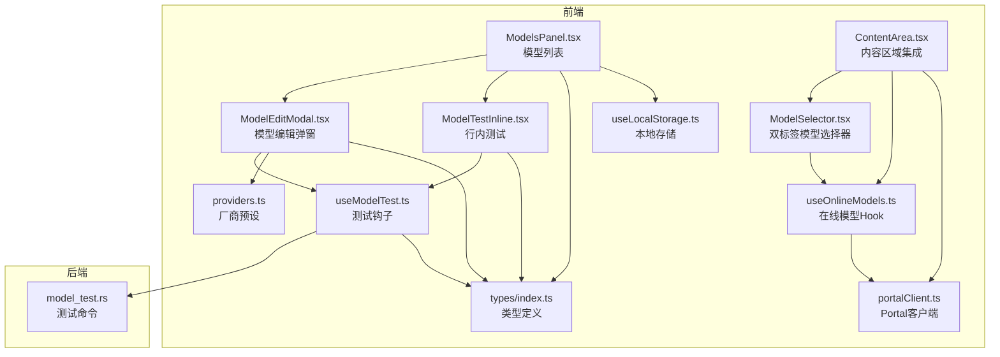
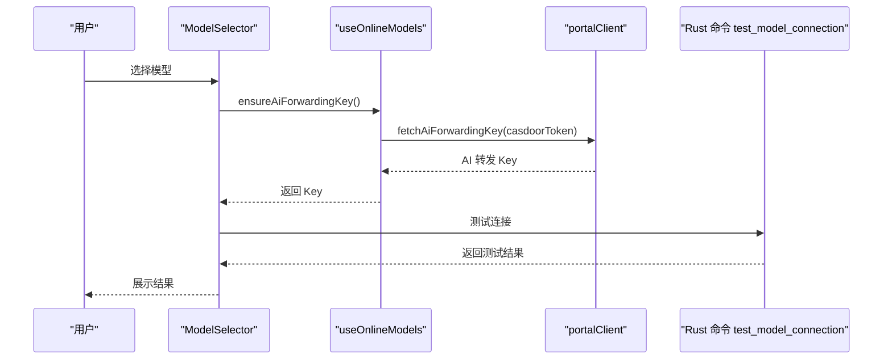
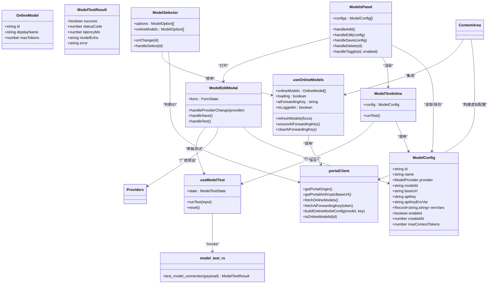

# 模型配置

<cite>
**本文档引用的文件**
- [providers.ts](file://src/constants/providers.ts)
- [types/index.ts](file://src/types/index.ts)
- [ModelsPanel.tsx](file://src/components/settings/ModelsPanel.tsx)
- [ModelEditModal.tsx](file://src/components/settings/ModelEditModal.tsx)
- [ModelTestInline.tsx](file://src/components/settings/ModelTestInline.tsx)
- [useModelTest.ts](file://src/hooks/useModelTest.ts)
- [useOnlineModels.ts](file://src/hooks/useOnlineModels.ts)
- [portalClient.ts](file://src/utils/portalClient.ts)
- [ModelSelector.tsx](file://src/components/common/ModelSelector.tsx)
- [ContentArea.tsx](file://src/components/ContentArea.tsx)
- [model_test.rs](file://src-tauri/src/model_test.rs)
- [useLocalStorage.ts](file://src/hooks/useLocalStorage.ts)
- [ApiKeyModal.tsx](file://src/components/settings/ApiKeyModal.tsx)
</cite>

## 更新摘要
**变更内容**
- 新增在线模型系统集成，包括 useOnlineModels hook 和 portalClient 工具
- 增强的模型选择器支持双标签界面（最新模型和自定义模型）
- 线上模型与本地模型的无缝切换机制
- AI 转发 Key 的按需获取与缓存管理
- 登录状态下的自动密钥获取与错误处理

## 目录
1. [简介](#简介)
2. [项目结构](#项目结构)
3. [核心组件](#核心组件)
4. [架构总览](#架构总览)
5. [详细组件分析](#详细组件分析)
6. [在线模型系统集成](#在线模型系统集成)
7. [依赖关系分析](#依赖关系分析)
8. [性能考量](#性能考量)
9. [故障排除指南](#故障排除指南)
10. [结论](#结论)
11. [附录](#附录)

## 简介
本文档面向 RabbitCoding 的"模型配置"功能，系统性说明 AI 模型的添加、编辑、删除、测试流程；详述支持的模型提供商（含厂商预设）、API 密钥管理、模型参数配置；解释模型测试功能的使用方法、性能评估指标、错误处理机制；并涵盖模型切换策略、本地存储与缓存机制、版本兼容性、最佳实践与安全注意事项、以及常见问题排查。

**更新** 新增在线模型系统集成，支持云端模型与本地模型的双标签选择界面，提供无缝的模型切换体验。

## 项目结构
模型配置相关代码主要分布在以下位置：
- 前端设置页面：模型列表面板、模型编辑弹窗、模型测试行内控件、测试钩子
- 在线模型系统：useOnlineModels hook、portalClient 工具、AI 转发 Key 管理
- 模型选择器：双标签界面（最新模型和自定义模型）
- 类型定义：模型配置数据结构、测试结果结构、厂商枚举
- 厂商预设常量：内置厂商及其默认 Base URL、默认模型 ID、API Key 环境变量
- 后端命令：模型连接测试（Rust）



**图表来源**
- [ModelsPanel.tsx:1-148](file://src/components/settings/ModelsPanel.tsx#L1-L148)
- [ModelEditModal.tsx:1-384](file://src/components/settings/ModelEditModal.tsx#L1-L384)
- [ModelTestInline.tsx:1-64](file://src/components/settings/ModelTestInline.tsx#L1-L64)
- [useModelTest.ts:1-71](file://src/hooks/useModelTest.ts#L1-L71)
- [providers.ts:1-63](file://src/constants/providers.ts#L1-L63)
- [types/index.ts:317-358](file://src/types/index.ts#L317-L358)
- [useLocalStorage.ts:1-27](file://src/hooks/useLocalStorage.ts#L1-L27)
- [useOnlineModels.ts:1-126](file://src/hooks/useOnlineModels.ts#L1-L126)
- [portalClient.ts:1-175](file://src/utils/portalClient.ts#L1-L175)
- [ModelSelector.tsx:1-167](file://src/components/common/ModelSelector.tsx#L1-L167)
- [ContentArea.tsx:1-1115](file://src/components/ContentArea.tsx#L1-L1115)
- [model_test.rs:1-217](file://src-tauri/src/model_test.rs#L1-L217)

**章节来源**
- [ModelsPanel.tsx:1-148](file://src/components/settings/ModelsPanel.tsx#L1-L148)
- [ModelEditModal.tsx:1-384](file://src/components/settings/ModelEditModal.tsx#L1-L384)
- [ModelTestInline.tsx:1-64](file://src/components/settings/ModelTestInline.tsx#L1-L64)
- [useModelTest.ts:1-71](file://src/hooks/useModelTest.ts#L1-L71)
- [providers.ts:1-63](file://src/constants/providers.ts#L1-L63)
- [types/index.ts:317-358](file://src/types/index.ts#L317-L358)
- [useLocalStorage.ts:1-27](file://src/hooks/useLocalStorage.ts#L1-L27)
- [useOnlineModels.ts:1-126](file://src/hooks/useOnlineModels.ts#L1-L126)
- [portalClient.ts:1-175](file://src/utils/portalClient.ts#L1-L175)
- [ModelSelector.tsx:1-167](file://src/components/common/ModelSelector.tsx#L1-L167)
- [ContentArea.tsx:1-1115](file://src/components/ContentArea.tsx#L1-L1115)
- [model_test.rs:1-217](file://src-tauri/src/model_test.rs#L1-L217)

## 核心组件
- 模型列表面板：展示已配置模型，支持新增、编辑、删除、启用/禁用切换，并提供行内测试入口。
- 模型编辑弹窗：支持厂商选择（含预设自动填充）、必填校验、草稿测试、保存持久化。
- 模型测试钩子：封装测试状态机（空闲/加载/成功/失败），统一调用后端命令。
- 厂商预设常量：内置多家厂商的默认 Base URL、默认模型 ID、API Key 环境变量名。
- 在线模型系统：useOnlineModels hook 管理云端模型列表与 AI 转发 Key，支持按需获取与缓存。
- Portal 客户端工具：portalClient 封装与 Portal 后端的交互，包括模型列表获取与密钥管理。
- 双标签模型选择器：支持最新模型（云端）和自定义模型的双标签界面，提供无缝切换体验。
- 类型定义：明确 ModelConfig、ModelTestResult 等数据结构及厂商枚举。
- 本地存储：基于 useLocalStorage 的键值持久化，键名为 model-configs。

**更新** 新增在线模型系统集成，提供云端模型与本地模型的统一管理界面。

**章节来源**
- [ModelsPanel.tsx:16-147](file://src/components/settings/ModelsPanel.tsx#L16-L147)
- [ModelEditModal.tsx:69-383](file://src/components/settings/ModelEditModal.tsx#L69-L383)
- [useModelTest.ts:35-70](file://src/hooks/useModelTest.ts#L35-L70)
- [providers.ts:14-62](file://src/constants/providers.ts#L14-L62)
- [useOnlineModels.ts:1-126](file://src/hooks/useOnlineModels.ts#L1-L126)
- [portalClient.ts:1-175](file://src/utils/portalClient.ts#L1-L175)
- [ModelSelector.tsx:1-167](file://src/components/common/ModelSelector.tsx#L1-L167)
- [types/index.ts:317-358](file://src/types/index.ts#L317-L358)
- [useLocalStorage.ts:3-26](file://src/hooks/useLocalStorage.ts#L3-L26)

## 架构总览
模型配置采用"前端 UI + 本地存储 + 在线模型系统 + 后端命令"的分层设计：
- 前端负责用户交互、表单校验、测试状态管理；
- 在线模型系统负责云端模型列表获取与 AI 转发 Key 管理；
- 本地存储负责模型配置的持久化；
- 后端命令负责真实网络请求与错误归类，返回统一的测试结果结构。



**图表来源**
- [ModelSelector.tsx:26-167](file://src/components/common/ModelSelector.tsx#L26-L167)
- [useOnlineModels.ts:71-100](file://src/hooks/useOnlineModels.ts#L71-L100)
- [portalClient.ts:102-135](file://src/utils/portalClient.ts#L102-L135)
- [useModelTest.ts:42-64](file://src/hooks/useModelTest.ts#L42-L64)
- [model_test.rs:78-207](file://src-tauri/src/model_test.rs#L78-L207)

## 详细组件分析

### 模型列表面板（ModelsPanel）
- 功能：展示所有已配置模型，支持新增、编辑、删除、启用/禁用切换。
- 交互：空状态提示；每行右侧包含启用开关、行内测试、编辑、删除按钮。
- 数据源：通过 useLocalStorage 读取键为 model-configs 的数组，作为列表数据。
- 保存逻辑：新增或更新均通过 setConfigs 持久化，若存在相同 id 则替换，否则追加。

**章节来源**
- [ModelsPanel.tsx:16-147](file://src/components/settings/ModelsPanel.tsx#L16-L147)
- [useLocalStorage.ts:3-26](file://src/hooks/useLocalStorage.ts#L3-L26)
- [types/index.ts:320-344](file://src/types/index.ts#L320-L344)

### 模型编辑弹窗（ModelEditModal）
- 功能：新增/编辑模型配置，支持厂商选择与预设自动填充、必填校验、草稿测试、保存。
- 厂商预设：根据所选厂商自动填充 baseUrl、defaultModelId；custom 厂商允许自定义。
- 表单字段：名称、模型 ID、Base URL、API Key、额外环境变量、启用状态。
- 校验规则：名称、模型 ID、Base URL、API Key 必填；保存前进行校验。
- 草稿测试：无需保存即可对当前表单草稿发起测试，提升体验。
- 保存逻辑：过滤空 key 的环境变量，生成 ModelConfig 并回调 onSave 持久化。

**章节来源**
- [ModelEditModal.tsx:69-383](file://src/components/settings/ModelEditModal.tsx#L69-L383)
- [providers.ts:14-62](file://src/constants/providers.ts#L14-L62)
- [types/index.ts:320-344](file://src/types/index.ts#L320-L344)

### 行内测试（ModelTestInline）
- 功能：在模型列表行内快速测试该配置的连通性与可用性。
- 状态：加载中（旋转图标）、成功（绿勾，hover 显示延迟）、失败（红叉，hover 显示错误）。
- 触发：点击闪电图标，直接使用当前列表项的 baseUrl、apiKey、modelId 发起测试。

**章节来源**
- [ModelTestInline.tsx:17-63](file://src/components/settings/ModelTestInline.tsx#L17-L63)

### 测试钩子（useModelTest）
- 功能：封装测试状态机与调用逻辑，供编辑弹窗与行内测试复用。
- 状态机：idle → loading → success | error；成功时包含 latencyMs、modelEcho 等指标。
- 调用：通过 @tauri-apps/api/core 的 invoke 调用后端命令 test_model_connection。
- 错误处理：统一捕获异常并映射为 error 状态，错误信息透传 Rust 返回的中文描述。

**章节来源**
- [useModelTest.ts:14-70](file://src/hooks/useModelTest.ts#L14-L70)
- [types/index.ts:346-358](file://src/types/index.ts#L346-L358)

### 厂商预设（providers.ts）
- 功能：内置多家厂商的预设，包括默认 Base URL、默认模型 ID、API Key 环境变量名。
- 支持厂商：GLM、Minimax、阿里云、Kimi、DeepSeek、Custom。
- 使用：选择厂商后自动填充对应字段，减少用户配置成本。

**章节来源**
- [providers.ts:14-62](file://src/constants/providers.ts#L14-L62)

### 类型定义（types/index.ts）
- ModelConfig：模型配置的数据结构，包含 id、name、provider、modelId、baseUrl、apiKey、apiKeyEnvVar、envVars、enabled、createdAt、maxContextTokens 等。
- ModelTestResult：测试结果结构，包含 success、statusCode、latencyMs、modelEcho、error。
- ModelProvider：厂商枚举，支持多厂商与自定义。

**章节来源**
- [types/index.ts:317-358](file://src/types/index.ts#L317-L358)

### 本地存储（useLocalStorage）
- 功能：封装 localStorage 的读取与写入，提供默认值与异常兜底。
- 应用：模型配置持久化键为 model-configs；其他配置也有类似模式（如 MCP、代理等）。

**章节来源**
- [useLocalStorage.ts:3-26](file://src/hooks/useLocalStorage.ts#L3-L26)

### API 密钥管理（ApiKeyModal）
- 功能：首次使用时引导输入 API Key，并进行简单验证（格式校验）。
- 注意：当前实现为前端校验与存储，建议后续迁移至更安全的密钥管理方案（如系统钥匙串）。

**章节来源**
- [ApiKeyModal.tsx:19-136](file://src/components/settings/ApiKeyModal.tsx#L19-L136)

### 模型切换策略与使用
- 切换策略：模型选择器（ModelSelector）从可用模型列表中选择；当无可用模型时，点击可跳转到模型配置页。
- 使用场景：在内容区域（ContentArea）中，模型选择器与发送开关等组合使用，实现模型切换与会话控制。
- 双标签界面：支持最新模型（云端）和自定义模型的双标签切换，提供更好的用户体验。

**更新** 新增双标签模型选择器，支持云端模型与本地模型的无缝切换。

**章节来源**
- [ModelSelector.tsx:19-33](file://src/components/common/ModelSelector.tsx#L19-L33)
- [ContentArea.tsx:566-589](file://src/components/ContentArea.tsx#L566-L589)

## 在线模型系统集成

### useOnlineModels Hook
- 职责：管理在线模型列表获取与 AI 转发 Key 的缓存与按需获取。
- 功能特性：
  - 自动拉取 Portal 公开模型列表（30秒缓存）
  - 按需获取 AI 转发 Key（localStorage 缓存）
  - 登录状态检测与自动密钥获取
  - 错误处理与重试机制

```mermaid
flowchart TD
A[组件挂载] --> B[refreshModels(force=false)]
B --> C{缓存命中?}
C --> |是| D[返回缓存模型]
C --> |否| E[fetchOnlineModels]
E --> F[更新缓存]
F --> G[设置在线模型列表]
H[ensureAiForwardingKey] --> I{本地缓存存在?}
I --> |是| J[返回缓存Key]
I --> |否| K{已登录?}
K --> |否| L[抛出NOT_LOGGED_IN错误]
K --> |是| M[fetchAiForwardingKey]
M --> N[存储到localStorage]
N --> O[返回新Key]
```

**图表来源**
- [useOnlineModels.ts:30-126](file://src/hooks/useOnlineModels.ts#L30-L126)

### portalClient 工具
- 功能：封装与 Portal 后端的交互
- 公开接口：
  - GET /api/v1/models：获取活跃且有可用账号的模型列表
  - GET /api/me/api-key：用 Casdoor accessToken 获取 AI 转发 Key
- 错误处理：
  - 401：Casdoor accessToken 无效或过期（NOT_AUTHENTICATED）
  - Key 未返回：AIKEY_NOT_RETURNED

### 在线模型虚拟配置
- 线上模型 ID 前缀：__online__:
- 虚拟配置构建：将在线模型转换为标准 ModelConfig 格式
- 基础配置：baseUrl 指向 Portal anthropic 转发，apiKey 为 AI 转发 Key

### ContentArea 集成
- 自动密钥获取：登录后自动获取 AI 转发 Key 并执行待处理查询
- 模型选择处理：线上模型选中时自动获取密钥，支持登录引导
- 虚拟配置生成：将线上模型 ID 转换为完整的 ModelConfig 对象

**章节来源**
- [useOnlineModels.ts:1-126](file://src/hooks/useOnlineModels.ts#L1-L126)
- [portalClient.ts:1-175](file://src/utils/portalClient.ts#L1-L175)
- [ContentArea.tsx:87-299](file://src/components/ContentArea.tsx#L87-L299)

## 依赖关系分析



**图表来源**
- [types/index.ts:317-358](file://src/types/index.ts#L317-L358)
- [useOnlineModels.ts:1-126](file://src/hooks/useOnlineModels.ts#L1-L126)
- [portalClient.ts:1-175](file://src/utils/portalClient.ts#L1-L175)
- [ModelSelector.tsx:1-167](file://src/components/common/ModelSelector.tsx#L1-L167)
- [ContentArea.tsx:1-1115](file://src/components/ContentArea.tsx#L1-L1115)
- [ModelsPanel.tsx:16-147](file://src/components/settings/ModelsPanel.tsx#L16-L147)
- [ModelEditModal.tsx:69-383](file://src/components/settings/ModelEditModal.tsx#L69-L383)
- [ModelTestInline.tsx:17-63](file://src/components/settings/ModelTestInline.tsx#L17-L63)
- [useModelTest.ts:35-70](file://src/hooks/useModelTest.ts#L35-L70)
- [model_test.rs:78-207](file://src-tauri/src/model_test.rs#L78-L207)

## 性能考量
- 测试超时与延迟：后端测试命令设置超时时间，返回 latencyMs 作为性能参考；前端展示时可据此优化用户体验。
- 状态机与渲染：useModelTest 的状态机避免重复请求与竞态；编辑弹窗与行内测试共享同一状态，减少冗余。
- 本地存储：模型配置存储在 localStorage，读写开销低；注意避免存储过大对象导致内存压力。
- 网络与限流：测试命令对 429、5xx 等错误做了友好提示，前端可据此调整重试策略。
- 在线模型缓存：useOnlineModels 采用 30 秒缓存机制，避免频繁请求云端模型列表。
- AI 转发 Key 缓存：localStorage 缓存 AI 转发 Key，减少重复获取请求。

**更新** 新增在线模型系统的缓存机制与性能优化策略。

**章节来源**
- [model_test.rs:19-22](file://src-tauri/src/model_test.rs#L19-L22)
- [useModelTest.ts:42-64](file://src/hooks/useModelTest.ts#L42-L64)
- [useOnlineModels.ts:26-28](file://src/hooks/useOnlineModels.ts#L26-L28)
- [ModelEditModal.tsx:322-349](file://src/components/settings/ModelEditModal.tsx#L322-L349)

## 故障排除指南
- 缺少必要参数：当 Base URL、API Key、模型 ID 为空时，测试直接失败并提示。
- 请求超时/连接错误：区分超时与连接失败，给出明确提示；检查网络与 Base URL 正确性。
- 认证失败（401/403）：检查 API Key 是否正确、是否有访问权限。
- 端点不存在（404）：检查 Base URL 是否指向正确的 Anthropic 兼容端点。
- 请求被拒绝（400）：检查 modelId 是否存在或参数是否合法。
- 请求过于频繁（429）：触发限流，稍后再试。
- 服务端错误（5xx）：服务端异常，稍后重试。
- 响应体过大：后端对错误响应体进行截断，避免前端渲染过长文本。
- 在线模型获取失败：检查网络连接、Portal 服务状态、登录状态。
- AI 转发 Key 获取失败：检查 Casdoor 令牌有效性、用户权限、Portal 配置。
- 密钥未返回：Key 已存在但 Portal 未返回明文，需要重新登录获取。

**更新** 新增在线模型系统相关的故障排除指南。

**章节来源**
- [model_test.rs:86-94](file://src-tauri/src/model_test.rs#L86-L94)
- [model_test.rs:120-142](file://src-tauri/src/model_test.rs#L120-L142)
- [model_test.rs:171-206](file://src-tauri/src/model_test.rs#L171-L206)
- [portalClient.ts:115-135](file://src/utils/portalClient.ts#L115-L135)
- [useOnlineModels.ts:76-100](file://src/hooks/useOnlineModels.ts#L76-L100)

## 结论
RabbitCoding 的模型配置系统以简洁直观的方式实现了模型的全生命周期管理：从厂商预设、表单校验、草稿测试到持久化保存；配合统一的测试命令与状态机，提供了可靠的连通性验证与错误诊断能力。

**更新** 新增在线模型系统集成，通过 useOnlineModels hook 和 portalClient 工具，实现了云端模型与本地模型的统一管理。双标签模型选择器提供了更好的用户体验，支持最新模型和自定义模型的无缝切换。AI 转发 Key 的按需获取与缓存机制确保了系统的性能与可靠性。

建议在后续迭代中强化密钥安全存储、引入更细粒度的缓存与版本兼容策略，并扩展对更多厂商的支持。

## 附录

### 支持的模型提供商与默认配置
- GLM、Minimax、阿里云、Kimi、DeepSeek、Custom（自定义）
- 每个厂商包含默认 Base URL、默认模型 ID、API Key 环境变量名

**章节来源**
- [providers.ts:14-62](file://src/constants/providers.ts#L14-L62)

### 模型测试指标说明
- success：是否连通且鉴权通过、模型可用
- statusCode：HTTP 状态码（网络层失败时为 null）
- latencyMs：请求耗时（毫秒）
- modelEcho：服务端回显的 model 字段，用于确认 modelId 被接受
- error：友好错误描述（失败时填充）

**章节来源**
- [types/index.ts:346-358](file://src/types/index.ts#L346-L358)
- [model_test.rs:28-42](file://src-tauri/src/model_test.rs#L28-L42)

### 模型切换与使用流程
- 在内容区域通过模型选择器选择已启用的模型配置；
- 无可用模型时，点击选择器可跳转到模型配置页进行添加/编辑；
- 列表中的启用开关可临时禁用模型，不影响持久化存储；
- 双标签界面支持最新模型和自定义模型的无缝切换。

**更新** 新增双标签模型选择器的使用说明。

**章节来源**
- [ModelSelector.tsx:19-33](file://src/components/common/ModelSelector.tsx#L19-L33)
- [ContentArea.tsx:566-589](file://src/components/ContentArea.tsx#L566-L589)
- [ModelsPanel.tsx:50-53](file://src/components/settings/ModelsPanel.tsx#L50-L53)

### 在线模型系统配置
- 模型列表获取：GET /api/v1/models（公开接口，无需鉴权）
- AI 转发 Key 获取：GET /api/me/api-key（需 Casdoor accessToken 鉴权）
- 缓存策略：模型列表 30 秒缓存，AI Key localStorage 缓存
- 虚拟配置：线上模型 ID 前缀 __online__:

**更新** 新增在线模型系统的配置说明。

**章节来源**
- [portalClient.ts:63-135](file://src/utils/portalClient.ts#L63-L135)
- [useOnlineModels.ts:26-28](file://src/hooks/useOnlineModels.ts#L26-L28)

### 安全与最佳实践
- API 密钥管理：当前存储在本地，建议迁移到系统钥匙串或受保护的密钥管理服务。
- 环境变量：除 API Key 外，可通过 envVars 扩展注入，但需谨慎处理敏感信息。
- 版本兼容：测试命令与 SDK 的端点拼接保持一致，确保"测试通过"等价于"实际调用可用"。
- 在线模型安全：AI 转发 Key 通过 Casdoor 令牌换取，支持按需获取与自动缓存。
- 错误处理：完善的错误分类与处理机制，包括登录状态检查、密钥有效性验证等。

**更新** 新增在线模型系统的安全考虑与最佳实践。

**章节来源**
- [ApiKeyModal.tsx:19-56](file://src/components/settings/ApiKeyModal.tsx#L19-L56)
- [portalClient.ts:6-11](file://src/utils/portalClient.ts#L6-L11)
- [useOnlineModels.ts:76-100](file://src/hooks/useOnlineModels.ts#L76-L100)