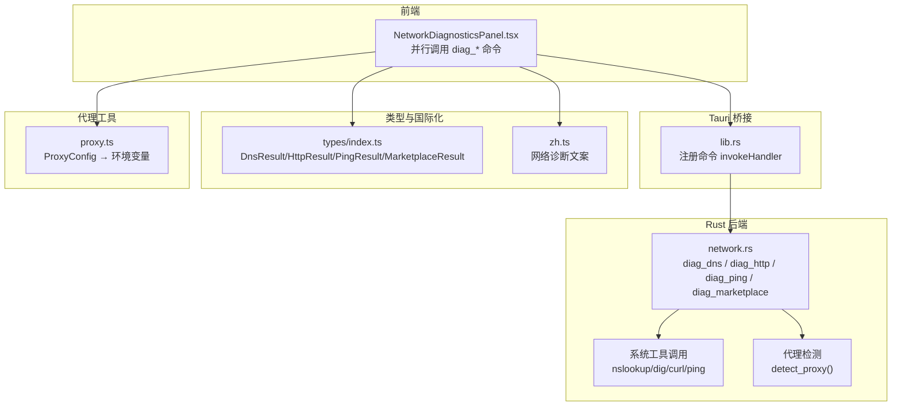
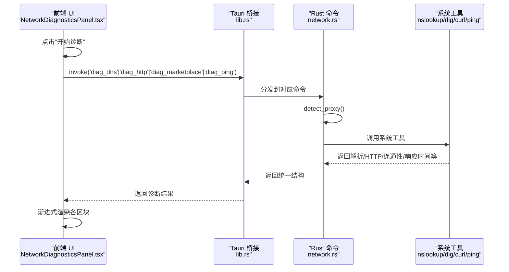
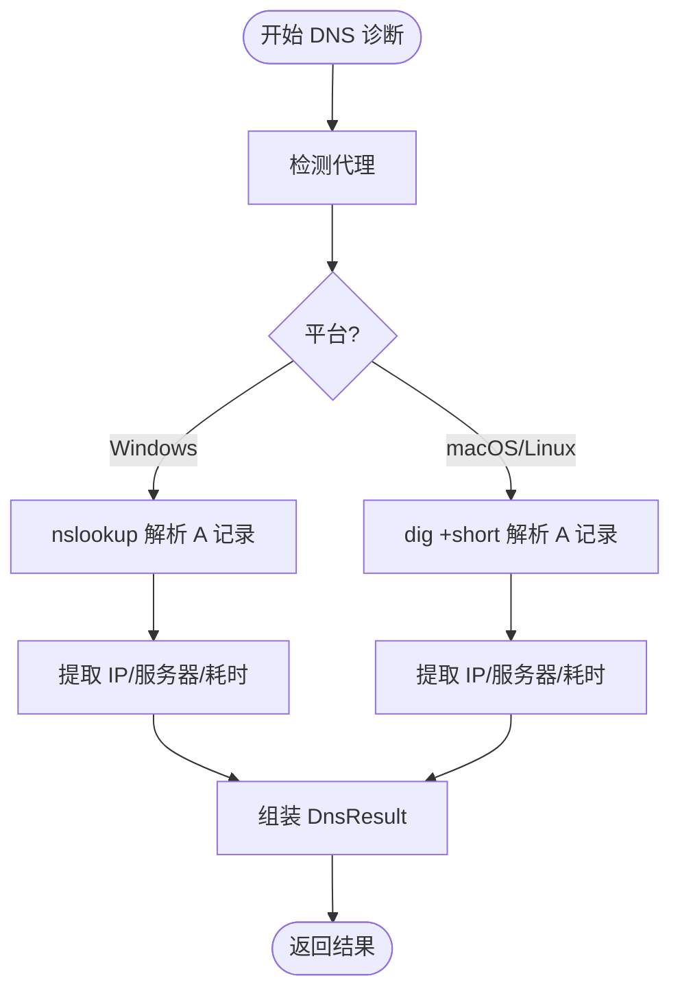
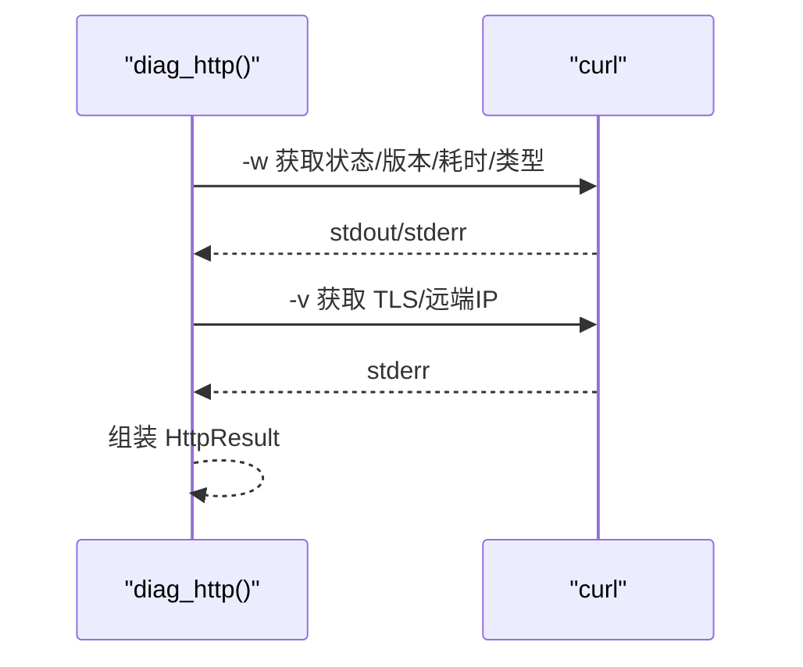
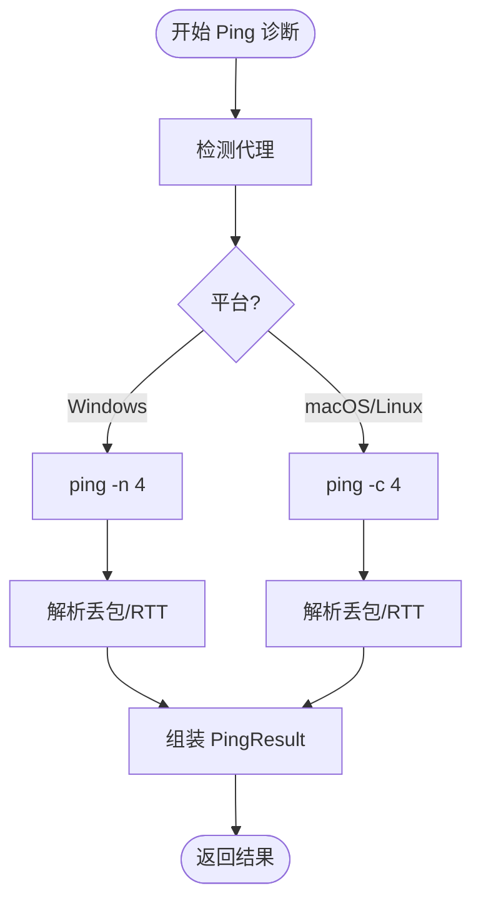
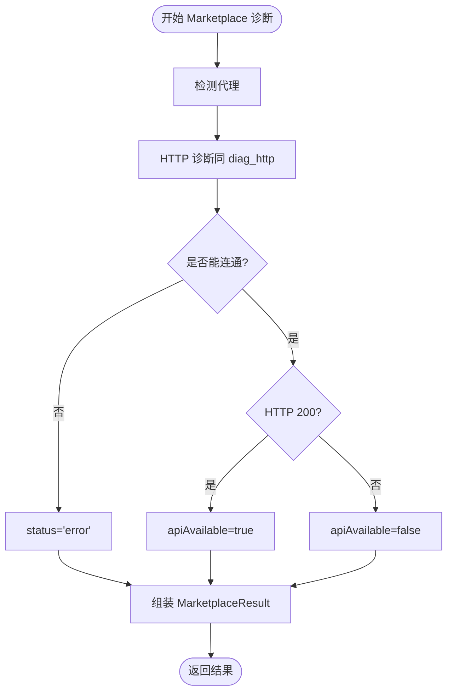
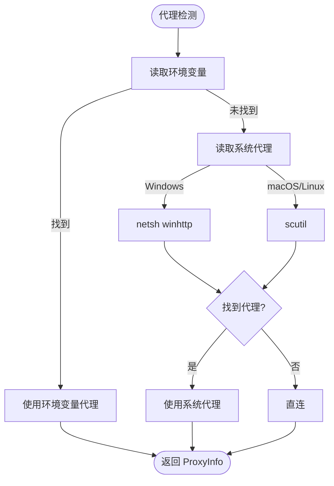
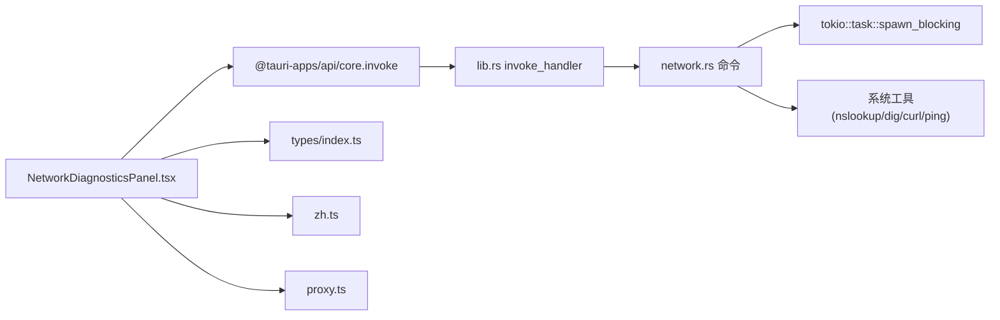

# 网络诊断

<cite>
**本文引用的文件**
- [NetworkDiagnosticsPanel.tsx](file://src/components/settings/NetworkDiagnosticsPanel.tsx)
- [network.rs](file://src-tauri/src/network.rs)
- [lib.rs](file://src-tauri/src/lib.rs)
- [proxy.ts](file://src/utils/proxy.ts)
- [types/index.ts](file://src/types/index.ts)
- [zh.ts](file://src/i18n/locales/zh.ts)
- [index.ts](file://sidecar/src/index.ts)
- [agent.ts](file://sidecar/src/agent.ts)
- [Cargo.toml](file://src-tauri/Cargo.toml)
- [main.rs](file://src-tauri/src/main.rs)
</cite>

## 目录
1. [简介](#简介)
2. [项目结构](#项目结构)
3. [核心组件](#核心组件)
4. [架构总览](#架构总览)
5. [详细组件分析](#详细组件分析)
6. [依赖关系分析](#依赖关系分析)
7. [性能考量](#性能考量)
8. [故障排查指南](#故障排查指南)
9. [结论](#结论)
10. [附录](#附录)

## 简介
本文件面向 RabbitCoding 网络诊断工具，系统化说明其功能、运行机制、测试方法与结果解读。工具支持四类网络诊断：DNS 解析、HTTP 连通与协议/TLS 检测、Ping 连通性与丢包/RTT 指标、Marketplace 连接与 API 可用性检测。同时涵盖代理检测、防火墙与 DNS 解析测试思路、最佳实践与常见问题处理建议。

## 项目结构
- 前端设置页组件负责发起诊断、并行执行、渐进式展示结果。
- Rust 后端提供命令接口，封装系统工具调用（nslookup/dig/curl/ping），并检测系统代理。
- 类型定义统一前后端数据结构，确保字段一致性。
- 代理工具模块提供代理配置到环境变量的转换，便于后续网络请求使用。

图表来源
- [NetworkDiagnosticsPanel.tsx:318-424](file://src/components/settings/NetworkDiagnosticsPanel.tsx#L318-L424)
- [lib.rs:344-387](file://src-tauri/src/lib.rs#L344-L387)
- [network.rs:366-863](file://src-tauri/src/network.rs#L366-L863)
- [types/index.ts:457-532](file://src/types/index.ts#L457-L532)
- [proxy.ts:1-62](file://src/utils/proxy.ts#L1-L62)

章节来源
- [NetworkDiagnosticsPanel.tsx:1-425](file://src/components/settings/NetworkDiagnosticsPanel.tsx#L1-L425)
- [lib.rs:344-387](file://src-tauri/src/lib.rs#L344-L387)
- [network.rs:1-864](file://src-tauri/src/network.rs#L1-L864)
- [types/index.ts:457-532](file://src/types/index.ts#L457-L532)
- [proxy.ts:1-62](file://src/utils/proxy.ts#L1-L62)

## 核心组件
- 网络诊断面板组件：负责 UI 控件、状态管理、并行调用后端命令、结果渲染。
- Rust 网络诊断命令：封装 DNS、HTTP、Ping、Marketplace 四类诊断，统一返回结构。
- 代理检测：跨平台检测系统代理与环境变量代理，输出代理信息。
- 类型定义：前后端一致的数据结构，保障字段命名与含义。
- 代理工具：将配置转换为环境变量，便于系统工具识别代理。

章节来源
- [NetworkDiagnosticsPanel.tsx:318-424](file://src/components/settings/NetworkDiagnosticsPanel.tsx#L318-L424)
- [network.rs:366-863](file://src-tauri/src/network.rs#L366-L863)
- [types/index.ts:457-532](file://src/types/index.ts#L457-L532)
- [proxy.ts:1-62](file://src/utils/proxy.ts#L1-L62)

## 架构总览
前端通过 Tauri invoke 调用后端命令，后端在阻塞线程中执行系统工具调用，检测代理后返回统一结构。UI 渐进式接收各诊断结果，最终汇总展示。

图表来源
- [NetworkDiagnosticsPanel.tsx:343-370](file://src/components/settings/NetworkDiagnosticsPanel.tsx#L343-L370)
- [lib.rs:360-363](file://src-tauri/src/lib.rs#L360-L363)
- [network.rs:100-201](file://src-tauri/src/network.rs#L100-L201)
- [network.rs:207-364](file://src-tauri/src/network.rs#L207-L364)
- [network.rs:391-550](file://src-tauri/src/network.rs#L391-L550)
- [network.rs:556-808](file://src-tauri/src/network.rs#L556-L808)
- [network.rs:828-863](file://src-tauri/src/network.rs#L828-L863)

## 详细组件分析

### DNS 诊断
- 目标主机集：包含多个业务域名，用于评估多点解析情况。
- 诊断流程：
  - Windows：使用 nslookup，解析 A 记录与服务器信息，统计解析耗时。
  - macOS/Linux：使用 dig +short，解析 A 记录，统计解析耗时。
  - 若无 A 记录或工具失败，标记为 error。
- 代理：在诊断前检测代理，结果中附带代理信息。
- 结果字段：host、proxy、server、resolvedIps、resolutionMs、status/error。

图表来源
- [network.rs:100-201](file://src-tauri/src/network.rs#L100-L201)
- [network.rs:207-364](file://src-tauri/src/network.rs#L207-L364)

章节来源
- [network.rs:10-26](file://src-tauri/src/network.rs#L10-L26)
- [network.rs:100-201](file://src-tauri/src/network.rs#L100-L201)
- [network.rs:207-364](file://src-tauri/src/network.rs#L207-L364)
- [types/index.ts:464-473](file://src/types/index.ts#L464-L473)

### HTTP 诊断
- 目标端点集：包含多个业务健康检查端点，用于评估连通性与协议/TLS 情况。
- 诊断流程：
  - 使用 curl 两次调用：
    - 第一次：-w 输出 HTTP 状态码、HTTP 版本、总耗时、Content-Type。
    - 第二次：-v 输出 TLS 版本与远端 IP。
  - 若任一阶段失败，记录错误原因。
- 代理：在诊断前检测代理，结果中附带代理信息。
- 结果字段：endpoint、method、proxy、statusCode、httpVersion、tlsVersion、responseTimeMs、contentType、remoteIp、status/error。

图表来源
- [network.rs:391-550](file://src-tauri/src/network.rs#L391-L550)

章节来源
- [network.rs:18-22](file://src-tauri/src/network.rs#L18-L22)
- [network.rs:391-550](file://src-tauri/src/network.rs#L391-L550)
- [types/index.ts:475-488](file://src/types/index.ts#L475-L488)

### Ping 诊断
- 目标主机集：包含多个关键域名，用于评估连通性与丢包/RTT 指标。
- 诊断流程：
  - Windows：使用 ping -n 4，解析丢包统计与最小/平均/最大 RTT。
  - macOS/Linux：使用 ping -c 4，解析丢包统计与最小/平均/最大 RTT。
  - 即使 100% 丢包也视为“成功”执行，仅缺少 RTT 数据。
- 代理：Ping 本身不走代理，但结果中仍附带代理信息（用于上下文）。
- 结果字段：target、ip、packetsSent/packetsReceived、packetLossPercent、rttMinMs/rttAvgMs/rttMaxMs、status/error。

图表来源
- [network.rs:556-808](file://src-tauri/src/network.rs#L556-L808)

章节来源
- [network.rs](file://src-tauri/src/network.rs#L24)
- [network.rs:556-808](file://src-tauri/src/network.rs#L556-L808)
- [types/index.ts:490-502](file://src/types/index.ts#L490-L502)

### Marketplace 诊断
- 目标端点：Marketplace 主机地址，用于评估连接与 API 可用性。
- 诊断流程：
  - 使用 HTTP 诊断逻辑获取连接状态与响应时间。
  - connectionOk：只要能建立连接即为真。
  - apiAvailable：仅当 HTTP 200 时为真。
  - 结果中附带代理信息。
- 结果字段：endpoint、proxy、connectionOk、apiAvailable、statusCode、responseTimeMs、status/error。

图表来源
- [network.rs:828-863](file://src-tauri/src/network.rs#L828-L863)

章节来源
- [network.rs](file://src-tauri/src/network.rs#L26)
- [network.rs:828-863](file://src-tauri/src/network.rs#L828-L863)
- [types/index.ts:504-514](file://src/types/index.ts#L504-L514)

### 代理检测与环境变量注入
- 代理检测：
  - 优先读取环境变量（HTTP_PROXY/HTTPS_PROXY/all_proxy 等）。
  - Windows：使用 netsh winhttp 检测系统代理。
  - macOS/Linux：使用 scutil 检测系统代理开关与地址。
- 代理工具：
  - 将 ProxyConfig 转换为环境变量（大写/小写兼容），便于系统工具识别。
  - 提供指纹函数用于检测配置变更。

图表来源
- [network.rs:100-201](file://src-tauri/src/network.rs#L100-L201)
- [proxy.ts:17-47](file://src/utils/proxy.ts#L17-L47)

章节来源
- [network.rs:100-201](file://src-tauri/src/network.rs#L100-L201)
- [proxy.ts:1-62](file://src/utils/proxy.ts#L1-L62)
- [types/index.ts:457-462](file://src/types/index.ts#L457-L462)

### 前端 UI 与结果渲染
- 并行执行：点击“开始诊断”后，同时发起四个诊断命令，渐进式渲染结果。
- 状态徽章：根据 status 显示 OK/FAIL。
- 代理信息：在 DNS/HTTP/Markeplace 区块顶部显示代理来源与地址。
- 字段展示：按列展示关键指标，错误时显示错误信息。

章节来源
- [NetworkDiagnosticsPanel.tsx:318-424](file://src/components/settings/NetworkDiagnosticsPanel.tsx#L318-L424)
- [NetworkDiagnosticsPanel.tsx:343-370](file://src/components/settings/NetworkDiagnosticsPanel.tsx#L343-L370)
- [NetworkDiagnosticsPanel.tsx:100-147](file://src/components/settings/NetworkDiagnosticsPanel.tsx#L100-L147)
- [NetworkDiagnosticsPanel.tsx:153-202](file://src/components/settings/NetworkDiagnosticsPanel.tsx#L153-L202)
- [NetworkDiagnosticsPanel.tsx:208-252](file://src/components/settings/NetworkDiagnosticsPanel.tsx#L208-L252)
- [NetworkDiagnosticsPanel.tsx:258-312](file://src/components/settings/NetworkDiagnosticsPanel.tsx#L258-L312)
- [zh.ts:557-610](file://src/i18n/locales/zh.ts#L557-L610)

## 依赖关系分析
- 前端依赖：
  - @tauri-apps/api/core：invoke 调用后端命令。
  - lucide-react：图标。
  - i18n：网络诊断文案。
- 后端依赖：
  - tokio：异步任务调度。
  - std::process::Command：调用系统工具。
  - serde：序列化结果结构。
- 代理工具：
  - 将 ProxyConfig 转换为环境变量键值对，便于系统工具识别代理。

图表来源
- [NetworkDiagnosticsPanel.tsx:8-19](file://src/components/settings/NetworkDiagnosticsPanel.tsx#L8-L19)
- [lib.rs:344-387](file://src-tauri/src/lib.rs#L344-L387)
- [network.rs:366-863](file://src-tauri/src/network.rs#L366-L863)
- [Cargo.toml:20-39](file://src-tauri/Cargo.toml#L20-L39)
- [proxy.ts:1-62](file://src/utils/proxy.ts#L1-L62)

章节来源
- [Cargo.toml:20-39](file://src-tauri/Cargo.toml#L20-L39)
- [lib.rs:344-387](file://src-tauri/src/lib.rs#L344-L387)

## 性能考量
- 并行执行：前端同时发起四个诊断，缩短总等待时间。
- 阻塞任务：后端使用 spawn_blocking 执行系统工具，避免阻塞主线程。
- 超时控制：HTTP 诊断设置最大超时，防止长时间卡顿。
- 资源占用：Ping 通常耗时较长，作为最后完成项重置运行状态。

章节来源
- [NetworkDiagnosticsPanel.tsx:343-370](file://src/components/settings/NetworkDiagnosticsPanel.tsx#L343-L370)
- [network.rs:391-410](file://src-tauri/src/network.rs#L391-L410)
- [network.rs:811-822](file://src-tauri/src/network.rs#L811-L822)

## 故障排查指南
- DNS 诊断失败
  - 检查系统 DNS 服务器与网络连通性。
  - 若解析耗时过长，考虑更换 DNS 服务器或使用直连。
- HTTP 诊断失败
  - 查看状态码与错误信息，确认代理设置是否正确。
  - 检查 TLS 版本与证书链，必要时调整客户端 TLS 配置。
- Ping 诊断异常
  - 100% 丢包：检查防火墙/安全策略、路由可达性。
  - RTT 异常高：排查中间网络拥塞或路由问题。
- Marketplace 诊断失败
  - 连接失败：检查网络与代理。
  - API 不可用：确认服务端状态与鉴权配置。

章节来源
- [network.rs:207-364](file://src-tauri/src/network.rs#L207-L364)
- [network.rs:391-550](file://src-tauri/src/network.rs#L391-L550)
- [network.rs:556-808](file://src-tauri/src/network.rs#L556-L808)
- [network.rs:828-863](file://src-tauri/src/network.rs#L828-L863)

## 结论
RabbitCoding 网络诊断工具通过前端并行调用与后端系统工具结合，提供了 DNS、HTTP、Ping、Marketplace 四类诊断能力，并统一代理检测与结果结构。其设计简洁、结果直观，适合快速定位网络问题。建议在实际使用中结合代理配置与系统工具行为，进一步细化告警与修复建议。

## 附录

### 运行机制与测试方法
- 运行机制
  - 前端点击“开始诊断”，并行调用 diag_dns、diag_http、diag_marketplace、diag_ping。
  - 后端在阻塞任务中检测代理并调用系统工具，返回统一结构。
  - 前端渐进式渲染各区块结果。
- 测试方法
  - DNS：对比不同 DNS 服务器解析结果与耗时。
  - HTTP：关注状态码、协议版本、TLS 版本、响应时间、内容类型。
  - Ping：关注丢包率与 RTT 指标。
  - Marketplace：关注连接状态与 API 可用性。

章节来源
- [NetworkDiagnosticsPanel.tsx:343-370](file://src/components/settings/NetworkDiagnosticsPanel.tsx#L343-L370)
- [network.rs:366-863](file://src-tauri/src/network.rs#L366-L863)

### 结果解读
- DNS：解析成功即为 OK，否则显示错误；可查看解析服务器与耗时。
- HTTP：2xx 表示连接与服务正常；可查看协议/TLS/响应时间/内容类型。
- Ping：丢包率与 RTT 指标反映网络质量；100% 丢包不等于失败，仅缺少 RTT。
- Marketplace：连接 OK 表示可达；API Available 表示服务可用。

章节来源
- [NetworkDiagnosticsPanel.tsx:100-147](file://src/components/settings/NetworkDiagnosticsPanel.tsx#L100-L147)
- [NetworkDiagnosticsPanel.tsx:153-202](file://src/components/settings/NetworkDiagnosticsPanel.tsx#L153-L202)
- [NetworkDiagnosticsPanel.tsx:208-252](file://src/components/settings/NetworkDiagnosticsPanel.tsx#L208-L252)
- [NetworkDiagnosticsPanel.tsx:258-312](file://src/components/settings/NetworkDiagnosticsPanel.tsx#L258-L312)

### 代理设置、防火墙与 DNS 解析测试
- 代理设置
  - 通过环境变量与系统代理检测，确保工具链识别代理。
  - 使用代理工具将配置转换为环境变量，便于系统工具识别。
- 防火墙配置
  - 检查出站策略与端口放行（HTTP/HTTPS/ICMP）。
  - Ping 诊断可用于判断 ICMP 是否受限。
- DNS 解析测试
  - 对比 nslookup/dig 结果与解析耗时，定位 DNS 服务器问题。

章节来源
- [network.rs:100-201](file://src-tauri/src/network.rs#L100-L201)
- [proxy.ts:17-47](file://src/utils/proxy.ts#L17-L47)
- [network.rs:207-364](file://src-tauri/src/network.rs#L207-L364)

### 最佳实践与常见问题
- 最佳实践
  - 优先使用直连进行基线测试，再逐步引入代理验证。
  - 结合多点 DNS 与多端点 HTTP 诊断，提升诊断覆盖面。
  - 定期运行 Ping 诊断，监控丢包与 RTT 变化趋势。
- 常见问题
  - 代理导致解析/连接异常：检查代理配置与 NO_PROXY 白名单。
  - 防火墙阻断：开放所需端口或调整安全策略。
  - DNS 服务器不稳定：更换上游 DNS 或使用直连解析。

章节来源
- [NetworkDiagnosticsPanel.tsx:318-424](file://src/components/settings/NetworkDiagnosticsPanel.tsx#L318-L424)
- [network.rs:100-201](file://src-tauri/src/network.rs#L100-L201)
- [network.rs:207-364](file://src-tauri/src/network.rs#L207-L364)
- [network.rs:391-550](file://src-tauri/src/network.rs#L391-L550)
- [network.rs:556-808](file://src-tauri/src/network.rs#L556-L808)
- [network.rs:828-863](file://src-tauri/src/network.rs#L828-L863)