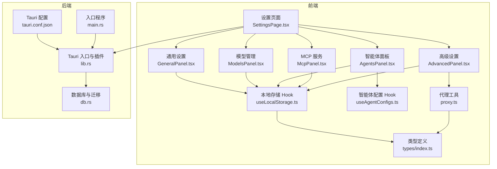
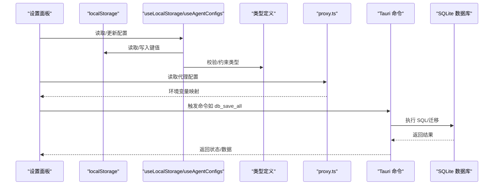
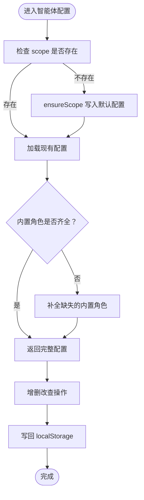
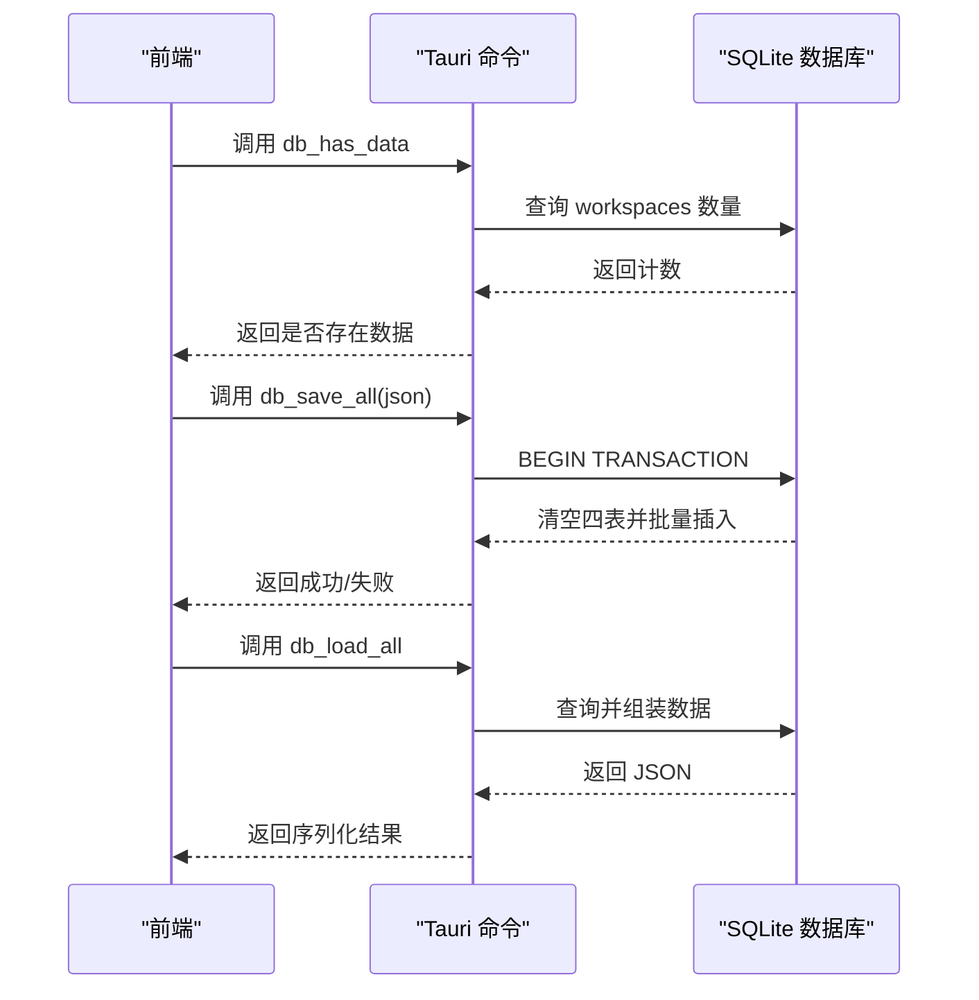
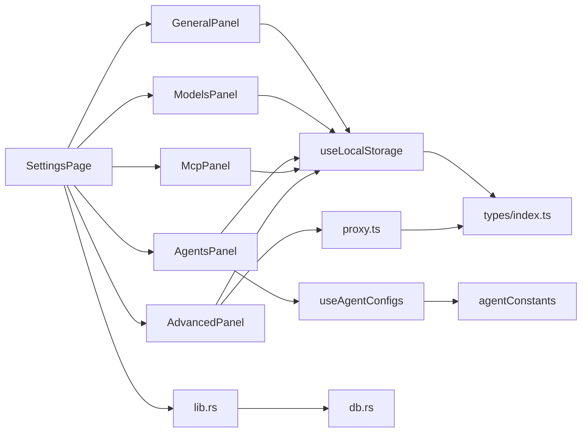

# 设置和配置

<cite>
**本文引用的文件**
- [src-tauri/src/main.rs](file://src-tauri/src/main.rs)
- [src-tauri/tauri.conf.json](file://src-tauri/tauri.conf.json)
- [src/components/settings/SettingsPage.tsx](file://src/components/settings/SettingsPage.tsx)
- [src/components/settings/GeneralPanel.tsx](file://src/components/settings/GeneralPanel.tsx)
- [src/components/settings/ModelsPanel.tsx](file://src/components/settings/ModelsPanel.tsx)
- [src/components/settings/agents/AgentsPanel.tsx](file://src/components/settings/agents/AgentsPanel.tsx)
- [src/components/settings/McpPanel.tsx](file://src/components/settings/McpPanel.tsx)
- [src/components/settings/AdvancedPanel.tsx](file://src/components/settings/AdvancedPanel.tsx)
- [src/hooks/useAgentConfigs.ts](file://src/hooks/useAgentConfigs.ts)
- [src/hooks/useLocalStorage.ts](file://src/hooks/useLocalStorage.ts)
- [src/utils/proxy.ts](file://src/utils/proxy.ts)
- [src/types/index.ts](file://src/types/index.ts)
- [src-tauri/src/lib.rs](file://src-tauri/src/lib.rs)
- [src-tauri/src/db.rs](file://src-tauri/src/db.rs)
</cite>

## 目录
1. [简介](#简介)
2. [项目结构](#项目结构)
3. [核心组件](#核心组件)
4. [架构总览](#架构总览)
5. [详细组件分析](#详细组件分析)
6. [依赖关系分析](#依赖关系分析)
7. [性能考量](#性能考量)
8. [故障排除指南](#故障排除指南)
9. [结论](#结论)
10. [附录](#附录)

## 简介
本文件面向 RabbitCoding 的“设置与配置”系统，提供从通用设置、模型配置、智能体配置、网络设置到高级配置的完整功能说明。内容涵盖参数作用、默认值、可选范围、存储机制、数据校验、配置迁移策略、最佳实践、安全与性能影响、具体示例与故障排除，帮助开发者与用户正确理解并使用系统的配置能力。

## 项目结构
设置与配置系统主要由三部分组成：
- 前端设置页面与面板：负责用户交互、参数收集与本地持久化（localStorage）。
- 本地存储与迁移：localStorage 作为首选持久化，配合 SQLite 数据库存储会话与历史数据。
- 后端集成与命令：通过 Tauri 命令桥接前端与 Rust 后端，实现系统级能力（如通知、文件读取、数据库操作、网络诊断等）。

**图表来源**
- [src/components/settings/SettingsPage.tsx:90-143](file://src/components/settings/SettingsPage.tsx#L90-L143)
- [src/components/settings/GeneralPanel.tsx:19-246](file://src/components/settings/GeneralPanel.tsx#L19-L246)
- [src/components/settings/ModelsPanel.tsx:16-146](file://src/components/settings/ModelsPanel.tsx#L16-L146)
- [src/components/settings/agents/AgentsPanel.tsx:17-78](file://src/components/settings/agents/AgentsPanel.tsx#L17-L78)
- [src/components/settings/McpPanel.tsx:15-153](file://src/components/settings/McpPanel.tsx#L15-L153)
- [src/components/settings/AdvancedPanel.tsx:13-99](file://src/components/settings/AdvancedPanel.tsx#L13-L99)
- [src/hooks/useLocalStorage.ts:3-26](file://src/hooks/useLocalStorage.ts#L3-L26)
- [src/hooks/useAgentConfigs.ts:17-129](file://src/hooks/useAgentConfigs.ts#L17-L129)
- [src/utils/proxy.ts:3-61](file://src/utils/proxy.ts#L3-L61)
- [src/types/index.ts:304-515](file://src/types/index.ts#L304-L515)
- [src-tauri/src/lib.rs:124-316](file://src-tauri/src/lib.rs#L124-L316)
- [src-tauri/src/db.rs:80-161](file://src-tauri/src/db.rs#L80-L161)
- [src-tauri/tauri.conf.json:1-52](file://src-tauri/tauri.conf.json#L1-L52)
- [src-tauri/src/main.rs:4-6](file://src-tauri/src/main.rs#L4-L6)

**章节来源**
- [src/components/settings/SettingsPage.tsx:31-80](file://src/components/settings/SettingsPage.tsx#L31-L80)
- [src-tauri/src/lib.rs:124-316](file://src-tauri/src/lib.rs#L124-L316)
- [src-tauri/src/db.rs:80-161](file://src-tauri/src/db.rs#L80-L161)
- [src-tauri/tauri.conf.json:1-52](file://src-tauri/tauri.conf.json#L1-L52)

## 核心组件
- 通用设置（GeneralPanel）
  - 语言、主题、通知、偏好、隐私等参数，持久化于 localStorage。
  - 示例键：pref-notify-task-done、pref-notify-desktop、pref-notify-sound、pref-auto-collapse-thinking、pref-show-token-usage、pref-telemetry、pref-save-history。
- 模型配置（ModelsPanel）
  - 管理模型列表（名称、提供商、模型ID、Base URL、API Key、环境变量、启用状态、上下文窗口等），持久化于 localStorage。
  - 示例键：model-configs。
- 智能体配置（AgentsPanel + useAgentConfigs）
  - 用户级与工作区级智能体配置，包含内置专家角色与自定义智能体，持久化于 localStorage。
  - 示例键：agent-configs。
- MCP 服务（McpPanel）
  - 管理 MCP 服务器（stdio/http/sse），持久化于 localStorage。
  - 示例键：mcp-server-configs。
- 高级设置（AdvancedPanel + proxy.ts）
  - 代理配置（HTTP/HTTPS/SOCKS/no_proxy），持久化于 localStorage。
  - 提供代理到环境变量转换与指纹计算，便于变更检测。
- 数据存储与迁移（useLocalStorage + db.rs）
  - 前端：useLocalStorage 提供 localStorage 读写封装。
  - 后端：SQLite 数据库存储工作区、兔子会话、仓库与消息，支持列迁移与全量导入导出。

**章节来源**
- [src/components/settings/GeneralPanel.tsx:19-246](file://src/components/settings/GeneralPanel.tsx#L19-L246)
- [src/components/settings/ModelsPanel.tsx:16-146](file://src/components/settings/ModelsPanel.tsx#L16-L146)
- [src/components/settings/agents/AgentsPanel.tsx:17-78](file://src/components/settings/agents/AgentsPanel.tsx#L17-L78)
- [src/hooks/useAgentConfigs.ts:17-129](file://src/hooks/useAgentConfigs.ts#L17-L129)
- [src/components/settings/McpPanel.tsx:15-153](file://src/components/settings/McpPanel.tsx#L15-L153)
- [src/components/settings/AdvancedPanel.tsx:13-99](file://src/components/settings/AdvancedPanel.tsx#L13-L99)
- [src/utils/proxy.ts:3-61](file://src/utils/proxy.ts#L3-L61)
- [src/hooks/useLocalStorage.ts:3-26](file://src/hooks/useLocalStorage.ts#L3-L26)
- [src-tauri/src/db.rs:80-161](file://src-tauri/src/db.rs#L80-L161)

## 架构总览
设置与配置系统采用“前端面板 + 本地存储 + 后端命令”的分层设计：
- 前端面板负责参数展示与交互，使用 localStorage 保存用户配置。
- 智能体配置通过 useAgentConfigs 提供统一的增删改查与默认值补全。
- 代理配置通过 proxy.ts 转换为环境变量，影响子进程（如 sidecar、MCP、gitnexus 等）。
- 数据库存储（db.rs）提供会话与历史数据的持久化与迁移能力，Tauri 命令桥接前后端。

**图表来源**
- [src/components/settings/GeneralPanel.tsx:24-38](file://src/components/settings/GeneralPanel.tsx#L24-L38)
- [src/components/settings/ModelsPanel.tsx:18-53](file://src/components/settings/ModelsPanel.tsx#L18-L53)
- [src/hooks/useAgentConfigs.ts:17-129](file://src/hooks/useAgentConfigs.ts#L17-L129)
- [src/utils/proxy.ts:17-47](file://src/utils/proxy.ts#L17-L47)
- [src-tauri/src/db.rs:392-416](file://src-tauri/src/db.rs#L392-L416)
- [src-tauri/src/lib.rs:272-313](file://src-tauri/src/lib.rs#L272-L313)

## 详细组件分析

### 通用设置（语言、主题、通知、偏好、隐私）
- 参数与默认值
  - 语言：zh/en，无默认值（由系统语言决定），通过国际化钩子切换。
  - 主题：system/light/dark，默认 system。
  - 通知：pref-notify-task-done/pref-notify-desktop/pref-notify-sound，默认均为开启。
  - 偏好：pref-auto-collapse-thinking/pref-show-token-usage，默认关闭。
  - 隐私：pref-telemetry/pref-save-history，默认开启。
- 数据存储
  - 使用 useLocalStorage 持久化，键名明确，读取失败回退默认值。
- 行为影响
  - 语言与主题即时生效；通知开关影响桌面通知行为；偏好影响界面交互；隐私开关影响遥测与历史保存。

**章节来源**
- [src/components/settings/GeneralPanel.tsx:19-246](file://src/components/settings/GeneralPanel.tsx#L19-L246)
- [src/hooks/useLocalStorage.ts:3-26](file://src/hooks/useLocalStorage.ts#L3-L26)

### 模型配置（ModelsPanel）
- 参数与默认值
  - 名称、提供商、模型ID、Base URL、API Key、apiKeyEnvVar、envVars、enabled、createdAt、maxContextTokens。
  - 默认键：model-configs，初始为空数组。
- 数据存储与校验
  - 使用 useLocalStorage 存储数组，按 id 唯一标识；启用/禁用通过布尔值控制；上下文窗口默认 200000。
- 行为影响
  - 启用的模型出现在模型选择器中；测试连接返回状态码、延迟、echo 的一致性与错误描述。

**章节来源**
- [src/components/settings/ModelsPanel.tsx:16-146](file://src/components/settings/ModelsPanel.tsx#L16-L146)
- [src/types/index.ts:304-341](file://src/types/index.ts#L304-L341)
- [src/hooks/useLocalStorage.ts:3-26](file://src/hooks/useLocalStorage.ts#L3-L26)

### 智能体配置（AgentsPanel + useAgentConfigs）
- 参数与默认值
  - 内置专家角色：researcher/fullstack/qa/reviewer/ui_operator/debugger。
  - 自定义智能体：name/description/modelId/tools/systemPrompt/enabled/createdAt。
  - 默认键：agent-configs，按 scope（用户级/工作区级）组织。
- 数据存储与迁移
  - useAgentConfigs 提供 getScopeConfig、ensureScope、updateBuiltinAgent、addCustomAgent、updateCustomAgent、deleteCustomAgent。
  - 首次访问若 scope 不存在，自动写入默认配置；内置角色缺失时自动补全。
- 行为影响
  - 用户级配置适用于全局默认；工作区级配置覆盖用户级；内置角色与自定义智能体共同决定智能体行为。

**图表来源**
- [src/hooks/useAgentConfigs.ts:25-38](file://src/hooks/useAgentConfigs.ts#L25-L38)
- [src/hooks/useAgentConfigs.ts:41-47](file://src/hooks/useAgentConfigs.ts#L41-L47)
- [src/components/settings/agents/agentConstants.ts:64-71](file://src/components/settings/agents/agentConstants.ts#L64-L71)

**章节来源**
- [src/components/settings/agents/AgentsPanel.tsx:17-78](file://src/components/settings/agents/AgentsPanel.tsx#L17-L78)
- [src/hooks/useAgentConfigs.ts:17-129](file://src/hooks/useAgentConfigs.ts#L17-L129)
- [src/components/settings/agents/agentConstants.ts:21-83](file://src/components/settings/agents/agentConstants.ts#L21-L83)

### MCP 服务（McpPanel）
- 参数与默认值
  - 名称、类型（stdio/http/sse）、command/args/env（stdio）或 url/headers（http/sse）、enabled、createdAt。
  - 默认键：mcp-server-configs，初始为空数组。
- 数据存储与校验
  - 使用 useLocalStorage 存储数组，按 id 唯一标识；启用/禁用通过布尔值控制。
- 行为影响
  - 启用的服务将被 sidecar 或其他组件使用；不同类型字段组合决定连接方式。

**章节来源**
- [src/components/settings/McpPanel.tsx:15-153](file://src/components/settings/McpPanel.tsx#L15-L153)
- [src/types/index.ts:408-434](file://src/types/index.ts#L408-L434)
- [src/hooks/useLocalStorage.ts:3-26](file://src/hooks/useLocalStorage.ts#L3-L26)

### 高级设置（AdvancedPanel + proxy.ts）
- 参数与默认值
  - enabled、httpProxy、httpsProxy、socksProxy、noProxy。
  - 默认键：proxy-config，默认 enabled=false，noProxy 包含 localhost,127.0.0.1。
- 数据存储与转换
  - 使用 useLocalStorage 持久化；proxy.ts 提供 proxyConfigToEnvVars 将配置映射为环境变量（HTTP_PROXY/http_proxy、HTTPS_PROXY/https_proxy、ALL_PROXY/all_proxy、NO_PROXY/no_proxy），并提供指纹计算。
- 行为影响
  - 仅当 enabled=true 且字段非空时才注入环境变量；no_proxy 控制直连地址；变更后需重启以确保子进程生效。

**章节来源**
- [src/components/settings/AdvancedPanel.tsx:13-99](file://src/components/settings/AdvancedPanel.tsx#L13-L99)
- [src/utils/proxy.ts:3-61](file://src/utils/proxy.ts#L3-L61)
- [src/types/index.ts:503-515](file://src/types/index.ts#L503-L515)

### 数据存储与迁移（db.rs + useLocalStorage）
- 前端存储
  - useLocalStorage 提供键值读写封装，异常时回退默认值，避免崩溃。
- 后端存储与迁移
  - db.rs 定义工作区、兔子、仓库、消息四表结构，初始化时执行建表与列迁移（token_usage、num_turns）。
  - 提供 db_load_all/db_save_all/db_has_data 三个命令，支持全量导入导出与数据存在性检测。
- 行为影响
  - 若数据库初始化失败，前端可降级使用 localStorage；数据库成功初始化后，优先使用数据库进行持久化。

**图表来源**
- [src-tauri/src/db.rs:392-416](file://src-tauri/src/db.rs#L392-L416)
- [src-tauri/src/db.rs:140-161](file://src-tauri/src/db.rs#L140-L161)
- [src-tauri/src/lib.rs:272-313](file://src-tauri/src/lib.rs#L272-L313)

**章节来源**
- [src-tauri/src/db.rs:80-161](file://src-tauri/src/db.rs#L80-L161)
- [src-tauri/src/db.rs:290-386](file://src-tauri/src/db.rs#L290-L386)
- [src-tauri/src/db.rs:392-416](file://src-tauri/src/db.rs#L392-L416)
- [src/hooks/useLocalStorage.ts:3-26](file://src/hooks/useLocalStorage.ts#L3-L26)

## 依赖关系分析
- 组件耦合
  - 设置面板依赖 useLocalStorage 与类型定义；智能体配置依赖 useAgentConfigs 与 agentConstants；代理配置依赖 proxy.ts。
- 外部依赖
  - Tauri 插件（dialog/fs/opener/pty/window_state/notification/deep-link）与命令注册。
  - SQLite（rusqlite）用于数据持久化与迁移。
- 潜在循环
  - 前端设置面板与 Hook 之间为单向依赖，无循环；代理工具与面板之间为纯函数依赖，无循环。

**图表来源**
- [src/components/settings/SettingsPage.tsx:19-28](file://src/components/settings/SettingsPage.tsx#L19-L28)
- [src/components/settings/GeneralPanel.tsx:1-11](file://src/components/settings/GeneralPanel.tsx#L1-L11)
- [src/components/settings/ModelsPanel.tsx:1-14](file://src/components/settings/ModelsPanel.tsx#L1-L14)
- [src/components/settings/agents/AgentsPanel.tsx:1-16](file://src/components/settings/agents/AgentsPanel.tsx#L1-L16)
- [src/components/settings/McpPanel.tsx:1-13](file://src/components/settings/McpPanel.tsx#L1-L13)
- [src/components/settings/AdvancedPanel.tsx:1-6](file://src/components/settings/AdvancedPanel.tsx#L1-L6)
- [src/hooks/useLocalStorage.ts:1-27](file://src/hooks/useLocalStorage.ts#L1-L27)
- [src/hooks/useAgentConfigs.ts:1-15](file://src/hooks/useAgentConfigs.ts#L1-L15)
- [src/utils/proxy.ts:1-62](file://src/utils/proxy.ts#L1-L62)
- [src/types/index.ts:304-515](file://src/types/index.ts#L304-L515)
- [src-tauri/src/lib.rs:272-313](file://src-tauri/src/lib.rs#L272-L313)
- [src-tauri/src/db.rs:80-161](file://src-tauri/src/db.rs#L80-L161)

**章节来源**
- [src/components/settings/SettingsPage.tsx:31-80](file://src/components/settings/SettingsPage.tsx#L31-L80)
- [src-tauri/src/lib.rs:124-316](file://src-tauri/src/lib.rs#L124-L316)

## 性能考量
- 前端性能
  - localStorage 读写为同步操作，建议减少频繁写入；复杂面板（如技能面板）可通过懒加载与虚拟滚动优化渲染。
- 后端性能
  - 数据库使用 WAL 模式与 NORMAL 同步级别，提升并发与可靠性；批量导入使用事务（BEGIN/COMMIT/ROLLBACK）保证一致性。
- 代理与网络
  - 代理配置仅在启用且字段非空时注入环境变量，避免不必要的网络栈切换；no_proxy 减少不必要的代理转发。

[本节为通用性能讨论，无需特定文件引用]

## 故障排除指南
- 通知未弹出
  - 检查系统通知设置权限；通过“打开系统通知设置”按钮快速跳转；使用“测试通知”按钮验证。
- 代理配置无效
  - 确认 enabled=true 且对应字段非空；检查环境变量映射（HTTP_PROXY/https_proxy/ALL_PROXY/no_proxy）；变更后需重启以生效。
- 模型连接失败
  - 使用模型面板的“测试连接”查看状态码、延迟与错误描述；核对 API Key 与 Base URL。
- 数据库初始化失败
  - 前端将降级使用 localStorage；可在应用数据目录检查 rabbit.db 文件；必要时清理后重新初始化。
- 智能体配置缺失
  - 首次访问或旧版本升级后，系统会自动补全内置角色；若仍缺失，检查 agent-configs 键值。

**章节来源**
- [src/components/settings/GeneralPanel.tsx:170-199](file://src/components/settings/GeneralPanel.tsx#L170-L199)
- [src/components/settings/AdvancedPanel.tsx:88-96](file://src/components/settings/AdvancedPanel.tsx#L88-L96)
- [src/components/settings/ModelsPanel.tsx:108-110](file://src/components/settings/ModelsPanel.tsx#L108-L110)
- [src-tauri/src/db.rs:140-161](file://src-tauri/src/db.rs#L140-L161)
- [src/hooks/useAgentConfigs.ts:25-38](file://src/hooks/useAgentConfigs.ts#L25-L38)

## 结论
RabbitCoding 的设置与配置系统以“前端面板 + 本地存储 + 后端命令”为核心，结合类型约束、默认值补全与数据库迁移，提供了稳定可靠的配置体验。通过合理的参数设计与安全考虑（如隐私开关、代理环境变量注入），系统在易用性与可控性之间取得平衡。建议在生产环境中关注代理变更的重启要求、数据库事务的一致性以及 localStorage 的容量与异常处理。

[本节为总结性内容，无需特定文件引用]

## 附录

### 配置参数速查表
- 通用设置
  - pref-notify-task-done：布尔，通知“任务完成”
  - pref-notify-desktop：布尔，通知“桌面通知”
  - pref-notify-sound：布尔，通知“声音”
  - pref-auto-collapse-thinking：布尔，偏好“自动折叠思考”
  - pref-show-token-usage：布尔，偏好“显示 Token 用量”
  - pref-telemetry：布尔，隐私“遥测”
  - pref-save-history：布尔，隐私“保存历史”
- 模型配置（键：model-configs）
  - id/name/provider/modelId/baseUrl/apiKey/apiKeyEnvVar/envVars/enabled/createdAt/maxContextTokens
- 智能体配置（键：agent-configs）
  - scope/builtinAgents/customAgents（含 role/modelId/skills/mcp/additionalPrompt/name/description/tools/systemPrompt/enabled/createdAt）
- MCP 服务（键：mcp-server-configs）
  - id/name/type/command/args/env/url/headers/enabled/createdAt
- 代理配置（键：proxy-config）
  - enabled/httpProxy/httpsProxy/socksProxy/noProxy

**章节来源**
- [src/components/settings/GeneralPanel.tsx:24-36](file://src/components/settings/GeneralPanel.tsx#L24-L36)
- [src/components/settings/ModelsPanel.tsx:18-53](file://src/components/settings/ModelsPanel.tsx#L18-L53)
- [src/hooks/useAgentConfigs.ts:17-129](file://src/hooks/useAgentConfigs.ts#L17-L129)
- [src/components/settings/McpPanel.tsx:17-52](file://src/components/settings/McpPanel.tsx#L17-L52)
- [src/components/settings/AdvancedPanel.tsx:15-19](file://src/components/settings/AdvancedPanel.tsx#L15-L19)
- [src/types/index.ts:304-515](file://src/types/index.ts#L304-L515)

### 配置迁移策略
- 智能体配置
  - 首次访问或旧版本升级时，自动补全缺失的内置角色；若 scope 不存在，写入默认配置。
- 数据库
  - 初始化时执行建表与列迁移（token_usage、num_turns），保持幂等；全量导入使用事务，失败自动回滚。

**章节来源**
- [src/hooks/useAgentConfigs.ts:25-38](file://src/hooks/useAgentConfigs.ts#L25-L38)
- [src-tauri/src/db.rs:140-161](file://src-tauri/src/db.rs#L140-L161)
- [src-tauri/src/db.rs:290-305](file://src-tauri/src/db.rs#L290-L305)

### 最佳实践
- 代理
  - 仅在确有需要时启用代理；合理设置 no_proxy，避免对本地服务产生不必要的代理转发。
- 模型
  - 为每个提供商维护独立的模型配置；定期测试连接，确保 API Key 与 Base URL 正确。
- 智能体
  - 使用工作区级配置隔离团队差异；自定义智能体尽量复用内置角色的默认能力。
- 数据
  - 定期备份应用数据目录；数据库初始化失败时，先排查权限与磁盘空间。

[本节为通用建议，无需特定文件引用]