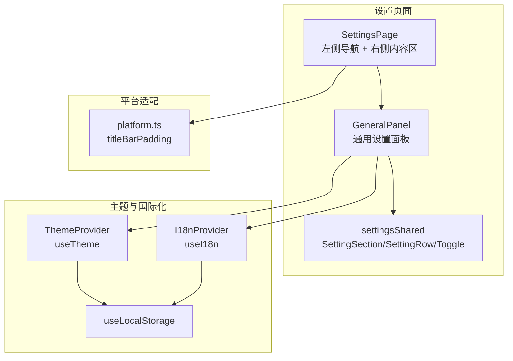
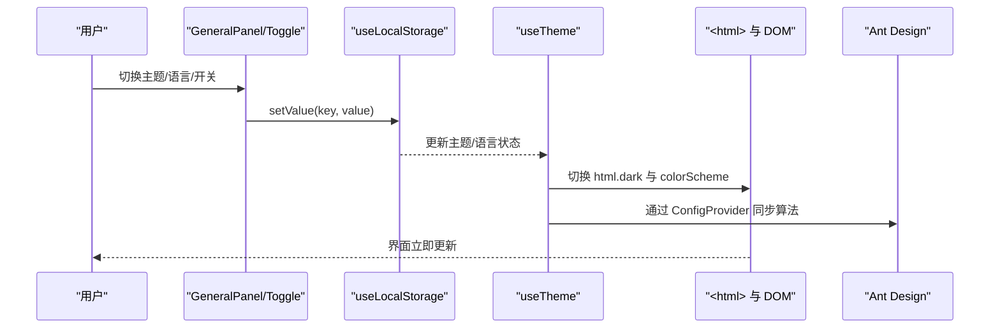
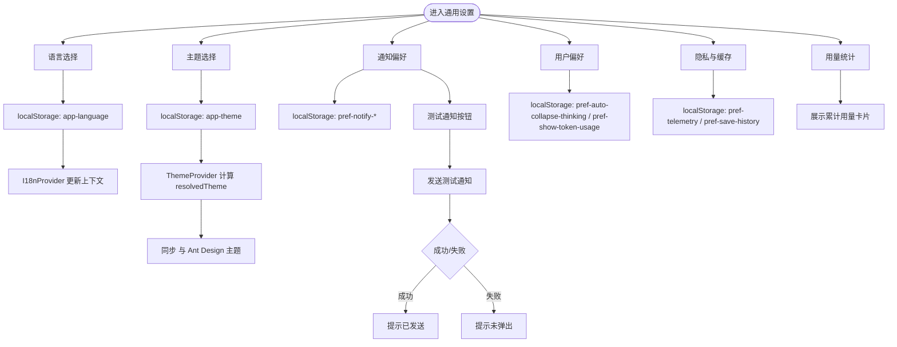
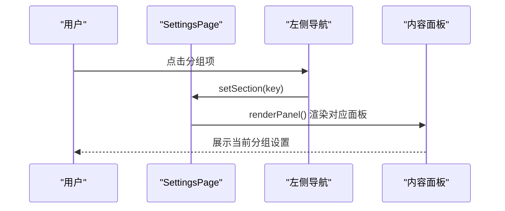
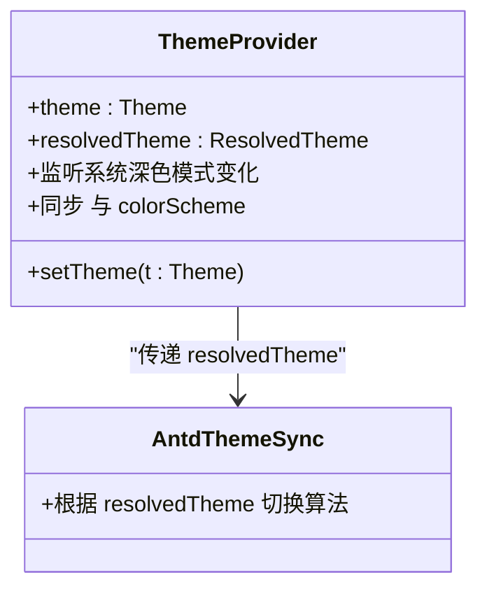
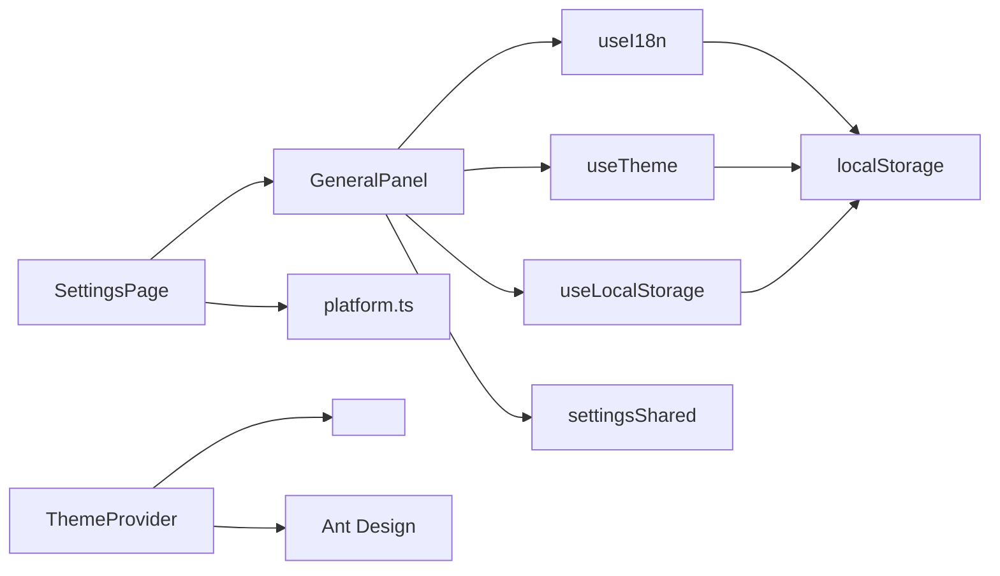

# 通用设置

<cite>
**本文引用的文件**
- [src/components/settings/GeneralPanel.tsx](file://src/components/settings/GeneralPanel.tsx)
- [src/components/settings/SettingsPage.tsx](file://src/components/settings/SettingsPage.tsx)
- [src/components/settings/settingsShared.tsx](file://src/components/settings/settingsShared.tsx)
- [src/hooks/useTheme.tsx](file://src/hooks/useTheme.tsx)
- [src/hooks/useLocalStorage.ts](file://src/hooks/useLocalStorage.ts)
- [src/i18n/index.tsx](file://src/i18n/index.tsx)
- [src/i18n/context.ts](file://src/i18n/context.ts)
- [src/i18n/locales/en.ts](file://src/i18n/locales/en.ts)
- [src/i18n/locales/zh.ts](file://src/i18n/locales/zh.ts)
- [src/utils/platform.ts](file://src/utils/platform.ts)
- [src/App.tsx](file://src/App.tsx)
- [src/main.tsx](file://src/main.tsx)
</cite>

## 目录
1. [简介](#简介)
2. [项目结构](#项目结构)
3. [核心组件](#核心组件)
4. [架构总览](#架构总览)
5. [详细组件分析](#详细组件分析)
6. [依赖关系分析](#依赖关系分析)
7. [性能考量](#性能考量)
8. [故障排查指南](#故障排查指南)
9. [结论](#结论)
10. [附录](#附录)

## 简介
本文件为 RabbitCoding 通用设置模块的功能文档，聚焦应用的基础配置项与行为，包括主题设置（深色/浅色/跟随系统）、语言选择、通知偏好、用户偏好、隐私与缓存、用量统计等。文档详细说明各项配置的作用、默认值、可选范围、存储机制、实时生效方式以及配置同步策略，并提供界面定制与用户体验优化建议及最佳实践。

## 项目结构
通用设置模块位于前端设置页面的“通用”分组，采用分层组织：
- 设置页面容器：左侧导航 + 右侧内容区，支持可调整宽度与滚动布局
- 通用设置面板：集中展示语言、主题、通知、偏好、隐私、用量统计等
- 通用 UI 组件：设置分组卡片、设置行与纯 CSS 开关控件
- 国际化与主题：语言与主题的持久化与实时生效
- 存储：统一使用 localStorage 进行键值持久化

图表来源
- [src/components/settings/SettingsPage.tsx:90-143](file://src/components/settings/SettingsPage.tsx#L90-L143)
- [src/components/settings/GeneralPanel.tsx:19-250](file://src/components/settings/GeneralPanel.tsx#L19-L250)
- [src/components/settings/settingsShared.tsx:1-67](file://src/components/settings/settingsShared.tsx#L1-L67)
- [src/hooks/useTheme.tsx:25-56](file://src/hooks/useTheme.tsx#L25-L56)
- [src/i18n/index.tsx:7-19](file://src/i18n/index.tsx#L7-L19)
- [src/hooks/useLocalStorage.ts:3-26](file://src/hooks/useLocalStorage.ts#L3-L26)
- [src/utils/platform.ts:1-19](file://src/utils/platform.ts#L1-L19)

章节来源
- [src/components/settings/SettingsPage.tsx:90-143](file://src/components/settings/SettingsPage.tsx#L90-L143)
- [src/components/settings/GeneralPanel.tsx:19-250](file://src/components/settings/GeneralPanel.tsx#L19-L250)
- [src/components/settings/settingsShared.tsx:1-67](file://src/components/settings/settingsShared.tsx#L1-L67)
- [src/hooks/useTheme.tsx:25-56](file://src/hooks/useTheme.tsx#L25-L56)
- [src/i18n/index.tsx:7-19](file://src/i18n/index.tsx#L7-L19)
- [src/hooks/useLocalStorage.ts:3-26](file://src/hooks/useLocalStorage.ts#L3-L26)
- [src/utils/platform.ts:1-19](file://src/utils/platform.ts#L1-L19)

## 核心组件
- 通用设置面板（GeneralPanel）
  - 职责：渲染语言、主题、通知、偏好、隐私、用量统计等设置项
  - 关键点：使用 useI18n 与 useTheme；使用 useLocalStorage 持久化；使用 SettingSection/SettingRow/Toggle 组合 UI
- 设置页面（SettingsPage）
  - 职责：承载导航与内容区，支持可调整宽度、滚动与全宽模式
  - 关键点：根据当前 section 渲染对应面板；支持初始 section 参数
- 主题提供器（ThemeProvider）
  - 职责：维护用户选择的主题与系统主题监听，计算实际生效主题并同步到 DOM
- 国际化提供器（I18nProvider）
  - 职责：维护语言与翻译函数，提供 t(key) 获取文案
- 本地存储 Hook（useLocalStorage）
  - 职责：封装 localStorage 读写，支持默认值与 JSON 序列化
- 通用 UI 组件（settingsShared）
  - 职责：提供设置分组卡片、设置行与开关控件，保持一致的视觉与交互风格

章节来源
- [src/components/settings/GeneralPanel.tsx:19-250](file://src/components/settings/GeneralPanel.tsx#L19-L250)
- [src/components/settings/SettingsPage.tsx:90-143](file://src/components/settings/SettingsPage.tsx#L90-L143)
- [src/hooks/useTheme.tsx:25-56](file://src/hooks/useTheme.tsx#L25-L56)
- [src/i18n/index.tsx:7-19](file://src/i18n/index.tsx#L7-L19)
- [src/hooks/useLocalStorage.ts:3-26](file://src/hooks/useLocalStorage.ts#L3-L26)
- [src/components/settings/settingsShared.tsx:1-67](file://src/components/settings/settingsShared.tsx#L1-L67)

## 架构总览
通用设置模块围绕“持久化配置 + 实时生效 + UI 渲染”的闭环构建：
- 配置来源：localStorage 键值对（如 app-theme、app-language、pref-*）
- 生效路径：useTheme/useI18n/useLocalStorage 读取并更新状态；Theme 提供器将主题同步至 <html>；Ant Design 主题随主题切换而切换
- 渲染路径：SettingsPage 根据 section 渲染面板；GeneralPanel 渲染具体设置项；Toggle/SettingRow 等 UI 组件响应用户交互

图表来源
- [src/components/settings/GeneralPanel.tsx:20-36](file://src/components/settings/GeneralPanel.tsx#L20-L36)
- [src/hooks/useTheme.tsx:41-49](file://src/hooks/useTheme.tsx#L41-L49)
- [src/App.tsx:17-27](file://src/App.tsx#L17-L27)
- [src/hooks/useLocalStorage.ts:13-23](file://src/hooks/useLocalStorage.ts#L13-L23)

章节来源
- [src/components/settings/GeneralPanel.tsx:20-36](file://src/components/settings/GeneralPanel.tsx#L20-L36)
- [src/hooks/useTheme.tsx:41-49](file://src/hooks/useTheme.tsx#L41-L49)
- [src/App.tsx:17-27](file://src/App.tsx#L17-L27)
- [src/hooks/useLocalStorage.ts:13-23](file://src/hooks/useLocalStorage.ts#L13-L23)

## 详细组件分析

### 通用设置面板（GeneralPanel）
- 语言设置
  - 作用：切换界面语言（中/英）
  - 默认值：zh
  - 可选范围：zh、en
  - 存储机制：localStorage 中的 app-language
  - 实时生效：I18nProvider 通过 setLanguage 更新上下文，t(key) 即时返回新语言文案
- 主题设置
  - 作用：选择应用主题（系统/浅色/深色）
  - 默认值：system
  - 可选范围：system、light、dark
  - 存储机制：localStorage 中的 app-theme
  - 实时生效：ThemeProvider 计算 resolvedTheme 并同步到 <html> 与 colorScheme；Ant Design 通过 ConfigProvider 切换算法
- 通知偏好
  - 作用：控制任务完成通知、桌面通知、声音提醒
  - 默认值：任务完成通知=true、桌面通知=true、声音提醒=false
  - 可选范围：布尔值
  - 存储机制：localStorage 中的 pref-notify-*
  - 实时生效：UI 状态即时更新；测试通知按钮触发发送测试消息
- 用户偏好
  - 作用：控制“自动折叠深度思考”“显示 Token 用量”
  - 默认值：自动折叠=false、显示 Token 用量=false
  - 可选范围：布尔值
  - 存储机制：localStorage 中的 pref-auto-collapse-thinking、pref-show-token-usage
  - 实时生效：UI 状态即时更新
- 隐私与缓存
  - 作用：控制遥测数据发送、聊天历史保存、清理缓存数据
  - 默认值：遥测=true、历史保存=true
  - 可选范围：布尔值
  - 存储机制：localStorage 中的 pref-telemetry、pref-save-history；清空缓存按钮为占位，日志提示
  - 实时生效：UI 状态即时更新
- 用量统计
  - 作用：展示累计用量（对话次数、总轮次、输入/输出/缓存 Token）
  - 数据来源：useUsage hook（基于 workspaces 计算）
  - 展示形式：网格卡片
- 通知测试与系统设置入口
  - 作用：发送测试通知并提示系统设置入口
  - 行为：测试按钮禁用/恢复逻辑；成功/失败状态提示；打开系统通知设置

图表来源
- [src/components/settings/GeneralPanel.tsx:19-250](file://src/components/settings/GeneralPanel.tsx#L19-L250)
- [src/hooks/useTheme.tsx:25-56](file://src/hooks/useTheme.tsx#L25-L56)
- [src/i18n/index.tsx:7-19](file://src/i18n/index.tsx#L7-L19)
- [src/hooks/useLocalStorage.ts:3-26](file://src/hooks/useLocalStorage.ts#L3-L26)

章节来源
- [src/components/settings/GeneralPanel.tsx:19-250](file://src/components/settings/GeneralPanel.tsx#L19-L250)
- [src/hooks/useTheme.tsx:25-56](file://src/hooks/useTheme.tsx#L25-L56)
- [src/i18n/index.tsx:7-19](file://src/i18n/index.tsx#L7-L19)
- [src/hooks/useLocalStorage.ts:3-26](file://src/hooks/useLocalStorage.ts#L3-L26)

### 设置页面（SettingsPage）
- 导航与内容区
  - 支持左侧导航分组与拖拽调整宽度；右侧内容区滚动或全宽布局
  - 根据当前 section 渲染对应面板（通用、模型、智能体、技能、MCP、代码库索引、集成、网络诊断、高级、反馈）
- 初始 section
  - 支持通过 initialSection 指定默认打开的分组
- 平台适配
  - titleBarPadding 根据平台动态设置左侧内边距，适配 macOS 交通灯区域

图表来源
- [src/components/settings/SettingsPage.tsx:90-143](file://src/components/settings/SettingsPage.tsx#L90-L143)
- [src/utils/platform.ts:18-19](file://src/utils/platform.ts#L18-L19)

章节来源
- [src/components/settings/SettingsPage.tsx:90-143](file://src/components/settings/SettingsPage.tsx#L90-L143)
- [src/utils/platform.ts:1-19](file://src/utils/platform.ts#L1-L19)

### 主题提供器（ThemeProvider）
- 主题类型
  - 用户选择：system/light/dark
  - 实际生效：light/dark
- 系统监听
  - 当用户选择 system 时，监听系统深色模式变化，动态切换 resolvedTheme
- DOM 同步
  - 将 resolvedTheme 写入 <html> 的 class 与 colorScheme，驱动 Tailwind dark: 变体与原生控件外观
- Ant Design 同步
  - 通过 AntdThemeSync 将算法切换为暗色或默认算法

图表来源
- [src/hooks/useTheme.tsx:25-56](file://src/hooks/useTheme.tsx#L25-L56)
- [src/App.tsx:17-27](file://src/App.tsx#L17-L27)

章节来源
- [src/hooks/useTheme.tsx:25-56](file://src/hooks/useTheme.tsx#L25-L56)
- [src/App.tsx:17-27](file://src/App.tsx#L17-L27)

### 国际化提供器（I18nProvider）
- 语言类型：'zh' | 'en'
- 默认值：zh
- 存储机制：localStorage 中的 app-language
- 实时生效：setLanguage 更新上下文，t(key) 即时返回对应语言文案

章节来源
- [src/i18n/index.tsx:7-19](file://src/i18n/index.tsx#L7-L19)
- [src/i18n/context.ts:5-17](file://src/i18n/context.ts#L5-L17)
- [src/i18n/locales/en.ts:241-297](file://src/i18n/locales/en.ts#L241-L297)
- [src/i18n/locales/zh.ts:241-297](file://src/i18n/locales/zh.ts#L241-L297)

### 本地存储 Hook（useLocalStorage）
- 功能：封装 localStorage 读写，默认值与 JSON 序列化；异常兜底
- 适用：主题、语言、通知偏好、用户偏好、隐私等配置项

章节来源
- [src/hooks/useLocalStorage.ts:3-26](file://src/hooks/useLocalStorage.ts#L3-L26)

## 依赖关系分析
- 组件耦合
  - GeneralPanel 依赖 useI18n、useTheme、useLocalStorage、settingsShared
  - SettingsPage 依赖 useResizable、useI18n、platform 工具与各面板组件
  - ThemeProvider 与 AntdThemeSync 协同，确保 UI 与第三方组件主题一致
- 外部依赖
  - Ant Design：通过 ConfigProvider 与算法切换
  - 浏览器 API：localStorage、matchMedia、<html> 类名与 style

图表来源
- [src/components/settings/GeneralPanel.tsx:1-11](file://src/components/settings/GeneralPanel.tsx#L1-L11)
- [src/components/settings/SettingsPage.tsx:1-29](file://src/components/settings/SettingsPage.tsx#L1-L29)
- [src/hooks/useTheme.tsx:1-7](file://src/hooks/useTheme.tsx#L1-L7)
- [src/App.tsx:17-27](file://src/App.tsx#L17-L27)
- [src/hooks/useLocalStorage.ts:3-26](file://src/hooks/useLocalStorage.ts#L3-L26)

章节来源
- [src/components/settings/GeneralPanel.tsx:1-11](file://src/components/settings/GeneralPanel.tsx#L1-L11)
- [src/components/settings/SettingsPage.tsx:1-29](file://src/components/settings/SettingsPage.tsx#L1-L29)
- [src/hooks/useTheme.tsx:1-7](file://src/hooks/useTheme.tsx#L1-L7)
- [src/App.tsx:17-27](file://src/App.tsx#L17-L27)
- [src/hooks/useLocalStorage.ts:3-26](file://src/hooks/useLocalStorage.ts#L3-L26)

## 性能考量
- 本地存储读写
  - 读取：初始化从 localStorage 解析 JSON，失败则回退默认值
  - 写入：每次变更序列化后写入 localStorage，异常时静默忽略
- 主题切换
  - 仅在 resolvedTheme 变化时更新 <html> class 与 colorScheme，避免频繁 DOM 操作
  - Ant Design 算法切换为 O(1) 级别
- 通知测试
  - 测试按钮禁用期间避免重复触发；测试完成后定时恢复状态，减少 UI 抖动

章节来源
- [src/hooks/useLocalStorage.ts:3-26](file://src/hooks/useLocalStorage.ts#L3-L26)
- [src/hooks/useTheme.tsx:41-49](file://src/hooks/useTheme.tsx#L41-L49)
- [src/components/settings/GeneralPanel.tsx:170-178](file://src/components/settings/GeneralPanel.tsx#L170-L178)

## 故障排查指南
- 语言未生效
  - 检查 localStorage 中 app-language 是否被覆盖；确认 I18nProvider 初始化与 setLanguage 调用
- 主题未生效
  - 检查 app-theme 是否为 system；若为 system，确认系统深色模式监听是否正常；确认 <html> 是否包含 dark class 与 colorScheme
- 通知未弹出
  - 在“测试通知”按钮下方查看“未弹出”提示；点击“打开系统通知设置”引导用户在系统设置中允许通知
- 代理/网络相关
  - 高级设置中的网络代理配置修改后，需在下次发起对话时重启 Agent 引擎以生效
- 缓存清理
  - “清空缓存数据”按钮为占位，实际清理逻辑需在后续版本完善

章节来源
- [src/i18n/index.tsx:7-19](file://src/i18n/index.tsx#L7-L19)
- [src/hooks/useTheme.tsx:33-49](file://src/hooks/useTheme.tsx#L33-L49)
- [src/components/settings/GeneralPanel.tsx:186-199](file://src/components/settings/GeneralPanel.tsx#L186-L199)
- [src/components/settings/SettingsPage.tsx:131-136](file://src/components/settings/SettingsPage.tsx#L131-L136)

## 结论
通用设置模块通过统一的本地存储与主题/国际化提供器，实现了语言、主题、通知、偏好、隐私与用量统计等基础配置的持久化与实时生效。其 UI 采用可复用的设置卡片与开关控件，具备良好的一致性与可维护性。建议在后续迭代中补充“清空缓存数据”的实际逻辑与“启动设置”相关项，进一步完善用户体验与可配置性。

## 附录

### 配置项一览与默认值
- 语言（app-language）
  - 默认值：zh
  - 可选范围：zh、en
  - 存储位置：localStorage
- 主题（app-theme）
  - 默认值：system
  - 可选范围：system、light、dark
  - 存储位置：localStorage
- 通知偏好（pref-notify-*）
  - 任务完成通知：true
  - 桌面通知：true
  - 声音提醒：false
  - 存储位置：localStorage
- 用户偏好（pref-auto-collapse-thinking、pref-show-token-usage）
  - 自动折叠深度思考：false
  - 显示 Token 用量：false
  - 存储位置：localStorage
- 隐私（pref-telemetry、pref-save-history）
  - 遥测数据：true
  - 保存历史：true
  - 存储位置：localStorage
- 用量统计
  - 来源：workspaces 计算（对话次数、总轮次、输入/输出/缓存 Token）

章节来源
- [src/components/settings/GeneralPanel.tsx:24-36](file://src/components/settings/GeneralPanel.tsx#L24-L36)
- [src/i18n/index.tsx:7-19](file://src/i18n/index.tsx#L7-L19)
- [src/hooks/useTheme.tsx:26-27](file://src/hooks/useTheme.tsx#L26-L27)
- [src/hooks/useLocalStorage.ts:3-26](file://src/hooks/useLocalStorage.ts#L3-L26)