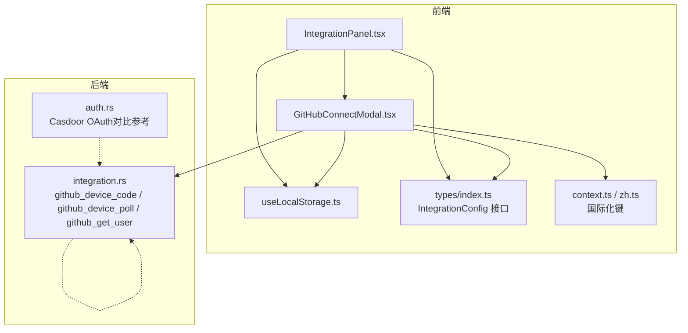
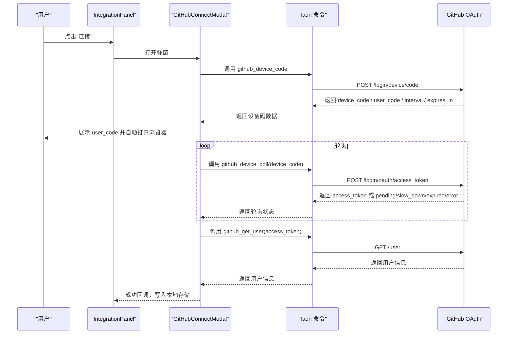
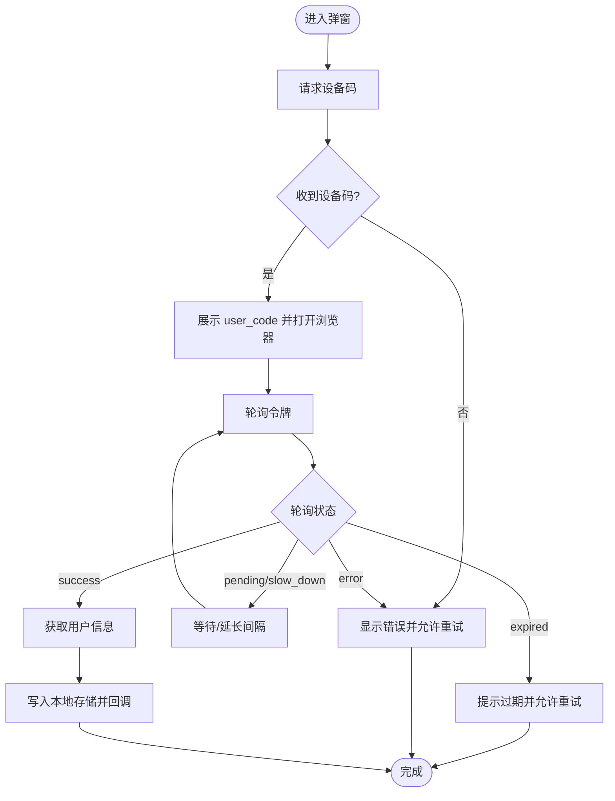
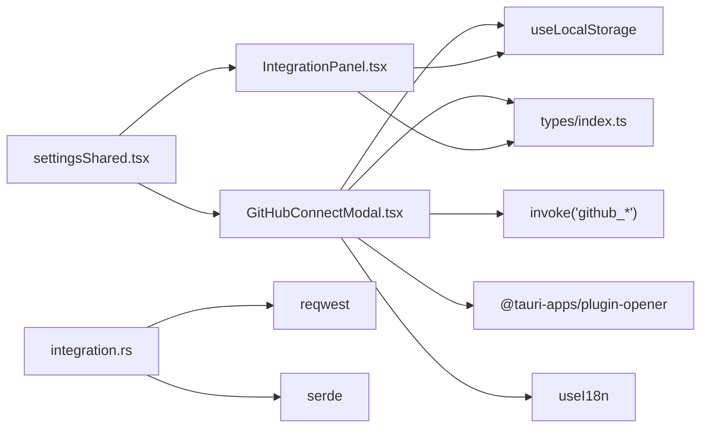

# 集成设置

<cite>
**本文引用的文件**
- [IntegrationPanel.tsx](file://src/components/settings/IntegrationPanel.tsx)
- [GitHubConnectModal.tsx](file://src/components/settings/GitHubConnectModal.tsx)
- [integration.rs](file://src-tauri/src/integration.rs)
- [types/index.ts](file://src/types/index.ts)
- [useAuth.tsx](file://src/hooks/useAuth.tsx)
- [auth.rs](file://src-tauri/src/auth.rs)
- [settingsShared.tsx](file://src/components/settings/settingsShared.tsx)
- [useLocalStorage.ts](file://src/hooks/useLocalStorage.ts)
- [context.ts](file://src/i18n/context.ts)
- [zh.ts](file://src/i18n/locales/zh.ts)
</cite>

## 目录
1. [简介](#简介)
2. [项目结构](#项目结构)
3. [核心组件](#核心组件)
4. [架构总览](#架构总览)
5. [详细组件分析](#详细组件分析)
6. [依赖关系分析](#依赖关系分析)
7. [性能考量](#性能考量)
8. [故障排除指南](#故障排除指南)
9. [结论](#结论)
10. [附录](#附录)

## 简介
本文件面向 RabbitCoding 的“集成设置”模块，聚焦第三方服务的集成配置与运行机制，当前主要支持 GitHub 的 OAuth Device Flow 连接。文档将从架构、组件职责、数据流、安全机制、权限控制、错误处理与重试策略、最佳实践与故障排除等方面进行系统化说明，帮助开发者与运维人员正确配置与维护集成功能。

## 项目结构
集成设置模块由前端 React 组件与 Tauri Rust 命令两部分组成：
- 前端负责 UI 展示、交互与本地持久化；使用本地存储保存集成配置。
- 后端 Rust 命令封装与 GitHub 的 OAuth Device Flow 通信，负责设备码申请、轮询令牌、用户信息获取等。

图表来源
- [IntegrationPanel.tsx:25-135](file://src/components/settings/IntegrationPanel.tsx#L25-L135)
- [GitHubConnectModal.tsx:60-385](file://src/components/settings/GitHubConnectModal.tsx#L60-L385)
- [integration.rs:140-230](file://src-tauri/src/integration.rs#L140-L230)
- [types/index.ts:541-557](file://src/types/index.ts#L541-L557)
- [useLocalStorage.ts:3-25](file://src/hooks/useLocalStorage.ts#L3-L25)
- [context.ts:1-22](file://src/i18n/context.ts#L1-L22)
- [zh.ts:1-200](file://src/i18n/locales/zh.ts#L1-L200)

章节来源
- [IntegrationPanel.tsx:1-136](file://src/components/settings/IntegrationPanel.tsx#L1-L136)
- [GitHubConnectModal.tsx:1-386](file://src/components/settings/GitHubConnectModal.tsx#L1-L386)
- [integration.rs:1-231](file://src-tauri/src/integration.rs#L1-L231)
- [types/index.ts:535-557](file://src/types/index.ts#L535-L557)
- [useLocalStorage.ts:1-26](file://src/hooks/useLocalStorage.ts#L1-L26)
- [context.ts:1-22](file://src/i18n/context.ts#L1-L22)
- [zh.ts:1-200](file://src/i18n/locales/zh.ts#L1-L200)

## 核心组件
- 集成设置面板（IntegrationPanel）
  - 展示第三方服务卡片，当前支持 GitHub。
  - 通过本地存储读取/写入集成配置，提供连接/断开操作。
- GitHub 连接弹窗（GitHubConnectModal）
  - 实现 OAuth Device Flow 的完整流程：请求设备码、显示 user code、自动打开浏览器、轮询访问令牌、获取用户信息、成功回调。
  - 使用严格模式下的竞态防护与定时器清理，确保并发安全。
- Rust 集成命令（integration.rs）
  - 封装 GitHub 设备码申请、令牌轮询、用户信息获取的 HTTP 请求。
  - 统一响应结构与错误映射，便于前端状态机处理。
- 类型定义（types/index.ts）
  - 定义 IntegrationConfig 接口，统一集成配置的数据结构。
- 本地存储（useLocalStorage.ts）
  - 为集成配置提供持久化存储，避免刷新丢失。
- 国际化（context.ts / zh.ts）
  - 提供多语言文案，保证用户体验一致性。

章节来源
- [IntegrationPanel.tsx:25-135](file://src/components/settings/IntegrationPanel.tsx#L25-L135)
- [GitHubConnectModal.tsx:60-385](file://src/components/settings/GitHubConnectModal.tsx#L60-L385)
- [integration.rs:140-230](file://src-tauri/src/integration.rs#L140-L230)
- [types/index.ts:541-557](file://src/types/index.ts#L541-L557)
- [useLocalStorage.ts:3-25](file://src/hooks/useLocalStorage.ts#L3-L25)
- [context.ts:1-22](file://src/i18n/context.ts#L1-L22)
- [zh.ts:1-200](file://src/i18n/locales/zh.ts#L1-L200)

## 架构总览
集成设置采用“前端 UI + Tauri 命令 + 第三方 OAuth 平台”的三层协作架构：
- 前端负责用户交互与状态管理；
- Tauri 命令负责与 GitHub 的 OAuth Device Flow 通信；
- 第三方平台负责授权与令牌发放。

图表来源
- [GitHubConnectModal.tsx:197-232](file://src/components/settings/GitHubConnectModal.tsx#L197-L232)
- [integration.rs:140-230](file://src-tauri/src/integration.rs#L140-L230)

## 详细组件分析

### 组件一：IntegrationPanel（集成设置面板）
- 职责
  - 展示第三方服务卡片（当前为 GitHub）。
  - 读取本地存储中的集成配置，判断连接状态。
  - 提供“连接/断开”操作入口。
- 关键点
  - 使用本地存储键“integration-configs”，存储 IntegrationConfig 数组。
  - 连接成功后，旧的 GitHub 配置会被替换，确保同一 Provider 下唯一有效配置。
  - 断开连接前进行二次确认，避免误操作。

章节来源
- [IntegrationPanel.tsx:25-135](file://src/components/settings/IntegrationPanel.tsx#L25-L135)
- [types/index.ts:541-557](file://src/types/index.ts#L541-L557)
- [useLocalStorage.ts:3-25](file://src/hooks/useLocalStorage.ts#L3-L25)

### 组件二：GitHubConnectModal（GitHub 连接弹窗）
- 职责
  - 完整实现 OAuth Device Flow 的前端交互与状态机。
  - 与 Tauri 命令交互，完成设备码申请、轮询令牌、用户信息获取。
- 状态机与流程
  - requesting：请求设备码阶段。
  - awaiting/polling：等待用户在浏览器完成授权并轮询令牌。
  - success：获取到访问令牌并拉取用户信息后成功。
  - error：设备码过期、轮询错误或网络异常等导致失败。
- 竞态与清理
  - 使用多个 ref（定时器、设备码、间隔、过期时间、取消标志、成功标志）避免 StrictMode 双重执行带来的竞态。
  - 在组件卸载或关闭弹窗时清理所有定时器，防止内存泄漏与悬挂请求。
- 错误处理与重试
  - 对于“slow_down”状态，动态延长轮询间隔。
  - 对于“expired”状态，提示过期并允许重试。
  - 对于“error”状态，展示错误信息并提供重试按钮。
- 本地存储与回调
  - 成功后构造 IntegrationConfig，写入本地存储，并触发父组件回调关闭弹窗。

图表来源
- [GitHubConnectModal.tsx:96-195](file://src/components/settings/GitHubConnectModal.tsx#L96-L195)
- [integration.rs:165-212](file://src-tauri/src/integration.rs#L165-L212)

章节来源
- [GitHubConnectModal.tsx:60-385](file://src/components/settings/GitHubConnectModal.tsx#L60-L385)
- [integration.rs:140-230](file://src-tauri/src/integration.rs#L140-L230)
- [types/index.ts:541-557](file://src/types/index.ts#L541-L557)

### 组件三：integration.rs（Rust 集成命令）
- 职责
  - 封装与 GitHub 的 OAuth Device Flow 通信。
  - 提供三个命令：请求设备码、轮询令牌、获取用户信息。
- 安全与健壮性
  - 统一的 HTTP 客户端（带超时与 UA），避免阻塞。
  - 对响应进行严格解析与错误映射，返回前端友好的状态。
- 响应结构
  - 设备码响应：device_code、user_code、verification_uri、expires_in、interval。
  - 令牌轮询响应：status（success/pending/slow_down/expired/error）、access_token、error。
  - 用户信息响应：login、avatar_url、name（可选）。

章节来源
- [integration.rs:140-230](file://src-tauri/src/integration.rs#L140-L230)

### 组件四：类型与本地存储
- IntegrationConfig
  - 定义了集成配置的字段：provider、connected、accountName、avatarUrl、token、connectedAt 等。
- 本地存储
  - 使用 useLocalStorage 将配置持久化到 localStorage，键名为“integration-configs”。

章节来源
- [types/index.ts:541-557](file://src/types/index.ts#L541-L557)
- [useLocalStorage.ts:3-25](file://src/hooks/useLocalStorage.ts#L3-L25)

### 组件五：国际化与文案
- 国际化键
  - 面板标题、描述、按钮文案、设备码流程提示等均通过国际化键提供。
- 语言切换
  - 通过 I18nProvider 与 useI18n 钩子实现语言切换与文案解析。

章节来源
- [context.ts:1-22](file://src/i18n/context.ts#L1-L22)
- [zh.ts:1-200](file://src/i18n/locales/zh.ts#L1-L200)

## 依赖关系分析
- 前端组件依赖
  - IntegrationPanel 依赖 useLocalStorage 与 types 中的 IntegrationConfig。
  - GitHubConnectModal 依赖 invoke（Tauri 命令）、openUrl（tauri opener 插件）、useI18n、useLocalStorage、types。
- 后端命令依赖
  - integration.rs 依赖 reqwest HTTP 客户端与 serde 序列化。
- 间接依赖
  - settingsShared.tsx 提供通用的设置卡片与开关组件，被各设置面板复用。

图表来源
- [GitHubConnectModal.tsx:13-19](file://src/components/settings/GitHubConnectModal.tsx#L13-L19)
- [IntegrationPanel.tsx:8-14](file://src/components/settings/IntegrationPanel.tsx#L8-L14)
- [integration.rs:2-51](file://src-tauri/src/integration.rs#L2-L51)
- [settingsShared.tsx:1-67](file://src/components/settings/settingsShared.tsx#L1-L67)

章节来源
- [GitHubConnectModal.tsx:13-19](file://src/components/settings/GitHubConnectModal.tsx#L13-L19)
- [IntegrationPanel.tsx:8-14](file://src/components/settings/IntegrationPanel.tsx#L8-L14)
- [integration.rs:2-51](file://src-tauri/src/integration.rs#L2-L51)
- [settingsShared.tsx:1-67](file://src/components/settings/settingsShared.tsx#L1-L67)

## 性能考量
- 轮询策略
  - 初始轮询间隔来自设备码响应；当服务端提示“slow_down”时，线性延长轮询间隔，降低请求压力。
- 超时与重试
  - HTTP 客户端设置统一超时，避免长时间阻塞；轮询失败或异常时允许用户重试。
- UI 响应
  - 使用状态机与节流渲染，避免频繁重绘；在弹窗关闭或卸载时清理定时器，释放资源。

## 故障排除指南
- 设备码过期
  - 现象：弹窗提示过期。
  - 处理：重新发起连接流程，重新获取设备码并完成授权。
- 浏览器无法打开或回调异常
  - 现象：自动打开浏览器失败或回调未到达。
  - 处理：手动复制 user_code 并在浏览器中打开验证地址；检查系统默认浏览器与网络代理设置。
- 轮询停滞（pending/slow_down）
  - 现象：长时间处于“等待中”。
  - 处理：延长轮询间隔属正常行为；若长时间无进展，检查网络与防火墙设置。
- 访问令牌获取失败
  - 现象：轮询返回 error。
  - 处理：查看错误信息，确认网络连通性与 GitHub 服务状态；必要时重试。
- 断开连接无效
  - 现象：点击断开后仍显示已连接。
  - 处理：确认本地存储键“integration-configs”是否被正确更新；刷新页面后重试。

章节来源
- [GitHubConnectModal.tsx:163-195](file://src/components/settings/GitHubConnectModal.tsx#L163-L195)
- [integration.rs:192-212](file://src-tauri/src/integration.rs#L192-L212)

## 结论
集成设置模块通过清晰的前后端分工与严谨的状态机设计，实现了稳定可靠的第三方服务连接体验。当前以 GitHub OAuth Device Flow 为核心，具备完善的错误处理、重试与竞态防护机制。未来可在此基础上扩展更多第三方服务（如 GitLab、Bitbucket 等），复用现有架构与类型定义，快速实现标准化接入。

## 附录

### API 命令与数据结构
- 前端调用命令
  - github_device_code：申请设备码。
  - github_device_poll：轮询访问令牌。
  - github_get_user：获取用户信息。
- 响应结构
  - 设备码响应：device_code、user_code、verification_uri、expires_in、interval。
  - 令牌轮询响应：status、access_token、error。
  - 用户信息响应：login、avatar_url、name（可选）。

章节来源
- [integration.rs:140-230](file://src-tauri/src/integration.rs#L140-L230)

### 安全与权限控制
- OAuth Device Flow
  - 无需在客户端暴露密钥，令牌交换在后端完成，降低泄露风险。
- 本地存储
  - 集成配置（含访问令牌）存储于本地，建议配合系统锁屏/自动登出策略提升安全性。
- 国际化与提示
  - 所有关键提示（如过期、错误）均通过国际化键提供，确保用户可理解的反馈。

章节来源
- [GitHubConnectModal.tsx:101-108](file://src/components/settings/GitHubConnectModal.tsx#L101-L108)
- [integration.rs:44-107](file://src-tauri/src/integration.rs#L44-L107)

### 最佳实践
- 配置管理
  - 使用统一的 IntegrationConfig 接口与本地存储键，避免分散配置。
- 错误处理
  - 对“slow_down”、“expired”、“error”等状态分别处理，提供明确的用户指引与重试入口。
- 竞态防护
  - 在严格模式下，务必使用 ref 与清理逻辑，确保组件卸载时不会产生悬挂请求。
- 国际化
  - 所有用户可见文案纳入国际化键，便于多语言支持与一致性维护。

章节来源
- [types/index.ts:541-557](file://src/types/index.ts#L541-L557)
- [GitHubConnectModal.tsx:84-94](file://src/components/settings/GitHubConnectModal.tsx#L84-L94)
- [context.ts:1-22](file://src/i18n/context.ts#L1-L22)