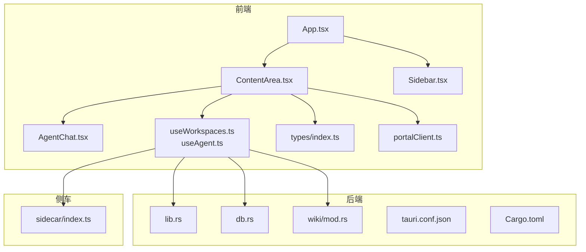
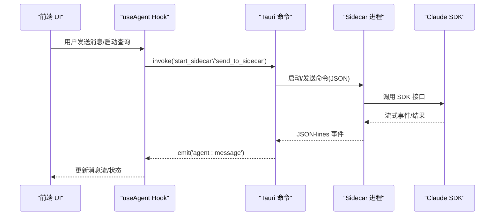
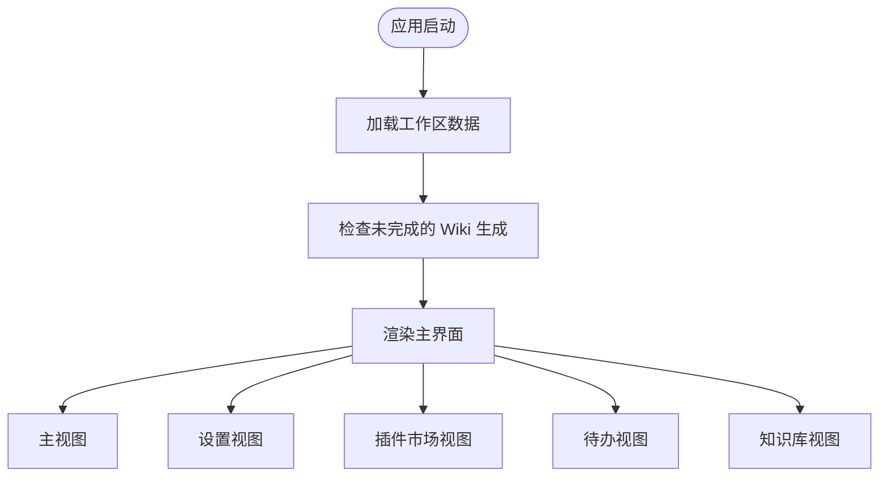
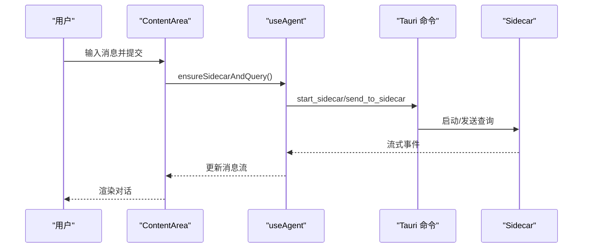
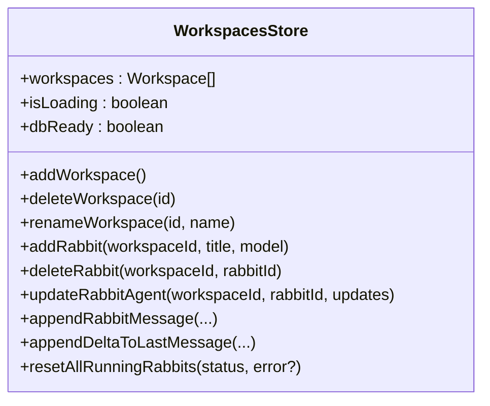
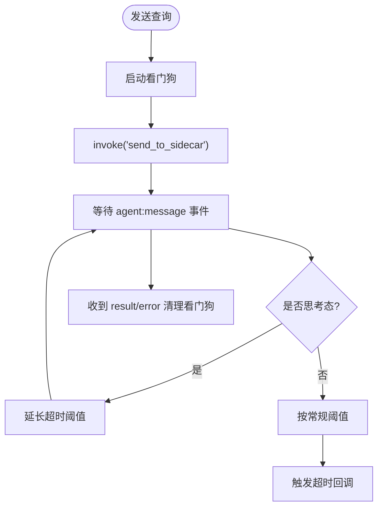
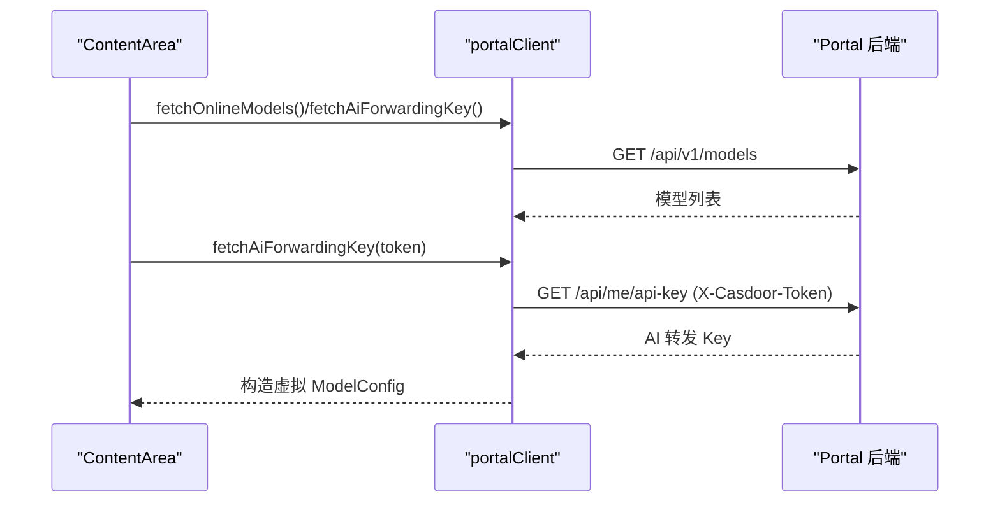
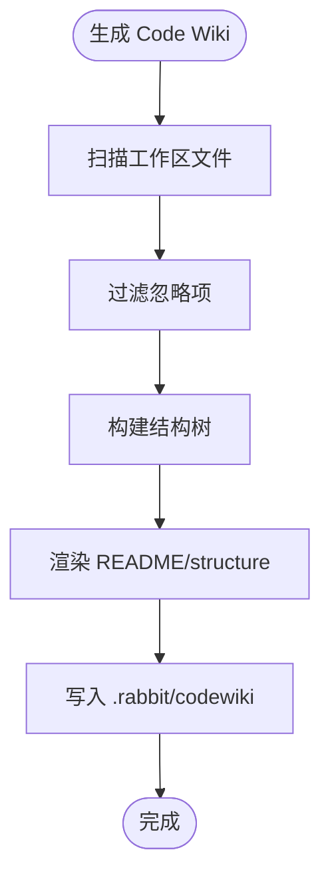
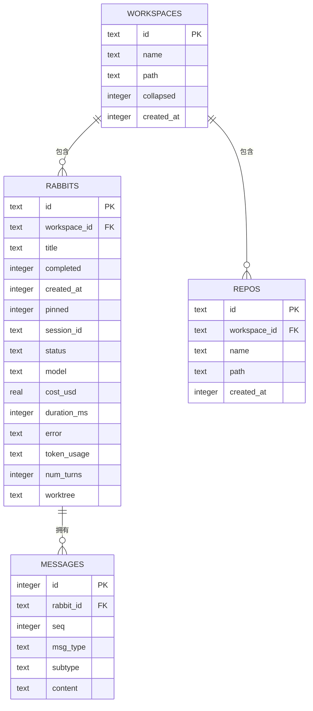
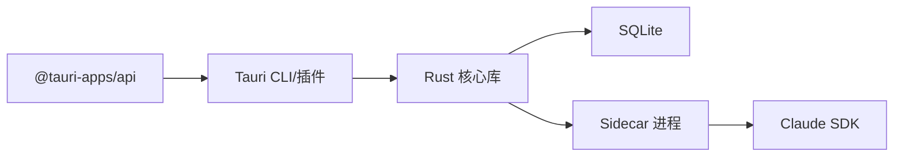

# Portal环境调试系统

<cite>
**本文档引用的文件**
- [README.md](file://README.md)
- [package.json](file://package.json)
- [src/main.tsx](file://src/main.tsx)
- [src/App.tsx](file://src/App.tsx)
- [src-tauri/Cargo.toml](file://src-tauri/Cargo.toml)
- [src-tauri/src/main.rs](file://src-tauri/src/main.rs)
- [src-tauri/src/lib.rs](file://src-tauri/src/lib.rs)
- [src-tauri/tauri.conf.json](file://src-tauri/tauri.conf.json)
- [src/hooks/useWorkspaces.ts](file://src/hooks/useWorkspaces.ts)
- [src/components/sidebar/Sidebar.tsx](file://src/components/sidebar/Sidebar.tsx)
- [src/components/ContentArea.tsx](file://src/components/ContentArea.tsx)
- [sidecar/src/index.ts](file://sidecar/src/index.ts)
- [src/hooks/useAgent.ts](file://src/hooks/useAgent.ts)
- [src/types/index.ts](file://src/types/index.ts)
- [src/utils/portalClient.ts](file://src/utils/portalClient.ts)
- [src/components/agent/AgentChat.tsx](file://src/components/agent/AgentChat.tsx)
- [src-tauri/src/db.rs](file://src-tauri/src/db.rs)
- [src-tauri/src/wiki/mod.rs](file://src-tauri/src/wiki/mod.rs)
</cite>

## 目录
1. [项目概述](#项目概述)
2. [项目结构](#项目结构)
3. [核心组件](#核心组件)
4. [架构总览](#架构总览)
5. [详细组件分析](#详细组件分析)
6. [依赖关系分析](#依赖关系分析)
7. [性能考虑](#性能考虑)
8. [故障排除指南](#故障排除指南)
9. [结论](#结论)

## 项目概述
本项目是一个基于 Tauri + React + TypeScript 的桌面应用，集成了 Claude Agent SDK 的侧车（sidecar）架构，支持工作区管理、智能体对话、代码库索引、知识库生成、模型配置与在线模型代理等功能。其核心特色包括：
- 通过 Rust 后端提供稳定的命令接口与数据持久化（SQLite）
- 通过 sidecar 与 Claude SDK 交互，实现流式对话与工具调用
- 支持工作区级别的知识库（Code Wiki）生成与引用
- 支持在线模型（Portal）代理与本地模型混合使用
- 提供宠物窗口（浮动装饰窗）与多窗口管理

## 项目结构
项目采用前后端分离的多模块组织方式：
- 前端（React + TypeScript）：位于 src/，包含 UI 组件、Hooks、类型定义、国际化与工具函数
- 后端（Rust + Tauri）：位于 src-tauri/，包含数据库、命令实现、插件与配置
- 侧车（Node.js）：位于 sidecar/，负责与 Claude SDK 的协议通信与消息分发
- 资源与构建：Vite 配置、图标资源、打包配置等

**图表来源**
- [src/App.tsx](file://src/App.tsx)
- [src/components/ContentArea.tsx](file://src/components/ContentArea.tsx)
- [src/components/sidebar/Sidebar.tsx](file://src/components/sidebar/Sidebar.tsx)
- [src/components/agent/AgentChat.tsx](file://src/components/agent/AgentChat.tsx)
- [src/hooks/useWorkspaces.ts](file://src/hooks/useWorkspaces.ts)
- [src/hooks/useAgent.ts](file://src/hooks/useAgent.ts)
- [src/types/index.ts](file://src/types/index.ts)
- [src/utils/portalClient.ts](file://src/utils/portalClient.ts)
- [src-tauri/src/lib.rs](file://src-tauri/src/lib.rs)
- [src-tauri/src/db.rs](file://src-tauri/src/db.rs)
- [src-tauri/src/wiki/mod.rs](file://src-tauri/src/wiki/mod.rs)
- [sidecar/src/index.ts](file://sidecar/src/index.ts)

**章节来源**
- [README.md](file://README.md)
- [package.json](file://package.json)
- [src-tauri/tauri.conf.json](file://src-tauri/tauri.conf.json)

## 核心组件
- 应用入口与视图管理：App.tsx 负责整体布局、主题同步、国际化与视图切换
- 内容区域：ContentArea.tsx 提供消息发送、模型选择、在线模型代理、工作区与仓库管理、Spec 生成与确认、工作树隔离等
- 工作区与状态：useWorkspaces.ts 提供工作区、兔子（任务）、仓库的数据管理与持久化（SQLite/本地存储）
- 侧车通信：useAgent.ts 封装与 sidecar 的命令发送与事件监听，包含看门狗超时机制
- Portal 代理：portalClient.ts 提供在线模型列表与 AI 转发 Key 获取，支持本地/生产环境切换
- 知识库生成：wiki/mod.rs 提供 AI 驱动的代码库结构与文档生成能力
- 数据库：db.rs 提供完整的 CRUD 与迁移逻辑，使用 SQLite 持久化

**章节来源**
- [src/App.tsx](file://src/App.tsx)
- [src/components/ContentArea.tsx](file://src/components/ContentArea.tsx)
- [src/hooks/useWorkspaces.ts](file://src/hooks/useWorkspaces.ts)
- [src/hooks/useAgent.ts](file://src/hooks/useAgent.ts)
- [src/utils/portalClient.ts](file://src/utils/portalClient.ts)
- [src-tauri/src/db.rs](file://src-tauri/src/db.rs)
- [src-tauri/src/wiki/mod.rs](file://src-tauri/src/wiki/mod.rs)

## 架构总览
系统采用“前端 React + 后端 Tauri(Rust) + 侧车 Node.js”的三层架构：
- 前端通过 Tauri 命令调用后端实现，同时监听后端发出的 Agent 事件
- 后端通过 sidecar 与 Claude SDK 通信，处理工具调用、流式消息与会话管理
- 侧车以 JSON-lines 协议接收前端指令，分发到具体处理器并输出事件

**图表来源**
- [src/hooks/useAgent.ts](file://src/hooks/useAgent.ts)
- [sidecar/src/index.ts](file://sidecar/src/index.ts)
- [src-tauri/src/lib.rs](file://src-tauri/src/lib.rs)

## 详细组件分析

### 应用入口与视图管理（App.tsx）
- 负责主题算法与暗色模式同步、国际化提供者、工作区加载与视图切换
- 冷启动检查未完成的 Wiki 生成任务并弹窗提醒
- 通过 Provider 注入工作区、智能体、认证、主题等上下文

**图表来源**
- [src/App.tsx](file://src/App.tsx)

**章节来源**
- [src/App.tsx](file://src/App.tsx)

### 内容区域（ContentArea.tsx）
- 负责消息发送、模型选择、在线模型代理、工作区与仓库管理、Spec 生成与确认、工作树隔离等
- 通过 ensureSidecarAndQuery 统一封装 sidecar 启动与配置变更检测
- 支持用户消息 inline 编辑（rewind + 重发）

**图表来源**
- [src/components/ContentArea.tsx](file://src/components/ContentArea.tsx)
- [src/hooks/useAgent.ts](file://src/hooks/useAgent.ts)
- [sidecar/src/index.ts](file://sidecar/src/index.ts)

**章节来源**
- [src/components/ContentArea.tsx](file://src/components/ContentArea.tsx)

### 工作区与状态管理（useWorkspaces.ts）
- 提供工作区、兔子、仓库的增删改查与持久化
- 支持 SQLite 与本地存储双轨降级策略
- 提供双层防抖保存与周期性强制保存，保障数据一致性

**图表来源**
- [src/hooks/useWorkspaces.ts](file://src/hooks/useWorkspaces.ts)
- [src/types/index.ts](file://src/types/index.ts)

**章节来源**
- [src/hooks/useWorkspaces.ts](file://src/hooks/useWorkspaces.ts)
- [src/types/index.ts](file://src/types/index.ts)

### 侧车通信（useAgent.ts）
- 封装 sidecar 启停、查询、取消、压缩、文件回滚等操作
- 内置看门狗机制：普通态 10 分钟、思考态 30 分钟超时
- 通过事件监听聚合消息流，支持流式文本与工具调用结果

**图表来源**
- [src/hooks/useAgent.ts](file://src/hooks/useAgent.ts)

**章节来源**
- [src/hooks/useAgent.ts](file://src/hooks/useAgent.ts)

### Portal 环境调试（portalClient.ts）
- 提供在线模型列表获取与 AI 转发 Key 获取
- 支持本地/生产环境切换，动态构建虚拟 ModelConfig
- 与 ContentArea 配合实现线上模型无缝接入

**图表来源**
- [src/utils/portalClient.ts](file://src/utils/portalClient.ts)
- [src/components/ContentArea.tsx](file://src/components/ContentArea.tsx)

**章节来源**
- [src/utils/portalClient.ts](file://src/utils/portalClient.ts)
- [src/components/ContentArea.tsx](file://src/components/ContentArea.tsx)

### 知识库生成（wiki/mod.rs）
- 提供 AI 驱动的代码库结构与文档生成
- 支持忽略列表、最大重试次数、连续失败熔断等机制
- 通过 Tauri 命令暴露给前端调用

**图表来源**
- [src-tauri/src/lib.rs](file://src-tauri/src/lib.rs)
- [src-tauri/src/wiki/mod.rs](file://src-tauri/src/wiki/mod.rs)

**章节来源**
- [src-tauri/src/lib.rs](file://src-tauri/src/lib.rs)
- [src-tauri/src/wiki/mod.rs](file://src-tauri/src/wiki/mod.rs)

### 数据库（db.rs）
- 使用 SQLite 持久化工作区、兔子、仓库与消息
- 提供建表、迁移、全量导入/导出与事务性保存
- 支持 token 用量与工作树信息序列化存储

**图表来源**
- [src-tauri/src/db.rs](file://src-tauri/src/db.rs)

**章节来源**
- [src-tauri/src/db.rs](file://src-tauri/src/db.rs)

## 依赖关系分析
- 前端依赖：@tauri-apps/api、antd、@monaco-editor/react、@xterm/* 等
- 后端依赖：tauri、rusqlite、tokio、reqwest、serde 等
- 侧车依赖：Node.js readline、JSON-lines 协议

**图表来源**
- [package.json](file://package.json)
- [src-tauri/Cargo.toml](file://src-tauri/Cargo.toml)
- [src-tauri/tauri.conf.json](file://src-tauri/tauri.conf.json)

**章节来源**
- [package.json](file://package.json)
- [src-tauri/Cargo.toml](file://src-tauri/Cargo.toml)
- [src-tauri/tauri.conf.json](file://src-tauri/tauri.conf.json)

## 性能考虑
- 数据持久化：SQLite 使用 WAL 模式与事务批量写入，减少磁盘 IO
- 侧车生命周期：按需启动/停止，配置变更时自动重启，避免重复启动成本
- 事件流：流式消息按类型合并，避免 UI 重绘压力
- 代理与模型指纹：代理与模型配置指纹用于快速判断是否需要重启 sidecar

## 故障排除指南
- 侧车启动失败：检查 API Key、代理配置与环境变量；查看 sidecar 日志
- 会话超时：若长时间无响应，检查网络与代理；思考态会自动延长超时
- 数据持久化异常：确认 SQLite 文件权限与路径；必要时回退到本地存储
- 在线模型 Key 获取失败：检查 Casdoor Token 是否有效；必要时重新登录

**章节来源**
- [src/hooks/useAgent.ts](file://src/hooks/useAgent.ts)
- [src-tauri/src/db.rs](file://src-tauri/src/db.rs)
- [src/utils/portalClient.ts](file://src/utils/portalClient.ts)

## 结论
本系统通过清晰的分层架构与完善的错误处理机制，实现了桌面端的智能体对话与代码库管理能力。前端提供丰富的交互体验，后端通过 Rust 提供稳定可靠的命令与数据持久化，侧车负责与 Claude SDK 的高效通信。结合 Portal 代理与本地模型，满足不同场景下的调试与开发需求。