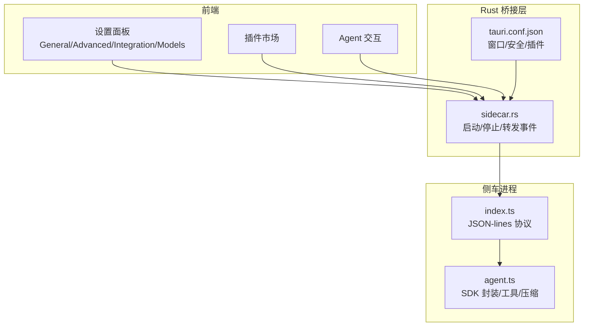
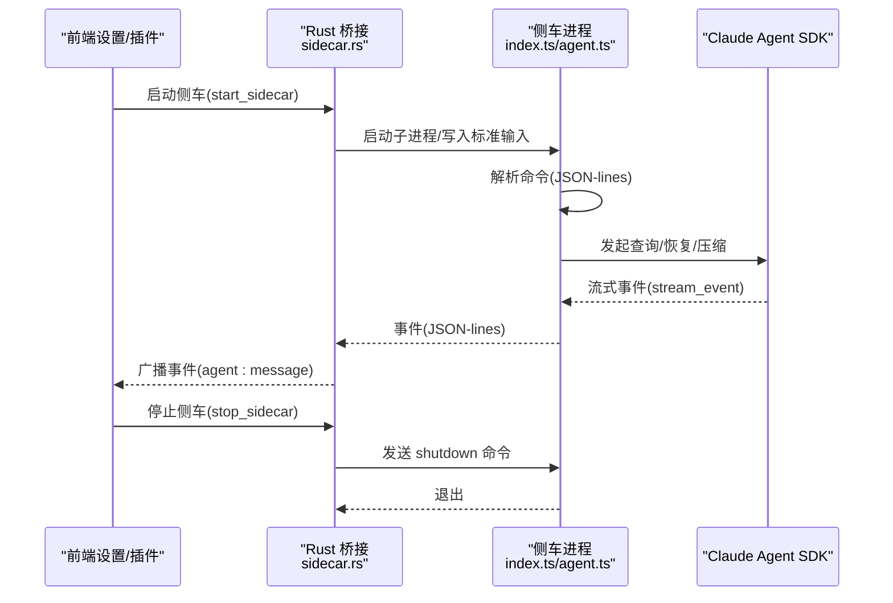
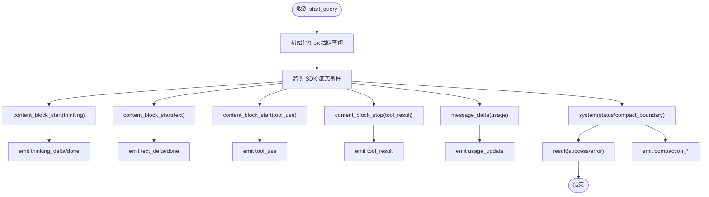
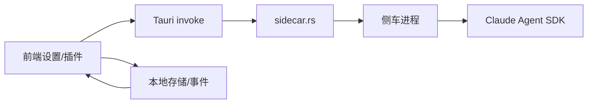

# 实验性功能

<cite>
**本文引用的文件**
- [src-tauri/src/main.rs](file://src-tauri/src/main.rs)
- [src-tauri/tauri.conf.json](file://src-tauri/tauri.conf.json)
- [src-tauri/src/sidecar.rs](file://src-tauri/src/sidecar.rs)
- [src-tauri/gen/schemas/desktop-schema.json](file://src-tauri/gen/schemas/desktop-schema.json)
- [src-tauri/gen/schemas/macOS-schema.json](file://src-tauri/gen/schemas/macOS-schema.json)
- [sidecar/src/index.ts](file://sidecar/src/index.ts)
- [sidecar/src/agent.ts](file://sidecar/src/agent.ts)
- [src/hooks/useAgent.ts](file://src/hooks/useAgent.ts)
- [src/hooks/usePlugins.ts](file://src/hooks/usePlugins.ts)
- [src/components/PluginMarketPage.tsx](file://src/components/PluginMarketPage.tsx)
- [src/components/settings/GeneralPanel.tsx](file://src/components/settings/GeneralPanel.tsx)
- [src/components/settings/AdvancedPanel.tsx](file://src/components/settings/AdvancedPanel.tsx)
- [src/components/settings/IntegrationPanel.tsx](file://src/components/settings/IntegrationPanel.tsx)
- [src/components/settings/ModelsPanel.tsx](file://src/components/settings/ModelsPanel.tsx)
- [src/components/files/searchEngine.ts](file://src/components/files/searchEngine.ts)
- [src/types/index.ts](file://src/types/index.ts)
- [src/i18n/locales/en.ts](file://src/i18n/locales/en.ts)
- [src/i18n/locales/zh.ts](file://src/i18n/locales/zh.ts)
</cite>

## 目录
1. [简介](#简介)
2. [项目结构](#项目结构)
3. [核心组件](#核心组件)
4. [架构总览](#架构总览)
5. [详细组件分析](#详细组件分析)
6. [依赖关系分析](#依赖关系分析)
7. [性能考量](#性能考量)
8. [故障排查指南](#故障排查指南)
9. [结论](#结论)
10. [附录](#附录)

## 简介
本文件面向 RabbitCoding 的“实验性功能”模块，系统化梳理其启用条件、测试范围、使用限制、具体作用、预期效果、潜在风险，并对比稳定版本差异、兼容性问题与回滚机制。同时给出使用场景、测试建议、反馈收集方式以及安全使用指南与风险评估方法，帮助开发者与测试用户在可控范围内验证新能力。

## 项目结构
围绕实验性功能的关键目录与文件如下：
- Tauri 应用入口与配置
  - 应用入口：[src-tauri/src/main.rs](file://src-tauri/src/main.rs)
  - 应用配置：[src-tauri/tauri.conf.json](file://src-tauri/tauri.conf.json)
- 侧车（Sidecar）进程与协议
  - 侧车入口与协议：[sidecar/src/index.ts](file://sidecar/src/index.ts)
  - 代理与工具链封装：[sidecar/src/agent.ts](file://sidecar/src/agent.ts)
  - Rust 侧桥接与事件转发：[src-tauri/src/sidecar.rs](file://src-tauri/src/sidecar.rs)
- 设置与插件生态
  - 通用设置面板（含隐私、通知、偏好等）：[src/components/settings/GeneralPanel.tsx](file://src/components/settings/GeneralPanel.tsx)
  - 高级网络代理设置：[src/components/settings/AdvancedPanel.tsx](file://src/components/settings/AdvancedPanel.tsx)
  - 集成设置（如 GitHub 连接）：[src/components/settings/IntegrationPanel.tsx](file://src/components/settings/IntegrationPanel.tsx)
  - 模型管理面板：[src/components/settings/ModelsPanel.tsx](file://src/components/settings/ModelsPanel.tsx)
  - 插件市场与安装卸载钩子：[src/components/PluginMarketPage.tsx](file://src/components/PluginMarketPage.tsx)，[src/hooks/usePlugins.ts](file://src/hooks/usePlugins.ts)
- 预览与国际化
  - 文件搜索与预览字段：[src/components/files/searchEngine.ts](file://src/components/files/searchEngine.ts)，[src/types/index.ts](file://src/types/index.ts)
  - 国际化文案（预览、Beta 等）：[src/i18n/locales/en.ts](file://src/i18n/locales/en.ts)，[src/i18n/locales/zh.ts](file://src/i18n/locales/zh.ts)

图表来源
- [src-tauri/src/sidecar.rs:60-214](file://src-tauri/src/sidecar.rs#L60-L214)
- [sidecar/src/index.ts:96-128](file://sidecar/src/index.ts#L96-L128)
- [sidecar/src/agent.ts:241-465](file://sidecar/src/agent.ts#L241-L465)
- [src-tauri/tauri.conf.json:1-66](file://src-tauri/tauri.conf.json#L1-L66)

章节来源
- [src-tauri/src/main.rs:1-7](file://src-tauri/src/main.rs#L1-L7)
- [src-tauri/tauri.conf.json:1-66](file://src-tauri/tauri.conf.json#L1-L66)

## 核心组件
- 侧车（Sidecar）进程：负责与 Claude Agent SDK 交互，提供流式增量输出、工具调用、会话压缩、AskUserQuestion 等能力；前端通过 Rust 桥接命令与其通信。
- Rust 桥接（sidecar.rs）：封装启动/停止/事件转发，将侧车 stdout 的 JSON-lines 事件广播至前端。
- 设置面板：提供通知、隐私、偏好、代理、集成、模型等配置项，部分实验性能力可通过插件与高级设置间接启用。
- 插件生态：支持 GitNexus、Context7、ECC 等插件的安装/卸载与状态管理，便于在受控环境中验证新特性。
- 预览能力：文件搜索与预览字段存在，配合国际化文案体现“预览”能力，可用于实验性界面/交互验证。

章节来源
- [src-tauri/src/sidecar.rs:60-214](file://src-tauri/src/sidecar.rs#L60-L214)
- [sidecar/src/index.ts:96-128](file://sidecar/src/index.ts#L96-L128)
- [sidecar/src/agent.ts:241-465](file://sidecar/src/agent.ts#L241-L465)
- [src/hooks/usePlugins.ts:1-194](file://src/hooks/usePlugins.ts#L1-L194)
- [src/components/PluginMarketPage.tsx:1-61](file://src/components/PluginMarketPage.tsx#L1-L61)
- [src/components/files/searchEngine.ts:1-180](file://src/components/files/searchEngine.ts#L1-L180)
- [src/i18n/locales/en.ts:130-350](file://src/i18n/locales/en.ts#L130-L350)

## 架构总览
下图展示实验性功能相关模块之间的交互关系，重点覆盖侧车生命周期、事件流、前端设置与插件控制面：

图表来源
- [src-tauri/src/sidecar.rs:60-214](file://src-tauri/src/sidecar.rs#L60-L214)
- [sidecar/src/index.ts:96-128](file://sidecar/src/index.ts#L96-L128)
- [sidecar/src/agent.ts:241-465](file://sidecar/src/agent.ts#L241-L465)

## 详细组件分析

### 侧车进程与协议（实验性能力载体）
- 启动/停止/事件转发：通过 Rust 命令启动/停止侧车，后台线程读取 stdout/stderr 并广播事件。
- JSON-lines 协议：stdin 接收命令，stdout 输出事件，stderr 输出日志，互不干扰。
- SDK 封装：对 SDK 的增量事件进行转换，补充 usage_update、thinking/text 流、tool_use/tool_result、压缩阶段与结果等事件。
- 特殊工具与模式：
  - AskUserQuestion：向前端发起问题，等待用户回答或超时。
  - 规划模式限制：spec 查询禁止 ExitPlanMode，必须先调用 WriteSpec 工具保存后再结束。
  - 会话压缩：通过 /compact prompt 触发 SDK 压缩，上报压缩阶段与结果。

图表来源
- [sidecar/src/agent.ts:146-398](file://sidecar/src/agent.ts#L146-L398)

章节来源
- [src-tauri/src/sidecar.rs:60-214](file://src-tauri/src/sidecar.rs#L60-L214)
- [sidecar/src/index.ts:96-128](file://sidecar/src/index.ts#L96-L128)
- [sidecar/src/agent.ts:241-465](file://sidecar/src/agent.ts#L241-L465)

### Rust 桥接（sidecar.rs）
- 启动侧车：构造子进程，注入环境变量，转发 stdout/stderr。
- 发送消息：将前端 JSON 命令写入侧车 stdin。
- 停止侧车：优先发送 shutdown，再强制终止，清理状态。
- 事件广播：将侧车 stdout 的每行 JSON 作为事件广播给前端。

章节来源
- [src-tauri/src/sidecar.rs:60-214](file://src-tauri/src/sidecar.rs#L60-L214)

### 设置面板与实验性开关
- 通用设置（GeneralPanel）：通知、主题、语言、偏好、隐私、缓存等。隐私与历史保存可视为实验性行为的边界条件（如 Telemetry）。
- 高级设置（AdvancedPanel）：网络代理配置，重启提示，影响实验性网络相关功能的稳定性。
- 集成设置（IntegrationPanel）：第三方服务连接（如 GitHub），可作为实验性工作流的一部分。
- 模型管理（ModelsPanel）：模型配置与测试，便于在实验性模型上线前进行连通性验证。

章节来源
- [src/components/settings/GeneralPanel.tsx:1-250](file://src/components/settings/GeneralPanel.tsx#L1-L250)
- [src/components/settings/AdvancedPanel.tsx:1-101](file://src/components/settings/AdvancedPanel.tsx#L1-L101)
- [src/components/settings/IntegrationPanel.tsx:1-136](file://src/components/settings/IntegrationPanel.tsx#L1-L136)
- [src/components/settings/ModelsPanel.tsx:1-148](file://src/components/settings/ModelsPanel.tsx#L1-L148)

### 插件生态与实验性扩展
- 插件 ID：gitnexus、context7、ecc。
- 安装/卸载：通过 invoke 调用 Rust 命令执行安装/卸载，前端维护状态与进度。
- 插件市场：统一入口展示与切换，便于在受控环境中验证新特性。
- 特定插件处理：例如 ecc 卸载后重置状态与消息；context7 通过过滤 MCP 配置移除。

章节来源
- [src/hooks/usePlugins.ts:1-194](file://src/hooks/usePlugins.ts#L1-L194)
- [src/components/PluginMarketPage.tsx:1-61](file://src/components/PluginMarketPage.tsx#L1-L61)

### 预览能力与国际化
- 预览字段：搜索引擎与类型定义中包含 preview 字段，用于文件内容预览。
- 国际化文案：包含“预览”、“文件过大不预览”等文案，体现实验性预览能力的边界提示。

章节来源
- [src/components/files/searchEngine.ts:1-180](file://src/components/files/searchEngine.ts#L1-L180)
- [src/types/index.ts:240-260](file://src/types/index.ts#L240-L260)
- [src/i18n/locales/en.ts:130-350](file://src/i18n/locales/en.ts#L130-L350)
- [src/i18n/locales/zh.ts:330-350](file://src/i18n/locales/zh.ts#L330-L350)

## 依赖关系分析
- 前端到 Rust 桥接：通过 Tauri invoke 调用 sidecar.rs 命令。
- Rust 桥接到侧车：通过子进程 stdin/stdout/stderr 通信。
- 侧车到 SDK：通过 @anthropic-ai/claude-agent-sdk 调用。
- 设置与插件：通过本地存储与事件驱动，影响实验性功能的启用与行为。

图表来源
- [src-tauri/src/sidecar.rs:60-214](file://src-tauri/src/sidecar.rs#L60-L214)
- [sidecar/src/index.ts:96-128](file://sidecar/src/index.ts#L96-L128)
- [sidecar/src/agent.ts:241-465](file://sidecar/src/agent.ts#L241-L465)

章节来源
- [src-tauri/src/sidecar.rs:60-214](file://src-tauri/src/sidecar.rs#L60-L214)
- [sidecar/src/index.ts:96-128](file://sidecar/src/index.ts#L96-L128)
- [sidecar/src/agent.ts:241-465](file://sidecar/src/agent.ts#L241-L465)

## 性能考量
- 流式增量输出：前端按事件实时渲染，避免一次性大块数据导致卡顿。
- 会话压缩：在长对话后触发压缩，降低上下文占用，提升后续响应速度。
- 工具调用：工具调用可能产生阻塞，需注意超时与取消机制。
- 代理与网络：高级代理设置可能影响外部访问延迟与稳定性，建议在实验环境中单独验证。

## 故障排查指南
- 侧车未启动/无事件
  - 检查 Rust 命令返回值与状态；查看 stderr 日志。
  - 确认前端已正确订阅 agent:message 事件。
- 事件丢失/乱序
  - 确保 stdout 是 JSON-lines，且每行完整。
  - 检查 Rust 侧 stdout/stderr 读取线程是否存活。
- 工具调用失败/超时
  - AskUserQuestion 会在 5 分钟后超时，检查前端是否及时回复。
  - 检查 allowedTools 与 permissionMode 配置。
- 会话压缩失败
  - 查看 compaction 阶段与错误信息，必要时重试或调整触发策略。
- 插件安装异常
  - 检查插件 ID 与对应命令；确认卸载流程是否清理干净。

章节来源
- [src-tauri/src/sidecar.rs:175-214](file://src-tauri/src/sidecar.rs#L175-L214)
- [sidecar/src/index.ts:96-128](file://sidecar/src/index.ts#L96-L128)
- [sidecar/src/agent.ts:500-573](file://sidecar/src/agent.ts#L500-L573)
- [src/hooks/usePlugins.ts:172-194](file://src/hooks/usePlugins.ts#L172-L194)

## 结论
RabbitCoding 的实验性功能主要依托侧车进程与 Claude Agent SDK 的深度集成，通过 Rust 桥接与前端事件系统形成闭环。设置面板与插件生态为实验性能力提供了可控的启用与验证通道。建议在独立测试环境与受限用户群体中逐步放开实验性功能，结合日志与事件监控完善回滚与风险控制机制。

## 附录

### 实验性功能启用条件与测试范围
- 启用条件
  - 通过设置面板开启相关功能（如通知、代理、模型测试等）。
  - 通过插件市场安装实验性插件（gitnexus/context7/ecc）。
  - 通过侧车命令触发实验性流程（如规划模式限制、压缩、AskUserQuestion）。
- 测试范围
  - 功能正确性：事件流、工具调用、压缩、取消。
  - 性能表现：长会话、高并发工具调用、内存占用。
  - 兼容性：不同平台（Windows/macOS）、不同模型与代理配置。

章节来源
- [src/components/settings/GeneralPanel.tsx:1-250](file://src/components/settings/GeneralPanel.tsx#L1-L250)
- [src/components/settings/AdvancedPanel.tsx:1-101](file://src/components/settings/AdvancedPanel.tsx#L1-L101)
- [src/components/settings/ModelsPanel.tsx:1-148](file://src/components/settings/ModelsPanel.tsx#L1-L148)
- [src/hooks/usePlugins.ts:1-194](file://src/hooks/usePlugins.ts#L1-L194)
- [sidecar/src/agent.ts:241-465](file://sidecar/src/agent.ts#L241-L465)

### 预览功能使用限制
- 文件大小限制：超过一定阈值（如 1MB）不进行预览，避免性能问题。
- 预览字段：搜索与类型定义中包含 preview 字段，用于前端展示摘要。

章节来源
- [src/components/files/searchEngine.ts:1-180](file://src/components/files/searchEngine.ts#L1-L180)
- [src/types/index.ts:240-260](file://src/types/index.ts#L240-L260)
- [src/i18n/locales/en.ts:130-350](file://src/i18n/locales/en.ts#L130-L350)

### 实验性功能与稳定版本差异
- 事件模型：实验性版本可能包含额外的 compaction、spec_written、ask_user_question 等事件。
- 工具策略：规划模式下对 ExitPlanMode 的限制属于实验性行为。
- 侧车协议：JSON-lines 协议保持稳定，但新增事件需前端适配。

章节来源
- [sidecar/src/agent.ts:84-135](file://sidecar/src/agent.ts#L84-L135)
- [sidecar/src/agent.ts:263-281](file://sidecar/src/agent.ts#L263-L281)

### 兼容性问题与回滚机制
- 兼容性
  - 平台差异：Windows/macOS 的窗口与权限配置不同，需分别验证。
  - 代理与网络：代理设置变化可能导致外部访问失败，需回退到默认配置。
- 回滚机制
  - 停止侧车：发送 shutdown 命令并强制终止，清理状态。
  - 卸载插件：调用对应卸载命令，清空状态与消息。
  - 还原设置：关闭通知、Telemetry、代理等实验性开关。

章节来源
- [src-tauri/src/sidecar.rs:245-270](file://src-tauri/src/sidecar.rs#L245-L270)
- [src/hooks/usePlugins.ts:172-194](file://src/hooks/usePlugins.ts#L172-L194)
- [src/components/settings/GeneralPanel.tsx:219-246](file://src/components/settings/GeneralPanel.tsx#L219-L246)

### 使用场景与测试建议
- 场景
  - 长对话与多轮工具调用验证。
  - 会话压缩对成本与性能的影响评估。
  - AskUserQuestion 的交互体验与超时处理。
- 建议
  - 分阶段启用：先在小范围用户中启用，逐步扩大。
  - 记录事件与日志：关注 usage_update、compaction_result、error 等关键事件。
  - 性能压测：模拟高并发工具调用与长会话。

章节来源
- [sidecar/src/agent.ts:146-398](file://sidecar/src/agent.ts#L146-L398)
- [src-tauri/src/sidecar.rs:175-214](file://src-tauri/src/sidecar.rs#L175-L214)

### 反馈收集方式
- 通知设置：通过设置面板打开系统通知设置，确保测试期间能接收关键事件。
- 日志与事件：关注 stderr 日志与前端事件流，定位问题根因。
- 插件与模型：在插件市场与模型面板中记录安装/卸载与测试结果。

章节来源
- [src/components/settings/GeneralPanel.tsx:186-199](file://src/components/settings/GeneralPanel.tsx#L186-L199)
- [src-tauri/src/sidecar.rs:196-208](file://src-tauri/src/sidecar.rs#L196-L208)
- [src/components/PluginMarketPage.tsx:1-61](file://src/components/PluginMarketPage.tsx#L1-L61)
- [src/components/settings/ModelsPanel.tsx:1-148](file://src/components/settings/ModelsPanel.tsx#L1-L148)

### 安全使用指南与风险评估
- 安全
  - 严格限制 allowedTools 与 permissionMode，避免危险工具被调用。
  - 使用独立工作空间与沙箱环境，避免影响主工作区。
- 风险评估
  - 工具调用失败：设计超时与重试策略，避免长时间阻塞。
  - 会话膨胀：定期触发压缩，控制上下文长度。
  - 插件不稳定：仅在实验性插件市场启用，避免默认开启。

章节来源
- [sidecar/src/agent.ts:254-303](file://sidecar/src/agent.ts#L254-L303)
- [src/hooks/usePlugins.ts:1-194](file://src/hooks/usePlugins.ts#L1-L194)