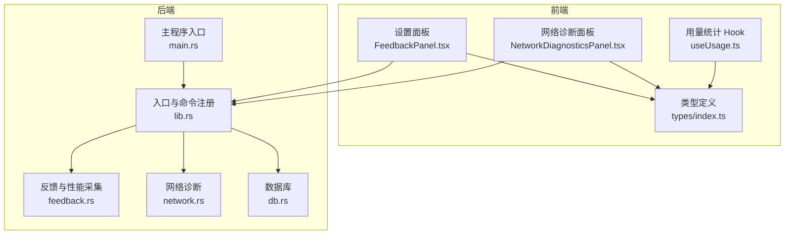
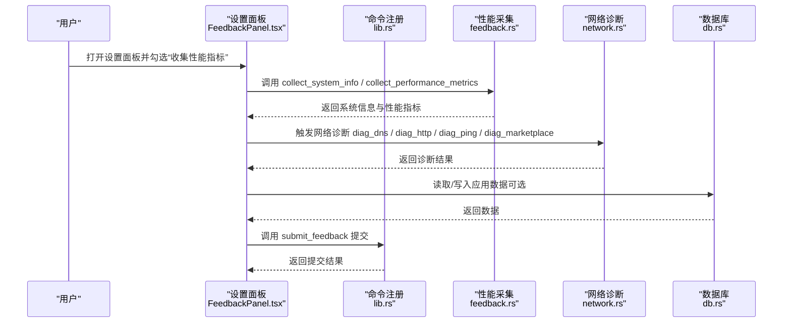
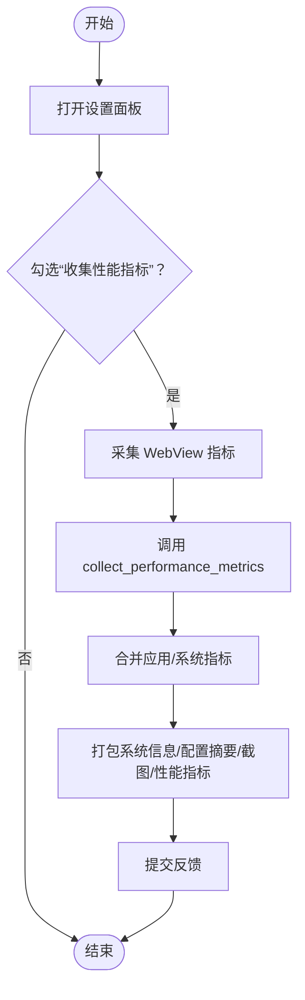
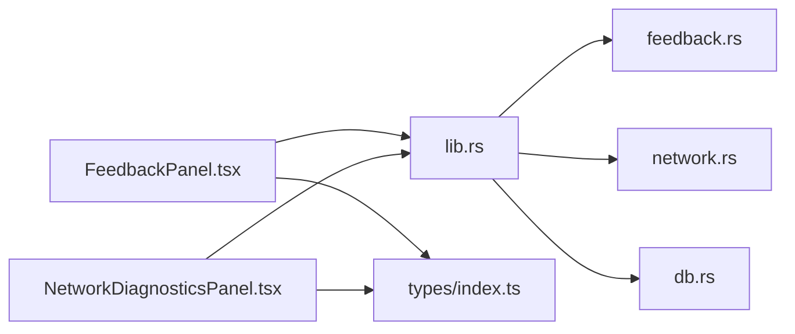
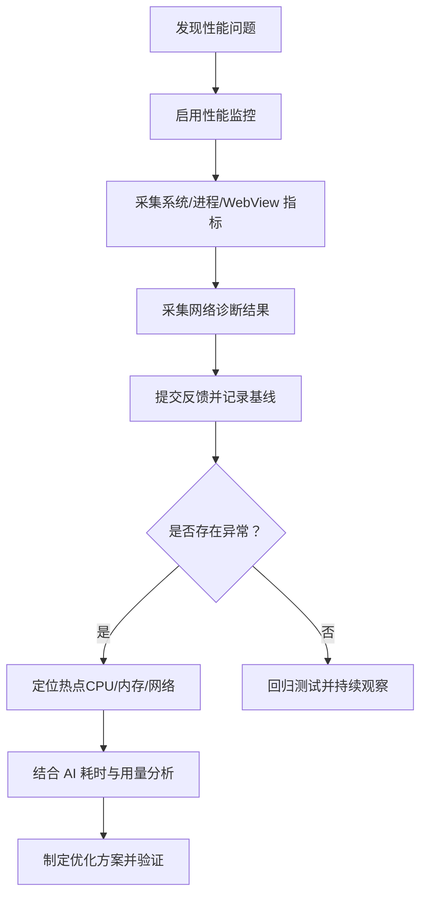

# 性能监控

<cite>
**本文引用的文件**
- [src-tauri/src/feedback.rs](file://src-tauri/src/feedback.rs)
- [src-tauri/src/lib.rs](file://src-tauri/src/lib.rs)
- [src-tauri/src/network.rs](file://src-tauri/src/network.rs)
- [src-tauri/src/db.rs](file://src-tauri/src/db.rs)
- [src/components/settings/FeedbackPanel.tsx](file://src/components/settings/FeedbackPanel.tsx)
- [src/components/settings/NetworkDiagnosticsPanel.tsx](file://src/components/settings/NetworkDiagnosticsPanel.tsx)
- [src/types/index.ts](file://src/types/index.ts)
- [src/hooks/useUsage.ts](file://src/hooks/useUsage.ts)
- [src-tauri/src/main.rs](file://src-tauri/src/main.rs)
</cite>

## 目录
1. [简介](#简介)
2. [项目结构](#项目结构)
3. [核心组件](#核心组件)
4. [架构总览](#架构总览)
5. [详细组件分析](#详细组件分析)
6. [依赖关系分析](#依赖关系分析)
7. [性能考量](#性能考量)
8. [故障排除指南](#故障排除指南)
9. [结论](#结论)
10. [附录](#附录)

## 简介
本指南面向 RabbitCoding 的性能监控能力，聚焦于如何启用与配置性能监控、理解监控指标的含义与来源、数据采集方式与影响、数据存储位置与隐私保护、基准线设定、异常告警与优化建议，以及数据分析与问题诊断流程。文档同时给出与代码实际对应的可视化图示，帮助开发者与运维人员快速落地。

## 项目结构
RabbitCoding 的性能监控主要分布在前端设置面板、Rust 后端命令与数据类型定义之间，形成“前端采集 + 后端采集 + 统一提交”的闭环。关键模块包括：
- 设置面板：性能分析开关、系统信息、配置摘要、截图上传、反馈提交
- Rust 后端：系统信息采集、性能指标采集、网络诊断、数据库存取
- 类型定义：前后端统一的数据结构与字段命名

图表来源
- [src/components/settings/FeedbackPanel.tsx](file://src/components/settings/FeedbackPanel.tsx)
- [src/components/settings/NetworkDiagnosticsPanel.tsx](file://src/components/settings/NetworkDiagnosticsPanel.tsx)
- [src-tauri/src/lib.rs](file://src-tauri/src/lib.rs)
- [src-tauri/src/feedback.rs](file://src-tauri/src/feedback.rs)
- [src-tauri/src/network.rs](file://src-tauri/src/network.rs)
- [src-tauri/src/db.rs](file://src-tauri/src/db.rs)
- [src-tauri/src/main.rs](file://src-tauri/src/main.rs)
- [src/types/index.ts](file://src/types/index.ts)
- [src/hooks/useUsage.ts](file://src/hooks/useUsage.ts)

章节来源
- [src-tauri/src/lib.rs](file://src-tauri/src/lib.rs)
- [src-tauri/src/feedback.rs](file://src-tauri/src/feedback.rs)
- [src-tauri/src/network.rs](file://src-tauri/src/network.rs)
- [src-tauri/src/db.rs](file://src-tauri/src/db.rs)
- [src/components/settings/FeedbackPanel.tsx](file://src/components/settings/FeedbackPanel.tsx)
- [src/components/settings/NetworkDiagnosticsPanel.tsx](file://src/components/settings/NetworkDiagnosticsPanel.tsx)
- [src/types/index.ts](file://src/types/index.ts)
- [src/hooks/useUsage.ts](file://src/hooks/useUsage.ts)
- [src-tauri/src/main.rs](file://src-tauri/src/main.rs)

## 核心组件
- 性能监控开关与采集
  - 前端设置面板提供“收集性能指标”开关，勾选后触发 WebView 指标采集与 Rust 进程指标采集，最终打包提交。
- 系统信息与配置摘要
  - 前端调用后端命令获取系统信息与配置摘要，用于问题定位与对比。
- 网络诊断
  - DNS、HTTP、Ping、Marketplace 等诊断结果，辅助评估网络链路质量。
- 数据存储
  - 应用数据通过 SQLite 存储，便于离线分析与历史对比。

章节来源
- [src/components/settings/FeedbackPanel.tsx](file://src/components/settings/FeedbackPanel.tsx)
- [src-tauri/src/feedback.rs](file://src-tauri/src/feedback.rs)
- [src-tauri/src/network.rs](file://src-tauri/src/network.rs)
- [src-tauri/src/db.rs](file://src-tauri/src/db.rs)

## 架构总览
性能监控的调用链路如下：前端设置面板触发采集，后端命令完成系统与进程指标采集，随后统一打包提交至服务端。

图表来源
- [src/components/settings/FeedbackPanel.tsx](file://src/components/settings/FeedbackPanel.tsx)
- [src-tauri/src/lib.rs](file://src-tauri/src/lib.rs)
- [src-tauri/src/feedback.rs](file://src-tauri/src/feedback.rs)
- [src-tauri/src/network.rs](file://src-tauri/src/network.rs)
- [src-tauri/src/db.rs](file://src-tauri/src/db.rs)

## 详细组件分析

### 性能监控指标与含义
- 应用内存占用（MB）
  - 含义：当前应用进程的物理内存占用
  - 来源：Rust 通过 sysinfo 获取当前进程内存
- 应用 CPU 占用（%）
  - 含义：当前应用进程的 CPU 使用率
  - 来源：Rust 通过 sysinfo 获取当前进程 CPU
- 系统内存使用率（%）
  - 含义：系统整体内存使用占比
  - 来源：Rust 通过 sysinfo 获取系统总内存与已用内存
- 系统 CPU 使用率（%）
  - 含义：系统整体 CPU 使用率（各核平均）
  - 来源：Rust 通过 sysinfo 计算各核使用率并取平均
- WebView 指标
  - DOM 元素数量、JS 堆内存（已用/总量）、DOM 完成时间
  - 来源：前端采集并传递给后端，后端合并到统一性能指标

章节来源
- [src-tauri/src/feedback.rs](file://src-tauri/src/feedback.rs)
- [src/types/index.ts](file://src/types/index.ts)
- [src/components/settings/FeedbackPanel.tsx](file://src/components/settings/FeedbackPanel.tsx)

### 数据采集方式
- 系统信息采集
  - 调用后端命令 collect_system_info，返回 OS、CPU、内存等基础信息
- 性能指标采集
  - 前端采集 WebView 指标，调用后端命令 collect_performance_metrics，合并应用进程指标与系统指标
- 网络诊断采集
  - 前端调用 diag_dns、diag_http、diag_ping、diag_marketplace，分别返回 DNS、HTTP、Ping、Marketplace 的诊断结果
- 数据库采集
  - 通过 db_load_all、db_save_all、db_has_data 等命令进行数据读写与存在性检查

章节来源
- [src-tauri/src/feedback.rs](file://src-tauri/src/feedback.rs)
- [src-tauri/src/network.rs](file://src-tauri/src/network.rs)
- [src-tauri/src/db.rs](file://src-tauri/src/db.rs)
- [src-tauri/src/lib.rs](file://src-tauri/src/lib.rs)

### AI 响应时间分析
- Token 用量与耗时
  - Rabbit 会话中包含 durationMs、tokenUsage 等字段，可用于分析单次交互的耗时与 Token 消耗
- 用量聚合
  - useUsage Hook 聚合多工作区的对话次数、轮次数、Token 用量、总耗时，便于趋势分析
- 分析建议
  - 结合性能指标（CPU/内存）与 AI 耗时，定位是否存在资源瓶颈导致响应变慢

章节来源
- [src/types/index.ts](file://src/types/index.ts)
- [src/hooks/useUsage.ts](file://src/hooks/useUsage.ts)

### 网络延迟测量
- DNS 解析时间
  - 返回 resolutionMs 与解析结果
- HTTP 请求耗时与状态
  - 返回 responseTimeMs、statusCode、httpVersion、tlsVersion、contentType、remoteIp
- Ping 丢包与 RTT
  - 返回 packetsSent/received、packetLossPercent、rtt_min/avg/max
- Marketplace 可达性
  - 返回 connectionOk、apiAvailable、responseTimeMs、status

章节来源
- [src-tauri/src/network.rs](file://src-tauri/src/network.rs)
- [src/components/settings/NetworkDiagnosticsPanel.tsx](file://src/components/settings/NetworkDiagnosticsPanel.tsx)
- [src/types/index.ts](file://src/types/index.ts)

### 内存使用监控
- 应用内存（MB）
  - 通过 Rust 获取当前进程内存并转换为 MB
- 系统内存使用率（%）
  - 通过 Rust 获取系统总内存与已用内存计算占比
- WebView JS 堆内存
  - 通过前端采集 JS Heap 已用/总量，反映前端侧内存压力

章节来源
- [src-tauri/src/feedback.rs](file://src-tauri/src/feedback.rs)
- [src/types/index.ts](file://src/types/index.ts)

### CPU 占用统计
- 应用 CPU（%）
  - 通过 Rust 获取当前进程 CPU 使用率
- 系统 CPU（%）
  - 通过 Rust 计算各核使用率并取平均，反映系统整体负载

章节来源
- [src-tauri/src/feedback.rs](file://src-tauri/src/feedback.rs)

### 性能监控启用流程
- 在设置面板勾选“收集性能指标”，前端将：
  - 采集 WebView 指标
  - 调用后端 collect_performance_metrics 合并应用与系统指标
  - 将系统信息、配置摘要、截图与性能指标打包提交

图表来源
- [src/components/settings/FeedbackPanel.tsx](file://src/components/settings/FeedbackPanel.tsx)
- [src-tauri/src/feedback.rs](file://src-tauri/src/feedback.rs)

## 依赖关系分析
- 前端到后端
  - 设置面板通过 invoke 调用后端命令，命令在 lib.rs 中集中注册
- 后端模块间
  - feedback.rs 提供系统信息与性能指标采集
  - network.rs 提供网络诊断
  - db.rs 提供应用数据的读写
- 类型一致性
  - 前后端通过 camelCase 字段名保持一致，减少映射成本

图表来源
- [src/components/settings/FeedbackPanel.tsx](file://src/components/settings/FeedbackPanel.tsx)
- [src/components/settings/NetworkDiagnosticsPanel.tsx](file://src/components/settings/NetworkDiagnosticsPanel.tsx)
- [src-tauri/src/lib.rs](file://src-tauri/src/lib.rs)
- [src-tauri/src/feedback.rs](file://src-tauri/src/feedback.rs)
- [src-tauri/src/network.rs](file://src-tauri/src/network.rs)
- [src-tauri/src/db.rs](file://src-tauri/src/db.rs)
- [src/types/index.ts](file://src/types/index.ts)

章节来源
- [src-tauri/src/lib.rs](file://src-tauri/src/lib.rs)
- [src-tauri/src/feedback.rs](file://src-tauri/src/feedback.rs)
- [src-tauri/src/network.rs](file://src-tauri/src/network.rs)
- [src-tauri/src/db.rs](file://src-tauri/src/db.rs)
- [src/components/settings/FeedbackPanel.tsx](file://src/components/settings/FeedbackPanel.tsx)
- [src/components/settings/NetworkDiagnosticsPanel.tsx](file://src/components/settings/NetworkDiagnosticsPanel.tsx)
- [src/types/index.ts](file://src/types/index.ts)

## 性能考量
- 采集开销
  - 性能指标采集涉及系统调用与进程查询，建议在问题复现场景下开启，避免长期常驻采集造成额外开销
- 网络诊断
  - DNS、HTTP、Ping 等诊断会发起外部请求，注意网络环境与防火墙策略
- 数据库读写
  - 大体量数据读写建议在后台任务中异步执行，避免阻塞主线程
- 前端渲染
  - WebView 指标采集需确保页面已渲染完成，避免 DOM 元素数与 JS Heap 数据不准确

[本节为通用指导，无需列出具体文件来源]

## 故障排除指南
- 性能指标为空
  - 检查是否正确勾选“收集性能指标”，确认前端已调用 collect_performance_metrics
  - 检查后端命令注册是否生效（lib.rs）
- 网络诊断失败
  - 检查代理配置与网络连通性，参考 NetworkDiagnosticsPanel 的错误提示
  - 确认系统工具（如 dig、nslookup、ping、curl）可用
- 提交失败
  - 查看提交返回的错误信息，确认服务端可达与凭据有效
- 数据库异常
  - 检查 db_load_all/db_save_all 的返回状态，必要时清理或重建数据库

章节来源
- [src-tauri/src/lib.rs](file://src-tauri/src/lib.rs)
- [src-tauri/src/feedback.rs](file://src-tauri/src/feedback.rs)
- [src-tauri/src/network.rs](file://src-tauri/src/network.rs)
- [src-tauri/src/db.rs](file://src-tauri/src/db.rs)
- [src/components/settings/NetworkDiagnosticsPanel.tsx](file://src/components/settings/NetworkDiagnosticsPanel.tsx)

## 结论
RabbitCoding 的性能监控以“前端采集 + 后端采集 + 统一提交”为核心设计，结合系统信息、性能指标与网络诊断，能够有效支撑问题定位与性能优化。建议在问题复现阶段启用监控，结合 AI 响应时间与用量统计进行综合分析，并建立基线与告警阈值以持续改进系统稳定性与用户体验。

[本节为总结性内容，无需列出具体文件来源]

## 附录

### 数据存储位置与隐私保护
- 数据存储位置
  - 应用数据通过 SQLite 存储，路径位于应用数据目录（由后端初始化时创建）
- 隐私保护
  - 配置摘要中代理信息已脱敏（仅暴露是否启用与类型），不包含具体代理地址
  - 提交内容包含系统信息、配置摘要、截图与性能指标，建议在提交前确认敏感信息

章节来源
- [src-tauri/src/db.rs](file://src-tauri/src/db.rs)
- [src-tauri/src/feedback.rs](file://src-tauri/src/feedback.rs)
- [src/types/index.ts](file://src/types/index.ts)

### 基准线与异常告警配置
- 基准线建议
  - 应用 CPU：单核峰值不超过 80%，多核平均不超过 60%
  - 应用内存：稳定在总内存的 20%-40% 之间
  - 系统 CPU：整体不超过 70%
  - 系统内存：使用率不超过 80%
  - WebView JS Heap：增长过快或峰值过高需关注
  - 网络延迟：Ping RTT 平均值不超过 100ms，丢包率接近 0
- 异常告警
  - 建议基于上述阈值在 CI/CD 或监控平台设置告警规则
  - 对 AI 响应时间异常（durationMs 突增）与 Token 用量异常（输入/输出比例异常）进行联动告警

[本节为通用指导，无需列出具体文件来源]

### 性能优化建议
- 资源优化
  - 控制 WebView DOM 元素数量，避免过度渲染
  - 降低 JS 堆内存峰值，及时释放大对象
- 网络优化
  - 优先使用直连或低延迟代理
  - 减少不必要的并发 HTTP 请求
- 数据库优化
  - 合理分页与索引，避免一次性加载大量数据
  - 异步批量写入，减少锁竞争

[本节为通用指导，无需列出具体文件来源]

### 性能数据分析方法
- 时间序列分析
  - 将 CPU、内存、网络延迟与 AI 耗时按时间序列对比，识别周期性波动与异常点
- 相关性分析
  - 分析前端 WebView 指标与后端性能指标的相关性，定位前端瓶颈
- 趋势分析
  - 结合 useUsage 的聚合数据，观察 Token 用量与耗时的长期趋势

章节来源
- [src/hooks/useUsage.ts](file://src/hooks/useUsage.ts)
- [src/types/index.ts](file://src/types/index.ts)

### 性能问题诊断流程

[本图为概念流程，无需列出具体文件来源]