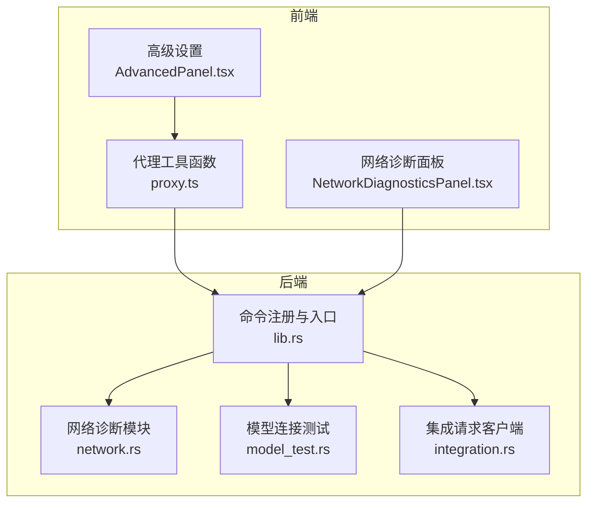
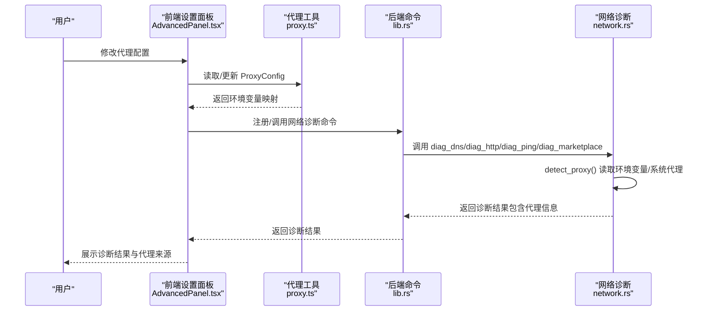
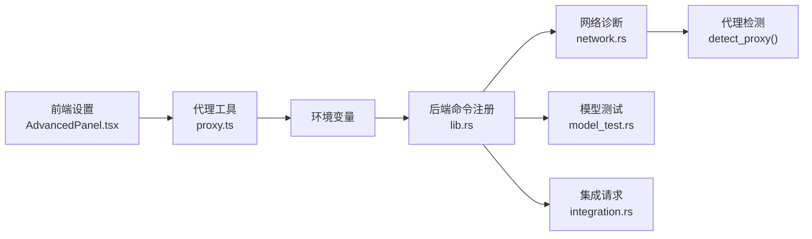

# 网络代理设置

<cite>
**本文引用的文件**
- [proxy.ts](file://src/utils/proxy.ts)
- [AdvancedPanel.tsx](file://src/components/settings/AdvancedPanel.tsx)
- [NetworkDiagnosticsPanel.tsx](file://src/components/settings/NetworkDiagnosticsPanel.tsx)
- [network.rs](file://src-tauri/src/network.rs)
- [lib.rs](file://src-tauri/src/lib.rs)
- [index.ts](file://src/types/index.ts)
- [en.ts](file://src/i18n/locales/en.ts)
- [ModelsPanel.tsx](file://src/components/settings/ModelsPanel.tsx)
- [useModelTest.ts](file://src/hooks/useModelTest.ts)
- [model_test.rs](file://src-tauri/src/model_test.rs)
- [integration.rs](file://src-tauri/src/integration.rs)
</cite>

## 目录
1. [简介](#简介)
2. [项目结构](#项目结构)
3. [核心组件](#核心组件)
4. [架构总览](#架构总览)
5. [详细组件分析](#详细组件分析)
6. [依赖关系分析](#依赖关系分析)
7. [性能考量](#性能考量)
8. [故障排除指南](#故障排除指南)
9. [结论](#结论)
10. [附录](#附录)

## 简介
本文件面向 RabbitCoding 的网络代理设置，系统化说明如何配置 HTTP、HTTPS、SOCKS 代理，如何设置 no_proxy 白名单，以及代理链路与优先级规则。同时阐述代理设置对 AI 服务连接、文件下载、网络诊断的影响，并提供常见代理服务商的配置示例、故障排除指南与性能优化建议，最后总结最佳实践与安全注意事项。

## 项目结构
RabbitCoding 的代理能力由前端设置界面与后端网络诊断/集成模块协同完成：
- 前端负责代理配置的输入与持久化，以及网络诊断面板的可视化展示。
- 后端负责代理检测、网络诊断（DNS、HTTP、Ping、Marketplace）、以及部分集成请求的 HTTP 客户端构建。

图表来源
- [AdvancedPanel.tsx:13-99](file://src/components/settings/AdvancedPanel.tsx#L13-L99)
- [NetworkDiagnosticsPanel.tsx:318-424](file://src/components/settings/NetworkDiagnosticsPanel.tsx#L318-L424)
- [proxy.ts:1-61](file://src/utils/proxy.ts#L1-L61)
- [network.rs:100-201](file://src-tauri/src/network.rs#L100-L201)
- [lib.rs:522-566](file://src-tauri/src/lib.rs#L522-L566)
- [model_test.rs:78-101](file://src-tauri/src/model_test.rs#L78-L101)
- [integration.rs:44-88](file://src-tauri/src/integration.rs#L44-L88)

章节来源
- [AdvancedPanel.tsx:13-99](file://src/components/settings/AdvancedPanel.tsx#L13-L99)
- [NetworkDiagnosticsPanel.tsx:318-424](file://src/components/settings/NetworkDiagnosticsPanel.tsx#L318-L424)
- [proxy.ts:1-61](file://src/utils/proxy.ts#L1-L61)
- [network.rs:100-201](file://src-tauri/src/network.rs#L100-L201)
- [lib.rs:522-566](file://src-tauri/src/lib.rs#L522-L566)

## 核心组件
- 代理配置数据结构与默认值：ProxyConfig，包含 enabled、httpProxy、httpsProxy、socksProxy、noProxy。
- 代理配置工具函数：默认值、环境变量转换、指纹生成。
- 高级设置面板：提供开关与输入框，支持 HTTP/HTTPS/SOCKS/no_proxy 配置。
- 网络诊断面板：并行执行 DNS、HTTP、Ping、Marketplace 诊断，展示代理使用情况。
- 后端代理检测：优先读取环境变量，其次读取系统代理（Windows netsh、macOS/Linux scutil）。
- 模型连接测试与集成请求：基于 reqwest 构建 HTTP 客户端，受系统代理影响。

章节来源
- [index.ts:520-532](file://src/types/index.ts#L520-L532)
- [proxy.ts:3-10](file://src/utils/proxy.ts#L3-L10)
- [proxy.ts:17-47](file://src/utils/proxy.ts#L17-L47)
- [proxy.ts:53-61](file://src/utils/proxy.ts#L53-L61)
- [AdvancedPanel.tsx:13-99](file://src/components/settings/AdvancedPanel.tsx#L13-L99)
- [NetworkDiagnosticsPanel.tsx:318-424](file://src/components/settings/NetworkDiagnosticsPanel.tsx#L318-L424)
- [network.rs:100-201](file://src-tauri/src/network.rs#L100-L201)
- [model_test.rs:78-101](file://src-tauri/src/model_test.rs#L78-L101)
- [integration.rs:44-88](file://src-tauri/src/integration.rs#L44-L88)

## 架构总览
代理配置在前端持久化为 ProxyConfig，后端通过环境变量注入影响网络行为。网络诊断模块在执行时检测当前生效的代理来源（环境变量或系统代理），并将该信息随诊断结果返回前端展示。

图表来源
- [AdvancedPanel.tsx:13-99](file://src/components/settings/AdvancedPanel.tsx#L13-L99)
- [proxy.ts:17-47](file://src/utils/proxy.ts#L17-L47)
- [lib.rs:522-566](file://src-tauri/src/lib.rs#L522-L566)
- [network.rs:100-201](file://src-tauri/src/network.rs#L100-L201)
- [NetworkDiagnosticsPanel.tsx:353-370](file://src/components/settings/NetworkDiagnosticsPanel.tsx#L353-L370)

## 详细组件分析

### 代理配置数据结构与默认值
- ProxyConfig 字段
  - enabled：是否启用代理
  - httpProxy：HTTP 代理地址，如 http://127.0.0.1:7890
  - httpsProxy：HTTPS 代理地址，如 http://127.0.0.1:7890
  - socksProxy：SOCKS 代理地址，如 socks5://127.0.0.1:1080
  - noProxy：不走代理的主机白名单，逗号分隔
- 默认值：未启用，HTTP/HTTPS/SOCKS 置空，noProxy 默认包含 localhost、127.0.0.1

章节来源
- [index.ts:520-532](file://src/types/index.ts#L520-L532)
- [proxy.ts:3-10](file://src/utils/proxy.ts#L3-L10)

### 代理配置工具函数
- proxyConfigToEnvVars
  - 仅在 enabled 为真且对应字段非空时生成环境变量
  - 同时设置大写与小写变量，保证兼容性
  - HTTP/HTTPS 分别映射到 HTTP_PROXY/http_proxy、HTTPS_PROXY/https_proxy
  - SOCKS 映射到 ALL_PROXY/all_proxy
  - noProxy 映射到 NO_PROXY/no_proxy
- proxyConfigFingerprint
  - 生成配置指纹，用于检测配置变更

章节来源
- [proxy.ts:17-47](file://src/utils/proxy.ts#L17-L47)
- [proxy.ts:53-61](file://src/utils/proxy.ts#L53-L61)

### 高级设置面板（代理配置入口）
- 提供开关与输入框，分别对应 ProxyConfig 的 enabled、httpProxy、httpsProxy、socksProxy、noProxy
- 输入框占位符给出典型地址格式
- 开启代理后，建议重启应用以确保新代理生效

章节来源
- [AdvancedPanel.tsx:13-99](file://src/components/settings/AdvancedPanel.tsx#L13-L99)

### 网络诊断面板（代理影响可视化）
- 并行执行 DNS、HTTP、Ping、Marketplace 诊断
- 每个诊断结果包含 ProxyInfo：enabled、source、address
- DNS/HTTP/Ping/MKP 结果中均展示当前生效代理来源与地址
- 诊断使用 curl（跨平台）进行探测，受系统代理影响

章节来源
- [NetworkDiagnosticsPanel.tsx:318-424](file://src/components/settings/NetworkDiagnosticsPanel.tsx#L318-L424)
- [network.rs:366-375](file://src-tauri/src/network.rs#L366-L375)
- [network.rs:538-550](file://src-tauri/src/network.rs#L538-L550)
- [network.rs:828-863](file://src-tauri/src/network.rs#L828-L863)

### 后端代理检测与系统代理读取
- detect_proxy 优先检查环境变量（HTTP_PROXY、HTTPS_PROXY、http_proxy、https_proxy、ALL_PROXY、all_proxy）
- Windows：通过 netsh winhttp show proxy 读取系统代理
- macOS/Linux：通过 scutil --proxy 读取系统代理（HTTPEnable/HTTPSEnable: 1 时启用）

章节来源
- [network.rs:100-201](file://src-tauri/src/network.rs#L100-L201)

### 模型连接测试与集成请求的代理影响
- 模型连接测试：基于 reqwest 构建 HTTP 客户端，默认超时与 UA，受系统代理影响
- 集成请求：基于 reqwest 构建 HTTP 客户端，支持 POST/GET 带认证，受系统代理影响

章节来源
- [model_test.rs:78-101](file://src-tauri/src/model_test.rs#L78-L101)
- [integration.rs:44-88](file://src-tauri/src/integration.rs#L44-L88)

## 依赖关系分析
- 前端设置依赖代理工具函数生成环境变量映射
- 网络诊断命令依赖后端 detect_proxy 获取当前生效代理
- 模型连接测试与集成请求依赖系统代理（通过环境变量或系统代理读取）

图表来源
- [AdvancedPanel.tsx:13-99](file://src/components/settings/AdvancedPanel.tsx#L13-L99)
- [proxy.ts:17-47](file://src/utils/proxy.ts#L17-L47)
- [lib.rs:522-566](file://src-tauri/src/lib.rs#L522-L566)
- [network.rs:100-201](file://src-tauri/src/network.rs#L100-L201)
- [model_test.rs:78-101](file://src-tauri/src/model_test.rs#L78-L101)
- [integration.rs:44-88](file://src-tauri/src/integration.rs#L44-L88)

章节来源
- [lib.rs:522-566](file://src-tauri/src/lib.rs#L522-L566)
- [network.rs:100-201](file://src-tauri/src/network.rs#L100-L201)

## 性能考量
- 诊断并发执行：DNS、HTTP、Marketplace 并行发起，Ping 作为最后一个收尾，减少等待时间
- 诊断超时控制：HTTP 诊断使用最大超时，避免长时间阻塞
- 代理检测成本低：仅读取环境变量与少量系统命令输出
- 代理生效时机：前端修改后建议重启应用，确保后续网络请求（模型测试、集成请求）使用新代理

章节来源
- [NetworkDiagnosticsPanel.tsx:352-370](file://src/components/settings/NetworkDiagnosticsPanel.tsx#L352-L370)
- [network.rs:391-410](file://src-tauri/src/network.rs#L391-L410)
- [AdvancedPanel.tsx:88-96](file://src/components/settings/AdvancedPanel.tsx#L88-L96)

## 故障排除指南
- 诊断结果显示“Direct”
  - 表示未检测到任何代理（环境变量与系统代理均为空）
  - 检查系统代理设置或手动配置前端代理
- 诊断结果显示“env:xxx”或“system:xxx”
  - 表示代理来源于环境变量或系统代理
  - 若期望使用 SOCKS，请确认 ALL_PROXY/all_proxy 已正确设置
- HTTP 诊断失败
  - 检查代理地址格式与端口
  - 确认 no_proxy 是否包含了目标域名
  - 查看 curl 输出的错误信息
- 模型连接测试失败
  - 确认 API Key、Base URL、模型 ID 均已正确填写
  - 检查代理是否允许访问目标 API 域名
- Marketplace 无法访问
  - 检查代理白名单与网络连通性
  - 观察响应时间与状态码

章节来源
- [NetworkDiagnosticsPanel.tsx:49-61](file://src/components/settings/NetworkDiagnosticsPanel.tsx#L49-L61)
- [network.rs:100-201](file://src-tauri/src/network.rs#L100-L201)
- [useModelTest.ts:35-70](file://src/hooks/useModelTest.ts#L35-L70)
- [model_test.rs:78-101](file://src-tauri/src/model_test.rs#L78-L101)

## 结论
RabbitCoding 的代理设置通过前端配置与后端代理检测相结合，实现了对网络诊断与后续网络请求（模型测试、集成请求）的统一影响。合理配置 HTTP/HTTPS/SOCKS 与 no_proxy 白名单，可有效提升网络连通性与安全性。建议在修改代理后重启应用，确保新配置生效，并结合网络诊断面板验证代理效果。

## 附录

### 代理配置方法与参数说明
- HTTP 代理
  - 地址格式：http://host:port
  - 示例：http://127.0.0.1:7890
- HTTPS 代理
  - 地址格式：http://host:port
  - 示例：http://127.0.0.1:7890
- SOCKS 代理
  - 地址格式：socks5://host:port
  - 示例：socks5://127.0.0.1:1080
- no_proxy 白名单
  - 格式：逗号分隔的主机或域名
  - 示例：localhost,127.0.0.1,*.example.com

章节来源
- [AdvancedPanel.tsx:37-86](file://src/components/settings/AdvancedPanel.tsx#L37-L86)
- [proxy.ts:17-47](file://src/utils/proxy.ts#L17-L47)

### 代理链路与优先级规则
- 优先级（后端检测顺序）
  1) 环境变量：HTTP_PROXY、HTTPS_PROXY、http_proxy、https_proxy、ALL_PROXY、all_proxy
  2) 系统代理：Windows netsh winhttp、macOS/Linux scutil
  3) 无代理
- 影响范围
  - 网络诊断：DNS、HTTP、Ping、Marketplace
  - 模型连接测试：基于 reqwest 的 HTTP 客户端
  - 集成请求：基于 reqwest 的 HTTP 客户端

章节来源
- [network.rs:100-201](file://src-tauri/src/network.rs#L100-L201)
- [model_test.rs:78-101](file://src-tauri/src/model_test.rs#L78-L101)
- [integration.rs:44-88](file://src-tauri/src/integration.rs#L44-L88)

### 代理设置对 AI 服务连接、文件下载、网络诊断的影响
- AI 服务连接（模型测试）
  - 受系统代理影响，需确保代理允许访问目标 API 域名
  - no_proxy 可用于排除内网或本地服务
- 文件下载与集成请求
  - 通过 reqwest 客户端发起，遵循系统代理策略
  - 建议在 no_proxy 中加入本地或内网域名
- 网络诊断
  - DNS/HTTP/Ping/MKP 诊断均会报告当前生效代理来源
  - 有助于定位代理配置问题

章节来源
- [useModelTest.ts:35-70](file://src/hooks/useModelTest.ts#L35-L70)
- [ModelsPanel.tsx:16-54](file://src/components/settings/ModelsPanel.tsx#L16-L54)
- [NetworkDiagnosticsPanel.tsx:318-424](file://src/components/settings/NetworkDiagnosticsPanel.tsx#L318-L424)

### 常见代理服务商配置示例
- Clash/Clash.Meta
  - HTTP/HTTPS：http://127.0.0.1:7890
  - SOCKS：socks5://127.0.0.1:1080
  - no_proxy：localhost,127.0.0.1,*.local
- Shadowsocks
  - HTTP/HTTPS：http://127.0.0.1:1080
  - SOCKS：socks5://127.0.0.1:1080
  - no_proxy：localhost,127.0.0.1,10.0.0.0/8
- V2Ray/Trojan
  - HTTP/HTTPS：http://127.0.0.1:1080
  - SOCKS：socks5://127.0.0.1:1080
  - no_proxy：localhost,127.0.0.1,192.168.0.0/16

章节来源
- [AdvancedPanel.tsx:37-86](file://src/components/settings/AdvancedPanel.tsx#L37-L86)

### 最佳实践与安全注意事项
- 最佳实践
  - 在 no_proxy 中明确列出内网与本地域名，避免不必要的代理转发
  - 优先使用 HTTPS 代理以增强加密通信
  - 对于 SOCKS 代理，确保端口与协议匹配（socks5）
  - 修改代理后重启应用，确保后续网络请求使用新配置
- 安全注意事项
  - 避免将敏感信息（如 API Key）暴露在代理日志中
  - 仅在可信代理环境下使用，防止中间人攻击
  - 定期检查代理白名单，防止意外流量泄露

章节来源
- [AdvancedPanel.tsx:88-96](file://src/components/settings/AdvancedPanel.tsx#L88-L96)
- [en.ts:557-606](file://src/i18n/locales/en.ts#L557-L606)