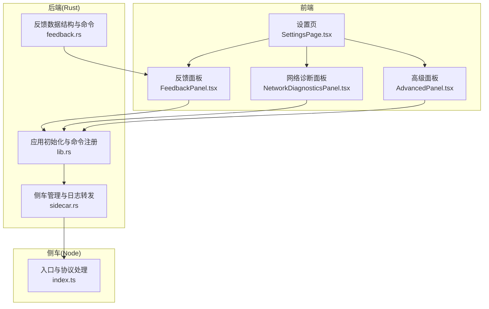
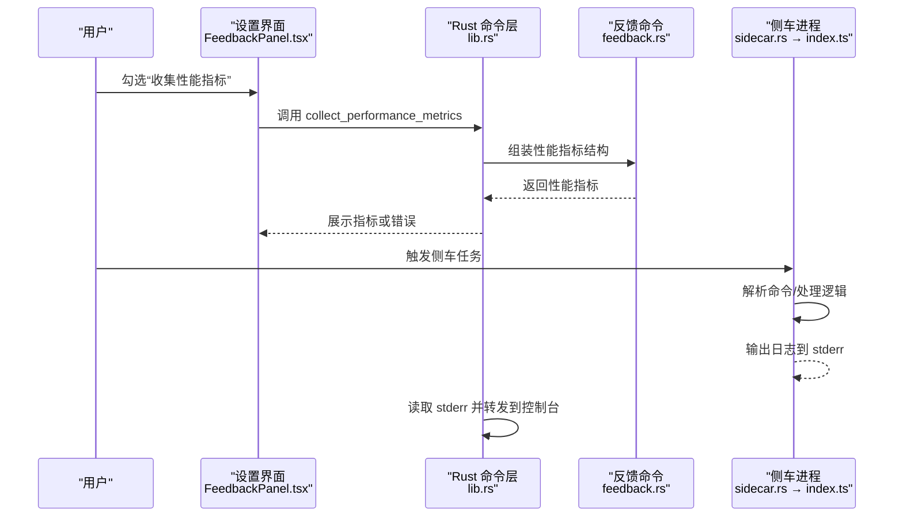
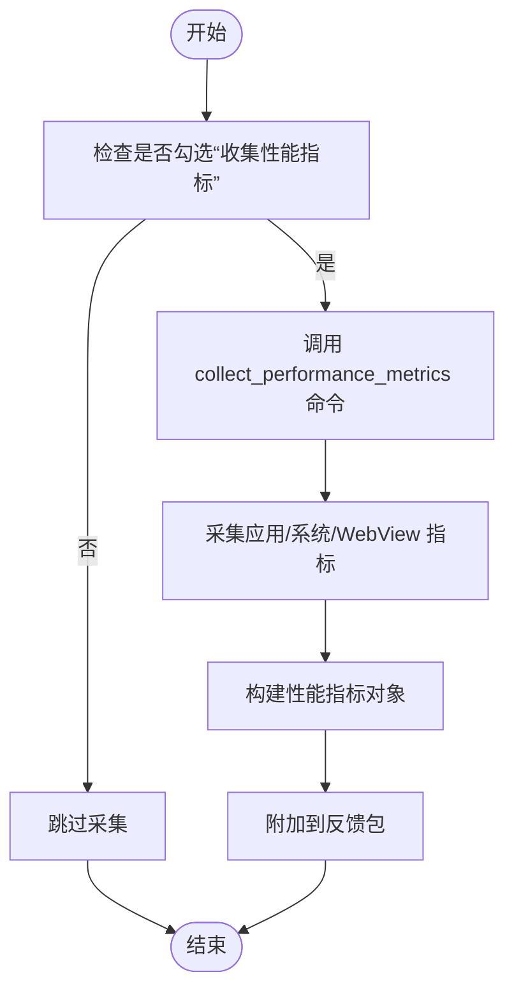
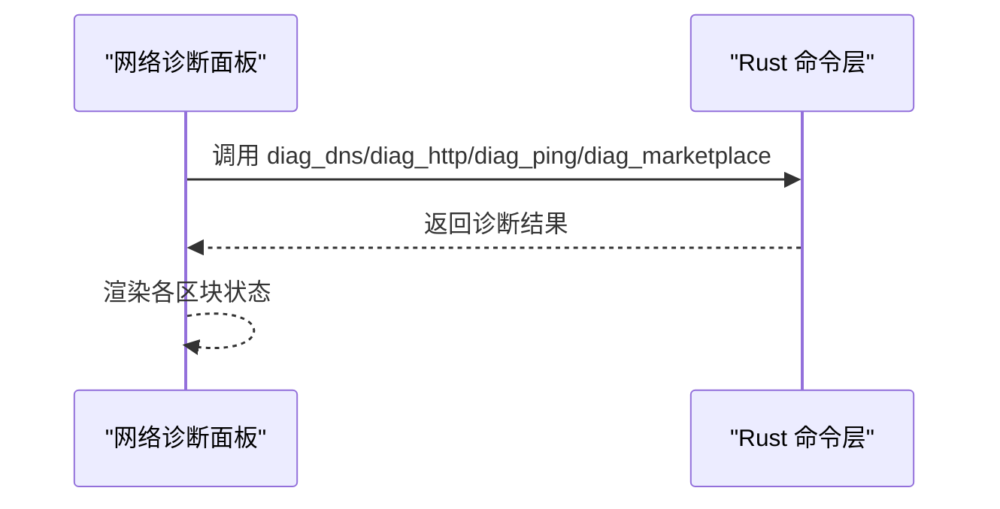
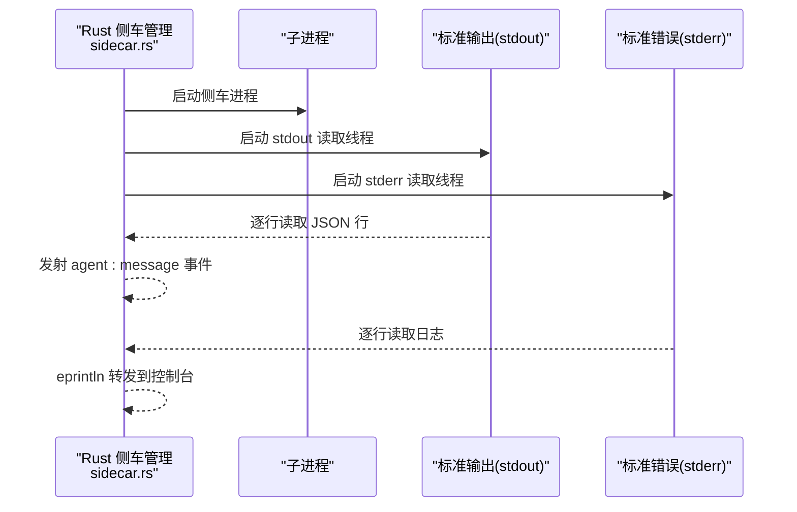
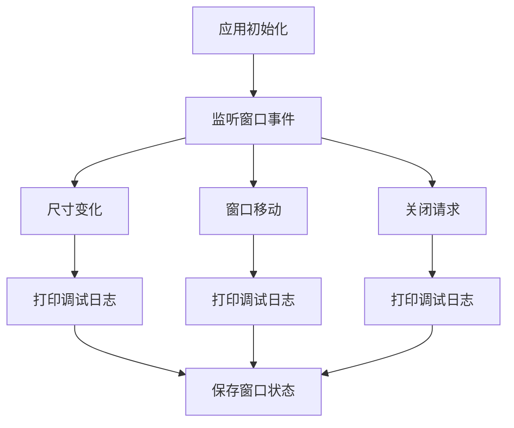
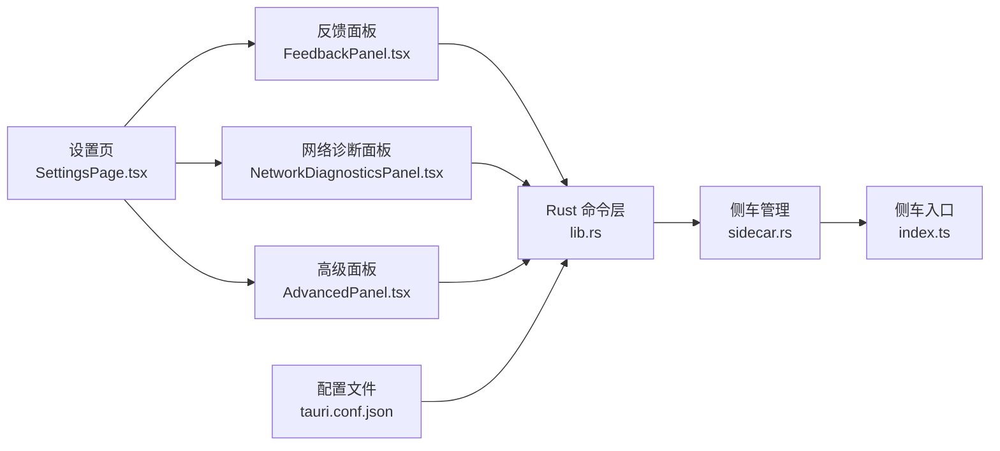

# 调试模式

<cite>
**本文引用的文件**
- [src-tauri/src/lib.rs](file://src-tauri/src/lib.rs)
- [src-tauri/src/sidecar.rs](file://src-tauri/src/sidecar.rs)
- [sidecar/src/index.ts](file://sidecar/src/index.ts)
- [src-tauri/src/feedback.rs](file://src-tauri/src/feedback.rs)
- [src/components/settings/FeedbackPanel.tsx](file://src/components/settings/FeedbackPanel.tsx)
- [src/components/settings/NetworkDiagnosticsPanel.tsx](file://src/components/settings/NetworkDiagnosticsPanel.tsx)
- [src/components/settings/AdvancedPanel.tsx](file://src/components/settings/AdvancedPanel.tsx)
- [src-tauri/tauri.conf.json](file://src-tauri/tauri.conf.json)
- [src/components/settings/SettingsPage.tsx](file://src/components/settings/SettingsPage.tsx)
- [src/i18n/locales/en.ts](file://src/i18n/locales/en.ts)
</cite>

## 目录
1. [简介](#简介)
2. [项目结构](#项目结构)
3. [核心组件](#核心组件)
4. [架构总览](#架构总览)
5. [详细组件分析](#详细组件分析)
6. [依赖关系分析](#依赖关系分析)
7. [性能考量](#性能考量)
8. [故障排查指南](#故障排查指南)
9. [结论](#结论)
10. [附录](#附录)

## 简介
本指南面向 RabbitCoding 的“调试模式”能力，系统讲解如何启用与使用调试相关的功能，包括：
- 如何在设置中开启与使用“性能分析”“网络诊断”等调试能力
- 调试信息的显示方式与日志来源
- 性能指标采集与展示
- 网络请求与连接诊断
- 调试模式对系统性能与内存的影响评估
- 常见调试场景与问题定位技巧
- 最佳实践与生产环境建议

需要特别说明：RabbitCoding 并未提供一个统一的“调试模式开关”。其调试能力以“功能模块”的形式提供，如“性能分析”“网络诊断”“问题反馈”等。这些功能在开发期默认可用，在生产构建中也保持可用，但默认不会自动开启高开销的采集。

## 项目结构
RabbitCoding 的调试相关能力主要分布在以下位置：
- 前端设置页：性能分析、网络诊断、问题反馈、高级代理设置
- 后端（Rust）：窗口事件日志、侧车（sidecar）日志、性能指标采集命令、网络诊断命令
- 侧车（Node）：标准输入/输出协议、错误与异常日志输出到标准错误流

图表来源
- [src/components/settings/SettingsPage.tsx:90-142](file://src/components/settings/SettingsPage.tsx#L90-L142)
- [src/components/settings/FeedbackPanel.tsx:1-469](file://src/components/settings/FeedbackPanel.tsx#L1-L469)
- [src/components/settings/NetworkDiagnosticsPanel.tsx:1-424](file://src/components/settings/NetworkDiagnosticsPanel.tsx#L1-L424)
- [src/components/settings/AdvancedPanel.tsx:1-101](file://src/components/settings/AdvancedPanel.tsx#L1-L101)
- [src-tauri/src/lib.rs:374-569](file://src-tauri/src/lib.rs#L374-L569)
- [src-tauri/src/sidecar.rs:59-214](file://src-tauri/src/sidecar.rs#L59-L214)
- [sidecar/src/index.ts:1-145](file://sidecar/src/index.ts#L1-L145)
- [src-tauri/src/feedback.rs:58-110](file://src-tauri/src/feedback.rs#L58-L110)

章节来源
- [src-tauri/src/lib.rs:374-569](file://src-tauri/src/lib.rs#L374-L569)
- [src-tauri/src/sidecar.rs:59-214](file://src-tauri/src/sidecar.rs#L59-L214)
- [sidecar/src/index.ts:1-145](file://sidecar/src/index.ts#L1-L145)
- [src/components/settings/SettingsPage.tsx:90-142](file://src/components/settings/SettingsPage.tsx#L90-L142)

## 核心组件
- 性能分析（Performance Analysis）
  - 前端：在“问题反馈”面板中提供“收集性能指标”的开关，勾选后在提交前自动采集并附加到反馈包
  - 后端：提供“收集性能指标”命令，采集应用内存/CPU、系统内存/CPU、WebView 指标
- 网络诊断（Network Diagnostics）
  - 前端：提供 DNS、HTTP、Ping、Marketplace 四项诊断，点击“开始诊断”并行执行，逐步展示结果
  - 后端：提供 diag_dns、diag_http、diag_ping、diag_marketplace 命令
- 侧车日志（Sidecar Logging）
  - 侧车进程通过标准错误输出调试日志，Rust 侧将其转发到控制台
  - 侧车入口记录关键生命周期事件（启动、关闭、未知命令、JSON 解析错误、未捕获异常/拒绝）
- 窗口事件日志（Window Event Logging）
  - Rust 初始化阶段监听窗口尺寸/移动/关闭事件，打印调试日志并持久化窗口状态
- 高级代理（Advanced Proxy）
  - 前端提供代理开关与配置，支持 HTTP/HTTPS/SOCKS 与 no_proxy，变更后提示需重启生效

章节来源
- [src/components/settings/FeedbackPanel.tsx:392-422](file://src/components/settings/FeedbackPanel.tsx#L392-L422)
- [src-tauri/src/feedback.rs:58-110](file://src-tauri/src/feedback.rs#L58-L110)
- [src/components/settings/NetworkDiagnosticsPanel.tsx:318-424](file://src/components/settings/NetworkDiagnosticsPanel.tsx#L318-L424)
- [src-tauri/src/lib.rs:463-507](file://src-tauri/src/lib.rs#L463-L507)
- [sidecar/src/index.ts:20-145](file://sidecar/src/index.ts#L20-L145)
- [src-tauri/src/sidecar.rs:196-208](file://src-tauri/src/sidecar.rs#L196-L208)
- [src/components/settings/AdvancedPanel.tsx:13-101](file://src/components/settings/AdvancedPanel.tsx#L13-L101)

## 架构总览
RabbitCoding 的调试能力由“前端设置界面 + 后端命令 + 侧车协议”构成，形成闭环的数据采集与展示链路。

图表来源
- [src/components/settings/FeedbackPanel.tsx:135-204](file://src/components/settings/FeedbackPanel.tsx#L135-L204)
- [src-tauri/src/feedback.rs:58-110](file://src-tauri/src/feedback.rs#L58-L110)
- [src-tauri/src/lib.rs:522-566](file://src-tauri/src/lib.rs#L522-L566)
- [src-tauri/src/sidecar.rs:196-208](file://src-tauri/src/sidecar.rs#L196-L208)
- [sidecar/src/index.ts:20-145](file://sidecar/src/index.ts#L20-L145)

## 详细组件分析

### 性能分析组件
- 功能要点
  - 前端在“问题反馈”面板提供“收集性能指标”开关，勾选后在提交时自动采集并附加
  - 后端提供性能指标结构体，包含应用内存/CPU、系统内存/CPU、WebView DOM/JS 堆/完成时间等
- 数据流
  - 前端调用 Rust 命令获取性能指标
  - 后端组装结构体并通过 IPC 返回前端
  - 前端将指标写入反馈包一并提交

图表来源
- [src/components/settings/FeedbackPanel.tsx:135-204](file://src/components/settings/FeedbackPanel.tsx#L135-L204)
- [src-tauri/src/feedback.rs:58-110](file://src-tauri/src/feedback.rs#L58-L110)

章节来源
- [src/components/settings/FeedbackPanel.tsx:392-422](file://src/components/settings/FeedbackPanel.tsx#L392-L422)
- [src-tauri/src/feedback.rs:58-110](file://src-tauri/src/feedback.rs#L58-L110)

### 网络诊断组件
- 功能要点
  - 前端提供 DNS、HTTP、Ping、Marketplace 四类诊断，点击“开始诊断”并行执行
  - 每类诊断独立状态机，支持加载/成功/失败/空闲
- 数据流
  - 前端触发四个诊断命令
  - 后端分别执行并返回结果
  - 前端逐步渲染各诊断区块

图表来源
- [src/components/settings/NetworkDiagnosticsPanel.tsx:318-424](file://src/components/settings/NetworkDiagnosticsPanel.tsx#L318-L424)
- [src-tauri/src/lib.rs:539-542](file://src-tauri/src/lib.rs#L539-L542)

章节来源
- [src/components/settings/NetworkDiagnosticsPanel.tsx:1-424](file://src/components/settings/NetworkDiagnosticsPanel.tsx#L1-L424)
- [src-tauri/src/lib.rs:539-542](file://src-tauri/src/lib.rs#L539-L542)

### 侧车日志与协议
- 功能要点
  - 侧车通过标准错误输出调试日志，Rust 侧读取并转发到控制台
  - 侧车入口记录启动、关闭、未知命令、JSON 解析错误、未捕获异常/拒绝等事件
  - 侧车与 Rust 之间通过 JSON-lines 协议通信
- 数据流
  - Rust 启动侧车，分别建立 stdout/stderr 线程
  - stdout 事件转发到前端事件通道
  - stderr 日志通过 eprintln 转发到控制台

图表来源
- [src-tauri/src/sidecar.rs:175-208](file://src-tauri/src/sidecar.rs#L175-L208)
- [sidecar/src/index.ts:96-128](file://sidecar/src/index.ts#L96-L128)

章节来源
- [sidecar/src/index.ts:20-145](file://sidecar/src/index.ts#L20-L145)
- [src-tauri/src/sidecar.rs:196-208](file://src-tauri/src/sidecar.rs#L196-L208)

### 窗口事件日志
- 功能要点
  - Rust 初始化阶段监听窗口尺寸变化、移动、关闭请求事件
  - 打印调试日志并持久化窗口状态
- 数据流
  - 监听事件 → 打印日志 → 保存窗口状态

图表来源
- [src-tauri/src/lib.rs:463-507](file://src-tauri/src/lib.rs#L463-L507)

章节来源
- [src-tauri/src/lib.rs:463-507](file://src-tauri/src/lib.rs#L463-L507)

### 高级代理设置
- 功能要点
  - 前端提供代理开关与配置项（HTTP/HTTPS/SOCKS/no_proxy）
  - 变更后提示需重启生效
- 数据流
  - 前端更新本地存储配置
  - 重启后生效（影响后续网络请求）

章节来源
- [src/components/settings/AdvancedPanel.tsx:13-101](file://src/components/settings/AdvancedPanel.tsx#L13-L101)

## 依赖关系分析
- 前端设置页聚合多个调试功能入口
- Rust 命令层注册并暴露调试相关命令
- 侧车进程作为外部子进程，通过标准 IO 与 Rust 交互
- 配置文件（tauri.conf.json）定义应用元信息与打包资源

图表来源
- [src/components/settings/SettingsPage.tsx:90-142](file://src/components/settings/SettingsPage.tsx#L90-L142)
- [src/components/settings/FeedbackPanel.tsx:1-469](file://src/components/settings/FeedbackPanel.tsx#L1-L469)
- [src/components/settings/NetworkDiagnosticsPanel.tsx:1-424](file://src/components/settings/NetworkDiagnosticsPanel.tsx#L1-L424)
- [src/components/settings/AdvancedPanel.tsx:1-101](file://src/components/settings/AdvancedPanel.tsx#L1-L101)
- [src-tauri/src/lib.rs:522-566](file://src-tauri/src/lib.rs#L522-L566)
- [src-tauri/src/sidecar.rs:59-214](file://src-tauri/src/sidecar.rs#L59-L214)
- [sidecar/src/index.ts:1-145](file://sidecar/src/index.ts#L1-L145)
- [src-tauri/tauri.conf.json:1-66](file://src-tauri/tauri.conf.json#L1-L66)

章节来源
- [src-tauri/tauri.conf.json:1-66](file://src-tauri/tauri.conf.json#L1-L66)
- [src-tauri/src/lib.rs:522-566](file://src-tauri/src/lib.rs#L522-L566)

## 性能考量
- 性能分析采集
  - 应用内存/CPU、系统内存/CPU、WebView DOM/JS 堆/完成时间等指标的采集属于轻量操作，通常对前台性能影响较小
  - 建议仅在问题复现时开启，避免长期运行带来轻微开销
- 网络诊断
  - DNS/HTTP/Ping/Marketplace 诊断为并行执行，可能产生网络请求与系统调用，短时内对网络与 CPU 有轻微压力
  - 建议在稳定网络环境下进行，避免在高峰期执行
- 侧车日志
  - 侧车日志输出到 stderr，Rust 侧每行读取并转发，属于低频 I/O，对性能影响可忽略
- 窗口事件日志
  - 窗口事件监听与状态持久化为高频但轻量操作，通常不影响整体性能

[本节为通用指导，不涉及具体文件分析]

## 故障排查指南
- 无法看到侧车日志
  - 确认侧车进程已启动（Rust 侧会打印启动与就绪日志）
  - 检查 stderr 读取线程是否正常运行
  - 若出现“未知命令类型”，检查前端发送的消息格式是否符合协议
- 性能指标未返回
  - 确认前端已勾选“收集性能指标”
  - 检查后端命令是否抛错（可在控制台查看错误日志）
- 网络诊断无结果
  - 确认网络连通性
  - 检查后端命令是否返回错误（DNS/HTTP/Ping/Marketplace）
- 代理设置无效
  - 确认代理配置已保存
  - 遵循“需重启生效”的提示，重新启动应用后再测试

章节来源
- [sidecar/src/index.ts:87-91](file://sidecar/src/index.ts#L87-L91)
- [src-tauri/src/sidecar.rs:196-208](file://src-tauri/src/sidecar.rs#L196-L208)
- [src/components/settings/FeedbackPanel.tsx:135-204](file://src/components/settings/FeedbackPanel.tsx#L135-L204)
- [src/components/settings/NetworkDiagnosticsPanel.tsx:318-424](file://src/components/settings/NetworkDiagnosticsPanel.tsx#L318-L424)
- [src/components/settings/AdvancedPanel.tsx:88-96](file://src/components/settings/AdvancedPanel.tsx#L88-L96)

## 结论
RabbitCoding 的调试能力以“功能模块”形式提供，覆盖性能分析、网络诊断、侧车日志与窗口事件日志等关键领域。这些能力在开发与生产环境中均可使用，但默认不会开启高开销采集。建议在问题复现阶段按需启用相应功能，结合日志与指标快速定位问题，并遵循最佳实践在生产环境谨慎使用。

[本节为总结性内容，不涉及具体文件分析]

## 附录
- 术语解释
  - 性能指标：应用内存/CPU、系统内存/CPU、WebView DOM/JS 堆/完成时间
  - 侧车：与主应用并行运行的 Node 子进程，负责特定任务与协议处理
  - JSON-lines：以每行为一条 JSON 的协议格式
- 相关命令与界面
  - 前端命令调用：collect_performance_metrics、submit_feedback、diag_* 等
  - 界面入口：设置页 → 反馈面板、网络诊断面板、高级面板

章节来源
- [src/components/settings/FeedbackPanel.tsx:135-204](file://src/components/settings/FeedbackPanel.tsx#L135-L204)
- [src/components/settings/NetworkDiagnosticsPanel.tsx:318-424](file://src/components/settings/NetworkDiagnosticsPanel.tsx#L318-L424)
- [src/components/settings/SettingsPage.tsx:90-142](file://src/components/settings/SettingsPage.tsx#L90-L142)
- [src/i18n/locales/en.ts:687-700](file://src/i18n/locales/en.ts#L687-L700)