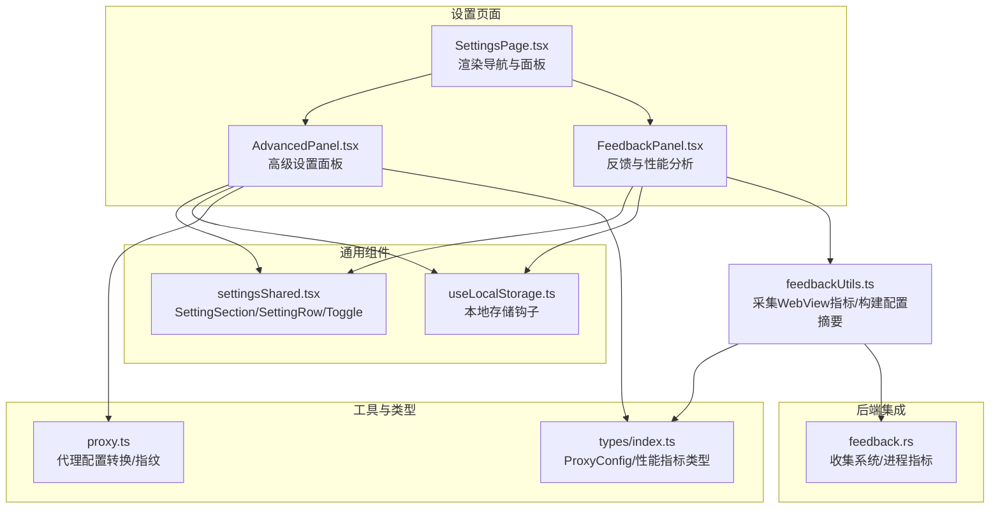
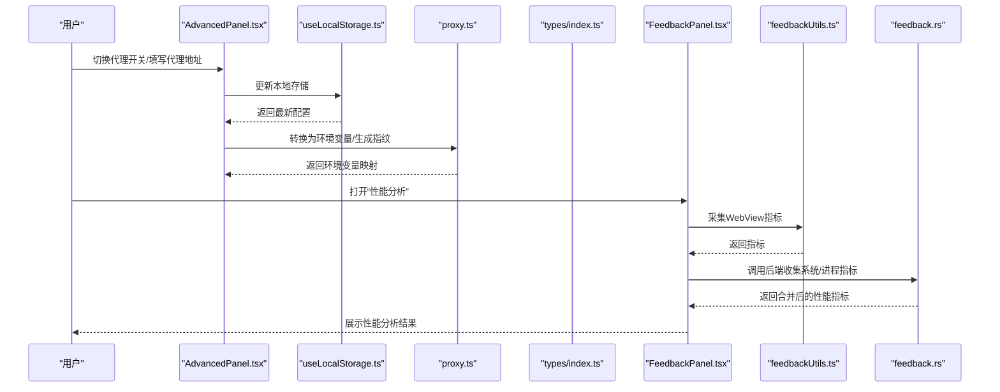
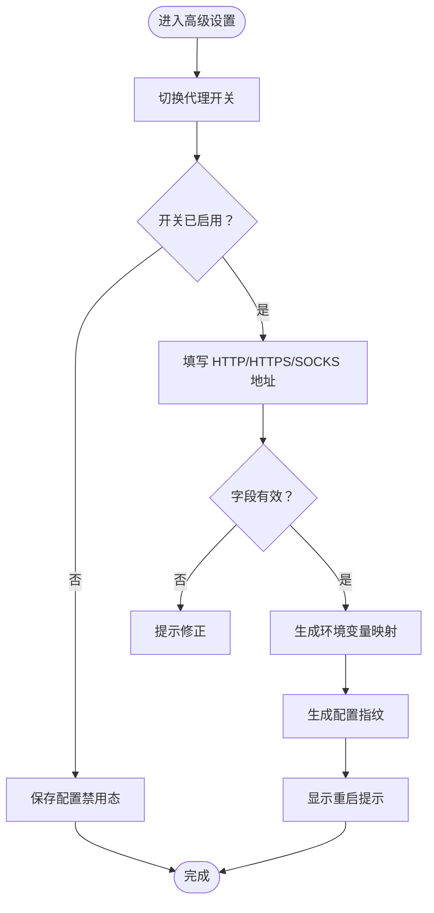
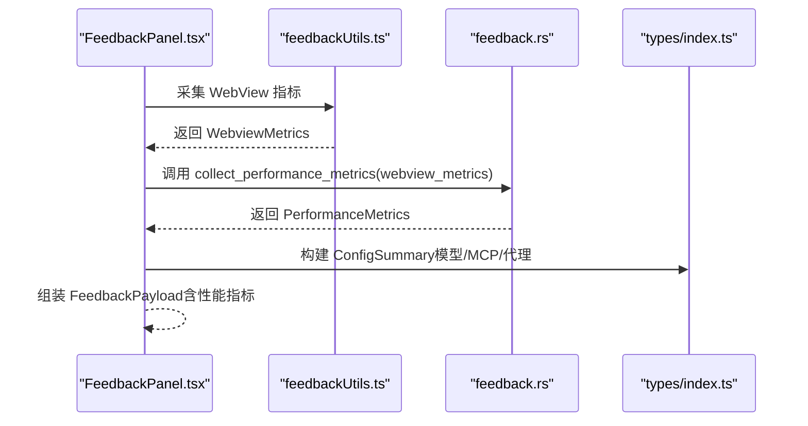
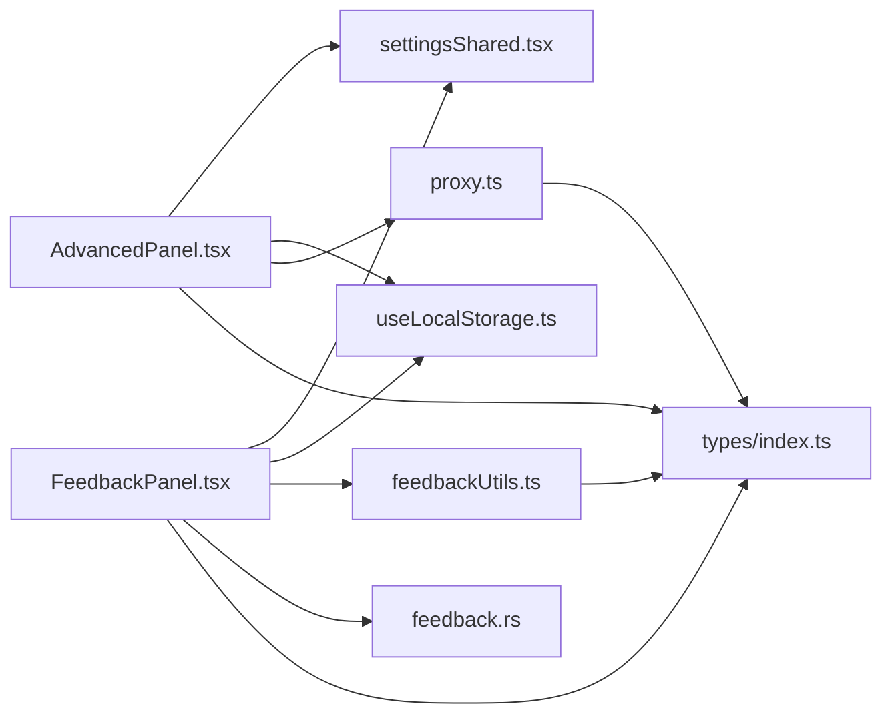

# 高级设置

<cite>
**本文引用的文件**
- [AdvancedPanel.tsx](file://src/components/settings/AdvancedPanel.tsx)
- [proxy.ts](file://src/utils/proxy.ts)
- [types/index.ts](file://src/types/index.ts)
- [SettingsPage.tsx](file://src/components/settings/SettingsPage.tsx)
- [settingsShared.tsx](file://src/components/settings/settingsShared.tsx)
- [useLocalStorage.ts](file://src/hooks/useLocalStorage.ts)
- [FeedbackPanel.tsx](file://src/components/settings/FeedbackPanel.tsx)
- [feedbackUtils.ts](file://src/components/settings/feedback/feedbackUtils.ts)
- [feedback.rs](file://src-tauri/src/feedback.rs)
- [zh.ts](file://src/i18n/locales/zh.ts)
</cite>

## 目录
1. [简介](#简介)
2. [项目结构](#项目结构)
3. [核心组件](#核心组件)
4. [架构总览](#架构总览)
5. [详细组件分析](#详细组件分析)
6. [依赖关系分析](#依赖关系分析)
7. [性能考量](#性能考量)
8. [故障排查指南](#故障排查指南)
9. [结论](#结论)
10. [附录](#附录)

## 简介
本文件面向 RabbitCoding 的“高级设置”模块，系统化梳理并解释高级配置项的设计与实现，包括但不限于：
- 网络代理配置（HTTP/HTTPS/SOCKS、直连白名单）
- 性能监控与采集（WebView 指标、系统资源、应用资源）
- 隐私与遥测（遥测开关、历史记录、缓存清理）
- 反馈与诊断（性能分析开关、系统信息、配置摘要）

同时，文档将给出高级设置对系统性能、安全与稳定性的潜在影响，以及使用场景、配置建议、回滚机制与最佳实践。

## 项目结构
高级设置位于前端设置页面的“高级”分区内，采用模块化组件设计，配合本地存储钩子与类型定义，确保配置持久化与类型安全；性能监控与反馈采集由前端与 Rust 后端协同完成。

图表来源
- [SettingsPage.tsx:106-143](file://src/components/settings/SettingsPage.tsx#L106-L143)
- [AdvancedPanel.tsx:13-101](file://src/components/settings/AdvancedPanel.tsx#L13-L101)
- [FeedbackPanel.tsx:44-136](file://src/components/settings/FeedbackPanel.tsx#L44-L136)
- [settingsShared.tsx:3-67](file://src/components/settings/settingsShared.tsx#L3-L67)
- [useLocalStorage.ts:1-27](file://src/hooks/useLocalStorage.ts#L1-L27)
- [proxy.ts:17-61](file://src/utils/proxy.ts#L17-L61)
- [types/index.ts:520-532](file://src/types/index.ts#L520-L532)
- [feedbackUtils.ts:40-84](file://src/components/settings/feedback/feedbackUtils.ts#L40-L84)
- [feedback.rs:195-235](file://src-tauri/src/feedback.rs#L195-L235)

章节来源
- [SettingsPage.tsx:106-143](file://src/components/settings/SettingsPage.tsx#L106-L143)
- [AdvancedPanel.tsx:13-101](file://src/components/settings/AdvancedPanel.tsx#L13-L101)
- [FeedbackPanel.tsx:44-136](file://src/components/settings/FeedbackPanel.tsx#L44-L136)

## 核心组件
- 高级设置面板（AdvancedPanel）
  - 负责渲染“网络代理”配置项，并通过本地存储钩子持久化。
  - 提供代理开关与 HTTP/HTTPS/SOCKS 地址、直连白名单输入。
  - 在代理启用时，展示重启提示，强调配置生效需重启流程。
- 本地存储钩子（useLocalStorage）
  - 封装 localStorage 读写，带容错处理，避免异常导致崩溃。
- 代理工具（proxy.ts）
  - 定义默认代理配置、将配置转换为环境变量、生成配置指纹。
- 类型定义（types/index.ts）
  - 定义 ProxyConfig、性能指标、配置摘要等核心类型。
- 反馈与性能分析（FeedbackPanel + feedbackUtils + feedback.rs）
  - 前端采集 WebView 指标与系统信息，后端补充进程指标，合并为性能报告。

章节来源
- [AdvancedPanel.tsx:13-101](file://src/components/settings/AdvancedPanel.tsx#L13-L101)
- [useLocalStorage.ts:1-27](file://src/hooks/useLocalStorage.ts#L1-L27)
- [proxy.ts:3-10](file://src/utils/proxy.ts#L3-L10)
- [proxy.ts:17-61](file://src/utils/proxy.ts#L17-L61)
- [types/index.ts:520-532](file://src/types/index.ts#L520-L532)
- [FeedbackPanel.tsx:392-422](file://src/components/settings/FeedbackPanel.tsx#L392-L422)
- [feedbackUtils.ts:40-84](file://src/components/settings/feedback/feedbackUtils.ts#L40-L84)
- [feedback.rs:195-235](file://src-tauri/src/feedback.rs#L195-L235)

## 架构总览
高级设置的控制流围绕“配置读取/更新 → 本地持久化 → 环境变量注入 → 性能采集 → 反馈上报”展开。

图表来源
- [AdvancedPanel.tsx:13-101](file://src/components/settings/AdvancedPanel.tsx#L13-L101)
- [useLocalStorage.ts:1-27](file://src/hooks/useLocalStorage.ts#L1-L27)
- [proxy.ts:17-61](file://src/utils/proxy.ts#L17-L61)
- [FeedbackPanel.tsx:392-422](file://src/components/settings/FeedbackPanel.tsx#L392-L422)
- [feedbackUtils.ts:40-84](file://src/components/settings/feedback/feedbackUtils.ts#L40-L84)
- [feedback.rs:195-235](file://src-tauri/src/feedback.rs#L195-L235)

## 详细组件分析

### 网络代理配置（高级设置）
- 配置项
  - 启用开关：决定是否注入代理环境变量。
  - HTTP 代理地址、HTTPS 代理地址、SOCKS 代理地址。
  - 直连白名单（NO_PROXY），逗号分隔。
- 行为与约束
  - 仅当启用开关为真且对应字段非空时，才注入对应的环境变量键值（大小写兼容）。
  - 生成配置指纹，用于检测配置变更。
  - 启用代理后，界面提示需重启以使新配置生效。
- 类型与默认值
  - ProxyConfig 定义于类型文件，包含 enabled、httpProxy、httpsProxy、socksProxy、noProxy。
  - 默认值中，启用为否，HTTP/HTTPS/SOCKS 为空，noProxy 默认包含本地环回地址。

图表来源
- [AdvancedPanel.tsx:13-101](file://src/components/settings/AdvancedPanel.tsx#L13-L101)
- [proxy.ts:17-61](file://src/utils/proxy.ts#L17-L61)
- [types/index.ts:520-532](file://src/types/index.ts#L520-L532)

章节来源
- [AdvancedPanel.tsx:13-101](file://src/components/settings/AdvancedPanel.tsx#L13-L101)
- [proxy.ts:3-10](file://src/utils/proxy.ts#L3-L10)
- [proxy.ts:17-61](file://src/utils/proxy.ts#L17-L61)
- [types/index.ts:520-532](file://src/types/index.ts#L520-L532)

### 性能监控与采集（反馈与性能分析）
- 功能概述
  - 前端采集 WebView 指标（DOM 元素数量、JS Heap 使用/总量、DOM 完成时间）。
  - 后端采集应用进程指标（内存、CPU）与系统指标（内存使用率、CPU 平均占用）。
  - 合并为统一性能报告，支持在反馈面板中勾选启用。
- 数据模型
  - WebviewMetrics：前端指标。
  - PerformanceMetrics：后端指标（含 WebviewMetrics）。
  - ConfigSummary：模型、MCP 服务、代理状态摘要。
- 采集流程
  - 勾选“性能分析”后，前端通过 JS API 采集指标。
  - 调用后端命令收集系统/进程指标，合并返回。
  - 反馈提交时，随 payload 一并上传。

图表来源
- [FeedbackPanel.tsx:392-422](file://src/components/settings/FeedbackPanel.tsx#L392-L422)
- [feedbackUtils.ts:40-84](file://src/components/settings/feedback/feedbackUtils.ts#L40-L84)
- [feedback.rs:195-235](file://src-tauri/src/feedback.rs#L195-L235)
- [types/index.ts:661-676](file://src/types/index.ts#L661-L676)
- [types/index.ts:654-659](file://src/types/index.ts#L654-L659)

章节来源
- [FeedbackPanel.tsx:392-422](file://src/components/settings/FeedbackPanel.tsx#L392-L422)
- [feedbackUtils.ts:40-84](file://src/components/settings/feedback/feedbackUtils.ts#L40-L84)
- [feedback.rs:195-235](file://src-tauri/src/feedback.rs#L195-L235)
- [types/index.ts:661-676](file://src/types/index.ts#L661-L676)
- [types/index.ts:654-659](file://src/types/index.ts#L654-L659)

### 隐私与遥测（通用设置）
- 遥测开关：控制是否上报遥测数据。
- 历史记录：控制是否保存对话历史。
- 缓存清理：提供一键清理缓存入口（日志提示）。

章节来源
- [SettingsPage.tsx:106-143](file://src/components/settings/SettingsPage.tsx#L106-L143)
- [zh.ts:1](file://src/i18n/locales/zh.ts#L1-L200)

## 依赖关系分析
- 组件耦合
  - AdvancedPanel 依赖 settingsShared（布局与控件）、useLocalStorage（持久化）、proxy 工具（环境变量转换）。
  - FeedbackPanel 依赖 settingsShared、feedbackUtils（采集与汇总）、Rust 后端（性能指标）。
- 类型契约
  - ProxyConfig、WebviewMetrics、PerformanceMetrics、ConfigSummary 等类型贯穿前后端交互。
- 外部集成
  - 代理配置转换为标准环境变量键（HTTP_PROXY/http_proxy、HTTPS_PROXY/https_proxy、ALL_PROXY/all_proxy、NO_PROXY/no_proxy），提升兼容性。

图表来源
- [AdvancedPanel.tsx:13-101](file://src/components/settings/AdvancedPanel.tsx#L13-L101)
- [settingsShared.tsx:3-67](file://src/components/settings/settingsShared.tsx#L3-L67)
- [useLocalStorage.ts:1-27](file://src/hooks/useLocalStorage.ts#L1-L27)
- [proxy.ts:17-61](file://src/utils/proxy.ts#L17-L61)
- [FeedbackPanel.tsx:44-136](file://src/components/settings/FeedbackPanel.tsx#L44-L136)
- [feedbackUtils.ts:40-84](file://src/components/settings/feedback/feedbackUtils.ts#L40-L84)
- [feedback.rs:195-235](file://src-tauri/src/feedback.rs#L195-L235)
- [types/index.ts:520-532](file://src/types/index.ts#L520-L532)

章节来源
- [AdvancedPanel.tsx:13-101](file://src/components/settings/AdvancedPanel.tsx#L13-L101)
- [FeedbackPanel.tsx:44-136](file://src/components/settings/FeedbackPanel.tsx#L44-L136)

## 性能考量
- 代理配置
  - 启用代理会增加网络请求路径复杂度，可能带来延迟与失败概率上升；建议在确定代理可用后再启用。
  - 环境变量注入为轻量操作，但需注意大小写兼容键的存在，避免重复或冲突。
- 性能采集
  - WebView 指标采集基于浏览器 API，通常开销较小；系统/进程指标由后端采集，涉及系统调用，建议在问题定位阶段启用。
  - 合并指标会增加一次跨语言调用，建议在反馈场景使用，而非频繁触发。
- 存储与回退
  - 本地存储具备容错保护，若存储不可用，配置仍可正常编辑但不会持久化；可通过恢复默认配置或回滚至上一版本解决。

## 故障排查指南
- 代理配置无效
  - 检查开关是否启用、地址是否正确、直连白名单是否包含目标域名。
  - 确认环境变量键值是否被注入（大小写均可）。
  - 参考：代理配置转换逻辑与默认值。
- 性能指标缺失
  - 确认已在反馈面板启用“性能分析”，并允许前端采集 WebView 指标。
  - 后端命令需成功返回系统/进程指标，若失败，检查后端权限与系统资源。
- 遥测/历史/缓存问题
  - 遥测与历史记录为独立开关，缓存清理为一次性动作；若出现异常，可逐项关闭/重试。

章节来源
- [proxy.ts:17-61](file://src/utils/proxy.ts#L17-L61)
- [proxy.ts:3-10](file://src/utils/proxy.ts#L3-L10)
- [FeedbackPanel.tsx:392-422](file://src/components/settings/FeedbackPanel.tsx#L392-L422)
- [feedbackUtils.ts:40-84](file://src/components/settings/feedback/feedbackUtils.ts#L40-L84)
- [feedback.rs:195-235](file://src-tauri/src/feedback.rs#L195-L235)

## 结论
高级设置模块以“最小侵入、强类型、可观测”为核心设计原则：通过本地存储与代理工具实现配置持久化与注入，借助前端与后端协同采集性能指标，辅以隐私与遥测控制，满足从日常使用到问题定位的多层级需求。建议在生产环境中谨慎启用高开销功能，并结合回滚策略与监控手段保障稳定性。

## 附录
- 使用场景与配置建议
  - 企业内网：启用代理，合理配置 NO_PROXY 白名单，避免对内部服务造成额外延迟。
  - 开发调试：启用“性能分析”，定位前端渲染瓶颈与资源占用；问题解决后及时关闭。
  - 隐私优先：关闭遥测与历史记录，必要时定期清理缓存。
- 回滚机制
  - 通过本地存储恢复默认配置；若后端指标异常，可在反馈面板中关闭性能采集。
- 最佳实践
  - 代理地址建议使用稳定可用的服务；避免在代理不可用时长期启用。
  - 性能采集仅在问题复现期间开启，减少对用户体验的影响。
  - 定期校验配置摘要（模型、MCP、代理状态），确保与预期一致。