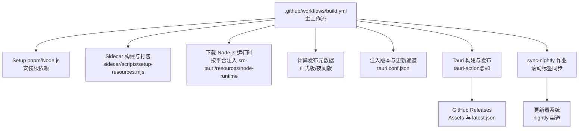
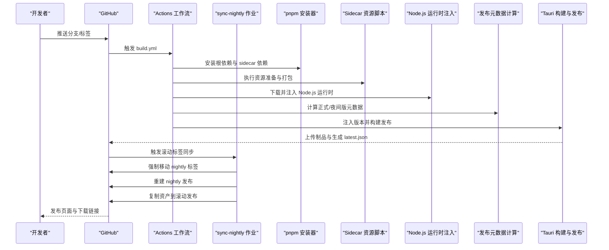
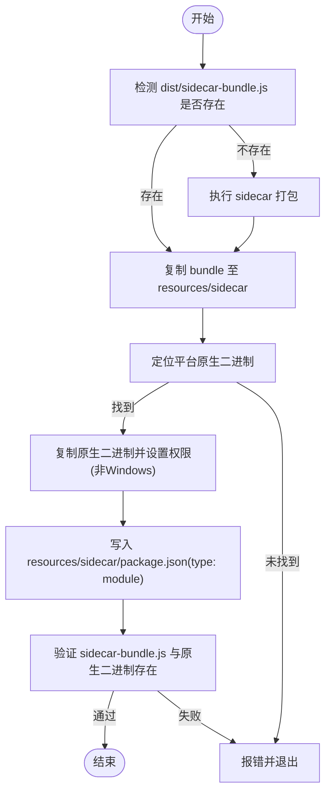
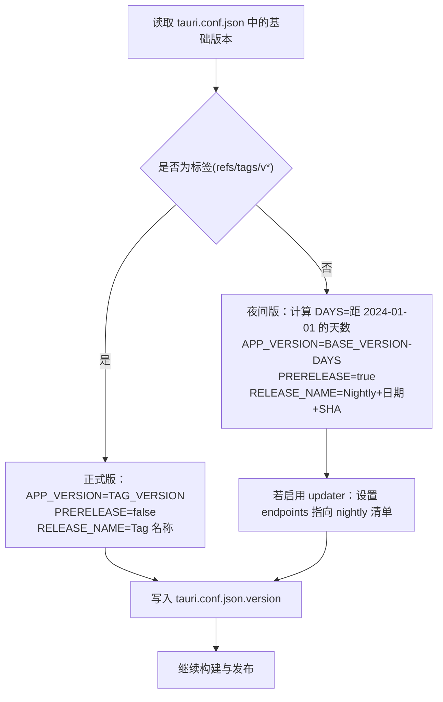
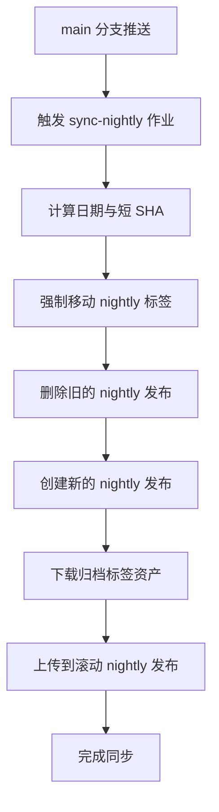
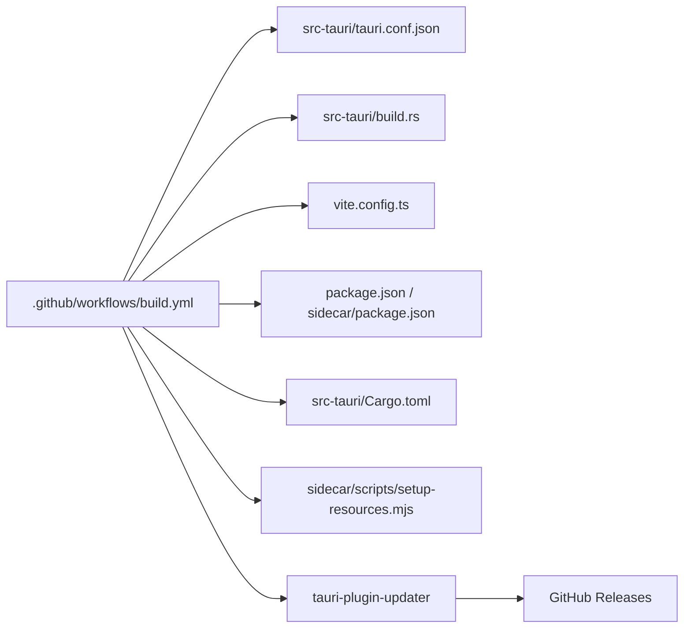

# CI/CD 集成

<cite>
**本文引用的文件**
- [.github/workflows/build.yml](file://.github/workflows/build.yml)
- [package.json](file://package.json)
- [sidecar/package.json](file://sidecar/package.json)
- [sidecar/scripts/setup-resources.mjs](file://sidecar/scripts/setup-resources.mjs)
- [src-tauri/tauri.conf.json](file://src-tauri/tauri.conf.json)
- [src-tauri/build.rs](file://src-tauri/build.rs)
- [src-tauri/Cargo.toml](file://src-tauri/Cargo.toml)
- [vite.config.ts](file://vite.config.ts)
- [src-tauri/src/main.rs](file://src-tauri/src/main.rs)
- [src-tauri/src/lib.rs](file://src-tauri/src/lib.rs)
</cite>

## 更新摘要
**所做更改**
- 新增 sync-nightly 作业章节，详细说明滚动 nightly 标签同步机制
- 更新更新器系统集成部分，说明 nightly 更新通道配置
- 补充更新器权限配置和前端集成说明
- 更新架构图以反映同步作业的工作流程

## 目录
1. [简介](#简介)
2. [项目结构](#项目结构)
3. [核心组件](#核心组件)
4. [架构总览](#架构总览)
5. [详细组件分析](#详细组件分析)
6. [依赖关系分析](#依赖关系分析)
7. [性能考虑](#性能考虑)
8. [故障排除指南](#故障排除指南)
9. [结论](#结论)
10. [附录](#附录)

## 简介
本文件面向 RabbitCoding 的 CI/CD 集成，围绕 GitHub Actions 工作流展开，系统性说明以下主题：
- 工作流触发与并发控制
- 构建矩阵与多平台并行构建
- 自动化测试、代码质量与安全扫描的集成建议
- 发布自动化、版本标签管理与制品上传
- 环境变量、密钥与构建缓存策略
- 工作流模板与故障排除清单
- **新增** 滚动 nightly 标签同步机制与更新器系统集成

该仓库已具备完善的桌面应用构建与发布流水线，覆盖 macOS（Intel/Apple Silicon）、Windows（x64/ARM64），并内置侧车资源与 Node.js 运行时注入。**新增的 sync-nightly 作业实现了滚动 nightly 标签同步，确保更新器始终指向最新的构建版本。**

## 项目结构
RabbitCoding 采用前端（React + Vite）+ 桌面端（Tauri + Rust）的双层架构，CI/CD 关注点集中在 GitHub Actions 工作流与 Tauri 打包配置之间的一致性。

**图表来源**
- [.github/workflows/build.yml:1-242](file://.github/workflows/build.yml#L1-L242)
- [sidecar/scripts/setup-resources.mjs:1-153](file://sidecar/scripts/setup-resources.mjs#L1-L153)
- [src-tauri/tauri.conf.json:1-76](file://src-tauri/tauri.conf.json#L1-L76)

**章节来源**
- [.github/workflows/build.yml:1-242](file://.github/workflows/build.yml#L1-L242)
- [package.json:1-46](file://package.json#L1-L46)
- [sidecar/package.json:1-25](file://sidecar/package.json#L1-L25)
- [sidecar/scripts/setup-resources.mjs:1-153](file://sidecar/scripts/setup-resources.mjs#L1-L153)
- [src-tauri/tauri.conf.json:1-76](file://src-tauri/tauri.conf.json#L1-L76)
- [src-tauri/build.rs:1-45](file://src-tauri/build.rs#L1-L45)
- [src-tauri/Cargo.toml:1-46](file://src-tauri/Cargo.toml#L1-L46)
- [vite.config.ts:1-37](file://vite.config.ts#L1-L37)
- [src-tauri/src/main.rs:1-7](file://src-tauri/src/main.rs#L1-L7)

## 核心组件
- 触发与并发控制
  - 推送到 main 分支与以 v* 开头的标签触发工作流；同一分支/标签的多次推送会取消前序未完成的作业，避免堆积。
- 构建矩阵
  - 并行构建目标：macOS Intel、macOS Apple Silicon、Windows x64、Windows ARM64。
- 依赖与工具链
  - pnpm（Corepack 统一管理）、Node.js 22、Rust stable、Tauri CLI。
- 资源准备
  - Sidecar ESModule 打包产物与平台原生二进制复制至 Tauri resources 目录；同时注入 Node.js 运行时。
- 发布元数据
  - 正式版：基于 Git 标签 v*；夜间版：基于基础版本 + 天数偏移 + SHA 拼接。
- 签名与公证
  - macOS 平台注入 Apple API 密钥与证书，实现签名与公证。
- **新增** 滚动标签同步
  - sync-nightly 作业负责维护 nightly 标签与发布，确保更新器始终指向最新构建。

**章节来源**
- [.github/workflows/build.yml:3-16](file://.github/workflows/build.yml#L3-L16)
- [.github/workflows/build.yml:18-42](file://.github/workflows/build.yml#L18-L42)
- [.github/workflows/build.yml:45-67](file://.github/workflows/build.yml#L45-L67)
- [.github/workflows/build.yml:69-105](file://.github/workflows/build.yml#L69-L105)
- [.github/workflows/build.yml:128-172](file://.github/workflows/build.yml#L128-L172)
- [.github/workflows/build.yml:173-196](file://.github/workflows/build.yml#L173-L196)
- [.github/workflows/build.yml:197-242](file://.github/workflows/build.yml#L197-L242)

## 架构总览
下图展示从触发到发布的完整流程，包括新增的滚动标签同步机制。

**图表来源**
- [.github/workflows/build.yml:43-242](file://.github/workflows/build.yml#L43-L242)
- [sidecar/scripts/setup-resources.mjs:105-133](file://sidecar/scripts/setup-resources.mjs#L105-L133)

**章节来源**
- [.github/workflows/build.yml:1-242](file://.github/workflows/build.yml#L1-L242)
- [sidecar/scripts/setup-resources.mjs:1-153](file://sidecar/scripts/setup-resources.mjs#L1-L153)

## 详细组件分析

### 工作流触发与并发控制
- 触发条件
  - main 分支推送与 v* 标签推送。
  - 支持手动触发 workflow_dispatch。
- 并发策略
  - 同一组（workflow + ref）内取消进行中的作业，避免夜间构建堆积。

**章节来源**
- [.github/workflows/build.yml:3-16](file://.github/workflows/build.yml#L3-L16)

### 构建矩阵与多平台并行
- 平台与目标
  - macOS Intel（x86_64-apple-darwin）
  - macOS Apple Silicon（aarch64-apple-darwin）
  - Windows x64（x86_64-pc-windows-msvc）
  - Windows ARM64（aarch64-pc-windows-msvc）
- Node.js 资产映射
  - darwin-arm64 / darwin-x64 / win-x64 / win-arm64
- 并发与权限
  - concurrency.group 与 cancel-in-progress
  - 显式赋予 contents: write 权限以支持创建/更新 GitHub Release

**章节来源**
- [.github/workflows/build.yml:18-42](file://.github/workflows/build.yml#L18-L42)

### 依赖安装与缓存
- pnpm 与 Node.js
  - 使用 pnpm/action-setup@v4 与 actions/setup-node@v4，启用 pnpm 缓存。
- Rust
  - dtolnay/rust-toolchain@stable，按矩阵目标安装交叉编译工具链。
  - Swatinem/rust-cache@v2，针对 src-tauri 工作空间缓存，键为 target。
- 锁文件一致性
  - 使用 --frozen-lockfile 保证依赖锁定一致。

**章节来源**
- [.github/workflows/build.yml:46-67](file://.github/workflows/build.yml#L46-L67)
- [.github/workflows/build.yml:60-64](file://.github/workflows/build.yml#L60-L64)

### Sidecar 资源准备与 Node.js 运行时注入
- Sidecar 打包
  - 在 sidecar 目录执行 bundle，产物 dist/sidecar-bundle.js。
  - 通过 setup-resources.mjs 将 bundle 与平台原生二进制复制到 src-tauri/resources/sidecar。
- 原生二进制定位策略
  - 优先从 SDK optionalDependencies 解析；其次从 pnpm store 查找；最后回退到标准 node_modules。
- Node.js 运行时注入
  - Unix 平台：解压 tar.gz 至 src-tauri/resources/node-runtime。
  - Windows 平台：解压 zip 至同目录。
- 本地开发占位
  - build.rs 在本地编译时创建占位文件，确保 Tauri glob 匹配。

**图表来源**
- [sidecar/scripts/setup-resources.mjs:33-133](file://sidecar/scripts/setup-resources.mjs#L33-L133)

**章节来源**
- [sidecar/scripts/setup-resources.mjs:1-153](file://sidecar/scripts/setup-resources.mjs#L1-L153)
- [src-tauri/build.rs:6-44](file://src-tauri/build.rs#L6-L44)

### 发布元数据计算与版本注入
- 元数据规则
  - 标签触发：正式版，使用标签名作为发布名与版本号。
  - 非标签触发：夜间版，版本号为 baseVersion + 天数偏移，预发布标记为 true。
- 更新通道
  - 夜间版自动将更新端点指向 nightly 的最新清单。
- 版本注入
  - 修改 tauri.conf.json 中 version 与 updater.endpoints。

**图表来源**
- [.github/workflows/build.yml:128-172](file://.github/workflows/build.yml#L128-L172)
- [src-tauri/tauri.conf.json:1-76](file://src-tauri/tauri.conf.json#L1-L76)

**章节来源**
- [.github/workflows/build.yml:128-172](file://.github/workflows/build.yml#L128-L172)
- [src-tauri/tauri.conf.json:1-76](file://src-tauri/tauri.conf.json#L1-L76)

### 签名与公证（macOS）
- Apple API 密钥与证书
  - 通过 secrets 注入私钥内容与密钥 ID，并在工作流中写入到私钥文件路径。
  - 传递 APPLE_CERTIFICATE、APPLE_CERTIFICATE_PASSWORD、APPLE_API_ISSUER、APPLE_API_KEY 等变量给 tauri-action。
- 效果
  - macOS 构建产物完成签名与公证，提升分发安全性与可信度。

**章节来源**
- [.github/workflows/build.yml:118-127](file://.github/workflows/build.yml#L118-L127)
- [.github/workflows/build.yml:174-196](file://.github/workflows/build.yml#L174-L196)

### Tauri 构建与发布
- 构建命令
  - 使用 pnpm tauri 作为 tauriScript，按矩阵 target 参数构建。
- 发布参数
  - tagName、releaseName、releaseBody、prerelease、updaterJsonPreferNsis。
- 产物与清单
  - 自动生成各平台安装包与更新清单 latest.json，上传至 GitHub Releases。

**章节来源**
- [.github/workflows/build.yml:174-196](file://.github/workflows/build.yml#L174-L196)
- [src-tauri/tauri.conf.json:41-76](file://src-tauri/tauri.conf.json#L41-L76)

### **新增** 滚动 nightly 标签同步机制
- 作业触发条件
  - 仅在 main 分支推送时触发，且依赖 build 作业完成。
- 核心功能
  - 强制移动 nightly 标签到当前提交 SHA。
  - 重建 nightly 发布，设置为预发布状态。
  - 从归档标签复制所有资产到滚动发布。
- 技术实现
  - 使用 git tag -f 强制更新标签。
  - 通过 GitHub CLI 删除并重新创建发布。
  - 使用临时目录下载并上传资产。

**图表来源**
- [.github/workflows/build.yml:197-242](file://.github/workflows/build.yml#L197-L242)

**章节来源**
- [.github/workflows/build.yml:197-242](file://.github/workflows/build.yml#L197-L242)

### **新增** 更新器系统集成
- 更新器配置
  - 在 tauri.conf.json 中启用 updater 插件。
  - 设置更新端点为 GitHub releases 下载路径。
  - 配置公钥用于更新清单签名验证。
- 运行时集成
  - 在 src-tauri/src/lib.rs 中初始化 tauri-plugin-updater。
  - 通过权限系统控制更新操作的可用性。
- 前端集成
  - 通过 Tauri 命令调用更新器功能。
  - 支持检查更新、下载更新、安装更新的完整流程。

**章节来源**
- [src-tauri/tauri.conf.json:60-76](file://src-tauri/tauri.conf.json#L60-L76)
- [src-tauri/src/lib.rs:656-667](file://src-tauri/src/lib.rs#L656-L667)
- [src-tauri/Cargo.toml:40](file://src-tauri/Cargo.toml#L40)

## 依赖关系分析
- 工作流对工具链的依赖
  - Node.js 与 pnpm：用于前端与 sidecar 依赖安装。
  - Rust：交叉编译工具链与缓存。
  - Tauri：CLI 与打包能力。
- 工作流对配置文件的依赖
  - tauri.conf.json：构建入口、资源列表、图标与插件配置。
  - build.rs：本地编译时的资源占位与重编译触发。
  - vite.config.ts：开发服务器端口与 HMR 设置，影响 devUrl。
- 工作流对密钥与权限的依赖
  - GITHUB_TOKEN：创建/更新 Release。
  - TAURI_SIGNING_*：更新清单签名。
  - Apple 证书与 API 密钥：macOS 签名与公证。
- **新增** 更新器依赖
  - tauri-plugin-updater：桌面端更新器插件。
  - GitHub Releases：更新清单与安装包存储。

**图表来源**
- [.github/workflows/build.yml:1-242](file://.github/workflows/build.yml#L1-L242)
- [src-tauri/tauri.conf.json:1-76](file://src-tauri/tauri.conf.json#L1-L76)
- [src-tauri/build.rs:1-45](file://src-tauri/build.rs#L1-L45)
- [vite.config.ts:1-37](file://vite.config.ts#L1-L37)
- [package.json:1-46](file://package.json#L1-L46)
- [sidecar/package.json:1-25](file://sidecar/package.json#L1-L25)
- [src-tauri/Cargo.toml:1-46](file://src-tauri/Cargo.toml#L1-L46)
- [sidecar/scripts/setup-resources.mjs:1-153](file://sidecar/scripts/setup-resources.mjs#L1-L153)

**章节来源**
- [.github/workflows/build.yml:1-242](file://.github/workflows/build.yml#L1-L242)
- [src-tauri/tauri.conf.json:1-76](file://src-tauri/tauri.conf.json#L1-L76)
- [src-tauri/build.rs:1-45](file://src-tauri/build.rs#L1-L45)
- [vite.config.ts:1-37](file://vite.config.ts#L1-L37)
- [package.json:1-46](file://package.json#L1-L46)
- [sidecar/package.json:1-25](file://sidecar/package.json#L1-L25)
- [src-tauri/Cargo.toml:1-46](file://src-tauri/Cargo.toml#L1-L46)
- [sidecar/scripts/setup-resources.mjs:1-153](file://sidecar/scripts/setup-resources.mjs#L1-L153)

## 性能考虑
- 并行构建
  - 利用矩阵并行构建不同平台，显著缩短整体耗时。
- 缓存优化
  - pnpm 缓存与 Rust 工作空间缓存（按 target 键）减少重复安装与编译时间。
- 依赖锁定
  - 使用 --frozen-lockfile 保证依赖树稳定，避免缓存污染。
- 资源注入
  - 将 sidecar 与 Node.js 运行时提前注入 resources，避免构建期动态下载带来的不确定性。
- **新增** 同步作业优化
  - sync-nightly 作业仅在 main 分支触发，避免不必要的执行。
  - 使用临时目录处理资产复制，减少磁盘占用。

**章节来源**
- [.github/workflows/build.yml:46-67](file://.github/workflows/build.yml#L46-L67)
- [.github/workflows/build.yml:60-64](file://.github/workflows/build.yml#L60-L64)
- [.github/workflows/build.yml:197-242](file://.github/workflows/build.yml#L197-L242)

## 故障排除指南
- sidecar 原生二进制缺失
  - 现象：resources/sidecar 下缺少 claude 或 claude.exe。
  - 排查：确认 sidecar 依赖安装完整（包含 optionalDependencies），并检查 setup-resources.mjs 的三种定位策略是否命中。
  - 参考
    - [sidecar/scripts/setup-resources.mjs:54-78](file://sidecar/scripts/setup-resources.mjs#L54-L78)
    - [sidecar/scripts/setup-resources.mjs:105-133](file://sidecar/scripts/setup-resources.mjs#L105-L133)
- Node.js 运行时未注入
  - 现象：resources/node-runtime 为空或缺失。
  - 排查：确认下载 URL 与平台资产匹配，检查 tar.gz/zip 解压路径。
  - 参考
    - [.github/workflows/build.yml:79-104](file://.github/workflows/build.yml#L79-L104)
- macOS 签名/公证失败
  - 现象：构建产物未签名或公证失败。
  - 排查：核对 APPLE_CERTIFICATE、APPLE_CERTIFICATE_PASSWORD、APPLE_API_ISSUER、APPLE_API_KEY 与私钥文件路径。
  - 参考
    - [.github/workflows/build.yml:118-127](file://.github/workflows/build.yml#L118-L127)
    - [.github/workflows/build.yml:174-196](file://.github/workflows/build.yml#L174-L196)
- 夜间版更新清单不可用
  - 现象：客户端无法拉取 nightly 更新。
  - 排查：确认 tauri-action 已生成 latest.json，并且 updater.endpoints 指向 nightly 清单。
  - 参考
    - [.github/workflows/build.yml:128-172](file://.github/workflows/build.yml#L128-L172)
    - [src-tauri/tauri.conf.json:66-73](file://src-tauri/tauri.conf.json#L66-L73)
- **新增** 滚动标签同步失败
  - 现象：nightly 标签未正确更新或发布未重建。
  - 排查：检查 GITHUB_TOKEN 权限，确认 git tag -f 命令执行成功，验证 GitHub CLI 可用性。
  - 参考
    - [.github/workflows/build.yml:197-242](file://.github/workflows/build.yml#L197-L242)
- **新增** 更新器权限问题
  - 现象：更新功能不可用或权限不足。
  - 排查：确认 tauri.conf.json 中 updater 权限配置，检查 default.json 中的权限声明。
  - 参考
    - [src-tauri/tauri.conf.json:66-73](file://src-tauri/tauri.conf.json#L66-L73)
    - [src-tauri/capabilities/default.json:40](file://src-tauri/capabilities/default.json#L40)

## 结论
本仓库的 CI/CD 已形成完整的多平台并行构建与发布闭环：通过 GitHub Actions 矩阵并行、pnpm 与 Rust 缓存、Sidecar 资源与 Node.js 运行时注入、以及 Apple 签名与公证，实现了稳定高效的桌面应用交付。**新增的 sync-nightly 作业和更新器系统集成为用户提供了无缝的自动更新体验，确保用户始终能够获取到最新的构建版本。** 建议在现有基础上补充自动化测试、代码质量检查与安全扫描，以进一步提升发布质量与安全性。

## 附录

### 环境变量与密钥清单
- Node.js 与缓存
  - NODE_VERSION：固定 Node.js 版本
  - NODE_OPTIONS：增大堆内存
- pnpm 与 Node
  - GITHUB_TOKEN：actions/checkout 与 tauri-action 发布
- Tauri 签名
  - TAURI_SIGNING_PRIVATE_KEY
  - TAURI_SIGNING_PRIVATE_KEY_PASSWORD
- Apple 平台
  - APPLE_CERTIFICATE
  - APPLE_CERTIFICATE_PASSWORD
  - APPLE_API_ISSUER
  - APPLE_API_KEY
  - APPLE_API_KEY_CONTENT（写入私钥文件）
- **新增** 更新器密钥
  - 更新器公钥：用于验证更新清单签名

**章节来源**
- [.github/workflows/build.yml:9-11](file://.github/workflows/build.yml#L9-L11)
- [.github/workflows/build.yml:174-196](file://.github/workflows/build.yml#L174-L196)
- [src-tauri/tauri.conf.json:72](file://src-tauri/tauri.conf.json#L72)

### 工作流模板（步骤级）
- 安装依赖
  - pnpm 安装根与 sidecar 依赖
  - Rust 工具链与缓存
- 资源准备
  - sidecar 打包与复制
  - Node.js 运行时注入
- 发布元数据
  - 正式/夜间版判断与版本号拼接
  - 注入 tauri.conf.json
- 构建与发布
  - tauri-action 打包并上传 Release
- **新增** 滚动标签同步
  - 强制更新 nightly 标签
  - 重建 nightly 发布并复制资产

**章节来源**
- [.github/workflows/build.yml:43-242](file://.github/workflows/build.yml#L43-L242)
- [sidecar/scripts/setup-resources.mjs:1-153](file://sidecar/scripts/setup-resources.mjs#L1-L153)

### 自动化测试、代码质量与安全扫描建议
- 自动化测试
  - 在工作流中新增 job，分别在 Linux/macOS/Windows 上运行前端与后端测试命令。
- 代码质量
  - TypeScript 类型检查与 ESLint/Stylelint（如启用）。
- 安全扫描
  - Rust 依赖审计（cargo audit）
  - npm/pnpm 依赖漏洞扫描（如使用 GitHub Security Advisory 或第三方服务）
  - 二进制制品签名完整性校验
- **新增** 更新器测试
  - 验证更新清单生成与签名
  - 测试更新器权限配置
  - 端到端更新流程测试

### **新增** 更新器权限配置参考
- 默认权限集合：包含检查、下载、安装的完整更新流程
- 允许的操作：check、download、install、download-and-install
- 拒绝的操作：deny-check、deny-download、deny-install、deny-download-and-install

**章节来源**
- [src-tauri/gen/schemas/desktop-schema.json:6679-6708](file://src-tauri/gen/schemas/desktop-schema.json#L6679-L6708)
- [src-tauri/gen/schemas/macOS-schema.json:6679-6708](file://src-tauri/gen/schemas/macOS-schema.json#L6679-L6708)