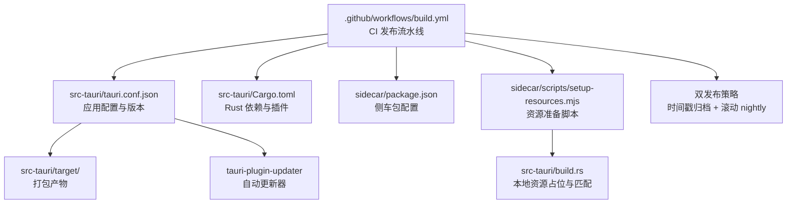
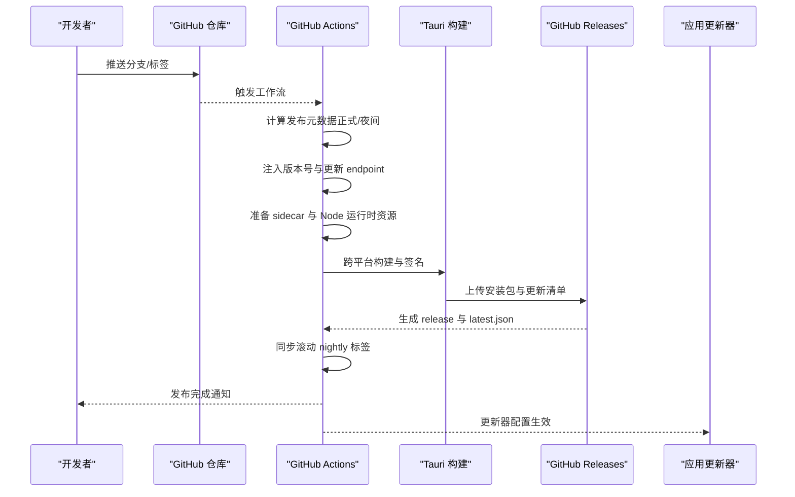
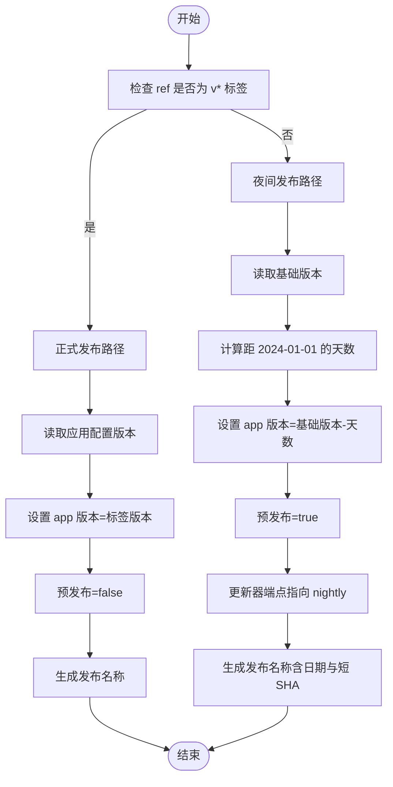
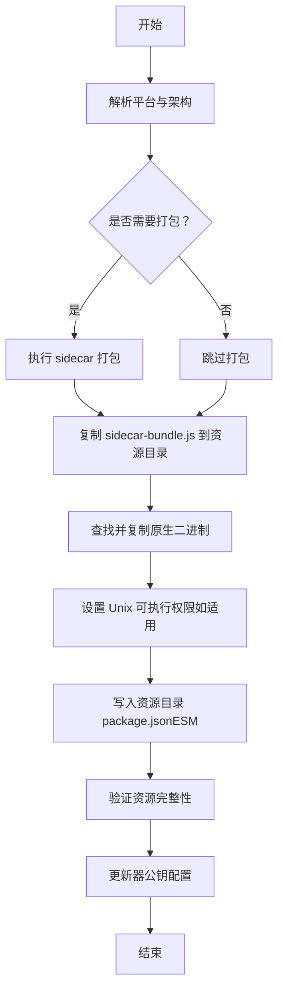
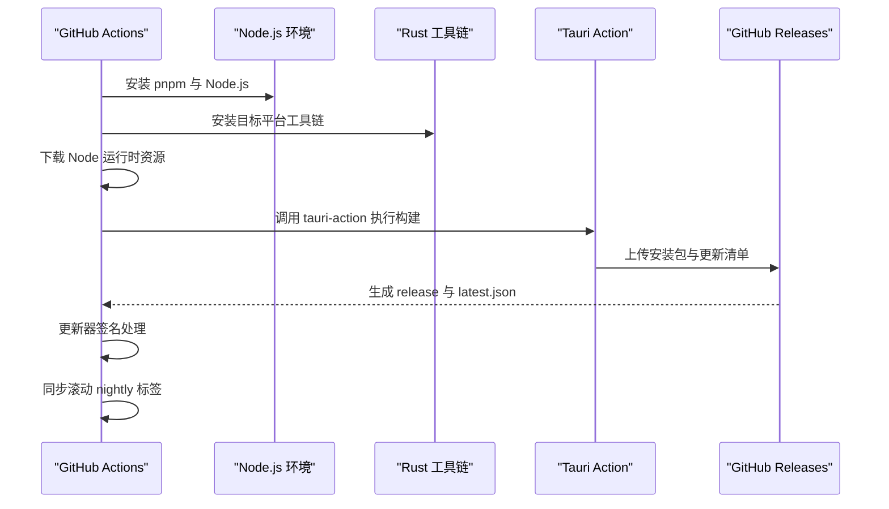
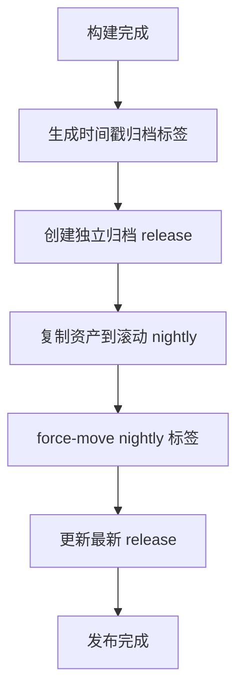
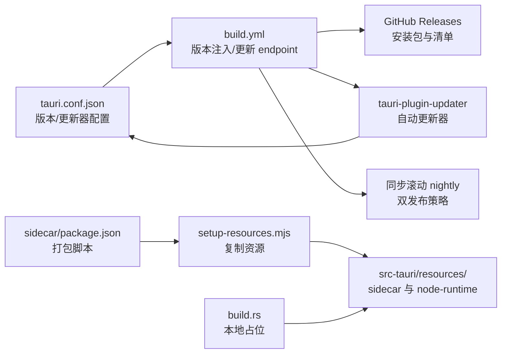

# 发布流程

<cite>
**本文引用的文件**
- [.github/workflows/build.yml](file://.github/workflows/build.yml)
- [package.json](file://package.json)
- [src-tauri/tauri.conf.json](file://src-tauri/tauri.conf.json)
- [src-tauri/Cargo.toml](file://src-tauri/Cargo.toml)
- [sidecar/package.json](file://sidecar/package.json)
- [sidecar/scripts/setup-resources.mjs](file://sidecar/scripts/setup-resources.mjs)
- [src-tauri/build.rs](file://src-tauri/build.rs)
- [src-tauri/src/lib.rs](file://src-tauri/src/lib.rs)
- [src-tauri/src/main.rs](file://src-tauri/src/main.rs)
</cite>

## 更新摘要
**变更内容**
- 新增 Tauri 应用更新器系统，支持自动更新功能
- 实现双发布策略：时间戳归档 + 滚动 nightly
- 增强 GitHub Actions 工作流，包含更新器配置和发布同步
- 添加更新器公钥验证和签名机制
- 优化发布流程，支持正式版和夜间版的差异化处理

## 目录
1. [简介](#简介)
2. [项目结构](#项目结构)
3. [核心组件](#核心组件)
4. [架构总览](#架构总览)
5. [详细组件分析](#详细组件分析)
6. [依赖关系分析](#依赖关系分析)
7. [性能考量](#性能考量)
8. [故障排查指南](#故障排查指南)
9. [结论](#结论)
10. [附录](#附录)

## 简介
本手册面向 RabbitCoding 的发布团队，提供标准化的发布操作指南。内容覆盖版本管理策略、标签与发布分支管理、手动与自动发布流程、发布前检查清单、质量保证流程、多平台发布渠道与更新机制、回滚策略、发布通知与变更日志维护、用户公告模板以及应急处理方案。特别针对新增的 Tauri 应用更新器系统，详细说明双发布策略（时间戳归档 + 滚动 nightly）的实现原理和操作流程。

## 项目结构
RabbitCoding 采用前端（React/Vite）、后端（Tauri/Rust）与侧车（sidecar）资源三部分协同的桌面应用结构。发布流程围绕以下关键文件展开：
- GitHub Actions 自动化流水线：负责跨平台构建、打包、签名、发布到 GitHub Releases，并生成更新清单。
- 应用配置：前端与 Tauri 配置共同决定版本号、产品标识、打包资源与更新通道。
- 侧车资源准备：在构建前将 sidecar 打包与原生二进制复制到 Tauri 资源目录，确保运行时可用。
- Cargo 构建钩子：在本地开发与 CI 中确保资源占位与匹配，避免打包阶段缺失资源。
- **新增**：Tauri 应用更新器：集成自动更新功能，支持正式版和夜间版的差异化更新策略。

**图表来源**
- [.github/workflows/build.yml:1-242](file://.github/workflows/build.yml#L1-L242)
- [src-tauri/tauri.conf.json:1-76](file://src-tauri/tauri.conf.json#L1-L76)
- [src-tauri/Cargo.toml:1-46](file://src-tauri/Cargo.toml#L1-L46)
- [sidecar/package.json:1-25](file://sidecar/package.json#L1-L25)
- [sidecar/scripts/setup-resources.mjs:1-153](file://sidecar/scripts/setup-resources.mjs#L1-L153)
- [src-tauri/build.rs:1-45](file://src-tauri/build.rs#L1-L45)

**章节来源**
- [.github/workflows/build.yml:1-242](file://.github/workflows/build.yml#L1-L242)
- [package.json:1-49](file://package.json#L1-L49)
- [src-tauri/tauri.conf.json:1-76](file://src-tauri/tauri.conf.json#L1-L76)
- [src-tauri/Cargo.toml:1-46](file://src-tauri/Cargo.toml#L1-L46)
- [sidecar/package.json:1-25](file://sidecar/package.json#L1-L25)
- [sidecar/scripts/setup-resources.mjs:1-153](file://sidecar/scripts/setup-resources.mjs#L1-L153)
- [src-tauri/build.rs:1-45](file://src-tauri/build.rs#L1-L45)

## 核心组件
- **版本与标签策略**
  - 正式版：基于 Git 标签 v<语义化版本> 推送触发，版本号直接取自应用配置文件。
  - 夜间版（Nightly）：非标签推送或手动触发时生成，版本号包含"基础版本-距离基准日期的天数"，并标记为预发布。
  - **新增**：双发布策略支持时间戳归档（独立标签）和滚动 nightly（latest release）两种模式。
- **发布分支管理**
  - 主分支推送触发构建；标签推送触发正式版发布；支持手动触发工作流。
  - **新增**：同步滚动 nightly 标签，始终指向最新构建。
- **更新通道**
  - 正式版：GitHub Releases 作为分发渠道，客户端更新器指向对应标签。
  - 夜间版：更新器 endpoint 指向 nightly 标签下的最新清单。
  - **新增**：更新器支持公钥验证和签名机制，确保更新安全。
- **资源与打包**
  - 侧车打包与原生二进制复制至 Tauri 资源目录；本地开发与 CI 均需满足资源存在性。
  - **新增**：更新器公钥配置在 tauri.conf.json 中定义。
- **平台矩阵**
  - macOS（Intel/Apple Silicon）、Windows（x64/ARM64）四平台并行构建，统一注入版本与更新通道。

**章节来源**
- [.github/workflows/build.yml:3-16](file://.github/workflows/build.yml#L3-L16)
- [.github/workflows/build.yml:128-171](file://.github/workflows/build.yml#L128-L171)
- [.github/workflows/build.yml:174-196](file://.github/workflows/build.yml#L174-L196)
- [.github/workflows/build.yml:197-242](file://.github/workflows/build.yml#L197-L242)
- [src-tauri/tauri.conf.json:1-76](file://src-tauri/tauri.conf.json#L1-L76)
- [sidecar/scripts/setup-resources.mjs:1-153](file://sidecar/scripts/setup-resources.mjs#L1-L153)
- [src-tauri/build.rs:1-45](file://src-tauri/build.rs#L1-L45)

## 架构总览
下图展示从代码提交到多平台发布与更新的整体流程，涵盖版本推断、资源准备、构建签名、发布与更新清单生成等环节。**新增**的更新器系统在发布过程中自动注入更新端点配置。

**图表来源**
- [.github/workflows/build.yml:3-16](file://.github/workflows/build.yml#L3-L16)
- [.github/workflows/build.yml:128-171](file://.github/workflows/build.yml#L128-L171)
- [.github/workflows/build.yml:174-196](file://.github/workflows/build.yml#L174-L196)
- [.github/workflows/build.yml:197-242](file://.github/workflows/build.yml#L197-L242)

## 详细组件分析

### 组件一：版本与标签策略
- **正式发布**
  - 触发条件：推送标签 pattern 为 v*。
  - 版本号来源：从应用配置中读取版本，直接作为 app 版本与 release 名称。
  - 预发布标记：false。
- **夜间发布**
  - 触发条件：主分支推送或手动触发。
  - 版本号规则：基础版本 + "距 2024-01-01 的天数"（纯数字，满足 MSI/WiX 要求），并标记为预发布。
  - 更新 endpoint：当启用更新器时，指向 nightly 标签下的最新清单。
- **版本注入**
  - 在构建前动态修改应用配置中的版本字段，确保最终产物与发布清单一致。
  - **新增**：同时更新更新器端点配置，确保夜间版指向正确的更新源。

**图表来源**
- [.github/workflows/build.yml:128-171](file://.github/workflows/build.yml#L128-L171)
- [.github/workflows/build.yml:163-171](file://.github/workflows/build.yml#L163-L171)

**章节来源**
- [.github/workflows/build.yml:128-171](file://.github/workflows/build.yml#L128-L171)
- [.github/workflows/build.yml:163-171](file://.github/workflows/build.yml#L163-L171)
- [src-tauri/tauri.conf.json:1-76](file://src-tauri/tauri.conf.json#L1-L76)

### 组件二：资源准备与打包
- **侧车资源准备**
  - 支持本地与 CI 两种场景：可选择先打包再复制，或仅复制已有产物。
  - 自动解析平台对应的原生二进制（按平台与架构组合），并复制到 Tauri 资源目录。
  - 为保证 ESM 解析，确保资源目录下存在声明为 ESM 的 package.json。
- **本地开发占位**
  - Cargo 构建钩子在本地首次构建时写入占位文件，确保资源目录存在且可 glob 匹配，避免打包阶段报错。
- **Node 运行时资源**
  - CI 下下载对应平台的 Node 运行时并放入资源目录，确保应用启动时具备运行时环境。
- **更新器资源**
  - **新增**：更新器公钥配置在 tauri.conf.json 中定义，用于验证更新包的完整性。

**图表来源**
- [sidecar/scripts/setup-resources.mjs:1-153](file://sidecar/scripts/setup-resources.mjs#L1-L153)
- [src-tauri/build.rs:1-45](file://src-tauri/build.rs#L1-L45)
- [src-tauri/tauri.conf.json:60-76](file://src-tauri/tauri.conf.json#L60-L76)

**章节来源**
- [sidecar/scripts/setup-resources.mjs:1-153](file://sidecar/scripts/setup-resources.mjs#L1-L153)
- [src-tauri/build.rs:1-45](file://src-tauri/build.rs#L1-L45)
- [src-tauri/tauri.conf.json:60-76](file://src-tauri/tauri.conf.json#L60-L76)

### 组件三：多平台构建与签名
- **平台矩阵**
  - macOS（aarch64/x86_64）、Windows（x86_64/aarch64）四平台并行构建。
- **权限与凭据**
  - 需要对内容写权限以创建/更新 GitHub Release。
  - macOS 使用 Apple API Key 与证书进行签名与公证。
  - 更新器清单使用私钥签名，客户端侧进行校验。
- **构建产物**
  - 生成各平台安装包与更新清单，发布到 GitHub Releases。
- **更新器集成**
  - **新增**：构建过程中自动处理更新器签名，确保更新包的安全性。

**图表来源**
- [.github/workflows/build.yml:19-196](file://.github/workflows/build.yml#L19-L196)
- [.github/workflows/build.yml:173-196](file://.github/workflows/build.yml#L173-L196)

**章节来源**
- [.github/workflows/build.yml:19-196](file://.github/workflows/build.yml#L19-L196)
- [.github/workflows/build.yml:173-196](file://.github/workflows/build.yml#L173-L196)

### 组件四：更新机制与回滚策略
- **更新通道**
  - 正式版：客户端从对应标签的 Releases 获取安装包与更新清单。
  - 夜间版：客户端从 nightly 标签的最新清单获取更新。
  - **新增**：更新器支持公钥验证，确保更新包的完整性和真实性。
- **回滚策略**
  - 通过打新标签触发新的发布，实现"向上滚动"发布。
  - 若问题严重，可删除有问题的 release 或改名，重新以相同版本号但修复后的清单发布。
  - 客户端若缓存了旧清单，建议引导用户重启应用或强制检查更新。
- **双发布策略**
  - **新增**：时间戳归档发布（nightly-YYYYMMDD-SHA）用于历史版本备份。
  - **新增**：滚动 nightly 发布（nightly）始终指向最新构建，便于稳定下载。
- **更新器配置**
  - **新增**：在 tauri.conf.json 中配置更新器端点、对话框显示和公钥验证。

**章节来源**
- [.github/workflows/build.yml:128-171](file://.github/workflows/build.yml#L128-L171)
- [.github/workflows/build.yml:197-242](file://.github/workflows/build.yml#L197-L242)
- [src-tauri/tauri.conf.json:60-76](file://src-tauri/tauri.conf.json#L60-L76)

### 组件五：双发布策略实现
- **时间戳归档发布**
  - 为每次夜间构建生成独立标签：nightly-YYYYMMDD-SHA
  - 保留完整的构建产物和更新清单，便于历史版本回溯
  - 适用于需要精确版本控制的场景
- **滚动 nightly 发布**
  - 始终指向最新构建的 nightly 标签
  - 通过 force-move 标签和重新创建 release 实现滚动更新
  - 适用于稳定下载和持续集成场景
- **发布同步机制**
  - 构建完成后自动同步资产到滚动 nightly release
  - 确保两个发布渠道的数据一致性

**图表来源**
- [.github/workflows/build.yml:197-242](file://.github/workflows/build.yml#L197-L242)

**章节来源**
- [.github/workflows/build.yml:197-242](file://.github/workflows/build.yml#L197-L242)

## 依赖关系分析
- **版本来源依赖**
  - 应用配置文件是版本号的权威来源；CI 在构建前注入版本，确保一致性。
  - **新增**：更新器配置依赖于 tauri.conf.json 中的插件配置。
- **资源依赖**
  - 侧车打包产物与原生二进制必须存在于资源目录，否则构建失败。
  - Node 运行时资源在 CI 下由脚本下载并放置，本地开发需注意占位文件的存在。
  - **新增**：更新器公钥文件需要正确配置以支持签名验证。
- **平台依赖**
  - 不同平台需要不同的签名与打包参数，CI 中通过矩阵与条件判断适配。
- **更新器依赖**
  - **新增**：tauri-plugin-updater 依赖于 tauri.conf.json 中的更新器配置。
  - **新增**：更新器公钥需要与客户端配置保持一致。

**图表来源**
- [src-tauri/tauri.conf.json:1-76](file://src-tauri/tauri.conf.json#L1-L76)
- [sidecar/package.json:1-25](file://sidecar/package.json#L1-L25)
- [sidecar/scripts/setup-resources.mjs:1-153](file://sidecar/scripts/setup-resources.mjs#L1-L153)
- [src-tauri/build.rs:1-45](file://src-tauri/build.rs#L1-L45)
- [.github/workflows/build.yml:128-171](file://.github/workflows/build.yml#L128-L171)
- [.github/workflows/build.yml:197-242](file://.github/workflows/build.yml#L197-L242)

**章节来源**
- [src-tauri/tauri.conf.json:1-76](file://src-tauri/tauri.conf.json#L1-L76)
- [sidecar/package.json:1-25](file://sidecar/package.json#L1-L25)
- [sidecar/scripts/setup-resources.mjs:1-153](file://sidecar/scripts/setup-resources.mjs#L1-L153)
- [src-tauri/build.rs:1-45](file://src-tauri/build.rs#L1-L45)
- [.github/workflows/build.yml:128-171](file://.github/workflows/build.yml#L128-L171)
- [.github/workflows/build.yml:197-242](file://.github/workflows/build.yml#L197-L242)

## 性能考量
- **并行构建**
  - 使用矩阵并行构建四平台，缩短整体耗时。
- **缓存优化**
  - Node/pnpm 缓存与 Rust 工作区缓存减少重复安装与编译时间。
- **资源准备**
  - 侧车打包与资源复制在 CI 中一次性完成，避免重复执行。
- **更新器优化**
  - **新增**：更新器采用增量更新机制，减少网络传输开销。
  - **新增**：公钥验证在客户端进行，提高安全性同时保持性能。

**章节来源**
- [.github/workflows/build.yml:19-64](file://.github/workflows/build.yml#L19-L64)

## 故障排查指南
- **资源缺失**
  - 症状：构建时报错找不到 sidecar 或原生二进制。
  - 处理：确认已执行资源准备脚本；检查资源目录是否存在；确保平台解析正确。
- **版本不一致**
  - 症状：发布版本与应用内版本不一致。
  - 处理：确认 CI 是否正确注入版本；核对应用配置文件版本字段。
- **夜间版更新异常**
  - 症状：客户端无法获取夜间更新。
  - 处理：确认更新 endpoint 指向 nightly 标签；检查最新清单是否生成。
- **macOS 签名/公证失败**
  - 症状：构建产物未签名或公证失败。
  - 处理：检查 Apple 证书与 API Key 配置；确认私钥文件路径与权限。
- **更新器配置错误**
  - **新增**：症状：客户端无法验证更新包或更新失败。
  - **新增**：处理：检查 tauri.conf.json 中的更新器配置；确认公钥与私钥匹配；验证更新清单签名。
- **双发布策略异常**
  - **新增**：症状：滚动 nightly 标签未更新或时间戳归档缺失。
  - **新增**：处理：检查 sync-nightly job 的执行状态；验证 GitHub Token 权限；确认标签同步逻辑。

**章节来源**
- [sidecar/scripts/setup-resources.mjs:78-103](file://sidecar/scripts/setup-resources.mjs#L78-L103)
- [.github/workflows/build.yml:164-171](file://.github/workflows/build.yml#L164-L171)
- [.github/workflows/build.yml:174-196](file://.github/workflows/build.yml#L174-L196)
- [.github/workflows/build.yml:197-242](file://.github/workflows/build.yml#L197-L242)

## 结论
本发布流程通过明确的版本策略、严格的资源准备与注入机制、跨平台并行构建与签名、以及清晰的更新通道与回滚策略，实现了稳定、可追溯、可回滚的桌面应用发布体系。**新增的 Tauri 应用更新器系统**进一步增强了用户体验，支持自动更新功能。**双发布策略**（时间戳归档 + 滚动 nightly）提供了灵活的版本管理方案，既满足了历史版本回溯需求，又保证了稳定下载的便利性。建议在每次发布前严格遵循发布检查清单与质量保证流程，确保用户体验与安全性。

## 附录

### 发布前检查清单
- **版本与标签**
  - 确认版本号符合语义化规范；正式发布使用 v<版本> 标签；夜间发布使用主分支或手动触发。
- **资源准备**
  - 本地与 CI 均执行资源准备脚本；验证 sidecar 与原生二进制存在；确认资源目录 package.json 存在。
- **配置校验**
  - 核对应用配置文件中的版本与更新器 endpoint；确保签名与公证凭据齐全。
- **更新器配置**
  - **新增**：验证 tauri.conf.json 中的更新器公钥配置；确认更新端点正确指向相应发布渠道。
- **双发布策略**
  - **新增**：确认时间戳归档标签和滚动 nightly 标签的同步状态；验证发布资产的一致性。
- **质量保证**
  - 关键功能回归测试；跨平台安装包验证；更新器功能测试。
- **文档与公告**
  - 更新变更日志；准备用户公告模板；同步内部发布通知。

### 质量保证流程
- **自动化测试**
  - 在 CI 中集成关键测试步骤，确保构建产物可用。
- **人工验收**
  - 对夜间版进行基本功能验收；对正式版进行全量回归测试。
- **发布验证**
  - 在多个平台验证安装包与更新器行为；记录验证结果。
- **更新器测试**
  - **新增**：验证更新包的签名和完整性；测试自动更新流程；确认回滚机制正常工作。

### 发布渠道与更新机制
- **渠道**
  - GitHub Releases 作为唯一发布渠道，提供各平台安装包与更新清单。
  - **新增**：支持时间戳归档和滚动 nightly 两种发布模式。
- **更新机制**
  - 客户端根据更新通道（正式/夜间）拉取对应清单；支持增量更新与完整性校验。
  - **新增**：更新器支持公钥验证，确保更新包的安全性。
- **回滚策略**
  - 通过新标签发布修复版本；必要时删除或重命名有问题的 release。
  - **新增**：利用时间戳归档发布快速回滚到历史版本。

### 发布通知与变更日志
- **变更日志**
  - 按版本维护变更摘要；区分新增、修复、改进与破坏性变更。
  - **新增**：记录更新器功能的变更和双发布策略的调整。
- **用户公告模板**
  - 标题：Rabbit Coding v<版本> 发布
  - 内容要点：主要功能、修复问题、注意事项、升级建议
  - **新增**：包含更新器功能介绍和双发布策略说明
  - 语言：中英文双语版本

### 应急处理方案
- **即时回滚**
  - 删除有问题的 release 或重命名；以相同版本号但修复后的清单重新发布。
- **降级指引**
  - 提供历史版本下载链接；指导用户手动安装旧版本。
  - **新增**：利用时间戳归档发布快速恢复到稳定版本。
- **问题追踪**
  - 建立问题反馈渠道；记录问题现象与修复步骤；复盘发布流程。
- **更新器应急**
  - **新增**：临时关闭自动更新功能；提供手动更新指导；验证更新器配置修复。
- **双发布策略应急**
  - **新增**：强制回滚到前一个稳定版本；暂停滚动 nightly 更新；恢复时间戳归档发布。