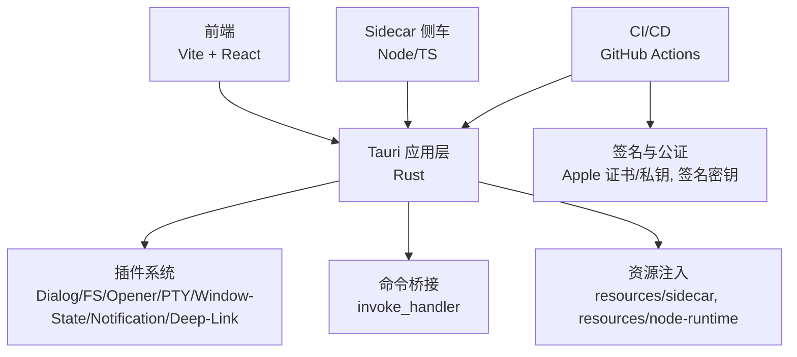
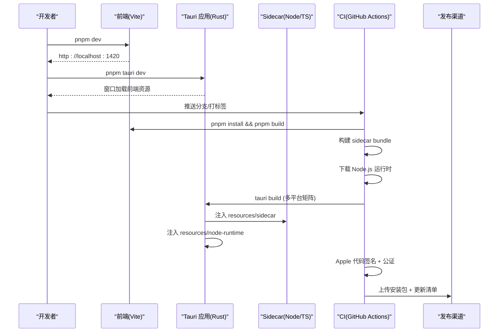
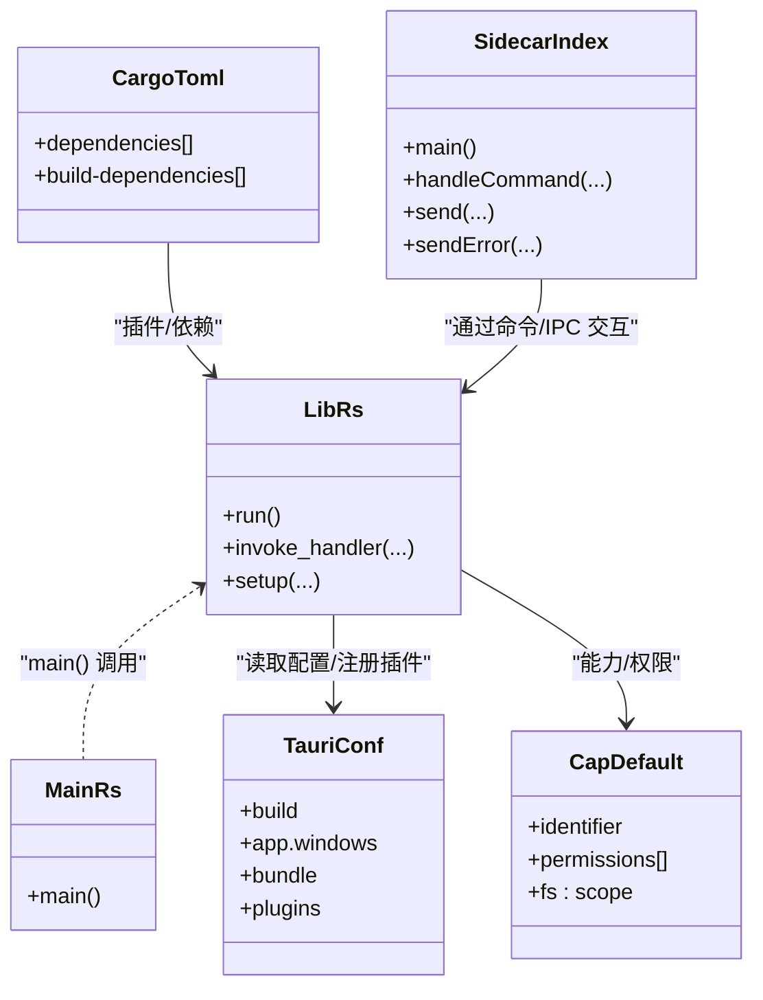
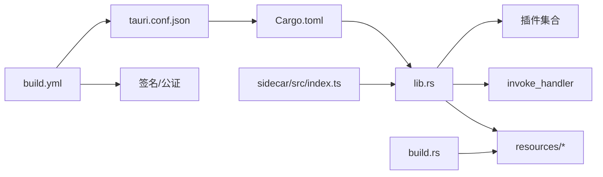

# 打包配置

<cite>
**本文引用的文件**
- [tauri.conf.json](file://src-tauri/tauri.conf.json)
- [Cargo.toml](file://src-tauri/Cargo.toml)
- [default.json](file://src-tauri/capabilities/default.json)
- [Entitlements.plist](file://src-tauri/Entitlements.plist)
- [build.rs](file://src-tauri/build.rs)
- [build.yml](file://.github/workflows/build.yml)
- [package.json](file://package.json)
- [lib.rs](file://src-tauri/src/lib.rs)
- [main.rs](file://src-tauri/src/main.rs)
- [index.ts](file://sidecar/src/index.ts)
- [vite.config.ts](file://vite.config.ts)
- [tsconfig.json](file://tsconfig.json)
</cite>

## 目录
1. [简介](#简介)
2. [项目结构](#项目结构)
3. [核心组件](#核心组件)
4. [架构总览](#架构总览)
5. [详细组件分析](#详细组件分析)
6. [依赖关系分析](#依赖关系分析)
7. [性能考虑](#性能考虑)
8. [故障排除指南](#故障排除指南)
9. [结论](#结论)
10. [附录](#附录)

## 简介
本文件面向 RabbitCoding 的打包与发布配置，围绕 Tauri v2 配置、能力系统（Capabilities）、插件与资源处理、跨平台打包差异、签名与公证、以及前端与侧车（sidecar）协作流程展开，帮助开发者理解并维护稳定的桌面应用构建管线。

## 项目结构
RabbitCoding 采用“前端（Vite + React）+ Tauri 后端（Rust）+ Sidecar（Node/TS）”的混合架构。打包配置集中在 src-tauri/tauri.conf.json，Rust 侧负责窗口、插件、命令与资源注入，GitHub Actions 负责多平台构建与发布。

图表来源
- [tauri.conf.json:12-50](file://src-tauri/tauri.conf.json#L12-L50)
- [lib.rs:196-390](file://src-tauri/src/lib.rs#L196-L390)
- [build.yml:174-196](file://.github/workflows/build.yml#L174-L196)

章节来源
- [tauri.conf.json:1-52](file://src-tauri/tauri.conf.json#L1-L52)
- [Cargo.toml:10-40](file://src-tauri/Cargo.toml#L10-L40)
- [vite.config.ts:1-37](file://vite.config.ts#L1-L37)

## 核心组件
- Tauri 配置中心：定义产品元信息、构建入口、窗口与安全策略、打包目标与资源、平台特定配置（如 macOS Entitlements）。
- 能力系统（Capabilities）：集中声明窗口、权限与作用域，控制前端通过 Tauri API 的访问范围。
- 插件生态：对话框、文件系统、打开器、伪终端、窗口状态、通知、深链。
- 资源与运行时：打包 sidecar 与内置 Node.js 运行时，CI 中下载真实二进制与运行时。
- CI/CD：矩阵化构建 macOS（Intel/aarch64）、Windows（x64/aarch64），签名与公证，生成更新清单。

章节来源
- [tauri.conf.json:6-50](file://src-tauri/tauri.conf.json#L6-L50)
- [default.json:1-41](file://src-tauri/capabilities/default.json#L1-L41)
- [Cargo.toml:20-39](file://src-tauri/Cargo.toml#L20-L39)
- [build.yml:18-196](file://.github/workflows/build.yml#L18-L196)

## 架构总览
下图展示从开发到发布的整体流程，包括前端构建、Tauri 打包、资源注入、侧车与 Node 运行时准备、以及签名与发布。

图表来源
- [vite.config.ts:9-37](file://vite.config.ts#L9-L37)
- [tauri.conf.json:6-11](file://src-tauri/tauri.conf.json#L6-L11)
- [build.yml:66-105](file://.github/workflows/build.yml#L66-L105)
- [build.yml:174-196](file://.github/workflows/build.yml#L174-L196)

## 详细组件分析

### Tauri 配置详解（tauri.conf.json）
- 产品与版本
  - 产品名称、版本、标识符用于打包与系统识别。
- 开发与构建
  - beforeDevCommand、devUrl、beforeBuildCommand、frontendDist 控制开发与构建入口。
- 应用窗口
  - 单一主窗口，标题栏覆盖样式、隐藏标题栏，初始宽高设定。
- 安全策略
  - 当前 CSP 设为 null，需结合前端与插件使用谨慎评估。
- 打包与资源
  - targets 设置为 all，自动构建多平台安装包。
  - resources 显式包含 sidecar 与 node-runtime，确保打包时可用。
  - icon 列表包含多分辨率 PNG 与 icns/ico，满足多平台图标需求。
  - macOS 指定 Entitlements.plist，开启 JIT/动态库加载等能力。
- 插件
  - deep-link 桌面方案配置 rabbitcoding 协议，便于系统集成与回调。

章节来源
- [tauri.conf.json:1-52](file://src-tauri/tauri.conf.json#L1-L52)

### 能力系统（Capabilities）
- 能力标识与描述：default 能力关联 main 窗口。
- 权限集合
  - 核心权限：窗口拖拽、事件、当前显示器/位置/尺寸查询。
  - 打开器：允许打开系统偏好设置等 URL。
  - PTY、对话框、文件系统：读写目录/文件、文本读写、路径作用域放宽至用户家目录与特定子目录。
  - 窗口状态、通知、深链：默认权限。
- 作用域与安全
  - fs:scope 对路径进行白名单约束，避免任意文件访问风险。

章节来源
- [default.json:1-41](file://src-tauri/capabilities/default.json#L1-L41)

### 插件与资源处理
- 插件清单
  - Dialog、FS、Opener、PTY、Window-State、Notification、Deep-Link。
- 资源注入
  - build.rs 在本地开发时确保 resources/sidecar 与 resources/node-runtime 存在占位文件，CI 环境替换为真实产物。
  - CI 步骤复制 sidecar bundle 与 Node 运行时到 resources 目录，验证二进制存在。
- 侧车与 Node 运行时
  - sidecar/src/index.ts 实现 JSON-lines 协议，通过 stdin/stdout 与 Rust 交互。
  - 生产环境注入内置 Node.js 运行时到 PATH，配合 NPM_CONFIG_PREFIX 解决全局安装权限问题。

章节来源
- [Cargo.toml:20-39](file://src-tauri/Cargo.toml#L20-L39)
- [build.rs:1-45](file://src-tauri/build.rs#L1-L45)
- [build.yml:69-105](file://.github/workflows/build.yml#L69-L105)
- [index.ts:1-145](file://sidecar/src/index.ts#L1-L145)
- [lib.rs:226-283](file://src-tauri/src/lib.rs#L226-L283)

### 窗口与菜单配置
- 窗口属性
  - 标题栏样式为 Overlay，隐藏标题栏，提升原生外观一致性。
  - 初始宽高固定，适合编辑器类应用。
- 窗口状态持久化
  - 通过 window-state 插件保存窗口大小与位置，监听 Resized/Moved/CloseRequested 事件触发保存。

章节来源
- [tauri.conf.json:13-21](file://src-tauri/tauri.conf.json#L13-L21)
- [lib.rs:305-329](file://src-tauri/src/lib.rs#L305-L329)

### 跨平台打包差异
- macOS
  - 使用 Entitlements.plist 开启 JIT/可执行内存/库验证豁免/DYLD 环境变量，适配 Node/V8 运行。
  - Apple 证书与 API Key 注入，实现签名与公证自动化。
- Windows
  - 目标矩阵包含 x86_64 与 aarch64，安装包类型由 tauri-action 决定。
- Linux
  - 本仓库未显式配置 Linux 打包目标，若需要可扩展 tauri.conf.json 的 targets 与 CI 矩阵。

章节来源
- [Entitlements.plist:1-19](file://src-tauri/Entitlements.plist#L1-L19)
- [build.yml:24-35](file://.github/workflows/build.yml#L24-L35)
- [tauri.conf.json:26-43](file://src-tauri/tauri.conf.json#L26-L43)

### 图标与元数据配置
- 图标清单
  - 包含 32x32、128x128、128x128@2x、icns、ico，满足多平台与高 DPI 场景。
- 元数据
  - 产品名、版本、标识符在 tauri.conf.json 中统一管理，CI 可按标签或 nightly 规则注入版本号。

章节来源
- [tauri.conf.json:33-39](file://src-tauri/tauri.conf.json#L33-L39)

### 签名证书与更新机制
- Apple 签名与公证
  - 私钥与证书通过环境变量注入，Apple API Key 以文件形式落盘，供 tauri-action 使用。
- 更新清单
  - CI 根据是否为标签构建决定是否启用夜间版更新端点，nightly 时注入更新 JSON 路径。

章节来源
- [build.yml:118-127](file://.github/workflows/build.yml#L118-L127)
- [build.yml:174-196](file://.github/workflows/build.yml#L174-L196)
- [tauri.conf.json:44-50](file://src-tauri/tauri.conf.json#L44-L50)

### 深度链接与协议
- 桌面深链
  - 配置 rabbitcoding 协议，注册到系统，便于外部唤起与回调。
- 注册时机
  - 开发与生产环境均在应用启动时注册所有协议。

章节来源
- [tauri.conf.json:44-49](file://src-tauri/tauri.conf.json#L44-L49)
- [lib.rs:334-340](file://src-tauri/src/lib.rs#L334-L340)

### 前端与开发服务器
- Vite 配置
  - 固定端口 1420，严格端口占用，支持 HMR（可选 host）。
  - 忽略对 src-tauri 的监控，避免不必要的重载。
- 前端构建
  - beforeBuildCommand 与 frontendDist 指向根 dist 目录，确保 Tauri 捕获最新前端资源。

章节来源
- [vite.config.ts:9-37](file://vite.config.ts#L9-L37)
- [tauri.conf.json:6-11](file://src-tauri/tauri.conf.json#L6-L11)

### 类与模块关系（代码级）

图表来源
- [lib.rs:196-390](file://src-tauri/src/lib.rs#L196-L390)
- [main.rs:4-7](file://src-tauri/src/main.rs#L4-L7)
- [index.ts:96-145](file://sidecar/src/index.ts#L96-L145)
- [tauri.conf.json:6-50](file://src-tauri/tauri.conf.json#L6-L50)
- [default.json:1-41](file://src-tauri/capabilities/default.json#L1-L41)
- [Cargo.toml:20-39](file://src-tauri/Cargo.toml#L20-L39)

## 依赖关系分析
- 组件耦合
  - Rust 应用通过插件与命令桥接前端与系统能力；Sidecar 通过标准输入输出与 Rust 通信。
  - CI 与打包配置强耦合：资源目录结构、目标三元组、签名密钥。
- 外部依赖
  - Node/TS 侧车、esbuild 打包、Apple 私钥与证书、GitHub Releases。

图表来源
- [tauri.conf.json:6-50](file://src-tauri/tauri.conf.json#L6-L50)
- [Cargo.toml:20-39](file://src-tauri/Cargo.toml#L20-L39)
- [lib.rs:196-390](file://src-tauri/src/lib.rs#L196-L390)
- [build.rs:1-45](file://src-tauri/build.rs#L1-L45)
- [build.yml:174-196](file://.github/workflows/build.yml#L174-L196)

章节来源
- [Cargo.toml:20-39](file://src-tauri/Cargo.toml#L20-L39)
- [lib.rs:196-390](file://src-tauri/src/lib.rs#L196-L390)
- [build.rs:1-45](file://src-tauri/build.rs#L1-L45)
- [build.yml:174-196](file://.github/workflows/build.yml#L174-L196)

## 性能考虑
- 资源注入与打包
  - 本地开发通过占位文件保证 glob 匹配，CI 替换为真实侧车与 Node 运行时，减少打包体积与构建时间。
- 窗口状态持久化
  - 仅在窗口尺寸/位置变化或关闭时保存，降低磁盘写入频率。
- 插件选择
  - 按需启用插件，避免不必要的系统调用与内存占用。
- Node 运行时注入
  - 将内置 Node 与用户可写 npm-global 放置在 PATH 前，减少查找开销与权限检查。

章节来源
- [build.rs:8-42](file://src-tauri/build.rs#L8-L42)
- [lib.rs:305-329](file://src-tauri/src/lib.rs#L305-L329)
- [lib.rs:253-283](file://src-tauri/src/lib.rs#L253-L283)

## 故障排除指南
- 开发端口冲突
  - Vite 严格端口占用，确保 1420 未被占用；必要时调整或释放占用进程。
- 资源缺失
  - 若 resources/sidecar 或 resources/node-runtime 为空，CI 将无法验证二进制；先在 sidecar 目录执行打包与资源准备。
- 深链注册失败
  - 确认已注册所有协议并在启动时调用注册逻辑。
- macOS 运行时崩溃
  - 检查 Entitlements.plist 是否正确注入，确认 JIT/动态库加载/可执行内存页等权限已开启。
- 更新失败
  - 标签构建与 nightly 的更新端点不同，确认 CI 注入的版本与端点一致。

章节来源
- [vite.config.ts:20-31](file://vite.config.ts#L20-L31)
- [build.yml:106-117](file://.github/workflows/build.yml#L106-L117)
- [lib.rs:334-340](file://src-tauri/src/lib.rs#L334-L340)
- [Entitlements.plist:5-16](file://src-tauri/Entitlements.plist#L5-L16)
- [build.yml:164-172](file://.github/workflows/build.yml#L164-L172)

## 结论
RabbitCoding 的打包配置以 Tauri v2 为核心，结合能力系统与插件生态，实现了跨平台桌面应用的稳定构建与发布。通过 CI 矩阵化构建、资源注入与签名公证，确保了 macOS 与 Windows 的高质量交付。建议在新增功能时同步完善能力声明与资源清单，保持配置与代码的一致性。

## 附录

### 配置模板与最佳实践
- 基础模板要点
  - 在 tauri.conf.json 中统一管理产品名、版本、标识符、窗口与打包资源。
  - 使用 capabilities/default.json 明确权限与作用域，最小化授权原则。
  - 在 Cargo.toml 中按需添加插件，避免冗余依赖。
  - 通过 build.rs 保障本地开发资源占位，CI 中替换为真实产物。
- 最佳实践
  - 为每个平台单独维护 Entitlements.plist 与签名材料。
  - 使用 CI 矩阵构建多目标，确保测试覆盖主流架构。
  - 对于 Node/TS 侧车，采用 esbuild 打包并以 JSON-lines 协议与 Rust 通信。
  - 严格区分 nightly 与正式版本的更新端点与版本号规则。

章节来源
- [tauri.conf.json:1-52](file://src-tauri/tauri.conf.json#L1-L52)
- [default.json:1-41](file://src-tauri/capabilities/default.json#L1-L41)
- [Cargo.toml:20-39](file://src-tauri/Cargo.toml#L20-L39)
- [build.rs:1-45](file://src-tauri/build.rs#L1-L45)
- [build.yml:18-196](file://.github/workflows/build.yml#L18-L196)
- [index.ts:1-145](file://sidecar/src/index.ts#L1-L145)