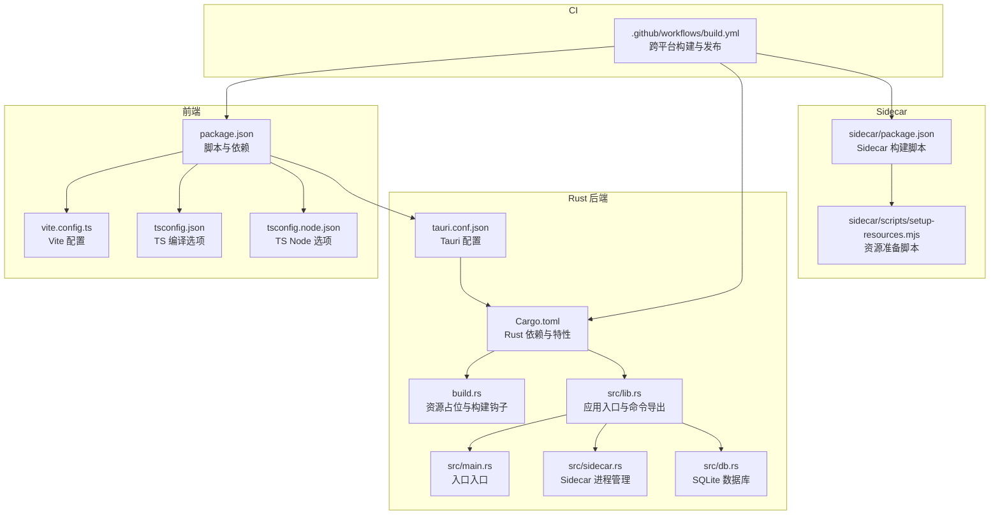
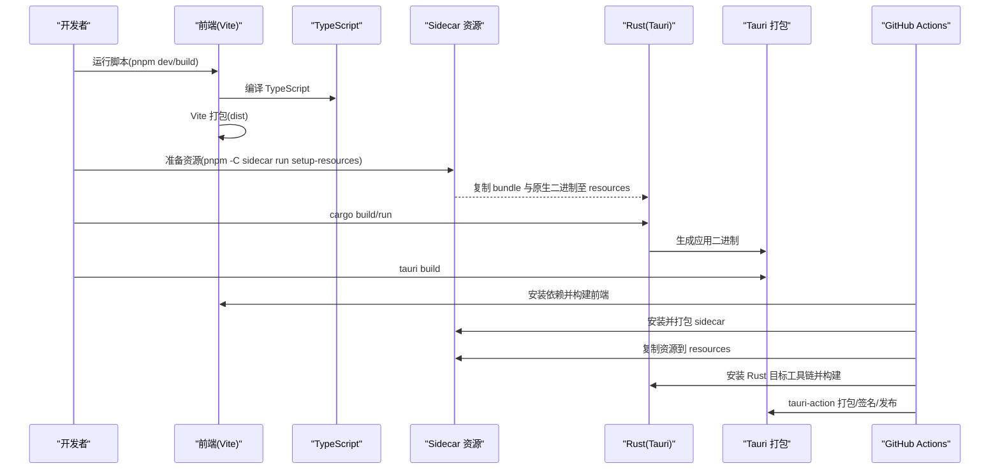
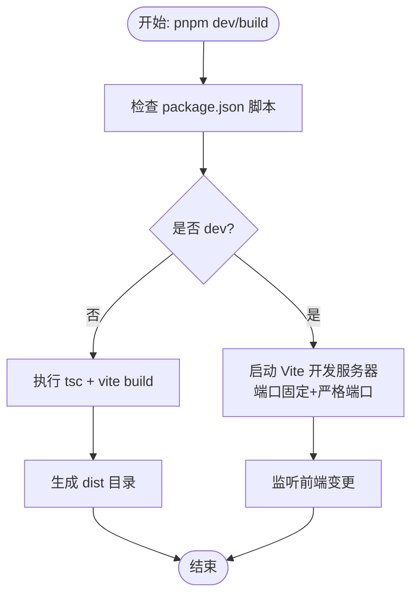
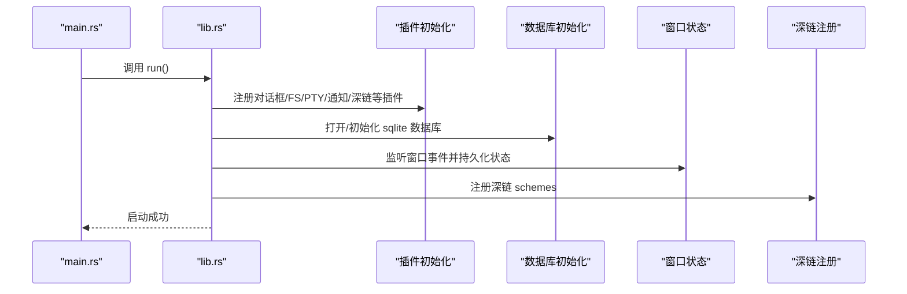
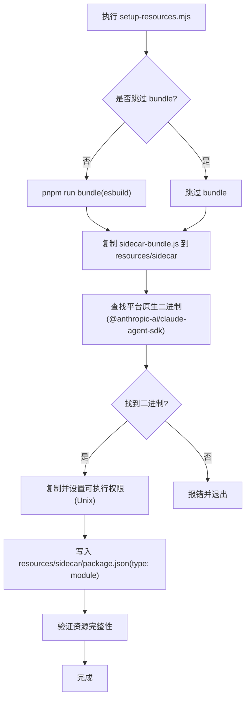
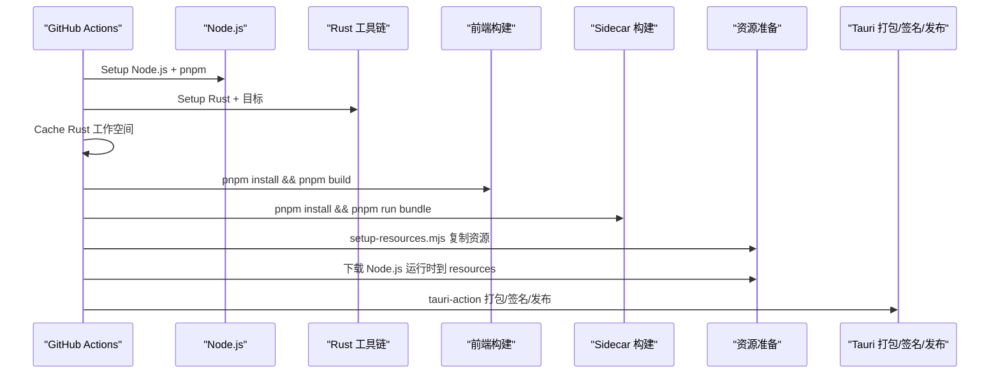
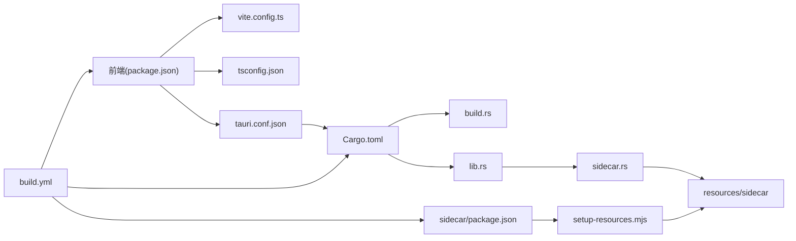

# 构建流程

<cite>
**本文引用的文件**
- [package.json](file://package.json)
- [vite.config.ts](file://vite.config.ts)
- [tsconfig.json](file://tsconfig.json)
- [tsconfig.node.json](file://tsconfig.node.json)
- [src-tauri/Cargo.toml](file://src-tauri/Cargo.toml)
- [src-tauri/tauri.conf.json](file://src-tauri/tauri.conf.json)
- [src-tauri/build.rs](file://src-tauri/build.rs)
- [src-tauri/src/lib.rs](file://src-tauri/src/lib.rs)
- [src-tauri/src/main.rs](file://src-tauri/src/main.rs)
- [src-tauri/src/sidecar.rs](file://src-tauri/src/sidecar.rs)
- [src-tauri/src/db.rs](file://src-tauri/src/db.rs)
- [.github/workflows/build.yml](file://.github/workflows/build.yml)
- [sidecar/package.json](file://sidecar/package.json)
- [sidecar/scripts/setup-resources.mjs](file://sidecar/scripts/setup-resources.mjs)
</cite>

## 目录
1. [简介](#简介)
2. [项目结构](#项目结构)
3. [核心组件](#核心组件)
4. [架构总览](#架构总览)
5. [详细组件分析](#详细组件分析)
6. [依赖关系分析](#依赖关系分析)
7. [性能考虑](#性能考虑)
8. [故障排查指南](#故障排查指南)
9. [结论](#结论)
10. [附录](#附录)

## 简介
本指南面向 RabbitCoding 的构建流程，覆盖前端（Vite + TypeScript）、Rust 后端（Tauri 应用）与 Tauri 打包的完整链路。文档重点说明：
- 构建脚本执行顺序与控制流
- 依赖检查与环境变量配置
- 开发构建与生产构建差异
- 构建优化策略与缓存机制
- 具体命令示例与常见错误处理

## 项目结构
RabbitCoding 采用多包工作区布局：
- 前端应用位于根目录，使用 Vite + React + TailwindCSS + TypeScript
- Rust 后端位于 src-tauri，使用 Tauri 2 作为桌面壳层
- sidecar 子工程负责与外部原生二进制和 Node.js 运行时集成
- GitHub Actions 提供跨平台打包与发布

**图表来源**
- [package.json:1-46](file://package.json#L1-L46)
- [vite.config.ts:1-37](file://vite.config.ts#L1-L37)
- [tsconfig.json:1-26](file://tsconfig.json#L1-L26)
- [tsconfig.node.json:1-11](file://tsconfig.node.json#L1-L11)
- [src-tauri/tauri.conf.json:1-52](file://src-tauri/tauri.conf.json#L1-L52)
- [src-tauri/Cargo.toml:1-40](file://src-tauri/Cargo.toml#L1-L40)
- [src-tauri/build.rs:1-45](file://src-tauri/build.rs#L1-L45)
- [src-tauri/src/lib.rs:1-391](file://src-tauri/src/lib.rs#L1-L391)
- [src-tauri/src/main.rs:1-7](file://src-tauri/src/main.rs#L1-L7)
- [src-tauri/src/sidecar.rs:1-359](file://src-tauri/src/sidecar.rs#L1-L359)
- [src-tauri/src/db.rs:1-417](file://src-tauri/src/db.rs#L1-L417)
- [sidecar/package.json:1-25](file://sidecar/package.json#L1-L25)
- [sidecar/scripts/setup-resources.mjs:1-153](file://sidecar/scripts/setup-resources.mjs#L1-L153)
- [.github/workflows/build.yml:1-196](file://.github/workflows/build.yml#L1-L196)

**章节来源**
- [package.json:1-46](file://package.json#L1-L46)
- [vite.config.ts:1-37](file://vite.config.ts#L1-L37)
- [tsconfig.json:1-26](file://tsconfig.json#L1-L26)
- [tsconfig.node.json:1-11](file://tsconfig.node.json#L1-L11)
- [src-tauri/tauri.conf.json:1-52](file://src-tauri/tauri.conf.json#L1-L52)
- [src-tauri/Cargo.toml:1-40](file://src-tauri/Cargo.toml#L1-L40)
- [src-tauri/build.rs:1-45](file://src-tauri/build.rs#L1-L45)
- [src-tauri/src/lib.rs:1-391](file://src-tauri/src/lib.rs#L1-L391)
- [src-tauri/src/main.rs:1-7](file://src-tauri/src/main.rs#L1-L7)
- [src-tauri/src/sidecar.rs:1-359](file://src-tauri/src/sidecar.rs#L1-L359)
- [src-tauri/src/db.rs:1-417](file://src-tauri/src/db.rs#L1-L417)
- [sidecar/package.json:1-25](file://sidecar/package.json#L1-L25)
- [sidecar/scripts/setup-resources.mjs:1-153](file://sidecar/scripts/setup-resources.mjs#L1-L153)
- [.github/workflows/build.yml:1-196](file://.github/workflows/build.yml#L1-L196)

## 核心组件
- 前端构建（Vite + TypeScript）
  - 使用 Vite 提供开发服务器与生产打包，React 与 TailwindCSS 插件启用
  - TypeScript 通过 bundler 模式编译，配合严格类型检查
- Rust 后端（Tauri 应用）
  - 通过 tauri.conf.json 配置开发/构建入口、窗口与安全策略
  - Cargo.toml 声明依赖与特性，build.rs 注入资源占位确保 Tauri 能 glob 到资源
- Sidecar 集成
  - sidecar/scripts/setup-resources.mjs 负责将 sidecar bundle 与平台原生二进制复制到 Tauri resources
  - src/sidecar.rs 在运行时选择开发/生产模式下的 sidecar 启动方式
- CI 打包与发布
  - GitHub Actions 跨平台构建，下载 Node.js 运行时，注入版本与更新通道，使用 tauri-action 发布

**章节来源**
- [package.json:7-12](file://package.json#L7-L12)
- [vite.config.ts:9-36](file://vite.config.ts#L9-L36)
- [tsconfig.json:2-22](file://tsconfig.json#L2-L22)
- [src-tauri/tauri.conf.json:6-11](file://src-tauri/tauri.conf.json#L6-L11)
- [src-tauri/Cargo.toml:10-39](file://src-tauri/Cargo.toml#L10-L39)
- [src-tauri/build.rs:6-44](file://src-tauri/build.rs#L6-L44)
- [sidecar/scripts/setup-resources.mjs:33-133](file://sidecar/scripts/setup-resources.mjs#L33-L133)
- [src-tauri/src/sidecar.rs:287-358](file://src-tauri/src/sidecar.rs#L287-L358)
- [.github/workflows/build.yml:45-195](file://.github/workflows/build.yml#L45-L195)

## 架构总览
整体构建流程分为“前端构建 → Sidecar 资源准备 → Rust 应用构建 → Tauri 打包”四个阶段，CI 中还包含“Node.js 运行时注入与签名公证”。

**图表来源**
- [package.json:7-12](file://package.json#L7-L12)
- [sidecar/package.json:6-11](file://sidecar/package.json#L6-L11)
- [sidecar/scripts/setup-resources.mjs:105-133](file://sidecar/scripts/setup-resources.mjs#L105-L133)
- [src-tauri/build.rs:1-4](file://src-tauri/build.rs#L1-L4)
- [.github/workflows/build.yml:66-195](file://.github/workflows/build.yml#L66-L195)

## 详细组件分析

### 前端构建（Vite + TypeScript）
- 脚本与入口
  - 开发：pnpm dev 启动 Vite 开发服务器
  - 构建：pnpm build 先执行 tsc，再执行 vite build 产出 dist
  - 预览：pnpm preview 本地预览生产包
- Vite 配置要点
  - 固定端口与严格端口占用，防止冲突
  - HMR 支持可通过 TAURI_DEV_HOST 环境变量启用远程主机
  - 忽略监听 src-tauri 目录，避免不必要的热更新
- TypeScript 配置
  - bundler 模式、ESNext 模块解析、严格类型检查
  - 与 Vite/Tauri 集成良好，避免 emit 输出交由 Vite 处理

**图表来源**
- [package.json:7-12](file://package.json#L7-L12)
- [vite.config.ts:9-36](file://vite.config.ts#L9-L36)
- [tsconfig.json:2-22](file://tsconfig.json#L2-L22)

**章节来源**
- [package.json:7-12](file://package.json#L7-L12)
- [vite.config.ts:9-36](file://vite.config.ts#L9-L36)
- [tsconfig.json:2-22](file://tsconfig.json#L2-L22)
- [tsconfig.node.json:1-11](file://tsconfig.node.json#L1-L11)

### Rust 后端与 Tauri 配置
- 应用入口
  - main.rs 仅调用 lib::run，集中于 src/lib.rs
  - lib.rs 初始化插件、数据库、窗口状态、深链注册等
- 构建配置
  - Cargo.toml 声明 tauri、插件、Tokio、rusqlite 等依赖
  - build.rs 在本地编译时创建 resources 占位文件，确保 CI 前后一致性
- Tauri 配置
  - beforeDevCommand 与 beforeBuildCommand 分别指向前端开发与构建脚本
  - devUrl 指向 Vite 默认端口
  - bundle.resources 指定 sidecar 与 node-runtime 资源路径

**图表来源**
- [src-tauri/src/main.rs:1-7](file://src-tauri/src/main.rs#L1-L7)
- [src-tauri/src/lib.rs:196-390](file://src-tauri/src/lib.rs#L196-L390)
- [src-tauri/Cargo.toml:20-39](file://src-tauri/Cargo.toml#L20-L39)
- [src-tauri/build.rs:6-44](file://src-tauri/build.rs#L6-L44)
- [src-tauri/tauri.conf.json:6-11](file://src-tauri/tauri.conf.json#L6-L11)

**章节来源**
- [src-tauri/src/main.rs:1-7](file://src-tauri/src/main.rs#L1-L7)
- [src-tauri/src/lib.rs:196-390](file://src-tauri/src/lib.rs#L196-L390)
- [src-tauri/Cargo.toml:10-39](file://src-tauri/Cargo.toml#L10-L39)
- [src-tauri/build.rs:1-45](file://src-tauri/build.rs#L1-L45)
- [src-tauri/tauri.conf.json:1-52](file://src-tauri/tauri.conf.json#L1-L52)

### Sidecar 资源准备与运行模式
- 资源准备脚本
  - 自动 bundle sidecar 并复制到 src-tauri/resources/sidecar
  - 从 SDK optionalDependencies 或 pnpm store 解析平台原生二进制并复制
  - 生成 resources/sidecar/package.json（type: module）以兼容 ESM
- 运行模式
  - 开发模式：优先使用 node 运行 sidecar/dist/index.js；若无 dist 则使用 npx tsx 直接运行 TypeScript
  - 生产模式：使用内置 Node.js 运行 resources/sidecar/sidecar-bundle.js

**图表来源**
- [sidecar/scripts/setup-resources.mjs:33-133](file://sidecar/scripts/setup-resources.mjs#L33-L133)
- [src-tauri/src/sidecar.rs:287-358](file://src-tauri/src/sidecar.rs#L287-L358)

**章节来源**
- [sidecar/scripts/setup-resources.mjs:1-153](file://sidecar/scripts/setup-resources.mjs#L1-L153)
- [src-tauri/src/sidecar.rs:1-359](file://src-tauri/src/sidecar.rs#L1-L359)

### CI 构建与发布
- 多目标矩阵：macOS(aarch64/x86_64)、Windows(x86_64/aarch64)
- 关键步骤
  - 安装 pnpm、Node.js、Rust 工具链与目标
  - 缓存 Rust 工作空间
  - 安装根依赖与 sidecar 依赖并打包
  - 复制 sidecar bundle 与原生二进制到 resources
  - 下载 Node.js 运行时并放入 resources/node-runtime
  - 注入版本号与更新通道（nightly 使用基于日期的预发布段）
  - 使用 tauri-action 打包、签名与发布

**图表来源**
- [.github/workflows/build.yml:45-195](file://.github/workflows/build.yml#L45-L195)

**章节来源**
- [.github/workflows/build.yml:1-196](file://.github/workflows/build.yml#L1-L196)

## 依赖关系分析
- 前端对 Tauri 的依赖通过 tauri.conf.json 的 beforeDevCommand/beforeBuildCommand 串联
- Rust 侧通过 build.rs 确保资源目录存在，避免 Tauri 打包时找不到资源
- sidecar 二进制与 bundle 通过 setup-resources.mjs 注入到 resources，供运行时使用
- CI 通过 pnpm action 与 rust-cache 提升安装与编译效率

**图表来源**
- [package.json:7-12](file://package.json#L7-L12)
- [vite.config.ts:9-36](file://vite.config.ts#L9-L36)
- [tsconfig.json:2-22](file://tsconfig.json#L2-L22)
- [src-tauri/tauri.conf.json:6-11](file://src-tauri/tauri.conf.json#L6-L11)
- [src-tauri/Cargo.toml:10-39](file://src-tauri/Cargo.toml#L10-L39)
- [src-tauri/build.rs:6-44](file://src-tauri/build.rs#L6-L44)
- [src-tauri/src/lib.rs:196-390](file://src-tauri/src/lib.rs#L196-L390)
- [src-tauri/src/sidecar.rs:287-358](file://src-tauri/src/sidecar.rs#L287-L358)
- [sidecar/package.json:6-11](file://sidecar/package.json#L6-L11)
- [sidecar/scripts/setup-resources.mjs:105-133](file://sidecar/scripts/setup-resources.mjs#L105-L133)
- [.github/workflows/build.yml:45-195](file://.github/workflows/build.yml#L45-L195)

**章节来源**
- [package.json:7-12](file://package.json#L7-L12)
- [vite.config.ts:9-36](file://vite.config.ts#L9-L36)
- [tsconfig.json:2-22](file://tsconfig.json#L2-L22)
- [src-tauri/tauri.conf.json:6-11](file://src-tauri/tauri.conf.json#L6-L11)
- [src-tauri/Cargo.toml:10-39](file://src-tauri/Cargo.toml#L10-L39)
- [src-tauri/build.rs:6-44](file://src-tauri/build.rs#L6-L44)
- [src-tauri/src/lib.rs:196-390](file://src-tauri/src/lib.rs#L196-L390)
- [src-tauri/src/sidecar.rs:287-358](file://src-tauri/src/sidecar.rs#L287-L358)
- [sidecar/package.json:6-11](file://sidecar/package.json#L6-L11)
- [sidecar/scripts/setup-resources.mjs:105-133](file://sidecar/scripts/setup-resources.mjs#L105-L133)
- [.github/workflows/build.yml:45-195](file://.github/workflows/build.yml#L45-L195)

## 性能考虑
- Vite/HMR 与严格端口
  - 固定端口与严格端口避免端口竞争，提升开发体验
  - HMR 可通过 TAURI_DEV_HOST 启用远程主机，便于网络联调
- TypeScript 编译
  - 使用 bundler 模式与 noEmit，由 Vite emit，减少重复编译
  - 严格模式与未使用检查有助于早期发现性能与质量隐患
- Rust 编译缓存
  - CI 使用 rust-cache 缓存工作空间，显著缩短编译时间
- 资源准备
  - 本地编译时通过 build.rs 创建占位文件，避免 CI 与本地差异导致的反复构建
- Node.js 运行时
  - 生产模式注入内置 Node.js 运行时，避免系统 Node 版本差异带来的不稳定

**章节来源**
- [vite.config.ts:18-35](file://vite.config.ts#L18-L35)
- [tsconfig.json:2-22](file://tsconfig.json#L2-L22)
- [.github/workflows/build.yml:60-64](file://.github/workflows/build.yml#L60-L64)
- [src-tauri/build.rs:6-44](file://src-tauri/build.rs#L6-L44)
- [src-tauri/src/lib.rs:226-283](file://src-tauri/src/lib.rs#L226-L283)

## 故障排查指南
- 前端构建失败
  - 确认 pnpm 版本与 packageManager 一致，使用 pnpm install 安装依赖
  - 若 tsc 报错，检查 tsconfig.json 的模块解析与严格模式配置
  - Vite 端口被占用时，确保 1420/1421 未被占用或调整 strictPort
- Sidecar 资源缺失
  - 执行 pnpm -C sidecar run setup-resources，确保 sidecar-bundle.js 与原生二进制存在
  - 如原生二进制未找到，先在 sidecar 目录安装依赖（含 optionalDependencies）
- Rust 构建失败
  - 检查 Rust 工具链与目标三元组是否正确安装
  - 本地编译时确认 resources 目录存在（build.rs 会创建占位文件）
- Tauri 打包失败
  - 确认 beforeDevCommand/beforeBuildCommand 与实际脚本一致
  - 检查 tauri.conf.json 中 frontendDist 与资源路径
- CI 失败
  - 核对 pnpm/action-setup 与 Rust 工具链安装步骤
  - 验证 Node.js 运行时下载与解压逻辑，确保 resources/node-runtime 存在
  - macOS 签名与公证需提供证书与 API Key 相关密钥

**章节来源**
- [package.json:7-12](file://package.json#L7-L12)
- [sidecar/scripts/setup-resources.mjs:33-133](file://sidecar/scripts/setup-resources.mjs#L33-L133)
- [src-tauri/build.rs:6-44](file://src-tauri/build.rs#L6-L44)
- [src-tauri/tauri.conf.json:6-11](file://src-tauri/tauri.conf.json#L6-L11)
- [.github/workflows/build.yml:45-195](file://.github/workflows/build.yml#L45-L195)

## 结论
RabbitCoding 的构建体系围绕“前端 Vite + TypeScript、Rust Tauri 后端、Sidecar 资源与 CI 打包”形成闭环。通过明确的脚本顺序、严格的配置与缓存策略，可在本地与 CI 稳定地产出跨平台应用。建议在团队中统一 pnpm 与 Rust 工具链版本，规范资源准备流程，以降低构建差异带来的风险。

## 附录

### 开发构建与生产构建对比
- 开发构建
  - 前端：pnpm dev → Vite 开发服务器 + HMR
  - 后端：cargo run → Tauri 应用运行，加载本地 sidecar bundle
- 生产构建
  - 前端：pnpm build → 产出 dist
  - Sidecar：pnpm -C sidecar run setup-resources → 复制 bundle 与原生二进制
  - 后端：cargo build → Tauri 应用二进制
  - 打包：tauri build → 生成平台安装包

**章节来源**
- [package.json:7-12](file://package.json#L7-L12)
- [sidecar/package.json:6-11](file://sidecar/package.json#L6-L11)
- [sidecar/scripts/setup-resources.mjs:105-133](file://sidecar/scripts/setup-resources.mjs#L105-L133)
- [src-tauri/src/sidecar.rs:287-358](file://src-tauri/src/sidecar.rs#L287-L358)

### 关键命令清单
- 开发
  - pnpm dev
  - pnpm -C sidecar run setup-resources
- 构建
  - pnpm build
  - pnpm -C sidecar run bundle
  - pnpm -C sidecar run setup-resources
  - pnpm tauri
- 预览
  - pnpm preview

**章节来源**
- [package.json:7-12](file://package.json#L7-L12)
- [sidecar/package.json:6-11](file://sidecar/package.json#L6-L11)